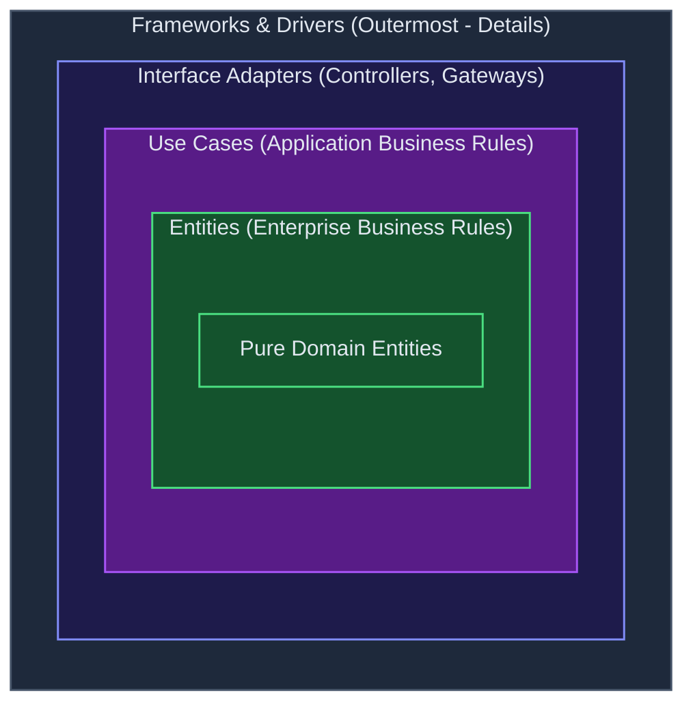

# Chapters 21–25: Screaming, Clean & Testable Architecture

> _"Your architecture should tell readers about the system, not about the frameworks you used."_

## 🎓 For New Learners

### Chapter 21: Screaming Architecture

When you look at a well-structured system's top-level folder structure, what should you see?

**Wrong (framework-centric):**
```
src/
  controllers/
  services/
  repositories/
  models/
  config/
```

This screams "Spring MVC." It tells you nothing about what the application *does*.

**Right (use-case-centric):**
```
src/
  orders/
    PlaceOrderUseCase.java
    CancelOrderUseCase.java
    Order.java
    OrderRepository.java
  billing/
    ProcessPaymentUseCase.java
    Invoice.java
  customers/
    RegisterCustomerUseCase.java
    Customer.java
```

This screams "e-commerce order system." The framework is an implementation detail, hidden below the top level.

**The analogy**: a building's blueprints tell you it's a library (study carrels, book stacks, quiet zones) — not "this building uses steel-frame construction." The purpose is the architecture. The materials are details.

### Chapter 26: The Clean Architecture

Martin synthesizes everything into the definitive model — **four concentric rings**:



**The Dependency Rule**: Source code dependencies can only point **inward**. Nothing in an inner ring can know anything about an outer ring.

**The rings:**
1. **Entities** — enterprise-wide business rules; pure domain objects
2. **Use Cases** — application-specific business rules; orchestrate entities
3. **Interface Adapters** — convert data between use cases and external formats (controllers, presenters, gateways)
4. **Frameworks & Drivers** — the outermost ring; Spring, databases, web servers, UIs

### Chapter 22: Testable Architecture

If the dependency rule is followed, the inner rings are testable **without any outer ring infrastructure**:

- **Entities**: test with plain JUnit; no database, no Spring, no HTTP
- **Use Cases**: test with mock/stub implementations of gateways; no database, no Spring
- **Interface Adapters**: test with Spring's MockMvc or simple unit tests; no real database
- **Frameworks & Drivers**: integration tests that test the full stack

The architecture enables a **testing pyramid** that is actually fast at the bottom:

```
     △  E2E (slow, few)
    △△△  Integration (medium)
  △△△△△  Use case + domain unit tests (fast, many)  ← most tests here
```

### Chapter 23: Humble Objects

A **Humble Object** is an object stripped of all logic — so humble it's hardly worth testing. All the testable logic is extracted to a collaborator that can be tested without the hard-to-test environment.

The classic example: GUI presenters.

- **View** (Humble Object): just renders whatever data the Presenter gives it; no logic; no tests needed
- **Presenter** (testable): formats the data, applies display rules, constructs view models; fully unit-testable

```java
// Humble View — just renders; no logic; no tests
class OrderView {
    void render(OrderViewModel viewModel) {
        totalLabel.setText(viewModel.formattedTotal());
        statusBadge.setColor(viewModel.statusColor());
    }
}

// Testable Presenter — all the display logic lives here
class OrderPresenter {
    public OrderViewModel present(Order order) {
        return new OrderViewModel(
            formatCurrency(order.getTotal()),
            resolveStatusColor(order.getStatus())
        );
    }
    // Full unit tests — no UI framework needed
}
```

The Humble Object pattern appears everywhere:
- **Database gateways**: the repository interface is testable; the JPA adapter is humble
- **Service proxies**: the service interface is testable; the HTTP client is humble
- **Message consumers**: the handler logic is testable; the Kafka listener is humble

### Chapters 24–25: Partial Boundaries & Layers and Boundaries

Sometimes full boundary implementation (separate components with interfaces and adapters) is too expensive for the current stage of the project.

**Partial boundaries** are strategies to get most of the benefit with less overhead:

1. **One-dimensional boundary**: Use an interface without a separate component; the service and its interface live in the same compilation unit
2. **Facade pattern**: A single class acts as the boundary without a full interface hierarchy
3. **Skip the last step**: Implement the full structure but deploy as a single component — ready to split when needed

The key: **anticipate the boundary**. Even if you implement it as a "partial," design the code so splitting it later is cheap.

---

## 🔬 Senior Deep Dive

### The Clean Architecture in a Spring Boot Project

Mapping the four rings to a Spring Boot project structure:

**Ring 1 — Entities (domain module):**
```java
// com.example.domain.order
public class Order {                    // no @Entity, no Spring annotations
    private final OrderId id;
    private final List<LineItem> items;
    private OrderStatus status;
    private final List<DomainEvent> domainEvents = new ArrayList<>();

    public void place() {
        if (items.isEmpty()) throw new EmptyOrderException();
        this.status = OrderStatus.PLACED;
        domainEvents.add(new OrderPlacedEvent(id));
    }
}
```

**Ring 2 — Use Cases (application module):**
```java
// com.example.application.order
public class PlaceOrderUseCase {
    private final OrderRepository orderRepository;  // interface only
    private final EventPublisher eventPublisher;    // interface only

    public PlaceOrderResult execute(PlaceOrderCommand cmd) {
        Order order = Order.create(cmd.customerId(), cmd.items());
        order.place();
        orderRepository.save(order);
        order.pullEvents().forEach(eventPublisher::publish);
        return PlaceOrderResult.success(order.getId());
    }
}
```

**Ring 3 — Interface Adapters (adapter module):**
```java
// com.example.adapter.web
@RestController
public class OrderController {
    private final PlaceOrderUseCase placeOrderUseCase;

    @PostMapping("/orders")
    public ResponseEntity<PlaceOrderResponse> placeOrder(
            @RequestBody @Valid PlaceOrderRequest request) {
        PlaceOrderCommand cmd = PlaceOrderCommandMapper.from(request);
        PlaceOrderResult result = placeOrderUseCase.execute(cmd);
        return ResponseEntity.ok(PlaceOrderResponse.from(result));
    }
}

// com.example.adapter.persistence
@Repository
public class JpaOrderRepository implements OrderRepository {  // implements domain interface
    private final SpringDataOrderRepository springRepo;

    public void save(Order order) {
        OrderJpaEntity entity = OrderJpaMapper.toJpa(order);
        springRepo.save(entity);
    }
}
```

**Ring 4 — Frameworks & Drivers (infrastructure module):**
```java
// Spring Boot main class, DataSource configuration, Kafka config
@SpringBootApplication
public class EcommerceApplication {
    public static void main(String[] args) {
        SpringApplication.run(EcommerceApplication.class, args);
    }
}
```

### Crossing Boundaries: The Data Flow

Data flowing inward must be converted at each boundary:

```
HTTP Request (JSON)
    ↓ [Controller: JSON → PlaceOrderCommand]
PlaceOrderCommand (use case input DTO)
    ↓ [Use Case: command → domain operations]
Order (domain entity)
    ↓ [Repository Adapter: domain entity → JPA entity]
OrderJpaEntity (persistence model)
    ↓ [Database]
```

Each conversion is explicit. No domain entity ever reaches the database. No JPA entity ever reaches the use case. No HTTP request body ever reaches the domain.

### Testing Strategy per Ring

```java
// Ring 1: Domain entity test — pure JUnit, no Spring
@Test void orderCanBePlaced() {
    Order order = Order.create(customerId, List.of(item));
    order.place();
    assertThat(order.getStatus()).isEqualTo(OrderStatus.PLACED);
    assertThat(order.pullEvents()).hasSize(1);
}

// Ring 2: Use case test — JUnit + Mockito, no Spring
@Test void placeOrderPublishesEvent() {
    var repo = mock(OrderRepository.class);
    var publisher = mock(EventPublisher.class);
    var useCase = new PlaceOrderUseCase(repo, publisher);

    useCase.execute(new PlaceOrderCommand(customerId, items));

    verify(repo).save(any(Order.class));
    verify(publisher).publish(any(OrderPlacedEvent.class));
}

// Ring 3: Controller test — Spring MVC test slice
@WebMvcTest(OrderController.class)
class OrderControllerTest {
    @MockBean PlaceOrderUseCase placeOrderUseCase;

    @Test void returnsOkOnSuccess() throws Exception {
        when(placeOrderUseCase.execute(any())).thenReturn(successResult());
        mockMvc.perform(post("/orders").contentType(APPLICATION_JSON).content(validBody()))
               .andExpect(status().isOk());
    }
}

// Ring 4: Integration test — full Spring context + real DB
@SpringBootTest @Testcontainers
class PlaceOrderIntegrationTest { ... }
```

---

## Summary

| Chapter | Key Concept |
|---|---|
| 21: Screaming Architecture | Top-level structure should reveal use cases, not frameworks |
| 26: Clean Architecture | Four rings; dependency rule: source deps point inward |
| 22: Testable Architecture | Inner rings are independently testable; outer rings need integration tests |
| 23: Humble Objects | Strip logic from hard-to-test objects; put logic in testable collaborators |
| 24–25: Partial Boundaries | Full boundary anticipation + partial implementation = evolution-ready code |
