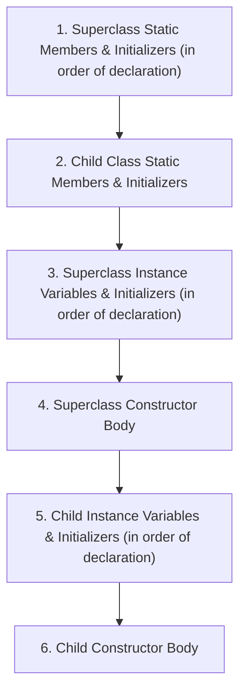

# Chapter 6 — Class Design

<span class="chapter-badge">Exam Domain: Using Object-Oriented Concepts in Java</span>

> **Key Topics:** Inheritance relationships, single vs. multiple inheritance, the `Object` class, constructor chaining rules, `this()` and `super()`, order of initialization (static and instance), method overriding rules, covariant return types, method hiding (`static`), field hiding (non-polymorphic fields), `abstract` classes/methods, and creating immutable objects via defensive copying.

---

## 🟦 New Learner: Inheritance, Constructors, & Class Basics

### Inheritance Basics
Inheritance is the mechanism by which a *subclass* (child class) automatically includes accessible members (fields and methods) defined in a *superclass* (parent class).
* **Transitive Nature:** If class `X` extends `Y`, and `Y` extends `Z`, then `X` is an indirect subclass of `Z`, automatically inheriting all accessible members of both `Y` and `Z`.
* **Access Control Boundaries:**
  * `public` and `protected` members are always inherited.
  * Package-private (default) members are inherited *only* if the subclass is in the same package as the parent.
  * `private` members are never inherited and cannot be directly accessed by subclasses.

```java
// Parent.java
package p1;
public class Parent {
    private int privateVar = 1;
    int packageVar = 2;
    protected int protectedVar = 3;
    public int publicVar = 4;
}

// Child.java
package p2; // Different package!
import p1.Parent;
public class Child extends Parent {
    public void testAccess() {
        // System.out.println(privateVar);   // ❌ DOES NOT COMPILE (private)
        // System.out.println(packageVar);   // ❌ DOES NOT COMPILE (different package)
        System.out.println(protectedVar);    // ✅ Compiles (inherited protected variable)
        System.out.println(publicVar);       // ✅ Compiles (inherited public variable)
    }
}
```

### Single vs. Multiple Inheritance
* **Single Inheritance:** Java classes can only directly extend one class. Multiple inheritance of classes (e.g., `class Dog extends Canine, Domestic`) is forbidden in Java to prevent method resolution conflicts (the Diamond Problem).
* **Multiple Interface Inheritance:** A class may implement multiple interfaces (discussed in Chapter 7).
* **Root of All Classes:** Every class in Java (except `java.lang.Object` itself) implicitly extends `java.lang.Object` if no explicit parent class is declared.

### The `this` and `super` References
* `this` refers to the current instance of the class and can access any member (declared or inherited).
* `super` refers directly to the parent class scope, bypassing overrides or hidden members in the child class.
* **Static Context Restriction:** Neither `this` nor `super` can be used inside static methods or static initializers, as static members belong to the class, not an object instance.

```java
class Parent {
    String name = "Parent";
}
public class Child extends Parent {
    String name = "Child"; // Hides parent name

    public void printNames() {
        System.out.println(name);       // Child (resolves to narrowest scope)
        System.out.println(this.name);  // Child
        System.out.println(super.name); // Parent
    }
}
```

---

### Declaring Constructors
A constructor is a special block of code that initializes a new object.
1. **Name:** Must match the class name exactly (case-sensitive).
2. **Return Type:** Must not declare *any* return type, not even `void`. If it has a return type, Java treats it as a standard method.
3. **Parameters:** Can declare any type except `var`.

```java
public class Bunny {
    public Bunny() {} // ✅ Valid constructor
    public bunny() {} // ❌ DOES NOT COMPILE (case mismatch; lacks return type)
    public void Bunny() {} // ✅ Valid method, but NOT a constructor!
}
```

### The Default Constructor
If you write a class with **no** constructors, the Java compiler automatically generates a `public` no-argument constructor with an empty body:
```java
public class Rabbit {} // Compiler automatically adds: public Rabbit() { super(); }
```
> [!IMPORTANT]
> If you declare **any** constructor (even private or parameterized), the compiler will **not** insert the default no-argument constructor.

```java
public class Elephant {
    public Elephant(int age) {}
}
// Elephant e = new Elephant(); // ❌ DOES NOT COMPILE! No no-arg constructor exists.
```

### Calling Constructors with `this()` and `super()`
* **`this()`:** Calls another overloaded constructor in the same class.
* **`super()`:** Calls a constructor in the direct parent class.

#### Structural Constraints:
* The call to `this()` or `super()` **must be the very first statement** in a constructor.
* You cannot call both `this()` and `super()` in the same constructor.
* If a constructor does not contain an explicit call to `this()` or `super()`, the compiler automatically inserts `super();` (a call to the parent's no-argument constructor) as the first line.

```java
class Mammal {
    public Mammal(int age) {} // No no-arg constructor!
}

class Seal extends Mammal {
    public Seal() {
        // super(); // ❌ Compiler inserts this, but Mammal has no no-arg constructor!
    }
    
    public Seal(int age) {
        super(age); // ✅ Compiles because it explicitly calls Mammal(int)
    }
}
```

* **Constructor Cycles:** The compiler detects and rejects recursive constructor calls (infinite loops).
```java
public class Cycle {
    public Cycle() { this(5); }    // ❌ DOES NOT COMPILE (Cyclic constructor calls)
    public Cycle(int x) { this(); } // ❌ DOES NOT COMPILE
}
```

---

## 🟣 Senior Deep Dive: Initialization, Overriding, Hiding, & Immutability

### Class and Instance Initialization Order
When an object is instantiated, initialization occurs in a rigid order:



> [!NOTE]
> Static initialization runs exactly **once** when the class is first loaded by the JVM. Instance initialization runs every time a new instance is created with `new`.

#### Complex Trace Example
```java
class Parent {
    static { System.out.print("1"); }
    { System.out.print("3"); }
    public Parent() { System.out.print("4"); }
}
class Child extends Parent {
    static { System.out.print("2"); }
    { System.out.print("5"); }
    public Child() { System.out.print("6"); }
}
// Execution of: new Child();
// Prints: 123456
```

---

### Initializing `final` Fields
`final` fields cannot be reassigned once initialized.
* **`static final` variables:** Must be assigned a value exactly once, either at declaration or inside a `static` initializer block.
* **Instance `final` variables:** Must be assigned a value exactly once, either at declaration, in an instance initializer block, or **by the time every constructor completes**.

```java
public class finalExample {
    private final int x;
    private final int y = 2; // Assigned at declaration
    private final int z;

    {
        x = 1; // Assigned in instance initializer
    }

    public finalExample() {
        z = 3; // Assigned in constructor
    }

    public finalExample(int value) {
        z = value; // Assigned in overloaded constructor
    }
    
    public finalExample(String s) {
        // z is never assigned! ❌ DOES NOT COMPILE
    }
}
```

---

### Method Overriding Rules (Deep Dive)
Overriding occurs when a subclass redefines an inherited instance method. The Java compiler strictly enforces **four rules**:

| Rule | Requirement | Detail & Exceptions |
| :--- | :--- | :--- |
| **1. Signature** | Must match the parent method exactly. | Must have the same method name and argument list (types and order). |
| **2. Access Level**| Must be same or broader than the parent method.| Parent `protected` can be overridden as `protected` or `public`. It cannot be overridden as package-private or `private`. |
| **3. Exceptions** | Cannot throw new or broader **checked** exceptions. | May throw *narrower* checked exceptions, any *unchecked* (runtime) exceptions, or omit them entirely. |
| **4. Return Type** | Must be same or **covariant** return type. | If parent returns type `T`, child must return `T` or a subclass of `T`. If parent returns a primitive (e.g. `int`), child must match exactly. |

```java
import java.io.*;

class Parent {
    protected Number process() throws IOException {
        return 10;
    }
}

class Child extends Parent {
    // ✅ Compiles: public is wider, Integer is covariant to Number,
    // FileNotFoundException is narrower than IOException.
    @Override
    public Integer process() throws FileNotFoundException {
        return 20;
    }
}
```

> [!WARNING]
> If a parent method return type is `void`, the overriding child method **must** also return `void`. Nothing is covariant with `void`.

---

### Redeclaring `private` Methods vs. Method Hiding
* **Redeclaring `private` methods:** `private` methods are not inherited. A child class can declare a method with the same signature, but it is an independent method. None of the overriding rules (like access modifiers or return types) apply.
* **Method Hiding (`static` methods):** If a child class defines a `static` method with the same signature as an inherited parent `static` method, it hides it.
  * **Rule 5 of Method Hiding:** You cannot override a static method with an instance method, nor can you hide an instance method with a static method. Both must be static (hiding) or both must be instance (overriding).

```java
class Parent {
    public static void printStatic() { System.out.println("Parent Static"); }
    public void printInstance() { System.out.println("Parent Instance"); }
}
class Child extends Parent {
    // public void printStatic() {}       // ❌ DOES NOT COMPILE (Instance cannot override static)
    // public static void printInstance() {} // ❌ DOES NOT COMPILE (Static cannot hide instance)
    
    public static void printStatic() { System.out.println("Child Static"); } // ✅ Hides parent static
}
```

---

### Variable Hiding (Non-Polymorphic Fields)
:::caution[Variables (fields) are never overridden — they are only hidden.] 
While method calls are resolved at runtime based on the actual object type (polymorphism), variable references are resolved at compile time based on the **reference variable type**.
:::

```java
class Parent {
    public String value = "Parent";
}
class Child extends Parent {
    public String value = "Child"; // Hides parent field
}

public class Main {
    public static void main(String[] args) {
        Child child = new Child();
        Parent parent = child; // Polymorphic assignment
        
        System.out.println(child.value);  // Child
        System.out.println(parent.value); // Parent (Compiled reference type is Parent)
    }
}
```

---

### Abstract Classes & Methods
An `abstract` class is a class template that cannot be instantiated and may declare `abstract` methods (methods without a body).
* **Abstract Method Rules:**
  * Must end in a semicolon (`;`), not a body enclosed in braces (`{}`).
  * Can only be declared within an `abstract` class or interface.
  * Cannot be marked `private`, `final`, or `static` (since they must be overridden to be implemented).
* **Concrete Subclass Responsibility:** The first non-abstract (concrete) class that extends an abstract class **must** implement all inherited abstract methods.

```java
public abstract class Animal {
    public abstract void eat(); // Semicolon, no body
    // public abstract void sleep() {} // ❌ DOES NOT COMPILE (abstract methods cannot have bodies)
}

public class Lion extends Animal {
    // First concrete subclass must implement eat()
    @Override
    public void eat() {
        System.out.println("Lion eats meat");
    }
}
```

---

### Designing Immutable Classes
An immutable class is designed so that its state cannot change after instantiation.
1. **No Setters:** Do not define any setter methods.
2. **Private & Final:** Mark all instance fields `private` and `final`.
3. **Prevent Subclassing:** Mark the class `final` (or make all constructors `private`).
4. **Defensive Copying in Constructors:** If a constructor receives a reference to a mutable object (e.g. `List`, `Date`, `Map`), make a copy of it rather than storing the original reference.
5. **Defensive Copying in Getters:** If a getter returns a mutable field, return a copy of the object or wrap it in an unmodifiable view.

```java
import java.util.*;

public final class ImmutableRecord {
    private final String name;
    private final List<String> items; // Mutable container

    public ImmutableRecord(String name, List<String> items) {
        this.name = name;
        if (items == null) {
            this.items = new ArrayList<>();
        } else {
            // Defensive copy: creates a new list so caller cannot mutate via original reference
            this.items = new ArrayList<>(items); 
        }
    }

    public String getName() {
        return name;
    }

    public List<String> getItems() {
        // Defensive copy or unmodifiable wrapper on read
        return Collections.unmodifiableList(items);
    }
}
```

---

## 📝 Quick Reference Summary

| Modifier Pair | Compatible? | Reason |
| :--- | :--- | :--- |
| `static` and `final` | ✅ Yes | Commonly used for constants. |
| `private` and `static` | ✅ Yes | Utility methods local to the class. |
| `static` and `abstract` | ❌ No | Static methods cannot be overridden/implemented. |
| `private` and `abstract` | ❌ No | Private methods are not inherited, so they can't be implemented. |
| `abstract` and `final` | ❌ No | Abstract requires inheritance; final prevents inheritance. |

---

## 🚨 Top 10 Exam Traps

### Trap 1: Calling Overridable Methods inside Constructors
If a parent constructor calls an overridden method, the child's implementation runs **before** the child's instance variables have been initialized!
```java
class Parent {
    Parent() { print(); }
    void print() { System.out.println("Parent"); }
}
class Child extends Parent {
    int value = 42;
    @Override
    void print() { System.out.println(value); }
}
// new Child(); 
// Prints: 0 (value is not initialized when parent constructor runs!)
```

### Trap 2: Invalid Override Exception Rules
Checked exceptions in overriding methods cannot be broader than those in parent methods.
```java
class Parent {
    void process() throws IOException {}
}
class Child extends Parent {
    // void process() throws Exception {} // ❌ DOES NOT COMPILE (Exception is broader than IOException)
    // void process() throws SQLException {} // ❌ DOES NOT COMPILE (checked & unrelated)
}
```

### Trap 3: The Hidden Field Pitfall
Fields do not participate in polymorphism. The compile-time reference type determines which field is accessed.
```java
Parent p = new Child();
System.out.println(p.value); // Prints Parent's value, not Child's!
```

### Trap 4: Missing `super()` call when Parent lacks No-Arg Constructor
If the parent class does not have a no-argument constructor, the child's constructor **must** explicitly invoke `super(args)` on its very first line.
```java
class Parent {
    Parent(String s) {}
}
class Child extends Parent {
    // Child() {} // ❌ DOES NOT COMPILE (implicit super() fails because Parent() does not exist)
    Child() {
        super("val"); // ✅ Explicit call fixes it
    }
}
```

### Trap 5: Modifiers order error
`abstract` and `class` or return types cannot be interchanged incorrectly.
```java
public class abstract Animal {} // ❌ DOES NOT COMPILE (abstract must precede class)
```

### Trap 6: Abstract Methods inside Concrete Classes
You cannot declare an abstract method inside a class that is not marked `abstract`.
```java
public class Hawk {
    public abstract void fly(); // ❌ DOES NOT COMPILE (Hawk must be abstract)
}
```

### Trap 7: Mutable escape in Immutable Class
Exposing direct references to mutable instance variables violates immutability.
```java
public final class MutableEscape {
    private final List<String> list = new ArrayList<>();
    public List<String> getList() { return list; } // ❌ Caller can call getList().clear()
}
```

### Trap 8: Redeclaring `private` methods without visibility constraints
Since `private` methods are not inherited, redeclaring them with different return types or modifiers does not cause compilation errors, because they aren't overrides.
```java
class Parent { private void run() {} }
class Child extends Parent { public int run() { return 1; } } // ✅ Compiles! Unrelated method.
```

### Trap 9: Static method override attempts
Static methods cannot be overridden. If a child class creates a non-static method with the same signature as a static parent method, or vice versa, a compilation error occurs.
```java
class Parent { public static void m() {} }
class Child extends Parent { public void m() {} } // ❌ DOES NOT COMPILE
```

### Trap 10: `this()` or `super()` not as the first statement
Any executable statement before `this()` or `super()` causes compiler failure.
```java
public class Test {
    public Test() {
        System.out.println("Start");
        // this(5); // ❌ DOES NOT COMPILE (must be first statement)
    }
    public Test(int x) {}
}
```

---

## 🔗 Spring / Enterprise Relevance
* **JPA/Hibernate Entities:** Dynamic proxy subclasses generated by Hibernate rely heavily on class design. Entity classes must not be declared `final`, and their constructors must have at least `protected` visibility.
* **AOP Proxies:** Spring uses CGLIB subclasses or JDK Dynamic Proxies to implement `@Transactional` and `@Async`. If a bean invokes a method on itself (`this.method()`), the proxy is bypassed because polymorphism is skipped during self-invocation.
* **Template Method Pattern:** Framework patterns (e.g., `AbstractRoutingDataSource`, `JdbcTemplate` internals) use abstract classes to enforce execution sequences while delegating step implementation to developers.

---

## 🔗 Review Questions Focus
1. How does class initialization order differ from instance initialization order?
2. What are the rules for checked exceptions in overriding methods?
3. When is a default constructor generated by the compiler?
4. How do you construct a class so that it is strictly immutable?
5. Why are variables not polymorphic in Java?
6. Can an abstract class contain a constructor? Under what condition is it executed?
7. What happens if you try to override a static method with an instance method?
8. What is the covariant return type rule and how does it apply to primitives?
9. Does a redeclared private method need to match the signature of the parent class method?
10. What compiles first: initialization blocks or field declarations?
