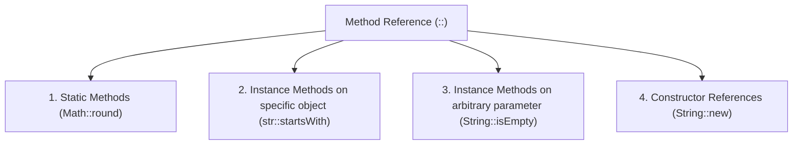

# Chapter 8 — Lambdas & Functional Interfaces

<span class="chapter-badge">Exam Domain: Working with Streams and Lambda Expressions</span>

> **Key Topics:** Lambda expression syntax, deferred execution, Functional Interfaces, SAM (Single Abstract Method) rule, `@FunctionalInterface`, built-in functional interfaces, primitive-specific functional interfaces, method references, constructor references, variable scopes (final and effectively final capture), and composition convenience methods.

---

## 🟦 New Learner: Lambdas, SAM, & Syntax Options

### What is a Lambda Expression?
A **lambda expression** is a block of code passed around using a deferred execution model. It acts like an unnamed method inside an anonymous class, focusing on behaviors and expressions rather than object state.
* **SAM (Single Abstract Method) Rule:** A lambda expression implements a **functional interface** — an interface that contains exactly **one** abstract method.
* **Context Inference:** Java uses surrounding context (variable declarations, method arguments) to infer the types of lambda parameters and the return type.

```java
// Example: Animal record and trait checking interface
public record Animal(String species, boolean canHop, boolean canSwim) {}

@FunctionalInterface
public interface CheckTrait {
    boolean test(Animal a);
}

// In client code:
List<Animal> animals = List.of(new Animal("rabbit", true, false));
// We pass a lambda block matching (Animal a) -> boolean
print(animals, a -> a.canHop()); 
```

---

### Lambda Syntax Rules
A lambda expression consists of three parts: parameters, the arrow operator (`->`), and a body.

```
a -> a.canHop()                        // ✅ Shortest form (1 inferred parameter, single expression)
(Animal a) -> a.canHop()              // ✅ Parentheses required for explicit type
(a, b) -> a.canHop()                  // ✅ Parentheses required for multiple parameters
(var a) -> a.canHop()                 // ✅ var parameter allowed (parentheses required)
a -> { return a.canHop(); }           // ✅ Block body requires braces, return keyword, and semicolon
() -> true                             // ✅ Parentheses required for zero parameters
```

> [!WARNING]
> Parentheses are optional **only** when there is a single parameter and the type is **inferred** (not explicitly declared).

```java
// ❌ INVALID SYNTAX EXAMPLES
var invalid = (Animal a) -> a.canHop(); // ❌ DOES NOT COMPILE (var cannot infer type from a lambda directly without target context)
a, b -> a.canHop()                      // ❌ DOES NOT COMPILE (Missing parentheses for multiple parameters)
a -> { a.canHop(); }                    // ❌ DOES NOT COMPILE (Block body must return boolean; missing return keyword)
(Animal a) -> { return a.canHop() }     // ❌ DOES NOT COMPILE (Missing semicolon inside braces)
```

---

## 🟣 Senior Deep Dive: Object Methods, Primitive Interfaces, Method References, & Scopes

### Object Methods Exception
An interface is still a functional interface if it declares abstract methods that match `public` methods in `java.lang.Object`. These do **not** count toward the Single Abstract Method (SAM) count.
* **Reasoning:** Since all classes implicitly inherit from `Object`, any implementation of the interface will always have concrete implementations of these methods.
* **Object signatures to check:** `public String toString()`, `public boolean equals(Object)`, and `public int hashCode()`.

```java
@FunctionalInterface
public interface Dive {
    String toString();            // Extracted from Object (ignored in SAM count)
    boolean equals(Object o);     // Extracted from Object (ignored in SAM count)
    int hashCode();               // Extracted from Object (ignored in SAM count)
    void dive();                  // ✅ The SINGLE abstract method (SAM)
}
```

> [!IMPORTANT]
> The signature must match the `Object` signature exactly. If the parameter type differs, it is counted as a new abstract method.

```java
@FunctionalInterface
public interface Hibernate {
    boolean equals(Hibernate h); // ❌ Declares equals(Hibernate) instead of equals(Object)
    void rest();                 // Counted as a second abstract method -> NOT a functional interface!
}
```

---

### Built-in Functional Interfaces Reference

| Interface | Method | Inputs | Return Type | Use Case |
| :--- | :--- | :--- | :--- | :--- |
| **`Supplier<T>`** | `T get()` | 0 | `T` | Supplying or generating values lazily |
| **`Consumer<T>`** | `void accept(T t)` | 1 (`T`) | `void` | Performing actions on a value (printing, saving) |
| **`BiConsumer<T, U>`** | `void accept(T t, U u)` | 2 (`T`, `U`) | `void` | Performing actions on two values |
| **`Predicate<T>`** | `boolean test(T t)` | 1 (`T`) | `boolean` | Testing conditions/filtering |
| **`BiPredicate<T, U>`** | `boolean test(T t, U u)` | 2 (`T`, `U`) | `boolean` | Testing conditions on two inputs |
| **`Function<T, R>`** | `R apply(T t)` | 1 (`T`) | `R` | Transforming an input into another type |
| **`BiFunction<T, U, R>`**| `R apply(T t, U u)` | 2 (`T`, `U`) | `R` | Transforming two inputs into another type |
| **`UnaryOperator<T>`** | `T apply(T t)` | 1 (`T`) | `T` | Transforming a value into the same type |
| **`BinaryOperator<T>`** | `T apply(T t1, T t2)` | 2 (`T`, `T`) | `T` | Merging two values of the same type into one |

---

### Primitive Functional Interfaces
To prevent performance degradation from autoboxing/unboxing wrapper classes (like `Double`, `Integer`, `Long`), Java provides primitive-specific functional interfaces.

#### 1. Boolean Variant
* **`BooleanSupplier`** defines `boolean getAsBoolean()`.

#### 2. Double, Int, and Long Variants
These interfaces omit generic parameter declarations when the primitive type is explicitly named.

| Generic Shape | `double` Equivalent | `int` Equivalent | `long` Equivalent | Abstract Method |
| :--- | :--- | :--- | :--- | :--- |
| `Supplier<T>` | `DoubleSupplier` | `IntSupplier` | `LongSupplier` | `getAsXXX()` |
| `Consumer<T>` | `DoubleConsumer` | `IntConsumer` | `LongConsumer` | `accept()` |
| `Predicate<T>` | `DoublePredicate` | `IntPredicate` | `LongPredicate` | `test()` |
| `Function<T, R>` | `DoubleFunction<R>` | `IntFunction<R>` | `LongFunction<R>` | `apply()` |
| `UnaryOperator<T>` | `DoubleUnaryOperator` | `IntUnaryOperator` | `LongUnaryOperator` | `applyAsXXX()` |
| `BinaryOperator<T>` | `DoubleBinaryOperator` | `IntBinaryOperator` | `LongBinaryOperator` | `applyAsXXX()` |

#### 3. Cross-Type Conversion and Mixed Interfaces
* **To-Primitive Functions:** `ToDoubleFunction<T>`, `ToIntFunction<T>`, `ToLongFunction<T>`.
* **Bi-To-Primitive Functions:** `ToDoubleBiFunction<T,U>`, `ToIntBiFunction<T,U>`, `ToLongBiFunction<T,U>`.
* **Primitive-to-Primitive Functions:** `DoubleToIntFunction`, `DoubleToLongFunction`, `IntToDoubleFunction`, `IntToLongFunction`, `LongToDoubleFunction`, `LongToIntFunction`.
* **Object-Primitive Consumers:** `ObjDoubleConsumer<T>`, `ObjIntConsumer<T>`, `ObjLongConsumer<T>` (declares `accept(T t, primitive value)`).

---

### Four Formats of Method References
Method references (`::`) provide a shorthand notation for lambda expressions that only call a single method.



#### Arity & Parameter Mapping
* **Static Methods:** `Class::staticMethod` maps parameters directly to the method arguments.
* **Instance Methods on specific object:** `instance::method` captures the instance reference and maps the lambda parameters directly to method arguments.
* **Instance Methods on arbitrary parameter:** `Class::instanceMethod` uses the first parameter of the lambda as the object instance on which the method is called, and remaining parameters (if any) as arguments.
* **Constructor References:** `Class::new` maps parameters to the matching class constructor.

```java
// Specific instance method reference (captures 'str')
String str = "Zoo";
Predicate<String> lambda1 = s -> str.startsWith(s);
Predicate<String> methodRef1 = str::startsWith; // ✅ Same arity

// Arbitrary instance method reference (uses first parameter as target)
BiPredicate<String, String> lambda2 = (s, p) -> s.startsWith(p);
BiPredicate<String, String> methodRef2 = String::startsWith; // ✅ First param is target, second is argument
```

---

### Variable Capture Rules
Lambda expressions can reference variables from the enclosing scope only under strict rules:

| Scope of Variable | Access from Lambda Body |
| :--- | :--- |
| **Instance Variable** | Always allowed (can read/write) |
| **Static Class Variable**| Always allowed (can read/write) |
| **Local Variable** | Allowed **only** if marked `final` or is **effectively final** |
| **Method Parameter** | Allowed **only** if marked `final` or is **effectively final** |
| **Lambda Parameter** | Always allowed |

> [!NOTE]
> A variable is **effectively final** if its value is never changed after it is initialized. If you can add the `final` keyword without causing compilation errors, the variable is effectively final.

```java
public class Crow {
    private String color;
    public void caw(String name) {
        String volume = "loudly";
        
        name = "Caty"; // ❌ name is reassigned, no longer effectively final!
        
        Consumer<String> consumer = s -> {
            // System.out.println(name); // ❌ DOES NOT COMPILE (name not effectively final)
            System.out.println(volume);   // ✅ Compiles (volume is effectively final)
        };
        
        // volume = "softly"; // If uncommented, it breaks 'volume' capture above!
    }
}
```

---

### Convenience Methods on FIs
These methods chain, compose, or negate functional interfaces:

```java
Predicate<String> egg = s -> s.contains("egg");
Predicate<String> brown = s -> s.contains("brown");

Predicate<String> brownEggs = egg.and(brown); // ✅ Combined check
Predicate<String> nonBrownEggs = egg.and(brown.negate()); // ✅ Negated check
```

* **`Function` Composition (`andThen` vs `compose`):**
  * `f.andThen(g)` runs `f` first, then passes the result to `g`.
  * `f.compose(g)` runs `g` first, then passes the result to `f`.

```java
Function<Integer, Integer> addOne = x -> x + 1;
Function<Integer, Integer> multiplyTwo = x -> x * 2;

System.out.println(addOne.andThen(multiplyTwo).apply(3)); // (3+1)*2 = 8
System.out.println(addOne.compose(multiplyTwo).apply(3)); // (3*2)+1 = 7
```

---

## 🚨 Top 10 Exam Traps

### Trap 1: redeclaring lambda parameters
You cannot declare a parameter in a lambda body with the same name as a local variable in the enclosing method.
```java
public void test(int x) {
    // Predicate<Integer> p = x -> x > 5; // ❌ DOES NOT COMPILE (x is already defined in scope)
}
```

### Trap 2: Mixing implicit and explicit parameter types
You cannot mix inferred types, explicit types, or `var` in the same lambda parameter list.
```java
// (var x, y) -> x + y;            // ❌ DOES NOT COMPILE
// (String x, var y) -> x + y;     // ❌ DOES NOT COMPILE
(var x, var y) -> x + y;           // ✅ Correct
```

### Trap 3: Missing lambda assignment semicolon
A lambda statement assigning to a variable must end in a semicolon.
```java
Predicate<String> p = s -> s.isEmpty(); // ✅ Semicolon required
```

### Trap 4: Throwing checked exceptions in Lambdas
If a lambda body throws a checked exception, the functional interface's abstract method must declare that exception.
```java
// Runnable r = () -> Thread.sleep(100); // ❌ DOES NOT COMPILE (InterruptedException is checked)
Callable<Void> c = () -> { Thread.sleep(100); return null; }; // ✅ Compiles (Callable throws Exception)
```

### Trap 5: Modifying local variables inside Lambdas
Lambdas cannot modify local variables captured from the enclosing context.
```java
int count = 0;
// Runnable r = () -> count++; // ❌ DOES NOT COMPILE (attempts to modify local variable)
```

### Trap 6: Calling `negate()` directly with `!` operator
The logical negation operator `!` cannot be applied directly to a Predicate object reference.
```java
Predicate<String> p = String::isEmpty;
// Predicate<String> bad = !p; // ❌ DOES NOT COMPILE
Predicate<String> good = p.negate(); // ✅ Correct
```

### Trap 7: Missing return keywords inside Braces
When braces are used in a lambda body, a `return` keyword is mandatory if the method returns a value.
```java
// Function<String, Integer> f = s -> { s.length(); }; // ❌ DOES NOT COMPILE
Function<String, Integer> f = s -> { return s.length(); }; // ✅ Correct
```

### Trap 8: Implicitly returning a value inside Braces
Conversely, you cannot return a value in a single-expression lambda if there are no braces.
```java
// Function<String, Integer> f = s -> return s.length(); // ❌ DOES NOT COMPILE
```

### Trap 9: Wrong arity in method references
Ensure the parameters of the functional interface match the parameters expected by the method reference.
```java
// Supplier<String> s = String::concat; // ❌ DOES NOT COMPILE (concat needs a target and a parameter)
BiFunction<String, String, String> s = String::concat; // ✅ Correct
```

### Trap 10: Re-assigning instance parameters inside loops
Using loop indices inside lambdas violates the effectively final rule.
```java
for (int i = 0; i < 3; i++) {
    // Supplier<Integer> s = () -> i; // ❌ DOES NOT COMPILE (i is modified)
}
```

---

## 🔗 Spring / Enterprise Relevance
* **Dynamic Specifications:** Spring Data JPA `Specification<T>` allows combining database predicates dynamically using `and()`, `or()`, and `not()` methods.
* **Spring Boot Task Scheduling:** `TaskScheduler` and `@Scheduled` setups execute tasks asynchronously using `Runnable` lambdas internally.
* **Reactive Programming:** Spring WebFlux (Project Reactor) uses `Function` and `Consumer` heavily within `map()`, `flatMap()`, and `subscribe()` operators.