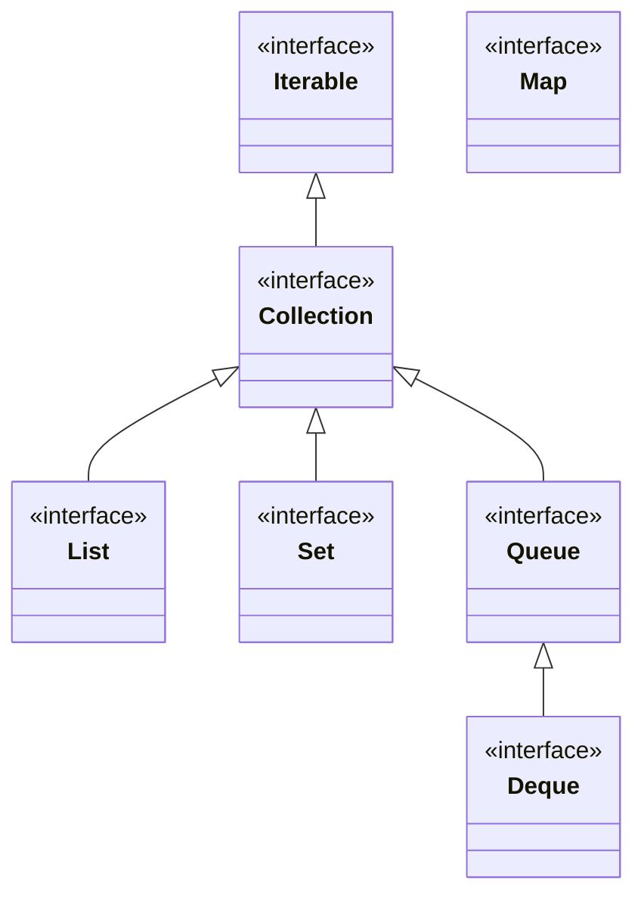
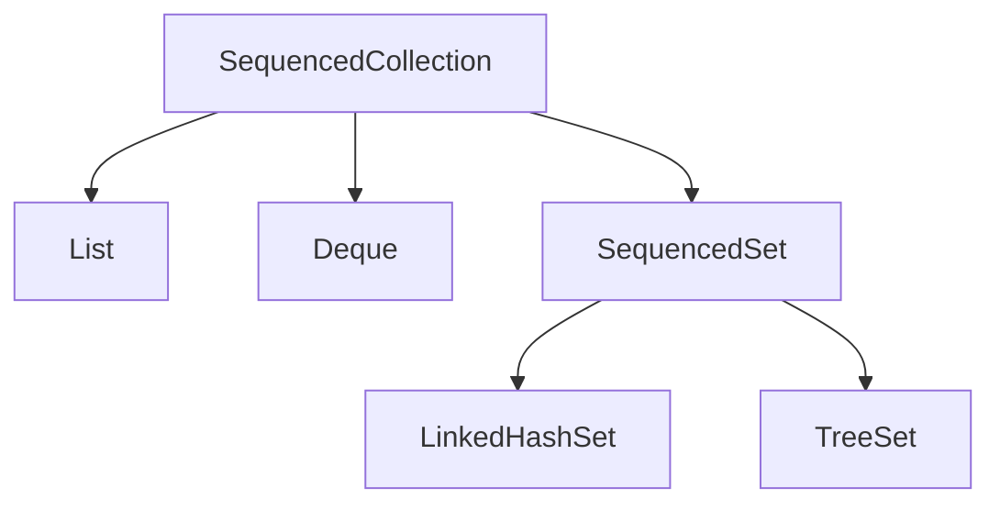

# Chapter 9 — Collections & Generics

<span class="chapter-badge">Exam Domain: Working with Arrays and Collections</span>

> **Key Topics:** Collections Framework hierarchy, List/Set/Queue/Deque implementations, Map API, factory methods (`List.of()`, `Arrays.asList()`), unmodifiable views, sequenced collections (Java 21), Comparable & Comparator interfaces, binary search, custom generic classes/interfaces/methods/records, type erasure, and bounded wildcards (`extends` vs `super`).

---

## 🟦 New Learner: Collections API, Lists, Sets, & Queues

### Understanding the Java Collections Framework (JCF)
The JCF resides in `java.util` and provides standard interfaces and implementations for storing groups of objects.


*Note: `Map` does not implement `Collection` or `Iterable`, but is considered part of the framework as it manages collections of key-value pairs.*

---

### Common Collection APIs
The `Collection` interface defines core operations implemented by all lists, sets, and queues:
* **`add(E)`:** Adds an element; returns `true` if successful. In `Set`, returns `false` on duplicate.
* **`remove(Object)`:** Removes one matching element; returns `true` if successful.
* **`isEmpty()` & `size()`:** Check size and presence of elements.
* **`clear()`:** Removes all elements.
* **`contains(Object)`:** Checks if an element exists using `equals()`.
* **`removeIf(Predicate)`:** Removes elements matching the predicate.
* **`forEach(Consumer)`:** Iterates over the collection.
* **`iterator()`:** Returns an `Iterator` for manual iteration.

#### Autoboxing Nulls Trap
Collections can store `null` references, but attempting to unbox a `null` wrapper to a primitive throws a `NullPointerException`.
```java
List<Integer> list = new ArrayList<>();
list.add(null); 
int value = list.get(0); // ❌ Throws NullPointerException!
```

---

### The `List` Interface
An ordered collection that allows duplicate entries and index-based access.

#### 1. Implementations:
* **`ArrayList`:** Backed by a resizable array. Constant-time `O(1)` lookup. Ideal for read-heavy operations.
* **`LinkedList`:** Doubly-linked list. Implements both `List` and `Deque`. Constant-time `O(1)` insertion/deletion at the ends, but linear-time `O(n)` index lookup.

#### 2. Creation Factory Methods:
* **`Arrays.asList(T...)`:** Fixed-size list backed by the original array. Changes to the array write through to the list, and vice versa. Structural changes (`add`/`remove`) throw `UnsupportedOperationException`.
* **`List.of(T...)`:** Fully **immutable** list. Modifying or setting throws `UnsupportedOperationException`. Null values are forbidden.
* **`List.copyOf(Collection)`:** Returns an immutable copy of the collection.

```java
String[] array = {"a", "b"};
List<String> list1 = Arrays.asList(array);
list1.set(0, "z"); // ✅ Allowed. array[0] becomes "z"
// list1.add("c"); // ❌ Throws UnsupportedOperationException

List<String> list2 = List.of(array);
// list2.set(0, "y"); // ❌ Throws UnsupportedOperationException
```

#### 3. Converting to Array:
```java
List<String> list = new ArrayList<>(List.of("hawk", "robin"));
Object[] objArr = list.toArray();               // Defaults to Object[]
String[] strArr = list.toArray(new String[0]); // ✅ Recommended: creates typed array of correct size
```

---

### The `Set` Interface
A collection that does not allow duplicate entries.
* **`HashSet`:** Backed by a hash table. Uses elements' `hashCode()` and `equals()` to prevent duplicates. Unordered.
* **`LinkedHashSet`:** Maintains insertion order via a linked list running through the hash table.
* **`TreeSet`:** Backed by a red-black tree. Stores elements in a sorted order. Requires elements to implement `Comparable` (or a custom `Comparator` must be provided). **Does not allow null values.**

---

### The `Queue` and `Deque` Interfaces
* **`Queue`:** Designed for holding elements prior to processing (typically FIFO).
* **`Deque`:** Double-ended queue. Supports inserting/removing from both ends. Can act as a FIFO Queue or LIFO Stack.

#### Queue Method Contracts:
Queues provide two versions of their primary operations: one that throws an exception on failure, and one that returns a special value (like `false` or `null`).

| Operation | Throws Exception | Returns Special Value |
| :--- | :--- | :--- |
| **Add to Back** | `add(e)` | `offer(e)` (returns `false` if full) |
| **Read from Front** | `element()` | `peek()` (returns `null` if empty) |
| **Remove from Front** | `remove()` | `poll()` (returns `null` if empty) |

#### Deque as a Stack (LIFO):
To use a `Deque` as a LIFO stack, use `push()`, `pop()`, and `peek()` which operate exclusively on the **front (top)** of the queue.

```java
Deque<Integer> stack = new ArrayDeque<>();
stack.push(10); // [10]
stack.push(20); // [20, 10]
stack.pop();    // Returns 20 -> [10]
```

---

### The `Map` Interface
Maps unique keys to values. Does not implement `Collection`.
* **`HashMap`:** Unordered. Permits one null key and multiple null values.
* **`LinkedHashMap`:** Preserves insertion order.
* **`TreeMap`:** Keys sorted in natural order. **Does not permit null keys.**

#### Core Map Methods:
* **`putIfAbsent(K, V)`:** Sets the value only if the key is absent or mapped to `null`.
* **`getOrDefault(Object, V)`:** Returns the value or the default if the key is absent.
* **`merge(K, V, BiFunction)`:** Combines map entries (see table below).

#### Detailed `Map.merge()` Behavior:

| Key State in Map | Mapping Function Result | Resulting Map State |
| :--- | :--- | :--- |
| **Absent or mapped to `null`**| *Not evaluated* | Key is mapped to the new `value` parameter. |
| **Present and non-null** | Mapped to `null` | Key is **removed** from the map. |
| **Present and non-null** | Mapped to a non-null `newVal` | Key is updated to the `newVal` result. |

---

## 🟣 Senior Deep Dive: Sorting contracts, Sequenced Collections, and Generics PECS

### Sorting Contracts: `Comparable` vs `Comparator`

#### `Comparable<T>`
Defines the **natural ordering** of a class. Must implement `compareTo(T o)`.
* **Return values:**
  * Negative: `this < o` (sorts `this` before `o`).
  * Zero: `this == o`.
  * Positive: `this > o` (sorts `this` after `o`).

> [!CAUTION]
> Avoid direct subtraction in `compareTo()` for numbers as it can cause integer overflow errors. Use `Integer.compare(x, y)` instead.

```java
public record Student(int id, String name) implements Comparable<Student> {
    @Override
    public int compareTo(Student other) {
        return Integer.compare(this.id, other.id); // ✅ Safe comparison
    }
}
```

#### `Comparator<T>`
Defines **external or alternative orderings**. Must implement `compare(T o1, T o2)`.
* Helper static methods: `Comparator.comparing(Function)`, `Comparator.naturalOrder()`, `Comparator.reverseOrder()`.
* Chaining methods: `thenComparing()`, `thenComparingInt()`, `reversed()`.

```java
Comparator<Student> comp = Comparator.comparing(Student::name)
                                     .thenComparingInt(Student::id);
```

#### Binary Search
`Collections.binarySearch(List, key, [Comparator])` searches a sorted list in `O(log n)` time.
* **Precondition:** The list **must** be sorted in the order specified by the comparator (or natural order).
* **Return value:**
  * If found: returns the index of the key.
  * If not found: returns `(-insertionPoint - 1)`.

---

### Sequenced Collections (Java 21)
Introduces interfaces representing collections with a well-defined encounter order.



#### 1. SequencedCollection Methods
* `getFirst()` / `getLast()`
* `addFirst(e)` / `addLast(e)` *(TreeSet throws UnsupportedOperationException here)*
* `removeFirst()` / `removeLast()`
* `reversed()` *(returns a reversed encounter order view)*

#### 2. SequencedMap Methods
* `firstEntry()` / `lastEntry()`
* `pollFirstEntry()` / `pollLastEntry()`
* `putFirst(k, v)` / `putLast(k, v)` *(TreeMap throws UnsupportedOperationException here)*
* `sequencedKeySet()` / `sequencedValues()` / `sequencedEntrySet()`
* `reversed()`

---

### Generics & PECS (Producer Extends, Consumer Super)

#### Type Erasure
Generics exist only for compile-time type safety. At compilation, Java erases all generic type parameters to `Object` (or their bound type), introducing explicit casts automatically.
* **Erasure Collision:** Because of erasure, you cannot overload methods by changing generic parameters only:
```java
public class Handler {
    // Both erase to: void chew(List list) -> ❌ DOES NOT COMPILE
    // void chew(List<String> list) {}
    // void chew(List<Integer> list) {}
}
```

#### Covariant Overrides
An overriding method can return a subtype of the parent return type. However, the generic parameter types must match **exactly**:
```java
class Parent { List<CharSequence> getList() { return null; } }
class Child extends Parent {
    // @Override List<String> getList() { return null; } // ❌ DOES NOT COMPILE (generics are invariant)
    @Override ArrayList<CharSequence> getList() { return null; } // ✅ Compiles (ArrayList is subtype of List)
}
```

#### Bounded Wildcards (PECS)
* **Upper Bound (`? extends T`):** Represents `T` or any subclass of `T`. Act as **Producers**. You can **read** from them as type `T`, but you **cannot write** to them (except `null`).
* **Lower Bound (`? super T`):** Represents `T` or any superclass of `T`. Act as **Consumers**. You can **write** `T` or its subclasses to them, but reads return only `Object` references.

```java
public static void copy(List<? extends Number> src, List<? super Number> dest) {
    for (Number n : src) { // ✅ Read allowed (src produces Numbers)
        dest.add(n);      // ✅ Write allowed (dest consumes Numbers)
    }
}
```

---

## 📝 Quick Reference Summary

| Collection | Order | Duplicates | Null Elements | Key Methods |
| :--- | :--- | :--- | :--- | :--- |
| **`ArrayList`** | Insertion | Yes | Yes | `get(index)`, `set(index, e)`, `add(index, e)` |
| **`LinkedList`** | Insertion | Yes | Yes | Implements both `List` and `Deque` |
| **`HashSet`** | None | No | Yes (one) | `add()`, `remove()`, `contains()` |
| **`TreeSet`** | Sorted | No | **No** | `first()`, `last()`, `headSet()`, `tailSet()` |
| **`ArrayDeque`** | FIFO/LIFO | Yes | **No** | `push()`, `pop()`, `offerLast()`, `pollFirst()` |
| **`HashMap`** | None | Keys: No | Yes (one null key) | `put()`, `get()`, `getOrDefault()`, `merge()` |
| **`TreeMap`** | Sorted | Keys: No | **No null keys** | `firstEntry()`, `lastEntry()`, `subMap()` |

---

## 🚨 Top 10 Exam Traps

### Trap 1: `List.of()` returns an immutable list
Structural modification attempts throw runtime exceptions.
```java
List<String> list = List.of("a", "b");
// list.add("c"); // ❌ Throws UnsupportedOperationException at runtime
```

### Trap 2: `remove(int)` vs `remove(Object)` in `List<Integer>`
Primitive parameter overrides win over autoboxing.
```java
List<Integer> list = new ArrayList<>(List.of(1, 2, 3));
list.remove(1); // ❌ Removes index 1 (value 2), not value 1! list becomes [1, 3]
```

### Trap 3: `TreeSet` elements must be `Comparable`
Adding elements that do not implement `Comparable` to a `TreeSet` (without providing a custom `Comparator` in the constructor) throws a `ClassCastException`.
```java
class Cat {}
Set<Cat> cats = new TreeSet<>();
cats.add(new Cat()); // ❌ Throws ClassCastException at runtime!
```

### Trap 4: Write restrictions on upper-bounded wildcards
You cannot add any objects (except `null`) to an upper-bounded wildcard collection.
```java
List<? extends Number> list = new ArrayList<Integer>();
// list.add(10); // ❌ DOES NOT COMPILE
```

### Trap 5: Read restrictions on lower-bounded wildcards
Reading from a lower-bounded collection returns only `Object` references.
```java
List<? super Integer> list = new ArrayList<Number>();
// Integer val = list.get(0); // ❌ DOES NOT COMPILE
Object val = list.get(0);    // ✅ Compiles
```

### Trap 6: mixing `var` and diamond operators
Combining both without type hints results in `Object` mapping generics.
```java
var list = new ArrayList<>(); // Equivalent to ArrayList<Object>()
```

### Trap 7: Subtraction overflow in custom comparisons
Do not subtract values in `compareTo()` that could exceed primitive limits.
```java
// return id1 - id2; // ❌ Vulnerable to overflow if one is highly positive and other highly negative
return Integer.compare(id1, id2); // ✅ Safe
```

### Trap 8: Binary search on unsorted collections
The behavior of `Collections.binarySearch()` is undefined if the list is not sorted.
```java
List<Integer> list = List.of(3, 1, 2);
int idx = Collections.binarySearch(list, 1); // ❌ Undefined result (unsorted list)
```

### Trap 9: Adding elements to Array-backed lists
`Arrays.asList()` returns a fixed-size list. Elements can be replaced (`set`), but not added or removed.
```java
List<String> list = Arrays.asList("a", "b");
list.set(0, "c"); // ✅ Allowed
// list.add("d"); // ❌ Throws UnsupportedOperationException
```

### Trap 10: Modifying lists inside for-each loops
Modifying a collection structurally while iterating over it via an iterator or for-each loop throws a `ConcurrentModificationException`. Use `removeIf()` instead.
```java
List<String> list = new ArrayList<>(List.of("a", "b"));
for (String s : list) {
    // list.remove(s); // ❌ Throws ConcurrentModificationException at runtime!
}
```

---

## 🔗 Spring / Enterprise Relevance
* **Dynamic Queries:** `Specification<T>` in Spring Data JPA heavily uses Predicate and Collections mapping to query database entities.
* **Entity Caching:** Spring's `@Cacheable` collections must be configured carefully to avoid returning unmodifiable collections directly to clients that might modify them.
* **Data Transfer Objects (DTOs):** Generics are crucial in establishing reusable wrappers like `ResponseEntity<T>` or custom API wrapper envelopes `Response<T>`.
