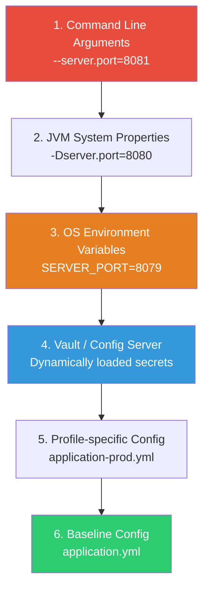

# Deployment Configuration & Infrastructure Verification

Deploying a modern, microservice-based system requires strict validation of both application configurations and downstream infrastructure resources. Misconfigured environment variables, missing database secrets, mismatched Kafka ACLs, or incompatible message schemas are leading causes of deployment failures.

This guide outlines how to manage, prioritize, and verify application settings (Spring Boot config, environment variables, HashiCorp Vault) and event streaming infrastructure (Kafka topics, ACLs, Schemas) during continuous integration and deployment.

---

## 1. Spring Boot Configuration & Priority Hierarchy

Spring Boot uses a very specific order of precedence to resolve configuration properties. Understanding this hierarchy is critical for establishing a baseline configuration and safely overriding settings across environments (Dev, Staging, Prod).

### The Precedence Hierarchy (Simplified for Deployment)

When Spring Boot boots up, it merges properties from all available sources. If a property is defined in multiple sources, **the higher priority source wins**.



### Detailed Property Precedence Table

| Priority | Source | Common Use Case | Override Scope |
|---|---|---|---|
| **1 (Highest)** | **Command Line Arguments** | Ad-hoc debugging, port overrides | Overrides everything |
| **2** | **JVM System Properties (`-Dkey=val`)**| Specifying system paths or custom run parameters | Overrides env variables |
| **3** | **OS Environment Variables** | Container configurations (Kubernetes `env` blocks) | Overrides application configuration files |
| **4** | **Config Server / Vault Properties** | Distributed dynamic configs & database secrets | Overrides local files, overridden by environment variables |
| **5** | **Profile-specific Config (`application-{env}.yml`)**| Database URLs, logging levels tailored for an environment | Overrides default config |
| **6 (Lowest)** | **Baseline Config (`application.yml`)** | Default values, thread pool sizes, fallback parameters | Baseline defaults |

---

## 2. Environment Variables & Relaxed Binding

When deploying applications inside Docker or Kubernetes, configuration settings should be injected as **OS Environment Variables** (Priority 3).

### Relaxed Binding Rules
Spring Boot uses **relaxed binding** to map environment variables to its properties. It translates `UPPER_CASE_UNDERLINE` environment variable names to `camelCase` or `kebab-case` property names.

> [!IMPORTANT]
> When defining environment variables, use **uppercase letters and underscores**. Do not use dots (`.`) or dashes (`-`) as many OS shells do not support them.

#### Translation Examples:

| Spring Boot Property Key | Environment Variable Equivalent |
|---|---|
| `spring.kafka.bootstrap-servers` | `SPRING_KAFKA_BOOTSTRAP_SERVERS` |
| `spring.datasource.hikari.maximum-pool-size` | `SPRING_DATASOURCE_HIKARI_MAXIMUM_POOL_SIZE` |
| `app.features.payment-retry.enabled` | `APP_FEATURES_PAYMENTRETRY_ENABLED` (Note: remove hyphens inside words or use double-underscores) |
| `app.users[0].name` (List binding) | `APP_USERS_0__NAME` |

### Environment Variable Verification Script
In your deployment pipeline (e.g., Helm `pre-install` or entrypoint wrapper), verify that all required environment variables are set before starting the JVM:

```bash
#!/usr/bin/env bash
# entrypoint.sh - Verify configurations before launching the Spring Boot jar

required_vars=(
  "SPRING_PROFILES_ACTIVE"
  "SPRING_DATASOURCE_URL"
  "SPRING_DATASOURCE_USERNAME"
  "SPRING_DATASOURCE_PASSWORD"
  "SPRING_KAFKA_BOOTSTRAP_SERVERS"
  "VAULT_TOKEN"
)

echo "==> Verifying environment variables..."
missing_var=0

for var in "${required_vars[@]}"; do
  if [ -z "${!var}" ]; then
    echo "ERROR: Environment variable '$var' is not defined!"
    missing_var=1
  fi
done

if [ $missing_var -eq 1 ]; then
  echo "Failing deployment due to missing environment configurations."
  exit 1
fi

echo "==> Configuration checks passed. Starting application..."
exec java -jar /app/service.jar
```

---

## 3. HashiCorp Vault Integration & Verification

To avoid checking raw passwords and certificates into source control, use **HashiCorp Vault** for secrets management. In a Spring Boot application, this is typically handled via `spring-cloud-vault` or Kubernetes secret injections.

```
+------------------+         Auth (Token/Kubernetes)         +------------------+
|   Spring Boot    | --------------------------------------> | HashiCorp Vault  |
|   Application    | <-------------------------------------- |   (Secret Engine)|
+------------------+          Fetch database credentials     +------------------+
```

### Spring Boot Setup
Configure the Vault integration in your `application.yml` or `bootstrap.yml`:

```yaml
spring:
  cloud:
    vault:
      uri: https://vault.internal.production.net
      authentication: KUBERNETES # Or TOKEN/APP_ROLE depending on environment
      kubernetes:
        role: transaction-service-role
      kv:
        enabled: true
        backend: secret
        default-context: transaction-service
      # CRITICAL: Fail fast if secrets cannot be fetched
      fail-fast: true
```

> [!WARNING]
> Always set `spring.cloud.vault.fail-fast=true` in production. If Vault is down or the authentication token has expired, this setting causes the application context to crash immediately on startup, preventing the application from running in a partially-configured, broken state.

### Vault Connection Verification in CI/CD
Verify Vault accessibility and token viability during a deployment using a shell wrapper in your CI/CD job:

```bash
# Verify connection to Vault and read compatibility
echo "==> Validating connection to HashiCorp Vault..."
VAULT_HEALTH=$(curl -s -o /dev/null -w "%{http_code}" "$VAULT_ADDR/v1/sys/health")

if [ "$VAULT_HEALTH" -ne 200 ]; then
  echo "CRITICAL: Vault health check failed with status $VAULT_HEALTH"
  exit 1
fi

# Authenticate and test reading a dummy path
secret_status=$(curl -s -o /dev/null -w "%{http_code}" \
  -H "X-Vault-Token: $VAULT_TOKEN" \
  "$VAULT_ADDR/v1/secret/data/transaction-service")

if [ "$secret_status" -ne 200 ]; then
  echo "CRITICAL: Failed to retrieve secrets from path 'secret/data/transaction-service'. Status: $secret_status"
  exit 1
fi
echo "Vault connection and read permissions verified successfully."
```

---

## 4. Kafka Topics & ACLs Verification

Event-driven applications require matching Kafka configurations across the cluster. Before a microservice is deployed, its target topics must exist, have the correct partition/replication topology, and have valid ACLs (Access Control Lists) assigned.

### GitOps Topic Management (Strimzi Kubernetes Operator)
Instead of letting applications auto-create topics in production (which must always be disabled using `auto.create.topics.enable=false`), manage topics declaratively:

```yaml
# kafka-topic-orders.yaml
apiVersion: kafka.strimzi.io/v1beta2
kind: KafkaTopic
metadata:
  name: order-events
  labels:
    strimzi.io/cluster: my-production-cluster
spec:
  partitions: 12
  replicas: 3
  config:
    retention.ms: 604800000 # 7 days
    segment.bytes: 1073741824 # 1 GB
    cleanup.policy: delete
```

### Topic & Partition Verification Pre-Flight Script
Run this script as a Helm pre-install hook or a CD step to audit topic existence and topology before starting the service:

```bash
#!/usr/bin/env bash
# verify-kafka-topics.sh

BOOTSTRAP_SERVERS="kafka-prod-cluster:9092"
TOPICS_TO_CHECK=("order-events" "payment-events")
EXPECTED_PARTITIONS=12

for topic in "${TOPICS_TO_CHECK[@]}"; do
  echo "Checking topic: $topic..."
  
  # Fetch topic metadata
  description=$(kafka-topics.sh --bootstrap-server "$BOOTSTRAP_SERVERS" --describe --topic "$topic" 2>/dev/null)
  
  if [ -z "$description" ]; then
    echo "ERROR: Topic '$topic' does not exist on cluster!"
    exit 1
  fi
  
  # Verify partition count
  actual_partitions=$(echo "$description" | grep -oE "PartitionCount:[0-9]+" | cut -d':' -f2)
  if [ "$actual_partitions" -lt "$EXPECTED_PARTITIONS" ]; then
    echo "WARNING: Topic '$topic' has $actual_partitions partitions, expected at least $EXPECTED_PARTITIONS."
    # Take correction action or exit depending on strictness
  fi
  
  echo "Topic '$topic' verified (Partitions: $actual_partitions)."
done
```

### ACL (Access Control List) Verification
Ensure the service's service account (SASL username) has correct authorizations:

```bash
# Check Producer permissions
kafka-acls.sh --bootstrap-server "$BOOTSTRAP_SERVERS" \
  --list \
  --principal "User:transaction-service" \
  --topic "order-events"
```
Ensure output lists:
- `WRITE` permission on topic `order-events`
- `DESCRIBE` permission on topic `order-events`
- `READ` and `DESCRIBE` permissions on consumer group IDs (if acting as a consumer)

---

## 5. Schema Compatibility Verification

If you are using the Confluent Schema Registry (Avro, Protobuf, or JSON Schema), schema changes must be validated against the registry before deployment to prevent poison pill events in production.

### Schema Compatibility Rules

| Compatibility Mode | Can Read New Schema With Old Code? | Can Read Old Schema With New Code? | Evolution Strategy |
|---|---|---|---|
| **BACKWARD** (Default) | ❌ No | ✅ Yes | Consumer is upgraded before Producer |
| **FORWARD** | ✅ Yes | ❌ No | Producer is upgraded before Consumer |
| **FULL** | ✅ Yes | ✅ Yes | Upgrade in any order |
| **NONE** | ❌ No | ❌ No | Lock-step deployment required (Downtime) |

### CI/CD Schema Compatibility Check (Maven Example)
In your CI/CD pipeline, run the `schema-registry-maven-plugin` to test local schemas against the remote Schema Registry:

```xml
<!-- pom.xml -->
<plugin>
    <groupId>io.confluent</groupId>
    <artifactId>kafka-schema-registry-maven-plugin</artifactId>
    <version>7.5.0</version>
    <configuration>
        <schemaRegistryUrls>
            <schemaRegistryUrl>https://schema-registry.production.net</schemaRegistryUrl>
        </schemaRegistryUrls>
        <subjects>
            <order-events-value>src/main/avro/order-event-v2.avsc</order-events-value>
        </subjects>
    </configuration>
    <executions>
        <execution>
            <id>verify-schemas</id>
            <phase>test</phase>
            <goals>
                <goal>test-compatibility</goal>
            </goals>
        </execution>
    </executions>
</plugin>
```

Add this validation check to your CI runner script:
```bash
# Run schema registry compatibility tests
mvn kafka-schema-registry:test-compatibility -DschemaRegistryUrl=https://schema-registry.production.net
```

### Production Protection Checklist
To prevent accidental schema registry pollution during deployments:
1. **Disable Auto-Registration:** In your Spring Boot `application-prod.yml`, disable schema auto-registration:
   ```yaml
   spring:
     kafka:
       properties:
         auto.register.schemas: false
         use.latest.version: true
   ```
2. **Read-Only ACLs:** Enforce that the production microservice principal only has `READ` permissions to the Schema Registry. Only the CI/CD pipeline principal should have `WRITE`/`POST` permissions to register new schemas.

---

## Related Pages

- [Roll-Forward Strategy](./roll-forward)
- [Roll-Backward Strategy](./roll-backward)
- [Phase 6 — Deployment](../phases/deployment)
- [Schema Registry Deep Dive](../../../technical-knowledge/kafka/advanced/schema-registry)
