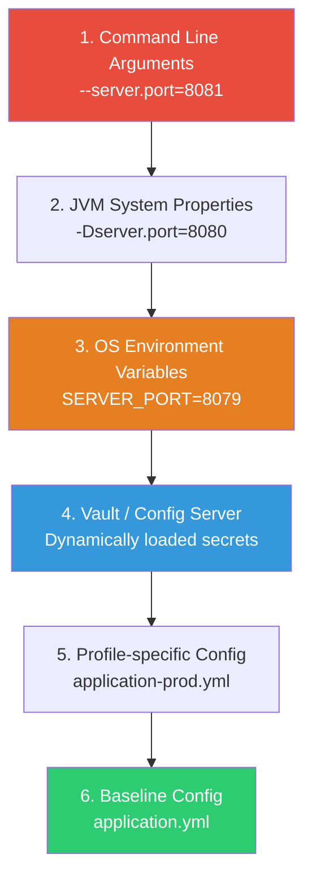

# Deployment Configuration & Infrastructure Verification

Deploying a modern, microservice-based system requires strict validation of both application configurations and downstream infrastructure resources. Misconfigured environment variables, missing database secrets, mismatched Kafka ACLs, or incompatible message schemas are leading causes of deployment failures.

This guide outlines how to manage, prioritize, and verify application settings (Spring Boot config, environment variables, HashiCorp Vault) and event streaming infrastructure (Kafka topics, ACLs, Schemas) during continuous integration and deployment — and how to verify the deployment actually succeeded once it's live.

---

## 1. Spring Boot Configuration & Priority Hierarchy

Spring Boot uses a very specific order of precedence to resolve configuration properties. Understanding this hierarchy is critical for establishing a baseline configuration and safely overriding settings across environments (Dev, Staging, Prod).

### The Precedence Hierarchy (Simplified for Deployment)

When Spring Boot boots up, it merges properties from all available sources. If a property is defined in multiple sources, **the higher priority source wins**.



### Detailed Property Precedence Table

| Priority | Source | Common Use Case | Override Scope |
|---|---|---|---|
| **1 (Highest)** | **Command Line Arguments** | Ad-hoc debugging, port overrides | Overrides everything |
| **2** | **JVM System Properties (`-Dkey=val`)**| Specifying system paths or custom run parameters | Overrides env variables |
| **3** | **OS Environment Variables** | Container configurations (Kubernetes `env` blocks) | Overrides application configuration files |
| **4** | **Config Server / Vault Properties** | Distributed dynamic configs & database secrets | Overrides local files, overridden by environment variables |
| **5** | **Profile-specific Config (`application-{env}.yml`)**| Database URLs, logging levels tailored for an environment | Overrides default config |
| **6 (Lowest)** | **Baseline Config (`application.yml`)** | Default values, thread pool sizes, fallback parameters | Baseline defaults |

### Deep Dive: Debugging "Which Source Actually Won"

The precedence table tells you the rule; in an incident, what you need is the *actual resolved value and its origin*. Spring Boot Actuator's `/actuator/env` endpoint (when exposed — see the security note below) reports every `PropertySource` and the value it contributed, in precedence order, letting you see exactly which layer set the effective value:

```bash
# Find the effective value AND which source provided it
curl -s https://internal-host/actuator/env/spring.datasource.url | jq

# Sample response — propertySources are listed in precedence order,
# so the FIRST source with a non-null value for this key is the winner
{
  "property": {
    "source": "systemEnvironment",
    "value": "jdbc:postgresql://prod-db:5432/orders"
  }
}
```

> [!WARNING]
> `/actuator/env` and `/actuator/configprops` can leak secrets (datasource passwords, API keys) if not sanitized. Spring Boot redacts common sensitive key patterns (`password`, `secret`, `token`, `key`) automatically via `management.endpoint.env.show-values=WHEN_AUTHORIZED`, but always pair this with `management.endpoints.web.exposure.include` scoped narrowly and network-level restriction to internal callers only — never expose actuator endpoints on a public ingress.

---

## 2. Environment Variables & Relaxed Binding

When deploying applications inside Docker or Kubernetes, configuration settings should be injected as **OS Environment Variables** (Priority 3).

### Relaxed Binding Rules
Spring Boot uses **relaxed binding** to map environment variables to its properties. It translates `UPPER_CASE_UNDERLINE` environment variable names to `camelCase` or `kebab-case` property names.

> [!IMPORTANT]
> When defining environment variables, use **uppercase letters and underscores**. Do not use dots (`.`) or dashes (`-`) as many OS shells do not support them.

#### Translation Examples:

| Spring Boot Property Key | Environment Variable Equivalent |
|---|---|
| `spring.kafka.bootstrap-servers` | `SPRING_KAFKA_BOOTSTRAP_SERVERS` |
| `spring.datasource.hikari.maximum-pool-size` | `SPRING_DATASOURCE_HIKARI_MAXIMUM_POOL_SIZE` |
| `app.features.payment-retry.enabled` | `APP_FEATURES_PAYMENTRETRY_ENABLED` (Note: remove hyphens inside words or use double-underscores) |
| `app.users[0].name` (List binding) | `APP_USERS_0__NAME` |

### Environment Variable Verification Script
In your deployment pipeline (e.g., Helm `pre-install` or entrypoint wrapper), verify that all required environment variables are set before starting the JVM:

```bash
#!/usr/bin/env bash
# entrypoint.sh - Verify configurations before launching the Spring Boot jar

required_vars=(
  "SPRING_PROFILES_ACTIVE"
  "SPRING_DATASOURCE_URL"
  "SPRING_DATASOURCE_USERNAME"
  "SPRING_DATASOURCE_PASSWORD"
  "SPRING_KAFKA_BOOTSTRAP_SERVERS"
  "VAULT_TOKEN"
)

echo "==> Verifying environment variables..."
missing_var=0

for var in "${required_vars[@]}"; do
  if [ -z "${!var}" ]; then
    echo "ERROR: Environment variable '$var' is not defined!"
    missing_var=1
  fi
done

if [ $missing_var -eq 1 ]; then
  echo "Failing deployment due to missing environment configurations."
  exit 1
fi

echo "==> Configuration checks passed. Starting application..."
exec java -jar /app/service.jar
```

### Deep Dive: Config Drift Between Environments

A required-variable check catches *missing* variables, but not **drift** — a variable present in every environment but silently diverging in value in a way that only breaks one of them (e.g., staging's Kafka bootstrap string still pointing at a decommissioned broker). Treat config as code: store each environment's expected variable set in version control and diff the *running* container's resolved environment against it as a deploy gate, not just a presence check:

```bash
# Compare a deployed pod's actual env against the checked-in expected baseline
kubectl exec deploy/order-service -- env | sort > /tmp/actual-env.txt
diff <(sort config/expected-env-prod.txt) /tmp/actual-env.txt \
  && echo "No drift detected" \
  || { echo "ERROR: Config drift detected between expected and actual env"; exit 1; }
```

This is especially important after a Kubernetes `ConfigMap`/`Secret` is updated but a rolling restart hasn't picked it up yet — pods can silently run on stale values for hours, appearing "configured" while actually serving traffic against last week's settings.

---

## 3. HashiCorp Vault Integration & Verification

To avoid checking raw passwords and certificates into source control, use **HashiCorp Vault** for secrets management. In a Spring Boot application, this is typically handled via `spring-cloud-vault` or Kubernetes secret injections.

```
+------------------+         Auth (Token/Kubernetes)         +------------------+
|   Spring Boot    | --------------------------------------> | HashiCorp Vault  |
|   Application    | <-------------------------------------- |   (Secret Engine)|
+------------------+          Fetch database credentials     +------------------+
```

### Spring Boot Setup
Configure the Vault integration in your `application.yml` or `bootstrap.yml`:

```yaml
spring:
  cloud:
    vault:
      uri: https://vault.internal.production.net
      authentication: KUBERNETES # Or TOKEN/APP_ROLE depending on environment
      kubernetes:
        role: transaction-service-role
      kv:
        enabled: true
        backend: secret
        default-context: transaction-service
      # CRITICAL: Fail fast if secrets cannot be fetched
      fail-fast: true
```

> [!WARNING]
> Always set `spring.cloud.vault.fail-fast=true` in production. If Vault is down or the authentication token has expired, this setting causes the application context to crash immediately on startup, preventing the application from running in a partially-configured, broken state.

### Vault Connection Verification in CI/CD
Verify Vault accessibility and token viability during a deployment using a shell wrapper in your CI/CD job:

```bash
# Verify connection to Vault and read compatibility
echo "==> Validating connection to HashiCorp Vault..."
VAULT_HEALTH=$(curl -s -o /dev/null -w "%{http_code}" "$VAULT_ADDR/v1/sys/health")

if [ "$VAULT_HEALTH" -ne 200 ]; then
  echo "CRITICAL: Vault health check failed with status $VAULT_HEALTH"
  exit 1
fi

# Authenticate and test reading a dummy path
secret_status=$(curl -s -o /dev/null -w "%{http_code}" \
  -H "X-Vault-Token: $VAULT_TOKEN" \
  "$VAULT_ADDR/v1/secret/data/transaction-service")

if [ "$secret_status" -ne 200 ]; then
  echo "CRITICAL: Failed to retrieve secrets from path 'secret/data/transaction-service'. Status: $secret_status"
  exit 1
fi
echo "Vault connection and read permissions verified successfully."
```

### Deep Dive: Dynamic Secrets, TTL, and Lease Renewal

Static KV secrets (as above) answer "can the app read the secret at startup." Production database credentials are usually better served by Vault's **dynamic secrets engine**, which issues a short-lived, uniquely-scoped credential per application instance rather than a shared static password — but this shifts the verification concern from "can we read it once" to "will the lease renew before it expires."

```yaml
spring:
  cloud:
    vault:
      database:
        enabled: true
        role: transaction-service-db-role   # Vault generates a scoped DB user per lease
        backend: database
  # Spring Cloud Vault auto-renews leases before TTL expiry via a background
  # scheduled task — verify this task is actually running, not just configured
```

A common production incident: dynamic secret leases are configured but the renewal scheduler silently stops (e.g., after an unrelated `TaskScheduler` misconfiguration), and the database connection starts failing hours later when the lease expires — well after the deploy that "succeeded." Verify lease health as an ongoing post-deploy check, not just a startup check:

```bash
# Check remaining TTL on the active lease for this application's DB role
vault list sys/leases/lookup/database/creds/transaction-service-db-role
vault lease lookup <lease_id>   # returns ttl and renewable status — alert if ttl is unexpectedly low
```

---

## 4. Kafka Topics & ACLs Verification

Event-driven applications require matching Kafka configurations across the cluster. Before a microservice is deployed, its target topics must exist, have the correct partition/replication topology, and have valid ACLs (Access Control Lists) assigned.

### GitOps Topic Management (Strimzi Kubernetes Operator)
Instead of letting applications auto-create topics in production (which must always be disabled using `auto.create.topics.enable=false`), manage topics declaratively:

```yaml
# kafka-topic-orders.yaml
apiVersion: kafka.strimzi.io/v1beta2
kind: KafkaTopic
metadata:
  name: order-events
  labels:
    strimzi.io/cluster: my-production-cluster
spec:
  partitions: 12
  replicas: 3
  config:
    retention.ms: 604800000 # 7 days
    segment.bytes: 1073741824 # 1 GB
    cleanup.policy: delete
```

### Topic & Partition Verification Pre-Flight Script
Run this script as a Helm pre-install hook or a CD step to audit topic existence and topology before starting the service:

```bash
#!/usr/bin/env bash
# verify-kafka-topics.sh

BOOTSTRAP_SERVERS="kafka-prod-cluster:9092"
TOPICS_TO_CHECK=("order-events" "payment-events")
EXPECTED_PARTITIONS=12

for topic in "${TOPICS_TO_CHECK[@]}"; do
  echo "Checking topic: $topic..."
  
  # Fetch topic metadata
  description=$(kafka-topics.sh --bootstrap-server "$BOOTSTRAP_SERVERS" --describe --topic "$topic" 2>/dev/null)
  
  if [ -z "$description" ]; then
    echo "ERROR: Topic '$topic' does not exist on cluster!"
    exit 1
  fi
  
  # Verify partition count
  actual_partitions=$(echo "$description" | grep -oE "PartitionCount:[0-9]+" | cut -d':' -f2)
  if [ "$actual_partitions" -lt "$EXPECTED_PARTITIONS" ]; then
    echo "WARNING: Topic '$topic' has $actual_partitions partitions, expected at least $EXPECTED_PARTITIONS."
    # Take correction action or exit depending on strictness
  fi
  
  echo "Topic '$topic' verified (Partitions: $actual_partitions)."
done
```

> [!TIP]
> **Never decrease partition count as a "fix."** Kafka does not support reducing partitions on an existing topic (it would break key-to-partition hashing for existing consumers' assumptions about ordering). If a pre-flight check finds *more* partitions than expected, treat that as informational, not a failure — but if it finds fewer, the topic was under-provisioned at creation and needs a partition increase (which itself is safe, but changes key-to-partition mapping for keys going forward, so time it deliberately rather than as a rushed pre-flight fix).

### ACL (Access Control List) Verification
Ensure the service's service account (SASL username) has correct authorizations:

```bash
# Check Producer permissions
kafka-acls.sh --bootstrap-server "$BOOTSTRAP_SERVERS" \
  --list \
  --principal "User:transaction-service" \
  --topic "order-events"
```
Ensure output lists:
- `WRITE` permission on topic `order-events`
- `DESCRIBE` permission on topic `order-events`
- `READ` and `DESCRIBE` permissions on consumer group IDs (if acting as a consumer)

---

## 5. Schema Compatibility Verification

If you are using the Confluent Schema Registry (Avro, Protobuf, or JSON Schema), schema changes must be validated against the registry before deployment to prevent poison pill events in production.

### Schema Compatibility Rules

| Compatibility Mode | Can Read New Schema With Old Code? | Can Read Old Schema With New Code? | Evolution Strategy |
|---|---|---|---|
| **BACKWARD** (Default) | ❌ No | ✅ Yes | Consumer is upgraded before Producer |
| **FORWARD** | ✅ Yes | ❌ No | Producer is upgraded before Consumer |
| **FULL** | ✅ Yes | ✅ Yes | Upgrade in any order |
| **NONE** | ❌ No | ❌ No | Lock-step deployment required (Downtime) |

### CI/CD Schema Compatibility Check (Maven Example)
In your CI/CD pipeline, run the `schema-registry-maven-plugin` to test local schemas against the remote Schema Registry:

```xml
<!-- pom.xml -->
<plugin>
    <groupId>io.confluent</groupId>
    <artifactId>kafka-schema-registry-maven-plugin</artifactId>
    <version>7.5.0</version>
    <configuration>
        <schemaRegistryUrls>
            <schemaRegistryUrl>https://schema-registry.production.net</schemaRegistryUrl>
        </schemaRegistryUrls>
        <subjects>
            <order-events-value>src/main/avro/order-event-v2.avsc</order-events-value>
        </subjects>
    </configuration>
    <executions>
        <execution>
            <id>verify-schemas</id>
            <phase>test</phase>
            <goals>
                <goal>test-compatibility</goal>
            </goals>
        </execution>
    </executions>
</plugin>
```

Add this validation check to your CI runner script:
```bash
# Run schema registry compatibility tests
mvn kafka-schema-registry:test-compatibility -DschemaRegistryUrl=https://schema-registry.production.net
```

### Production Protection Checklist
To prevent accidental schema registry pollution during deployments:
1. **Disable Auto-Registration:** In your Spring Boot `application-prod.yml`, disable schema auto-registration:
   ```yaml
   spring:
     kafka:
       properties:
         auto.register.schemas: false
         use.latest.version: true
   ```
2. **Read-Only ACLs:** Enforce that the production microservice principal only has `READ` permissions to the Schema Registry. Only the CI/CD pipeline principal should have `WRITE`/`POST` permissions to register new schemas.

---

## 6. Database Migration Verification (Flyway / Liquibase)

A schema-compatible Kafka message and a fully-configured Vault connection are worthless if the database schema itself is out of sync with what the new code expects. Migration verification deserves the same deploy-gate rigor as the sections above.

### Pre-Deploy: Dry-Run and Pending-Migration Check

```bash
# Flyway: list pending migrations WITHOUT applying them — run this as a CI gate
# before the deploy job is allowed to proceed
flyway info -url="$SPRING_DATASOURCE_URL" -user="$SPRING_DATASOURCE_USERNAME" \
  -password="$SPRING_DATASOURCE_PASSWORD" | grep -q "Pending" \
  && echo "Pending migrations detected — will apply during deploy" \
  || echo "Schema already up to date"

# Fail the pipeline outright if a migration script was already applied
# out-of-band and doesn't match its checksum — this catches manual hotfixes
# to the DB that bypassed the migration tool
flyway validate -url="$SPRING_DATASOURCE_URL" \
  -user="$SPRING_DATASOURCE_USERNAME" -password="$SPRING_DATASOURCE_PASSWORD"
```

> [!WARNING]
> **Never let application startup silently run migrations in production** (`spring.flyway.enabled=true` combined with the app's own DB credentials having DDL privileges) without a separate, gated migration step. If two replicas of a rolling deployment both start simultaneously and both attempt to apply the same migration, Flyway's locking table prevents corruption but can produce startup timeouts and confusing logs. Prefer a dedicated migration Job (Kubernetes `Job` resource, or a CI step) that runs to completion *before* the new application version's rollout begins, with the application's runtime DB user holding DML-only privileges — not DDL.

### Backward-Compatibility Check for Rolling Deploys

Because a rolling deployment runs **old and new code against the same database simultaneously** for the duration of the rollout, every migration must be backward-compatible with the previous application version, not just forward-compatible with the new one — this is the database analog of the Kafka schema `BACKWARD`/`FORWARD` compatibility table above.

```sql
-- ❌ Breaks the old code still running during rollout: it doesn't SELECT this
-- column, but a NOT NULL without a DEFAULT breaks any INSERT from old code
ALTER TABLE orders ADD COLUMN loyalty_tier VARCHAR(20) NOT NULL;

-- ✅ Safe for a rolling deploy: nullable or defaulted, so old code's INSERTs
-- (which don't know this column exists) still succeed
ALTER TABLE orders ADD COLUMN loyalty_tier VARCHAR(20) DEFAULT 'STANDARD';

-- Multi-step pattern for a genuinely required column: (1) add nullable,
-- (2) backfill, (3) add NOT NULL constraint in a LATER deploy once all
-- instances are running code that populates it
```

---

## 7. Post-Deploy Health & Readiness Verification

Passing every pre-deploy check above only proves configuration is *plausible* — it doesn't prove the deployed instance is actually healthy. This is the final, and most frequently skipped, verification layer.

### Kubernetes Liveness vs Readiness — Get the Distinction Right

A common deployment bug is conflating these two probes, which causes either premature traffic routing or unnecessary pod restarts:

| Probe | Question It Answers | Wrong Config Consequence |
| :--- | :--- | :--- |
| **Liveness** (`/actuator/health/liveness`) | "Is the JVM process healthy enough to keep running, or should Kubernetes restart it?" | Wiring dependency checks (DB, Kafka) into liveness causes Kubernetes to restart a perfectly healthy pod during a transient downstream outage — a restart storm that makes the outage worse |
| **Readiness** (`/actuator/health/readiness`) | "Is this instance ready to receive traffic right now?" | Omitting dependency checks here means Kubernetes routes live traffic to a pod that can't reach its database yet, right after deploy |

```yaml
# Spring Boot Actuator + Kubernetes probe alignment
management:
  endpoint:
    health:
      probes:
        enabled: true   # exposes /actuator/health/liveness and /readiness separately
  health:
    livenessState:
      enabled: true
    readinessState:
      enabled: true
```

```yaml
# Kubernetes deployment manifest — note liveness does NOT check downstream deps
livenessProbe:
  httpGet:
    path: /actuator/health/liveness
    port: 8080
  initialDelaySeconds: 30
  periodSeconds: 10
readinessProbe:
  httpGet:
    path: /actuator/health/readiness
    port: 8080
  initialDelaySeconds: 10
  periodSeconds: 5
  failureThreshold: 3   # gives transient startup dependency hiccups a few retries before pulling from rotation
```

### Post-Deploy Smoke Test as an Explicit Pipeline Stage

Configuration and health probes can all pass while a genuine functional regression ships — a smoke test against a real (non-destructive) endpoint closes that gap:

```bash
#!/usr/bin/env bash
# post-deploy-smoke-test.sh — run after rollout, before marking the deploy successful

HOST="https://transaction-service.internal.production.net"

# 1. Basic liveness
curl -sf "$HOST/actuator/health" | jq -e '.status == "UP"' \
  || { echo "FAIL: health check"; exit 1; }

# 2. A real, read-only business endpoint — proves DB connectivity AND
# application logic, not just "the process is running"
response=$(curl -sf -o /dev/null -w "%{http_code}" "$HOST/api/v1/orders/smoke-test-order-id")
[ "$response" -eq 200 ] || { echo "FAIL: smoke-test order lookup returned $response"; exit 1; }

# 3. Confirm the deployed build matches what was intended to ship —
# catches a stale image or a rollout that silently didn't complete
deployed_version=$(curl -sf "$HOST/actuator/info" | jq -r '.build.version')
[ "$deployed_version" == "$EXPECTED_VERSION" ] \
  || { echo "FAIL: deployed version $deployed_version != expected $EXPECTED_VERSION"; exit 1; }

echo "Smoke test passed — deployment verified."
```

### Automated Rollback Trigger

The verification pipeline is only useful if a failure actually stops the rollout rather than just logging a warning. Tie the smoke test's exit code to your deployment tool's rollback mechanism:

```bash
# Argo Rollouts / Helm example: a failed post-deploy hook triggers automatic rollback
if ! ./post-deploy-smoke-test.sh; then
  echo "Smoke test failed — rolling back to previous revision"
  kubectl argo rollouts undo transaction-service
  exit 1
fi
```

---

## 8. Consolidated Pre-Deploy Verification Checklist

A single checklist to run through before promoting a deploy to production, tying every section above together:

| # | Check | Section |
| :-- | :--- | :--- |
| 1 | All required environment variables present, no drift vs. expected baseline | §1, §2 |
| 2 | Vault reachable, secrets readable, `fail-fast` enabled, dynamic lease TTL healthy | §3 |
| 3 | Target Kafka topics exist with correct partition/replication topology | §4 |
| 4 | ACLs grant exactly the required `WRITE`/`READ`/`DESCRIBE` permissions — no more | §4 |
| 5 | New Avro/Protobuf schema passes registry compatibility check | §5 |
| 6 | `auto.register.schemas=false` in production; only CI/CD principal can write schemas | §5 |
| 7 | Pending DB migrations reviewed for rolling-deploy backward compatibility | §6 |
| 8 | Migrations applied via a gated step, not app-startup auto-migration | §6 |
| 9 | Liveness probe excludes downstream dependency checks; readiness includes them | §7 |
| 10 | Post-deploy smoke test passes against a real business endpoint | §7 |
| 11 | Rollback is automated and tied to smoke-test / health-check failure | §7 |

---

## Related Pages

- [Roll-Forward Strategy](./roll-forward)
- [Roll-Backward Strategy](./roll-backward)
- [Phase 6 — Deployment](../phases/deployment)
- [Schema Registry Deep Dive](../../../technical-knowledge/kafka/advanced/schema-registry)