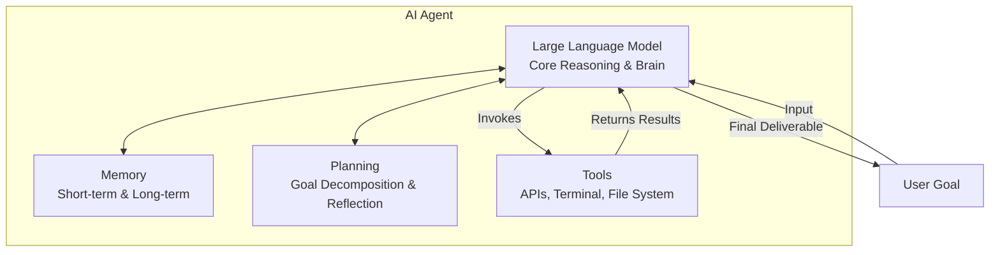

# AI Agents & Vibe Coding: Overview

We are living through one of the most significant paradigm shifts in the history of computing. For decades, software development was defined by humans writing line-by-line code in programming languages that compilers translated into machine instructions. 

Today, we are shifting to a new model: **Vibe Coding**. In this new era, developers express high-level intent, design systems, and coordinate autonomous **AI Agents** that write, test, debug, and deploy the code.

This guide provides a comprehensive introduction to AI Agents, how they work, and how they power the modern vibe-coding workflow.

---

## 👶 ELI5: What is an AI Agent?

Imagine you want to build a wooden doghouse.

*   **Traditional Programming:** You have to write down *every single movement* the hammer and saw must make. Move arm up 10 inches, move down with 5 pounds of force, hit the nail at exactly 90 degrees. If the wood is slightly damp, the hammer has no idea and splits the wood.
*   **Simple LLM Chatbot (ChatGPT/Claude):** You have a smart apprentice. You say, *"Tell me the steps to build a doghouse."* The apprentice prints out a detailed blueprint and instruction manual. But you still have to pick up the hammer, buy the wood, and build it yourself.
*   **AI Agent:** You have an autonomous builder with a toolbox. You say, *"Build a doghouse in the backyard."* 
    1. The builder walks to the backyard and measures the space (**Perception**).
    2. They write down a list of materials (**Planning**).
    3. They go to the hardware store and buy the wood using your card (**Tool Use**).
    4. They start building. If a board splits, they don't stop and freeze; they inspect the split, adjust their angle, or use wood glue to fix it (**Self-Correction/Reflection**).
    5. They deliver a completed doghouse (**Goal Achievement**).

An **AI Agent** is not just a text generator; it is an LLM equipped with **senses, memory, tools, and the autonomy to act** until it achieves a specific goal.

---

## ⚙️ The Core Agent Formula

To understand AI Agents, remember this simple formula:

$$\text{Agent} = \text{LLM (Brain)} + \text{Memory} + \text{Planning} + \text{Tools}$$

Let's break down each component:

### 1. The Brain: The Large Language Model (LLM)
The LLM serves as the central cognitive engine. It parses text, makes decisions, evaluates outputs, and decides what actions to take next. It acts as the "executive function" of the agent.

### 2. Memory
Without memory, an agent is amnesic. Every request starts from scratch. Memory gives agents context over time:
*   **Short-term (In-context) Memory:** The ongoing conversation history and temporary variables.
*   **Long-term Memory:** Access to external knowledge stores (Vector Databases, personal wikis, or historical interaction logs) that persist across sessions.
*   **Episodic Memory:** Recalling past execution traces to avoid repeating mistakes.

### 3. Planning & Reasoning
How the agent decides to achieve a goal:
*   **Decomposition:** Breaking a large task (e.g., "Build a full-stack e-commerce app") into small, manageable tasks (e.g., "Design database schema", "Write backend API", "Create login page").
*   **Self-Reflection & Evaluation:** Analyzing its own output, identifying errors (e.g., compiler crashes), and correcting them before showing them to the user.

### 4. Tools
Tools allow the agent to interact with the physical and digital world:
*   **Code Executions:** Sandboxed terminals or runtimes (like a Python interpreter or Node.js shell).
*   **APIs:** Ability to fetch weather data, search Google, or query a database.
*   **File Systems:** Reading and writing local codebase files.
*   **MCP (Model Context Protocol):** A standardized gateway connecting agents to custom IDE contexts, databases, and enterprise applications.

---

## 🚀 The Shift from Chatbots to Agents

Understanding this evolution helps us see why "agents nowadays" are so different from early LLM applications:

| Generation | Paradigm | User Input | AI Capability | Example |
| :--- | :--- | :--- | :--- | :--- |
| **Gen 1 (2022-2023)** | **Direct Completion** | Short prompts, precise questions | Generates a single block of text or code. No loop. | ChatGPT (GPT-3.5), early playground models |
| **Gen 2 (2023-2024)** | **RAG & Chatbots** | Contextual queries with documents | Retrieves documents (Vector Search) and answers questions using that context. | Custom GPTs, Retrieval-Augmented Chatbots |
| **Gen 3 (2024-2025)** | **Agentic Workflows** | High-level goals | Interacts in loop (ReAct), calls APIs, edits files, runs tests, self-corrects. | Cursor Composer, Devin, Windsurf, Antigravity |
| **Gen 4 (Present/2026)** | **Multi-Agent Systems** | Enterprise/System goals | Teams of specialized agents collaborating via message passing and standardized protocols (MCP). | Production LangGraph teams, AutoGen networks |

---

## 🎨 What is Vibe Coding?

> **Vibe Coding** is a software engineering style where a developer does not write code manually line-by-line. Instead, the developer acts as a **systems architect, product manager, and code reviewer**, while one or more autonomous AI agents handle the syntax, implementation, and debugging.

### Why "Vibe" Coding?
The word "vibe" comes from the feeling of steering the development flow rather than typing the code. You "vibe" with the AI:
1. You describe what you want in plain English.
2. You watch the agent write code, create directories, and run commands.
3. You review the diffs (changes) to ensure the agent is building the right architecture.
4. You run tests or look at the web browser to verify the "vibe" (the application behavior) is correct.
5. If anything is broken, you describe the problem, and the agent fixes it.

### Traditional vs. Vibe Coding Comparison

| Phase | Traditional Developer | Vibe Coder |
| :--- | :--- | :--- |
| **Syntax & Boilers** | Manually writes imports, configurations, boilerplate classes | Completely automated by the Agent |
| **Debugging** | Reads stack traces, searches StackOverflow, modifies variables | Pastes stack trace or directs agent to run tests and fix the bugs |
| **System Architecture** | Decided implicitly while writing files | Decided explicitly via specifications and implementation plans |
| **Testing** | Manually writes unit/integration tests (often skipped due to time) | Tells the agent: *"Write unit tests covering 90% path coverage"* |
| **Speed** | 1x to 2x (bounded by typing speed and syntax lookup) | 10x to 50x (bounded by context-window token size and reasoning speed) |

---

## 💼 Key Use Cases of AI Agents Nowadays

AI Agents are no longer toys. In modern engineering teams, they are deployed for:

1.  **Autonomous Feature Engineering:** Giving an agent a ticket from Jira, letting it locate the files, implement the feature, write unit tests, and open a Pull Request.
2.  **Code Translation & Migration:** Migrating a codebase from legacy Java 8 to Java 21, or converting a JavaScript application to TypeScript.
3.  **Automated Security Patching:** Scanning files for vulnerabilities, writing a patch, and verifying that the build still passes.
4.  **DevOps & Infrastructure-as-Code:** Writing Terraform scripts, applying them in dry-run, reading errors, and updating variables automatically.
5.  **Interactive Data Analysis:** Writing Python scripts on the fly to parse massive CSV files, plotting graphs, and providing summaries.

---

## 🎓 Summary Checklist for Learners

If you are beginning your journey with AI Agents, focus on understanding these core concepts (which we detail in the next chapters):
- [ ] **Agent Architectures ([agents.md](file:///Users/lukhuong/Desktop/docusaurus-knowledge-base-template/docs/technical-knowledge/ai-agents/agents.md)):** Learn ReAct loops, planning frameworks, and multi-agent designs.
- [ ] **Agentic Skills ([skills.md](file:///Users/lukhuong/Desktop/docusaurus-knowledge-base-template/docs/technical-knowledge/ai-agents/skills.md)):** Understand how function calling, Vector DBs, and the new **Model Context Protocol (MCP)** work.
- [ ] **Agent Harnesses ([harness.md](file:///Users/lukhuong/Desktop/docusaurus-knowledge-base-template/docs/technical-knowledge/ai-agents/harness.md)):** Explore the runtimes that execute agents, keep them secure, and evaluate their success rates.
- [ ] **Vibe Coding Workflows ([vibe-coding.md](file:///Users/lukhuong/Desktop/docusaurus-knowledge-base-template/docs/technical-knowledge/ai-agents/vibe-coding.md)):** Master the art of prompting, structuring projects, and steering agents for high-speed delivery.
