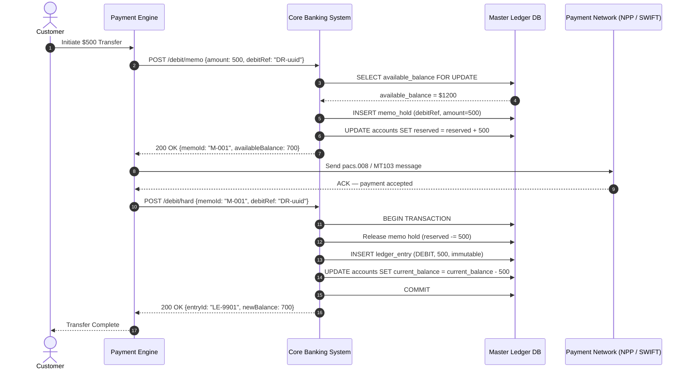
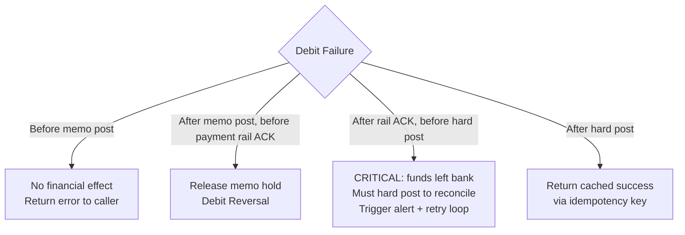

# Debit Posting

In core banking and payment processing, a **Debit Post** is the act of recording a decrease in a customer's account balance — representing the withdrawal or transfer of funds **out** of the account.

Because a bank operates on **liability accounting conventions** (customer deposits are a liability on the bank's balance sheet), a debit *decreases* a liability account. This is the inverse of how most engineers intuitively think about debits.

Debit posting is one of the **highest-risk operations in financial systems** because:
- Errors directly impact customer funds
- Race conditions can cause double-spends or over-debits
- Regulatory frameworks (AML, PSD2, APRA CPS 234) require full audit trails
- Network failures between distributed components must never result in either data loss or duplicate financial effects

---

## Accounting Primer: Why Debit Decreases a Liability

```
Bank's Balance Sheet:
  Assets      = Liabilities + Equity
  Bank's Cash = Customer Deposits (Liability) + Bank Capital

When customer withdraws $100:
  Bank's Cash (Asset)         ← decreases by $100
  Customer Deposit (Liability) ← decreases by $100  ← this is the "Debit Post"
```

In double-entry bookkeeping, every transaction touches at least two accounts:

| Entry | Account | Type | Effect |
|:---|:---|:---|:---|
| Debit | Customer Deposit Account | Liability | Decreases liability (funds leave customer) |
| Credit | Nostro / Settlement Account | Asset | Decreases bank's cash (funds sent out) |

This is why every debit post must produce **two ledger entries** — a single-sided entry is an accounting error that will fail reconciliation.

---

## The Two-Stage Execution Model: Memo Post → Hard Post

Debit posting is almost never a single atomic operation. High-volume transactional accounts use a two-stage model to guarantee safety during the settlement window.



### Stage 1: Memo Post (Authorization / Hold)

The Memo Post **reserves** funds without touching the immutable ledger balance.

**What changes:**
- `reserved_funds` increases by the debit amount
- `available_balance` = `current_balance - reserved_funds + overdraft_limit` — this decreases immediately

**What does NOT change:**
- `current_balance` — the official accounting balance
- The immutable ledger journal — no ledger entry is written yet

**Why this matters:**
- If the payment network rejects or times out, the hold is released with zero ledger impact
- The customer cannot double-spend reserved funds (available balance enforces this)
- Regulatory capital calculations use `current_balance`; premature changes cause compliance issues

### Stage 2: Hard Post (Settlement / Clearing)

The Hard Post is the **irreversible, double-entry ledger event** that officially records the debit.

**What changes:**
- `current_balance` decreases
- An immutable `ledger_entry` row is inserted (never updated or deleted)
- `reserved_funds` decreases (the memo hold is released simultaneously)
- A corresponding credit entry is written to the bank's settlement/nostro account

**Atomicity requirement:** The memo release + ledger insert + balance update must be a single database transaction. Partial commits here are an accounting error.

```
Timeline view:
T=0ms   Customer initiates transfer
T=10ms  Memo Post: available_balance drops $500 (customer sees reduced balance)
T=200ms Payment network processes clearing
T=250ms Hard Post: current_balance drops $500, memo released, ledger entry written
T=251ms Customer sees final settled balance
```

---

## Balance Types and Their Definitions

Banks maintain multiple balance views, each with a distinct purpose:

| Balance Type | Formula | Who Uses It | Updated When |
|:---|:---|:---|:---|
| **Current Balance** | Sum of all hard-posted ledger entries | Regulatory reporting, interest calc | Hard Post only |
| **Available Balance** | `current_balance - reserved_funds + overdraft_limit` | Customer-facing, transaction approval | Memo Post + Hard Post |
| **Ledger Balance** | Current Balance at start of business day | EOD reconciliation, statements | Nightly batch |
| **Shadow Balance** | Real-time projection including pending debits | Fraud / risk engines | Every event |

---

## Database Schema

```sql
-- Core accounts table
CREATE TABLE accounts (
    account_id          UUID PRIMARY KEY DEFAULT gen_random_uuid(),
    customer_id         UUID NOT NULL,
    currency            CHAR(3) NOT NULL DEFAULT 'AUD',
    current_balance     NUMERIC(19, 4) NOT NULL DEFAULT 0,
    reserved_funds      NUMERIC(19, 4) NOT NULL DEFAULT 0,
    overdraft_limit     NUMERIC(19, 4) NOT NULL DEFAULT 0,
    status              VARCHAR(20) NOT NULL DEFAULT 'ACTIVE',  -- ACTIVE, FROZEN, BLOCKED, CLOSED
    version             BIGINT NOT NULL DEFAULT 0,              -- Optimistic lock version
    updated_at          TIMESTAMPTZ NOT NULL DEFAULT NOW(),
    CONSTRAINT balance_non_negative CHECK (current_balance + overdraft_limit >= 0)
);

-- Memo holds table — transient, released on hard post or reversal
CREATE TABLE memo_holds (
    memo_id             UUID PRIMARY KEY DEFAULT gen_random_uuid(),
    account_id          UUID NOT NULL REFERENCES accounts(account_id),
    debit_ref           VARCHAR(64) NOT NULL,                   -- Idempotency key from Payment Engine
    amount              NUMERIC(19, 4) NOT NULL,
    status              VARCHAR(20) NOT NULL DEFAULT 'ACTIVE',  -- ACTIVE, RELEASED, EXPIRED
    reason_code         VARCHAR(32),
    channel             VARCHAR(32),                            -- NPP, SWIFT, ATM, ONLINE
    expires_at          TIMESTAMPTZ NOT NULL,                   -- Auto-release if payment rail times out
    created_at          TIMESTAMPTZ NOT NULL DEFAULT NOW(),
    CONSTRAINT amount_positive CHECK (amount > 0),
    UNIQUE (debit_ref)                                          -- Idempotency enforcement at DB level
);

-- Immutable ledger journal — NEVER UPDATE OR DELETE rows here
CREATE TABLE ledger_entries (
    entry_id            UUID PRIMARY KEY DEFAULT gen_random_uuid(),
    account_id          UUID NOT NULL REFERENCES accounts(account_id),
    debit_ref           VARCHAR(64) NOT NULL,
    entry_type          VARCHAR(10) NOT NULL,                   -- DEBIT or CREDIT
    amount              NUMERIC(19, 4) NOT NULL,
    running_balance     NUMERIC(19, 4) NOT NULL,                -- Balance after this entry
    value_date          DATE NOT NULL,                          -- Accounting date (may differ from created_at)
    narrative           TEXT,
    channel             VARCHAR(32),
    created_at          TIMESTAMPTZ NOT NULL DEFAULT NOW(),
    CONSTRAINT amount_positive CHECK (amount > 0),
    UNIQUE (debit_ref, entry_type)                              -- Prevent duplicate hard posts
);

-- Idempotency cache — deduplicates retried requests at application layer
CREATE TABLE debit_idempotency (
    debit_ref           VARCHAR(64) PRIMARY KEY,
    status              VARCHAR(20) NOT NULL,                   -- PROCESSING, COMPLETED, FAILED
    response_body       JSONB,                                  -- Cached response for duplicate requests
    created_at          TIMESTAMPTZ NOT NULL DEFAULT NOW(),
    expires_at          TIMESTAMPTZ NOT NULL                    -- TTL for cleanup job
);
```

---

## Controls Checklist (Pre-Debit Validation)

Every debit request must pass these gates **before** any balance modification:

```java
@Service
@Slf4j
public class DebitValidationService {

    public void validate(DebitRequest request, Account account) {
        // 1. Account status
        if (account.getStatus() != AccountStatus.ACTIVE) {
            throw new AccountNotEligibleException(
                account.getAccountId(), account.getStatus(),
                "Account must be ACTIVE to process debit"
            );
        }

        // 2. Available balance (includes overdraft)
        BigDecimal available = account.getCurrentBalance()
            .subtract(account.getReservedFunds())
            .add(account.getOverdraftLimit());

        if (available.compareTo(request.getAmount()) < 0) {
            throw new InsufficientFundsException(
                account.getAccountId(), request.getAmount(), available
            );
        }

        // 3. Transaction limit controls
        if (request.getAmount().compareTo(account.getSingleTransactionLimit()) > 0) {
            throw new TransactionLimitExceededException(
                request.getAmount(), account.getSingleTransactionLimit()
            );
        }

        // 4. Daily debit limit (requires sum query on today's ledger entries)
        BigDecimal todayDebits = ledgerRepository.sumTodayDebits(account.getAccountId());
        if (todayDebits.add(request.getAmount()).compareTo(account.getDailyDebitLimit()) > 0) {
            throw new DailyLimitExceededException(
                request.getAmount(), account.getDailyDebitLimit(), todayDebits
            );
        }

        // 5. Currency match
        if (!account.getCurrency().equals(request.getCurrency())) {
            throw new CurrencyMismatchException(account.getCurrency(), request.getCurrency());
        }

        // 6. Idempotency key must be present
        if (request.getDebitRef() == null || request.getDebitRef().isBlank()) {
            throw new MissingIdempotencyKeyException("debitRef is required on every debit request");
        }
    }
}
```

---

## Locking Strategies for Concurrent Debits

Account balances are **hot rows** — the same `account_id` row can be targeted by dozens of concurrent debit requests. This is the hardest concurrency problem in banking systems.

### Pessimistic Locking (`SELECT FOR UPDATE`)

Pessimistic locking acquires an exclusive row-level lock before reading, blocking all other writers until the transaction commits.

```java
@Repository
public interface AccountRepository extends JpaRepository<Account, UUID> {

    // JPQL with pessimistic write lock — generates SELECT ... FOR UPDATE
    @Lock(LockModeType.PESSIMISTIC_WRITE)
    @Query("SELECT a FROM Account a WHERE a.accountId = :accountId")
    Optional<Account> findByIdForUpdate(@Param("accountId") UUID accountId);
}

@Service
@Transactional(isolation = Isolation.READ_COMMITTED)
@Slf4j
public class MemoPostService {

    private final AccountRepository accountRepository;
    private final MemoHoldRepository memoHoldRepository;
    private final DebitIdempotencyRepository idempotencyRepository;

    public MemoPostResponse memoPost(MemoPostRequest request) {
        // 1. Idempotency check BEFORE acquiring lock — fast path for retries
        return idempotencyRepository.findByDebitRef(request.getDebitRef())
            .map(record -> buildCachedResponse(record))
            .orElseGet(() -> executeNewMemoPost(request));
    }

    private MemoPostResponse executeNewMemoPost(MemoPostRequest request) {
        // 2. Reserve idempotency slot (unique constraint prevents races)
        idempotencyRepository.save(DebitIdempotency.processing(request.getDebitRef()));

        // 3. Acquire pessimistic lock on account row
        Account account = accountRepository.findByIdForUpdate(request.getAccountId())
            .orElseThrow(() -> new AccountNotFoundException(request.getAccountId()));

        // 4. Validate
        validationService.validate(request, account);

        // 5. Create memo hold
        MemoHold hold = MemoHold.builder()
            .accountId(request.getAccountId())
            .debitRef(request.getDebitRef())
            .amount(request.getAmount())
            .channel(request.getChannel())
            .expiresAt(Instant.now().plus(30, MINUTES))
            .build();
        memoHoldRepository.save(hold);

        // 6. Update reserved funds
        account.setReservedFunds(account.getReservedFunds().add(request.getAmount()));
        accountRepository.save(account);

        // 7. Mark idempotency as complete
        MemoPostResponse response = MemoPostResponse.success(hold.getMemoId(),
            account.getAvailableBalance());
        idempotencyRepository.markCompleted(request.getDebitRef(), response);

        return response;
    }
}
```

**Pessimistic locking is the correct default for debit operations.** The contention is real and frequent, and optimistic lock retries are dangerous in a financial context — a retry might succeed after another debit has already consumed the available balance.

### Optimistic Locking (`@Version`) — When to Use

Optimistic locking is appropriate only for **low-contention** account operations (e.g., updating notification preferences, limit changes) — not for balance mutations on active accounts.

```java
@Entity
@Table(name = "accounts")
public class Account {

    @Id
    private UUID accountId;

    private BigDecimal currentBalance;
    private BigDecimal reservedFunds;

    @Version
    private Long version;   // Hibernate generates: WHERE id = ? AND version = N

    public BigDecimal getAvailableBalance() {
        return currentBalance.subtract(reservedFunds).add(overdraftLimit);
    }
}
```

If two concurrent debits both read `version = 5`, one will succeed and commit `version = 6`. The second will fail with `OptimisticLockException` — Hibernate detected a stale read. At this point, you must **not blindly retry** without re-validating the balance, because the first debit may have consumed the remaining funds.

```java
// UNSAFE: Blind retry without re-validation
@Retryable(value = OptimisticLockingFailureException.class, maxAttempts = 3)
public void debit(DebitRequest request) { ... }  // ← balance may be insufficient on retry

// SAFE: Re-read, re-validate, then update
@Retryable(value = OptimisticLockingFailureException.class, maxAttempts = 3)
@Transactional
public void debit(DebitRequest request) {
    Account account = accountRepository.findById(request.getAccountId()).orElseThrow();
    validationService.validate(request, account);   // ← Re-validate with fresh balance
    account.setReservedFunds(account.getReservedFunds().add(request.getAmount()));
    accountRepository.save(account);
}
```

### Lock Contention Mitigation at Scale

For accounts with extreme transaction frequency (e.g., a business account processing thousands of transactions per minute), row-level locking serializes all writes and becomes a bottleneck.

**Strategy 1: Queue-per-Account**
Route all debit requests for the same `account_id` to a single-threaded consumer (e.g., Kafka partition by `account_id`). Eliminates lock contention entirely because only one writer touches the account at a time.

```java
// Producer: partition by account_id ensures ordering
kafkaTemplate.send(MessageBuilder
    .withPayload(debitRequest)
    .setHeader(KafkaHeaders.TOPIC, "debit-requests")
    .setHeader(KafkaHeaders.MESSAGE_KEY, request.getAccountId().toString())  // ← partition key
    .build());

// Consumer: single-threaded per partition — no lock contention
@KafkaListener(topics = "debit-requests", groupId = "debit-processor", concurrency = "12")
public void processDebit(DebitRequest request) {
    // Only one thread processes this account_id at a time (within this consumer group)
    memoPostService.executeNewMemoPost(request);
}
```

**Strategy 2: In-Memory Account Lock (Single JVM)**
Use a `ConcurrentHashMap` of `ReentrantLock` per account within a single JVM, combined with a DB advisory lock for multi-instance deployments.

```java
@Component
public class AccountLockManager {

    // Striped locks reduce ConcurrentHashMap contention
    private final Striped<Lock> stripedLocks = Striped.lock(512);

    public <T> T withAccountLock(UUID accountId, Supplier<T> operation) {
        Lock lock = stripedLocks.get(accountId);
        lock.lock();
        try {
            return operation.get();
        } finally {
            lock.unlock();
        }
    }
}
```

---

## Idempotency — Exactly-Once Financial Effect

### Why Exactly-Once Is Non-Negotiable

Payment engines operate with at-least-once delivery semantics. A debit API must be hardened to return the same result on any number of retries without duplicating the financial effect.

```
Failure scenarios that trigger retries:
  1. Network timeout — client never received the response
  2. Load balancer failover — request replayed to new instance
  3. Payment engine crash + restart — replays from last checkpoint
  4. Human operator retries an "unknown" transaction
```

### Full Idempotency Implementation

```java
@Entity
@Table(name = "debit_idempotency")
public class DebitIdempotency {

    @Id
    private String debitRef;

    @Enumerated(EnumType.STRING)
    private IdempotencyStatus status;   // PROCESSING, COMPLETED, FAILED

    @Column(columnDefinition = "jsonb")
    @Convert(converter = JsonbConverter.class)
    private Map<String, Object> responseBody;

    private Instant createdAt;
    private Instant expiresAt;

    public static DebitIdempotency processing(String debitRef) {
        return new DebitIdempotency(debitRef, PROCESSING, null,
            Instant.now(), Instant.now().plus(24, HOURS));
    }
}

@Service
@Slf4j
public class IdempotentDebitGateway {

    private final DebitIdempotencyRepository idempotencyRepo;
    private final MemoPostService memoPostService;
    private final ObjectMapper objectMapper;

    @Transactional
    public DebitResponse processDebit(DebitRequest request) {
        String debitRef = request.getDebitRef();

        // Fast path: check existing record WITHOUT holding any account lock
        Optional<DebitIdempotency> existing = idempotencyRepo.findById(debitRef);
        if (existing.isPresent()) {
            return handleExistingRecord(existing.get(), request);
        }

        // Slow path: try to insert idempotency record (unique constraint is the guard)
        try {
            idempotencyRepo.saveAndFlush(DebitIdempotency.processing(debitRef));
        } catch (DataIntegrityViolationException e) {
            // Race condition: another instance just inserted the same debitRef
            // Re-read and return its result
            return handleExistingRecord(
                idempotencyRepo.findById(debitRef).orElseThrow(), request
            );
        }

        // Execute the actual debit
        try {
            DebitResponse response = memoPostService.executeNewMemoPost(request);
            idempotencyRepo.markCompleted(debitRef, toMap(response));
            return response;
        } catch (InsufficientFundsException | AccountNotEligibleException e) {
            // Business rule failure — idempotent: same error on retry
            idempotencyRepo.markFailed(debitRef, e.getClass().getSimpleName(), e.getMessage());
            throw e;
        } catch (Exception e) {
            // System error — mark FAILED so retry can attempt again
            // (distinguishing transient vs. permanent failure is critical here)
            idempotencyRepo.markFailed(debitRef, "SYSTEM_ERROR", e.getMessage());
            throw e;
        }
    }

    private DebitResponse handleExistingRecord(DebitIdempotency record, DebitRequest request) {
        return switch (record.getStatus()) {
            case COMPLETED -> {
                log.info("Returning cached debit response for debitRef={}", request.getDebitRef());
                yield fromMap(record.getResponseBody(), DebitResponse.class);
            }
            case PROCESSING -> {
                // Another instance is currently processing this exact debitRef
                // Return 409 Conflict — caller should retry after a delay
                throw new DebitInFlightException(request.getDebitRef());
            }
            case FAILED -> {
                // Previous attempt had a permanent business failure — return same error
                throw new PreviousDebitFailedException(record.getResponseBody());
            }
        };
    }
}
```

**Critical design choices:**

1. **Unique constraint as the guard, not application logic.** Two concurrent requests with the same `debitRef` will both try `INSERT`; exactly one succeeds due to the DB constraint. The loser catches `DataIntegrityViolationException` and reads the winner's record.

2. **Distinguish transient vs. permanent failures.** A `FAILED` record for `InsufficientFundsException` must return the same error on retry — the business condition is permanent. A `FAILED` record for a DB connection timeout may be retried.

3. **`PROCESSING` status prevents concurrent duplicate processing.** Without it, two retries arriving while the first is still in-flight could both pass the idempotency check and execute two debits.

---

## Hard Post Implementation

```java
@Service
@Slf4j
public class HardPostService {

    private final AccountRepository accountRepository;
    private final MemoHoldRepository memoHoldRepository;
    private final LedgerEntryRepository ledgerEntryRepository;
    private final ApplicationEventPublisher eventPublisher;

    @Transactional(isolation = Isolation.READ_COMMITTED)
    public HardPostResponse hardPost(HardPostRequest request) {
        // 1. Load and lock memo hold
        MemoHold hold = memoHoldRepository.findByMemoIdForUpdate(request.getMemoId())
            .orElseThrow(() -> new MemoHoldNotFoundException(request.getMemoId()));

        if (hold.getStatus() != MemoHoldStatus.ACTIVE) {
            throw new MemoHoldAlreadyReleasedException(request.getMemoId(), hold.getStatus());
        }

        // 2. Lock account row
        Account account = accountRepository.findByIdForUpdate(hold.getAccountId())
            .orElseThrow(() -> new AccountNotFoundException(hold.getAccountId()));

        // 3. Double-check current balance (safety net — should always pass if memo hold is valid)
        BigDecimal newBalance = account.getCurrentBalance().subtract(hold.getAmount());
        if (newBalance.add(account.getOverdraftLimit()).compareTo(BigDecimal.ZERO) < 0) {
            // This is a critical invariant violation — alert immediately
            log.error("INVARIANT VIOLATION: hard post would produce negative balance below overdraft. " +
                "accountId={}, currentBalance={}, amount={}, overdraftLimit={}",
                account.getAccountId(), account.getCurrentBalance(),
                hold.getAmount(), account.getOverdraftLimit());
            throw new HardPostInvariantViolationException(account.getAccountId());
        }

        // 4. Write immutable ledger entry (DEBIT side)
        LedgerEntry debitEntry = LedgerEntry.builder()
            .accountId(account.getAccountId())
            .debitRef(hold.getDebitRef())
            .entryType(EntryType.DEBIT)
            .amount(hold.getAmount())
            .runningBalance(newBalance)
            .valueDate(LocalDate.now())
            .channel(hold.getChannel())
            .narrative(request.getNarrative())
            .build();
        ledgerEntryRepository.save(debitEntry);

        // 5. Atomically: release memo hold + update current balance
        hold.setStatus(MemoHoldStatus.RELEASED);
        memoHoldRepository.save(hold);

        account.setCurrentBalance(newBalance);
        account.setReservedFunds(account.getReservedFunds().subtract(hold.getAmount()));
        accountRepository.save(account);

        // 6. Publish domain event (for downstream projections, notifications, audit)
        eventPublisher.publishEvent(new DebitHardPostedEvent(
            account.getAccountId(), hold.getDebitRef(),
            hold.getAmount(), newBalance, debitEntry.getEntryId()
        ));

        log.info("Hard post complete. accountId={}, debitRef={}, amount={}, newBalance={}",
            account.getAccountId(), hold.getDebitRef(), hold.getAmount(), newBalance);

        return HardPostResponse.success(debitEntry.getEntryId(), newBalance);
    }
}
```

---

## Failure and Recovery Patterns

### Failure Taxonomy



### Scenario Handling

| Scenario | Detection | Recovery Action |
|:---|:---|:---|
| **Network timeout after memo post success** | Payment engine retries with same `debitRef` | Idempotency cache returns `COMPLETED` memo response |
| **Payment rail rejects after memo hold** | NPP / SWIFT NACK message received | Release memo hold → decrement `reserved_funds` → notify customer |
| **Hard post fails after rail ACK** | Reconciliation job detects rail-settled but no ledger entry | Replay hard post from memo hold record |
| **DB crash mid-hard-post transaction** | PostgreSQL WAL ensures transaction rollback | Retry hard post — idempotent due to unique `(debit_ref, entry_type)` constraint |
| **Consumer duplicate in Kafka pipeline** | Same event delivered twice | Idempotency key deduplicates at service layer |
| **Hold expires before hard post** | Scheduled job marks EXPIRED holds | Reconcile with rail — if payment settled, force hard post; if not, release |

### Hold Expiry Management

Memo holds must auto-expire if the payment rail never responds:

```java
@Component
@Slf4j
public class MemoHoldExpiryJob {

    private final MemoHoldRepository memoHoldRepository;
    private final AccountRepository accountRepository;
    private final PaymentRailQueryService railQueryService;

    @Scheduled(fixedDelay = 60_000)   // Run every 60 seconds
    @Transactional
    public void expireStaleHolds() {
        List<MemoHold> expiredHolds = memoHoldRepository
            .findByStatusAndExpiresAtBefore(MemoHoldStatus.ACTIVE, Instant.now());

        for (MemoHold hold : expiredHolds) {
            try {
                // Check payment rail before releasing — the payment may have settled
                PaymentStatus railStatus = railQueryService.query(hold.getDebitRef());

                if (railStatus == PaymentStatus.SETTLED) {
                    // Payment went through — we MUST hard post, not release
                    log.warn("Hold expired but payment settled. Force hard-posting. debitRef={}",
                        hold.getDebitRef());
                    hardPostService.forceHardPost(hold);
                } else {
                    // Safe to release
                    releaseHold(hold);
                    log.info("Released expired hold. debitRef={}, amount={}",
                        hold.getDebitRef(), hold.getAmount());
                }
            } catch (Exception e) {
                log.error("Failed to process expired hold. debitRef={}", hold.getDebitRef(), e);
                // Alert on-call — manual intervention may be required
                alertService.criticalAlert("HOLD_EXPIRY_FAILURE", hold.getDebitRef());
            }
        }
    }

    private void releaseHold(MemoHold hold) {
        Account account = accountRepository.findByIdForUpdate(hold.getAccountId()).orElseThrow();
        account.setReservedFunds(account.getReservedFunds().subtract(hold.getAmount()));
        accountRepository.save(account);
        hold.setStatus(MemoHoldStatus.EXPIRED);
        memoHoldRepository.save(hold);
    }
}
```

---

## Saga Compensation: Debit Reversal

When a debit must be reversed (e.g., as a compensating action in a payment saga), the reversal must:
1. Write a **credit ledger entry** to offset the original debit — never delete the original entry
2. Update `current_balance` upward
3. Reference the original `debit_ref` for traceability

```java
@Service
@Slf4j
public class DebitReversalService {

    @Transactional
    public ReversalResponse reverseHardPost(ReversalRequest request) {
        // 1. Locate original ledger entry
        LedgerEntry originalDebit = ledgerEntryRepository
            .findByDebitRefAndEntryType(request.getOriginalDebitRef(), EntryType.DEBIT)
            .orElseThrow(() -> new LedgerEntryNotFoundException(request.getOriginalDebitRef()));

        // 2. Check no reversal already exists (idempotency)
        if (ledgerEntryRepository.existsByDebitRefAndEntryType(
                request.getOriginalDebitRef(), EntryType.REVERSAL)) {
            log.info("Reversal already exists for debitRef={}", request.getOriginalDebitRef());
            return ReversalResponse.alreadyReversed(request.getOriginalDebitRef());
        }

        // 3. Lock and update account
        Account account = accountRepository.findByIdForUpdate(originalDebit.getAccountId())
            .orElseThrow();
        BigDecimal newBalance = account.getCurrentBalance().add(originalDebit.getAmount());
        account.setCurrentBalance(newBalance);
        accountRepository.save(account);

        // 4. Write immutable reversal entry (credit side)
        LedgerEntry reversal = LedgerEntry.builder()
            .accountId(originalDebit.getAccountId())
            .debitRef(request.getOriginalDebitRef() + "-REV")
            .entryType(EntryType.REVERSAL)
            .amount(originalDebit.getAmount())
            .runningBalance(newBalance)
            .valueDate(LocalDate.now())
            .narrative("REVERSAL: " + request.getReasonCode() + " — " + request.getNarrative())
            .build();
        ledgerEntryRepository.save(reversal);

        eventPublisher.publishEvent(new DebitReversedEvent(
            originalDebit.getAccountId(), request.getOriginalDebitRef(),
            originalDebit.getAmount(), newBalance, request.getReasonCode()
        ));

        log.info("Debit reversal complete. originalDebitRef={}, amount={}, newBalance={}",
            request.getOriginalDebitRef(), originalDebit.getAmount(), newBalance);

        return ReversalResponse.success(reversal.getEntryId(), newBalance);
    }
}
```

**Golden rule of ledger accounting:** Corrections are made by **adding new offsetting entries**, never by modifying or deleting existing ones. An auditor must be able to reconstruct every balance state from the ledger journal alone.

---

## Observability

Every debit operation must emit structured events and metrics for real-time monitoring and regulatory audit.

```java
@Aspect
@Component
@Slf4j
public class DebitAuditAspect {

    private final MeterRegistry meterRegistry;
    private final AuditEventRepository auditRepository;

    @Around("@annotation(Audited)")
    public Object auditDebit(ProceedingJoinPoint joinPoint) throws Throwable {
        DebitRequest request = (DebitRequest) joinPoint.getArgs()[0];
        long start = System.currentTimeMillis();
        String outcome = "SUCCESS";

        try {
            Object result = joinPoint.proceed();
            return result;
        } catch (Exception e) {
            outcome = e.getClass().getSimpleName();
            throw e;
        } finally {
            long duration = System.currentTimeMillis() - start;

            // Structured audit log (ingested by SIEM / compliance tooling)
            log.info("DEBIT_AUDIT debitRef={} accountId={} amount={} currency={} outcome={} durationMs={}",
                request.getDebitRef(), request.getAccountId(), request.getAmount(),
                request.getCurrency(), outcome, duration);

            // Metrics
            meterRegistry.timer("debit.duration",
                "outcome", outcome,
                "channel", request.getChannel())
                .record(duration, TimeUnit.MILLISECONDS);

            meterRegistry.counter("debit.requests",
                "outcome", outcome,
                "channel", request.getChannel())
                .increment();
        }
    }
}
```

**Key SLOs for debit systems:**

| Metric | Warning | Critical |
|:---|:---|:---|
| Memo post p99 latency | > 100ms | > 500ms |
| Hard post p99 latency | > 200ms | > 1s |
| Idempotency collision rate | > 1% | > 5% (indicates replay storms) |
| Active memo holds > 30min | > 1% of total | > 5% (payment rail issue) |
| Hard post failure rate | > 0.01% | > 0.1% (immediate alert) |
| Ledger reconciliation gap | > 0 | > 0 for > 5min (critical) |

---

## Interview Decision Matrix

| Requirement | Approach | Reason |
|:---|:---|:---|
| High-contention account (active business account) | Pessimistic lock (`FOR UPDATE`) + Kafka per-account partition | Eliminates retry storms; single writer guarantees ordering |
| Low-volume personal accounts | Pessimistic lock sufficient without queue | Contention is rare; simpler architecture |
| Distributed payment saga | Saga choreography + compensating debit reversal | 2PC is too fragile across services |
| Audit / compliance requirement | Immutable append-only ledger + domain events | Enables full replay and point-in-time balance reconstruction |
| Retry storms from payment engine | Idempotency table with `PROCESSING` guard | Prevents duplicate financial effect |
| Hold expiry / rail timeout | Scheduled expiry job + rail status query before release | Prevents releasing a hold on a payment that actually settled |
| Real-time balance projection | Materialized view or CQRS read model fed by domain events | Decouples read performance from write contention |

---

## 🔗 Related Concepts
- [Credit Posting](./credit_post.md)
- [Debit Reversal](./debit_reversal.md)
- [Payment Lifecycle 101](./payment_lifecycle_101.md)
- [Idempotency Patterns](./idempotency.md)
- [Saga Pattern](../system-design/saga-pattern.md)
- [Optimistic vs. Pessimistic Locking](../database/transactions-concurrency.md#optimistic-vs-pessimistic-locking)