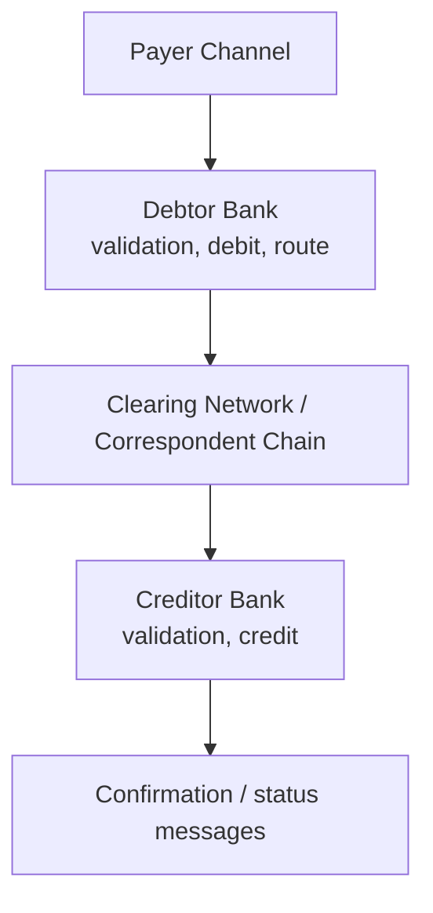

# Off-Us Transactions

An off-us transaction is a payment where source and destination accounts are held at different institutions, so the payment must traverse an external scheme or correspondent network.

## Overview

Off-us payments are the standard interbank case. They require:
- Message exchange via a rail (NPP, BECS, SWIFT, card scheme)
- Clearing to establish obligations
- Settlement to transfer value between institutions

Compared with on-us payments, off-us introduces more dependencies, more failure points, and stricter timing constraints.

## End-to-End Off-Us Flow

Message examples in ISO 20022:
- `pain.001` customer initiation
- `pacs.008` FI-to-FI credit transfer
- `pacs.002` status reports
- `camt.054` debit/credit notifications
- `pacs.004` return when funds must be sent back

## Typical Off-Us Variants

- **Domestic real-time:** e.g., NPP transfer between two banks
- **Domestic batch:** e.g., direct entry / ACH-style processing
- **Cross-border:** SWIFT / correspondent banking with possible multi-hop routing
- **Card payment:** issuer and acquirer are different institutions

## Core Controls in Off-Us

- **Routing correctness:** choose rail based on amount, urgency, cut-off, counterparty reachability
- **Idempotency:** retries must not generate duplicate sends to external network
- **Liquidity checks:** ensure funded settlement positions before release
- **Compliance checks:** sanctions, AML, fraud before outward release
- **Reconciliation:** match outbound instruction vs acknowledgements vs settlement totals

## Common Failure Scenarios

- Counterparty account invalid (`AC01`, `AC04`)
- Insufficient funds at debtor at release time (`AM04`)
- Scheme/network timeout with uncertain final state
- Cut-off missed for batch rails
- Return after initial success (e.g., beneficiary account closed)

Operationally, teams need a clear pending/unknown state and an investigations process for unresolved outcomes.

## On-Us vs Off-Us

| Dimension | On-Us | Off-Us |
|---|---|---|
| Counterparty | Same bank | Other bank |
| External network | No | Yes |
| Settlement | Internal | Interbank |
| Cost and latency | Lower/faster | Higher/slower |
| Exception handling | Mostly internal | Multi-party investigations |

## Related Concepts

- [On-Us Transactions](./onus)
- [Outbound Payments](./outbound)
- [Inbound Payments](./inbound)
- [Clearing](./clearing)
- [Settlement](./settlement)
- [pacs.008](./pacs008)
