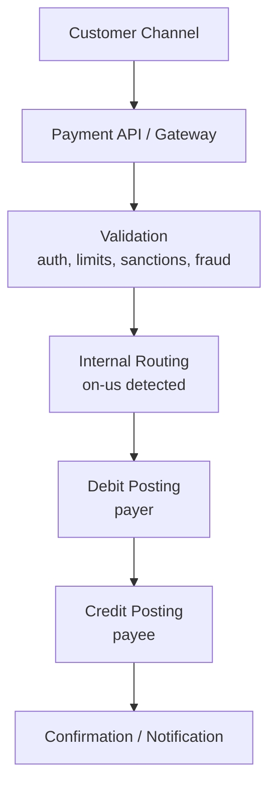

# On-Us Transactions

An on-us transaction is a payment where both source and destination accounts are within the same institution.

## Overview

In an on-us flow, the paying account and receiving account are both held by the same bank (or the same legal entity operating the core ledger). Because no external clearing network is needed, on-us payments are usually faster, cheaper, and operationally simpler than off-us transfers.

Typical examples:
- Transfer between two customers of the same bank
- Internal wallet-to-account movement inside one institution
- Card transaction where issuer and acquirer are the same institution

## On-Us Payment Flow

Key point: settlement is internal ledger movement, not interbank settlement.

## How On-Us Is Determined

Banks usually classify a transaction as on-us when:
- Debtor account and creditor account are found in the same core banking instance or account master
- Routing identifiers (BSB/BIC/member ID) resolve to the same institution
- Product rules do not force external rail processing

If any of these checks fail, the payment is re-routed as off-us.

## Benefits

- **Speed:** no dependency on scheme cut-offs or interbank acknowledgements
- **Cost:** avoids scheme or correspondent bank fees
- **Control:** stronger observability and easier troubleshooting
- **Customer experience:** near-instant confirmation for both payer and payee

## Risks and Controls

- **Atomicity risk:** debit may succeed while credit fails if not implemented as one atomic posting unit
- **Double posting risk:** retries without idempotency can duplicate entries
- **Compliance bypass risk:** teams may incorrectly skip sanctions/fraud checks for internal transfers

Recommended controls:
- Single transactional unit (or saga with compensation)
- Idempotency key on instruction level (`EndToEndId` + account)
- Same AML/sanctions standards as off-us, with proportional thresholds

## Accounting View

For true on-us customer-to-customer transfer:
- Debit customer A account
- Credit customer B account
- Net external position unchanged

Internal settlement account usage depends on bank ledger design, but no net obligation is sent to external clearing.

## On-Us vs Off-Us (Quick Comparison)

| Dimension | On-Us | Off-Us |
|---|---|---|
| Counterparty bank | Same bank | Different bank |
| Clearing scheme | Not required | Required |
| Settlement | Internal ledger | Interbank settlement |
| Processing time | Usually instant | Scheme dependent |
| Cost | Lower | Higher |
| Failure points | Mostly internal systems | Internal + external network |

## Related Concepts

- [Off-Us Transactions](./offus)
- [Outbound Payments](./outbound)
- [Inbound Payments](./inbound)
- [Clearing](./clearing)
- [Settlement](./settlement)
