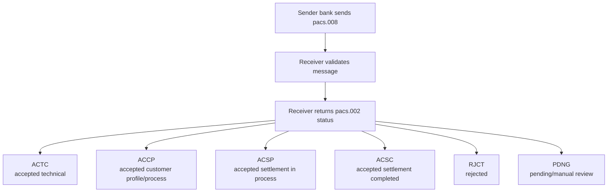

# pacs.002

pacs.002 communicates payment processing status updates between financial institutions.

## Overview

`pacs.002` (`FIToFIPaymentStatusReport`) is used to acknowledge and report the processing status of a payment instruction, usually in response to `pacs.008`, `pacs.009`, `pacs.004`, or cancellation messages.

It is not a funds movement message; it is a status and exception signal.

## Why It Matters

- Gives sending bank visibility into accepted, pending, or rejected instructions
- Supports operational monitoring and customer status updates
- Drives exception workflows and retries
- Provides structured reason codes for failure handling

## Status Lifecycle (Typical)



Status usage varies by scheme. Some rails only emit subsets.

## Message Structure (High Level)

```text
pacs.002
├── GrpHdr (message metadata)
└── OrgnlGrpInfAndSts
    ├── OrgnlMsgId / OrgnlMsgNmId
    ├── OrgnlNbOfTxs / OrgnlCtrlSum (optional)
    └── TxInfAndSts (per transaction status)
        ├── OrgnlInstrId / OrgnlEndToEndId / OrgnlTxId
        ├── TxSts
        └── StsRsnInf (reason code + narrative)
```

## Common Reason Codes

| Code | Meaning |
|---|---|
| `AC01` | Invalid account number |
| `AC04` | Closed account |
| `AC06` | Account blocked |
| `AM04` | Insufficient funds |
| `AG01` | Transaction forbidden |
| `FF01` | File or format error |
| `NARR` | Narrative explanation |

## Engineering Guidance

- Persist each status transition as an immutable event
- Correlate by original IDs (`MsgId`, `InstrId`, `EndToEndId`)
- Handle duplicate `pacs.002` safely (idempotent updates)
- Separate technical ACK from business outcome in customer messaging
- Build timeout logic for missing status responses

## pacs.002 vs pacs.004

- `pacs.002` = status/ack/rejection report
- `pacs.004` = actual return of funds after previous acceptance

A rejected payment may only have `pacs.002` and never produce `pacs.004`.

## Related Concepts

- [pacs.008](./pacs008)
- [pacs.004](./pacs004)
- [Payment Exceptions](./payment_exceptions)
- [Outbound Payments](./outbound)
