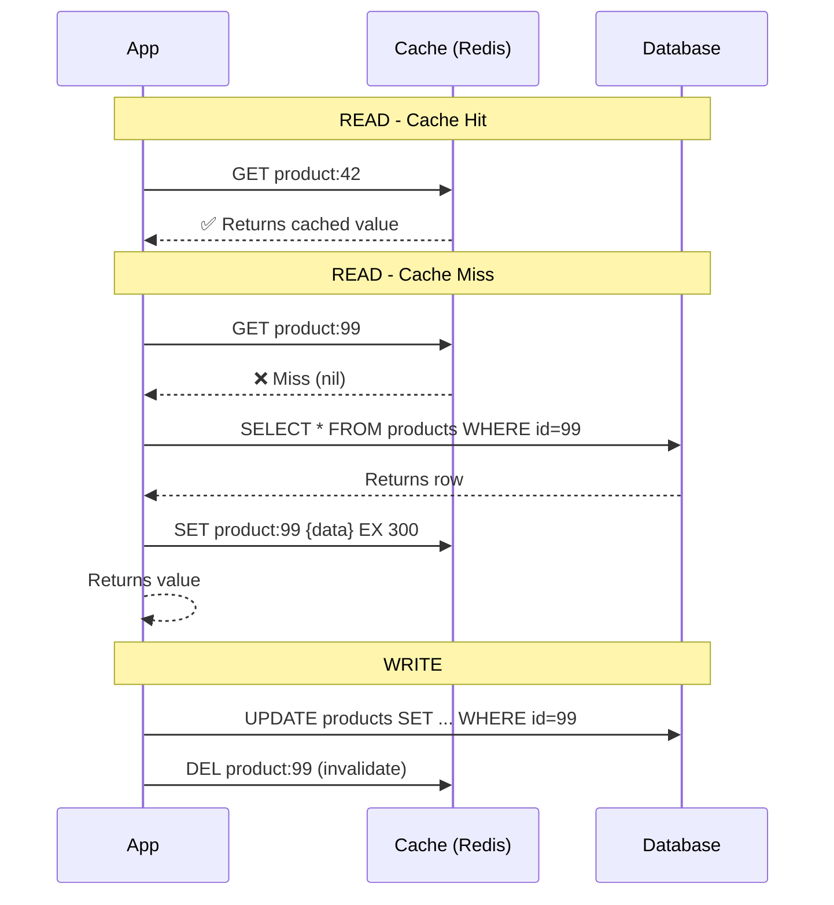
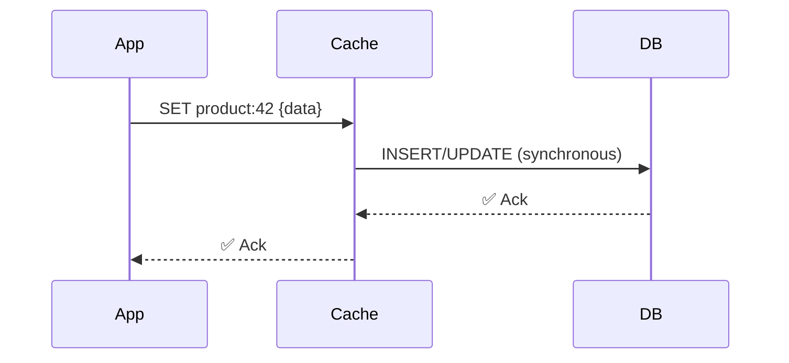
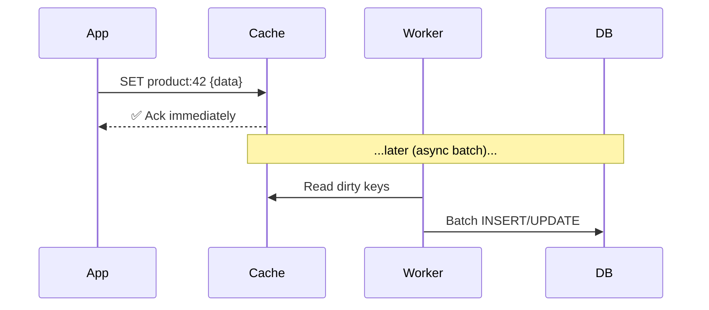
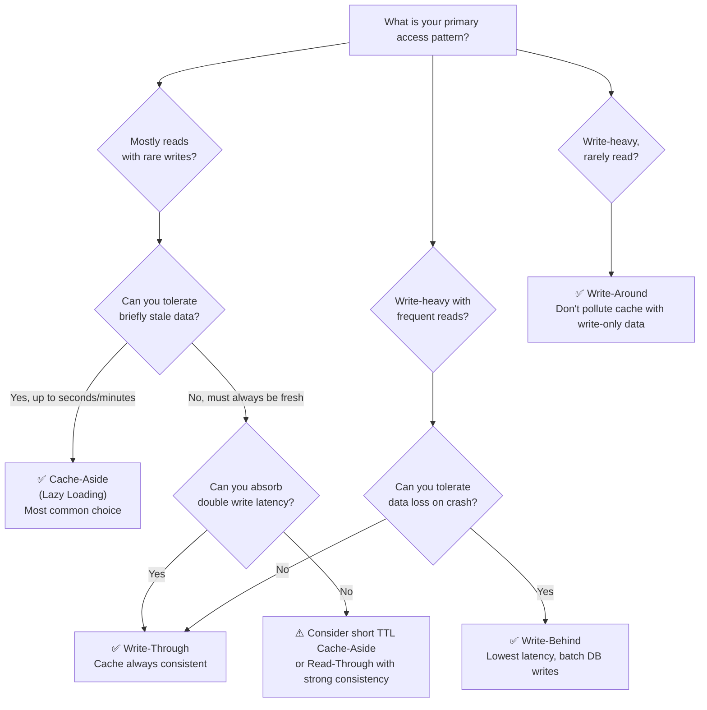
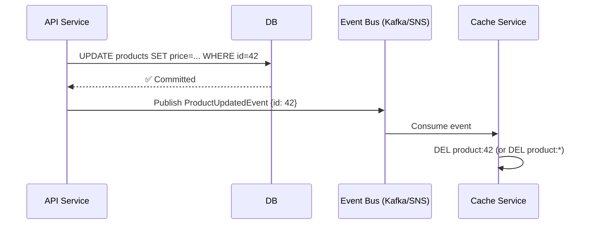
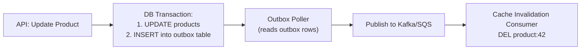

import Tabs from '@theme/Tabs';
import TabItem from '@theme/TabItem';

# Caching Strategies

A complete guide covering caching fundamentals for newcomers, a practical decision framework for choosing the right pattern, and senior-level deep dives into failure modes, consistency trade-offs, and production-grade design.

---

## 🗺️ How to Use This Document

| You are...             | Start here                                                                                                                                                                                        |
| ---------------------- | ------------------------------------------------------------------------------------------------------------------------------------------------------------------------------------------------- |
| New to caching         | [Why Cache?](#why-cache) → [Core Patterns](#core-cache-patterns) → [Redis Basics](#redis-deep-dive)                                                                                               |
| Mid-level engineer     | [Decision Framework](#-decision-framework-which-strategy-to-use) → [Cache Problems](#cache-problems--solutions) → [Interview Prep](#-interview-questions)                                         |
| Senior / system design | [Consistency Trade-offs](#senior-deep-dive-consistency-trade-offs--distributed-caching) → [Failure Modes](#failure-modes-to-design-for) → [Production Checklist](#production-readiness-checklist) |

---

## Why Cache?

:::note[For Newcomers]
Think of a cache like a notepad on your desk. Instead of walking to the filing room every time you need a customer's address, you write it on your notepad. The notepad is your **cache** — faster to access, but might go out of date if the actual record changes.
:::

At a technical level:

| Storage Layer     | Typical Latency | Relative Speed |
| ----------------- | --------------- | -------------- |
| L1 CPU Cache      | ~1 ns           | ⚡⚡⚡⚡⚡          |
| RAM (local cache) | ~100 ns         | ⚡⚡⚡⚡           |
| Redis (same DC)   | ~0.5 ms         | ⚡⚡⚡            |
| SSD Database      | ~1–10 ms        | ⚡⚡             |
| Spinning Disk DB  | ~10–100 ms      | ⚡              |
| Remote API call   | ~100–500 ms     | 🐢              |

**Why this matters in practice:**
- Serve a page reading 10 product rows: **10ms (DB)** vs **0.5ms (Redis)** — 20× faster
- At 10,000 req/s with a 90% hit rate: you save 9,000 DB queries every second
- Fewer read replicas needed → direct cost savings

**Core benefits:**
- **Reduce DB load** — serve repeated reads from memory, not disk
- **Reduce latency** — RAM access is ~100×–1000× faster than a DB query
- **Handle traffic spikes** — absorb bursts without overloading the DB
- **Cost savings** — fewer DB read replicas needed

:::warning[When NOT to cache]
- Data that changes on almost every read (e.g., live stock ticker at tick resolution)
- Results that are unique per user and never repeated
- Data with strict regulatory requirements for freshness (some financial/medical contexts)
- When your bottleneck is compute, not data retrieval
:::

---

## Cache Tiers

Understanding where in your stack a cache lives changes how you design around it.

```
Client Browser
    ↓
[Browser Cache]         ← HTTP headers (Cache-Control, ETag)
    ↓
[CDN / Edge Cache]      ← CloudFront, Fastly (static assets, full page responses)
    ↓
[API Gateway Cache]     ← Rate-limit aware, per-route TTLs
    ↓
[App Server Cache]      ← In-process (Caffeine, Guava) — zero network overhead
    ↓
[Distributed Cache]     ← Redis, Memcached — shared across instances
    ↓
[Database]              ← Source of truth (PostgreSQL, MySQL, etc.)
    ↓
[DB Query Cache]        ← (MySQL query cache — largely deprecated; avoid)
```

### In-Process Cache (Local)

Stored inside the application process itself (JVM heap for Java apps).

```java
// Caffeine — a high-performance in-process cache for Java
Cache<Long, Product> cache = Caffeine.newBuilder()
    .maximumSize(10_000)
    .expireAfterWrite(5, TimeUnit.MINUTES)
    .recordStats() // enables hit rate monitoring
    .build();

Product product = cache.get(productId, id -> productRepository.findById(id).orElseThrow());
```

| Pros                             | Cons                            |
| -------------------------------- | ------------------------------- |
| Zero network latency             | Not shared across app instances |
| No serialization overhead        | Evicted on restart              |
| Free (uses existing JVM heap)    | Inconsistent state across pods  |
| Great for config, reference data | Limited by heap size            |

:::tip[When to use in-process cache]
Use it for **rarely-changing, read-heavy, reference data**: country lists, currency rates, feature flags, config values. Every pod has its own copy — that's fine because the data barely changes. Pair it with a short TTL (1–5 min) so stale data self-heals.
:::

### Distributed Cache (Remote)

A separate service (Redis, Memcached) that all app instances share.

| Pros                              | Cons                                   |
| --------------------------------- | -------------------------------------- |
| Shared across all pods            | ~0.5ms network latency per call        |
| Survives app restarts             | Requires serialization (JSON/Protobuf) |
| Large capacity (GB–TB)            | Another service to operate             |
| Supports advanced data structures | Network partition risk                 |

---

## Core Cache Patterns

:::note[For Newcomers]
Each pattern answers two questions differently: **"When do I read from cache?"** and **"When do I write to cache?"**
:::

### Cache-Aside (Lazy Loading) — Most Common

The **application** is responsible for managing the cache. The cache and DB are independent.



```java
@Service
public class ProductService {
    @Autowired private RedisTemplate<String, Product> redis;
    @Autowired private ProductRepository repo;

    public Product getProduct(Long id) {
        String key = "product:" + id;

        // 1. Check cache
        Product cached = redis.opsForValue().get(key);
        if (cached != null) return cached;

        // 2. Miss: go to DB
        Product product = repo.findById(id).orElseThrow();

        // 3. Populate cache with TTL
        redis.opsForValue().set(key, product, 30, TimeUnit.MINUTES);
        return product;
    }

    public void updateProduct(Product product) {
        repo.save(product);
        redis.delete("product:" + product.getId()); // invalidate, don't update
    }
}
```

**Why delete instead of update on write?**

> Updating the cache on write seems logical, but leads to **race conditions** in concurrent systems. If two writes happen simultaneously and their cache updates land out of order, you end up with stale data permanently. Deleting forces the next reader to re-fetch the correct value from DB.

| Characteristic                     | Detail                                                                                                   |
| ---------------------------------- | -------------------------------------------------------------------------------------------------------- |
| ✅ Resilient to cache failure       | App falls back to DB transparently                                                                       |
| ✅ Only caches what's actually read | No wasted memory on write-only data                                                                      |
| ✅ Simple to implement              | Explicit, easy to reason about                                                                           |
| ❌ First request after miss is slow | Cold start / cache warm-up needed                                                                        |
| ❌ Brief stale window after writes  | Between DELETE and next read, data is correct; problem is between write and delete if they aren't atomic |

---

### Read-Through

The cache itself is responsible for loading from DB on a miss — the app only ever talks to the cache.

```
App ──→ [Cache Layer] ──(on miss)──→ DB
             ↑ auto-populates itself
```

The difference from Cache-Aside: **the app doesn't know about the DB** — that logic lives in the cache client or ORM second-level cache.

```java
// JPA Second-Level Cache (Hibernate) — a Read-Through implementation
@Entity
@Cache(usage = CacheConcurrencyStrategy.READ_WRITE) // Hibernate manages it
public class Product {
    @Id Long id;
    String name;
    BigDecimal price;
}

// Application code — no cache logic needed
Product p = entityManager.find(Product.class, 42L); // Hibernate checks cache first
```

:::info When to use Read-Through
Best when your ORM or data layer already supports it (Hibernate L2 cache, AWS DAX for DynamoDB). Don't implement custom read-through logic — cache-aside is simpler and more explicit.
:::

---

### Write-Through

Every write goes to the **cache AND the DB synchronously**. The cache is always consistent.



```java
public void updateProduct(Product product) {
    // Write to both — cache first, then DB (or use a library that wraps this)
    String key = "product:" + product.getId();
    redis.opsForValue().set(key, product, 30, TimeUnit.MINUTES); // update cache
    repo.save(product); // persist to DB
}
```

| Characteristic                     | Detail                                           |
| ---------------------------------- | ------------------------------------------------ |
| ✅ Cache always fresh               | No stale reads                                   |
| ✅ Read path is fast always         | No cold misses on recently written data          |
| ❌ Write latency doubled            | Two writes per operation                         |
| ❌ Cache fills with write-only data | Low-read data wastes memory                      |
| ❌ Harder failure handling          | What if DB write succeeds but cache write fails? |

:::warning[Write-Through Failure Caveat]
If you write to cache first and the DB write fails, your cache now holds data that was never persisted. Always write to DB first and treat cache write failure as non-fatal (log and move on), or use the inverse pattern (DB first, then cache update).
:::

---

### Write-Behind (Write-Back)

Write to cache immediately (fast ack to client), then **flush to DB asynchronously** in batches.



| Characteristic             | Detail                                               |
| -------------------------- | ---------------------------------------------------- |
| ✅ Lowest write latency     | Client gets ack before DB write                      |
| ✅ DB batching = fewer IOPS | Efficient for write-heavy workloads                  |
| ❌ Data loss risk           | If cache node dies before flush, writes are lost     |
| ❌ Complex recovery         | Crash recovery, ordering guarantees are hard         |
| ❌ Reads may miss DB writes | Another service querying DB directly sees stale data |

**Real-world examples:** InnoDB buffer pool, browser localStorage sync, some CDN edge writes.

:::danger Not for transactional systems
Write-behind is inappropriate for financial transactions, order processing, or anything where losing even one write is unacceptable. It is appropriate for analytics counters, view counts, "likes", or non-critical metrics.
:::

---

### Write-Around

Writes go **directly to DB**, bypassing cache entirely. Cache is only populated on reads (miss → load from DB).

```
Write:  App ──────────────────→ DB   (cache not touched)
Read:   App → Cache (miss) → DB → Cache (populate)
```

Best for: data written once but infrequently read (logs, audit events, archival records).

---

## 🧭 Decision Framework: Which Strategy to Use?

Use this flowchart to choose your caching pattern.



### Quick-Reference Decision Matrix

| Scenario                 | Pattern                         | Reason                                           |
| ------------------------ | ------------------------------- | ------------------------------------------------ |
| Product catalog page     | Cache-Aside                     | Read-heavy, tolerate ~5min stale                 |
| User session data        | Cache-Aside + short TTL         | Per-user, must expire                            |
| Shopping cart            | Write-Through                   | Consistency matters; loss = bad UX               |
| Live leaderboard scores  | Redis Sorted Set + Write-Behind | Write-heavy, eventual consistency OK             |
| Audit log entries        | Write-Around                    | Never need to re-read from cache                 |
| ML feature store         | Read-Through (managed)          | Complex miss logic, consistency needed           |
| Config / feature flags   | In-Process (Caffeine)           | Rarely changes, zero-latency                     |
| API rate-limit counters  | Redis INCR (no pattern)         | Need atomic operations, not simple K/V           |
| Paginated search results | Short TTL or no cache           | Invalidation too complex; query-optimize instead |

:::tip[The Senior Rule of Thumb]
**Start with Cache-Aside + TTL.** It's simple, resilient, and correct in almost all cases. Only move to write-through or write-behind when you have a measured, specific need — don't prematurely optimize. Measure your cache hit rate first; if it's > 90%, you're done.
:::

---

## Cache Eviction Policies

When the cache is full and a new item needs to be stored, something must be evicted.

:::note[For Newcomers]
Imagine your notepad is full. You need to erase something to write a new note. Which note do you erase? That decision is the **eviction policy**.
:::

| Policy           | Full Name             | What Gets Evicted                      | Best For                                   |
| ---------------- | --------------------- | -------------------------------------- | ------------------------------------------ |
| **LRU**          | Least Recently Used   | Item not accessed for the longest time | General purpose — recency = relevance      |
| **LFU**          | Least Frequently Used | Item accessed fewest times overall     | Skewed access (viral products stay cached) |
| **FIFO**         | First In First Out    | Oldest inserted item                   | Simple queues, log rotation                |
| **TTL**          | Time To Live          | Item past its expiry timestamp         | Time-sensitive data, sessions              |
| **Random**       | Random Replacement    | Any random item                        | Approximates LRU with less overhead        |
| **allkeys-lru**  | Redis: LRU all keys   | LRU across all keys when memory full   | Recommended default Redis policy           |
| **volatile-lru** | Redis: LRU w/ TTL     | LRU among only keys that have TTL set  | Mixed cache with some permanent keys       |
| **allkeys-lfu**  | Redis: LFU all keys   | LFU across all keys                    | Workloads with hot/cold key skew           |

### LRU vs LFU — When Does It Matter?

```
Access pattern A (uniform):
  product:1 → product:2 → product:3 → product:1 → product:2 ...
  LRU and LFU behave similarly.

Access pattern B (skewed / power law):
  product:1 (viral) → accessed 10,000×
  product:2 (normal) → accessed 50×
  product:3 (new) → accessed 5×  ← LRU evicts product:1 if product:3 was more recent!
  → Use LFU: product:1 stays because it has the highest frequency
```

:::info Redis 4.0+ LFU
Redis 4.0 introduced approximate LFU. Configure it with:
```bash
CONFIG SET maxmemory-policy allkeys-lfu
CONFIG SET lfu-decay-time 1       # halve frequency counter every 1 minute
CONFIG SET lfu-log-factor 10      # counter increment probability
```
:::

```bash
# Redis: set memory limits and eviction policy
CONFIG SET maxmemory 4gb
CONFIG SET maxmemory-policy allkeys-lru

# Verify current settings
CONFIG GET maxmemory
CONFIG GET maxmemory-policy
```

---

## Cache Invalidation Strategies

> *"There are only two hard things in Computer Science: cache invalidation and naming things."* — Phil Karlton

Cache invalidation is hard because it's a distributed consistency problem. Here are the strategies, from simplest to most correct.

### Strategy 1: TTL-Based Expiry (Simplest)

Every cached value has a time-to-live. After it expires, the next read fetches fresh data.

```bash
# Redis
SET product:42 "{...}" EX 300      # expires in 5 minutes
SETEX session:user:99 3600 "{...}" # 1 hour session
```

**Staleness window:** up to `TTL` seconds. After that, data is guaranteed to be re-fetched.

✅ Dead simple — no invalidation logic  
✅ Self-healing — stale data eventually expires  
❌ Data may be stale for up to the full TTL duration  
❌ Wrong TTL choice is painful (too long = stale; too short = high miss rate)

**TTL selection heuristics:**

| Data Type                  | Suggested TTL |
| -------------------------- | ------------- |
| User profile / preferences | 15–30 min     |
| Product catalog            | 5–10 min      |
| Session data               | 30–60 min     |
| Currency / exchange rates  | 1–5 min       |
| Feature flags              | 1–2 min       |
| Search results             | 30–60 sec     |
| Live scores / feeds        | 5–10 sec      |

---

### Strategy 2: Event-Driven Invalidation (Most Accurate)

Invalidate cache immediately when the underlying data changes, by publishing domain events.



```java
// Publishing the event after a successful write
@Service
@Transactional
public class ProductService {

    public Product updateProduct(UpdateProductRequest req) {
        Product product = repo.findById(req.getId()).orElseThrow();
        product.setPrice(req.getPrice());
        repo.save(product);

        // Publish event — this will trigger cache invalidation consumers
        eventPublisher.publishEvent(new ProductUpdatedEvent(product.getId()));
        return product;
    }
}

// In a cache invalidation consumer (same or different service)
@Component
public class ProductCacheInvalidator {

    @TransactionalEventListener(phase = TransactionPhase.AFTER_COMMIT)
    public void onProductUpdated(ProductUpdatedEvent event) {
        redis.delete("product:" + event.getProductId());
        redis.delete("products:category:" + event.getCategoryId());
    }
}
```

:::warning[Use `@TransactionalEventListener` with `AFTER_COMMIT`]
This guarantees the cache is invalidated **only after the DB transaction successfully commits**. Without this, you may invalidate the cache before the transaction commits — and the next cache miss reads the old value from DB (transaction hasn't committed yet), re-caches the old value, and the update is invisible until TTL expires.
:::

✅ Near-zero stale window (milliseconds after commit)  
✅ Scales to complex invalidation (one event invalidates multiple keys)  
❌ Requires event infrastructure (Kafka, SQS, Spring events)  
❌ Event delivery failure = stale cache (mitigate with fallback TTL)  

---

### Strategy 3: Version / Namespace Keys

Instead of deleting cache entries, change the key's namespace. Old entries become unreachable (and eventually expire via TTL).

```
# Before bulk update:
Key: v3:products:list:page:1   → {data}

# After bulk category update, bump namespace:
New Key: v4:products:list:page:1   → (cache miss → refetch from DB)

# Old v3 keys still exist but are never requested → expire via TTL
```

```java
// Store current version in Redis itself
public String getProductListKey(int page) {
    String version = redis.opsForValue().get("products:version");
    if (version == null) version = "1";
    return "v" + version + ":products:list:page:" + page;
}

public void bulkInvalidateProducts() {
    // Atomic version bump — all existing keys immediately become stale
    redis.opsForValue().increment("products:version");
}
```

✅ O(1) bulk invalidation — no need to find and delete thousands of keys  
✅ No pattern-scan needed (avoid `KEYS *` or `SCAN` for invalidation)  
✅ Great for collection-level cache invalidation  
❌ Old keys still consume memory until their TTL expires  
❌ Version counter itself must be highly available  

---

### Strategy 4: Dual-Write with Outbox Pattern (For Microservices)

In microservices, you can't use a shared transaction between your DB write and cache invalidation. Use the transactional outbox pattern for reliable event delivery.



This guarantees that either both the DB update **and** the cache invalidation happen, or neither does (since the outbox row is part of the same DB transaction).

---

## Cache Problems & Solutions

### ⚠️ Problem 1: Cache Stampede (Thundering Herd)

**What it is:** A popular cache key expires. Hundreds of requests simultaneously get a cache miss and all query the DB at once, overwhelming it.

```
t=0:    key "product:42" expires (was 10,000 req/min)
t=1ms:  1,000 concurrent requests → all get MISS
t=2ms:  1,000 concurrent DB queries → DB CPU spikes to 100%
t=3ms:  DB starts timing out → cascading failure
```

<Tabs>
  <TabItem value="jitter" label="Solution 1: TTL Jitter">

Add randomness to TTLs so keys don't expire simultaneously.

```java
// Instead of:
redis.set(key, value, Duration.ofMinutes(5));

// Use:
int baseSeconds = 300;
int jitter = ThreadLocalRandom.current().nextInt(-30, 30); // ±10%
redis.set(key, value, Duration.ofSeconds(baseSeconds + jitter));
```

✅ Simple, no coordination needed  
✅ Spreads expiry across a time window  
❌ Doesn't help for a single extremely hot key  

  </TabItem>
  <TabItem value="lock" label="Solution 2: Distributed Lock">

Only one request fetches from DB; others wait and retry from cache.

```java
public Product getProductWithLock(Long id) {
    String cacheKey = "product:" + id;
    String lockKey  = "lock:product:" + id;

    // Fast path: cache hit
    Product cached = redis.opsForValue().get(cacheKey);
    if (cached != null) return cached;

    // Slow path: acquire lock (NX = only if not exists, PX = expire in 5s)
    Boolean locked = redis.opsForValue()
        .setIfAbsent(lockKey, "1", 5, TimeUnit.SECONDS);

    if (Boolean.TRUE.equals(locked)) {
        try {
            // Double-check after acquiring lock (another thread may have populated)
            cached = redis.opsForValue().get(cacheKey);
            if (cached != null) return cached;

            Product product = productRepository.findById(id).orElseThrow();
            redis.opsForValue().set(cacheKey, product, 5, TimeUnit.MINUTES);
            return product;
        } finally {
            redis.delete(lockKey); // always release
        }
    } else {
        // Another thread holds the lock — back off and retry
        Thread.sleep(50);
        return redis.opsForValue().get(cacheKey); // should be populated now
    }
}
```

✅ Exactly one DB query on cache miss  
❌ Adds latency for non-lock-holder threads  
❌ Lock expiry must be tuned to DB query latency  

  </TabItem>
  <TabItem value="refresh" label="Solution 3: Background Refresh">

Proactively refresh cache before it expires. Serve stale data during refresh.

```java
@Scheduled(fixedRate = 4 * 60 * 1000) // every 4 minutes
public void refreshProductCache() {
    // TTL is 5 minutes — we refresh at 4 minutes to always stay ahead
    List<Long> popularProductIds = analyticsService.getTopProductIds(100);
    for (Long id : popularProductIds) {
        Product product = productRepository.findById(id).orElseThrow();
        redis.opsForValue().set("product:" + id, product, 5, TimeUnit.MINUTES);
    }
}
```

✅ Zero stale reads for known-hot keys  
✅ DB is never hit by user request  
❌ Requires knowing which keys are hot in advance  
❌ Refreshes even if data hasn't changed  

  </TabItem>
</Tabs>

---

### ⚠️ Problem 2: Cache Penetration

**What it is:** Requests for keys that **don't exist in the DB** (null results) always bypass the cache and hit the DB directly.

```
Malicious or buggy client:
  GET /product/999999999  → Cache miss → DB miss → nothing to cache → repeat infinitely
  GET /product/888888888  → Cache miss → DB miss → ...
  
10,000 such requests/sec = 10,000 DB queries/sec for non-existent rows
```

<Tabs>
  <TabItem value="null" label="Solution 1: Cache Null Results">

Cache the fact that a key doesn't exist, with a short TTL.

```java
public Product getProduct(Long id) {
    String key = "product:" + id;
    String raw = redis.opsForValue().get(key);

    if ("__NULL__".equals(raw)) {
        return null; // cached non-existence
    }
    if (raw != null) {
        return deserialize(raw);
    }

    // DB lookup
    Optional<Product> result = repo.findById(id);
    if (result.isEmpty()) {
        redis.opsForValue().set(key, "__NULL__", 60, TimeUnit.SECONDS); // short TTL
        return null;
    }

    redis.opsForValue().set(key, serialize(result.get()), 30, TimeUnit.MINUTES);
    return result.get();
}
```

✅ Simple, works for known attack patterns  
❌ Attackers using many unique IDs can still exhaust memory  

  </TabItem>
  <TabItem value="bloom" label="Solution 2: Bloom Filter">

A probabilistic data structure that can say with certainty whether a key **definitely does not exist**.

```java
// On startup: load all valid product IDs into a Bloom filter
@Component
public class ProductBloomFilter {
    private final BloomFilter<Long> filter;

    public ProductBloomFilter(ProductRepository repo) {
        long count = repo.count();
        this.filter = BloomFilter.create(
            Funnels.longFunnel(),
            count * 2,  // expected insertions with room to grow
            0.01        // 1% false positive rate
        );
        repo.findAllIds().forEach(filter::put);
    }

    public boolean mightExist(Long productId) {
        return filter.mightContain(productId); // false = definitely doesn't exist
    }
}

// In service:
public Product getProduct(Long id) {
    if (!bloomFilter.mightExist(id)) {
        return null; // short-circuit before cache or DB lookup
    }
    // ... normal cache-aside logic
}
```

✅ O(1), extremely memory-efficient (billions of IDs in a few MB)  
✅ 100% accurate for "definitely does not exist"  
❌ False positives (1% may pass through even if they don't exist — acceptable)  
❌ Needs periodic rebuild as new products are created  

  </TabItem>
</Tabs>

---

### ⚠️ Problem 3: Cache Avalanche

**What it is:** A large number of cache keys expire around the **same time** (e.g., after a cache server restart or a mass-expiry event), causing a flood of DB queries.

```
t=0:  Server restart — all 100,000 keys evicted
t=1:  All user requests → cache miss → DB query
t=2:  DB overwhelmed → connection pool exhausted → 500 errors
```

**Solutions:**

1. **TTL jitter** (same as stampede prevention) — stagger all your TTLs
2. **Cache warm-up on startup** — pre-load critical data before taking traffic
3. **Circuit breaker** — if DB error rate spikes, stop hammering it; serve stale or degrade gracefully
4. **Staggered deployment** — rolling restart instead of full fleet restart

```java
// Cache warm-up: run this before the app starts serving traffic
@EventListener(ApplicationReadyEvent.class)
public void warmCache() {
    log.info("Warming cache...");
    List<Long> topProductIds = analyticsService.getTopProductIds(1000);
    topProductIds.parallelStream().forEach(id -> {
        try {
            getProduct(id); // will miss → load from DB → populate cache
        } catch (Exception e) {
            log.warn("Failed to warm product {}", id, e);
        }
    });
    log.info("Cache warm-up complete");
}
```

---

### ⚠️ Problem 4: Stale Reads After Write (Consistency Window)

**What it is:** In cache-aside, between a write to DB and the cache invalidation, another request reads the old cached value.

```
Thread A: UPDATE product:42 price=100 → DB committed
Thread A: DEL product:42 from cache     ← this is the gap
Thread B: GET product:42 → Cache miss → DB read → price=100 ✅ (fine here)

But if Thread B reads BETWEEN the DB commit and the DEL:
Thread A: DB committed (price=100)
Thread B: GET product:42 → Cache HIT → returns price=90 ← stale!
Thread A: DEL product:42
```

**Solutions:**
- Accept a small stale window (usually fine — stale data expires via TTL anyway)
- Use Redis Lua script to make the update and delete atomic
- Use the "Write-Through" pattern instead if consistency is critical

---

## Redis Deep Dive

### Data Structures and When to Use Each

<Tabs>
  <TabItem value="string" label="Strings">

```bash
# Simple key-value, counters, flags
SET product:42 '{"id":42,"name":"Widget","price":9.99}'
GET product:42

# Atomic counter (no race conditions)
INCR page_views:homepage           # → 1
INCRBY page_views:homepage 5       # → 6
DECR stock:product:42              # → inventory tracking

# Conditional set (NX = only if not exists)
SET lock:order:123 "worker-1" EX 30 NX   # distributed lock pattern

# Get old value while setting new (atomic swap)
GETSET counter:daily 0             # returns old, sets to 0

# Use for: simple K/V, counters, feature flags, distributed locks, session tokens
```

  </TabItem>
  <TabItem value="hash" label="Hashes">

```bash
# A map within a key — efficient for object storage
HSET user:1 name "Alice" email "alice@example.com" age 30
HGET user:1 name                   # "Alice"
HMGET user:1 name email            # ["Alice", "alice@example.com"]
HGETALL user:1                     # all fields

# Only update one field without overwriting others
HSET user:1 age 31                 # just update age

# Increment a field
HINCRBY user:1 login_count 1

# Use for: user objects, session data, config maps, entity attributes
# Benefit: can read/update individual fields without deserializing entire object
```

  </TabItem>
  <TabItem value="sorted_set" label="Sorted Sets">

```bash
# Members with a float score — ordered by score
ZADD leaderboard 1500.0 "alice"
ZADD leaderboard 2000.0 "bob"
ZADD leaderboard 1750.0 "carol"

# Top N players (high score first)
ZREVRANGE leaderboard 0 9 WITHSCORES

# Rank of a specific player (0 = top)
ZREVRANK leaderboard "alice"      # 2 (0=bob, 1=carol, 2=alice)

# Range by score
ZRANGEBYSCORE leaderboard 1000 2000

# Increment score atomically
ZINCRBY leaderboard 50.0 "alice"  # alice: 1550.0

# Use for: leaderboards, priority queues, rate limiting windows, geospatial (GEOADD)
```

  </TabItem>
  <TabItem value="list" label="Lists">

```bash
# Doubly-linked list — push/pop from either end
LPUSH queue "task1" "task2"       # [task2, task1]
RPUSH queue "task3"               # [task2, task1, task3]
LPOP queue                        # "task2"
RPOP queue                        # "task3"

# Blocking pop — waits up to 30s for an item (great for job queues)
BLPOP queue 30

# Peek without removing
LRANGE queue 0 -1                 # all elements
LINDEX queue 0                    # first element

# Use for: job queues, activity feeds, chat history, log buffers
```

  </TabItem>
  <TabItem value="pubsub" label="Pub/Sub & Streams">

```bash
# Pub/Sub — fire and forget
SUBSCRIBE orders:channel
PUBLISH orders:channel '{"orderId":123,"event":"created"}'

# Streams — persistent, consumer-group-aware message log (Kafka-lite)
XADD orders:stream * event "order_created" order_id 123
XREAD COUNT 10 STREAMS orders:stream 0     # read from beginning
XGROUP CREATE orders:stream workers $ MKSTREAM
XREADGROUP GROUP workers consumer1 COUNT 10 STREAMS orders:stream >

# Use Pub/Sub for: real-time notifications, cache invalidation signals
# Use Streams for: reliable event delivery, audit logs, task queues needing ACK
```

  </TabItem>
</Tabs>

---

### Redis Persistence Modes

| Mode                       | How It Works                                     | Durability                                       | Performance Impact        |
| -------------------------- | ------------------------------------------------ | ------------------------------------------------ | ------------------------- |
| **No persistence**         | Pure in-memory                                   | All data lost on restart                         | Fastest                   |
| **RDB (Snapshot)**         | Periodic fork + dump to disk (e.g., every 5 min) | Loss of writes since last snapshot               | Low (fork is fast)        |
| **AOF (Append-Only File)** | Every write command logged to disk               | Near-zero loss (`fsync=everysec` = max 1s)       | Moderate                  |
| **RDB + AOF**              | Both enabled                                     | Best durability (AOF on restart, RDB for backup) | Moderate + backup storage |

```bash
# For a cache: no persistence is fine
# (data is reconstructed from DB on miss anyway)
save ""                # disable RDB snapshots
appendonly no          # disable AOF

# For a primary data store using Redis:
appendonly yes
appendfsync everysec   # fsync every second (balance of safety + performance)
```

---

### Redis Cluster & High Availability

```
┌─────────────────────────────────┐
│        Redis Cluster             │
│                                  │
│  [Master 1]  [Master 2]  [Master 3]
│  slots 0-5k  5k-10k     10k-16383
│      ↓            ↓           ↓
│  [Replica 1] [Replica 2] [Replica 3]
└─────────────────────────────────┘

16,384 hash slots distributed across masters.
Keys are assigned: CRC16(key) % 16384
```

**Redis Sentinel** (HA without sharding): monitors master, auto-promotes replica on failure. Use when you need HA but don't need horizontal scaling.

**Redis Cluster** (HA + sharding): auto-shards data across multiple masters. Use when dataset exceeds a single node or you need write throughput scaling.

---

## Spring Cache Abstraction

Spring's `@Cacheable` / `@CachePut` / `@CacheEvict` annotations let you add caching without changing method logic.

```java
@SpringBootApplication
@EnableCaching
public class Application { }
```

```java
@Service
public class ProductService {

    // Cache on first call; skip method on subsequent calls with same key
    @Cacheable(value = "products", key = "#id")
    public Product getProduct(Long id) {
        return repo.findById(id).orElseThrow();
    }

    // Always execute method AND update cache (use on update operations)
    @CachePut(value = "products", key = "#product.id")
    public Product updateProduct(Product product) {
        return repo.save(product);
    }

    // Remove cache entry (use on delete or after writes if using cache-aside)
    @CacheEvict(value = "products", key = "#id")
    public void deleteProduct(Long id) {
        repo.deleteById(id);
    }

    // Evict all entries in the "products" cache
    @CacheEvict(value = "products", allEntries = true)
    public void bulkUpdate(List<Product> products) {
        repo.saveAll(products);
    }

    // Combine multiple cache operations
    @Caching(
        evict = { @CacheEvict("products"), @CacheEvict("productSummaries") }
    )
    public void deleteWithRelated(Long id) { ... }
}
```

```properties
# application.properties
spring.cache.type=redis
spring.data.redis.host=localhost
spring.data.redis.port=6379
spring.cache.redis.time-to-live=300000   # 5 min in ms
spring.cache.redis.cache-null-values=true # cache null results (prevents penetration)
```

:::warning[`@Cacheable` does NOT work within the same bean]
Spring's cache proxy is applied at the bean boundary. If `methodA()` in `ProductService` calls `methodB()` in the **same** bean, `@Cacheable` on `methodB` is not triggered. Inject the service via the Spring proxy (`@Autowired ProductService self`) to work around this.
:::

---

## Cache Hit Rate & Sizing

**Hit rate** = `cache_hits / (cache_hits + cache_misses)`

| Hit Rate | Diagnosis | Action                                                         |
| -------- | --------- | -------------------------------------------------------------- |
| > 99%    | Excellent | Monitor, maintain                                              |
| 90–99%   | Good      | Acceptable for most systems                                    |
| 80–90%   | Marginal  | Increase cache size or TTL                                     |
| < 80%    | Poor      | Access patterns may not benefit from caching; audit key design |

```bash
# Redis: check hit rate
redis-cli INFO stats | grep -E "keyspace_hits|keyspace_misses"

# keyspace_hits: 1,000,000
# keyspace_misses: 50,000
# hit rate = 1,000,000 / 1,050,000 = 95.2%

# Also check memory usage
redis-cli INFO memory | grep used_memory_human
redis-cli INFO keyspace    # key count per DB
```

**Cache sizing rule of thumb:**
- Identify your "working set" — the set of data accessed in the last 24h
- Cache should hold at least the top 20% most-accessed data (80/20 rule: 20% of data = 80% of reads)
- Start at 10–20% of your DB hot data size and grow based on hit rate

---

## Senior Deep Dive: Consistency Trade-offs & Distributed Caching

### The Cache Consistency Spectrum

```
Strong Consistency ←────────────────────────────→ Eventual Consistency

Write-Through          Cache-Aside        Cache-Aside        Write-Behind
(sync write to         with short TTL     with long TTL      (async flush)
cache + DB)            (<60s)             (hours)
   ↑                                                             ↑
Higher latency,                                            Lower latency,
no stale reads                                             possible data loss
```

### Distributed Cache Consistency Challenges

In a multi-region setup, you face **replication lag** even in Redis:

```
Region US-EAST:          Region EU-WEST:
  Redis Master            Redis Replica (async replication)
  Write: price=100 ──→ (lag ~10-50ms) ──→ price=90 (stale)
```

**Options:**
1. **Single-region Redis** — all reads/writes to one region; accept cross-region latency
2. **Regional caches with short TTL** — each region has its own cache; stale for up to TTL
3. **Active-Active (Redis Enterprise / ElastiCache Global Datastore)** — multi-master with CRDT-based conflict resolution; expensive

### Atomic Cache Operations

Race conditions in cache operations are subtle. Use Lua scripts for atomic multi-step operations:

```java
// Lua script: only delete key if value matches (compare-and-delete)
// Prevents deleting a key that was already refreshed by another thread
String luaScript = """
    if redis.call('get', KEYS[1]) == ARGV[1] then
        return redis.call('del', KEYS[1])
    else
        return 0
    end
    """;

DefaultRedisScript<Long> script = new DefaultRedisScript<>(luaScript, Long.class);
redis.execute(script, List.of(cacheKey), expectedValue);
```

### Cache as a SLA Risk

:::danger Hidden Dependency Anti-Pattern
If your application **cannot serve requests at all** when the cache is down, you've accidentally made the cache a single point of failure. Always ask: "What happens when Redis is unavailable?"

✅ Cache miss → DB query → degrade gracefully (slower but correct)  
❌ Cache miss → throw exception / return error (cache is now required for correctness)

Design cache-aside so cache unavailability is handled:
```java
try {
    cached = redis.opsForValue().get(key);
} catch (RedisException e) {
    log.warn("Cache unavailable, falling back to DB", e);
    // Don't rethrow — fall through to DB query
}
```
:::

---

## Failure Modes to Design For

| Failure Mode       | Trigger                           | Impact                        | Mitigation                                          |
| ------------------ | --------------------------------- | ----------------------------- | --------------------------------------------------- |
| Cache Stampede     | Popular key expires               | DB overwhelmed                | TTL jitter, lock, background refresh                |
| Cache Penetration  | Queries for non-existent keys     | DB hammered                   | Cache nulls, Bloom filter                           |
| Cache Avalanche    | Mass expiry / restart             | All traffic hits DB           | Jitter, warm-up, circuit breaker                    |
| Stale Read         | Read between write + invalidation | Temporarily incorrect data    | Accept window or write-through                      |
| Cache Node Failure | Redis node dies                   | Increased miss rate           | Redis Sentinel/Cluster, fallback to DB              |
| Memory Exhaustion  | Cache full, aggressive eviction   | Hit rate drops suddenly       | Monitor memory, set `maxmemory`                     |
| Cache Poisoning    | Bug writes wrong data             | Stale data until TTL          | Validate before caching, short TTL                  |
| Hot Key            | One key gets extreme traffic      | Single Redis shard bottleneck | Local in-process cache + distributed cache layering |

### Hot Key Problem (Advanced)

```
100,000 req/s all hitting "product:1" (viral item)
→ Single Redis shard saturated at ~80,000 req/s
→ Latency spikes for all keys on that shard
```

**Solution: Local cache tier + distributed cache**

```java
// Layer 1: in-process cache (Caffeine) — absorbs hot key traffic
private final Cache<String, Product> localCache = Caffeine.newBuilder()
    .maximumSize(1_000)
    .expireAfterWrite(10, TimeUnit.SECONDS) // short TTL — accepts 10s stale
    .build();

public Product getProduct(Long id) {
    String key = "product:" + id;

    // Layer 1: local cache (zero network overhead)
    Product local = localCache.getIfPresent(key);
    if (local != null) return local;

    // Layer 2: distributed Redis
    Product cached = redis.opsForValue().get(key);
    if (cached != null) {
        localCache.put(key, cached); // populate L1
        return cached;
    }

    // Layer 3: DB
    Product product = repo.findById(id).orElseThrow();
    redis.opsForValue().set(key, product, 5, TimeUnit.MINUTES);
    localCache.put(key, product);
    return product;
}
```

This reduces Redis load by 90%+ for hot keys, at the cost of 10s stale window in the local cache.

---

## Production Readiness Checklist

Before shipping a caching layer to production:

### Observability
- [ ] Cache hit rate monitored per cache name/key namespace
- [ ] Cache miss rate alerted if > threshold (e.g., > 20% miss = something's wrong)
- [ ] Redis memory usage dashboarded and alerted at 80% capacity
- [ ] Eviction rate tracked (high eviction = cache too small)
- [ ] Redis connection pool monitored (exhausted pool = latency spikes)

### Resilience
- [ ] Cache failure (Redis down) handled gracefully — fallback to DB
- [ ] Circuit breaker in place for DB fallback under high miss load
- [ ] Redis Sentinel or Cluster configured for HA (not single-node in production)
- [ ] `maxmemory` and `maxmemory-policy` explicitly configured (never run without these)

### Correctness
- [ ] Every `@Cacheable` has a TTL — no indefinitely-cached data
- [ ] Invalidation tested explicitly for all write paths
- [ ] Cache stampede protection on high-traffic keys
- [ ] Null/empty results handled (not left as uncached)

### Operations
- [ ] Cache warm-up strategy documented and tested (especially after deploy/restart)
- [ ] Redis persistence configured appropriately for your use case
- [ ] Backup and recovery plan for Redis if using it as a primary store (not just cache)
- [ ] Key naming convention documented (e.g., `{entity}:{id}`, `{entity}:{query_hash}`)

---

## 🎯 Interview Questions

### Foundational

**Q: What is the difference between cache-aside and write-through caching?**
> Cache-aside: the application checks cache first; on miss, it loads from DB and populates the cache. Writes **invalidate** (delete) the cache entry — the next read re-fetches. Write-through: every write goes to both cache and DB synchronously, so the cache is always fresh. Cache-aside is more resilient (cache failures don't break reads); write-through gives stronger consistency but higher write latency.

**Q: What is a cache hit rate and what's a good target?**
> Hit rate = hits / (hits + misses). Target > 90% for effective caching, > 99% for critical paths. Below 80% suggests the cache is undersized, TTLs are too short, or the access patterns have low repetition — caching may not be beneficial for that workload.

**Q: When would you NOT use a cache?**
> When data changes on almost every read (real-time ticker, live sensor data), when each user's data is unique and never shared, when regulatory requirements mandate freshness (some financial/medical systems), or when your bottleneck is compute rather than data retrieval. Also avoid caching paginated results from frequently updated collections — the invalidation complexity rarely justifies it.

---

### Intermediate

**Q: What is a cache stampede and how do you prevent it?**
> A stampede occurs when a popular cache key expires and many concurrent requests simultaneously find a miss and all query the DB. Prevention strategies: (1) **TTL jitter** — add randomness to expiry times so keys don't all expire at once; (2) **distributed lock** — only one request fetches from DB, others wait and retry; (3) **background refresh** — refresh popular keys before they expire, serving the (slightly) stale value during refresh.

**Q: What is cache penetration? How is it different from cache avalanche?**
> Penetration: requests for keys that genuinely don't exist in the DB always bypass cache (nothing to cache). Fix: cache null results with a short TTL, or use a Bloom filter to short-circuit before the DB.  
> Avalanche: many cache keys expire simultaneously, flooding the DB. Fix: TTL jitter, cache warm-up, circuit breakers. The root causes are different — penetration is about non-existent data; avalanche is about synchronized expiry.

**Q: Why do you delete the cache key on write rather than updating it?**
> Updating is prone to race conditions. If two concurrent writes update the cache out-of-order (e.g., Write B's cache update arrives before Write A's even though B committed later), the cache holds the wrong value permanently. Deletion forces the next reader to fetch the authoritative value from DB — the source of truth — which is always correct regardless of ordering.

---

### Senior / System Design

**Q: How do you handle cache invalidation in a microservices architecture?**
> Synchronous invalidation (same service) works for simple cases. For cross-service invalidation, use the **transactional outbox pattern**: write to DB and an outbox table in the same transaction; an outbox poller publishes domain events; consumers invalidate their caches on receipt. This guarantees delivery without distributed transactions. Pair with a fallback TTL so stale data self-heals even if event delivery fails.

**Q: How would you cache a paginated list of items that changes frequently?**
> This is intentionally hard. Options: (1) Cache individual entity IDs in a sorted set and assemble pages from per-ID caches — high complexity; (2) Cache the full page result with a very short TTL (10–30s) and accept stale pagination — simple but might miss new items; (3) Don't cache the pagination query at all — instead optimize the DB query with proper indexes, covering indexes, keyset pagination, and read replicas. Option 3 is usually correct when the collection changes frequently.

**Q: Describe the hot key problem and your mitigation approach.**
> A hot key occurs when a single cache key receives traffic that saturates one Redis shard (e.g., a viral product at 100k req/s). Mitigations: (1) **Local in-process cache (L1)** in each app instance with a short TTL (5–10s) reduces Redis calls by 90%+; (2) **Key replication** — store the hot key as `product:1:shard:{0-9}` and randomly select a shard on read, distributing load across 10 Redis shards; (3) **Read replicas** — route reads to Redis replicas. The L1 local cache is the simplest and most effective first step.

**Q: What are the trade-offs of Redis vs Memcached?**
> Redis: rich data types (hashes, sorted sets, pub/sub, streams), persistence options, clustering, replication, Lua scripting, atomic operations. Memcached: simpler, multi-threaded (better CPU utilization for multi-core), slightly faster for pure string K/V with very large values, lower memory overhead per key. Redis is preferred for almost all new systems due to versatility — Memcached is a legacy choice or micro-optimization for a specific workload.

**Q: How do you test caching behavior in integration tests?**
> Key scenarios to test: (1) cache miss path — verify DB is called and result is cached; (2) cache hit path — verify DB is NOT called; (3) invalidation — write, then verify cache is cleared and next read fetches from DB; (4) TTL — verify expired entries are re-fetched; (5) null result caching — verify DB is not re-queried for known non-existent keys. Use an embedded Redis (Testcontainers + Redis image) rather than mocking — mocking Redis hides real serialization and key encoding bugs.

---

## See Also

- [Performance & Monitoring](./performance-monitoring.md) — measuring cache effectiveness in production
- [Transactions & Concurrency](./transactions-concurrency.md) — cache + DB atomicity patterns
- [Database Patterns for Microservices](./database-patterns-microservices.md) — outbox pattern, CQRS, and caching at scale
- [Rate Limiting](../../technical-knowledge/redis/redis-rate-limiting.md) — Redis sorted sets for sliding-window rate limiting