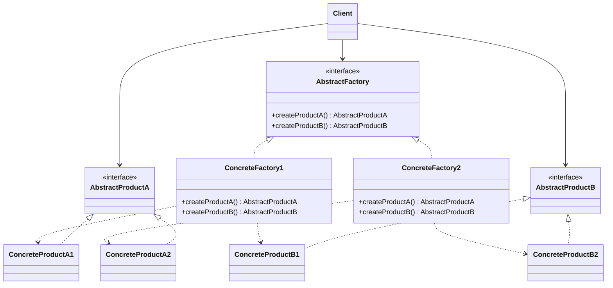

# Abstract Factory Pattern

> **Category:** Creational  
> **Intent:** Provide an interface for creating **families of related objects** without specifying their concrete classes.

---

## Overview

The Abstract Factory pattern is a "factory of factories." It provides an interface for creating entire families of related or dependent objects. The client works with factories and products through abstract interfaces, making it easy to swap entire families of objects without changing client code.

**Key characteristics:**
- Creates families of related objects that are designed to work together
- Enforces consistency — you can't accidentally mix products from different families
- Client code depends only on abstract interfaces, never on concrete classes

---

## 👶 Explain Like I'm 5

Imagine you're at a restaurant and you order the "Kids Meal." You get a burger, fries, and a juice box — they all come from the same kitchen and they all go together. If you go to a different restaurant and order their "Kids Meal," you get a pizza, breadsticks, and a soda — different food, but still a complete matching set.

The Abstract Factory is like the restaurant: you say "Give me a Kids Meal" and it gives you a **matching set of things**. You don't pick each item individually. This prevents you from accidentally getting a burger from McDonald's with pizza from Domino's — things that don't belong together.

---

## 🎓 Learning Curve: Beginner vs. Deep Dive

### For New Learners
The Abstract Factory is essentially a "bundle creator." Imagine you are buying a meal deal at a fast-food restaurant. You don't order a burger, fries, and a drink separately from different brands. You order the "Value Meal" from one specific restaurant, and you are guaranteed that all items in the meal go together perfectly. In code, an Abstract Factory ensures that when you ask for UI components (like a button and a checkbox), they all match the same theme (like Windows or Mac).

### Deep Dive: Java & Architecture Implications
In large-scale Java applications, Abstract Factories are often implemented using **Dependency Injection (DI)** frameworks like Spring or Guice. Instead of manually instantiating factories (`new WindowsFactory()`), the DI container injects the appropriate factory at runtime based on profiles or configuration properties. 

**Memory & Performance:**
- Since factories are usually stateless, they are almost universally implemented as **Singletons** to prevent unnecessary garbage collection overhead.
- Abstract Factories heavily rely on **interfaces** and **polymorphism**, which introduces dynamic dispatch. While the JVM (via JIT compilation) optimizes this incredibly well (e.g., inline caching), in highly performance-critical, low-latency loops (like HFT or game engines), abstracting every creation step might introduce microscopic overhead compared to direct instantiation.

---
## ❓ Problem & Solution

**The Problem:** Imagine you’re creating a furniture shop simulator. Your code needs to represent:
1. A family of related products, say: `Chair` + `Sofa` + `CoffeeTable`.
2. Several variants of this family. For example, all products are available in `Modern`, `Victorian`, and `ArtDeco` variants.

You need a way to create individual furniture objects so that they match other objects of the same family. Customers get frustrated when they receive non-matching furniture. Plus, you don’t want to change existing code every time a new furniture style or new product type is added to the catalog.

**The Solution:** The Abstract Factory pattern suggests explicitly declaring interfaces for each distinct product of the product family (e.g., `Chair`, `Sofa`). Then you ensure all variants follow those interfaces.
Next, you declare the *Abstract Factory*—an interface with a list of creation methods for all products in the family (`createChair()`, `createSofa()`). Finally, for each style variant, you create a dedicated concrete factory class that implements the abstract factory and returns the stylistically matching products.

---

## 🌍 Real-World Analogy

Think of the Abstract Factory as the master template at a furniture manufacturing plant. If you place an order with the "Victorian Factory" (a concrete factory), it guarantees that every `createChair()` and `createSofa()` call returns items styled with intricate wooden carvings. If you switch to the "Modern Factory", those exact same method calls return minimalist, glass-and-steel variants. The client (your living room) simply asks for "a Chair and a Sofa" and trusts the factory to maintain stylistic consistency.

---

## 🚀 Detailed Use Case: Multi-Database Support

**Scenario:** You are building an ORM (Object-Relational Mapping) framework that needs to support both MySQL and PostgreSQL. Each database requires specific implementations for Connections, Commands, and ResultSets.

**Application of Abstract Factory:**
1. **Abstract Products:** Define interfaces `DatabaseConnection`, `DatabaseCommand`, and `DatabaseResultSet`.
2. **Concrete Products:** Create `MySQLConnection`, `PostgreSQLConnection`, etc.
3. **Abstract Factory:** Define `DatabaseFactory` with methods `createConnection()`, `createCommand()`, etc.
4. **Concrete Factories:** Create `MySQLFactory` and `PostgreSQLFactory`.

**Why it's effective here:** 
If a developer tries to execute a PostgreSQL command on a MySQL connection, the system will crash. The Abstract Factory guarantees that if you instantiate the `PostgreSQLFactory`, all connections, commands, and result sets will be strictly PostgreSQL-compatible. The client code running the queries doesn't know which database it's talking to; it just uses the `DatabaseFactory` interface.

---

## When to Use

**✅ Use this when:**
- Your system needs to work with **multiple families** of related products (e.g., Windows UI vs. Mac UI, MySQL vs. PostgreSQL).
- You must **guarantee** that products from the same family are always used together — mixing them would cause crashes or logical errors.
- You need to **switch entire families** at runtime based on configuration, environment, or user preference.
- The product types are **stable** (you rarely add new product types), but you frequently add **new families/variants**.
- Building **cross-platform UIs**, **multi-database support**, or **theme systems**.

**❌ Don't use this when:**
- You only have **one product family** and no realistic plan for a second — use a simple Factory Method instead.
- The types of products in the family **change frequently** — adding a new product type requires modifying the abstract factory interface AND every concrete factory.
- Creation logic is **trivial** — if each product is just `new MyClass()`, the abstraction overhead isn't justified.
- You're in Spring and can achieve the same effect with **`@Profile` + `@Bean`** (see Enterprise section below).

**🔍 Quick Decision Checklist:**
1. Do you have **2+ families** of products that must not be mixed? → Yes = Abstract Factory.
2. Would mixing products from different families cause **bugs or crashes**? → Yes = Abstract Factory enforces safety.
3. Do you need to **swap families at runtime** (e.g., dev vs. prod, dark vs. light theme)? → Yes = Abstract Factory.
4. Do you add **new product types** more often than new families? → Yes = Abstract Factory is the *wrong* choice.

---

## How It Works

### 🏗️ Structure



### Example: Cross-Platform UI Components

```java
// ── Abstract Products ──
public interface Button {
    void render();
    void onClick(Runnable action);
}

public interface Checkbox {
    void render();
    boolean isChecked();
}

public interface TextField {
    void render();
    String getText();
}

// ── Windows Family ──
public class WindowsButton implements Button {
    @Override public void render() { System.out.println("[Windows Button]"); }
    @Override public void onClick(Runnable action) { action.run(); }
}

public class WindowsCheckbox implements Checkbox {
    private boolean checked = false;
    @Override public void render() { System.out.println("[Windows Checkbox]"); }
    @Override public boolean isChecked() { return checked; }
}

public class WindowsTextField implements TextField {
    @Override public void render() { System.out.println("[Windows TextField]"); }
    @Override public String getText() { return "windows-input"; }
}

// ── macOS Family ──
public class MacButton implements Button {
    @Override public void render() { System.out.println("[Mac Button]"); }
    @Override public void onClick(Runnable action) { action.run(); }
}

public class MacCheckbox implements Checkbox {
    private boolean checked = false;
    @Override public void render() { System.out.println("[Mac Checkbox]"); }
    @Override public boolean isChecked() { return checked; }
}

public class MacTextField implements TextField {
    @Override public void render() { System.out.println("[Mac TextField]"); }
    @Override public String getText() { return "mac-input"; }
}

// ── Abstract Factory ──
public interface GUIFactory {
    Button createButton();
    Checkbox createCheckbox();
    TextField createTextField();
}

// ── Concrete Factories ──
public class WindowsFactory implements GUIFactory {
    @Override public Button createButton() { return new WindowsButton(); }
    @Override public Checkbox createCheckbox() { return new WindowsCheckbox(); }
    @Override public TextField createTextField() { return new WindowsTextField(); }
}

public class MacFactory implements GUIFactory {
    @Override public Button createButton() { return new MacButton(); }
    @Override public Checkbox createCheckbox() { return new MacCheckbox(); }
    @Override public TextField createTextField() { return new MacTextField(); }
}

// ── Client Code ──
public class Application {
    private final Button button;
    private final Checkbox checkbox;
    private final TextField textField;

    public Application(GUIFactory factory) {
        this.button = factory.createButton();
        this.checkbox = factory.createCheckbox();
        this.textField = factory.createTextField();
    }

    public void renderUI() {
        button.render();
        checkbox.render();
        textField.render();
    }
}

// Usage — the client never references concrete classes
GUIFactory factory = isWindows() ? new WindowsFactory() : new MacFactory();
Application app = new Application(factory);
app.renderUI();
```

---

## Factory Method vs Abstract Factory

| Aspect | Factory Method | Abstract Factory |
|--------|---------------|-----------------|
| **Creates** | One product at a time | Family of related products |
| **Mechanism** | Inheritance (subclass overrides method) | Composition (factory object passed to client) |
| **Complexity** | Simpler | More complex |
| **Extensibility** | Add product variants | Add entire product families |
| **Example** | `createNotification()` | `createButton()`, `createCheckbox()`, `createTextField()` |

---

## Real-World Examples

| Framework/Library | Description |
|-------------------|-------------|
| `javax.xml.parsers.DocumentBuilderFactory` | Creates XML parsers (different implementations) |
| `javax.xml.transform.TransformerFactory` | Creates XSLT transformers |
| Java AWT Toolkit | `Toolkit.getDefaultToolkit()` creates platform-specific UI peers |
| Spring `BeanFactory` / `ApplicationContext` | Creates and manages families of beans |

---

## 🔄 Before & After: Why Abstract Factory Matters

### ❌ Without Abstract Factory — Products can be mixed, bugs lurk

```java
public class Application {
    public void buildUI(String platform) {
        Button button;
        Checkbox checkbox;
        if (platform.equals("windows")) {
            button = new WindowsButton();
            checkbox = new MacCheckbox(); // BUG! Mixed Windows + Mac
        } else {
            button = new MacButton();
            checkbox = new MacCheckbox();
        }
        button.render();
        checkbox.render();
        // Every new product type = more if-else. Every new platform = edit every branch.
    }
}
```

### ✅ With Abstract Factory — Consistency guaranteed

```java
public class Application {
    public void buildUI(GUIFactory factory) {
        Button button = factory.createButton();       // always matching
        Checkbox checkbox = factory.createCheckbox();  // always matching
        button.render();
        checkbox.render();
        // Can't mix platforms — the factory guarantees consistency.
    }
}
// Client:
GUIFactory factory = isWindows() ? new WindowsFactory() : new MacFactory();
new Application().buildUI(factory);
```

---

## 💼 Abstract Factory in Spring & Enterprise Java

### Spring Profiles as Abstract Factory

Spring's `@Profile` mechanism is essentially Abstract Factory in disguise:

```java
// Abstract products
public interface CacheService { void put(String key, Object value); }
public interface MessageQueue { void publish(String topic, String msg); }

// "Local" family
@Configuration
@Profile("local")
public class LocalInfraFactory {
    @Bean public CacheService cacheService() { return new InMemoryCacheService(); }
    @Bean public MessageQueue messageQueue() { return new InMemoryQueue(); }
}

// "Production" family  
@Configuration
@Profile("prod")
public class ProdInfraFactory {
    @Bean public CacheService cacheService() { return new RedisCacheService(); }
    @Bean public MessageQueue messageQueue() { return new KafkaQueue(); }
}

// Client code — doesn't know which family is active:
@Service
public class OrderService {
    private final CacheService cache;  // Redis or InMemory? Doesn't care.
    private final MessageQueue queue;  // Kafka or InMemory? Doesn't care.
    // ...
}
```

### Multi-Tenant Database Factory

```java
public interface TenantDatabaseFactory {
    DataSource createDataSource();
    TransactionManager createTransactionManager();
}

public class MySQLTenantFactory implements TenantDatabaseFactory { /* MySQL family */ }
public class PostgresTenantFactory implements TenantDatabaseFactory { /* Postgres family */ }

// Router picks the right factory per tenant:
@Component
public class TenantRouter {
    private final Map<String, TenantDatabaseFactory> factories;
    public TenantDatabaseFactory getFactory(String tenantId) {
        return factories.get(tenantId); // each tenant gets a consistent DB family
    }
}
```

---

## Advantages & Disadvantages

| Advantages | Disadvantages |
|-----------|---------------|
| Isolates concrete classes from client code | Adding new product types requires changing all factories |
| Ensures consistency among related products | Can lead to a large number of classes |
| Makes exchanging product families easy | Increases initial complexity |
| Follows Open/Closed Principle for families | Overkill for simple object creation |
| Promotes programming to interfaces | |

---

## ⭐ Best Practices

**Dos:**
- **Use for established product families:** Apply Abstract Factory when you have clear, distinct families of products that are meant to be used together, and mixing them would cause logical errors or application crashes.
- **Combine with Singleton:** Make your concrete factories Singletons. You usually only need one instance of a factory to create products.
- **Rely on Dependency Injection:** Inject factories into client classes rather than having clients instantiate them. This makes unit testing much easier (you can inject a `MockFactory` that returns mock products).

**Don'ts:**
- **Don't use prematurely:** If you only have one family of products and don't foresee needing another anytime soon, an Abstract Factory is over-engineering. Stick to a simple Factory Method or direct instantiation.
- **Don't add products lightly:** Avoid this pattern if the types of products in the family change frequently. Adding a `createLamp()` method means updating the `GUIFactory` interface and every single concrete factory class (`WindowsFactory`, `MacFactory`, etc.).

---

## Interview Questions

**Q1: What is the Abstract Factory pattern and how does it differ from the Factory pattern?**

The Abstract Factory pattern creates families of related objects without specifying their concrete classes, often grouped by theme or platform. It differs from the Factory pattern in scope: a Factory Method creates one product, while an Abstract Factory creates a suite of related products designed to work together. Abstract Factory is a "factory of factories."

**Q2: Can you describe a real-world scenario where you would use the Abstract Factory pattern?**

Building a cross-platform UI toolkit. The Abstract Factory interface defines methods to create buttons, text fields, and checkboxes. Each platform (Windows, macOS, Linux) has its own concrete factory that produces platform-specific components. The client code works with the abstract factory interface, so switching the entire UI to a different platform requires changing only the factory — no client code modifications.

**Q3: How would you implement the Abstract Factory pattern in Java?**

Define an abstract factory interface with creation methods for each product type. Create concrete factory classes for each product family, implementing all creation methods. Each factory class instantiates its family-specific products. The client receives a factory through its constructor (dependency injection) and calls the creation methods through the abstract interface.

**Q4: What are the advantages of using the Abstract Factory pattern?**

It promotes scalability by allowing new product families to be added without modifying existing code. It ensures consistency among products designed to work together. It isolates concrete classes from clients, supporting the Dependency Inversion Principle. And it makes switching between product families trivial.

**Q5: How can the Abstract Factory pattern support scalability in large systems?**

New product families can be added by creating new concrete factory classes without modifying existing code or factories. The client code remains unchanged because it depends only on the abstract interface. This separation allows different teams to develop different product families independently, and the system can be extended as requirements grow.

---

## Advanced Editorial Pass: Abstract Factory for Coherent Product Families

### Architectural Value
- Guarantees compatibility across related objects that must evolve together.
- Prevents clients from assembling invalid cross-family combinations.
- Supports environment-specific families without conditional creation logic in callers.

### Trade-offs to Watch
- Family count growth increases factory surface and maintenance cost.
- Over-abstraction hides concrete capabilities needed by power users.
- Infrequent variant expansion may not justify factory hierarchy complexity.

### Practical Guidance
1. Use Abstract Factory when family-level invariants are critical.
2. Keep family interfaces capability-oriented, not implementation-shaped.
3. Track family evolution metrics; simplify if variation stabilizes.

### 🔄 Relations with Other Patterns
- **[Factory Method](./factory-method.md)**: Many designs start with Factory Method (simpler, highly customizable via subclasses) and evolve into Abstract Factory when families of related objects appear. An Abstract Factory class is often implemented with a set of Factory Methods.
- **[Builder](./builder.md)**: Builder focuses on constructing complex objects step by step. Abstract Factory specializes in creating families of related objects. Abstract Factory returns the product immediately, whereas Builder lets you run some additional construction steps before fetching the product.
- **[Facade](./facade.md)**: An Abstract Factory can serve as an alternative to a Facade when you only want to hide the way subsystem objects are created from the client code.
- **[Singleton](./singleton.md)**: Concrete factories are almost always implemented as Singletons because you rarely need more than one factory object for a given variant of a product family.

### ⚖️ Abstract Factory vs. Similar Patterns

| Aspect | Factory Method | Abstract Factory | Builder | Prototype |
|--------|---------------|------------------|---------|----------|
| **What it creates** | One product | Family of related products | One complex product | Clone of existing object |
| **Mechanism** | Inheritance (override method) | Composition (pass factory object) | Step-by-step fluent API | `clone()` method |
| **Consistency guarantee** | None (single product) | ✅ Products always match | N/A | N/A |
| **Adding new variants** | Add creator subclass | Add factory class | Add builder | Add prototype |
| **Adding new products** | Easy (one method) | ❌ Hard (change all factories) | Easy (add step) | Easy |
| **When to pick** | Single product, need polymorphism | Product families must stay consistent | Complex construction with many optional parts | Many similar objects, cloning is cheaper |
