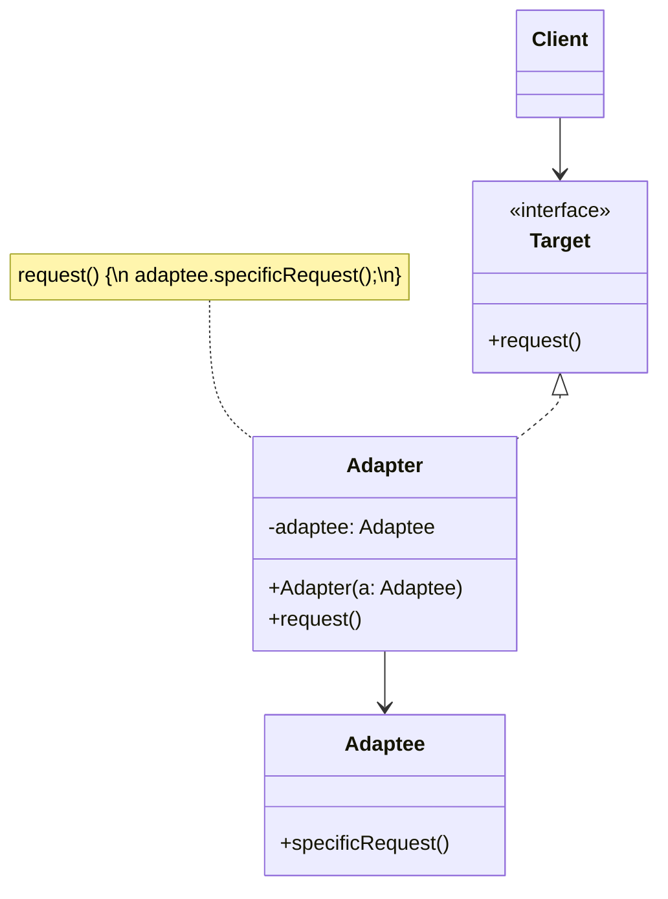

# Adapter Pattern

> **Category:** Structural  
> **Intent:** Convert the interface of a class into another interface clients expect, allowing incompatible interfaces to work together.

---

## Overview

The Adapter pattern acts as a bridge between two incompatible interfaces. It wraps an existing class with a new interface so that it becomes compatible with the client's expected interface — without modifying the original class.

**Key characteristics:**
- Translates one interface into another
- Allows reuse of existing classes with incompatible interfaces
- The client works with the target interface, unaware of the adapter

---

## 🎓 Learning Curve: Beginner vs. Deep Dive

### For New Learners
Think of the Adapter pattern exactly like a physical travel adapter for your electronic devices. You have a US laptop charger (the Adaptee), but you are in Europe where the wall sockets (the Target interface) have round holes instead of flat ones. The laptop charger and the wall socket are incompatible. Instead of buying a completely new European charger, you buy an adapter. The adapter plugs into the European wall, and your US charger plugs into the adapter. In software, an Adapter class wraps an incompatible class and translates requests into a format the existing system expects.

### Deep Dive: Java & Architecture Implications
In Java, adapters are heavily used to bridge legacy systems (like legacy `Enumeration` interfaces) with modern abstractions (like the `Iterator` interface). 
- **Object Adapter vs Class Adapter:** Java only supports single inheritance. Thus, **Class Adapters** (which inherit from both the Target and the Adaptee) are only possible if the Target is an interface, not a class. **Object Adapters** (which use composition by holding an instance of the Adaptee) are vastly preferred because they are more flexible and follow the principle of favoring composition over inheritance.
- **Performance Impact:** Adapters introduce a layer of indirection, which means an extra method call. While this is usually negligible due to JVM inlining, in extremely high-throughput, low-latency data pipelines (e.g., parsing millions of messages per second), this extra hop can show up in profiling.

---

## ❓ Problem & Solution

**The Problem:** Imagine you're creating a stock market monitoring app. The app downloads stock data from multiple sources in XML format and displays nice charts. Later, you decide to integrate a powerful 3rd-party analytics library. But there's a catch: the analytics library only works with data in JSON format. You can't change the library to work with XML because you might not have the source code, and your existing code is already heavily coupled to XML.

**The Solution:** You can create an *adapter*. This is a special object that converts the interface of one object so that another object can understand it. An adapter wraps one of the objects to hide the complexity of conversion happening behind the scenes. In the stock market app, you create an XML-to-JSON adapter and wrap the analytics library calls in it. Your code communicates with the adapter via the interface it expects, and the adapter translates the request into the format the analytics library needs.

---

## 🌍 Real-World Analogy

When you travel from the US to Europe, you may get a surprise when trying to charge your laptop for the first time. The power plug and socket standards are different across the world. A US plug won't fit a European socket. The problem is trivially solved by using a power plug adapter — it has an American-style socket on one side to accept your laptop's plug, and a European-style plug on the other side to connect to the wall.

---

## 🚀 Detailed Use Case: Migrating Legacy Payment Gateways

**Scenario:** Your e-commerce application has been using a legacy payment gateway (`LegacyStripeGateway`) that takes an XML string representing the payment details. You are migrating to a modern, modern API (`ModernSquareAPI`) that only accepts JSON. You have hundreds of classes scattered across your codebase that are hardcoded to call the XML-based `PaymentProcessor` interface.

**Application of Adapter:**
1. **Target Interface:** The existing `PaymentProcessor` interface that expects XML.
2. **Adaptee:** The new `ModernSquareAPI` that requires JSON.
3. **Adapter:** Create a `SquarePaymentAdapter` that implements `PaymentProcessor`. When `processPayment(xmlData)` is called on the adapter, the adapter parses the XML, converts it to JSON, and forwards the call to `ModernSquareAPI.pay(jsonData)`.

**Why it's effective here:** 
You don't need to touch the hundreds of existing classes that use `PaymentProcessor`. You simply swap the implementation injected into those classes to be the new `SquarePaymentAdapter`. This is an excellent application of the Open/Closed Principle.

---

## 🏗️ Structure



---

## When to Use

- Integrating third-party libraries with different interfaces than your code expects
- Legacy code needs to work with a new system
- You want to reuse existing classes that don't match the required interface
- You need to create a reusable class that cooperates with unrelated or unforeseen classes

---

## How It Works

### Object Adapter (Composition — Recommended)

The adapter holds a reference to the adaptee and implements the target interface:

```java
// Target interface — what the client expects
public interface MediaPlayer {
    void play(String filename);
    String getFormat();
}

// Adaptee — existing class with an incompatible interface
public class VlcPlayer {
    public void playVlcFile(String filename) {
        System.out.println("VLC playing: " + filename);
    }

    public String supportedFormat() {
        return "VLC";
    }
}

// Another adaptee
public class FfmpegPlayer {
    public void playMedia(String path, String codec) {
        System.out.println("FFmpeg playing: " + path + " with codec " + codec);
    }
}

// Adapter for VlcPlayer
public class VlcAdapter implements MediaPlayer {
    private final VlcPlayer vlcPlayer;

    public VlcAdapter(VlcPlayer vlcPlayer) {
        this.vlcPlayer = vlcPlayer;
    }

    @Override
    public void play(String filename) {
        vlcPlayer.playVlcFile(filename);
    }

    @Override
    public String getFormat() {
        return vlcPlayer.supportedFormat();
    }
}

// Adapter for FfmpegPlayer
public class FfmpegAdapter implements MediaPlayer {
    private final FfmpegPlayer ffmpegPlayer;
    private final String codec;

    public FfmpegAdapter(FfmpegPlayer ffmpegPlayer, String codec) {
        this.ffmpegPlayer = ffmpegPlayer;
        this.codec = codec;
    }

    @Override
    public void play(String filename) {
        ffmpegPlayer.playMedia(filename, codec);
    }

    @Override
    public String getFormat() {
        return "FFmpeg (" + codec + ")";
    }
}

// Usage — client works with MediaPlayer only
MediaPlayer player = new VlcAdapter(new VlcPlayer());
player.play("movie.vlc");

MediaPlayer ffmpeg = new FfmpegAdapter(new FfmpegPlayer(), "H.264");
ffmpeg.play("video.mp4");
```

### Class Adapter (Inheritance)

The adapter extends the adaptee and implements the target interface:

```java
// Class adapter — uses inheritance instead of composition
public class VlcClassAdapter extends VlcPlayer implements MediaPlayer {
    @Override
    public void play(String filename) {
        playVlcFile(filename);  // inherited from VlcPlayer
    }

    @Override
    public String getFormat() {
        return supportedFormat();
    }
}
```

### Object Adapter vs Class Adapter

| Aspect | Object Adapter | Class Adapter |
|--------|---------------|---------------|
| **Mechanism** | Composition (has-a) | Inheritance (is-a) |
| **Flexibility** | Works with any subclass of adaptee | Tied to one specific adaptee class |
| **Java support** | ✅ Works naturally | ⚠️ Limited — Java has single inheritance |
| **Override behavior** | Cannot override adaptee methods | Can override adaptee methods |
| **Recommendation** | Preferred | Use only when you need to override |

---

## Real-World Examples

| Example | Target | Adaptee |
|---------|--------|---------|
| `java.io.InputStreamReader` | `Reader` | `InputStream` |
| `java.io.OutputStreamWriter` | `Writer` | `OutputStream` |
| `java.util.Arrays.asList()` | `List` | Array |
| `java.util.Collections.enumeration()` | `Enumeration` | `Collection` |
| Spring MVC `HandlerAdapter` | Unified handler interface | Various controller types |

`InputStreamReader` is a perfect example — it adapts a byte-oriented `InputStream` into a character-oriented `Reader`:

```java
// InputStream → Reader adapter
Reader reader = new InputStreamReader(new FileInputStream("data.txt"), StandardCharsets.UTF_8);
```

---

## Adapter vs Decorator vs Proxy

| Pattern | Purpose | Changes interface? | Adds behavior? |
|---------|---------|-------------------|----------------|
| **Adapter** | Make incompatible interfaces work together | ✅ Yes | ❌ No |
| **Decorator** | Add responsibilities dynamically | ❌ No (same interface) | ✅ Yes |
| **Proxy** | Control access to an object | ❌ No (same interface) | ✅ Yes (access control) |

---

## Advantages & Disadvantages

| Advantages | Disadvantages |
|-----------|---------------|
| Allows incompatible classes to collaborate | Introduces extra indirection |
| Single Responsibility — separates conversion logic | Can make code harder to follow with many adapters |
| Open/Closed — add adapters without modifying existing classes | Adds complexity when a simpler refactor might suffice |
| Promotes code reuse of existing classes | |

---

## ⭐ Best Practices

**Dos:**
- **Favor Object Adapters:** Always prefer composition (Object Adapters) over inheritance (Class Adapters). Object adapters allow you to adapt the class and all of its subclasses, whereas class adapters tie you to a specific implementation.
- **Keep it Simple:** The adapter should ideally only handle the translation between interfaces. Do not add significant business logic inside the adapter; that violates the Single Responsibility Principle.

**Don'ts:**
- **Don't use when you can refactor:** If you own both the source code for the client and the adaptee, and neither is part of a public API, it's often cleaner to simply refactor the adaptee to implement the required interface directly. Adapters are best when you *cannot* or *should not* modify the existing code.
- **Don't confuse with Decorator or Proxy:** Remember that an Adapter changes the interface but not the behavior. If you are adding new behavior without changing the interface, you want a Decorator.

---

## Interview Questions

**Q1: What is the Adapter pattern and when would you use it?**

The Adapter pattern allows objects with incompatible interfaces to work together by creating an adapter that bridges the gap. It converts the interface of one class into another that the client expects. Use it when integrating third-party libraries, connecting legacy code to new systems, or when you need to reuse existing classes whose interfaces don't match your requirements.

**Q2: How does the Adapter pattern differ from the Decorator pattern?**

The Adapter converts an interface to make incompatible classes work together — it focuses on **compatibility**. The Decorator adds new functionality to objects dynamically without altering their structure — it focuses on **enhancement**. The Adapter changes the interface; the Decorator preserves it while adding behavior.

**Q3: What are the two types of adapters and how do they differ?**

**Class adapters** use inheritance — the adapter extends the adaptee class and implements the target interface. They can override adaptee behavior but are tied to one specific class. **Object adapters** use composition — the adapter holds a reference to the adaptee. They're more flexible (work with any subclass of the adaptee) and are generally preferred, especially in Java where single inheritance limits class adapters.

**Q4: Can you provide an example of using the Adapter pattern in Java?**

`InputStreamReader` adapts a byte-oriented `InputStream` into a character-oriented `Reader`. Your code expects a `Reader`, but you have a `FileInputStream`. The adapter translates between the two interfaces: `new InputStreamReader(new FileInputStream("file.txt"), UTF_8)`. The client reads characters while the underlying stream provides bytes.

**Q5: Why is the Adapter pattern useful when integrating third-party libraries?**

It lets you connect the library's interface to your application's interface without modifying either codebase. Your existing code continues to work with its expected interface, and the library remains untouched. The adapter acts as a translation layer, making integration clean, maintainable, and reversible.

---

## Advanced Editorial Pass: Adapter in Integration Boundaries

### Design Tensions to Evaluate
- API purity vs delivery speed: adapters protect your domain model from vendor-specific contracts.
- Translation depth vs performance: normalize only what your domain actually needs.
- Reusability vs leakage: avoid adapters that expose foreign error models and transport details.

### Production Failure Modes
- Silent semantic drift when upstream API behavior changes but adapter mapping stays outdated.
- Overloaded adapters that become mini orchestration layers.
- Incomplete exception translation that hides retryability and idempotency semantics.

### Implementation Heuristics
1. Keep adapters at boundary packages; do not let them spread into core domain modules.
2. Add contract tests that pin expected translation behavior for request, response, and error paths.
3. Version adapters explicitly when third-party APIs are unstable.

### 🔄 Relations with Other Patterns
- **[Bridge](./bridge.md)**: Bridge is usually designed up-front to let you develop parts of an application independently. Adapter is typically used on an existing app to make otherwise-incompatible classes work together.
- **[Decorator](./decorator.md)**: Adapter changes the interface of an existing object, while Decorator enhances an object without changing its interface. In addition, Decorator supports recursive composition, which isn't possible when you use pure Adapters.
- **[Facade](./facade.md)**: Facade defines a new interface for entire subsystems of objects. Adapter makes an existing interface usable in a new context. Adapter usually wraps just one object, whereas Facade works with many objects representing an entire subsystem.
- **[Proxy](./proxy.md)**: Proxy provides the same exact interface as its subject, whereas Adapter provides a different interface.
