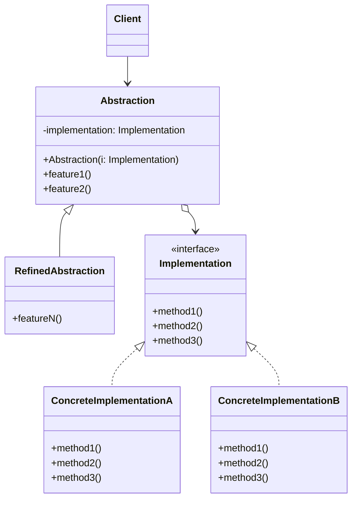

# Bridge Pattern

> **Category:** Structural  
> **Intent:** Decouple an abstraction from its implementation so that the two can vary independently.

---

## Overview

The Bridge pattern splits a large class or a set of closely related classes into two separate hierarchies — abstraction and implementation — which can be developed independently. It uses composition instead of inheritance to connect the two hierarchies.

**Key characteristics:**
- Two independent hierarchies connected via composition
- Abstraction contains a reference to an implementation object (the "bridge")
- Both sides can be extended without affecting the other

---

## 👶 Explain Like I'm 5

Imagine you have **shapes** (circle, square, triangle) and **colors** (red, blue, green). If you try to make every combination — red circle, blue circle, green circle, red square, blue square... you end up with **a LOT** of things to manage.

Instead, keep shapes and colors **separate**. A circle just says "fill me with whatever color I'm given." Now you can mix and match freely: any shape + any color, without making a new thing for every combination. The Bridge pattern is this idea in code: keep the **two things that can change** separate and connect them with a "bridge."

---

## 🎓 Learning Curve: Beginner vs. Deep Dive

### For New Learners
Imagine you are building a system for remote controls and TVs. You could have a `SonyTVRemote`, a `SonyAdvancedRemote`, a `SamsungTVRemote`, a `SamsungAdvancedRemote`, etc. This leads to a massive number of classes. The Bridge pattern says: split them up! Have one set of classes for Remotes (Basic, Advanced) and another set of classes for TVs (Sony, Samsung). The Remote has a "bridge" (a variable) pointing to the TV. Now you can mix and match them without creating a new class for every combination. 

### Deep Dive: Java & Architecture Implications
The Bridge pattern is the structural embodiment of the **"Favor Composition over Inheritance"** principle.
- **Independent Evolution:** It separates the **abstraction** (the policy or high-level control logic) from the **implementation** (the low-level platform-specific details). This allows the two hierarchies to evolve at completely different speeds.
- **Dependency Injection:** In modern Java architectures (Spring, Jakarta EE), the "bridge" is almost always injected at runtime via Dependency Injection. The abstraction layer simply declares a `@Autowired` or `@Inject` interface dependency.
- **Performance:** Because it uses composition, it involves virtual method dispatching through an interface reference. In Java, Megamorphic Call Sites (where an interface has many different implementations called interchangeably in a hot loop) can occasionally prevent JVM method inlining, but for 99% of enterprise applications, this overhead is nonexistent.

---

## ❓ Problem & Solution

**The Problem:** Suppose you have a geometric `Shape` class with a pair of subclasses: `Circle` and `Square`. You want to extend this class hierarchy to incorporate colors, so you plan to create `Red` and `Blue` shape subclasses. However, since you already have two subclasses, you'll need to create four class combinations such as `BlueCircle` and `RedSquare`. Adding new shape types and colors to the hierarchy will grow it exponentially. For example, adding a triangle shape would require two new subclasses (one for each color). And after that, adding a new color would require creating three subclasses (one for each shape type).

**The Solution:** This problem occurs because we're trying to extend shape classes in two independent dimensions: by form and by color. That's a very common issue with class inheritance. The Bridge pattern solves this problem by switching from inheritance to object composition. You extract one of the dimensions into a separate class hierarchy, so that the original classes will reference an object of the new hierarchy, instead of having all of its state and behaviors tightly coupled within one class.

---

## 🌍 Real-World Analogy

Think of universal remote controls and the devices they control (TVs, Radios, DVD players). With pure inheritance, you would need a `TVRemote`, an `AdvancedTVRemote`, a `RadioRemote`, and an `AdvancedRadioRemote`—scaling exponentially.
Instead, the Bridge pattern splits these into two independent hierarchies:
1. The **Abstraction**: The Remote Control itself (e.g., Basic Remote, Advanced Remote with a screen).
2. The **Implementation**: The specific Device being controlled (e.g., TV, Radio), which handles fundamental commands like powering on or changing volume.
The remote control contains a reference (the bridge) to the device. Any remote can control any device through this common implementation interface, meaning you can add new remotes or new devices completely independently.

---

## 🚀 Detailed Use Case: Cross-Platform UI Frameworks

**Scenario:** You are building a UI framework that needs to render buttons and checkboxes on both Windows and macOS. You also want to provide different "themes" (like Light Mode, Dark Mode, High Contrast Mode).

**Application of Bridge:**
If you used inheritance, you'd end up with `WindowsLightButton`, `MacDarkButton`, `WindowsHighContrastCheckbox`, etc. (exponential explosion).
Instead, you apply the Bridge pattern:
1. **Implementation Hierarchy (Platform API):** You define a `WidgetRenderer` interface with `renderButton()` and `renderCheckbox()`. You create concrete implementations: `WindowsRenderer` and `MacRenderer`.
2. **Abstraction Hierarchy (UI Controls):** You define an abstract `UIControl` class (with a reference to `WidgetRenderer`). You subclass it to create `ButtonControl` and `CheckboxControl`.

**Why it's effective here:** 
The UI components (Button, Checkbox) contain the high-level logic (e.g., handling clicks, maintaining state). The Renderer handles the low-level drawing. Adding a new "LinuxRenderer" requires zero changes to the `ButtonControl`. Adding a "SliderControl" requires zero changes to the renderers (provided the renderer API supports basic drawing primitives).

---

## 🏗️ Structure



---

## When to Use

**✅ Use this when:**
- Both abstraction and implementation need to be **extended independently** (two dimensions of variation).
- You want to avoid **N × M class explosion** (e.g., 5 shapes × 4 colors = 20 classes with inheritance, but only 9 with Bridge).
- **Switching implementations at runtime** is needed (e.g., swap email sender for SMS sender).
- The implementation details should be **hidden from the client**.
- Two **orthogonal dimensions of variation** exist in your system.

**❌ Don't use this when:**
- Only **one axis** actually varies — a simple interface + implementation is enough (Strategy pattern).
- The abstraction layer adds **no policy** and just forwards calls — that's just unnecessary indirection.
- You have a **simple system** with 1-2 implementations — Bridge is over-engineering.
- You can't clearly identify **two independent dimensions** of change.

**🔍 Quick Decision Checklist:**
1. Do you see **two independent dimensions** that can change? → Yes = Bridge.
2. Would inheritance create an **N × M explosion** of classes? → Yes = Bridge.
3. Does your abstraction add **real policy/logic** beyond delegation? → Yes = Bridge. No = Maybe just Strategy.
4. Do you need to **swap implementations at runtime**? → Yes = Bridge (or Strategy).

---

## The Problem: Class Explosion

Without Bridge, combining two dimensions leads to exponential class growth:

```
Shape × Color without Bridge:
├── RedCircle
├── BlueCircle
├── GreenCircle
├── RedSquare
├── BlueSquare
├── GreenSquare
├── RedTriangle
├── BlueTriangle
└── GreenTriangle    → 9 classes for 3 shapes × 3 colors
```

Adding a new color requires 3 new classes. Adding a new shape requires 3 more. This scales poorly.

## How It Works

### Bridge Solution

```java
// ── Implementation hierarchy ──
public interface Color {
    String fill();
    String getHex();
}

public class Red implements Color {
    @Override public String fill() { return "Red"; }
    @Override public String getHex() { return "#FF0000"; }
}

public class Blue implements Color {
    @Override public String fill() { return "Blue"; }
    @Override public String getHex() { return "#0000FF"; }
}

public class Green implements Color {
    @Override public String fill() { return "Green"; }
    @Override public String getHex() { return "#00FF00"; }
}

// ── Abstraction hierarchy ──
public abstract class Shape {
    protected final Color color;  // ← the bridge

    public Shape(Color color) {
        this.color = color;
    }

    public abstract String draw();
    public abstract double area();
}

public class Circle extends Shape {
    private final double radius;

    public Circle(Color color, double radius) {
        super(color);
        this.radius = radius;
    }

    @Override
    public String draw() {
        return "Drawing Circle (r=" + radius + ") in " + color.fill();
    }

    @Override
    public double area() {
        return Math.PI * radius * radius;
    }
}

public class Square extends Shape {
    private final double side;

    public Square(Color color, double side) {
        super(color);
        this.side = side;
    }

    @Override
    public String draw() {
        return "Drawing Square (s=" + side + ") in " + color.fill();
    }

    @Override
    public double area() {
        return side * side;
    }
}

// Usage — combine any shape with any color
Shape redCircle = new Circle(new Red(), 5.0);
Shape blueSquare = new Square(new Blue(), 4.0);
Shape greenCircle = new Circle(new Green(), 3.0);

System.out.println(redCircle.draw());    // Drawing Circle (r=5.0) in Red
System.out.println(blueSquare.draw());   // Drawing Square (s=4.0) in Blue
```

**Result:** 3 shapes + 3 colors = 6 classes (instead of 9). Adding a new color = 1 class. Adding a new shape = 1 class.

### More Realistic Example: Notification System

```java
// Implementation — how to send
public interface MessageSender {
    void send(String recipient, String message);
}

public class EmailSender implements MessageSender {
    @Override
    public void send(String recipient, String message) {
        System.out.println("Email to " + recipient + ": " + message);
    }
}

public class SmsSender implements MessageSender {
    @Override
    public void send(String recipient, String message) {
        System.out.println("SMS to " + recipient + ": " + message);
    }
}

public class SlackSender implements MessageSender {
    @Override
    public void send(String recipient, String message) {
        System.out.println("Slack to #" + recipient + ": " + message);
    }
}

// Abstraction — what to send
public abstract class Notification {
    protected final MessageSender sender;

    public Notification(MessageSender sender) {
        this.sender = sender;
    }

    public abstract void notify(String recipient, String event);
}

public class UrgentNotification extends Notification {
    public UrgentNotification(MessageSender sender) { super(sender); }

    @Override
    public void notify(String recipient, String event) {
        sender.send(recipient, "🚨 URGENT: " + event);
    }
}

public class InfoNotification extends Notification {
    public InfoNotification(MessageSender sender) { super(sender); }

    @Override
    public void notify(String recipient, String event) {
        sender.send(recipient, "ℹ️ Info: " + event);
    }
}

// Usage — combine any notification type with any sender
Notification urgentEmail = new UrgentNotification(new EmailSender());
Notification infoSlack = new InfoNotification(new SlackSender());

urgentEmail.notify("admin@company.com", "Server is down");
infoSlack.notify("engineering", "Deployment completed");
```

---

## Bridge vs Adapter

| Aspect | Bridge | Adapter |
|--------|--------|---------|
| **Purpose** | Design flexibility upfront | Integration fix after the fact |
| **When applied** | During system design | When connecting existing incompatible code |
| **Relationship** | Abstraction ↔ Implementation (both evolve) | Target ↔ Adaptee (converting interfaces) |
| **Intent** | Prevent class explosion | Make things work together |

---

## 🔄 Before & After: Why Bridge Matters

### ❌ Without Bridge — Class explosion

```java
// 3 notification types × 3 channels = 9 classes!
class UrgentEmailNotification { ... }
class UrgentSmsNotification { ... }
class UrgentSlackNotification { ... }
class InfoEmailNotification { ... }
class InfoSmsNotification { ... }
class InfoSlackNotification { ... }
class ScheduledEmailNotification { ... }
class ScheduledSmsNotification { ... }
class ScheduledSlackNotification { ... }
// Adding a new channel (Teams)? +3 classes. New urgency level? +3 more.
```

### ✅ With Bridge — Compose freely

```java
// 3 notification types + 3 channels = 6 classes total
Notification urgent = new UrgentNotification(new SlackSender());
Notification info = new InfoNotification(new EmailSender());
Notification scheduled = new ScheduledNotification(new SmsSender());
// Adding Teams? Just 1 class: TeamsSender. Adding a new type? Just 1 class.
```

---

## 💼 Bridge in Spring & Enterprise Java

### JDBC as Bridge Pattern

JDBC is the most famous Bridge pattern in Java:

```java
// Abstraction: java.sql.Connection, Statement, ResultSet (JDBC API)
// Implementation: MySQL driver, PostgreSQL driver, Oracle driver

// Your code works with the abstraction:
Connection conn = DriverManager.getConnection(url);  // bridge to implementation
Statement stmt = conn.createStatement();
ResultSet rs = stmt.executeQuery("SELECT * FROM users");
// Switch from MySQL to PostgreSQL? Change the URL. Zero code changes.
```

### Spring: Logging Framework Bridge (SLF4J)

```java
// SLF4J is literally a Bridge:
// Abstraction: org.slf4j.Logger (your code uses this)
// Implementation: Logback, Log4j2, JUL (swappable via classpath)

import org.slf4j.Logger;
import org.slf4j.LoggerFactory;

@Service
public class OrderService {
    private static final Logger log = LoggerFactory.getLogger(OrderService.class);
    public void processOrder(Order order) {
        log.info("Processing order {}", order.getId());  // abstraction
        // Actual logging done by Logback/Log4j2 (implementation) — swappable!
    }
}
```

---

## Advantages & Disadvantages

| Advantages | Disadvantages |
|-----------|---------------|
| Prevents combinatorial class explosion | Adds complexity via indirection |
| Abstraction and implementation evolve independently | Can be overkill for simple systems |
| Runtime switching of implementations | Requires identifying two orthogonal dimensions |
| Follows Open/Closed and Single Responsibility | |
| Hides implementation details from client | |

---

## ⭐ Best Practices

**Dos:**
- **Identify orthogonal dimensions:** Only apply the Bridge pattern when you clearly see two distinct dimensions of variation (e.g., frontend vs. backend, platform vs. feature, shape vs. color).
- **Use Interfaces for Implementation:** The "Implementation" hierarchy should almost always be rooted in a pure interface, ensuring maximum decoupling.

**Don'ts:**
- **Don't confuse with Adapter:** Bridge is designed *upfront* to let abstractions and implementations vary independently. Adapter is used *after the fact* to make incompatible classes work together.
- **Avoid over-engineering:** If your abstraction only has one implementation and you don't foresee needing another anytime soon, don't proactively add a Bridge. A simple class will suffice. YAGNI (You Aren't Gonna Need It) applies here.

---

## Interview Questions

**Q1: What is the Bridge pattern and how does it decouple abstraction from implementation?**

The Bridge pattern separates a class into two hierarchies — abstraction and implementation — connected through composition (the "bridge"). This allows both to evolve independently. The abstraction holds a reference to an implementation interface and delegates work to it. This decoupling prevents class explosion and enables changing implementations without touching the abstraction.

**Q2: Can you explain the difference between the Bridge pattern and the Adapter pattern?**

Bridge is a design-time pattern — you plan it upfront to avoid class explosion by separating two dimensions of variation. Adapter is an integration-time fix — you apply it when connecting existing incompatible interfaces. Bridge allows both sides to vary independently; Adapter translates one interface to another.

**Q3: In what scenarios would you use the Bridge pattern?**

When a system has two orthogonal dimensions that can vary independently — for example, shapes and colors, notification types and delivery channels, or UI components and rendering engines. Also when you need runtime switching of implementations, or when combining N abstractions × M implementations would create N×M classes using inheritance alone.

**Q4: What are the key benefits of using the Bridge pattern in large systems?**

It prevents class explosion by composing instead of inheriting. Both abstraction and implementation can be developed, tested, and deployed independently. It simplifies maintenance because changes to the implementation don't ripple through the abstraction hierarchy. And it enables runtime flexibility — swap implementations without recompiling.

**Q5: How would you implement the Bridge pattern in Java?**

Create an interface for the implementation dimension with its concrete classes. Create an abstract class for the abstraction dimension that holds a reference to the implementation interface. Extend the abstraction with refined abstractions. The abstract class delegates work to the implementation through the bridge reference. Both hierarchies can grow independently.

---

## Advanced Editorial Pass: Bridge for Orthogonal Variability

### Where Bridge Pays Off
- Two independent change axes evolve at different rates (for example, abstraction behavior and platform implementation).
- You need combinatorial flexibility without exploding class hierarchies.
- Runtime composition of implementation families is a requirement, not an academic preference.

### Warning Signs
- Only one axis actually varies in practice.
- The abstraction layer adds no policy and simply forwards calls.
- Teams cannot explain why Bridge is better than Strategy plus interfaces in this context.

### Engineering Checklist
1. Define explicit ownership boundaries: who owns abstraction policy and who owns implementation details?
2. Ensure both hierarchies can be tested independently with stable contracts.
3. Document expected extension strategy for each axis to prevent accidental inheritance coupling.

### 🔄 Relations with Other Patterns
- **[Adapter](./adapter.md)**: Bridge is usually designed up-front, letting you develop parts of an application independently. Adapter is commonly used on an existing app to make some otherwise-incompatible classes work together.
- **[State](./state.md), [Strategy](./strategy.md), and [Bridge](./bridge.md)**: These have very similar solution structures based on composition (delegating work to other objects), but they all solve different problems.
- **[Abstract Factory](./abstract-factory.md)**: Abstract Factory is often used alongside Bridge. This pairing is useful when some abstractions defined by Bridge can only work with specific implementations. Abstract Factory can encapsulate these creation relations and hide the complexity from the client code.
- **[Builder](./builder.md)**: You can combine Builder with Bridge. In this scenario, the director class plays the role of the abstraction, while different builders act as implementations.

### ⚖️ Bridge vs. Strategy vs. Adapter

| Aspect | Bridge | Strategy | Adapter |
|--------|--------|----------|---------|
| **Purpose** | Decouple two independent hierarchies | Swap algorithm at runtime | Make incompatible interfaces work together |
| **Designed** | Up-front (architectural) | Up-front or after | After the fact (retrofit) |
| **Hierarchies** | Two (abstraction + implementation) | One (strategy implementations) | One (adaptee wrapped) |
| **Abstraction adds logic?** | ✅ Yes (real policy/behavior) | ❌ No (context delegates entirely) | ❌ No (just translates) |
| **When to pick** | Two orthogonal dimensions that vary | One behavior that varies | Incompatible existing interface |
