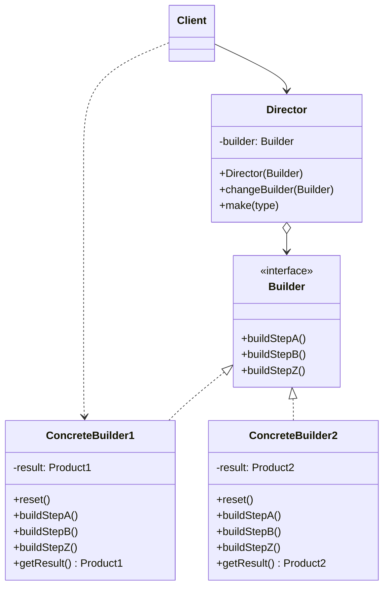

# Builder Pattern

> **Category:** Creational  
> **Intent:** Separate the construction of a complex object from its representation, allowing the same construction process to create different representations.

---

## Overview

The Builder pattern constructs complex objects step by step. Unlike constructors that require all parameters upfront, a builder lets you set properties one at a time and then assemble the final object. This is especially valuable when objects have many optional parameters.

**Key characteristics:**
- Step-by-step object construction
- Fluent API through method chaining (`return this`)
- Separates construction logic from the object's representation
- Can produce different representations using the same construction process

---

## 🎓 Learning Curve: Beginner vs. Deep Dive

### For New Learners
Think of the Builder pattern like ordering a custom sandwich at Subway. You don't just say "give me a sandwich" (which would be a simple constructor) or list 20 ingredients at once "give me bread, no mayo, yes mustard, turkey, no ham..." (which is a giant, confusing constructor). Instead, you walk down the line: "I'll take wheat bread. Now add turkey. Skip the cheese. Add lettuce." You build it step by step. When you reach the register, the "builder" hands you the final, complete sandwich. 

### Deep Dive: Java & Architecture Implications
In Java, Builders are the de facto standard for constructing immutable objects with more than 3 or 4 parameters. 
- **Immutability & Thread Safety:** A class with only `final` fields and no setters is thread-safe. However, you can't construct it easily if it has 10 fields. A Builder solves this: the Builder itself is mutable (not thread-safe), but once `build()` is called, it returns a strictly immutable, thread-safe object.
- **Lombok `@Builder`:** In modern enterprise Java, you rarely write Builder boilerplate by hand. Annotating a class with Lombok's `@Builder` automatically generates the static inner Builder class at compile time via annotation processing.
- **Validation Boundary:** The `build()` method acts as a critical validation boundary. You can accumulate state loosely in the builder, but `build()` must enforce all domain invariants (e.g., throwing an `IllegalStateException` if `startDate` is after `endDate`).

---

## ❓ Problem & Solution

**The Problem:** Imagine a complex object that requires laborious, step-by-step initialization of many fields and nested objects. Such initialization code is usually buried inside a monstrous telescoping constructor with lots of parameters, or scattered all over the client code.
For example, consider building a `House` object. You need to construct walls, a floor, install doors, and build a roof. What if you want a house with a swimming pool, a garden, or a heating system? Creating subclasses for every possible configuration (`HouseWithPool`, `HouseWithGardenAndPool`) leads to an unmanageable explosion of classes. Taking the mega-constructor approach (`new House(walls, doors, false, true, false, true)`) makes the code incredibly hard to read and use.

**The Solution:** The Builder pattern extracts the object construction code out of its own class and moves it to separate objects called *builders*. The pattern organizes object construction into a set of steps (`buildWalls()`, `buildPool()`, etc.). To create an object, you execute a series of these steps on a builder object. The crucial part is that you only call the steps you actually need, allowing you to produce vastly different configurations using the exact same construction process.

---

## 🌍 Real-World Analogy

Consider how you order a custom PC online. You don't buy a massive pre-configured object that you must accept as-is. Instead, you use a configuration tool. First, you pick the CPU, then the case, then add optional extras like more RAM or a better graphics card. The "Builder" takes your step-by-step inputs, handles the complexities of making sure the parts are compatible, and finally assembles the exact custom PC representation you requested.

---

## 🚀 Detailed Use Case: Test Data Builders

**Scenario:** You are writing unit tests for a complex e-commerce application. You need to create `User` objects, `Order` objects, and `Product` objects. These objects have massive dependency trees and dozens of fields, most of which are irrelevant to any specific test.

**Application of Builder:**
You create a `TestUserBuilder`. It sets sensible defaults for *all* required fields (e.g., a dummy email, a valid hashed password, a standard shipping address). 
In your test, you only override the fields that matter for that specific scenario:
```java
User VIPUser = new TestUserBuilder()
    .withStatus(UserStatus.VIP)
    .withDiscountRate(0.20)
    // email, password, and address are automatically set to defaults
    .build();
```

**Why it's effective here:** 
Without a Builder, every time a new field is added to the `User` class, hundreds of unit tests might break because the constructor signature changed. With a Builder, the `TestUserBuilder` absorbs the change by providing a default for the new field, and all tests continue to compile and pass.

---

## 🏗️ Structure



---

## When to Use

- Objects have many parameters (especially optional ones) — the "telescoping constructor" problem
- Object construction involves multiple steps or configurations
- You need to create different representations of the same type of object
- You want to enforce immutability in the constructed object
- Object creation requires validation across multiple fields

---

## How It Works

### The Telescoping Constructor Problem

Without Builder, adding optional parameters leads to an explosion of constructors:

```java
// BAD — telescoping constructors
public class Pizza {
    public Pizza(String size) { ... }
    public Pizza(String size, boolean cheese) { ... }
    public Pizza(String size, boolean cheese, boolean pepperoni) { ... }
    public Pizza(String size, boolean cheese, boolean pepperoni, boolean mushrooms) { ... }
    // ... and so on
}
```

### Builder Solution

```java
public class HttpRequest {
    private final String url;
    private final String method;
    private final Map<String, String> headers;
    private final String body;
    private final int timeout;
    private final boolean followRedirects;

    private HttpRequest(Builder builder) {
        this.url = builder.url;
        this.method = builder.method;
        this.headers = Collections.unmodifiableMap(builder.headers);
        this.body = builder.body;
        this.timeout = builder.timeout;
        this.followRedirects = builder.followRedirects;
    }

    // Getters only — the object is immutable
    public String getUrl() { return url; }
    public String getMethod() { return method; }
    public Map<String, String> getHeaders() { return headers; }
    public String getBody() { return body; }
    public int getTimeout() { return timeout; }
    public boolean isFollowRedirects() { return followRedirects; }

    public static class Builder {
        // Required
        private final String url;

        // Optional with defaults
        private String method = "GET";
        private Map<String, String> headers = new HashMap<>();
        private String body;
        private int timeout = 30_000;
        private boolean followRedirects = true;

        public Builder(String url) {
            this.url = Objects.requireNonNull(url, "URL must not be null");
        }

        public Builder method(String method) {
            this.method = method;
            return this;
        }

        public Builder header(String key, String value) {
            this.headers.put(key, value);
            return this;
        }

        public Builder body(String body) {
            this.body = body;
            return this;
        }

        public Builder timeout(int timeout) {
            this.timeout = timeout;
            return this;
        }

        public Builder followRedirects(boolean followRedirects) {
            this.followRedirects = followRedirects;
            return this;
        }

        public HttpRequest build() {
            // Validation
            if (("POST".equals(method) || "PUT".equals(method)) && body == null) {
                throw new IllegalStateException(method + " request requires a body");
            }
            return new HttpRequest(this);
        }
    }
}

// Usage — fluent, readable, self-documenting
HttpRequest request = new HttpRequest.Builder("https://api.example.com/users")
    .method("POST")
    .header("Content-Type", "application/json")
    .header("Authorization", "Bearer token123")
    .body("{\"name\": \"John\"}")
    .timeout(5000)
    .followRedirects(false)
    .build();
```

### Director Pattern (Optional)

A Director encapsulates common build sequences—useful when you frequently build the same configurations:

```java
public class HttpRequestDirector {
    public static HttpRequest.Builder jsonPost(String url, String body) {
        return new HttpRequest.Builder(url)
            .method("POST")
            .header("Content-Type", "application/json")
            .header("Accept", "application/json")
            .body(body);
    }

    public static HttpRequest.Builder healthCheck(String baseUrl) {
        return new HttpRequest.Builder(baseUrl + "/health")
            .method("GET")
            .timeout(3000);
    }
}

// Usage
HttpRequest request = HttpRequestDirector.jsonPost(
    "https://api.example.com/users",
    "{\"name\": \"John\"}"
).timeout(5000).build();
```

---

## Builder vs Factory

| Aspect | Builder | Factory |
|--------|---------|---------|
| **Focus** | Step-by-step construction of complex objects | One-step creation, selecting the right type |
| **Complexity** | Complex objects with many optional parameters | Simpler objects, type-based selection |
| **Control** | Fine-grained construction control | Type-based creation |
| **Returns** | One specific class (configured differently) | Different implementations of an interface |

---

## Real-World Examples in Java

| Class | Description |
|-------|-------------|
| `StringBuilder` | Builds strings step by step |
| `Stream.Builder` | Builds streams incrementally |
| `Locale.Builder` | Constructs locale objects with various settings |
| `Calendar.Builder` (Java 8+) | Builds calendar instances |
| `HttpClient.newBuilder()` (Java 11+) | Builds HTTP clients with various configurations |
| Lombok's `@Builder` | Generates builder pattern code at compile time |

---

## Advantages & Disadvantages

| Advantages | Disadvantages |
|-----------|---------------|
| Eliminates telescoping constructors | More code than simple constructors |
| Enforces immutability naturally | Requires a separate builder class |
| Self-documenting fluent API | Not ideal for objects with few parameters |
| Separates required from optional params | |
| Enables validation at build time | |
| Same process, different representations | |

---

## ⭐ Best Practices

**Dos:**
- **Use for Immutability:** Always use the Builder pattern when you want to create an immutable class that requires numerous parameters.
- **Validate in `build()`:** Perform cross-field validation inside the `build()` method before calling the private constructor of the target class.
- **Use fluent interfaces:** Always `return this;` from setter methods in the Builder to allow for method chaining.

**Don'ts:**
- **Don't use for simple objects:** If your class only has 2 or 3 parameters, a standard constructor or static factory method is much cleaner. A Builder adds unnecessary bloat.
- **Don't expose mutable Builders across threads:** The Builder object itself is stateful and mutable. Never share a single Builder instance across multiple threads.

---

## Interview Questions

**Q1: What is the Builder pattern and when would you use it?**

The Builder pattern constructs complex objects step by step. It separates the construction of an object from its representation, allowing the same construction process to create different configurations. Use it when an object has many parameters (especially optional ones), when constructors become unwieldy, or when you need to enforce immutability with a readable construction API.

**Q2: How does the Builder pattern differ from the Factory pattern?**

The Builder pattern is for constructing complex objects with multiple parts through a detailed, step-by-step process. The Factory pattern creates simpler objects from a single method call, selecting the right type based on input. Builder gives fine-grained control over construction; Factory focuses on type selection.

**Q3: Can you explain how method chaining works in the Builder pattern?**

Each setter method in the builder sets an attribute and returns the builder object itself (`return this`). This allows a fluent interface where multiple setters can be called in a single expression: `new Builder("url").method("POST").body("data").build()`. This improves readability and makes the construction self-documenting.

**Q4: Provide an example of when using a Builder pattern is preferable over multiple constructors.**

Building an HTTP request with options for URL (required), method, headers, body, timeout, retries, redirect policy, and proxy settings. Having a constructor for each combination would be impractical. A Builder allows specifying only the relevant attributes, and the API clearly shows what's being configured. This is exactly how `java.net.http.HttpClient.newBuilder()` works in the JDK.

**Q5: What are the benefits of using the Builder pattern for constructing complex objects?**

Precise control over step-by-step construction. Cleaner code by separating construction from representation. Enforced immutability — the built object has no setters. Self-documenting API where each method clearly describes what it configures. Ability to validate the complete object state at build time. Support for different configurations using the same construction process.

---

## Advanced Editorial Pass: Builder Beyond Constructor Ergonomics

### High-Value Use Cases
- Construction requires validation across multiple fields and order-independent inputs.
- Immutable aggregates must be assembled from optional or derived parameters.
- You need to separate configuration-time concerns from runtime object behavior.

### Failure Modes
- Builder duplicates domain invariants that should live in the target type.
- Fluent APIs allow impossible combinations that are only discovered at runtime.
- Builders become mutable dumping grounds reused across requests.

### Practical Heuristics
1. Validate invariants at build() and fail loudly with domain-specific errors.
2. Prefer staged builders when mandatory fields are frequently omitted.
3. Keep builder lifecycle short-lived; never cache builder instances in shared scopes.

### 🔄 Relations with Other Patterns
- **[Factory Method](./factory-method.md)**: Many designs start with Factory Method (simpler, highly customizable via subclasses) and evolve toward Builder when the object creation process requires multiple steps and complex configuration.
- **[Abstract Factory](./abstract-factory.md)**: Builder focuses on constructing complex objects step by step. Abstract Factory specializes in creating families of related objects. Abstract Factory returns the product immediately, whereas Builder lets you run some additional construction steps before fetching the product.
- **[Composite](./composite.md)**: You can effectively use Builder when creating complex Composite trees because you can program its construction steps to work recursively.
