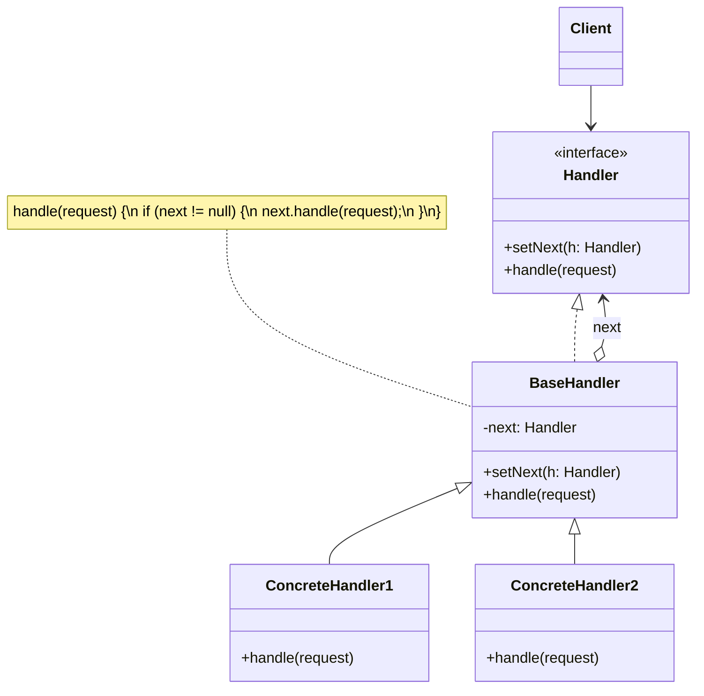

# Chain of Responsibility Pattern

> **Category:** Behavioral  
> **Intent:** Pass a request along a chain of handlers. Each handler decides to process the request or pass it to the next handler.

---

## Overview

The Chain of Responsibility pattern decouples senders of requests from their receivers by allowing multiple handlers to process the request. The request travels along a chain until a handler processes it or the chain ends.

**Key characteristics:**
- Each handler holds a reference to the next handler in the chain
- Handlers are independent — they don't know about other handlers in the chain
- The chain's composition and order can be configured at runtime
- A handler either processes the request or passes it along

---

## ❓ Problem & Solution

**The Problem:** Imagine you're working on an online ordering system. You want to restrict access to the system so only authenticated users can create orders. Also, users who have administrative permissions must have full access to all orders. 
Initially, you added these checks seamlessly. But over time, you added more and more sequential checks (e.g., passing a validation step, checking against brute-force attacks, checking if the request comes from a cached IP). The code of the checks became bloated and messy. Adding a new check or changing the order of existing checks required modifying the core code and affected other parts of the system.

**The Solution:** Like many other behavioral design patterns, the Chain of Responsibility relies on transforming particular behaviors into stand-alone objects called *handlers*. In our case, each check should be extracted to its own class with a single method that performs the check.
The pattern suggests that you link these handlers into a chain. Each linked handler has a field for storing a reference to the next handler in the chain. In addition to processing a request, handlers pass the request further along the chain. The request travels along the chain until all handlers have had a chance to process it. A handler can decide not to pass the request further down the chain and effectively stop any further processing.

---

## 🌍 Real-World Analogy

You've bought and installed a new piece of hardware on your computer, but it's not working. You call the tech support number.
First, a robotic auto-responder suggests a standard list of solutions. It doesn't help, so it connects you to a live operator. The operator provides a few more standard solutions from a manual. That doesn't work either. Finally, the operator passes your call to an engineer. The engineer knows the exact details of the hardware and tells you how to fix the issue.
This is a chain of responsibility: multiple handlers got a chance to resolve your issue before it reached the engineer who could finally solve it.

---

## 🏗️ Structure



---

## When to Use

- Multiple handlers can process a request, but the handler isn't known in advance
- You want to decouple the sender from the receiver
- The set of handlers or their order should be configurable at runtime
- You want to avoid coupling the sender to all possible receivers
- Processing should be attempted by multiple handlers in a specific order

---

## How It Works

### Customer Support Example

```java
public abstract class SupportHandler {
    private SupportHandler nextHandler;

    public SupportHandler setNext(SupportHandler next) {
        this.nextHandler = next;
        return next;  // enables chaining: a.setNext(b).setNext(c)
    }

    public void handle(SupportTicket ticket) {
        if (canHandle(ticket)) {
            process(ticket);
        } else if (nextHandler != null) {
            System.out.println(getClass().getSimpleName() + " → passing to next handler");
            nextHandler.handle(ticket);
        } else {
            System.out.println("No handler could process ticket: " + ticket.getDescription());
        }
    }

    protected abstract boolean canHandle(SupportTicket ticket);
    protected abstract void process(SupportTicket ticket);
}

public record SupportTicket(String description, int severity, String category) {
    public String getDescription() { return description; }
}

// Level 1: FAQ and basic issues
public class FrontlineSupport extends SupportHandler {
    @Override
    protected boolean canHandle(SupportTicket ticket) {
        return ticket.severity() <= 1;
    }

    @Override
    protected void process(SupportTicket ticket) {
        System.out.println("✅ Frontline resolved: " + ticket.description());
    }
}

// Level 2: Technical issues
public class TechnicalSupport extends SupportHandler {
    @Override
    protected boolean canHandle(SupportTicket ticket) {
        return ticket.severity() <= 3 && "TECHNICAL".equals(ticket.category());
    }

    @Override
    protected void process(SupportTicket ticket) {
        System.out.println("✅ Technical team resolved: " + ticket.description());
    }
}

// Level 3: Critical and billing issues
public class ManagerSupport extends SupportHandler {
    @Override
    protected boolean canHandle(SupportTicket ticket) {
        return true;  // catch-all
    }

    @Override
    protected void process(SupportTicket ticket) {
        System.out.println("✅ Manager resolved: " + ticket.description());
    }
}

// Build and use the chain
SupportHandler chain = new FrontlineSupport();
chain.setNext(new TechnicalSupport()).setNext(new ManagerSupport());

chain.handle(new SupportTicket("Password reset", 1, "ACCOUNT"));
// ✅ Frontline resolved: Password reset

chain.handle(new SupportTicket("Server crash", 3, "TECHNICAL"));
// FrontlineSupport → passing to next handler
// ✅ Technical team resolved: Server crash

chain.handle(new SupportTicket("Data breach", 5, "SECURITY"));
// FrontlineSupport → passing to next handler
// TechnicalSupport → passing to next handler
// ✅ Manager resolved: Data breach
```

### Request Processing Pipeline (All Handlers Run)

A variant where every handler in the chain gets a chance to process (like middleware):

```java
public interface Middleware {
    void handle(HttpRequest request, MiddlewareChain chain);
}

public class MiddlewareChain {
    private final List<Middleware> middlewares;
    private int index = 0;

    public MiddlewareChain(List<Middleware> middlewares) {
        this.middlewares = middlewares;
    }

    public void proceed(HttpRequest request) {
        if (index < middlewares.size()) {
            Middleware current = middlewares.get(index++);
            current.handle(request, this);
        }
    }
}

// Concrete middleware
public class AuthMiddleware implements Middleware {
    @Override
    public void handle(HttpRequest request, MiddlewareChain chain) {
        if (request.getHeader("Authorization") == null) {
            System.out.println("❌ Unauthorized — request rejected");
            return;  // don't call chain.proceed() → stops the chain
        }
        System.out.println("✅ Authenticated");
        chain.proceed(request);  // continue to next middleware
    }
}

public class LoggingMiddleware implements Middleware {
    @Override
    public void handle(HttpRequest request, MiddlewareChain chain) {
        System.out.println("📝 Logging: " + request.getMethod() + " " + request.getPath());
        chain.proceed(request);
    }
}

public class RateLimitMiddleware implements Middleware {
    @Override
    public void handle(HttpRequest request, MiddlewareChain chain) {
        System.out.println("⏱️ Rate limit check passed");
        chain.proceed(request);
    }
}

// Build the pipeline
List<Middleware> pipeline = List.of(
    new LoggingMiddleware(),
    new RateLimitMiddleware(),
    new AuthMiddleware()
);

MiddlewareChain chain = new MiddlewareChain(pipeline);
chain.proceed(request);
```

---

## Real-World Examples

| Framework/Library | Description |
|-------------------|-------------|
| Java Servlet Filters | `javax.servlet.FilterChain` — each filter calls `chain.doFilter()` |
| Spring Security Filter Chain | Authentication and authorization filters in sequence |
| Java Logging (`java.util.logging`) | Logger hierarchy — loggers pass records to parent loggers |
| Exception handling (try-catch chain) | Each catch block handles specific exception types |
| Apache Commons Chain | Library specifically for implementing CoR |

---

## Advantages & Disadvantages

| Advantages | Disadvantages |
|-----------|---------------|
| Decouples sender from receivers | Request might go unhandled if chain is incomplete |
| Handlers can be added/removed/reordered dynamically | Can be hard to debug — unclear which handler processes what |
| Each handler has a single responsibility | Potential performance overhead with long chains |
| Follows Open/Closed Principle | No guarantee of processing |

---

## Interview Questions

**Q1: What is the Chain of Responsibility pattern and how does it work?**

The Chain of Responsibility pattern passes a request through a chain of handlers until one handles it. Each handler holds a reference to the next handler and either processes the request or forwards it. This decouples the sender from the receivers and allows dynamic, configurable processing pipelines.

**Q2: How would you implement the Chain of Responsibility pattern in Java?**

Define a common abstract class or interface with a `handle()` method and a reference to the next handler. Each concrete handler checks if it can handle the request — if yes, it processes it; if no, it passes to the next handler. The client creates the chain by linking handlers, and the request enters through the first handler.

**Q3: Can you provide an example of when you would use the Chain of Responsibility pattern?**

Customer support systems where requests are escalated through levels (frontline → technical → manager). Servlet filter chains where each filter handles authentication, logging, or compression. Middleware pipelines in web frameworks (Spring Security, Express.js). Event handling in UI systems where events bubble up through container hierarchies.

**Q4: How does the Chain of Responsibility pattern promote loose coupling?**

The sender doesn't need to know which handler will process the request — it just sends to the chain. Handlers are independent and don't know about other handlers. Handlers can be added, removed, or reordered without changing the sender or other handlers. Each handler encapsulates one concern.

**Q5: What are the drawbacks of using the Chain of Responsibility pattern?**

Requests might pass through many handlers before finding the right one, causing performance overhead. Debugging is harder because the processing path isn't immediately visible. There's a risk of requests going unhandled if the chain is incomplete. The order of handlers can subtly affect behavior, and misconfigured chains can cause bugs.

---

## Advanced Editorial Pass: Chain of Responsibility in Request Pipelines

### Architectural Benefits
- Enables policy layering (auth, validation, enrichment, routing) without monolithic handlers.
- Supports incremental insertion/removal of steps in regulated or evolving workflows.
- Improves local reasoning for each policy stage when observability is strong.

### Operational Risks
- Unclear termination behavior causes dropped or double-processed requests.
- Handler ordering becomes implicit tribal knowledge.
- Retry and idempotency strategy is inconsistent across chain links.

### Review Checklist
1. Define deterministic ordering and ownership for handler registration.
2. Emit structured stage-level telemetry (start, success, failure, duration).
3. Specify default handling semantics when no handler accepts a request.

### 🔄 Relations with Other Patterns
- **[Command](./command.md), [Mediator](./mediator.md), [Observer](./observer.md), and [Chain of Responsibility](./chain-of-responsibility.md)**: These all address various ways of connecting senders and receivers of requests. CoR passes a request sequentially along a dynamic chain of potential receivers until one of them handles it.
- **[Composite](./composite.md)**: CoR is often used in conjunction with Composite. When a leaf component gets a request, it may pass it through the chain of all of its parent components down to the root of the object tree.
- **[Decorator](./decorator.md)**: Handlers in CoR can be thought of as Decorators. However, CoR handlers can stop passing the request down the chain, while Decorators are strictly an extension pattern and are not allowed to break the flow of the request.
