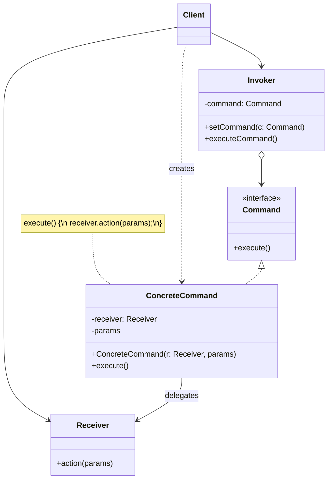

# Command Pattern

> **Category:** Behavioral    
> **Complexity:** ⭐☆☆ (1/3)  
> **Popularity:** ⭐⭐⭐ (3/3)  
> **Intent:** Encapsulate a request as an object, thereby letting you parameterize clients with different requests, queue or log requests, and support undoable operations.

---

## Overview

The Command pattern turns a request into a stand-alone object containing all information about the request. This transformation lets you pass requests as method arguments, delay or queue a request's execution, and support undo/redo operations.

**Key characteristics:**
- Encapsulates all details of an operation in a command object
- Decouples the invoker (who triggers the action) from the receiver (who performs it)
- Commands can be stored, queued, logged, and undone
- Supports macro commands (composite commands)

---

## 🎓 Learning Curve: Beginner vs. Deep Dive

### For New Learners
Think of the Command pattern like a universal remote control or a programmable smart button. When you press the button, it might turn on a light, or it might open the garage door. The button doesn't know *how* to do those things; it just knows how to say `execute()`. You program the button by giving it a "Command" object (like `TurnOnLightCommand`). The true power is that you can store these commands, put them in a list (to run a sequence of actions), or reverse them (to "undo" an action).

### Deep Dive: Java & Architecture Implications
In modern distributed systems, the Command pattern is the foundation of **Message Queues**, **Event Sourcing**, and **CQRS (Command Query Responsibility Segregation)**.
- **Serialization:** To place a Command in a Kafka topic or RabbitMQ queue, the Command object must be serializable (usually to JSON). This means the Command payload shouldn't contain heavy runtime references (like an active database connection or a UI thread). It should only contain the *state* needed to execute the request later.
- **Idempotency:** When executing commands asynchronously, networks fail. A command might be delivered twice. Deep enterprise implementations require commands to be *idempotent* (executing `ChargeCreditCardCommand` twice shouldn't charge the user twice).
- **Transactions:** Frameworks like Spring heavily utilize the Command pattern under the hood to implement `@Transactional` boundaries, treating your method call as a command that can be rolled back if an exception occurs.

---

## ❓ Problem & Solution

**The Problem:** Imagine you're working on a new text-editor app. Your current task is to create a toolbar with a bunch of buttons for various operations. You created a very neat `Button` class that can be used for buttons on the toolbar as well as for generic buttons in dialogs.
While all these buttons look similar, they're supposed to do different things. Where would you put the code for the various click handlers? The simplest solution is to create tons of subclasses for each place where the button is used. These subclasses would contain the code to be executed on a button click.
Before long, you realize this approach is flawed. First, you have an enormous number of subclasses. Second, your GUI code has become awkwardly dependent on the volatile code of the business logic.

**The Solution:** Good software design is often based on the *principle of separation of concerns*, which usually results in breaking an app into layers. The GUI layer should merely render beautiful pictures, capture input, and delegate the actual work to the business logic layer.
The Command pattern suggests that GUI objects shouldn't send requests to business logic directly. Instead, extract all of the request details—such as the object being called, the method name, and the arguments—into a separate *command* class with a single method that triggers this request.
Command objects serve as links between GUI and business logic objects. The GUI object doesn't need to know what business logic object will receive the request and how it'll be processed. The GUI just triggers the command, which handles all the details.

---

## 🌍 Real-World Analogy

After a long walk through the city, you enter a nice restaurant and sit at a table. A friendly waiter approaches you, takes your order, and writes it down on a piece of paper. The waiter goes to the kitchen and sticks the order on the wall. After a while, the chef gets to the order, reads it, and cooks the meal accordingly. The chef places the meal on a tray along with the order. The waiter checks the tray and brings you the exact meal that you ordered.
The paper order serves as a *command*. It remains in a queue until the chef is ready to serve it. The order contains all the relevant information required to cook the meal. It allows the waiter to walk around taking orders from other clients without repeatedly carrying messages back and forth.

---

## 🚀 Detailed Use Case: Asynchronous Background Jobs

**Scenario:** You are building an email marketing platform. When a user clicks "Send Campaign," the system needs to send 1,000,000 emails. If the web server tries to do this synchronously in the HTTP request thread, it will time out and crash.

**Application of Command:**
1. **Command:** You create a `SendEmailCampaignCommand(campaignId)`.
2. **Invoker:** The Web Controller receives the HTTP request and, instead of sending emails, it serializes the `SendEmailCampaignCommand` and pushes it onto a Redis queue. It immediately returns an HTTP 202 Accepted to the user.
3. **Receiver:** A pool of background worker servers acts as the Receiver. They constantly poll the Redis queue. When they pop a command, they deserialize it and call `command.execute()`, which queries the database for the campaign and begins dispatching emails in batches.

**Why it's effective here:** 
The Web Server (Invoker) is completely decoupled from the Worker Servers (Receiver). If the workers crash, the commands remain safely in the queue. You can scale the workers up or down independently based on the number of commands in the queue.

---

## 🏗️ Structure



---

## When to Use

- You need to parameterize objects with operations
- You want to queue operations, schedule their execution, or execute them remotely
- You need undo/redo functionality
- You want to log changes so they can be reapplied after a crash (transaction logging)
- You need to structure a system around high-level operations built from primitive operations

---

## How It Works

### Text Editor with Undo/Redo

```java
// Command interface
public interface Command {
    void execute();
    void undo();
    String getDescription();
}

// Receiver
public class TextDocument {
    private final StringBuilder content = new StringBuilder();

    public void insertText(int position, String text) {
        content.insert(position, text);
    }

    public void deleteText(int position, int length) {
        content.delete(position, position + length);
    }

    public String getContent() {
        return content.toString();
    }

    @Override
    public String toString() {
        return content.toString();
    }
}

// Concrete commands
public class InsertTextCommand implements Command {
    private final TextDocument document;
    private final int position;
    private final String text;

    public InsertTextCommand(TextDocument document, int position, String text) {
        this.document = document;
        this.position = position;
        this.text = text;
    }

    @Override
    public void execute() {
        document.insertText(position, text);
    }

    @Override
    public void undo() {
        document.deleteText(position, text.length());
    }

    @Override
    public String getDescription() {
        return "Insert '" + text + "' at position " + position;
    }
}

public class DeleteTextCommand implements Command {
    private final TextDocument document;
    private final int position;
    private final int length;
    private String deletedText;  // saved for undo

    public DeleteTextCommand(TextDocument document, int position, int length) {
        this.document = document;
        this.position = position;
        this.length = length;
    }

    @Override
    public void execute() {
        deletedText = document.getContent().substring(position, position + length);
        document.deleteText(position, length);
    }

    @Override
    public void undo() {
        document.insertText(position, deletedText);
    }

    @Override
    public String getDescription() {
        return "Delete " + length + " chars at position " + position;
    }
}
```

### Invoker — Command History Manager

```java
public class CommandHistory {
    private final Deque<Command> undoStack = new ArrayDeque<>();
    private final Deque<Command> redoStack = new ArrayDeque<>();

    public void executeCommand(Command command) {
        command.execute();
        undoStack.push(command);
        redoStack.clear();  // new command invalidates redo history
        System.out.println("Executed: " + command.getDescription());
    }

    public void undo() {
        if (undoStack.isEmpty()) {
            System.out.println("Nothing to undo");
            return;
        }
        Command command = undoStack.pop();
        command.undo();
        redoStack.push(command);
        System.out.println("Undone: " + command.getDescription());
    }

    public void redo() {
        if (redoStack.isEmpty()) {
            System.out.println("Nothing to redo");
            return;
        }
        Command command = redoStack.pop();
        command.execute();
        undoStack.push(command);
        System.out.println("Redone: " + command.getDescription());
    }
}
```

### Client Usage

```java
TextDocument doc = new TextDocument();
CommandHistory history = new CommandHistory();

history.executeCommand(new InsertTextCommand(doc, 0, "Hello"));
// Executed: Insert 'Hello' at position 0
// Document: "Hello"

history.executeCommand(new InsertTextCommand(doc, 5, " World"));
// Executed: Insert ' World' at position 5
// Document: "Hello World"

history.executeCommand(new DeleteTextCommand(doc, 5, 6));
// Executed: Delete 6 chars at position 5
// Document: "Hello"

history.undo();
// Undone: Delete 6 chars at position 5
// Document: "Hello World"

history.undo();
// Undone: Insert ' World' at position 5
// Document: "Hello"

history.redo();
// Redone: Insert ' World' at position 5
// Document: "Hello World"
```

### Macro Command (Composite Command)

```java
public class MacroCommand implements Command {
    private final String name;
    private final List<Command> commands;

    public MacroCommand(String name, List<Command> commands) {
        this.name = name;
        this.commands = new ArrayList<>(commands);
    }

    @Override
    public void execute() {
        for (Command cmd : commands) {
            cmd.execute();
        }
    }

    @Override
    public void undo() {
        // Undo in reverse order
        ListIterator<Command> it = commands.listIterator(commands.size());
        while (it.hasPrevious()) {
            it.previous().undo();
        }
    }

    @Override
    public String getDescription() {
        return "Macro: " + name + " (" + commands.size() + " commands)";
    }
}

// Usage — "Replace All" as a macro
Command replaceAll = new MacroCommand("Replace 'foo' with 'bar'", List.of(
    new DeleteTextCommand(doc, 10, 3),
    new InsertTextCommand(doc, 10, "bar")
));

history.executeCommand(replaceAll);
history.undo();  // undoes the entire replacement
```

---

## Real-World Examples

| Framework/Library | Description |
|-------------------|-------------|
| `java.lang.Runnable` | Encapsulates an action to run in a thread |
| `javax.swing.Action` | Encapsulates UI actions (button clicks, menu items) |
| Spring `@Transactional` | Transaction management wraps commands with commit/rollback |
| CQRS (Command Query Responsibility Segregation) | Architectural pattern using commands and queries |
| Java `CompletableFuture` | Commands that can be composed and executed asynchronously |

---

## Advantages & Disadvantages

| Advantages | Disadvantages |
|-----------|---------------|
| Decouples invoker from receiver | Can proliferate many small command classes |
| Supports undo/redo | Complex undo logic for stateful operations |
| Commands can be queued, logged, serialized | Memory overhead for command history |
| Supports macro/composite commands | Indirect execution is harder to debug |

---

## ⭐ Best Practices

**Dos:**
- **Keep Commands Lightweight:** Commands should ideally contain only the parameters needed to execute the action, not the heavy execution logic itself. Delegate the actual heavy lifting to a Receiver object (like a Service class).
- **Implement Idempotency:** If your commands are queued or retried, ensure that `execute()` is idempotent to prevent unintended side effects (like double-billing).

**Don'ts:**
- **Don't use for simple method calls:** If you are simply calling `userService.deleteUser(id)` synchronously within the same thread and don't need undo, logging, or queuing, wrapping it in a `DeleteUserCommand` is unnecessary boilerplate.
- **Don't put UI logic in Commands:** A Command should be pure business logic. If it needs to update the UI upon completion, it should return a result or fire an event that the UI listens to, rather than holding a reference to a UI component.

---

## Interview Questions

**Q1: What is the Command pattern and what problem does it solve?**

The Command pattern encapsulates a request as an object, separating the object that invokes the operation from the one that knows how to perform it. This enables parameterization of actions, queuing, logging, and undo/redo. Without it, the invoker must know directly about the receiver and its methods, creating tight coupling.

**Q2: How would you implement undo/redo using the Command pattern?**

Each command implements `execute()` and `undo()` methods. The `undo()` method reverses the effect of `execute()`. An invoker maintains an undo stack and a redo stack. When a command executes, it's pushed onto the undo stack and the redo stack is cleared. Undo pops from the undo stack, calls `undo()`, and pushes to the redo stack. Redo does the reverse.

**Q3: What are the key components of the Command pattern?**

**Command** — interface declaring `execute()`. **ConcreteCommand** — implements the interface and holds a reference to the receiver. **Receiver** — the object that performs the actual work. **Invoker** — triggers the command (doesn't know about the receiver). **Client** — creates concrete commands and configures the invoker.

**Q4: How does the Command pattern relate to CQRS?**

CQRS (Command Query Responsibility Segregation) separates read operations (queries) from write operations (commands) into different models. The Command pattern underpins the "command" side — write operations are encapsulated as command objects that can be validated, queued, logged, and processed asynchronously. This scales well for event-sourced systems.

**Q5: How is `Runnable` an example of the Command pattern?**

`Runnable` is a command interface with a single method (`run()`). When you create a `Runnable` and pass it to a `Thread` or `ExecutorService`, you're encapsulating an action as an object and giving it to an invoker. The invoker (thread pool) doesn't know what the action does — it just calls `run()`. This is the Command pattern in its simplest form.

---

## Advanced Editorial Pass: Command as a Reliability Primitive

### Strategic Value
- Commands decouple intention capture from execution timing and location.
- They support retries, auditability, deduplication, and deferred processing workflows.
- They create a natural seam for queueing, scheduling, and transactional outbox patterns.

### Advanced Trade-offs
- Serializing commands can freeze unstable domain models into long-lived contracts.
- Undo semantics are often domain-specific compensations, not simple inverse operations.
- Overuse can fragment simple synchronous flows into unnecessary orchestration.

### Implementation Heuristics
1. Treat command payloads as explicit contracts with versioning.
2. Attach idempotency keys where execution can be retried.
3. Keep handlers side-effect explicit and telemetry-rich.

### 🔄 Relations with Other Patterns
- **[Chain of Responsibility](./chain-of-responsibility.md), [Command](./command.md), [Mediator](./mediator.md), and [Observer](./observer.md)**: These all connect senders and receivers of requests differently. Command establishes a unidirectional connection between a sender and a receiver.
- **[Memento](./memento.md)**: You can use Memento along with Command to implement "undo". In this case, commands are responsible for performing various operations over a target object, while mementos save the state of that object just before a command gets executed.
- **[Strategy](./strategy.md)**: Command and Strategy may look similar because you can use both to parameterize an object with some action. However, Strategy usually defines different ways of doing the *same* thing, while Command converts *any* operation into an object.
- **[Prototype](./prototype.md)**: Prototype can help when you need to save copies of Commands into history.
