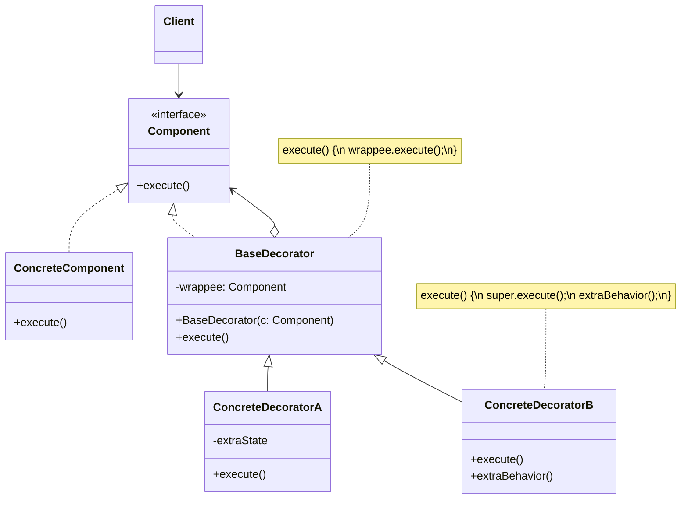

# Decorator Pattern

> **Category:** Structural  
> **Intent:** Attach additional responsibilities to an object dynamically, providing a flexible alternative to subclassing for extending functionality.

---

## Overview

The Decorator pattern wraps an object with additional behavior without modifying the original class. Decorators implement the same interface as the object they wrap, adding behavior before or after delegating to the wrapped object. Multiple decorators can be stacked.

**Key characteristics:**
- Same interface as the wrapped object (transparent to the client)
- Adds behavior dynamically at runtime, not compile-time
- Decorators can be composed/stacked in any combination
- Each decorator is responsible for one concern (Single Responsibility)

---

## 🎓 Learning Curve: Beginner vs. Deep Dive

### For New Learners
Think of the Decorator pattern like adding accessories to your car. You buy a basic car (the Component). Then you add a spoiler, a premium sound system, and tinted windows. Each accessory (the Decorator) wraps the car and adds a new feature, but underneath, it's still the exact same car, and it still drives exactly the same way. In programming, instead of making a massive `CarWithSpoilerAndTintAndPremiumSound` class, you make small `SpoilerDecorator` and `TintDecorator` classes, and stack them on top of the base object.

### Deep Dive: Java & Architecture Implications
In the Java ecosystem, the Decorator pattern is famously the backbone of the entire `java.io` package (`BufferedReader` wraps an `InputStreamReader` which wraps a `FileInputStream`).
- **Object Identity:** When you wrap an object in a decorator, the resulting object has a completely different object identity (`wrapper != original`). If your system relies on exact object equality (like putting objects in a `HashSet`), decorators can cause subtle bugs.
- **Megamorphic Call Sites:** Because decorators rely on deep interface dispatch, highly stacked decorators can sometimes confuse the JVM's Just-In-Time (JIT) compiler, leading to megamorphic call sites that prevent method inlining. However, the performance impact is usually negligible unless you are doing high-frequency algorithmic trading.

---

## ❓ Problem & Solution

**The Problem:** Imagine you're working on a notification library which lets other programs notify their users about important events. The initial version was based on a `Notifier` class with a single `send()` method that sent email notifications. Later, users demanded SMS, Facebook, and Slack notification support. You could create new subclasses for each (`SMSNotifier`, `FacebookNotifier`), but what if a user wants to be notified via SMS *and* Email simultaneously? Creating special subclasses to combine every possible notification method would cause the class hierarchy to quickly bloat to immense proportions.

**The Solution:** Inheritance is static and limits subclasses to a single parent. Instead, use *Composition* — one object holds a reference to another and delegates some work to it. The Decorator pattern is built on this. A "decorator" (or wrapper) is an object that links with a target object, implements the same interface, and delegates requests to the target. However, the wrapper can alter the result by doing something either before or after passing the request to the target object. You can stack these wrappers on top of each other recursively to combine multiple behaviors at runtime.

---

## 🌍 Real-World Analogy

Wearing clothes is a perfect example of using decorators. When you're cold, you wrap yourself in a sweater. If it's still cold, you can wear a jacket on top. If it's raining, you can put on a raincoat. All of these garments "extend" your basic behavior but aren't part of you physically. You can easily put on or take off any piece of clothing whenever you need. The outer garments also seamlessly delegate basic physical tasks (like walking) back to you!

---

## 🚀 Detailed Use Case: HTTP Client Resilience

**Scenario:** You have an `HttpClient` that makes requests to a third-party API. The API is flaky, so you need to add retry logic. It's also slow, so you need to add caching. And you need to log every request for compliance.

**Application of Decorator:**
Instead of bloating the `HttpClient` with retries, caching, and logging:
1. You have a `BaseHttpClient` that implements `HttpClient` and actually makes the network call.
2. You create a `LoggingHttpClient` decorator that logs the request, then delegates to the wrapped client.
3. You create a `RetryHttpClient` decorator that delegates to the wrapped client inside a try-catch loop.
4. You create a `CachingHttpClient` decorator that checks a cache first, and if missed, delegates to the wrapped client.

**Why it's effective here:** 
You can dynamically assemble the exact client you need at startup: `new LoggingHttpClient(new CachingHttpClient(new RetryHttpClient(new BaseHttpClient())))`. If a specific background job doesn't need caching, you simply omit that decorator. No subclasses required.

---

## 🏗️ Structure



---

## When to Use

- You need to add behavior to individual objects without affecting others of the same class
- Extending functionality through subclassing would lead to a class explosion
- Responsibilities need to be added or removed at runtime
- You want to combine multiple behaviors in different combinations

---

## How It Works

### Coffee Shop Example

```java
// Component interface
public interface Coffee {
    String getDescription();
    double getCost();
}

// Base component
public class SimpleCoffee implements Coffee {
    @Override public String getDescription() { return "Simple Coffee"; }
    @Override public double getCost() { return 2.00; }
}

public class Espresso implements Coffee {
    @Override public String getDescription() { return "Espresso"; }
    @Override public double getCost() { return 3.00; }
}

// Abstract decorator — implements the same interface, wraps a component
public abstract class CoffeeDecorator implements Coffee {
    protected final Coffee decoratedCoffee;

    public CoffeeDecorator(Coffee coffee) {
        this.decoratedCoffee = coffee;
    }

    @Override
    public String getDescription() { return decoratedCoffee.getDescription(); }

    @Override
    public double getCost() { return decoratedCoffee.getCost(); }
}

// Concrete decorators
public class MilkDecorator extends CoffeeDecorator {
    public MilkDecorator(Coffee coffee) { super(coffee); }

    @Override
    public String getDescription() {
        return decoratedCoffee.getDescription() + ", Milk";
    }

    @Override
    public double getCost() {
        return decoratedCoffee.getCost() + 0.50;
    }
}

public class SugarDecorator extends CoffeeDecorator {
    public SugarDecorator(Coffee coffee) { super(coffee); }

    @Override
    public String getDescription() {
        return decoratedCoffee.getDescription() + ", Sugar";
    }

    @Override
    public double getCost() {
        return decoratedCoffee.getCost() + 0.25;
    }
}

public class WhippedCreamDecorator extends CoffeeDecorator {
    public WhippedCreamDecorator(Coffee coffee) { super(coffee); }

    @Override
    public String getDescription() {
        return decoratedCoffee.getDescription() + ", Whipped Cream";
    }

    @Override
    public double getCost() {
        return decoratedCoffee.getCost() + 0.75;
    }
}

// Usage — stack decorators dynamically
Coffee coffee = new SimpleCoffee();
coffee = new MilkDecorator(coffee);
coffee = new SugarDecorator(coffee);
coffee = new WhippedCreamDecorator(coffee);

System.out.println(coffee.getDescription());
// Simple Coffee, Milk, Sugar, Whipped Cream
System.out.println("$" + coffee.getCost());
// $3.50

// Different combination
Coffee espresso = new WhippedCreamDecorator(new MilkDecorator(new Espresso()));
System.out.println(espresso.getDescription());  // Espresso, Milk, Whipped Cream
System.out.println("$" + espresso.getCost());   // $4.25
```

### Data Stream Example (Closer to Java I/O)

```java
public interface DataStream {
    void write(String data);
    String read();
}

public class FileDataStream implements DataStream {
    private String content = "";

    @Override
    public void write(String data) {
        this.content = data;
        System.out.println("Writing to file: " + data);
    }

    @Override
    public String read() { return content; }
}

public class EncryptionDecorator implements DataStream {
    private final DataStream wrapped;

    public EncryptionDecorator(DataStream stream) { this.wrapped = stream; }

    @Override
    public void write(String data) {
        String encrypted = encrypt(data);
        System.out.println("Encrypting data...");
        wrapped.write(encrypted);
    }

    @Override
    public String read() {
        return decrypt(wrapped.read());
    }

    private String encrypt(String data) {
        return Base64.getEncoder().encodeToString(data.getBytes());
    }

    private String decrypt(String data) {
        return new String(Base64.getDecoder().decode(data));
    }
}

public class CompressionDecorator implements DataStream {
    private final DataStream wrapped;

    public CompressionDecorator(DataStream stream) { this.wrapped = stream; }

    @Override
    public void write(String data) {
        System.out.println("Compressing data...");
        wrapped.write("[compressed]" + data);  // simplified
    }

    @Override
    public String read() {
        String data = wrapped.read();
        return data.replace("[compressed]", "");
    }
}

// Usage — combine behaviors
DataStream stream = new CompressionDecorator(
    new EncryptionDecorator(
        new FileDataStream()
    )
);
stream.write("Sensitive data");
// Compressing data...
// Encrypting data...
// Writing to file: [compressed]U2Vuc2l0aXZlIGRhdGA=
```

---

## Java I/O — The Classic Decorator Example

Java's I/O library is built on the Decorator pattern:

```java
// Base stream
InputStream fileStream = new FileInputStream("data.txt");

// Add buffering (decorator)
InputStream buffered = new BufferedInputStream(fileStream);

// Add decompression (decorator)
InputStream decompressed = new GZIPInputStream(buffered);

// Or chain them
InputStream stream = new GZIPInputStream(
    new BufferedInputStream(
        new FileInputStream("archive.gz")
    )
);
```

Each wrapper adds functionality while preserving the `InputStream` interface.

---

## Decorator vs Inheritance vs Proxy

| Aspect | Decorator | Inheritance | Proxy |
|--------|-----------|-------------|-------|
| **When** | Runtime | Compile-time | Runtime |
| **Purpose** | Add behavior | Extend class | Control access |
| **Interface** | Same as wrapped | New subclass | Same as wrapped |
| **Scope** | Individual objects | Entire class | Individual objects |
| **Flexibility** | Combine freely | Fixed hierarchy | Single wrapper |
| **Stacking** | ✅ Multiple decorators | ❌ One parent chain | Usually ❌ |

---

## Advantages & Disadvantages

| Advantages | Disadvantages |
|-----------|---------------|
| Add/remove behavior at runtime | Stacked decorators can be hard to debug |
| Combine behaviors in any order | Many small decorator classes |
| Follows Open/Closed Principle | Order of wrapping can matter |
| Follows Single Responsibility | Object identity changes with each wrap |
| Avoids deep inheritance hierarchies | |

---

## ⭐ Best Practices

**Dos:**
- **Keep interfaces small:** Decorators must implement the interface of the object they wrap. If the interface has 50 methods, writing a decorator becomes an agonizing exercise in boilerplate. The Decorator pattern shines best with single-method or small interfaces (like `Runnable` or `Filter`).
- **Use for Cross-Cutting Concerns:** Decorators are perfect for adding logging, caching, transaction management, or resilience patterns to existing domain logic.

**Don'ts:**
- **Don't depend on specific decorator types:** Client code should only rely on the base interface, never on the specific Decorator class. If you find yourself casting a decorated object to `MilkDecorator` to access a specific method, you've broken the pattern.
- **Don't overuse:** If you are permanently combining the same 3 decorators everywhere in your codebase, it might be cleaner to just bake those features into the base class or use a Builder/Factory to orchestrate them instead of manually wrapping them everywhere.

---

## Interview Questions

**Q1: What is the Decorator pattern and how does it differ from inheritance?**

The Decorator pattern adds functionality to objects dynamically by wrapping them with new behavior. It differs from inheritance because it extends behavior at runtime (not compile-time), doesn't require modifying the original class, and enhances specific objects individually rather than an entire class. You can stack multiple decorators for different combinations; inheritance provides only a fixed hierarchy.

**Q2: How would you implement the Decorator pattern in Java?**

Create a common interface (e.g., `Coffee`). Create concrete classes implementing it (e.g., `SimpleCoffee`). Create an abstract decorator class that implements the same interface and holds a reference to a component. Concrete decorators extend the abstract decorator, calling the wrapped object's method and adding behavior before or after. This allows dynamic, stackable enhancement.

**Q3: What are the advantages of using the Decorator pattern for extending behavior?**

Dynamic runtime enhancement without altering original classes. Flexible combinations by stacking decorators in any order. Avoids the complexity of deep inheritance hierarchies. Each decorator is responsible for one concern (SRP). New behaviors can be added without modifying existing code (OCP).

**Q4: Can you provide a real-world example of the Decorator pattern?**

Java I/O streams: `new BufferedReader(new InputStreamReader(new FileInputStream("file.txt")))`. Each wrapper adds a layer — `FileInputStream` reads bytes, `InputStreamReader` converts to characters, `BufferedReader` adds buffering. Each preserves the `Reader` interface while adding behavior. The coffee ordering system (base coffee + optional add-ons) is another common example.

**Q5: How does the Decorator pattern promote flexibility in extending object behavior?**

It allows behavior to be added or removed at runtime without modifying the original object or creating subclasses. By layering decorators, you create a wide range of behavior combinations from a small set of classes. This avoids the rigidity of inheritance hierarchies and enables per-object customization.

---

## Advanced Editorial Pass: Decorator for Cross-Cutting Behavior

### High-Leverage Scenarios
- You need feature stacking (caching, metrics, tracing, retries) around stable interfaces.
- Behavior combinations must be configured per use case without subclass explosion.
- Runtime composition is required by deployment profile or tenant policy.

### Risks to Manage
- Deep decorator chains obscure execution order and failure origin.
- Hidden latency costs accumulate across wrappers.
- Side-effect decorators can violate expectations of idempotent base operations.

### Practical Checklist
1. Document ordering constraints for behavior wrappers.
2. Expose composition in diagnostics so runtime stacks are inspectable.
3. Keep each decorator single-purpose and measurable.

### 🔄 Relations with Other Patterns
- **[Adapter](./adapter.md)**: Adapter changes the interface of an existing object, while Decorator enhances an object without changing its interface. Support for recursive composition is possible with Decorator but not pure Adapters.
- **[Composite](./composite.md)**: Decorator can be viewed as a degenerate Composite with only one child component. However, Decorator adds additional responsibilities to the wrapped object, while a Composite just "sums up" its children's results.
- **[Chain of Responsibility](./chain-of-responsibility.md)**: Stacks of Decorators resemble Chains of Responsibility. But there are crucial differences: CoR handlers can execute arbitrary operations and can stop passing the request down the chain; Decorators just extending behavior must pass the request down the stack.
- **[Proxy](./proxy.md)**: Both Proxy and Decorator have similar structures based on composition. The difference is that a Proxy usually manages the lifecycle of its service object on its own, whereas the composition of Decorators is always controlled by the client.
- **[Strategy](./strategy.md)**: Decorator lets you change the skin of an object (adding things to the outside), while Strategy lets you change the guts (altering inner workings).
