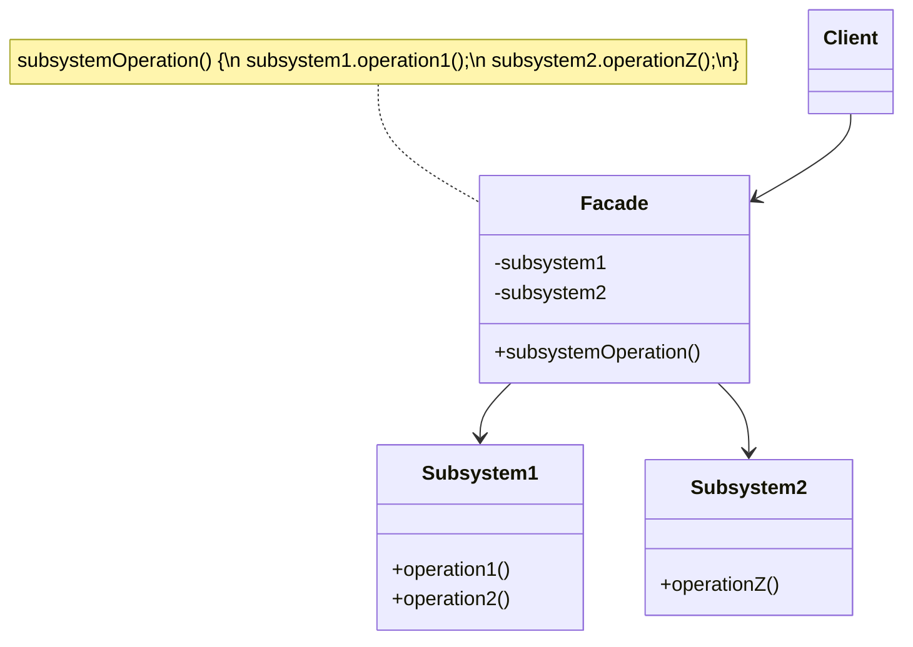

# Facade Pattern

> **Category:** Structural  
> **Intent:** Provide a simplified, unified interface to a complex subsystem.

---

## Overview

The Facade pattern provides a single class with a simplified interface that hides the complexity of an underlying subsystem. Instead of requiring clients to interact with multiple subsystem classes, the facade offers high-level methods that orchestrate the subsystem internally.

**Key characteristics:**
- A single entry point for a complex subsystem
- Clients use the facade; the subsystem classes remain accessible if needed
- Does not add new functionality — it simply organizes and simplifies access

---

## 🎓 Learning Curve: Beginner vs. Deep Dive

### For New Learners
Think of the Facade pattern like the steering wheel, pedals, and gear shifter in a car. Under the hood, driving a car is incredibly complex involving fuel injection, spark plugs, alternators, and transmission gears. But as a driver, you don't interact with any of that directly. The steering wheel and pedals provide a "facade" — a simple interface that hides all the terrifying mechanical complexity. In programming, a Facade is a single class that provides a few simple methods, hiding a messy subsystem of dozens of interacting classes.

### Deep Dive: Java & Architecture Implications
In enterprise applications, Facades are heavily utilized at architectural boundaries, particularly in **Service-Oriented Architecture (SOA)** and **Microservices**.
- **Controller/Service Layering:** In a Spring Boot app, the `@RestController` acts as a facade over the `@Service` layer. The service layer acts as a facade over various Repositories, external API clients, and business rules.
- **Statelessness:** A good Facade is almost always completely stateless. It does not hold state about the operations it orchestrates; it simply delegates method calls. This allows Facades to be safe Singletons.
- **Anti-Corruption Layer:** When dealing with legacy systems or deeply complex third-party SDKs (like an AWS SDK), wrapping it in a Facade acts as an Anti-Corruption Layer, ensuring your core business logic isn't polluted by the SDK's weird data structures or exceptions.

---

## ❓ Problem & Solution

**The Problem:** Imagine that you must make your code work with a broad set of objects that belong to a sophisticated library or framework. Ordinarily, you'd need to initialize all of those objects, keep track of dependencies, execute methods in the correct order, and so on. As a result, the business logic of your classes would become tightly coupled to the implementation details of third-party classes, making it hard to comprehend and maintain.

**The Solution:** A facade is a class that provides a simple interface to a complex subsystem which contains lots of moving parts. A facade might provide limited functionality in comparison to working with the subsystem directly. However, it includes only those features that clients really care about. Having a facade is handy when you need to integrate your app with a sophisticated library that has dozens of features, but you just need a tiny bit of its functionality.

---

## 🌍 Real-World Analogy

When you call a shop to place a phone order, an operator is your facade to all services and departments of the shop. The operator provides you with a simple voice interface to the ordering system, payment gateways, and various delivery services. You don't need to navigate the internal complexities of the store; you just talk to the operator.

---

## 🚀 Detailed Use Case: Video Conversion Library

**Scenario:** You are building an app that lets users upload a video and convert it to MP4. You import a powerful open-source C++ video processing library via JNI. The library requires you to initialize an `AudioCodec`, a `VideoCodec`, a `BitrateCalculator`, a `FrameReader`, a `Multiplexer`, and a `FileWriter`, and call them in exactly the right order.

**Application of Facade:**
If you put all this initialization logic directly into your UI controller, the controller becomes massive and impossible to test.
Instead, you create a `VideoConverterFacade`:
```java
public class VideoConverterFacade {
    public File convert(String filename, String format) {
        VideoFile file = new VideoFile(filename);
        Codec sourceCodec = CodecFactory.extract(file);
        Codec destinationCodec = new MPEG4CompressionCodec();
        VideoBuffer buffer = BitrateReader.read(file, sourceCodec);
        VideoBuffer result = BitrateReader.convert(buffer, destinationCodec);
        File finalFile = (new AudioMixer()).fix(result);
        return finalFile;
    }
}
```

**Why it's effective here:** 
The rest of your application just calls `converter.convert("holiday.avi", "mp4")`. If the video library updates to a new version and changes how `BitrateReader` works, you only have to update the `VideoConverterFacade` class. The rest of your application remains untouched.

---

## 🏗️ Structure



---

## When to Use

- A subsystem has many classes and complex interactions
- You want to reduce coupling between client code and the subsystem
- Wrapping a complex library or legacy code with a cleaner API
- Providing a simple default interface while keeping advanced options accessible
- Layering a system (each layer provides a facade to the layer below)

---

## How It Works

### E-Commerce Order Processing

```java
// ── Complex subsystem classes ──

public class InventoryService {
    public boolean checkStock(String productId) {
        System.out.println("Checking stock for product: " + productId);
        return true;  // simplified
    }

    public void reserveStock(String productId, int quantity) {
        System.out.println("Reserved " + quantity + "x " + productId);
    }
}

public class PaymentService {
    public boolean validatePaymentMethod(String paymentMethod) {
        System.out.println("Validating payment method: " + paymentMethod);
        return true;
    }

    public String processPayment(String orderId, double amount, String paymentMethod) {
        System.out.println("Processing $" + amount + " payment for order " + orderId);
        return "TXN-" + orderId;
    }
}

public class ShippingService {
    public double calculateShipping(String address, double weight) {
        System.out.println("Calculating shipping to: " + address);
        return 9.99;
    }

    public String createShipment(String orderId, String address) {
        System.out.println("Creating shipment for order " + orderId);
        return "TRACK-" + orderId;
    }
}

public class NotificationService {
    public void sendOrderConfirmation(String email, String orderId, String trackingId) {
        System.out.println("Sending confirmation to " + email + " — Order: " + orderId + ", Tracking: " + trackingId);
    }
}

// ── Facade — simplified interface ──

public class OrderFacade {
    private final InventoryService inventory;
    private final PaymentService payment;
    private final ShippingService shipping;
    private final NotificationService notifications;

    public OrderFacade() {
        this.inventory = new InventoryService();
        this.payment = new PaymentService();
        this.shipping = new ShippingService();
        this.notifications = new NotificationService();
    }

    /**
     * One method replaces a multi-step orchestration across 4 services.
     */
    public String placeOrder(String productId, int quantity, String paymentMethod,
                             String address, String email) {
        // Step 1: Check inventory
        if (!inventory.checkStock(productId)) {
            throw new RuntimeException("Product " + productId + " is out of stock");
        }
        inventory.reserveStock(productId, quantity);

        // Step 2: Process payment
        if (!payment.validatePaymentMethod(paymentMethod)) {
            throw new RuntimeException("Invalid payment method");
        }
        double amount = quantity * 29.99;  // simplified pricing
        String transactionId = payment.processPayment("ORD-001", amount, paymentMethod);

        // Step 3: Arrange shipping
        String trackingId = shipping.createShipment("ORD-001", address);

        // Step 4: Notify customer
        notifications.sendOrderConfirmation(email, "ORD-001", trackingId);

        return trackingId;
    }
}

// ── Client — interacts with one simple method ──
OrderFacade facade = new OrderFacade();
String tracking = facade.placeOrder("PROD-42", 2, "CREDIT_CARD",
    "123 Main St, City", "customer@email.com");
```

### Home Theater Example

```java
public class HomeFacade {
    private final TV tv;
    private final SoundSystem sound;
    private final StreamingService streaming;
    private final Lights lights;

    public HomeFacade(TV tv, SoundSystem sound, StreamingService streaming, Lights lights) {
        this.tv = tv;
        this.sound = sound;
        this.streaming = streaming;
        this.lights = lights;
    }

    public void watchMovie(String movie) {
        lights.dim(20);
        tv.turnOn();
        tv.setInput("HDMI1");
        sound.turnOn();
        sound.setMode("SURROUND");
        sound.setVolume(50);
        streaming.login();
        streaming.play(movie);
    }

    public void endMovie() {
        streaming.stop();
        sound.turnOff();
        tv.turnOff();
        lights.dim(100);
    }
}

// Client: one call instead of 8
facade.watchMovie("Inception");
```

---

## Facade vs Adapter

| Aspect | Facade | Adapter |
|--------|--------|---------|
| **Purpose** | Simplify a complex API | Make incompatible interfaces compatible |
| **Direction** | Creates a new, simpler interface | Translates between existing interfaces |
| **Scope** | Wraps an entire subsystem | Wraps a single class |
| **Knowledge** | Knows the subsystem's internals | Knows only the adaptee |

---

## Advantages & Disadvantages

| Advantages | Disadvantages |
|-----------|---------------|
| Reduces complexity for clients | Can become a "god object" if it grows too large |
| Promotes loose coupling | Hides subsystem details — can mask performance issues |
| Provides a clear entry point | Oversimplification may limit access to advanced features |
| Easy to add layers of abstraction | Facade changes when subsystem changes |
| Simplifies testing for clients | |

---

## ⭐ Best Practices

**Dos:**
- **Create multiple Facades:** If a single Facade class starts growing too large and handling too many unrelated tasks, it is becoming a "God Object." Split it into multiple, smaller, domain-specific facades (e.g., `OrderFacade`, `UserFacade`).
- **Keep Subsystems accessible:** A Facade should be an *optional* convenience. Do not artificially hide the subsystem classes from power users who might need to bypass the facade for advanced, low-level tweaking.

**Don'ts:**
- **Don't add business logic to the Facade:** The Facade's only job is orchestration and delegation. If you find yourself writing massive `if/else` business rules or complex calculations inside the Facade, you are violating the pattern. That logic belongs in the subsystem classes.
- **Don't confuse with Adapter:** An Adapter changes the interface of an object to make it compatible with something else. A Facade simply provides a *cleaner* or *simpler* interface to an entire subsystem.

---

## Interview Questions

**Q1: What is the Facade pattern and how does it simplify interactions with complex systems?**

The Facade pattern provides a simplified, unified interface to a complex subsystem of classes. It hides internal complexity behind a single interface, reducing the number of objects and interactions clients need to manage. Clients call one facade method instead of orchestrating multiple subsystem calls, making the code cleaner and more maintainable.

**Q2: How does the Facade pattern differ from the Adapter pattern?**

The Facade creates a new, simpler interface to reduce complexity — it wraps an entire subsystem. The Adapter translates one interface into another to make incompatible classes work together — it wraps a single class. Facade simplifies; Adapter enables compatibility.

**Q3: Can you provide an example of how to implement the Facade pattern in Java?**

An e-commerce order processing system with separate services for inventory, payment, shipping, and notifications. The `OrderFacade` provides a single `placeOrder()` method that internally checks stock, processes payment, arranges shipping, and sends confirmation. The client makes one call instead of coordinating four separate services.

**Q4: What are the advantages of using the Facade pattern in large applications?**

Reduced complexity — clear, high-level interface for clients. Loose coupling — clients don't depend on subsystem classes directly. Easier maintenance — subsystem changes don't ripple to client code. Improved testability — mock the facade instead of multiple subsystem classes. Clear system layering — each layer provides a facade to the layer below.

**Q5: In what situations would using the Facade pattern be a bad idea?**

When clients need direct, fine-grained access to subsystem features that the facade doesn't expose. When the facade becomes a "god class" that does too much. When hiding the subsystem masks important performance characteristics. When the overhead of maintaining the facade (keeping it in sync with subsystem changes) outweighs the simplification benefit.

---

## Advanced Editorial Pass: Facade as an Anti-Coupling Layer

### Strategic Benefits
- Reduces client coupling to subsystem churn and sequencing complexity.
- Creates a stable capability-oriented API for product teams.
- Improves migration safety by centralizing integration orchestration.

### Failure Modes
- Facade evolves into a god object with broad hidden logic.
- Teams bypass facade for convenience, fragmenting integration contracts.
- Facade error model becomes too generic to support good recovery decisions.

### Senior Engineering Heuristics
1. Keep facade methods aligned to business capabilities, not subsystem endpoints.
2. Preserve meaningful domain errors; do not over-flatten failure information.
3. Track bypass rates and enforce architecture boundaries where needed.

### 🔄 Relations with Other Patterns
- **[Adapter](./adapter.md)**: Facade defines a new interface for existing objects, whereas Adapter tries to make the existing interface usable for a specific client. Facade wraps an entire subsystem; Adapter wraps a single object.
- **[Abstract Factory](./abstract-factory.md)**: Abstract Factory can serve as an alternative to Facade when you just want to hide the way subsystem objects are created from the client code.
- **[Flyweight](./flyweight.md)**: Flyweight shows how to make lots of little objects, whereas Facade shows how to make a single object that represents an entire subsystem.
- **[Mediator](./mediator.md)**: Facade and Mediator have similar jobs: they try to organize collaboration between lots of tightly coupled classes. Facade defines a simplified interface to a subsystem, but it doesn't introduce new functionality, and the subsystem itself is unaware of the facade. Mediator centralizes communication between components, and the components only know about the mediator, not each other.
- **[Singleton](./singleton.md)**: A Facade class can often be transformed into a Singleton since a single facade object representing a subsystem is usually sufficient.
- **[Proxy](./proxy.md)**: Proxy and Facade both act as a buffer between a complex entity and the client. Proxy provides the same interface as its service object, while Facade provides a different, simplified interface.
