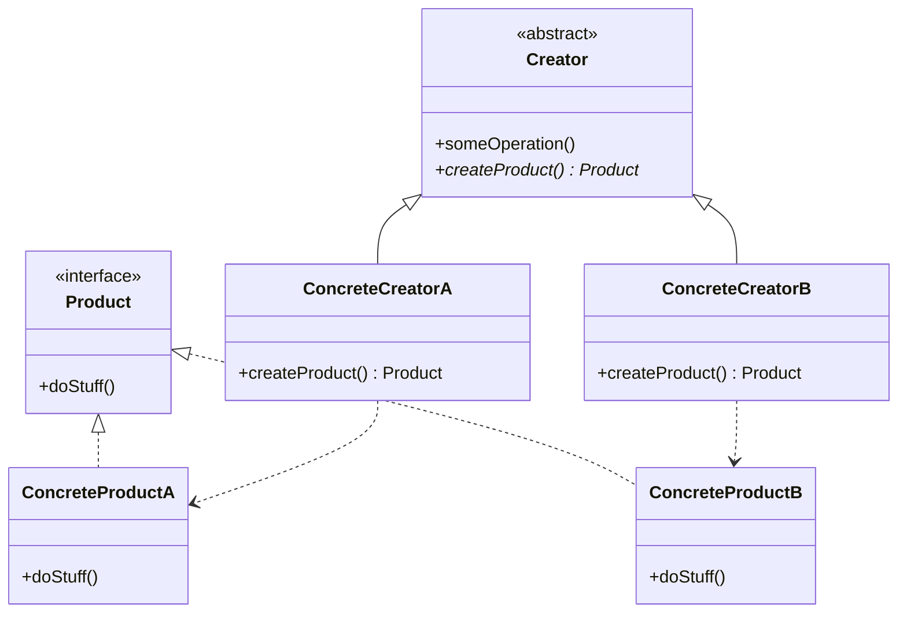

# Factory Method Pattern

> **Category:** Creational    
> **Complexity:** ⭐☆☆ (1/3)  
> **Popularity:** ⭐⭐⭐ (3/3)  
> **Intent:** Define an interface for creating objects, but let subclasses decide which class to instantiate.

---

## Overview

The Factory Method pattern provides an interface for creating objects in a superclass while allowing subclasses to alter the type of objects that will be created. Instead of calling `new` directly, clients use a factory method that returns an instance of a common interface.

**Key characteristics:**
- Encapsulates object creation logic in one place
- Client code works with interfaces, not concrete classes
- Adding new types doesn't require modifying existing code (Open/Closed Principle)

---

## 👶 Explain Like I'm 5

Imagine a toy vending machine. You press a button labeled "Car" and a toy car comes out. You press "Airplane" and a toy airplane comes out. You don't know how the machine builds each toy inside — you just press the button and get what you asked for.

The Factory Method is that vending machine. Your code says "I need a Notification" and the factory decides *which kind* to make (email, SMS, push). If someone adds a new type of toy (Slack notification), the machine just gets a new button — nothing else changes.

---

## ❓ Problem & Solution

**The Problem:** Imagine you're creating a logistics management application. Your MVP only handles transportation by land, so most of your code lives in a `Truck` class. When the app becomes popular, maritime companies ask you to incorporate sea logistics. However, your code is so heavily coupled to the `Truck` class that adding a `Ship` class would require major changes across the entire codebase.

**The Solution:** The Factory Method pattern replaces direct object construction calls (using the `new` operator) with calls to a special *factory* method. The objects returned by a factory method are often referred to as "products." Now, you can easily override the factory method in a subclass and change the class of products being created. The only caveat: subclasses must return products that share a common base class or interface (like `Transport`).

---

## 🌍 Real-World Analogy

Consider a large real-world logistics company. The core logistics flow (planning, routing, invoicing) works the same whether a package is delivered overland or overseas. However, the actual vehicle required differs. 
A `RoadLogistics` manager creates `Truck` objects for ground delivery, whereas a `SeaLogistics` manager creates `Ship` objects for maritime routes. The overarching `planDelivery()` process delegates the creation of the vehicle to these specific managers using a factory method.

---

## 🏗️ Structure



---

## When to Use

**✅ Use this when:**
- The exact type of object to create **isn't known until runtime** (e.g., config-driven or user-input-driven creation).
- Multiple classes share a **common interface** but have different implementations (e.g., `EmailNotification`, `SmsNotification`, `PushNotification`).
- Object creation involves **complex initialization logic** (DB lookups, config parsing, validation) that shouldn't leak into client code.
- You want to **centralize creation** so adding new types is a single-file change.
- A class wants to **delegate instantiation** to its subclasses (the classic GoF use case).

**❌ Don't use this when:**
- You only have **one product type** and no realistic plan for more — a simple `new MyClass()` is clearer.
- The creation logic is **trivial** (no parameters, no config) — the factory adds indirection without value.
- You're in a **Spring/DI environment** where the container already selects implementations via profiles, qualifiers, or conditional beans.
- The factory `switch` statement is growing uncontrollably — consider the **Registry** or **Abstract Factory** pattern instead.

**🔍 Quick Decision Checklist:**
1. Do you have **2+ implementations** of the same interface? → Yes = Factory candidate.
2. Does the caller need to be **shielded** from knowing which concrete class is used? → Yes = Factory.
3. Is creation logic **complex** (not just `new`)? → Yes = Factory adds value.
4. Are you already using Spring `@Bean` methods? → You're already using Factory Method! Spring's `@Bean` is a factory method.

---

## How It Works

### Simple Factory (Static Factory Method)

The simplest form — a static method that returns different implementations based on input:

```java
public interface Notification {
    void send(String message);
}

public class EmailNotification implements Notification {
    @Override
    public void send(String message) {
        System.out.println("Email: " + message);
    }
}

public class SmsNotification implements Notification {
    @Override
    public void send(String message) {
        System.out.println("SMS: " + message);
    }
}

public class PushNotification implements Notification {
    @Override
    public void send(String message) {
        System.out.println("Push: " + message);
    }
}

public class NotificationFactory {
    public static Notification create(String type) {
        return switch (type) {
            case "EMAIL" -> new EmailNotification();
            case "SMS"   -> new SmsNotification();
            case "PUSH"  -> new PushNotification();
            default -> throw new IllegalArgumentException("Unknown type: " + type);
        };
    }
}

// Usage
Notification notification = NotificationFactory.create("EMAIL");
notification.send("Hello!");
```

### Classic Factory Method (Using Inheritance)

The GoF version — an abstract creator class defines the factory method, and concrete creators override it:

```java
// Product interface
public interface Transport {
    void deliver(String cargo);
}

// Concrete products
public class Truck implements Transport {
    @Override
    public void deliver(String cargo) {
        System.out.println("Delivering '" + cargo + "' by truck on road");
    }
}

public class Ship implements Transport {
    @Override
    public void deliver(String cargo) {
        System.out.println("Delivering '" + cargo + "' by ship across sea");
    }
}

// Abstract creator
public abstract class Logistics {
    // Factory method — subclasses decide which Transport to create
    public abstract Transport createTransport();

    public void planDelivery(String cargo) {
        Transport transport = createTransport();
        transport.deliver(cargo);
    }
}

// Concrete creators
public class RoadLogistics extends Logistics {
    @Override
    public Transport createTransport() {
        return new Truck();
    }
}

public class SeaLogistics extends Logistics {
    @Override
    public Transport createTransport() {
        return new Ship();
    }
}

// Usage
Logistics logistics = new RoadLogistics();
logistics.planDelivery("Electronics");  // Delivering 'Electronics' by truck on road
```

### Factory with Registry (Extensible)

A more flexible approach that allows registering new types without modifying the factory:

```java
public class NotificationRegistry {
    private static final Map<String, Supplier<Notification>> registry = new HashMap<>();

    public static void register(String type, Supplier<Notification> supplier) {
        registry.put(type, supplier);
    }

    public static Notification create(String type) {
        Supplier<Notification> supplier = registry.get(type);
        if (supplier == null) {
            throw new IllegalArgumentException("Unknown type: " + type);
        }
        return supplier.get();
    }

    // Register defaults
    static {
        register("EMAIL", EmailNotification::new);
        register("SMS", SmsNotification::new);
    }
}

// Third-party code can register new types
NotificationRegistry.register("SLACK", SlackNotification::new);
```

---

## 🔄 Before & After: Why Factory Method Matters

### ❌ Without Factory — Tight coupling, painful to extend

```java
public class OrderService {
    public void notifyCustomer(String channel, String message) {
        // Every new channel = edit this method = violates Open/Closed Principle
        if (channel.equals("EMAIL")) {
            EmailNotification n = new EmailNotification();
            n.send(message);
        } else if (channel.equals("SMS")) {
            SmsNotification n = new SmsNotification();
            n.send(message);
        } else if (channel.equals("PUSH")) {
            PushNotification n = new PushNotification();
            n.send(message);
        }
        // Adding Slack? Edit this method AGAIN. And every other place that creates notifications.
    }
}
```

### ✅ With Factory Method — Open for extension, closed for modification

```java
public class OrderService {
    public void notifyCustomer(String channel, String message) {
        Notification notification = NotificationFactory.create(channel);
        notification.send(message);
        // Adding Slack? Just add SlackNotification class + register it. Zero changes here.
    }
}
```

---

## Real-World Examples in Java

| Class/Method | Description |
|-------------|-------------|
| `Calendar.getInstance()` | Returns a calendar based on the current locale and timezone |
| `NumberFormat.getInstance()` | Returns a locale-specific number formatter |
| `java.util.Collections.unmodifiableList()` | Wraps and returns a different list implementation |
| `java.nio.charset.Charset.forName()` | Returns a charset by name |
| Spring's `BeanFactory` | Creates and manages bean instances |

---

## 💼 Factory Method in Spring & Enterprise Java

### Spring's `@Bean` IS a Factory Method

Every `@Bean` method in a `@Configuration` class is literally the Factory Method pattern:

```java
@Configuration
public class AppConfig {

    @Bean
    public PaymentProcessor paymentProcessor(
            @Value("${payment.provider}") String provider) {
        return switch (provider) {
            case "stripe"  -> new StripeProcessor();
            case "paypal"  -> new PaypalProcessor();
            case "square"  -> new SquareProcessor();
            default -> throw new IllegalArgumentException("Unknown: " + provider);
        };
    }
}

// All consumers just inject the interface — they never know which implementation:
@Service
public class CheckoutService {
    private final PaymentProcessor processor; // injected by Spring
    // ...
}
```

### Spring Profiles as Factory Method

```java
@Configuration
public class StorageConfig {
    @Bean
    @Profile("local")
    public StorageService localStorage() {
        return new LocalFileStorageService();
    }

    @Bean
    @Profile("prod")
    public StorageService cloudStorage() {
        return new S3StorageService();
    }
}
// Active profile determines which factory method Spring calls.
```

---

## Advantages & Disadvantages

| Advantages | Disadvantages |
|-----------|---------------|
| Decouples client code from concrete classes | Can introduce many small classes |
| Follows Open/Closed Principle | Clients may need to subclass the creator just to create a product |
| Follows Single Responsibility Principle | The `switch`/`if-else` in simple factories can grow |
| Centralizes object creation logic | Slightly more complex than direct instantiation |
| Makes code more testable (easy to mock) | |

---

## Interview Questions

**Q1: What is the Factory pattern and why is it commonly used?**

The Factory pattern creates objects without specifying the exact class of object to be created. It allows a class to defer instantiation to subclasses or a dedicated factory, making it easier to add new types without changing existing code. It's commonly used to manage flexibility when class types and dependencies change over time, and to decouple client code from creation logic.

**Q2: Can you explain the concept of a Factory Method in Java?**

The Factory Method is a design pattern where a class defines an interface for creating objects but lets subclasses decide which class to instantiate. This is achieved by declaring an abstract method (often named `create()`, `getInstance()`, or similar) in a base class, and having subclasses provide the specific implementation. This enhances flexibility and encapsulation by isolating construction from usage.

**Q3: What are the advantages and disadvantages of using the Factory pattern?**

**Advantages:** promotes code reusability, separates object creation from implementation (SRP), allows new types without altering existing code (OCP), and makes testing easier. **Disadvantages:** can introduce complexity through multiple layers of abstraction and many small factory classes. The creation logic (switch/if-else) can grow unless combined with a registry approach.

**Q4: Can you provide an example where the Factory pattern simplifies object creation?**

A database connection factory: an application supports MySQL, PostgreSQL, and Oracle. Using a Factory, a single `ConnectionFactory.create("mysql")` call returns the correct connection implementation. The application code only deals with the `Connection` interface, not the specific JDBC driver details. Adding a new database type requires only a new implementation class and a factory registration — no changes to existing client code.

**Q5: What is the difference between a Simple Factory and a Factory Method?**

A Simple Factory is a single class with a static method that creates objects based on input parameters — it's not a formal GoF pattern but is widely used. A Factory Method is the GoF pattern where an abstract creator class declares a creation method and concrete subclasses override it to produce specific products. The Factory Method uses inheritance and polymorphism; the Simple Factory uses conditional logic.

---

## Advanced Editorial Pass: Factory Method for Controlled Instantiation

### Where It Adds Real Value
- Product variants must evolve independently behind a stable creation contract.
- Construction requires environment-specific wiring unknown to callers.
- You need test seams to substitute product implementations safely.

### Trade-offs
- Overuse introduces subtype sprawl with minimal behavioral difference.
- Creation logic can become fragmented across many classes.
- Discoverability suffers if naming conventions are weak.

### Implementation Guidance
1. Keep product contracts narrow and behavior-focused.
2. Enforce naming and packaging conventions for creators and products.
3. Measure extension frequency; collapse hierarchy if variation is not real.

### 🔄 Relations with Other Patterns
- **[Abstract Factory](./abstract-factory.md)**: Many designs start by using Factory Method (less complicated, highly customizable via subclasses) and naturally evolve toward Abstract Factory, Prototype, or Builder as flexibility needs increase.
- **[Template Method](./template-method.md)**: Factory Method can be considered a specialization of Template Method. Additionally, a Factory Method often serves as a specific step within a larger Template Method.
- **[Prototype](./prototype.md)**: Factory Method relies on inheritance to let subclasses determine the objects to create, whereas Prototype avoids deep inheritance hierarchies but requires a complex initialization/cloning process instead.

### ⚖️ Factory Method vs. Similar Patterns

| Aspect | Simple Factory | Factory Method | Abstract Factory | Builder |
|--------|---------------|----------------|------------------|---------|
| **Mechanism** | Static method + switch | Inheritance + override | Factory of factories | Step-by-step construction |
| **Extension** | Modify switch | Add new subclass | Add new factory family | Add new builder |
| **# of products** | One type | One type | Family of related types | One complex type |
| **Complexity** | Low | Medium | High | Medium |
| **OCP compliant** | ❌ (edit switch) | ✅ | ✅ | ✅ |
| **When to pick** | Few simple types | Need inheritance-based extension | Related product families | Complex object construction |
