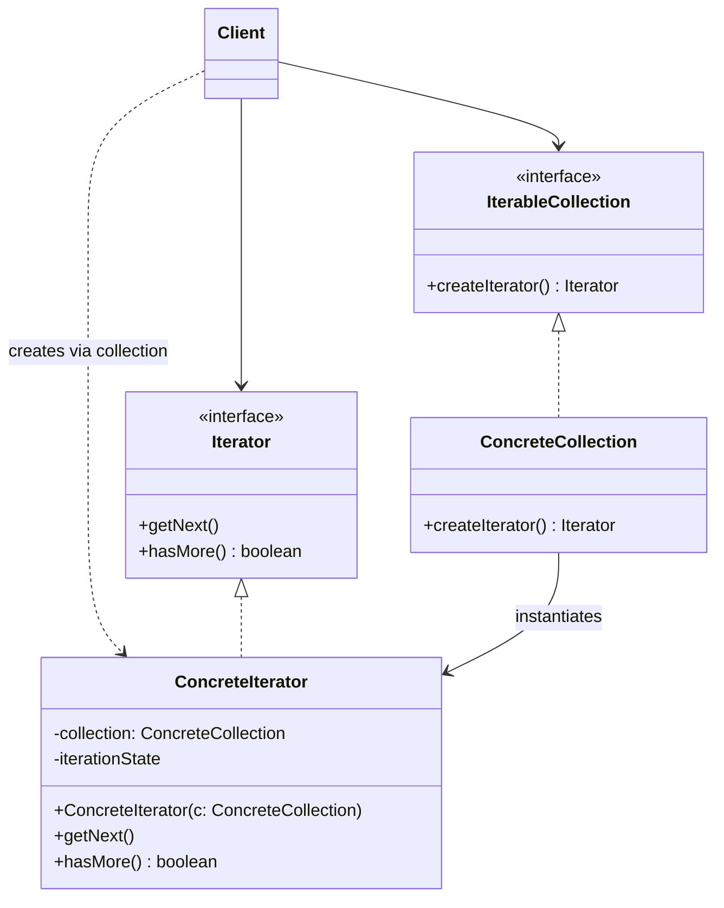

# Iterator Pattern

> **Category:** Behavioral  
> **Intent:** Provide a way to access the elements of an aggregate object sequentially without exposing its underlying representation (list, stack, tree, etc.).

---

## Overview

Collections are one of the most used data structures in programming. However, collections can store data in arrays, linked lists, hash tables, or trees. The Iterator pattern extracts the traversal behavior of a collection into a separate concept called an *iterator*.

Instead of the collection implementing logic to track the "current position" during a loop, an external iterator object manages it.

**Key characteristics:**
- Separates algorithms from data structures.
- Provides a standard interface for traversing different data structures.
- Allows multiple simultaneous traversals of a collection (since each iterator tracks its own state).
- Hides the complex internal structure of the aggregate from the client.

---

## ❓ Problem & Solution

**The Problem:** Collections are one of the most used data types in programming. Nonetheless, a collection is just a container for a group of objects. Most collections store their elements in simple lists. However, some of them are based on stacks, trees, graphs and other complex data structures. 
No matter how a collection is structured, it must provide some way of accessing its elements so that other code can use these elements. There should be a way to go through each element of the collection without accessing the same elements over and over. This may sound like an easy job if you have a collection based on a list. But how do you sequentially traverse elements of a complex data structure, such as a tree? For example, today you might be just fine with depth-first traversal of a tree, but tomorrow you might require breadth-first traversal. And next week, you might need something else, like random access to the tree elements.

**The Solution:** The main idea of the Iterator pattern is to extract the traversal behavior of a collection into a separate object called an *iterator*.
In addition to implementing the algorithm itself, an iterator object encapsulates all of the traversal details, such as the current position and how many elements are left till the end. Because of this, several iterators can go through the same collection at the same time, independently of each other.
All iterators must implement the same interface. This makes the client code compatible with any collection type or any traversal algorithm as long as there's a proper iterator.

---

## 🌍 Real-World Analogy

You plan to visit Rome for a few days and visit all of its main sights and attractions. But once there, you could waste a lot of time walking in circles, unable to find even the Colosseum.
On the other hand, you could buy a virtual guide app for your smartphone and use it for navigation. It's smart and inexpensive, and you could be staying at some interesting places for as long as you want.
A third alternative is that you could spend some of the trip's budget and hire a local guide who knows the city like the back of their hand. The guide would be able to tailor the tour to your likings, show you every attraction and tell you a lot of exciting stories.
All of these options—the random directions, the smartphone navigator, and the human guide—act as iterators over the vast collection of sights and attractions located in Rome.

---

## 🏗️ Structure



---

## When to Use

- Your collection has a complex data structure under the hood, but you want to hide complexity from clients.
- You want to reduce code duplication in traversal logic across your app.
- You want your code to be able to traverse different data structures uniformly via a common interface.

---

## How It Works

### Custom Channel Iterator Example

Imagine traversing TV channels. The channels might be stored in an array, a list, or derived on the fly. We use an Iterator to hide this.

```java
// 1. Iterator Interface
public interface ChannelIterator {
    boolean hasNext();
    Channel next();
}

// 2. Aggregate Interface (Iterable)
public interface ChannelCollection {
    void addChannel(Channel c);
    void removeChannel(Channel c);
    ChannelIterator iterator(ChannelTypeEnum type);
}

// 3. Domain Model
public class Channel {
    private double frequency;
    private ChannelTypeEnum type;
    
    public Channel(double freq, ChannelTypeEnum type){
        this.frequency=freq;
        this.type=type;
    }
    
    public double getFrequency() { return frequency; }
    public ChannelTypeEnum getType() { return type; }
}

public enum ChannelTypeEnum { ENGLISH, HINDI, FRENCH, ALL }

// 4. Concrete Aggregate
public class ChannelCollectionImpl implements ChannelCollection {
    private List<Channel> channelsList;

    public ChannelCollectionImpl() {
        this.channelsList = new ArrayList<>();
    }

    public void addChannel(Channel c) { this.channelsList.add(c); }
    public void removeChannel(Channel c) { this.channelsList.remove(c); }

    @Override
    public ChannelIterator iterator(ChannelTypeEnum type) {
        return new ChannelIteratorImpl(type, this.channelsList);
    }

    // 5. Concrete Iterator (often an inner class)
    private class ChannelIteratorImpl implements ChannelIterator {
        private ChannelTypeEnum type;
        private List<Channel> channels;
        private int position;

        public ChannelIteratorImpl(ChannelTypeEnum type, List<Channel> channels) {
            this.type = type;
            this.channels = channels;
            this.position = 0;
        }

        @Override
        public boolean hasNext() {
            while (position < channels.size()) {
                Channel c = channels.get(position);
                if (c.getType().equals(type) || type.equals(ChannelTypeEnum.ALL)) {
                    return true;
                } else {
                    position++;
                }
            }
            return false;
        }

        @Override
        public Channel next() {
            Channel c = channels.get(position);
            position++;
            return c;
        }
    }
}
```

### Usage

```java
ChannelCollection channels = new ChannelCollectionImpl();
channels.addChannel(new Channel(98.5, ChannelTypeEnum.ENGLISH));
channels.addChannel(new Channel(99.5, ChannelTypeEnum.HINDI));
channels.addChannel(new Channel(100.5, ChannelTypeEnum.FRENCH));
channels.addChannel(new Channel(101.5, ChannelTypeEnum.ENGLISH));

// Traverse ONLY English channels
ChannelIterator baseIterator = channels.iterator(ChannelTypeEnum.ENGLISH);

while (baseIterator.hasNext()) {
    Channel c = baseIterator.next();
    System.out.println(c.getFrequency()); // Prints 98.5 and 101.5
}
```

---

## The Java `java.util.Iterator` Interface

Java provides native support for this pattern via `java.lang.Iterable` and `java.util.Iterator`.

```java
public interface Iterable<T> {
    Iterator<T> iterator();
}

public interface Iterator<E> {
    boolean hasNext();
    E next();
    default void remove() { ... } // Optional operation
}
```

Any class that implements `Iterable<T>` can be used in the native Java "for-each" loop.

```java
List<String> names = List.of("Alice", "Bob", "Charlie");

// Implicit Iterator usage (Syntactic Sugar)
for (String name : names) {
    System.out.println(name);
}

// Explicit Iterator usage (Under the hood)
Iterator<String> it = names.iterator();
while (it.hasNext()) {
    System.out.println(it.next());
}
```

---

## Real-World Examples

| Framework/Library | Description |
|-------------------|-------------|
| `java.util.Iterator` | Native Java collections iterator. |
| `java.util.Enumeration` | Legacy equivalent to Iterator used in older Java versions. |
| `java.sql.ResultSet` | Iterates over rows retrieved from a database query (`next()`). |
| `java.util.Scanner` | Iterates over items (lines, words, primitives) from an input stream. |

---

## Advantages & Disadvantages

| Advantages | Disadvantages |
|-----------|---------------|
| Single Responsibility Principle: Extracts bulky traversal code from collections. | Overkill for simple collections where an array or basic list suffices. |
| Open/Closed Principle: Can add new traversal types (e.g., reverse, filtered) without modifying the collection. | May be less efficient than direct index access (`arr[i]`) for some arrays. |
| You can iterate over the same collection in parallel because each iterator object tracks its own state. | |
| Supports uniform traversal across different collection types. | |

---

## Interview Questions

**Q1: What problem does the Iterator pattern solve?**

It provides a standard interface to sequentially access the elements of an aggregate object (like a List or Tree) without exposing the underlying data structure to the client. This decouples the client from the implementation details of the collection.

**Q2: How does the enhanced `for` loop (for-each) work in Java?**

The enhanced `for` loop in Java is purely compiler syntactic sugar. At compile time, if the target implements `java.lang.Iterable` or is an array, the compiler replaces the `for-each` loop with explicit `Iterator` instantiations and `while(iterator.hasNext())` calls using `iterator.next()`.

**Q3: Why would you use an Iterator instead of a standard `for (int i=0; i<size; i++)` loop?**

If the underlying collection changes (for example, from an `ArrayList` to a `LinkedList`), a standard `for` loop with index access `list.get(i)` goes from O(1) to O(N) access time, changing overall traversal from O(N) to O(N²). An `Iterator` guarantees optimal sequential traversal regardless of whether the collection is backed by an array, a linked structure, or a tree.

**Q4: Is it safe to modify a collection while iterating over it?**

Not natively. Modifying a Java collection directly while traversing it using an iterator typically throws a `ConcurrentModificationException` (fail-fast behavior). To safely remove elements, you must call `iterator.remove()`. For concurrent additions/modifications, you should use concurrent collections like `CopyOnWriteArrayList` which use fail-safe snapshot iterators.

---

## Advanced Editorial Pass: Iterator and Data Streaming

### Strategic Payoff
- Isolates complex traversal algorithms (like Depth-First vs. Breadth-First tree traversals) from business logic.
- Crucial building block for lazy evaluation and infinite sequences (e.g., Java 8 Streams).
- Standardizes traversal abstractions, allowing polymorphism where the stream consumer doesn't know the exact data source.

### Non-Obvious Risks
- **Iteration Footprint:** Object allocation per iterator can trigger garbage collection churn if utilized in extremely tight, performance-critical game loops.
- **Fail-Fast limitations:** Dealing with multithreading breaks standard iterators. Wrapping the collection with locks or switching to concurrent collection iterators creates differing semantic behaviors.
- **Complex Navigations:** For bi-directional iteration or skipping, the base `Iterator` falls short. (Java addresses this specifically with `ListIterator`).

### Implementation Heuristics
1. Implement standard `Iterable` and `Iterator` interfaces defined by your language so your objects play nicely with built-in mechanics (like Java's extended for-loop or `.spliterator()`).
2. Make iterators fail-fast by tracking a "modification count" integer inside the collection. If the collection's modCount deviates from the iterator's expected modCount, fast-fail immediately.
3. Keep iterators lightweight to minimize heap allocations during deep traversals.

### 🔄 Relations with Other Patterns
- **[Composite](./composite.md)**: You can use Iterators to traverse Composite trees.
- **[Factory Method](./factory-method.md)**: You can use Factory Method along with Iterator to let collection subclasses return different types of iterators that are compatible with the collections.
- **[Memento](./memento.md)**: You can use Memento along with Iterator to capture the current iteration state and roll it back if necessary.
- **[Visitor](./visitor.md)**: You can use Visitor along with Iterator to traverse a complex data structure and execute some operation over its elements, even if they all have different classes.
