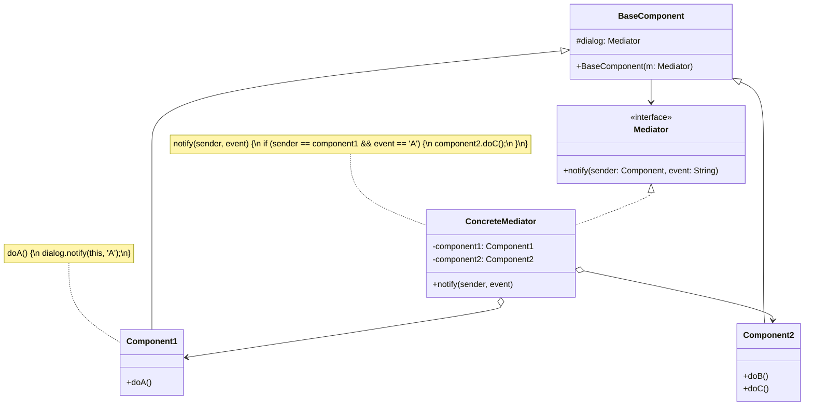

# Mediator Pattern

> **Category:** Behavioral  
> **Intent:** Define an object that encapsulates how a set of objects interact. Mediator promotes loose coupling by keeping objects from referring to each other explicitly, and it lets you vary their interaction independently.

---

## Overview

When an application grows, the number of components usually increases. If objects communicate directly with one another, the system quickly resembles a plate of spaghetti (a "tightly coupled" matrix). A change in one object forces changes in multiple related objects.

The Mediator pattern solves this by introducing a central authority—a "Mediator" object. Instead of components talking directly to each other, they send messages to the mediator. The mediator knows the logic of how to route and process these messages, reducing the connections between objects from many-to-many to one-to-many.

**Key characteristics:**
- Extracts communication logic into a single dedicated class.
- Replaces tightly coupled peer-to-peer communication with a star topology centering on the mediator.
- Components only know about the Mediator interface, not about other components.

---

## ❓ Problem & Solution

**The Problem:** Say you have a dialog for creating and editing customer profiles. It consists of various form controls such as text fields, checkboxes, buttons, etc.
Some of the form elements may interact with others. For instance, selecting the "I have a dog" checkbox may reveal a hidden text field for entering the dog's name. Another button may have to validate values of all fields before saving the data.
By having this logic implemented directly inside the code of the form elements you make these elements' classes much harder to reuse in other forms of the app. For example, you won't be able to use that checkbox class inside another form, because it's coupled to the dog's text field. You can use either all the classes involved in rendering the profile form, or none at all.

**The Solution:** The Mediator pattern suggests that you should cease all direct communication between the components which you want to make independent of each other. Instead, these components must collaborate indirectly, by calling a special mediator object that redirects the calls to appropriate components. As a result, the components depend only on a single mediator class instead of being coupled to dozens of their colleagues.
In our form example, the dialog class itself can act as the mediator. The dialog class already knows about all of its sub-elements, so you won't even need to introduce new dependencies into this class.
Now, when a user clicks the "I have a dog" checkbox, the checkbox doesn't toggle the hidden text field directly. Instead, it just notifies the dialog. The dialog receives the notification and performs the actual work (toggling the field).

---

## 🌍 Real-World Analogy

Pilots of aircraft that approach or depart the airport control area don't communicate directly with each other. Instead, they speak to an air traffic controller, who sits in a tall tower somewhere near the airstrip. Without the air traffic controller, pilots would need to be aware of every plane in the vicinity of the airport, discussing landing priorities with a committee of dozens of other pilots. That would probably skyrocket the airplane crash statistics.
The tower doesn't need to control the whole flight. It exists only to enforce constraints in the terminal area because the number of involved actors there might be overwhelming to a pilot.

---

## 🏗️ Structure



---

## When to Use

- When a system has a massive amount of interlocking, communicating classes making it hard to understand and maintain.
- Reusing a component is difficult because it relies on and communicates directly with multiple other specific components.
- You find yourself creating multiple subclasses of components just to change how they communicate.
- Commonly used in GUI programming (e.g., buttons, text boxes, and checkboxes affecting each others' states).

---

## How It Works

### Air Traffic Control Example

If planes communicated directly with each other to avoid colliding, it would be chaos. Instead, they all communicate with the Air Traffic Control (ATC) tower, which mediates and orchestrates their actions.

```java
// 1. Mediator Interface
public interface ATCMediator {
    void registerFlight(Flight flight);
    void requestTakeoff(Flight flight);
    void requestLanding(Flight flight);
}

// 2. Colleague Abstract Class / Interface
public abstract class Flight {
    protected ATCMediator mediator;
    private String flightNumber;

    public Flight(ATCMediator mediator, String flightNumber) {
        this.mediator = mediator;
        this.flightNumber = flightNumber;
        mediator.registerFlight(this);
    }
    
    public String getFlightNumber() { return flightNumber; }
    
    public void sendLandingRequest() {
        mediator.requestLanding(this);
    }
    
    public void sendTakeoffRequest() {
        mediator.requestTakeoff(this);
    }

    public abstract void receiveMessage(String msg);
}

// 3. Concrete Colleague
public class CommercialFlight extends Flight {

    public CommercialFlight(ATCMediator mediator, String flightNumber) {
        super(mediator, flightNumber);
    }

    @Override
    public void receiveMessage(String msg) {
        System.out.println("Flight " + getFlightNumber() + " received: " + msg);
    }
}

// 4. Concrete Mediator
public class ATCMediatorImpl implements ATCMediator {
    private List<Flight> flights = new ArrayList<>();
    private Flight currentlyLandingOrTakingOff;

    @Override
    public void registerFlight(Flight flight) {
        flights.add(flight);
    }

    @Override
    public void requestTakeoff(Flight flight) {
        if (currentlyLandingOrTakingOff == null) {
            currentlyLandingOrTakingOff = flight;
            System.out.println("ATC: Cleared for takeoff " + flight.getFlightNumber());
            // Notify others
            for (Flight f : flights) {
                if (f != flight) {
                    f.receiveMessage("Runway occupied by " + flight.getFlightNumber() + " taking off.");
                }
            }
            // After taking off, clear the runway
            currentlyLandingOrTakingOff = null;
        } else {
            System.out.println("ATC: Denied takeoff " + flight.getFlightNumber() + ", runway occupied.");
        }
    }

    @Override
    public void requestLanding(Flight flight) {
        if (currentlyLandingOrTakingOff == null) {
            currentlyLandingOrTakingOff = flight;
            System.out.println("ATC: Cleared to land " + flight.getFlightNumber());
            currentlyLandingOrTakingOff = null;
        } else {
            System.out.println("ATC: Denied landing " + flight.getFlightNumber() + ", runway occupied. Please hold.");
        }
    }
}
```

### Usage

```java
// Setup the Mediator
ATCMediator atc = new ATCMediatorImpl();

// Setup the colleagues (Flights)
Flight flight101 = new CommercialFlight(atc, "UA101");
Flight flight202 = new CommercialFlight(atc, "AA202");
Flight flight303 = new CommercialFlight(atc, "DL303");

// They only talk to ATC, not to each other.
flight101.sendTakeoffRequest();
flight202.sendLandingRequest(); 
```

**Output:**
```
ATC: Cleared for takeoff UA101
Flight AA202 received: Runway occupied by UA101 taking off.
Flight DL303 received: Runway occupied by UA101 taking off.
ATC: Cleared to land AA202
```

---

## Real-World Examples

| Framework/Library | Description |
|-------------------|-------------|
| **Spring MVC (`DispatcherServlet`)** | It acts as a Mediator between HTTP requests, handlers (controllers), and view resolvers. Controllers don't call views directly. |
| **Java Message Service (JMS) / Event Buses** | Topics and message brokers act as mediators. Producers publish to the broker; consumers read from it—they do not know each other. |
| `java.util.Timer` | Acts as a mediator between tasks (`TimerTask`) and the background thread. |

---

## Mediator vs. Observer vs. Facade

| Pattern | Goal / Intent | Topology |
|---------|---------------|----------|
| **Mediator** | Centralizes complex communication between *peers* (colleagues). They mutually affect each other. | Star (bidirectional) |
| **Observer** | One object broadcasts state changes to multiple listeners. | 1-to-many (unidirectional) |
| **Facade** | Provides a simplified interface to a complex subsystem. | 1-to-subsystem (structural) |

---

## Advantages & Disadvantages

| Advantages | Disadvantages |
|-----------|---------------|
| Decouples components, reducing dependencies from M*N to M+N. | The Mediator can quickly become a **God Object** (an architectural anti-pattern) if it handles too much logic. |
| Single Responsibility Principle: Extracts communication logic into one place. | Maintaining a massive mediator class can become a bottleneck. |
| Open/Closed Principle: You can add new mediators without modifying colleague classes. | |
| Makes colleagues completely reusable in other contexts (by injecting a blank mediator). | |

---

## Interview Questions

**Q1: What does the Mediator design pattern achieve?**

It restricts direct communications between a set of interacting objects and forces them to collaborate only via a mediator object. This reduces chaotic network-like "spaghetti" dependencies down to a clean star topology, decreasing coupling.

**Q2: How does the Mediator pattern differ from the Observer pattern?**

While both are behavioral patterns used to share communication, the Observer pattern creates a unidirectional 1-to-many relationship where publishers push events to subscribers who passively react. The Mediator pattern centrally orchestrates complex, bidirectional, many-to-many communications where multiple objects act both as senders and receivers interacting dynamically. *Note: They are often used together, where the Mediator uses the Observer pattern to notify colleagues.*

**Q3: What is the primary risk of using the Mediator pattern?**

Because all communication logic is centralized, the Mediator object can easily bloat into a monolithic, overly complex "God Object" that knows too much and does too much, making it harder to test and maintain than the original spaghetti code.

**Q4: How does `DispatcherServlet` in Spring behave like a Mediator?**

In Spring MVC, controllers do not invoke Views directly, nor do they process raw HTTP protocol details. The `DispatcherServlet` sits in the middle. It takes incoming HTTP traffic, asks the HandlerMapping for the correct Controller, executes the Controller, takes the returned Model, and asks the ViewResolver to render the response. It mediates the entire lifecycle.

---

## Advanced Editorial Pass: Mediator as an API Gateway or Broker

### Strategic Payoff
- Excellent for stateful GUI orchestration (disabling 'Submit' if 'Agree' checkbox isn't ticked, without coupling the checkbox to the submit button).
- In microservices, API Gateways and Message Brokers act as architectural-level Mediators, decoupling domains.
- Enhances testability; you can test colleagues in complete isolation by mocking the mediator.

### Non-Obvious Risks
- **The "God Object" Anti-pattern:** If a Mediator encapsulates business logic rather than just *routing* logic, it violates the Single Responsibility Principle and becomes impossible to maintain.
- **Hidden Complexity:** Moving the spaghetti from the classes into a single Mediator doesn't actually delete the spaghetti; it just puts it in one box.

### Implementation Heuristics
1. Keep the Mediator strictly focused on routing and coordination. It should tell components *when* to execute, but not *how*.
2. If the mediator logic gets too vast, consider splitting it using aspects of the Observer pattern (an event bus) rather than hardcoded method calls.
3. Use interfaces for both Mediators and Colleagues to prevent circular dependency build paths.

### 🔄 Relations with Other Patterns
- **[Chain of Responsibility](./chain-of-responsibility.md), [Command](./command.md), [Mediator](./mediator.md), and [Observer](./observer.md)**: These patterns address various ways of connecting senders and receivers of requests. Mediator eliminates direct connections between senders and receivers, forcing them to communicate indirectly via a mediator object.
- **[Facade](./facade.md)**: Facade and Mediator have similar jobs: they try to organize collaboration between lots of tightly coupled classes. Facade defines a simplified interface to a subsystem, but doesn't introduce new functionality. The subsystem is unaware of the facade. Mediator centralizes communication between components of the system. The components only know about the mediator object and don't communicate directly.
- **[Observer](./observer.md)**: The difference between Mediator and Observer is often elusive. In most cases, you can implement either of these patterns; but sometimes you can apply both simultaneously. The primary goal of Mediator is to eliminate mutual dependencies among a set of system components. The primary goal of Observer is to establish dynamic one-way connections between objects.
