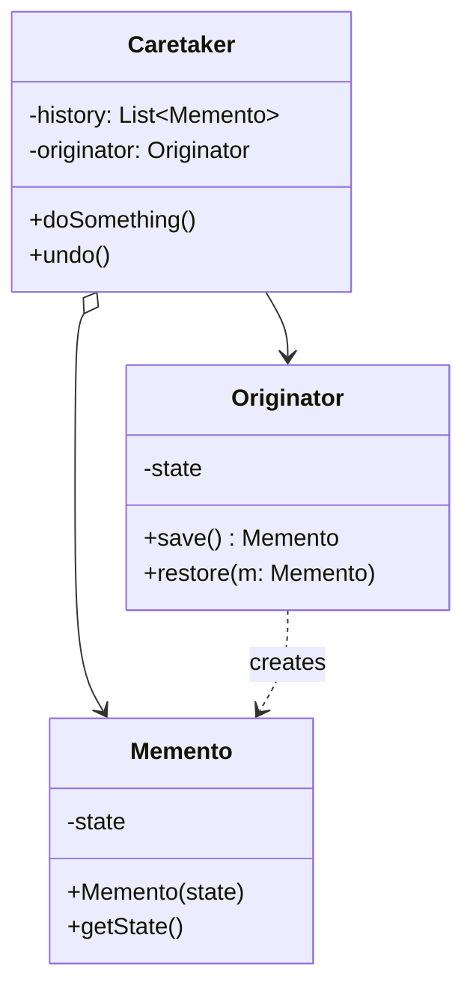

# Memento Pattern

> **Category:** Behavioral    
> **Complexity:** ⭐⭐⭐ (3/3)  
> **Popularity:** ⭐☆☆ (1/3)  
> **Intent:** Without violating encapsulation, capture and externalize an object's internal state so that the object can be restored to this state later.

---

## Overview

Sometimes it's necessary to record the internal state of an object. This is required when implementing transaction rollbacks, "undo" mechanisms, or checkpoints. However, simply exposing the internal state with public getters/setters violates the concept of encapsulation.

The Memento pattern solves this by delegating the creation of the state snapshot to the object itself (the Originator) because it has full access to its own internal state. The resulting snapshot (the Memento) is given to another object (the Caretaker) for safekeeping. The Caretaker is not allowed to peek inside the Memento.

**Key characteristics:**
- Extracts an object's state into a "Memento" object.
- The Originator creates and consumes the Memento.
- The Caretaker stores the Memento but cannot read or modify its contents.
- Preserves strict encapsulation boundaries.

---

## ❓ Problem & Solution

**The Problem:** Imagine you're creating a text editor app. In addition to simple text editing, your editor can format text, insert inline images, etc. You decided to let users undo any operations carried out on the text. For this, you want to record the state of all objects before executing any operation. Later, when a user decides to undo an action, you can fetch the latest snapshot from history and use it to restore the state of all objects.
But how exactly are you going to produce those state snapshots? You'd have to go over all the fields of an object and copy their values into storage. However, this is only possible if the object has quite relaxed access restrictions to its contents, and most real objects hide all significant data in private fields. You could make fields public, but then you'd lose encapsulation and make your code horribly fragile.

**The Solution:** The Memento pattern delegates the creation of the state snapshots to the actual owner of that state, the *originator* object. Hence, instead of other objects trying to copy the editor's state from the outside, the editor class itself can make the snapshot since it has full access to its own state.
The pattern suggests storing the copy of the object's state in a special object called *memento*. The contents of the memento aren't accessible to any other object except the one that produced it. Other objects must communicate with the memento using a limited interface which may allow fetching the snapshot's metadata (creation time, the name of the performed operation, etc.), but not the original object's state contained in the snapshot.
These restrictive mementos are usually kept inside another object called the *caretaker*, like an undo history stack.

---

## 🌍 Real-World Analogy

When you play a video game, you usually rely on the ability to save your progress. The game engine saves its state by reading the levels, the player's position, the contents of the inventory, and so on, and writing them all into a file. Later, whenever you want to load the game, you select one of those save files. The game reads the file and restores the state exactly as it was when the save was made.

---

## 🏗️ Structure



---

## When to Use

- You need to produce snapshots of the object's state to be able to restore a previous state of the object (Undo/Redo via Command pattern).
- Direct access to the object's fields/getters/setters would violate its encapsulation.
- Implementing database transactions where a failure triggers an immediate rollback to the prep-transaction state.

---

## How It Works

### Text Editor Undo Example

Imagine a text editor where you type, and you sometimes want to hit `Ctrl+Z` to undo your last input.

```java
// 1. Memento (The snapshot)
// Usually immutable. In Java, making this an inner class or using package-private visibility helps strictly enforce encapsulation.
public class TextSnapshot {
    private final String content;
    private final int cursorPosition;

    public TextSnapshot(String content, int cursorPosition) {
        this.content = content;
        this.cursorPosition = cursorPosition;
    }

    // Only the Originator should technically use these getters.
    public String getContent() { return content; }
    public int getCursorPosition() { return cursorPosition; }
}

// 2. Originator
public class TextEditor {
    private StringBuilder content = new StringBuilder();
    private int cursorPosition = 0;

    public void type(String words) {
        content.insert(cursorPosition, words);
        cursorPosition += words.length();
    }

    public void moveCursor(int index) {
        if (index >= 0 && index <= content.length()) {
            this.cursorPosition = index;
        }
    }

    // Capture the state (Create Memento)
    public TextSnapshot save() {
        return new TextSnapshot(content.toString(), cursorPosition);
    }

    // Restore the state (Consume Memento)
    public void restore(TextSnapshot snapshot) {
        this.content = new StringBuilder(snapshot.getContent());
        this.cursorPosition = snapshot.getCursorPosition();
    }

    public String getCurrentText() {
        return content.toString();
    }
}

// 3. Caretaker (History manager)
public class EditorHistory {
    private final Stack<TextSnapshot> history = new Stack<>();
    private final TextEditor editor; // Knows about the Originator

    public EditorHistory(TextEditor editor) {
        this.editor = editor;
    }

    public void backup() {
        history.push(editor.save());
    }

    public void undo() {
        if (!history.isEmpty()) {
            editor.restore(history.pop());
        } else {
            System.out.println("Nothing to undo.");
        }
    }
}
```

### Usage

```java
TextEditor editor = new TextEditor();
EditorHistory history = new EditorHistory(editor);

editor.type("Hello ");
history.backup(); // Snapshot 1: "Hello ", cursor=6

editor.type("World!");
history.backup(); // Snapshot 2: "Hello World!", cursor=12

System.out.println("Current: " + editor.getCurrentText());
// Output: Current: Hello World!

// Uh oh, I didn't mean to write "World!"
history.undo();
System.out.println("Undo 1: " + editor.getCurrentText());
// Output: Undo 1: Hello 

editor.type("Design Patterns");
System.out.println("Final: " + editor.getCurrentText());
// Output: Final: Hello Design Patterns
```

---

## Real-World Examples

| Framework/Library | Description |
|-------------------|-------------|
| `java.io.Serializable` | Taking an object and writing it out to a stream can be viewed as producing a Memento (though it's a byte array rather than an object interface). |
| `java.util.Date` | Can act as a Memento representing the state in time (used internally by other classes). |
| JSF / MVC Frameworks | State-Saving interfaces often employ Mementos to save and restore UI view state across requests. |

---

## Memento vs. Command

We often see Memento and Command patterns used together.
- **Command:** Encapsulates an action/request into an object. It can provide a `.undo()` method by doing the mathematical *opposite* of `.execute()` (e.g. `add(5)` -> `subtract(5)`).
- **Memento:** Instead of calculating the inverse operation, Memento just takes a hard snapshot of the RAM state before the action, and `.undo()` just blindly rewrites the RAM state to what the snapshot contains. 
- Memento is safer but uses vastly more memory. Command uses less memory but the inverse algorithm can be immensely complicated or impossible (e.g., irreversible hashing).

---

## Advantages & Disadvantages

| Advantages | Disadvantages |
|-----------|---------------|
| Preserves strict encapsulation limits; the Caretaker touches the Memento but cannot see inside it. | Creating heavy snapshots constantly consumes huge amounts of memory. |
| Simplifies the Originator; it doesn't need to track its own history, relying on the Caretaker instead. | The Caretaker needs to know the Originator's lifecycle to destroy outdated Mementos to free memory. |
| Provides an easy, bug-free way to implement undo/redo. | Most languages lack true strict visibility limits to ensure Caretakers can't accidentally peek into the Mementos. |

---

## Interview Questions

**Q1: What is the primary purpose of the Memento pattern?**

The primary purpose is to capture an object's internal state so it can be restored later (undo functionality) without violating object encapsulation. The object itself creates the snapshot, preventing internal fields from necessarily becoming public.

**Q2: Who are the three main actors in the Memento pattern?**

1. **Originator:** The object whose state we are saving. It generates the Memento and reads the Memento to restore state.
2. **Memento:** A simple, ideally immutable data object representing the snapshot in time.
3. **Caretaker:** The object that keeps track of the Mementos (like an Undo stack). It never modifies or inspects the contents of the Memento.

**Q3: How do you enforce encapsulation in Java for the Memento object?**

In Java, you can declare the Memento class inside the Originator class (as a nested class) or put them in the same package and use package-private scope for the Memento's fields and getters. The Caretaker operates in a different package and only holds references to the blank `Memento` interface or object, completely unable to touch its internal data.

**Q4: How does Memento differ from deep cloning?**

Deep cloning usually duplicates an object so it can be manipulated independently. A Memento is usually not manipulated; it's a strictly read-only historical snapshot used solely for rolling back state. Additionally, Memento often only captures a *partial* state (the mutable parts that matter for an undo check), while a deep clone clones EVERYTHING.

---

## Advanced Editorial Pass: Memento for Distributed Sagas

### Strategic Payoff
- Solves undo/redo problems elegantly without writing complex discrete inverse algorithms.
- Critical in orchestrating workflow failures (e.g., the Saga Pattern in distributed microservices where a compensatory transaction needs the exact state of a system before a failure occurred).

### Non-Obvious Risks
- **Heisenbugs in State Trees:** If an object's state contains references to other mutable objects, the Memento MUST perform a deep copy of those references. If it performs a shallow copy, subsequent mutations to the referenced objects will alter the "saved" historical snapshot.
- **Heap Exhaustion:** A busy `EditorHistory` stack will quickly crash the JVM. History length MUST be capped.

### Implementation Heuristics
1. Make the Memento class completely immutable. Use `public final` fields if package-scoping isn't viable in your runtime architecture.
2. Implement memory limitations in the Caretaker (e.g., evicting snapshots older than 20 steps).
3. If deep copying the state into a Memento is too slow, consider using the Command pattern instead, or switching to an Event Sourcing architectural paradigm.

### 🔄 Relations with Other Patterns
- **[Command](./command.md)**: You can use Memento along with Command to implement "undo". In this case, commands are responsible for performing various operations over a target object, while mementos save the state of that object just before a command gets executed.
- **[Iterator](./iterator.md)**: You can use Memento along with Iterator to capture the current iteration state and roll it back if necessary.
- **[Prototype](./prototype.md)**: Sometimes Prototype can be a simpler alternative to Memento. This works if the object, the state of which you want to store in the history, is fairly straightforward and doesn't have links to external resources, or the links are easy to re-establish.
