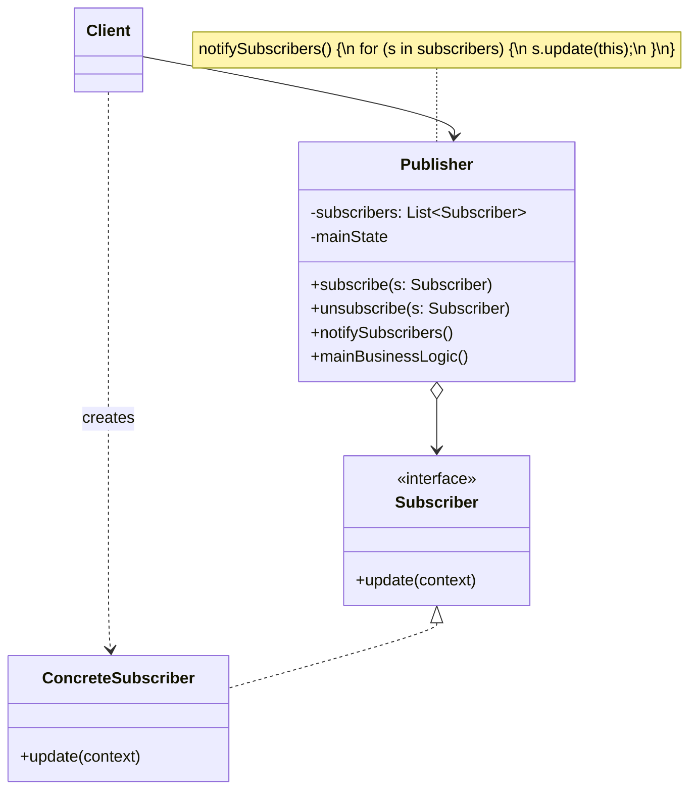

# Observer Pattern

> **Category:** Behavioral    
> **Complexity:** ⭐⭐☆ (2/3)  
> **Popularity:** ⭐⭐⭐ (3/3)  
> **Intent:** Define a one-to-many dependency so that when one object changes state, all its dependents are notified and updated automatically.

---

## Overview

The Observer pattern establishes a subscription mechanism where multiple objects (observers/subscribers) listen to state changes in another object (subject/publisher). When the subject's state changes, all registered observers are notified.

**Key characteristics:**
- Subject maintains a list of observers and notifies them of state changes
- Observers register/deregister themselves with the subject
- Loose coupling — the subject doesn't need to know concrete observer types
- Supports broadcast communication

---

## ❓ Problem & Solution

**The Problem:** Imagine you have two types of objects: a `Customer` and a `Store`. The customer is very interested in a particular brand of product (say, a new model of iPhone) which should become available in the store very soon. The customer could visit the store every day to check product availability. But while the product is still en route, most of these trips would be pointless.
On the other hand, the store could send tons of emails (which might be considered spam) to all customers each time a new product becomes available. This would save some customers from endless trips to the store, but at the same time, it'd upset other customers who aren't interested in new products.
We've got a conflict. Either the customer wastes time checking product availability, or the store wastes resources notifying the wrong customers.

**The Solution:** The object that has some interesting state is often called *subject*, but since it's also going to notify other objects about the changes to its state, we'll call it *publisher*. All other objects that want to track changes to the publisher's state are called *subscribers*.
The Observer pattern suggests that you add a subscription mechanism to the publisher class so individual objects can subscribe to or unsubscribe from a stream of events coming from that publisher. In reality, this mechanism consists of 1) an array field for storing a list of references to subscriber objects and 2) several public methods which allow adding subscribers to and removing them from that list.
Now, whenever an important event happens to the publisher, it goes over its subscribers and calls the specific notification method on their objects.

---

## 🌍 Real-World Analogy

If you subscribe to a newspaper or magazine, you no longer need to go to the store to check if the next issue is available. Instead, the publisher sends new issues directly to your mailbox right after publication or even in advance.
The publisher maintains a list of subscribers and knows which magazines they're interested in. Subscribers can leave the list at any time when they wish to stop the publisher from sending new magazine issues to them.

---

## 🏗️ Structure



---

## When to Use

- When changes in one object require updating others, and you don't know how many objects need to update
- When an object should notify other objects without knowing who they are
- When you need an event-driven or publish-subscribe architecture
- When multiple modules depend on the same data and should stay in sync

---

## How It Works

### EventManager — Generic Event System

```java
public interface EventListener<T> {
    void update(String eventType, T data);
}

public class EventManager<T> {
    private final Map<String, List<EventListener<T>>> listeners = new HashMap<>();

    public void subscribe(String eventType, EventListener<T> listener) {
        listeners.computeIfAbsent(eventType, k -> new ArrayList<>()).add(listener);
    }

    public void unsubscribe(String eventType, EventListener<T> listener) {
        List<EventListener<T>> list = listeners.get(eventType);
        if (list != null) {
            list.remove(listener);
        }
    }

    public void notify(String eventType, T data) {
        List<EventListener<T>> list = listeners.getOrDefault(eventType, Collections.emptyList());
        for (EventListener<T> listener : list) {
            listener.update(eventType, data);
        }
    }
}
```

### Subject — User Service

```java
public class UserService {
    private final EventManager<User> eventManager = new EventManager<>();

    public EventManager<User> getEventManager() {
        return eventManager;
    }

    public User register(String name, String email) {
        User user = new User(name, email);
        // ... save to database ...
        eventManager.notify("user:registered", user);
        return user;
    }

    public void deactivate(User user) {
        user.setActive(false);
        // ... update in database ...
        eventManager.notify("user:deactivated", user);
    }
}
```

### Concrete Observers

```java
public class WelcomeEmailListener implements EventListener<User> {
    @Override
    public void update(String eventType, User user) {
        System.out.println("📧 Sending welcome email to " + user.getEmail());
    }
}

public class AnalyticsListener implements EventListener<User> {
    @Override
    public void update(String eventType, User user) {
        System.out.println("📊 Tracking event '" + eventType + "' for user " + user.getName());
    }
}

public class AuditLogListener implements EventListener<User> {
    @Override
    public void update(String eventType, User user) {
        System.out.printf("📋 Audit log: [%s] %s — %s%n",
            LocalDateTime.now(), eventType, user.getName());
    }
}
```

### Client Usage

```java
UserService userService = new UserService();

// Subscribe observers
userService.getEventManager().subscribe("user:registered", new WelcomeEmailListener());
userService.getEventManager().subscribe("user:registered", new AnalyticsListener());
userService.getEventManager().subscribe("user:deactivated", new AnalyticsListener());
userService.getEventManager().subscribe("user:registered", new AuditLogListener());
userService.getEventManager().subscribe("user:deactivated", new AuditLogListener());

// Trigger events
userService.register("Alice", "alice@example.com");
// 📧 Sending welcome email to alice@example.com
// 📊 Tracking event 'user:registered' for user Alice
// 📋 Audit log: [2024-01-15T10:30:00] user:registered — Alice
```

---

## Observer vs. Pub/Sub

| Aspect | Observer Pattern | Publish-Subscribe |
|--------|-----------------|-------------------|
| Coupling | Subject knows about observers (directly) | Publishers and subscribers are fully decoupled |
| Mediator | No mediator — direct notification | Event bus/message broker mediates |
| Filtering | Observers get all notifications | Subscribers filter by topic/channel |
| Distribution | Typically same-process | Can span across processes/services |
| Example | Java `PropertyChangeListener` | Kafka, RabbitMQ, Redis Pub/Sub |

---

## Thread Safety Considerations

```java
public class ThreadSafeEventManager<T> {
    private final Map<String, List<EventListener<T>>> listeners =
        new ConcurrentHashMap<>();

    public void subscribe(String eventType, EventListener<T> listener) {
        listeners.computeIfAbsent(eventType, k ->
            new CopyOnWriteArrayList<>()).add(listener);
    }

    public void unsubscribe(String eventType, EventListener<T> listener) {
        List<EventListener<T>> list = listeners.get(eventType);
        if (list != null) {
            list.remove(listener);
        }
    }

    public void notify(String eventType, T data) {
        List<EventListener<T>> list = listeners.getOrDefault(eventType,
            Collections.emptyList());
        for (EventListener<T> listener : list) {
            try {
                listener.update(eventType, data);
            } catch (Exception e) {
                System.err.println("Observer error: " + e.getMessage());
                // Don't let one failing observer break the chain
            }
        }
    }
}
```

**Key concerns:**
- Use `CopyOnWriteArrayList` or snapshot the listener list before iterating
- Handle exceptions in individual observers to prevent cascading failures
- Consider using `CompletableFuture` for async notification
- Beware of memory leaks — observers that never unsubscribe hold references

---

## Real-World Examples

| Framework/Library | Description |
|-------------------|-------------|
| Java `PropertyChangeSupport` | Built-in JavaBeans observer mechanism |
| Spring `ApplicationEvent` | Application-level event publishing and listening |
| Swing `ActionListener` | UI event handling for buttons, fields, etc. |
| RxJava `Observable` | Reactive streams with observer pattern at the core |
| `java.util.Observer` (deprecated) | Legacy JDK observer — deprecated in Java 9 |

---

## Advantages & Disadvantages

| Advantages | Disadvantages |
|-----------|---------------|
| Loose coupling between subject and observers | Can cause unexpected cascading updates |
| Open/Closed Principle — new observers without modifying subject | Memory leaks if observers aren't unregistered |
| Supports broadcast communication | Order of notification is undefined |
| Dynamic subscription/unsubscription at runtime | Debugging can be difficult — hidden control flow |

---

## Interview Questions

**Q1: What is the Observer pattern and when would you use it?**

The Observer pattern defines a one-to-many dependency where changes in a subject automatically notify all registered observers. Use it when multiple objects need to react to state changes without tight coupling — e.g., event systems, UI updates, notification services, or any publish-subscribe scenario.

**Q2: How does the Observer pattern relate to the Pub/Sub model?**

Observer is a simpler, same-process pattern where the subject directly notifies observers. Pub/Sub adds a mediating event bus or message broker, fully decoupling publishers from subscribers. Pub/Sub works better for distributed systems (Kafka, RabbitMQ), while Observer is ideal for in-process event handling.

**Q3: What are the threading challenges with the Observer pattern?**

Observers can be added/removed during notification — iterating the list becomes unsafe. Solutions include using `CopyOnWriteArrayList`, taking a snapshot before iterating, or synchronizing access. Additionally, slow observers block the notifier thread unless you use asynchronous notification. Exception handling in observers is crucial to prevent one failing observer from breaking others.

**Q4: How do you avoid memory leaks with the Observer pattern?**

Always unsubscribe observers when they're no longer needed. Use weak references (`WeakReference`) to allow garbage collection. In frameworks like Spring, bean lifecycle management handles cleanup, but in custom implementations, you need explicit deregistration. The deprecated `java.util.Observable` was problematic partly because of this.

**Q5: How is the Observer pattern used in Spring Framework?**

Spring provides `ApplicationEvent` and `@EventListener`. You publish events with `ApplicationEventPublisher.publishEvent()` and handle them with `@EventListener` annotated methods or by implementing `ApplicationListener<T>`. Spring manages observer registration through its IoC container, and supports async event processing with `@Async`.

---

## Advanced Editorial Pass: Observer in Event-Driven Local Architectures

### Design Strengths
- Decouples state changes from side-effect reactions.
- Enables additive features (notifications, analytics, cache sync) without modifying publishers.
- Works well for domain events inside bounded contexts.

### Reliability Risks
- Unbounded fan-out creates latency spikes and failure amplification.
- Event ordering assumptions break when async execution is introduced.
- Hidden dependency graphs complicate reasoning and incident response.

### Engineering Checklist
1. Define delivery semantics (sync/async, at-most-once/at-least-once) explicitly.
2. Separate critical path observers from best-effort listeners.
3. Add idempotency guards for listeners that can reprocess events.

### 🔄 Relations with Other Patterns
- **[Chain of Responsibility](./chain-of-responsibility.md), [Command](./command.md), [Mediator](./mediator.md), and [Observer](./observer.md)**: These all address various ways of connecting senders and receivers of requests. Observer lets receivers dynamically subscribe to and unsubscribe from receiving requests.
- **[Mediator](./mediator.md)**: The difference between Mediator and Observer is often elusive. The primary goal of Mediator is to eliminate mutual dependencies among a set of system components, making them dependent on a single mediator. The primary goal of Observer is to establish dynamic one-way connections between objects, where some objects act as subordinates to others.
