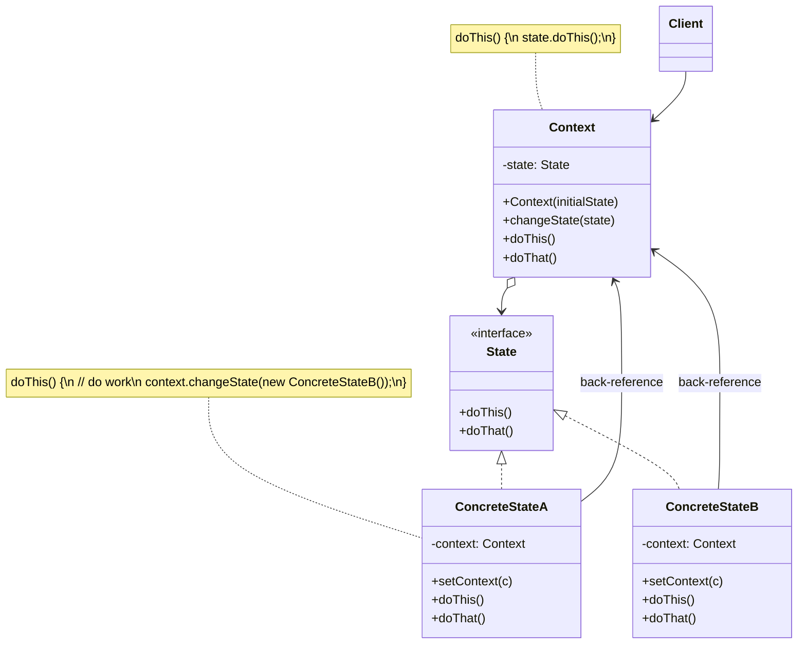

# State Pattern

> **Category:** Behavioral  
> **Intent:** Allow an object to alter its behavior when its internal state changes. The object will appear to change its class.

---

## Overview

The State pattern is closely related to the concept of **Finite-State Machines**. Imagine a Vending Machine: its behavior vastly differs depending on whether or not money has been inserted, whether the item is in stock, or whether the user canceled the transaction.

If you represent these states using massive `if (state == HAS_COIN)` and `else if` blocks across all methods, the code becomes unmanageable as new states are added. The State pattern extracts the behaviors associated with a particular state into separate classes.

**Key characteristics:**
- Extracts state-specific behaviors into individual State classes.
- The original object (Context) delegates execution to its current state object.
- State transitions happen by swapping the State object inside the Context.
- Avoids colossal, monolithic conditional logic blocks.

---

## ❓ Problem & Solution

**The Problem:** The State pattern is closely related to the concept of a *Finite-State Machine*. The main idea is that, at any given moment, there's a *finite* number of *states* which a program can be in. Within any unique state, the program behaves differently, and the program can be switched from one state to another instantaneously. However, depending on a current state, the program may or may not switch to certain other states. These routing rules, called *transitions*, are also finite and predetermined.
You can also apply this approach to objects. Imagine that we have a `Document` class. A document can be in one of three states: `Draft`, `Moderation` and `Published`. The `publish` method of the document works a little bit differently in each state:
- In `Draft`, it moves the document to moderation.
- In `Moderation`, it makes the document public, but only if the current user is an administrator.
- In `Published`, it doesn't do anything at all.
State machines are usually implemented with lots of conditional operators (`if` or `switch`) that select the appropriate behavior depending on the current state of the object. The biggest weakness of a state machine based on conditionals reveals itself once we start adding more and more states and state-dependent behaviors. Over time, altering transition logic may require changing state conditionals in every method, which makes the code very difficult to maintain.

**The Solution:** The State pattern suggests that you create new classes for all possible states of an object and extract all state-specific behaviors into these classes.
Instead of implementing all behaviors on its own, the original object, called *context*, stores a reference to one of the state objects that represents its current state, and delegates all the state-related work to that object.
To transition the context into another state, replace the active state object with another object that represents that new state. This is possible only if all state classes follow the same interface and the context itself works with these objects through that interface.

---

## 🌍 Real-World Analogy

The buttons and switches in your smartphone behave differently depending on the current state of the device:
- When the phone is unlocked, pressing buttons executes various functions.
- When the phone is locked, pressing any button leads to the unlock screen.
- When the phone's charge is low, pressing any button shows the charging screen.

---

## 🏗️ Structure



---

## When to Use

- You have an object that behaves differently depending on its current state.
- You have massive conditional (`if/else` or `switch`) statements that check the object's state before executing methods.
- You have duplicate code across similar states or state transitions.

---

## How It Works

### Vending Machine Example

A Vending Machine has multiple states: `NoCoin`, `HasCoin`, `Dispensing`, `OutOfStock`.

```java
// 1. State Interface
public interface VendingMachineState {
    void insertCoin();
    void ejectCoin();
    void turnCrank();
    void dispense();
}

// 2. Concrete States
public class NoCoinState implements VendingMachineState {
    private VendingMachine machine;

    public NoCoinState(VendingMachine machine) { this.machine = machine; }

    @Override
    public void insertCoin() {
        System.out.println("You inserted a coin.");
        machine.setState(machine.getHasCoinState());
    }

    @Override
    public void ejectCoin() { System.out.println("You haven't inserted a coin."); }

    @Override
    public void turnCrank() { System.out.println("You turned, but there's no coin."); }

    @Override
    public void dispense() { System.out.println("You need to pay first."); }
}

public class HasCoinState implements VendingMachineState {
    private VendingMachine machine;

    public HasCoinState(VendingMachine machine) { this.machine = machine; }

    @Override
    public void insertCoin() { System.out.println("You can't insert another coin."); }

    @Override
    public void ejectCoin() {
        System.out.println("Coin returned.");
        machine.setState(machine.getNoCoinState());
    }

    @Override
    public void turnCrank() {
        System.out.println("You turned...");
        machine.setState(machine.getSoldState());
    }

    @Override
    public void dispense() { System.out.println("No item dispensed yet."); }
}

public class SoldState implements VendingMachineState {
    private VendingMachine machine;

    public SoldState(VendingMachine machine) { this.machine = machine; }

    // Handled previously or impossible here
    @Override public void insertCoin() { System.out.println("Please wait, we're giving you an item."); }
    @Override public void ejectCoin() { System.out.println("Sorry, you already turned the crank."); }
    @Override public void turnCrank() { System.out.println("Turning twice doesn't get you another item!"); }

    @Override
    public void dispense() {
        machine.releaseItem();
        if (machine.getCount() > 0) {
            machine.setState(machine.getNoCoinState());
        } else {
            System.out.println("Oops, out of inventory!");
            machine.setState(machine.getSoldOutState());
        }
    }
}

// 3. Context
public class VendingMachine {
    // Hold references to all possible states to avoid recreating them constantly
    private VendingMachineState noCoinState;
    private VendingMachineState hasCoinState;
    private VendingMachineState soldState;
    private VendingMachineState soldOutState;

    private VendingMachineState currentState;
    private int count = 0;

    public VendingMachine(int count) {
        noCoinState = new NoCoinState(this);
        hasCoinState = new HasCoinState(this);
        soldState = new SoldState(this);
        // soldOutState similarly created...

        this.count = count;
        if (count > 0) currentState = noCoinState;
        else currentState = soldOutState;
    }

    // Delegation to the dynamic state
    public void insertCoin() { currentState.insertCoin(); }
    public void ejectCoin() { currentState.ejectCoin(); }
    public void turnCrank() { 
        currentState.turnCrank(); 
        currentState.dispense(); // Call internally
    }

    public void setState(VendingMachineState state) { this.currentState = state; }
    public void releaseItem() {
        if (count > 0) {
            System.out.println("A slot rolls, a product drops.");
            count -= 1;
        }
    }
    
    // Getters for states and count...
    public VendingMachineState getNoCoinState() { return noCoinState; }
    public VendingMachineState getHasCoinState() { return hasCoinState; }
    public VendingMachineState getSoldState() { return soldState; }
    public VendingMachineState getSoldOutState() { return soldOutState; }
    public int getCount() { return count; }
}
```

### Usage

```java
VendingMachine machine = new VendingMachine(5);

machine.insertCoin(); // Output: You inserted a coin.
machine.turnCrank();  // Output: You turned... A slot rolls, a product drops.
```

---

## State vs. Strategy

There is immense structural similarity between State and Strategy—both depend on an object delegating work to an injected behavior interface.

| Aspect | State | Strategy |
|--------|-------|----------|
| **Intent** | Deal with changing behaviors dictated by an internal Finite State Machine. | Wrap an algorithm/logic that the client chooses at runtime. |
| **Transitions** | States know about each other and trigger the transitions (changing the state of the Context). | Strategies are usually unaware of each other; the Client manually updates the Context's strategy. |
| **Encapsulation** | Encapsulates the varying behaviors of a single object based on what "mode" it is in. | Encapsulates "how" to do a task so the client can swap the math/algorithm. |

---

## Real-World Examples

| Framework/Library | Description |
|-------------------|-------------|
| Java Threads API | The `Thread` lifecycle (`NEW`, `RUNNABLE`, `BLOCKED`, `WAITING`, `TERMINATED`) heavily inspires internal JVM state mechanics. |
| `FacesServlet` | In JSF, the request processing lifecycle moves through distinct phases/states (`Restore View`, `Apply Request Values`, `Render Response`). |
| Media Players | Most system media players have distinct classes wrapping behavior depending on `Playing`, `Paused`, `Buffering`. |

---

## Advantages & Disadvantages

| Advantages | Disadvantages |
|-----------|---------------|
| Single Responsibility Principle: Separates code related to distinct states into different classes. | Overkill if the machine only has 2 or 3 states that rarely change. |
| Open/Closed Principle: You can introduce new states without changing existing state classes or the context. | Applying the pattern creates a large influx of small classes. |
| Simplifies the context by converting massive `switch` blocks into polymorphic class delegation. | Hard to trace data flow because transition logic might reside inside the state classes themselves. |

---

## Interview Questions

**Q1: What problem does the State pattern solve?**

It solves the problem of writing gigantic, unmaintainable `if-else` block structures when programming Finite State Machines. It shifts the conditional logic by moving the behavior for every state into its own class, making the behavioral changes completely polymorphic.

**Q2: Who is responsible for transitioning from one state to another?**

There are two valid approaches. 
1. The **Context** performs the transition based on the return values of the state methods. Best when transition logic is centralized.
2. The **Concrete States** themselves perform the transition by calling a `setState` method on the context (like in the example above). This is highly decentralized but couples the states to the context heavily.

**Q3: How is the State pattern different from the Strategy pattern?**

In Strategy, the client determines which algorithm to use and actively passes it. Strategies are blind to each other. In State, the states themselves (or the Context) govern completely automatic transitions between one another. From the client's perspective in State, it's just interacting with an object that magically knows what to do based on its own internal state.

**Q4: Can we share State objects between multiple contexts?**

Yes, if the Concrete State classes do not hold any instance variables (specifically, if they do not hold a reference to the Context). In that scenario, the Context must pass *itself* as a parameter to the state's methods: `currentState.insertCoin(this)`. This is known as a Stateless State class and it behaves similarly to a Flyweight.

---

## Advanced Editorial Pass: State Orchestration

### Strategic Payoff
- Explicit modeling of state limits impossible states (e.g., you literally cannot execute the behavior of an `ActiveUserAccount` if the user's current mapped class is `SuspendedUserAccount`).
- Vastly increases testing coverage depth; you can unit test exact state transitions in complete isolation.

### Non-Obvious Risks
- **Transition Chaos:** If state A transitions to B, and B to C, but someone changes B to transition to D, the overall workflow is easily broken without obvious compile-time warnings.
- **Bi-Directional Coupling:** By injecting the Context into the State objects, you create a strict circular dependency. This can complicate serialization or dependency injection frameworks like Spring.

### Implementation Heuristics
1. Do not use State pattern if the logic consists of a simple boolean (`isPublished` vs `isDraft`). Use standard booleans.
2. For large, complex enterprise systems, consider using a dedicated State Machine library (like Spring StateMachine) which centralizes transitions into a strict configuration matrix, rather than hardcoding transitions into scattered Java classes.

### 🔄 Relations with Other Patterns
- **[Bridge](./bridge.md), [State](./state.md), [Strategy](./strategy.md), and [Adapter](./adapter.md)**: These patterns all have very similar structures based on composition. However, they all solve different problems.
- **[State](./state.md) vs. [Strategy](./strategy.md)**: State can be considered as an extension of Strategy. Both patterns are based on composition: they change the behavior of the context by delegating some work to helper objects. Strategy makes these objects completely independent and unaware of each other. However, State doesn't restrict dependencies between concrete states, letting them alter the state of the context at will.
