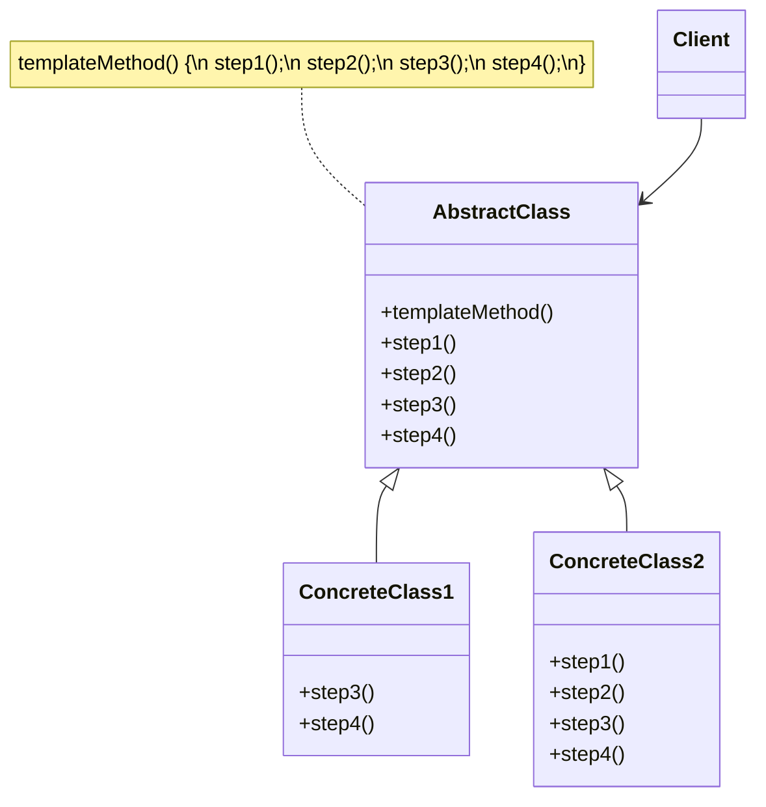

# Template Method Pattern

> **Category:** Behavioral  
> **Intent:** Define the skeleton of an algorithm in a superclass, letting subclasses override specific steps without changing the algorithm's structure.

---

## Overview

The Template Method pattern defines the overall structure of an algorithm in a base class method while allowing subclasses to customize specific steps. The base class controls the workflow; subclasses fill in the details.

**Key characteristics:**
- The superclass defines the algorithm skeleton (the "template method")
- Individual steps are declared as abstract or overridable methods
- Subclasses override steps but do **not** change the overall flow
- The template method is typically `final` to prevent subclasses from altering the algorithm structure

---

## ❓ Problem & Solution

**The Problem:** Imagine you're creating a data mining application that analyzes corporate documents. Users feed the app documents in various formats (PDF, DOC, CSV), and it tries to extract meaningful data from these docs in a uniform format.
The first version of the app could work only with DOC files. In the following version, it was able to support CSV files. A month later, you "taught" it to extract data from PDF files.
At some point, you noticed that all three classes have a lot of similar code. While the code for dealing with various data formats was entirely different in all classes, the code for data processing and analysis is almost identical. Wouldn't it be great to get rid of the code duplication, leaving the algorithm structure intact?
There was another problem related to client code that used these classes. It had lots of conditionals that picked a proper course of action depending on the class of the processing object. If all three processing classes had a common interface or a base class, you'd be able to eliminate the conditionals in client code and use polymorphism when calling methods on a processing object.

**The Solution:** The Template Method pattern suggests that you break down an algorithm into a series of steps, turn these steps into methods, and put a series of calls to these methods inside a single *template method*. The steps may either be `abstract`, or have some default implementation. To use the algorithm, the client is supposed to provide its own subclass, implement all abstract steps, and override some of the optional ones if needed (but not the template method itself).

---

## 🌍 Real-World Analogy

The template method approach can be used in mass housing construction. The architectural plan for building a standard house may contain several extension points that would let a potential owner adjust some details of the resulting house.
Each building step, such as laying the foundation, framing, building walls, installing plumbing and wiring for electricity, etc., can be slightly changed to make the resulting house a little bit different from others.

---

## 🏗️ Structure



---

## When to Use

- Multiple classes share the same algorithm structure but differ in certain steps
- You want to control the extension points of an algorithm
- You want to avoid code duplication by pulling common behavior into a base class
- You want to enforce an algorithm's invariant steps while allowing customization

---

## How It Works

### Data Processing Pipeline

```java
public abstract class DataProcessor {

    // Template method — defines the skeleton
    public final void process(String source) {
        String rawData = readData(source);
        String parsedData = parseData(rawData);
        String processedData = processData(parsedData);

        if (shouldSave()) {         // hook method
            saveData(processedData);
        }

        log(processedData);         // hook method with default behavior
    }

    // Abstract steps — MUST be implemented by subclasses
    protected abstract String readData(String source);
    protected abstract String parseData(String rawData);
    protected abstract String processData(String parsedData);

    // Concrete step — common implementation
    protected void saveData(String data) {
        System.out.println("💾 Saving data to default storage");
    }

    // Hook methods — CAN be overridden, but have defaults
    protected boolean shouldSave() {
        return true;
    }

    protected void log(String data) {
        System.out.println("📋 Processed data length: " + data.length());
    }
}
```

### Concrete Implementations

```java
public class CsvDataProcessor extends DataProcessor {

    @Override
    protected String readData(String source) {
        System.out.println("📄 Reading CSV file: " + source);
        return "name,age,city\nAlice,30,NYC\nBob,25,LA";
    }

    @Override
    protected String parseData(String rawData) {
        System.out.println("🔍 Parsing CSV rows");
        return rawData.replace(",", " | ");
    }

    @Override
    protected String processData(String parsedData) {
        System.out.println("⚙️ Processing CSV data — filtering empty rows");
        return Arrays.stream(parsedData.split("\n"))
            .filter(line -> !line.isBlank())
            .collect(Collectors.joining("\n"));
    }
}

public class JsonDataProcessor extends DataProcessor {

    @Override
    protected String readData(String source) {
        System.out.println("📄 Reading JSON from API: " + source);
        return "{\"users\": [{\"name\": \"Alice\"}, {\"name\": \"Bob\"}]}";
    }

    @Override
    protected String parseData(String rawData) {
        System.out.println("🔍 Parsing JSON structure");
        return rawData;  // already structured
    }

    @Override
    protected String processData(String parsedData) {
        System.out.println("⚙️ Processing JSON — extracting user names");
        return "Extracted: Alice, Bob";
    }

    @Override
    protected boolean shouldSave() {
        return false;  // API data is read-only, don't save
    }
}

public class XmlDataProcessor extends DataProcessor {

    @Override
    protected String readData(String source) {
        System.out.println("📄 Reading XML file: " + source);
        return "<users><user>Alice</user><user>Bob</user></users>";
    }

    @Override
    protected String parseData(String rawData) {
        System.out.println("🔍 Parsing XML DOM");
        return rawData.replaceAll("<[^>]+>", " ").trim();
    }

    @Override
    protected String processData(String parsedData) {
        System.out.println("⚙️ Processing XML — normalizing whitespace");
        return parsedData.replaceAll("\\s+", ", ");
    }

    @Override
    protected void saveData(String data) {
        System.out.println("💾 Saving to XML-specific database");
    }
}
```

### Client Usage

```java
DataProcessor csvProcessor = new CsvDataProcessor();
csvProcessor.process("data/users.csv");
// 📄 Reading CSV file: data/users.csv
// 🔍 Parsing CSV rows
// ⚙️ Processing CSV data — filtering empty rows
// 💾 Saving data to default storage
// 📋 Processed data length: 43

DataProcessor jsonProcessor = new JsonDataProcessor();
jsonProcessor.process("https://api.example.com/users");
// 📄 Reading JSON from API: https://api.example.com/users
// 🔍 Parsing JSON structure
// ⚙️ Processing JSON — extracting user names
// (no save — shouldSave() returns false)
// 📋 Processed data length: 21
```

---

## Abstract Methods vs. Hook Methods

| Type | Purpose | Implementation |
|------|---------|---------------|
| **Abstract methods** | Mandatory steps that subclasses MUST implement | `protected abstract void step();` |
| **Hook methods** | Optional steps with default behavior | `protected void hook() { /* default */ }` |
| **Template method** | The algorithm skeleton — calls other methods in order | `public final void templateMethod()` |
| **Concrete methods** | Fixed steps that don't change | `private void fixedStep() { ... }` |

**The Hollywood Principle:** "Don't call us, we'll call you." The base class calls subclass methods — not the other way around. The framework controls the flow; subclasses just fill in the blanks.

---

## Real-World Examples

| Framework/Library | Description |
|-------------------|-------------|
| `java.util.AbstractList` | `get()` is abstract; `indexOf()`, `iterator()` use it as template steps |
| `java.io.InputStream` | `read()` is abstract; `read(byte[], int, int)` and `skip()` are template methods |
| Spring `JdbcTemplate` | Template for database operations — handles connection, exception translation |
| JUnit lifecycle | `@BeforeEach` → `@Test` → `@AfterEach` — framework controls the execution order |
| Servlet `HttpServlet` | `service()` dispatches to `doGet()`, `doPost()`, etc. |

---

## Advantages & Disadvantages

| Advantages | Disadvantages |
|-----------|---------------|
| Eliminates code duplication | Tight coupling through inheritance |
| Controls the algorithm structure and extension points | Hard to compose — only one superclass in Java |
| Enforces the invariant parts of the algorithm | Can be confusing if the template has many hooks |
| Easy to extend with new variants | Risk of "fragile base class" problem |

---

## Interview Questions

**Q1: What is the Template Method pattern?**

The Template Method pattern defines the skeleton of an algorithm in a base class and lets subclasses override specific steps without changing the overall structure. The base class has a `template method` (often `final`) that calls a sequence of abstract and hook methods. Subclasses provide implementations for the abstract methods and optionally override hooks.

**Q2: What is the Hollywood Principle and how does it relate to Template Method?**

"Don't call us, we'll call you." In the Template Method pattern, the base class controls the algorithm flow and calls subclass methods at the right time — subclasses don't call superclass methods to drive the algorithm. This inverts the typical control flow and is the foundation of frameworks (Spring, JUnit) where the framework calls your code.

**Q3: What is the difference between abstract methods and hook methods?**

Abstract methods are mandatory extension points — subclasses must implement them. Hook methods are optional — they have default implementations that subclasses can override if needed. Hooks let you add optional behavior (like `shouldSave()` returning a boolean) without forcing every subclass to implement them.

**Q4: How does Template Method differ from Strategy?**

Template Method uses inheritance — the algorithm structure is in the base class, and subclasses override steps. Strategy uses composition — the entire algorithm is encapsulated in a separate strategy object and injected. Template Method varies parts of an algorithm; Strategy replaces the whole algorithm. Strategy is more flexible (runtime swapping); Template Method is simpler when inheritance fits.

**Q5: Can you give a real-world example of Template Method in Java?**

`java.util.AbstractList` — You implement `get(int index)` and `size()`, and the class provides `indexOf()`, `contains()`, `iterator()`, etc. as template methods that use your implementations. `java.io.InputStream` — You implement `read()`, and `read(byte[])`, `skip()`, `transferTo()` are built on top of it. Spring's `JdbcTemplate` handles connection management and exception translation while you provide the SQL and result mapping.

---

## Advanced Editorial Pass: Template Method for Invariant Workflow Control

### Where It Excels
- You must enforce algorithm sequence while allowing limited extension points.
- Compliance or safety constraints require non-overridable orchestration flow.
- Shared pre/post behavior must remain centralized and auditable.

### Risks in Practice
- Inheritance hierarchies become brittle when variation points are misidentified.
- Hook methods encourage subclass side effects that violate invariants.
- Evolution pressure can force repeated base-class changes.

### Engineering Checklist
1. Keep template skeleton small, explicit, and non-negotiable.
2. Define hook contracts clearly (allowed effects, error behavior, timing).
3. Move high-variance logic to Strategy when inheritance starts to strain.

### 🔄 Relations with Other Patterns
- **[Factory Method](./factory-method.md)**: Factory Method is a specialization of Template Method. At the same time, a Factory Method may serve as a step in a large Template Method.
- **[Strategy](./strategy.md)**: Template Method is based on inheritance: it lets you alter parts of an algorithm by extending those parts in subclasses. Strategy is based on composition: you can alter parts of the object's behavior by supplying it with different strategies that correspond to that behavior. Template Method works at the class level, so it's static. Strategy works on the object level, letting you switch behaviors at runtime.
