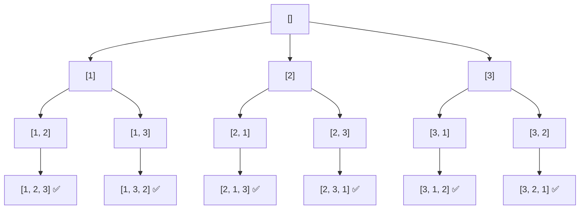

import DsaWeek10BacktrackingDiagram from '@site/src/components/DsaWeek10BacktrackingDiagram';

# Week 10: Recursion & Backtracking

## 1. Overview

Welcome to Week 10! After mastering Binary Search, we now dive into one of the most intellectually challenging but rewarding topics in computer science: **Recursion and Backtracking**.

Recursion is a method where the solution to a problem depends on solutions to smaller instances of the same problem. Backtracking builds upon this by exploring all potential paths in a "Decision Tree" and retreating (backtracking) when it hits a dead end or finds a solution. This is the primary tool for solving combinatorial problems (permutations, subsets) and constraint satisfaction problems (Sudoku, N-Queens).

**Goals for this week:**
- Understand the **JVM Call Stack** and how recursive calls are managed in memory.
- Master the "Base Case" vs. "Recursive Step" logic.
- Learn the **Backtracking Template**: Choose, Explore, Un-choose.
- Understand the difference between Permutations, Combinations, and Subsets.

### Knowledge You Need Before Starting

- Strong control-flow basics and method call understanding in Java.
- Confidence tracing small trees/graphs manually.
- Ability to define clear base cases and shrinking subproblems.
- Comfort with arrays/lists mutation and rollback patterns.

---

## 2. Theory & Fundamentals

<DsaWeek10BacktrackingDiagram />


### 2.1 Mental Model: Recursion as Delegation

The hardest part of recursion is trusting it. The key mental shift is:

> **"I don't solve the whole problem. I solve the current step, then delegate the rest to a smaller version of myself."**

**The Russian Nesting Doll Analogy:**


**View 2 — The Call Stack (which frames are active):**
```
Exploring [1, 2, 3]:

Frame 4: backtrack(path=[1,2,3]) ← ADDING TO RESULT
Frame 3: backtrack(path=[1,2])   ← waiting
Frame 2: backtrack(path=[1])     ← waiting
Frame 1: backtrack(path=[])      ← waiting
─────────────────────────────────
main()                            ← entry point
```

Practice drawing both views for small inputs (N=3) before attempting the full implementation. The decision tree shows the big picture; the call stack shows what's in memory at any moment.