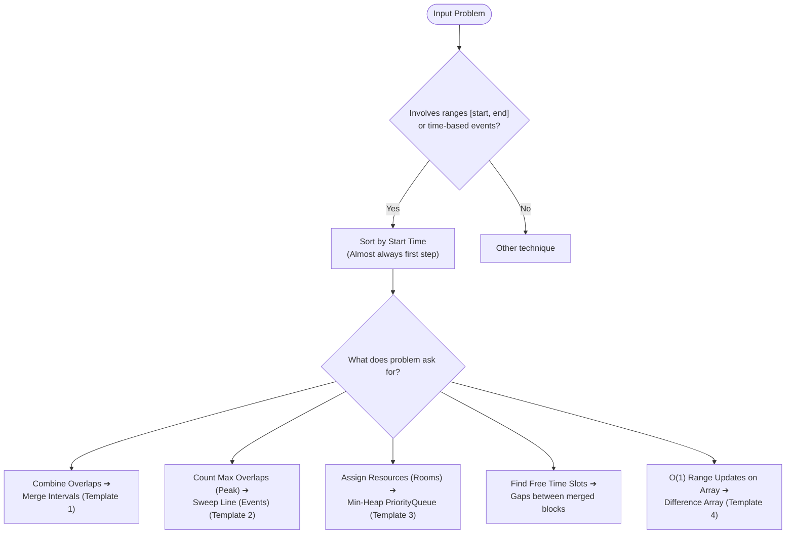

import DsaWeek11IntervalsDiagram from '@site/src/components/DsaWeek11IntervalsDiagram';

# Week 11: Intervals & Sweep Line Algorithms

## 1. Overview

Welcome to Week 11! Having survived the deep recursive trees of Backtracking, we are shifting gears to deal with time, schedules, and overlapping events.

This week covers **Intervals** and the **Sweep Line Algorithm** — patterns that are essential for building calendar applications, resource allocators, and processing chronological logs. You will also heavily use **custom sorting in Java**, transitioning from sorting 1D primitives to sorting 2D arrays and custom objects.

### Why Does This Matter?

Interval problems appear everywhere in real systems:
- **Calendar apps** (Google Calendar, Outlook) — detecting scheduling conflicts, finding free slots
- **Cloud infrastructure** — tracking concurrent server connections to trigger auto-scaling
- **Video streaming** — stitching clips into a continuous playback window
- **Ride-sharing** — surge pricing based on peak concurrent demand

The jump from brute-force $O(N^2)$ to sweep line $O(N \log N)$ is what separates a system that handles 100 concurrent events from one that handles 1 million.

**Goals for this week:**
- Understand how to represent and reason about ranges `[start, end]`.
- Master custom sorting with Java Lambdas and Comparators — and know the overflow trap.
- Master the Interval Merging pattern.
- Master the Sweep Line pattern to find peak overlaps in a single pass.
- Build intuition for when to use Sweep Line vs. Merge vs. Priority Queue.

### Knowledge You Need Before Starting

- Sorting fundamentals and comparator safety (`Integer.compare` over subtraction).
- Comfort with arrays of pairs (`int[][]`) and event modeling.
- Prefix-sum style "delta then accumulate" thinking.
- Ability to reason about inclusive/exclusive interval boundaries.

---

## 2. The Core Mental Models

<DsaWeek11IntervalsDiagram />


### 2.1 Intervals on a Number Line

An interval `[start, end]` is a range on the number line. Visually:



---

### 5.2 Keyword Trigger Table

| Problem Keywords                                       | Technique                     | Key Insight                                                    |
| ------------------------------------------------------ | ----------------------------- | -------------------------------------------------------------- |
| "merge overlapping intervals"                          | Merge Intervals               | Sort by start, extend current end                              |
| "insert interval" into sorted list                     | Merge Intervals               | Find insertion point, merge conflicts                          |
| "non-overlapping intervals" / "minimum removals"       | Greedy + sort by end          | Keep interval ending soonest (greedy)                          |
| "minimum meeting rooms" / "max concurrent connections" | Sweep Line OR Min-Heap        | Sweep: count peaks; Heap: assign rooms                         |
| "find free time slots"                                 | Merge + scan gaps             | Merge all, then find `intervals[i-1].end < intervals[i].start` |
| "car pooling" / "passengers at any point"              | Sweep Line (difference array) | Break trips into +passengers/-passengers events                |
| "corporate flight bookings"                            | Difference Array              | Range updates + one prefix sum pass                            |
| "my calendar" / "detect new booking conflict"          | Interval overlap check        | Insert into sorted structure, check neighbors                  |
| "skyline problem"                                      | Sweep Line + Max-Heap         | Buildings = events; track current max height                   |
| "minimum arrows to burst balloons"                     | Greedy sort by end            | Shoot at rightmost point of earliest-ending balloon            |
| "shifting letters II"                                  | Difference Array              | Letter shift = range update                                    |

---

### 5.3 Common Traps & How to Avoid Them

**Trap 1: Using subtraction in the comparator — silent overflow**

```java
// ❌ WRONG — silent integer overflow for extreme values
Arrays.sort(intervals, (a, b) -> a[0] - b[0]);

// ✅ Always safe
Arrays.sort(intervals, (a, b) -> Integer.compare(a[0], b[0]));
```

---

**Trap 2: Forgetting `Math.max` in the merge step**

```java
// ❌ Wrong — shrinks the current interval if next is fully contained
current[1] = nextEnd;  // Oops: current=[1,10], next=[3,5] → current becomes [1,5]!

// ✅ Always extend to the further endpoint
current[1] = Math.max(current[1], nextEnd);
```

---

**Trap 3: Wrong tie-breaker direction for the problem's endpoint semantics**

```java
// Open endpoints [start, end): end at t=10 and start at t=10 → NOT overlapping
// Sort: process ENDS (-1) before STARTS (+1) at the same time
events.sort((a, b) -> {
    if (a[0] != b[0]) return Integer.compare(a[0], b[0]);
    return Integer.compare(a[1], b[1]);  // -1 before +1 ✅
});

// Closed endpoints [start, end]: end at t=10 and start at t=10 → OVERLAPPING
// Sort: process STARTS (+1) before ENDS (-1) at the same time
events.sort((a, b) -> {
    if (a[0] != b[0]) return Integer.compare(a[0], b[0]);
    return Integer.compare(b[1], a[1]);  // +1 before -1 ✅
});

// Getting this backwards silently changes your peak count by 1!
```

---

**Trap 4: Mutating the input array's intervals during merge**

```java
// ❌ Dangerous: intervals[0] is a reference; mutating it affects the original array
int[] current = intervals[0];
current[1] = Math.max(current[1], nextEnd);  // This modifies intervals[0] in-place

// ✅ Safe if mutation is acceptable (check problem constraints)
// Or copy if not:
int[] current = new int[]{intervals[0][0], intervals[0][1]};
```

---

**Trap 5: Off-by-one in Difference Array — forgetting the `+1` offset**

```java
// Booking [start=2, end=5, val=3]: affects positions 2, 3, 4, 5
// ❌ Wrong: diff[end] -= val  → only undoes from position 5 onward (correct)
//           but diff[end+1] is what's needed when end is inclusive:
diff[end] -= val;    // This undoes at position 5, meaning position 5 is NOT included!

// ✅ Correct for inclusive [start, end]:
diff[start] += val;
diff[end + 1] -= val;  // Undo AFTER position end (inclusive)
```

---

**Trap 6: Not returning early from the Min-Heap approach when the room IS free**

```java
// ❌ Always adds a new room, even when one is free
endTimes.offer(intervals[i][1]);  // Missing the poll() that frees a room

// ✅ Only add a new room if no existing room is free
if (intervals[i][0] >= endTimes.peek()) {
    endTimes.poll();   // Reuse the freeing room
}
endTimes.offer(intervals[i][1]);  // Assign this meeting's end time
```

---

**Trap 7: Skipping the sort step (most common beginner mistake)**

```java
// ❌ Trying to merge without sorting first
// [1,3], [6,9], [2,5] (unsorted)
// Scanning: merge [1,3] and [6,9]? No. Scan [6,9] and [2,5]? No.
// Result: [[1,3],[6,9],[2,5]] — totally wrong!

// ✅ Always sort first
Arrays.sort(intervals, (a, b) -> Integer.compare(a[0], b[0]));
// Now: [1,3], [2,5], [6,9] → correct merge → [[1,5],[6,9]]
```

---

## 6. Worked Examples (Step-by-Step Walkthroughs)

### Example 1: LeetCode 56 — Merge Intervals

**Problem:** Merge all overlapping intervals and return the resulting non-overlapping intervals.

**Thought process:**
1. Without sorting, we'd need to check every pair — $O(N^2)$.
2. After sorting by start, overlaps can only happen between consecutive intervals.
3. Maintain a `current` interval. If the next one overlaps, extend `current`. Otherwise, save `current` and move on.

```
Input: [[1,3],[8,10],[2,6],[15,18]]

Step 1 — Sort by start: [[1,3],[2,6],[8,10],[15,18]]

Step 2 — Scan:
  current = [1,3]
  next = [2,6]:  currentEnd(3) >= nextStart(2)? YES → current = [1, max(3,6)] = [1,6]
  next = [8,10]: currentEnd(6) >= nextStart(8)? NO → save [1,6], current = [8,10]
  next = [15,18]:currentEnd(10)>=nextStart(15)?  NO → save [8,10], current = [15,18]
  End → save [15,18]

Output: [[1,6],[8,10],[15,18]] ✅
```

```java
class Solution {
    public int[][] merge(int[][] intervals) {
        Arrays.sort(intervals, (a, b) -> Integer.compare(a[0], b[0]));
        List<int[]> result = new ArrayList<>();
        int[] current = intervals[0];
        result.add(current);

        for (int[] next : intervals) {
            if (current[1] >= next[0]) {
                current[1] = Math.max(current[1], next[1]);
            } else {
                current = next;
                result.add(current);
            }
        }
        return result.toArray(new int[result.size()][]);
    }
}
```

**Complexity:** Time $O(N \log N)$ for sort + $O(N)$ for scan. Space $O(N)$ for the result list.

---

### Example 2: LeetCode 253 — Meeting Rooms II

**Problem:** Find the minimum number of meeting rooms required to hold all meetings.

**Two approaches — understand both:**

**Approach A: Sweep Line**

```
Meetings: [0,30],[5,10],[15,20]

Events: [0,+1],[5,+1],[10,-1],[15,+1],[20,-1],[30,-1]
Sort:   [0,+1],[5,+1],[10,-1],[15,+1],[20,-1],[30,-1]

Sweep:
  t=0:  active=1 (max=1)
  t=5:  active=2 (max=2)
  t=10: active=1
  t=15: active=2 (max=2)
  t=20: active=1
  t=30: active=0

Answer: 2 rooms ✅
```

**Approach B: Min-Heap**

```
Sorted by start: [0,30],[5,10],[15,20]

heap = [] (tracks end times of active rooms)

[0,30]: heap empty → new room → heap = [30]
[5,10]: earliest end = 30. 5 >= 30? NO → new room → heap = [10, 30]
[15,20]: earliest end = 10. 15 >= 10? YES → reuse! → heap = [20, 30]

heap.size() = 2 → Answer: 2 rooms ✅
```

**When to use which:**
- **Sweep Line:** You only need the count. Simpler code, easier to reason about.
- **Min-Heap:** You need to know *which* room each meeting is assigned to (e.g., "Meeting B goes to Room 2"). The heap explicitly models room availability.

```java
class Solution {
    public int minMeetingRooms(int[][] intervals) {
        Arrays.sort(intervals, (a, b) -> Integer.compare(a[0], b[0]));
        PriorityQueue<Integer> endTimes = new PriorityQueue<>();
        endTimes.offer(intervals[0][1]);

        for (int i = 1; i < intervals.length; i++) {
            if (intervals[i][0] >= endTimes.peek()) {
                endTimes.poll();  // Reuse room
            }
            endTimes.offer(intervals[i][1]);
        }
        return endTimes.size();
    }
}
```

---

### Example 3: LeetCode 57 — Insert Interval

**Problem:** Insert a new interval into a sorted, non-overlapping list of intervals and merge if necessary.

**Thought process:**
1. Three phases: (A) add all intervals that end before the new interval starts, (B) merge all intervals that overlap with the new one, (C) add all remaining intervals.
2. "Ends before new starts" means `interval[1] < newInterval[0]`.
3. "Overlaps with new" means `interval[0] <= newInterval[1]`.

```
intervals = [[1,3],[6,9]], newInterval = [2,5]

Phase A: intervals ending before 2 (newInterval[0])
  [1,3]: 3 < 2? NO → Phase A done

Phase B: merge overlapping
  [1,3]: 1 <= 5 (newInterval end)? YES → merge: newInterval = [min(2,1), max(5,3)] = [1,5]
  [6,9]: 6 <= 5? NO → Phase B done

Phase C: add remaining
  [6,9] added

Result: [[1,5],[6,9]] ✅
```

```java
class Solution {
    public int[][] insert(int[][] intervals, int[] newInterval) {
        List<int[]> result = new ArrayList<>();
        int i = 0, n = intervals.length;

        // Phase A: Add all intervals ending before new interval starts
        while (i < n && intervals[i][1] < newInterval[0]) {
            result.add(intervals[i++]);
        }

        // Phase B: Merge all overlapping intervals into newInterval
        while (i < n && intervals[i][0] <= newInterval[1]) {
            newInterval[0] = Math.min(newInterval[0], intervals[i][0]);
            newInterval[1] = Math.max(newInterval[1], intervals[i][1]);
            i++;
        }
        result.add(newInterval);  // Add the merged interval

        // Phase C: Add remaining intervals (all start after new interval ends)
        while (i < n) result.add(intervals[i++]);

        return result.toArray(new int[result.size()][]);
    }
}
```

**Complexity:** Time $O(N)$ — single pass since input is already sorted. Space $O(N)$ for result.

---

### Example 4: LeetCode 1109 — Corporate Flight Bookings

**Problem:** `bookings[i] = [first, last, seats]` means `seats` seats are reserved for every flight from `first` to `last` (inclusive). Return the total seats reserved for each of the `n` flights.

**Thought process:**
1. Brute force: for each booking, update every flight in `[first, last]` → $O(N \times K)$ where K is average booking range.
2. Insight: we don't need to update each flight individually. We can record "the change starts here" and "the change ends here," then reconstruct the totals in one prefix sum pass.
3. This is the **Difference Array** technique.

```
n=5, bookings = [[1,2,150],[2,3,200],[2,5,100]]

diff = [0, 0, 0, 0, 0, 0, 0]  (indices 0..6, 1-indexed bookings)

[1,2,150]: diff[1]+=150, diff[3]-=150 → [0,150,0,-150,0,0,0]
[2,3,200]: diff[2]+=200, diff[4]-=200 → [0,150,200,-150,-200,0,0]
[2,5,100]: diff[2]+=100, diff[6]-=100 → [0,150,300,-150,-200,0,-100]

Prefix sum (reconstruct answer for flights 1..5):
  flight 1: 0+150 = 150
  flight 2: 150+300 = 450
  flight 3: 450-150 = 300
  flight 4: 300-200 = 100
  flight 5: 100+0 = 100

Answer: [150,450,300,100,100] ✅
```

```java
class Solution {
    public int[] corpFlightBookings(int[][] bookings, int n) {
        int[] diff = new int[n + 2];  // +2 for 1-indexed and safe end+1 write

        for (int[] booking : bookings) {
            int first = booking[0], last = booking[1], seats = booking[2];
            diff[first] += seats;
            diff[last + 1] -= seats;
        }

        int[] answer = new int[n];
        int runningSum = 0;
        for (int i = 1; i <= n; i++) {
            runningSum += diff[i];
            answer[i - 1] = runningSum;
        }

        return answer;
    }
}
```

**Complexity:** Time $O(B + N)$ where B = number of bookings. Space $O(N)$.

---

## 7. Problem-Solving Framework (Use This in Interviews)

### Step 1 — Identify the Core Operation (30 seconds)

Ask yourself:
> "Am I **combining** overlapping ranges?" → Merge Intervals
> "Am I **counting** the maximum concurrent overlap?" → Sweep Line
> "Am I **assigning** resources to events greedily?" → Min-Heap
> "Am I applying **range updates** to an array?" → Difference Array

### Step 2 — State the Sort (say this immediately)

> "First, I'll sort by start time in $O(N \log N)$. This is always the prerequisite."

For Sweep Line, say:
> "I'll break each interval into two events — a +1 at start and -1 at end — and sort all events by time."

### Step 3 — Clarify the Endpoint Semantics

> "Quick question: if one meeting ends at time 5 and another starts at time 5, do they overlap?"

This determines your tie-breaker direction.

### Step 4 — Code the Template, Customize the Condition

The merge condition `currentEnd >= nextStart` is fixed. The only thing that changes between problems is what you *do* when there's an overlap (merge, count, assign).

### Step 5 — Test Edge Cases Out Loud

- Single interval → should return unchanged
- All intervals identical → merge into one, or max concurrent = N
- No overlaps at all → each interval stays separate
- One interval fully contained within another → the `Math.max` handles this
- Intervals that touch but don't overlap (e.g., `[1,5]` and `[5,10]`) → check endpoint semantics!

---

## 8. 7-Day Practice Plan (21 Problems)

**Day 1: Interval Basics**
1. Merge Intervals (LC 56) — *Write from memory — this is the foundation*
2. Insert Interval (LC 57) — *Three-phase scan: before, during, after*
3. Non-overlapping Intervals (LC 435) — *Greedy: keep intervals ending soonest*

> **Day 1 Focus:** For LC 435, the key insight is counterintuitive: sort by **end time** (not start). Greedily keep the interval that ends earliest — it conflicts with the fewest future intervals.

**Day 2: Meeting Rooms & Overlaps**
4. Meeting Rooms (LC 252) — *Simplest overlap check: sort by start, see if any consecutive pair overlaps*
5. Meeting Rooms II (LC 253) — *Implement with both Sweep Line and Min-Heap; understand the tradeoff*
6. Minimum Number of Arrows to Burst Balloons (LC 452) — *Greedy: one arrow at the rightmost point of the earliest-ending balloon*

> **Day 2 Focus:** After solving LC 253 with the Min-Heap, implement it again with Sweep Line. They should give the same answer. Understanding both approaches deeply is what separates good candidates from great ones.

**Day 3: Two-Pointer Interval Interactions**
7. Interval List Intersections (LC 986) — *Two sorted lists, two pointers*
8. Employee Free Time (LC 759) — *Merge all intervals across all employees, find gaps*
9. Car Pooling (LC 1094) — *Sweep Line: passengers board at `from`, exit at `to`*

> **Day 3 Focus:** LC 986 uses a two-pointer approach — one pointer per list. The intersection of `[a,b]` and `[c,d]` is `[max(a,c), min(b,d)]` if `max(a,c) <= min(b,d)`. Then advance the pointer whose interval ends first.

**Day 4: Sweep Line & Events**
10. My Calendar I (LC 729) — *For each new booking, check if it overlaps with any existing one*
11. My Calendar II (LC 731) — *Allow single overlap, reject triple overlap — two sweep maps*
12. Shifting Letters II (LC 2381) — *Difference Array on an alphabet shift*

> **Day 4 Focus:** LC 731 is elegant. Maintain two TreeMaps: one for single overlaps, one for double overlaps. When adding a new booking, check the double-overlap map first.

**Day 5: Advanced Merging & Logic**
13. Teemo Attacking (LC 495) — *Poisoning intervals: process gaps between attacks*
14. Video Stitching (LC 1024) — *Greedy: always pick the clip extending furthest from current position*
15. Remove Covered Intervals (LC 1288) — *Sort by start, break ties by end (descending); count non-covered*

> **Day 5 Focus:** LC 1288 requires a subtle sort: by start ascending, then by end **descending** for ties. This ensures when two intervals have the same start, the larger one comes first and "covers" the smaller one immediately.

**Day 6: 2D Sweep Line & Hard Intervals**
16. The Skyline Problem (LC 218) — *Sweep Line + Max-Heap: buildings as events, track current max height*
17. Rectangle Area II (LC 850) — *Coordinate compression + Sweep Line*
18. Range Module (LC 715) — *Dynamic interval add/remove/query with TreeMap*

> **Day 6 Focus:** LC 218 is the hardest problem this week. Every building contributes two events: `(x_left, -height)` at the left edge (building starts) and `(x_right, height)` at the right edge (building ends). The negative height for starts ensures starts are processed before ends at the same x. Use a Max-Heap to track current max height.

**Day 7: Consolidating Phase 3**
19. Maximum Length of Pair Chain (LC 646) — *Greedy intervals: pick chain with earliest end*
20. Data Stream as Disjoint Intervals (LC 352) — *TreeMap for dynamic interval management*
21. Corporate Flight Bookings (LC 1109) — *Classic Difference Array*

> **Day 7 Focus:** LC 352 is a great system design-adjacent problem. Use a `TreeMap<Integer, Integer>` mapping `start → end`. When adding a new number, find its neighbors using `floorKey` and `ceilingKey`, and merge if they touch.

---

## 9. Mock Interview Module

### Problem: The Ride-Share Surge Pricing Zones

**Context:** A ride-sharing backend receives a log of rides. Each ride is `[request_time, dropoff_time]`. A ride is active from `request_time` (inclusive) to `dropoff_time` (exclusive). Find all time intervals where concurrent rides reach the **absolute daily peak**.

**Question:** `public List<int[]> getPeakSurgeIntervals(int[][] rides)`

---

#### Step 1: Clarifying Questions

- *Candidate:* "Is a ride active at `dropoff_time` itself?" → *Interviewer:* No — `[request_time, dropoff_time)`. If one ride ends at 10 and another starts at 10, they don't overlap.
- *Candidate:* "Can there be multiple disjoint peak intervals?" → *Interviewer:* Yes, return all of them.
- *Candidate:* "Can rides start or end at the same time?" → *Interviewer:* Yes — handle ties correctly.
- *Candidate:* "Are rides sorted by start time?" → *Interviewer:* No, assume arbitrary order.

> **Tip:** The open-endpoint clarification is the most important question here. Getting it wrong silently corrupts the peak count.

---

#### Step 2: Formulating the Strategy

*Candidate's thought process out loud:*
1. "I need to find when the most rides are active simultaneously — this is a Sweep Line problem."
2. "Since rides use open endpoints `[start, end)`, when a start and end happen at the same time, I process the end first. This keeps the count accurate."
3. "Two passes: first find the global `maxActive`, then sweep again to identify the intervals where `currentActive == maxActive`."
4. "A peak interval starts when we *enter* the max, and ends when we *drop below* the max."

---

#### Step 3: Optimized Solution

```java
public List<int[]> getPeakSurgeIntervals(int[][] rides) {
    if (rides == null || rides.length == 0) return new ArrayList<>();

    // Step 1: Build events — open endpoint means end (-1) before start (+1) at same time
    List<int[]> events = new ArrayList<>();
    for (int[] ride : rides) {
        events.add(new int[]{ride[0], 1});   // Start: +1
        events.add(new int[]{ride[1], -1});  // End: -1
    }
    events.sort((a, b) -> a[0] != b[0] ? Integer.compare(a[0], b[0])
                                        : Integer.compare(a[1], b[1]));  // -1 before +1

    // Step 2: First pass — find the global peak
    int currentActive = 0, maxActive = 0;
    for (int[] event : events) {
        currentActive += event[1];
        maxActive = Math.max(maxActive, currentActive);
    }

    // Step 3: Second pass — collect intervals where currentActive == maxActive
    List<int[]> peakIntervals = new ArrayList<>();
    currentActive = 0;
    Integer peakStart = null;

    for (int[] event : events) {
        currentActive += event[1];

        if (currentActive == maxActive && peakStart == null) {
            peakStart = event[0];  // Just entered peak zone
        } else if (currentActive < maxActive && peakStart != null) {
            if (peakStart < event[0]) {  // Avoid zero-length intervals
                peakIntervals.add(new int[]{peakStart, event[0]});
            }
            peakStart = null;  // Exited peak zone
        }
    }

    return peakIntervals;
}
```

**Walkthrough:**

```
rides = [[1,5],[2,4],[3,7],[6,8]]

Events (sorted, ends before starts at same time):
  [1,+1],[2,+1],[3,+1],[4,-1],[5,-1],[6,+1],[7,-1],[8,-1]

First pass:
  active: 1,2,3,2,1,2,1,0   → maxActive = 3

Second pass (looking for active == 3):
  t=1: active=1  (not peak)
  t=2: active=2  (not peak)
  t=3: active=3  → peakStart = 3   ← ENTER peak
  t=4: active=2  → save [3,4]      ← EXIT peak, peakStart=null
  t=5: active=1  (not peak)
  t=6: active=2  (not peak)
  t=7: active=1  (not peak)
  t=8: active=0  (not peak)

Result: [[3,4]] ✅ (3 rides active from time 3 to 4)
```

---

#### Step 4: Follow-up Questions

**Follow-up 1 (Single Pass):**
*Interviewer:* "Can you do this in a single pass instead of two?"

*Expected thought process:*
- Yes. During the single pass, if `currentActive > maxActive`, the peak just increased. Everything in `peakIntervals` so far is outdated (it was the old max). **Clear the list**, update `maxActive`, start a new `peakStart`.
- If `currentActive == maxActive`, we just re-entered the peak (could be a new disjoint peak interval at the same level). Record the start.
- If `currentActive < maxActive`, close the current peak interval.
- This is $O(N \log N)$ still (dominated by sorting), but removes the second linear scan.

```java
// Single-pass sketch:
for (int[] event : events) {
    currentActive += event[1];
    if (currentActive > maxActive) {
        maxActive = currentActive;
        peakIntervals.clear();  // Previous peaks were at a lower level
        peakStart = event[0];
    } else if (currentActive == maxActive && peakStart == null) {
        peakStart = event[0];
    } else if (currentActive < maxActive && peakStart != null) {
        peakIntervals.add(new int[]{peakStart, event[0]});
        peakStart = null;
    }
}
```

**Follow-up 2 (Real-Time Streaming):**
*Interviewer:* "Rides are arriving as a live stream. How do you maintain peak intervals in real time?"

*Expected thought process:*
- The current approach requires all rides upfront to sort. With streaming, sorting isn't possible.
- Use a **TreeMap** (sorted map) to maintain events: `TreeMap<Integer, Integer>` mapping `time → netChange` (like a difference array, but dynamic).
- On each new ride: `map.merge(start, +1, Integer::sum)` and `map.merge(end, -1, Integer::sum)`.
- To query current peak: scan the TreeMap's entries in order, running a prefix sum. Peak is the max. This is $O(N)$ per query.
- For truly real-time performance: maintain a running `maxActive` variable and update it after each new ride's events are inserted. Recompute only the affected portion of the timeline.

**Follow-up 3 (Scale — 1 Billion Rides):**
*Interviewer:* "The platform processes 1 billion rides per day. Memory is limited to 4GB."

*Expected thought process:*
- 1 billion rides × 2 events × 8 bytes = 16GB. Too large for in-memory sorting.
- **External sort:** Stream rides to disk, sort in chunks that fit in memory, then merge-sort the chunk files.
- **Distributed Sweep Line:** Partition rides by time window (e.g., each server handles one hour). Each server runs the sweep independently. At boundaries, reconcile the carry-over `currentActive` from the previous server.
- **Streaming approximation:** Use a **sliding window count** — only track rides in a rolling time window, evicting old ones. For exact peaks, exact algorithms are required; for dashboards, approximate counts via HyperLogLog or count-min sketch are sufficient.

---

## 10. Connecting to Other Weeks

Intervals connect backwards and forwards across the entire roadmap:

```
Week 2 (Sliding Window) + Week 11 (Intervals):
  → Sliding window = a fixed-size interval moving across an array
  → Variable sliding window = a dynamic interval with changing endpoints
  → Interval merging = identifying when windows should be combined

Week 5 (Priority Queue) + Week 11 (Intervals):
  → Meeting Rooms II = Min-Heap of end times
  → Skyline Problem = Max-Heap of building heights
  → Heap manages "what's currently active" efficiently

Week 9 (Binary Search) + Week 11 (Intervals):
  → My Calendar I: binary search in a sorted interval list for conflict detection
  → Data Stream as Disjoint Intervals: TreeMap provides O(log N) neighbor lookup
  → Kth smallest interval: binary search on interval index after merging

Week 11 (Sweep Line) → System Design:
  → Database range queries: B-tree = sorted interval structure
  → Network traffic analysis: sweep line on packet timestamps
  → Calendar conflict detection: interval overlap is the core primitive
  → CDN cache eviction: LRU is intervals of access times on a timeline
```

---

## 11. Quick Reference Cheat Sheet

```
╔══════════════════════════════════════════════════════════════╗
║         INTERVALS & SWEEP LINE CHEAT SHEET                  ║
╠══════════════════════════════════════════════════════════════╣
║ ALWAYS SORT BY START TIME FIRST                              ║
║   Arrays.sort(intervals, (a,b) -> Integer.compare(a[0],b[0]))║
║   NEVER use subtraction in comparators (overflow risk!)      ║
╠══════════════════════════════════════════════════════════════╣
║ MERGE INTERVALS                                              ║
║   If currentEnd >= nextStart → merge                        ║
║   current[1] = Math.max(current[1], next[1])  ← use max!   ║
║   Else → save current, move to next                         ║
╠══════════════════════════════════════════════════════════════╣
║ SWEEP LINE                                                   ║
║   Break into events: [time, +1] start, [time, -1] end       ║
║   Tie-breaker: open endpoints → -1 before +1               ║
║                closed endpoints → +1 before -1             ║
║   Running sum = current active count                        ║
╠══════════════════════════════════════════════════════════════╣
║ MIN-HEAP (Resource Assignment)                               ║
║   PriorityQueue<Integer> endTimes = new PriorityQueue<>()   ║
║   If meeting starts >= heap.peek() → poll() (reuse room)    ║
║   Always offer(meeting.end)                                  ║
║   heap.size() = rooms needed                                ║
╠══════════════════════════════════════════════════════════════╣
║ DIFFERENCE ARRAY (Range Updates)                             ║
║   diff[start] += val                                        ║
║   diff[end + 1] -= val  ← inclusive end needs +1           ║
║   One prefix sum pass reconstructs the final array          ║
╠══════════════════════════════════════════════════════════════╣
║ OVERLAP CONDITION                                            ║
║   [a,b] and [c,d] overlap if: a<=d AND c<=b               ║
║   Don't overlap if: b<c OR d<a                             ║
╠══════════════════════════════════════════════════════════════╣
║ COMPLEXITY                                                   ║
║   All patterns: O(N log N) sort + O(N) scan                 ║
║   Difference Array: O(B + N) where B = number of bookings   ║
╚══════════════════════════════════════════════════════════════╝
```

---

## 12. What's Coming Next

**Week 12: Greedy Algorithms** — which connects directly to this week:
- Many interval problems ARE greedy problems in disguise. "Non-overlapping Intervals" (LC 435) uses a greedy strategy: always keep the interval that ends earliest. The proof of correctness is a classic greedy argument.
- Activity Selection Problem — the textbook greedy algorithm — is an interval problem.
- Understanding when sorting by end time (not start time) is the right choice is a core greedy insight.

**Week 13+: Dynamic Programming** — where intervals appear as state boundaries:
- Many DP problems partition arrays into intervals and optimize over the partition.
- "Burst Balloons" (LC 312) and "Strange Printer" (LC 664) both define DP states as interval boundaries.
- The interval merge pattern becomes a DP substructure in problems like "Minimum Cost to Cut a Stick."

**The meta-skill intervals teach:** Any time you have events in time (or values on a number line), your first instinct should be to sort and sweep. This transforms $O(N^2)$ pairwise comparisons into $O(N)$ linear scans — a pattern that appears across scheduling, geometry, and system monitoring.