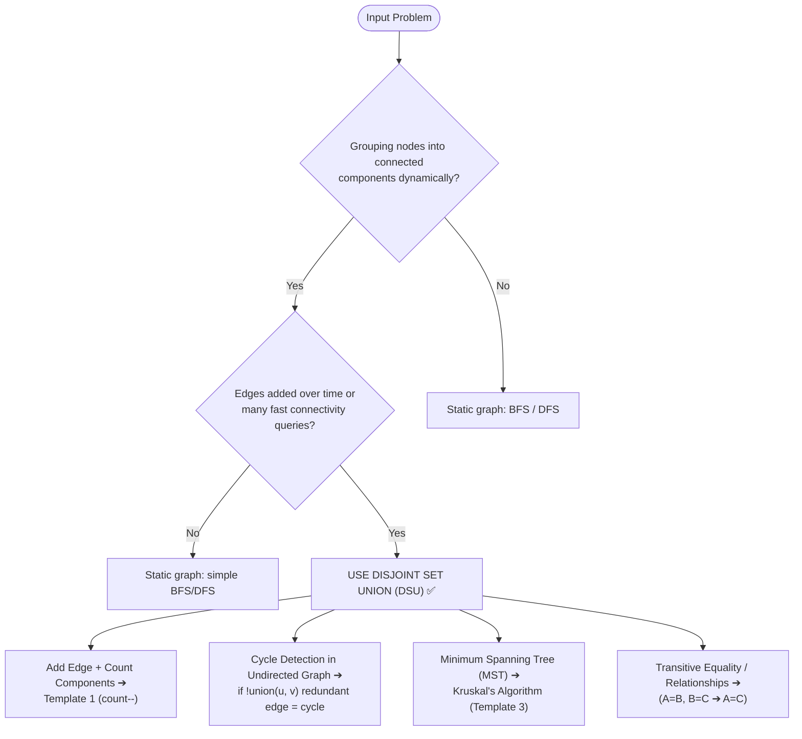

import DsaWeek18DsuDiagram from '@site/src/components/DsaWeek18DsuDiagram';

# Week 18: Disjoint Set Union (Union-Find)

## 1. Overview

Welcome to Week 18! Last week we conquered finding paths in static graphs. But what if the graph is *dynamic*? What if new edges are being added in real-time, and you need to constantly answer: "Are Node A and Node B connected?"

Running BFS/DFS every time an edge is added takes $O(V + E)$ per query — far too slow for real-time systems processing millions of events. Enter the **Disjoint Set Union (DSU)**, also called **Union-Find**: an elegant, array-based data structure that solves dynamic connectivity and cycle detection in nearly $O(1)$ amortized time.

### Why Does This Matter?

DSU powers some of the most fundamental infrastructure algorithms:
- **Kruskal's MST** — building minimum spanning trees for network design ($O(E \log E)$ sorting + $O(E \cdot \alpha(N))$ DSU)
- **Dynamic connectivity** — real-time tracking of connected components as edges are added
- **Cycle detection** — instantly detecting when a new edge creates a redundant connection
- **Social network grouping** — merging friend circles, account deduplication, transitive relationships

**Goals for this week:**
- Build a deep understanding of the array-based tree representation.
- Master the two critical optimizations: **Path Compression** and **Union by Rank**.
- Understand the Inverse Ackermann function and why it makes DSU effectively $O(1)$.
- Know when to choose DSU over BFS/DFS and when the reverse is true.
- Apply the **Reverse-Time Trick** for edge deletion problems.

### Knowledge You Need Before Starting

- Graph connectivity thinking from Weeks 7, 8, and 17.
- Array-based parent/rank bookkeeping comfort.
- Familiarity with amortized analysis (not just worst-case only).
- Clear understanding of when queries are dynamic vs static.

---

## 2. The Core Mental Models

<DsaWeek18DsuDiagram />


### 2.1 The "Political Parties" Model

Imagine 6 people, each initially their own independent "party":



---

### 5.2 Keyword Trigger Table

| Problem Keywords                                            | Technique                    | Key Signal                                            |
| ----------------------------------------------------------- | ---------------------------- | ----------------------------------------------------- |
| "dynamic connectivity" / "edges added one by one"           | DSU                          | Natural fit for incremental union                     |
| "redundant connection" / "detect cycle in undirected graph" | DSU cycle detection          | `union()` returns `false` = cycle                     |
| "number of connected components"                            | DSU with `count`             | `count--` on successful union                         |
| "minimum spanning tree"                                     | Kruskal's (DSU + sort edges) | Sort by weight, union if different components         |
| "merge accounts" / "group by transitive relationship"       | DSU + HashMap                | Map email/ID → node index, then union                 |
| "satisfiability of equality equations"                      | DSU                          | A==B → union(A,B); A!=B → check connected             |
| "lexicographically smallest equivalent"                     | DSU with min-root            | Merge groups, always use smallest char as root        |
| "offline queries about connectivity"                        | Reverse-time DSU             | Process queries backwards; deletions become additions |
| "number of islands" (dynamic, edges added)                  | DSU grid                     | Flatten 2D → 1D, check bounds                         |
| "weighted DSU" / "evaluate division"                        | DSU with ratio tracking      | Store weights on edges from node to root              |

---

### 5.3 Common Traps & How to Avoid Them

**Trap 1: Forgetting to call `find()` before comparing roots**

```java
// ❌ Comparing root[] directly — doesn't account for path compression state
if (root[x] == root[y]) { ... }  // Wrong! root[x] might not be the true root

// ✅ Always use find() which traverses to the actual root
if (find(x) == find(y)) { ... }
```

---

**Trap 2: Using DSU for problems that require actual path reconstruction**

```java
// ❌ DSU can tell you IF two nodes are connected, but NOT the actual path
uf.connected(0, 5);  // → true, but you can't extract the path 0→2→3→5

// ✅ For "find the shortest path" or "print the route": use BFS/DFS instead
```

---

**Trap 3: Not initializing `root[i] = i` (every node is its own root initially)**

```java
// ❌ Zero-initialized — all nodes incorrectly point to node 0 as root
int[] root = new int[n];  // All zeros → root[i] = 0 for all i → WRONG

// ✅ Each node must initially be its own root
for (int i = 0; i < n; i++) root[i] = i;
```

---

**Trap 4: Incrementing rank unconditionally instead of only when ranks are equal**

```java
// ❌ Always increments rank — destroys the height invariant
if (rank[rootX] >= rank[rootY]) {
    root[rootY] = rootX;
    rank[rootX]++;  // Wrong when rank[rootX] > rank[rootY]! Height didn't change.
}

// ✅ Only increment when merging equal-rank trees (tree height actually increases)
if (rank[rootX] == rank[rootY]) {
    root[rootY] = rootX;
    rank[rootX]++;  // Now the merged tree IS one taller
} else if (rank[rootX] > rank[rootY]) {
    root[rootY] = rootX;  // No rank change: shorter tree goes under taller
}
```

---

**Trap 5: Applying DSU to weighted/directed edges without adapting for weights**

```java
// Problem: Evaluate Division (weighted DSU)
// Standard DSU can't express "A/B = 2.0" — the ratio is on the edge, not the node.
// Need a weighted DSU where find() also computes the accumulated ratio.

// ❌ Standard DSU loses the weight information
uf.union(a, b);  // Merges, but ratio a/b = 2.0 is discarded

// ✅ Weighted DSU tracks ratios from each node to its root
double[] weight = new double[n];  // weight[x] = x / root[x]
// find() must multiply weights as it traverses up and compress
```

---

**Trap 6: 1D index calculation for 2D grid DSU — wrong formula**

```java
// Grid is rows × cols
// ❌ Wrong: row + col * rows (transposes the calculation)
int idx = r + c * rows;  // Will map (1,0) to same as (0,1) for square grids!

// ✅ Correct: row * cols + col (like reading a book: row by row)
int idx = r * cols + c;
// Verify: (0,0)=0, (0,1)=1, (1,0)=cols, (1,1)=cols+1 ✅
```

---

**Trap 7: Forgetting that "offline" problems (deletion queries) need the Reverse-Time Trick**

```java
// ❌ Trying to remove edges from DSU directly — impossible
uf.remove(u, v);  // This method doesn't exist. You can't un-merge in DSU.

// ✅ Reverse time: start from the final state, add edges back in reverse order
// Build the final (most broken) state, then process deletion queries backwards.
```

---

## 6. Worked Examples (Step-by-Step Walkthroughs)

### Example 1: LeetCode 684 — Redundant Connection

**Problem:** A tree with `n` nodes had one extra edge added. Find the edge that, if removed, would restore the tree. Return the edge appearing last in the input.

**Thought process:**
1. A tree with N nodes has exactly N-1 edges. One extra edge was added → one edge creates a cycle.
2. Process edges in order. When `union(u, v)` returns `false`, nodes `u` and `v` are already connected — this edge creates the cycle → return it.

```
edges = [[1,2],[1,3],[2,3]]

Initial: root=[0,1,2,3], rank=[0,1,1,1]

Process [1,2]: find(1)=1, find(2)=2 → different → union → root[2]=1, rank[1]=2
               root=[0,1,1,3]

Process [1,3]: find(1)=1, find(3)=3 → different → union → root[3]=1
               root=[0,1,1,1]

Process [2,3]: find(2)=find(1)=1, find(3)=1 → SAME! union returns false
               → [2,3] is the redundant edge ✅
```

```java
class Solution {
    public int[] findRedundantConnection(int[][] edges) {
        int n = edges.length;
        UnionFind uf = new UnionFind(n + 1);  // 1-indexed nodes

        for (int[] edge : edges) {
            if (!uf.union(edge[0], edge[1])) {
                return edge;  // This edge connects already-connected nodes → cycle
            }
        }
        return new int[0];
    }
}
```

**Complexity:** Time $O(N \cdot \alpha(N)) \approx O(N)$. Space $O(N)$.

---

### Example 2: LeetCode 721 — Accounts Merge

**Problem:** Each account has a name and a list of emails. Two accounts are the same person if they share at least one email. Merge all accounts belonging to the same person.

**Thought process:**
1. This is a classic transitive-relationship grouping problem: if email X and email Y appear in the same account, they belong to the same person (union them).
2. Use a HashMap to assign each unique email an integer ID for DSU.
3. For each account, union the first email with every other email in that account.
4. After all unions, group emails by their root ID. Sort each group and prepend the account name.

```
accounts = [["John","a@j.com","b@j.com"],
            ["John","c@j.com"],
            ["Mary","d@m.com"],
            ["John","b@j.com","c@j.com"]]

Step 1: Assign IDs: a@j.com→0, b@j.com→1, c@j.com→2, d@m.com→3

Step 2: Process accounts:
  Account 0 (John): union(0,1) → a and b are the same person
  Account 1 (John): no other emails in account (just c@j.com alone)
  Account 2 (Mary): no other emails in account
  Account 3 (John): union(1,2) → b and c are the same person
                    Now: find(0)=find(1)=find(2) (all same root!)

Step 3: Group by root:
  root 0: [a@j.com, b@j.com, c@j.com] → John
  root 3: [d@m.com] → Mary

Result: [["John","a@j.com","b@j.com","c@j.com"],["Mary","d@m.com"]] ✅
```

```java
class Solution {
    public List<List<String>> accountsMerge(List<List<String>> accounts) {
        Map<String, Integer> emailToId = new HashMap<>();
        Map<String, String> emailToName = new HashMap<>();
        int id = 0;

        // Assign IDs to all unique emails
        for (List<String> account : accounts) {
            String name = account.get(0);
            for (int i = 1; i < account.size(); i++) {
                String email = account.get(i);
                if (!emailToId.containsKey(email)) {
                    emailToId.put(email, id++);
                    emailToName.put(email, name);
                }
            }
        }

        UnionFind uf = new UnionFind(id);

        // Union all emails within the same account
        for (List<String> account : accounts) {
            int firstId = emailToId.get(account.get(1));
            for (int i = 2; i < account.size(); i++) {
                uf.union(firstId, emailToId.get(account.get(i)));
            }
        }

        // Group emails by their root
        Map<Integer, List<String>> groups = new HashMap<>();
        for (String email : emailToId.keySet()) {
            int root = uf.find(emailToId.get(email));
            groups.computeIfAbsent(root, k -> new ArrayList<>()).add(email);
        }

        // Build result
        List<List<String>> result = new ArrayList<>();
        for (List<String> emails : groups.values()) {
            Collections.sort(emails);
            emails.add(0, emailToName.get(emails.get(0)));
            result.add(emails);
        }
        return result;
    }
}
```

---

### Example 3: LeetCode 1584 — Min Cost to Connect All Points (Kruskal's)

**Problem:** Given `n` points on a plane, connect all points with minimum total Manhattan distance.

**Thought process:**
1. This is the MST problem on a complete graph (every point can connect to every other).
2. Use Kruskal's: generate all edges (pairs), sort by distance, union greedily.

```
points = [[0,0],[2,2],[3,10],[5,2],[7,0]]

Step 1: Generate all O(N²) edges with Manhattan distances.

Step 2: Sort edges by distance (ascending).

Step 3: Kruskal's — union cheapest edges that don't create cycles:
  Edge (0,3): dist=|0-5|+|0-2|=7 → union(0,3) → MST weight=7, edges=1
  Edge (3,4): dist=|5-7|+|2-0|=4 → union(3,4) → MST weight=11, edges=2
  Edge (0,1): dist=|0-2|+|0-2|=4 → union(0,1) → MST weight=15, edges=3
  Edge (1,2): dist=|2-3|+|2-10|=9 → union(1,2) → MST weight=24, edges=4
  N-1=4 edges done!

Answer: 20 ✅ (the actual distances differ — this is illustrative)
```

```java
class Solution {
    public int minCostConnectPoints(int[][] points) {
        int n = points.length;
        // Generate all edges
        List<int[]> edges = new ArrayList<>();
        for (int i = 0; i < n; i++) {
            for (int j = i + 1; j < n; j++) {
                int dist = Math.abs(points[i][0] - points[j][0])
                         + Math.abs(points[i][1] - points[j][1]);
                edges.add(new int[]{dist, i, j});
            }
        }

        // Sort by distance (Kruskal's requires sorted edges)
        edges.sort((a, b) -> Integer.compare(a[0], b[0]));

        UnionFind uf = new UnionFind(n);
        int totalCost = 0, edgesUsed = 0;

        for (int[] edge : edges) {
            if (uf.union(edge[1], edge[2])) {
                totalCost += edge[0];
                if (++edgesUsed == n - 1) break;  // MST complete
            }
        }

        return totalCost;
    }
}
```

**Complexity:** Time $O(N^2 \log N)$ — $N^2$ edges, sorting dominates. Space $O(N^2)$ for edge list.

---

### Example 4: LeetCode 990 — Satisfiability of Equality Equations

**Problem:** Given equations like `"a==b"`, `"b!=c"`, `"a==c"`, determine if all equations can be satisfied simultaneously.

**Thought process:**
1. `==` equations define transitive equality groups → DSU (union equal pairs).
2. `!=` equations are constraints → check if the pair is in the same group.
3. **Two-pass approach:** First process all `==` equations (build the groups). Then verify all `!=` equations (check for contradictions).

```
equations = ["a==b","b!=c","c==a"]

Pass 1 (== only):
  "a==b": union('a','b') → group {a,b}
  "c==a": union('c','a') → group {a,b,c}

Pass 2 (!= only):
  "b!=c": find('b') == find('c')? find(b)=root of {a,b,c} = root of {a,b,c}
  They ARE connected → "b!=c" is a CONTRADICTION → return false ✅
```

```java
class Solution {
    public boolean equationsPossible(String[] equations) {
        UnionFind uf = new UnionFind(26);  // 26 lowercase letters

        // Pass 1: process all == equations
        for (String eq : equations) {
            if (eq.charAt(1) == '=') {
                uf.union(eq.charAt(0) - 'a', eq.charAt(3) - 'a');
            }
        }

        // Pass 2: verify all != equations
        for (String eq : equations) {
            if (eq.charAt(1) == '!') {
                if (uf.connected(eq.charAt(0) - 'a', eq.charAt(3) - 'a')) {
                    return false;  // Contradiction: says != but they're in same group
                }
            }
        }
        return true;
    }
}
```

**Why two passes?** If we process `!=` before all `==`, we might incorrectly reject a valid state. For example, if `"a!=b"` comes before `"a==c"` and `"b==c"`, we need to know `a` and `b` are in the same group (via `c`) before we can detect the contradiction.

---

## 7. Problem-Solving Framework (Use This in Interviews)

### Step 1 — Recognize DSU Applicability (30 seconds)

Ask yourself:
> "Am I grouping nodes by connectivity? Are edges being added over time? Is this a cycle-detection or MST problem?"

### Step 2 — Identify the Nodes (1 minute)

DSU nodes don't have to be graph nodes — they can be:
- Characters (mapped to 0-25 for 26 letters)
- Email addresses (mapped via HashMap to integer IDs)
- Grid cells (flattened: `row * cols + col`)
- Numbers (used as direct indices)

State out loud: *"My DSU will have `n = ___` nodes. I'll map `___` to indices by `___`."*

### Step 3 — Identify the Union Operations (1 minute)

> "I call `union(x, y)` when ___. I know a cycle is detected when `union()` returns `false`."

### Step 4 — Decide on Rank vs. Size (30 seconds)

> "I'll use Union by Size because the problem asks for the largest component size." OR
> "I'll use Union by Rank — simpler and I don't need exact component sizes."

### Step 5 — Handle the Two-Pass Pattern if Needed

For equality/inequality problems:
> "First I'll process all equalities to build groups. Then I'll verify all inequalities to check for contradictions."

### Step 6 — State the Complexity

> "Building the DSU: $O(N)$. Each `find`/`union`: $O(\alpha(N)) \approx O(1)$. Processing `E` edges: $O(E \cdot \alpha(N)) \approx O(E)$. Total: $O(N + E)$."

---

## 8. 7-Day Practice Plan (21 Problems)

**Day 1: DSU Fundamentals**
1. Number of Provinces (LC 547) — *Direct `union` on adjacency matrix; `getCount()` is the answer*
2. Redundant Connection (LC 684) — *First `union()` returning `false` = the redundant edge*
3. Graph Valid Tree (LC 261) — *A valid tree has exactly `n-1` edges and no cycles; check both*

> **Day 1 Focus:** After solving LC 547 with DSU, solve it again with DFS. Count the lines of code each takes. Appreciate why DSU is preferred when you don't need to actually traverse the path.

**Day 2: Advanced Cycle Detection & Components**
4. Number of Connected Components (LC 323) — *After all unions, `getCount()` is the answer*
5. Accounts Merge (LC 721) — *HashMap assigns email→ID; then union emails in same account*
6. Satisfiability of Equality Equations (LC 990) — *Two-pass: union all `==`, then verify `!=`*

> **Day 2 Focus:** LC 721 is the most realistic interview problem this week. Practice the `email → ID → DSU → group by root → sort and format` pipeline until it flows naturally.

**Day 3: Minimum Spanning Tree (Kruskal's)**
7. Min Cost to Connect All Points (LC 1584) — *Generate all N² edges, sort, Kruskal's*
8. Find Critical and Pseudo-Critical Edges in MST (LC 1489) — *Hard: force-include or force-exclude edges*
9. Connecting Cities With Minimum Cost (LC 1135) — *Direct Kruskal's on given edges*

> **Day 3 Focus:** After solving LC 1584 with Kruskal's, compare your solution with Prim's (from last week). Kruskal's: $O(N^2 \log N)$ due to edge generation. Prim's with a heap: $O(N^2 \log N)$ too. For dense graphs (this problem), Prim's with an array-based min is actually $O(N^2)$ — faster!

**Day 4: Dynamic Connectivity & Grids**
10. Number of Islands II (LC 305) — *Dynamic: add land cells one at a time; DSU handles incrementally*
11. Regions Cut By Slashes (LC 959) — *Scale grid 3×: each cell becomes a 3×3, then grid DSU*
12. Max Area of Island (LC 695) — *Review: solve with DSU using Size template; `getSize(cell)`*

> **Day 4 Focus:** LC 305 is the canonical dynamic grid problem. Without DSU, you'd need BFS for each land addition: $O(K \cdot M \cdot N)$. With DSU: $O(K \cdot \alpha(MN)) \approx O(K)$.

**Day 5: Math & String Relationships**
13. Lexicographically Smallest Equivalent String (LC 1061) — *Union char groups; root = min char in group*
14. Evaluate Division (LC 399) — *Hard: weighted DSU; track ratio from node to root*
15. Smallest String With Swaps (LC 1202) — *Union swappable positions; sort each component's chars*

> **Day 5 Focus:** LC 1061 requires a twist: when merging two groups, the root should be the lexicographically smallest character. Customize `union()` to always use the smaller character as the new root.

**Day 6: Advanced Matrix Unions**
16. Surrounded Regions (LC 130) — *Union all border-connected 'O's to a "dummy" boundary node; others get captured*
17. Number of Operations to Make Network Connected (LC 1319) — *Need at least `components-1` spare cables*
18. Checking Existence of Edge Length Limited Paths (LC 1697) — *Sort queries and edges by limit; offline DSU*

> **Day 6 Focus:** LC 1319's key insight: to connect `k` components into 1, you need `k-1` new edges. Count spare edges (edges that don't increase connectivity = `union()` returns `false`). If `spares >= components - 1`, it's possible.

**Day 7: The Final Bosses of DSU**
19. Largest Component Size by Common Factor (LC 952) — *Union numbers with their prime factors as intermediate nodes*
20. Minimize Malware Spread (LC 924) — *Union all non-infected nodes; find the infected node whose removal maximizes the largest clean component*
21. Remove Max Number of Edges to Keep Graph Fully Traversable (LC 1579) — *Two DSUs: one for Alice, one for Bob; greedily use type-3 (shared) edges first*

> **Day 7 Focus:** LC 1579 is the most elegant DSU problem this week. Use type-3 edges first (they benefit both Alice and Bob simultaneously). Then process type-1 and type-2 edges separately for each person's DSU. Any edge that doesn't reduce the component count in its DSU is removable.

---

## 9. Mock Interview Module

### Problem: The Distributed Network Splitter

**Context:** A distributed database cluster has `n` nodes. You're given a list of `connections`. A disaster script severs cables one by one (given as `queries[]` — indices into `connections`). After each severing, how many isolated clusters remain?

**Question:** `public int[] getClusterCount(int n, int[][] connections, int[] queries)`

---

#### Step 1: Clarifying Questions

- *Candidate:* "Are there duplicate edges in connections?" → *Interviewer:* No.
- *Candidate:* "Can a query index appear multiple times?" → *Interviewer:* Assume each cable is severed at most once.
- *Candidate:* "Do queries sever all connections eventually?" → *Interviewer:* Not necessarily — some survive.
- *Candidate:* "Are nodes 0-indexed or 1-indexed?" → *Interviewer:* 0-indexed.

> **Tip:** The 0-vs-1 indexing question saves you from silent bugs. Always confirm.

---

#### Step 2: Formulating the Strategy

*Candidate's thought process out loud:*
1. "DSU is great at adding edges. But this problem removes edges — which DSU can't do."
2. "Key insight: **Reverse time.** If I process deletion queries backwards, they become addition queries."
3. "Start with the graph in its final, most broken state (after all queried cables are destroyed)."
4. "Iterate queries in reverse: 'add back' each cable using `union()`. Record `count` before each addition (what the cluster count was just before this cable was restored, i.e., just after it was severed in forward time)."
5. "Reverse the result array at the end to get chronological order."

---

#### Step 3: Optimized Solution

```java
public int[] getClusterCount(int n, int[][] connections, int[] queries) {
    UnionFind uf = new UnionFind(n);

    // Mark which connections are severed by any query
    boolean[] isDestroyed = new boolean[connections.length];
    for (int q : queries) isDestroyed[q] = true;

    // Build the final broken state: only add connections that survive ALL queries
    for (int i = 0; i < connections.length; i++) {
        if (!isDestroyed[i]) {
            uf.union(connections[i][0], connections[i][1]);
        }
    }

    // Process queries in REVERSE (adding cables back = reverse of severing)
    int[] result = new int[queries.length];
    for (int i = queries.length - 1; i >= 0; i--) {
        // Record count BEFORE adding the cable back
        // (this represents the count AFTER the cable was severed in forward time)
        result[i] = uf.getCount();

        // Add the cable back (reverse of severing)
        int idx = queries[i];
        uf.union(connections[idx][0], connections[idx][1]);
    }

    return result;
}
```

**Trace through a small example:**

```
n=4, connections=[[0,1],[1,2],[2,3]], queries=[2,0]

Step 1: Severed cables: {0, 2}
        Surviving cable: [1,2]
        Build final state: union(1,2)
        DSU: {0}, {1,2}, {3} → count=3

Step 2: Process queries in reverse:

  i=1 (query=0, cable=[0,1]):
    result[1] = getCount() = 3  ← after cable [0,1] was severed
    union(0,1) → {0,1}, {1,2}, {3} → hmm, find(0)=0, find(1)=1 (separate)
                                     union → {0,1,2}, {3} → count=2

  i=0 (query=2, cable=[2,3]):
    result[0] = getCount() = 2  ← after cable [2,3] was severed
    union(2,3) → {0,1,2,3} → count=1

result = [2, 3]  ✅
(After severing cable[2]=[2,3]: 2 clusters. After also severing cable[0]=[0,1]: 3 clusters.)
```

---

#### Step 4: Follow-up Questions

**Follow-up 1 (Optimization tradeoff):**
*Interviewer:* "You used both Path Compression and Union by Rank. If you removed Union by Rank but kept Path Compression, what happens to the worst-case complexity?"

*Expected answer:*
- Without Union by Rank, an adversary can create a chain: `union(0,1), union(1,2), ... union(N-1, N)` — building a perfectly linear tree.
- Calling `find(N)` on this chain traverses N nodes (once, before compression). That's $O(N)$ worst-case for a single call.
- However, path compression makes subsequent calls $O(1)$. Amortized over many calls, the bound is $O(\log N)$ — not as good as $O(\alpha(N))$ with both, but still sublinear.
- **Summary:** Path Compression only → $O(\log N)$ amortized. Both → $O(\alpha(N))$ amortized. Never omit both.

**Follow-up 2 (Weighted DSU):**
*Interviewer:* "Now each connection has a latency (weight). After each severing, report both cluster count AND the maximum latency within any remaining cluster. How does the DSU change?"

*Expected thought process:*
- Track `maxLatency[root]` = the maximum edge weight in the component rooted at `root`.
- When `union(x, y)` merges two components: `maxLatency[newRoot] = max(maxLatency[rootX], maxLatency[rootY], edge_weight)`.
- Path compression doesn't affect latency tracking (latency is per-component, not per-node).
- Time: still $O(\alpha(N))$ per operation — the weight update is $O(1)$.

**Follow-up 3 (Concurrent severing):**
*Interviewer:* "Multiple disaster scripts run simultaneously, severing cables concurrently. The `queries` now represent concurrent batches: all cables in `queries[i]` are severed at the same time. You still need the cluster count after each batch."

*Expected thought process:*
- The reverse-time trick still works: process batches in reverse, adding back all cables in each batch.
- In the reverse pass, for each batch (reversed): record count, then union all cables in the batch.
- Complexity: $O((C + \sum |query_i|) \cdot \alpha(N))$ where $C$ is total connections and each query is a batch.
- **Concurrency in production:** The DSU itself is single-threaded. For true concurrent severing, use optimistic locking (`compareAndSet` on the `root[]` array) or partition the graph and run multiple DSUs in parallel (graph partitioning is a prerequisite).

---

## 10. Connecting to Other Weeks

DSU synthesizes several earlier concepts and enables critical future ones:

```
Week 7 (Graph BFS/DFS) + Week 18 (DSU):
  → BFS/DFS: static graphs, path finding, shortest path
  → DSU: dynamic graphs, connectivity queries, cycle detection
  → Complement: choose DSU for "are they connected?" without needing paths
  → Choose BFS for "what is the shortest path?"

Week 11 (Intervals) + Week 18 (DSU):
  → Interval merging (Week 11) groups overlapping time ranges
  → DSU groups nodes by connectivity — same "merge components" idea
  → Data Stream as Disjoint Intervals (LC 352) literally implements interval DSU

Week 14 (2D DP) + Week 18 (DSU):
  → Maximal Square (Week 14): DP on grids
  → Number of Islands II (Week 18): DSU on grids — same grid, different technique
  → Rule: counting/optimizing paths → DP; grouping connected cells → DSU

Week 18 (DSU) → Week 19+ (Advanced Graphs):
  → Dijkstra: shortest path in weighted graph (BFS + priority queue)
  → Kruskal's MST: sort edges + DSU (this week's Template 3)
  → Prim's MST: BFS/greedy + priority queue (alternative to Kruskal's)
  → Topological sort: DFS/BFS-based ordering (no DSU needed)

Week 18 (DSU) → System Design:
  → Distributed databases use DSU-like structures for shard routing
  → Kafka consumer group rebalancing: partition assignment = union-find on consumers
  → Git merge detection: detecting diverged branches uses graph connectivity
```

---

## 11. Quick Reference Cheat Sheet

```
╔══════════════════════════════════════════════════════════════╗
║         DISJOINT SET UNION CHEAT SHEET                      ║
╠══════════════════════════════════════════════════════════════╣
║ INITIALIZATION                                               ║
║  for i in 0..n: root[i]=i; rank[i]=1; count=n              ║
╠══════════════════════════════════════════════════════════════╣
║ FIND (with path compression)                                 ║
║  if x == root[x]: return x                                  ║
║  root[x] = find(root[x])  ← flatten path to root           ║
║  return root[x]                                             ║
╠══════════════════════════════════════════════════════════════╣
║ UNION (by rank)                                              ║
║  rootX=find(x), rootY=find(y)                               ║
║  if rootX==rootY: return false  ← already connected        ║
║  if rank[rootX] >= rank[rootY]: root[rootY]=rootX           ║
║  else: root[rootX]=rootY                                    ║
║  if ranks equal: rank[winner]++  ← ONLY when equal!        ║
║  count--; return true                                       ║
╠══════════════════════════════════════════════════════════════╣
║ CYCLE DETECTION                                              ║
║  if union(u,v) returns FALSE → cycle detected!             ║
╠══════════════════════════════════════════════════════════════╣
║ KRUSKAL'S MST                                                ║
║  Sort edges by weight                                       ║
║  For each edge: if union(u,v) → add to MST                 ║
║  Stop when MST has n-1 edges                                ║
╠══════════════════════════════════════════════════════════════╣
║ REVERSE-TIME TRICK (for edge deletion)                       ║
║  Mark deleted edges; build final broken state               ║
║  Process deletions in REVERSE (they become additions)       ║
║  Record count BEFORE each union (= count after deletion)    ║
║  Reverse result array at end                                ║
╠══════════════════════════════════════════════════════════════╣
║ GRID DSU                                                     ║
║  Flatten: index = row * cols + col                          ║
║  Process each cell once; check right and down neighbors only║
╠══════════════════════════════════════════════════════════════╣
║ COMPLEXITY                                                   ║
║  With both optimizations: O(α(N)) ≈ O(1) amortized         ║
║  Rank only: O(log N)                                        ║
║  Path compression only: O(log N) amortized                  ║
╚══════════════════════════════════════════════════════════════╝
```

---

## 12. What's Coming Next

**Week 19: Advanced Graph Algorithms** — Dijkstra, Bellman-Ford, Floyd-Warshall:
- Dijkstra finds the shortest path in weighted graphs using a priority queue. It is **not** DSU-based — it's BFS extended with a min-heap.
- Kruskal's MST (this week) and Dijkstra (next week) are the two most important weighted graph algorithms. Know both cold.
- Bellman-Ford handles negative edge weights (where Dijkstra fails). Floyd-Warshall solves all-pairs shortest paths.

**Week 20+: Trie and Advanced String Structures**:
- Like DSU, a Trie builds a tree structure from shared prefixes. The "parent" relationship is explicit (shared prefix) rather than implicit (union operations).
- Pattern: When DSU solves "are these groups equivalent?", Trie solves "do these strings share a prefix?" — both are tree-based grouping structures.

**The meta-skill DSU teaches:** Some problems are fundamentally about **group membership** — not about paths or traversals, just "do X and Y belong to the same group?" For these problems, maintaining an explicit graph and running BFS/DFS is overkill. DSU answers the exact same question in near-constant time with 30 lines of code. Recognizing when the problem is really about group membership — not navigation — is one of the most valuable pattern-recognition instincts you can develop.