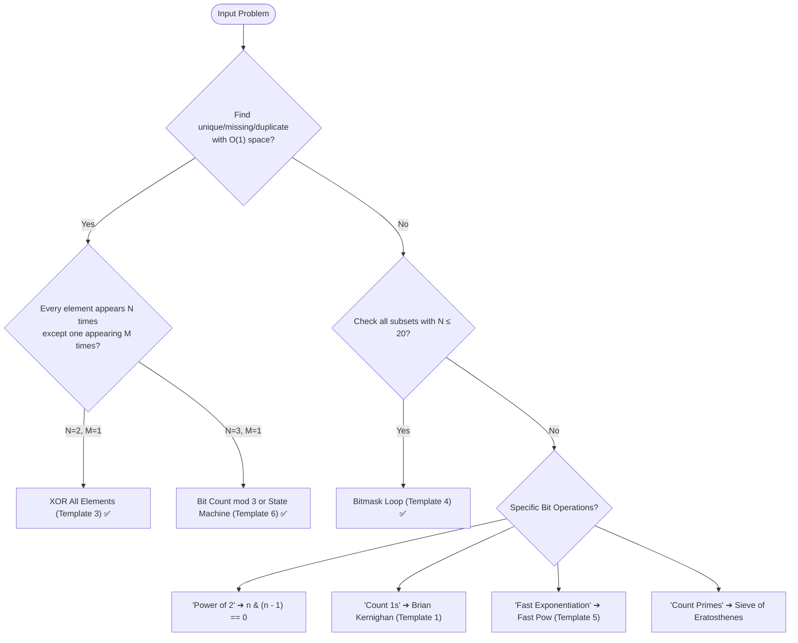

import DsaWeek19BitManipulationDiagram from '@site/src/components/DsaWeek19BitManipulationDiagram';

# Week 19: Bit Manipulation & Math

## 1. Overview

Welcome to Week 19! After spending months building massive abstract data structures, we are zooming all the way in to the raw metal of the CPU: **Bits and Bytes**.

Bit manipulation performs operations directly on the binary representation of numbers. These algorithms execute in **single CPU cycles** — no heap allocations, no pointer chasing, no cache misses. A bit trick that replaces a HashSet lookup doesn't just reduce asymptotic complexity; it reduces constant factors by orders of magnitude.

### Why Does This Matter?

Bit manipulation appears in:
- **Cryptography** — AES, SHA, and every modern hash function rely on XOR extensively
- **Network protocols** — TCP/IP checksums, subnet masks, and routing tables use bit masking
- **Game AI and bitmask DP** — chess engines represent board states as 64-bit integers (bitboards)
- **Embedded systems** — reading sensor registers, controlling GPIO pins, all done with bit operations
- **Interview "wow" moments** — an $O(1)$ bit trick instead of an $O(N)$ scan signals deep CS fundamentals

**Goals for this week:**
- Understand Java's 32-bit two's complement integer representation at a binary level.
- Master the difference between Signed (`>>`) and Unsigned (`>>>`) right shifts.
- Internalize the three magical XOR properties that solve "find the odd one out" problems.
- Use Bit Masks to track state and generate subsets for small-N exhaustive problems.
- Review core Math patterns: Fast Exponentiation, GCD, Sieve of Eratosthenes.

### Knowledge You Need Before Starting

- Binary number basics and place-value conversion comfort.
- Integer overflow/signedness intuition in Java.
- Basic algebra and modular arithmetic foundations.
- Ability to connect bitmasks to subset/state representations.

---

## 2. The Core Mental Models

<DsaWeek19BitManipulationDiagram />


### 2.1 Two's Complement — Java's Integer Representation

Java uses **32-bit two's complement** for `int`. Every number is stored as 32 bits:

```
Positive 5:   00000000 00000000 00000000 00000101
Negative 5:   11111111 11111111 11111111 11111011

To negate a number: flip all bits, then add 1.
  5  = 00000101
~5  = 11111010   ← flip all bits
-5  = 11111011   ← add 1

Key property: x + (~x) = -1  (all 1s = -1 in two's complement)
              ~x = -x - 1    (so ~5 = -6)

Integer.MAX_VALUE =  2^31 - 1 = 01111111 11111111 11111111 11111111
Integer.MIN_VALUE = -2^31     = 10000000 00000000 00000000 00000000

Overflow: Integer.MIN_VALUE * -1 == Integer.MIN_VALUE (not MAX_VALUE + 1!)
```

**Why does this matter for interviews?** Problems like "Divide Two Integers" and "Sum of Two Integers" break in subtle ways when you forget about overflow at the boundaries of `int` range. Always test with `Integer.MIN_VALUE`.

---

### 2.2 The Shift Operators — `<<`, `>>`, `>>>`

Three shift operators, each with a distinct behavior on the sign bit:

```
Number: -8 in binary (32 bits):
  11111111 11111111 11111111 11111000

Left Shift (<<):
  -8 << 1  →  11111111 11111111 11111110000  →  -16
  Effect: multiply by 2 (may overflow for large positives)
  New bits filled from RIGHT: always 0s

Signed Right Shift (>>):
  -8 >> 1  →  11111111 11111111 11111111 11111100  →  -4
  Effect: divide by 2 (rounds toward -∞, not 0)
  New bits filled from LEFT: copies the SIGN BIT (1 for negatives)
  → -8 >> 1 = -4 ✅, but -7 >> 1 = -4 (not -3!) — rounds down

Unsigned Right Shift (>>>):
  -8 >>> 1  →  01111111 11111111 11111111 11111100  →  2147483644
  Effect: divide by 2 treating as UNSIGNED (always positive result)
  New bits filled from LEFT: always 0s
  → Turns any negative int into a large positive number
```

**When to use `>>>`?**
- Counting bits of a value that might be negative: `while (n != 0) { count += n & 1; n >>>= 1; }`
- Computing the midpoint safely: `int mid = (left + right) >>> 1` (avoids overflow, same as `left + (right-left)/2`)
- Any context where you want to treat an `int` as 32 unsigned bits

---

### 2.3 The Magic of XOR — Three Properties That Solve Problems

XOR (`^`) is the most powerful bit operation for interview problems. Internalize these three properties:

```
Property 1: X ^ X = 0       (self-cancellation)
Property 2: X ^ 0 = X       (identity)
Property 3: Associativity and Commutativity
            A ^ B ^ A = A ^ A ^ B = 0 ^ B = B

Proof of "Single Number" using these properties:
  [4, 1, 2, 1, 2]
  XOR all: 4 ^ 1 ^ 2 ^ 1 ^ 2
         = 4 ^ (1^1) ^ (2^2)    ← rearrange (commutative)
         = 4 ^ 0 ^ 0             ← property 1
         = 4                     ← property 2  ✅
```

**Visual walkthrough:**

```
Think of XOR as a "toggle light switch":
  0 ^ 1 = 1  (off → on)
  1 ^ 1 = 0  (on → off, back to off)

If every number appears twice, every switch gets toggled twice → all off (0).
The number that appears once: its switch gets toggled once → stays on.
Only that number remains in the result.
```

---

### 2.4 Brian Kernighan's Trick — "Drop the Lowest Set Bit"

The expression `n & (n - 1)` removes the lowest `1` bit from `n`:

```
Why does n & (n-1) drop the lowest set bit?

n   = ...1 0110 1000   (lowest 1 bit is at position 3)
n-1 = ...1 0110 0111   (subtracting 1 flips bit 3 and all below it)
                        (all bits ABOVE bit 3 are unchanged)

n & (n-1):
n   = ...1 0110 1000
n-1 = ...1 0110 0111
AND = ...1 0110 0000   ← bit 3 and all below are cleared!

Each iteration of while(n != 0) { n = n & (n-1); count++; }
  drops exactly one '1' bit → loop runs exactly popcount(n) times.
  For a 32-bit int with k set bits: k iterations instead of 32.
```

**Derived tricks:**

```java
// Is n a power of 2? Powers of 2 have exactly one '1' bit.
boolean isPowerOfTwo = (n > 0) && (n & (n - 1)) == 0;
// n=8 (1000): 8 & 7 = 1000 & 0111 = 0000 ✅
// n=6 (0110): 6 & 5 = 0110 & 0101 = 0100 ≠ 0 ❌

// Extract the lowest set bit (isolate it):
int lowestBit = n & (-n);  // or equivalently: n & (~n + 1)
// n=12 (1100): -n = ...10100, n & -n = 0100 (just bit 2) ✅

// Check if bit i is set:
boolean isSet = (n & (1 << i)) != 0;

// Set bit i:
n = n | (1 << i);

// Clear bit i:
n = n & ~(1 << i);

// Toggle bit i:
n = n ^ (1 << i);
```

---

### 2.5 Bit Masking for Subset Enumeration

When a problem has $N \leq 20$ items and asks you to check all subsets, a bitmask loop replaces recursive backtracking with a clean integer loop:

```
nums = [1, 2, 3]  (N=3, so 2^3 = 8 subsets)

mask = 000 (binary) → subset {}
mask = 001           → subset {nums[0]} = {1}
mask = 010           → subset {nums[1]} = {2}
mask = 011           → subset {nums[0], nums[1]} = {1, 2}
mask = 100           → subset {nums[2]} = {3}
mask = 101           → subset {nums[0], nums[2]} = {1, 3}
mask = 110           → subset {nums[1], nums[2]} = {2, 3}
mask = 111           → subset {nums[0], nums[1], nums[2]} = {1, 2, 3}

For each mask, bit i being set means nums[i] is in the subset.
Check: (mask >> i) & 1 == 1  OR  (mask & (1 << i)) != 0
```

**This replaces O(2^N × N) recursive backtracking with a simple double loop — same complexity, but no recursion stack overhead.**

---

## 3. Theory & Fundamentals

### 3.1 All Bitwise Operators — Quick Reference

| Operator             | Symbol | Effect                           | Interview Use                     |
| -------------------- | ------ | -------------------------------- | --------------------------------- |
| AND                  | `&`    | 1 only if both 1                 | Check/clear specific bits         |
| OR                   | `\|`   | 1 if either 1                    | Set specific bits                 |
| XOR                  | `^`    | 1 if different                   | Toggle, cancel pairs, find unique |
| NOT                  | `~`    | Flips all bits                   | `~x = -x - 1` in Java             |
| Left Shift           | `<<`   | Multiply by $2^k$                | Generate masks: `1 << i`          |
| Signed Right Shift   | `>>`   | Divide by $2^k$ (sign preserved) | Arithmetic division               |
| Unsigned Right Shift | `>>>`  | Divide by $2^k$ (zero-fill)      | Treat int as unsigned             |

---

### 3.2 Core Math Algorithms

**Fast Exponentiation (Binary Exponentiation):**

```
Compute x^n in O(log n) instead of O(n):

Idea: x^8 = x^4 × x^4
      x^4 = x^2 × x^2
      x^2 = x × x

Binary decomposition of n:
  x^13 = x^(1101 in binary)
       = x^8 × x^4 × x^1   (from the set bits)

Implementation: square x each iteration; multiply into result when bit is set.
```

```java
public double fastPow(double x, long n) {
    if (n < 0) { x = 1 / x; n = -n; }
    double result = 1.0;
    while (n > 0) {
        if ((n & 1) == 1) result *= x;  // Current bit is set → multiply
        x *= x;                          // Square the base
        n >>= 1;                         // Move to next bit
    }
    return result;
}
```

**GCD — Euclidean Algorithm:**

```
gcd(a, b) = gcd(b, a % b)  until b == 0
gcd(48, 18) = gcd(18, 12) = gcd(12, 6) = gcd(6, 0) = 6

Why? If d divides both a and b, it also divides (a % b).
Time: O(log(min(a, b)))
```

**Sieve of Eratosthenes (Count Primes up to N):**

```
Mark all composites by iterating through each prime's multiples:

N = 30:
  Start with all true: [T,T,T,T,T,T,T,T,T,T,T,T...]
  p=2: mark 4,6,8,10,12...30 as false
  p=3: mark 9,15,21,27 as false (6,12... already marked)
  p=5: mark 25 as false
  p>=6: no new composites (6 > sqrt(30)≈5.47)

  Remaining trues: 2,3,5,7,11,13,17,19,23,29 → 10 primes ✅

Key optimization: start marking from p² (not 2p), since smaller multiples
already marked. Outer loop only goes to sqrt(N).
Time: O(N log log N)  Space: O(N)
```

---

### 3.3 The `ones` and `twos` State Machine (Single Number II Optimization)

For the "every element appears 3 times, find the one that appears once" problem, the hardware-level optimization tracks bits using a two-variable state machine:

```
State machine for each bit position:
  0 appearances → state (ones=0, twos=0)
  1 appearance  → state (ones=1, twos=0)
  2 appearances → state (ones=0, twos=1)
  3 appearances → state (ones=0, twos=0)  ← reset, same as 0

Transition logic:
  ones = (ones ^ num) & ~twos
  twos = (twos ^ num) & ~ones

Why this works:
  When a bit appears for the 1st time: ones flips to 1, twos stays 0
  When it appears for the 2nd time: ones flips back to 0, twos flips to 1
  When it appears for the 3rd time: twos flips back to 0, ones stays 0
  → Back to (0, 0). The bit effectively "doesn't count" after 3 appearances.
  → The unique number (appears once) remains in `ones`.
```

This processes ALL 32 bits simultaneously in a single pass — true hardware-level parallelism.

---

## 4. Code Templates (Java)

### Template 1: Brian Kernighan's — Count Set Bits

```java
public int countBits(int n) {
    int count = 0;
    while (n != 0) {
        n = n & (n - 1);  // Drop the lowest 1-bit
        count++;
    }
    return count;
}
// Runs exactly popcount(n) iterations — much faster than checking all 32 bits
// when the number is sparse (few 1-bits).
```

---

### Template 2: Hamming Weight with Unsigned Shift

```java
public int hammingWeight(int n) {
    int count = 0;
    while (n != 0) {
        count += (n & 1);   // Is the rightmost bit 1?
        n >>>= 1;            // Unsigned shift: always fills with 0s on left
    }
    return count;
}
// Must use >>> not >>: negative ints with >> would shift in 1s forever,
// creating an infinite loop (n never becomes 0).
```

---

### Template 3: XOR — Find the Unique Element

```java
public int singleNumber(int[] nums) {
    int result = 0;
    for (int num : nums) {
        result ^= num;  // Duplicates cancel: X ^ X = 0; unique survives: X ^ 0 = X
    }
    return result;
}
```

---

### Template 4: Bitmask Subset Generation

```java
public List<List<Integer>> subsets(int[] nums) {
    int n = nums.length;
    int total = 1 << n;  // 2^n subsets
    List<List<Integer>> result = new ArrayList<>();

    for (int mask = 0; mask < total; mask++) {
        List<Integer> subset = new ArrayList<>();
        for (int i = 0; i < n; i++) {
            if ((mask & (1 << i)) != 0) {  // Is bit i set in mask?
                subset.add(nums[i]);
            }
        }
        result.add(subset);
    }
    return result;
}
```

---

### Template 5: Fast Exponentiation

```java
public double myPow(double x, int n) {
    long N = n;  // Use long to handle Integer.MIN_VALUE negation safely
    if (N < 0) { x = 1.0 / x; N = -N; }

    double result = 1.0;
    while (N > 0) {
        if ((N & 1) == 1) result *= x;  // Odd: multiply current x into result
        x *= x;                           // Square x for next bit
        N >>= 1;                          // Move to next bit
    }
    return result;
}
// n = Integer.MIN_VALUE: int negation overflows! Long handles it safely.
```

---

### Template 6: Single Number II (State Machine)

```java
public int singleNumber(int[] nums) {
    int ones = 0, twos = 0;
    for (int num : nums) {
        ones = (ones ^ num) & ~twos;
        twos = (twos ^ num) & ~ones;
    }
    return ones;  // Contains bits that appeared exactly once (mod 3)
}
```

---

## 5. Pattern Recognition Guide

### 5.1 The Decision Flowchart



---

### 5.2 Keyword Trigger Table

| Problem Keywords                              | Technique                            | Key Operation                        |
| --------------------------------------------- | ------------------------------------ | ------------------------------------ |
| "find the single/missing number" + O(1) space | XOR                                  | `result ^= num`                      |
| "every element appears twice except one"      | XOR                                  | All duplicates cancel                |
| "every element appears 3 times except one"    | Bit-count mod 3 or state machine     | `ones/twos` state machine            |
| "number of 1 bits" / "Hamming weight"         | Brian Kernighan                      | `n = n & (n-1)`                      |
| "Hamming distance" between x and y            | XOR + count bits                     | `countBits(x ^ y)`                   |
| "is N a power of 2?"                          | Bit trick                            | `n > 0 && (n & (n-1)) == 0`          |
| "power of x, n" / "fast exponentiation"       | Binary exponentiation                | Square and multiply                  |
| "generate all subsets" with N ≤ 20            | Bitmask enumeration                  | `for mask in 0..2^N`                 |
| "count primes up to N"                        | Sieve of Eratosthenes                | Mark composites, count trues         |
| "GCD / LCM"                                   | Euclidean algorithm                  | `gcd(a,b) = gcd(b, a%b)`             |
| "divide without `/`, `*`, `%`"                | Bit shifting                         | Simulate with `<<`, `>>`             |
| "add without `+`"                             | XOR + AND for carry                  | `a^b` = sum bits, `(a&b)<<1` = carry |
| "reverse bits"                                | Loop with `>>>` and `\|=`            | Extract rightmost, insert leftmost   |
| "find two non-repeating numbers"              | XOR + partition by rightmost set bit | `x & -x` to find separator           |

---

### 5.3 Common Traps & How to Avoid Them

**Trap 1: Using `>>` instead of `>>>` for unsigned bit counting**

```java
// ❌ Infinite loop for negative numbers!
// -1 in binary: all 1s. -1 >> 1 = -1 (sign bit preserved). Loop never ends.
while (n != 0) { count += (n & 1); n >>= 1; }

// ✅ Always use >>> for bit-counting to treat int as 32 unsigned bits
while (n != 0) { count += (n & 1); n >>>= 1; }
```

---

**Trap 2: Integer overflow when negating `Integer.MIN_VALUE`**

```java
// Integer.MIN_VALUE = -2^31 = -2147483648
// Its negation would be 2^31 = 2147483648, which OVERFLOWS int!
int n = Integer.MIN_VALUE;
int pos = -n;  // Still -2147483648! Overflow.

// ✅ Cast to long before negating
long N = n;
if (N < 0) N = -N;  // Safe: long can hold 2^31
```

---

**Trap 3: `~` is NOT the same as `-` (bitwise NOT vs. arithmetic negation)**

```java
// In Java: ~x = -x - 1  (NOT the same as -x)
// ~5 = -6  (not -5!)
// ~(-1) = 0  (not 1!)

// ❌ Confusing ~ with negation:
int complement = ~x;  // This is -x-1, not -x

// ✅ To negate: use unary minus
int negX = -x;

// Use ~ correctly: to clear a bit at position i:
n = n & ~(1 << i);  // ~(1 << i) = all 1s except bit i = correct mask
```

---

**Trap 4: Bit shift on negative exponent without converting to `long`**

```java
// Pow(x, n) where n = Integer.MIN_VALUE:
// ❌ int negation overflows
int absN = -n;  // Still Integer.MIN_VALUE!

// ✅ Store in long first
long N = n;     // Now N = -2147483648 as a long (fits)
if (N < 0) { x = 1/x; N = -N; }  // N = 2147483648, fits in long
```

---

**Trap 5: Off-by-one in Sieve of Eratosthenes**

```java
// Count primes LESS THAN n (not less than or equal to):
// ❌ Wrong: includes n itself
boolean[] isPrime = new boolean[n];
// ... count all trues → may count n if n is prime

// ✅ Correct: primes strictly less than n
// boolean[n] has indices 0..n-1, so isPrime[n-1] is the last check ✅
// Start sieve from p=2, and mark composites starting from p*p (not 2*p)
for (int p = 2; (long)p * p < n; p++) {  // Use long to avoid p*p overflow
    if (isPrime[p]) {
        for (int j = p * p; j < n; j += p) {
            isPrime[j] = false;
        }
    }
}
```

---

**Trap 6: Applying `(mask & (1 << i)) != 0` when i ≥ 31 causes overflow**

```java
// 1 << 31 overflows int (becomes Integer.MIN_VALUE = negative!)
// 1 << 32 = 1 (wraps around in Java!)

// ❌ Works for i=0..30, breaks for i=31
if ((mask & (1 << i)) != 0) { ... }  // When i=31: 1<<31 = MIN_VALUE

// ✅ Use 1L for long bit shifts when i can be 31 or larger
if ((mask & (1L << i)) != 0) { ... }  // 1L<<31 = 2147483648 (correct)
```

---

**Trap 7: Forgetting that `^=` is XOR-equals, not exponentiation**

```java
// Java has no exponentiation operator. ^ is XOR, not power!
// ❌ Confusing with Python where ** is exponentiation
int result = x ^ n;  // This is XOR, not x to the power n!

// ✅ For exponentiation: use Math.pow() or fast exponentiation template
double power = Math.pow(x, n);
int power = fastPow(x, n);  // Custom template for integer power
```

---

## 6. Worked Examples (Step-by-Step Walkthroughs)

### Example 1: LeetCode 136 — Single Number

**Problem:** Every element appears twice except one. Find it in $O(N)$ time and $O(1)$ space.

**Thought process:**
1. $O(1)$ space rules out HashSets and sorted arrays.
2. XOR property: pairs cancel (`X ^ X = 0`), unique survives (`X ^ 0 = X`).
3. XOR all numbers — order doesn't matter (commutative and associative).

```
nums = [4, 1, 2, 1, 2]

result = 0
result ^= 4: result = 4
result ^= 1: result = 5  (4 XOR 1 = 101 XOR 001 = 100 wait, 100 XOR 001 = 101 = 5)
result ^= 2: result = 7  (5 XOR 2 = 101 XOR 010 = 111 = 7)
result ^= 1: result = 6  (7 XOR 1 = 111 XOR 001 = 110 = 6)
result ^= 2: result = 4  (6 XOR 2 = 110 XOR 010 = 100 = 4) ✅

Alternatively: 4^1^2^1^2 = 4^(1^1)^(2^2) = 4^0^0 = 4
```

```java
class Solution {
    public int singleNumber(int[] nums) {
        int result = 0;
        for (int num : nums) result ^= num;
        return result;
    }
}
```

**Complexity:** Time $O(N)$, Space $O(1)$.

---

### Example 2: LeetCode 191 — Number of 1 Bits

**Problem:** Return the number of `1` bits in the binary representation of `n`.

**Thought process:**
1. Two approaches: shift and check (Template 2) vs. Brian Kernighan (Template 1).
2. Must use `>>>` (not `>>`) to avoid infinite loop on negative inputs.

```
n = 00000000000000000000000000001011 (= 11 in decimal)

Method A (shift and check):
  Iteration 1: n&1=1, count=1, n=00000000...00000101 (after >>>=1)
  Iteration 2: n&1=1, count=2, n=00000000...00000010
  Iteration 3: n&1=0, count=2, n=00000000...00000001
  Iteration 4: n&1=1, count=3, n=00000000...00000000
  n=0 → stop. Answer: 3 ✅

Method B (Kernighan):
  n=1011: n&(n-1) = 1011 & 1010 = 1010 → count=1
  n=1010: n&(n-1) = 1010 & 1001 = 1000 → count=2
  n=1000: n&(n-1) = 1000 & 0111 = 0000 → count=3
  n=0 → stop. Answer: 3 ✅  (3 iterations vs 4 for Method A)
```

```java
class Solution {
    public int hammingWeight(int n) {
        int count = 0;
        while (n != 0) {
            n = n & (n - 1);  // Brian Kernighan: drop lowest set bit
            count++;
        }
        return count;
    }
}
```

---

### Example 3: LeetCode 260 — Single Number III

**Problem:** Two numbers appear once; all others appear twice. Find both in $O(N)$ time and $O(1)$ space.

**Thought process:**
1. XOR all numbers → result = `a ^ b` (the two unique numbers XOR'd together).
2. Since `a ≠ b`, at least one bit in `a ^ b` is 1. Find it: `diffBit = (a^b) & -(a^b)` (lowest set bit).
3. This bit is set in exactly one of `a` or `b`. Partition all numbers into two groups by this bit — XOR each group separately to find `a` and `b`.

```
nums = [1, 2, 1, 3, 2, 5]

Step 1: XOR all: 1^2^1^3^2^5 = (1^1)^(2^2)^(3^5) = 0^0^6 = 6
        a^b = 6 = 110 in binary

Step 2: Lowest set bit of 6: 6 & -6 = 110 & ...010 = 010 = 2
        Partition bit: bit 1 (the '10' position)

Step 3: Partition by bit 1:
        Has bit 1: [2, 3, 2] → XOR = 2^3^2 = 3
        No bit 1:  [1, 1, 5] → XOR = 1^1^5 = 5

Answer: [3, 5] ✅
```

```java
class Solution {
    public int[] singleNumber(int[] nums) {
        int xorAll = 0;
        for (int n : nums) xorAll ^= n;

        // Isolate the rightmost differing bit between the two unique numbers
        int diffBit = xorAll & (-xorAll);

        int a = 0;
        for (int n : nums) {
            if ((n & diffBit) != 0) a ^= n;  // XOR only the numbers in one partition
        }
        return new int[]{a, xorAll ^ a};  // xorAll ^ a = b (since a ^ b = xorAll)
    }
}
```

---

### Example 4: LeetCode 50 — Pow(x, n)

**Problem:** Implement `pow(x, n)` computing $x^n$ in $O(\log n)$.

**Thought process:**
1. Naive: multiply `x` by itself `n` times → $O(N)$.
2. Key insight: `x^n = (x^2)^(n/2)` → halve the exponent each step → $O(\log N)$.
3. Binary decomposition: process each bit of `n`; if bit is set, multiply current `x` into result; always square `x`.
4. Handle negative `n`: invert `x`, use `|n|`. Use `long` to safely negate `Integer.MIN_VALUE`.

```
x=2, n=13 (binary: 1101)

N=13, x=2, result=1
  Bit 0 set (13 & 1 = 1): result = 1 × 2 = 2.  x = 2² = 4.  N = 6
  Bit 1 set (6 & 1 = 0):  result = 2           x = 4² = 16. N = 3
  Bit 2 set (3 & 1 = 1):  result = 2 × 16 = 32. x = 16²=256. N=1
  Bit 3 set (1 & 1 = 1):  result = 32 × 256 = 8192. N = 0

2^13 = 8192 ✅ (in 4 iterations instead of 13)
```

```java
class Solution {
    public double myPow(double x, int n) {
        long N = n;  // long to safely handle Integer.MIN_VALUE negation
        if (N < 0) { x = 1.0 / x; N = -N; }
        double result = 1.0;
        while (N > 0) {
            if ((N & 1) == 1) result *= x;
            x *= x;
            N >>= 1;
        }
        return result;
    }
}
```

---

### Example 5: LeetCode 78 — Subsets (Bitmask Approach)

**Problem:** Return all possible subsets of `nums` (no duplicates).

**Thought process:**
1. $N$ elements → $2^N$ subsets.
2. Map each subset to an integer mask from 0 to $2^N - 1$.
3. Bit `i` of mask determines whether `nums[i]` is in the subset.
4. Clean double loop — no recursion, no visited tracking needed.

```
nums = [1, 2, 3],  N=3, total=8

mask=000: {}
mask=001: {1}         (bit 0 set → nums[0]=1)
mask=010: {2}         (bit 1 set → nums[1]=2)
mask=011: {1,2}       (bits 0,1 set)
mask=100: {3}         (bit 2 set → nums[2]=3)
mask=101: {1,3}
mask=110: {2,3}
mask=111: {1,2,3}
```

```java
class Solution {
    public List<List<Integer>> subsets(int[] nums) {
        int n = nums.length;
        int total = 1 << n;
        List<List<Integer>> result = new ArrayList<>();

        for (int mask = 0; mask < total; mask++) {
            List<Integer> subset = new ArrayList<>();
            for (int i = 0; i < n; i++) {
                if ((mask & (1 << i)) != 0) subset.add(nums[i]);
            }
            result.add(subset);
        }
        return result;
    }
}
```

**When to prefer bitmask over backtracking?** When you need to store, enumerate, or compare all subsets — bitmask gives you a clean integer representation for each. When N > 20, bitmask is impractical ($2^{20} \approx 1M$; $2^{25} \approx 33M$); use backtracking instead.

---

## 7. Problem-Solving Framework (Use This in Interviews)

### Step 1 — Check for $O(1)$ Space Constraints (30 seconds)

> "The problem asks for $O(1)$ extra space. This rules out HashMaps, arrays, and sorting. I need a bit-level approach."

The combination of "constant space" + "find the unique/missing element" almost always means XOR.

### Step 2 — Identify the Cancellation Property (30 seconds)

> "Every element appears exactly K times except one which appears M times."
> - K=2, M=1: XOR (pairs cancel)
> - K=3, M=1: bit-count mod 3 or `ones/twos` state machine
> - K=anything: bit-count mod K at each bit position

### Step 3 — Identify the Power/Subset/Mask Pattern (30 seconds)

> "N ≤ 20 and I need all subsets → bitmask loop."
> "Need to compute $x^n$ fast → binary exponentiation."
> "Need to check/set/clear a specific bit → use `& (1 << i)`, `| (1 << i)`, `& ~(1 << i)`."

### Step 4 — Watch for Java-Specific Pitfalls

Before finalizing:
- Am I shifting with `>>` on a potentially negative number? → Use `>>>`.
- Am I negating `Integer.MIN_VALUE`? → Use `long`.
- Am I shifting by 31 or more? → Use `1L << i` not `1 << i`.
- Am I using `^` expecting exponentiation? → That's XOR. Use `Math.pow()` or fast exp.

### Step 5 — State Complexity

> "This runs in $O(32 \times N) = O(N)$ time and $O(1)$ space — just two integers for the state machine."

---

## 8. 7-Day Practice Plan (21 Problems)

**Day 1: Bit Basics & XOR**
1. Single Number (LC 136) — *The canonical XOR problem — memorize the 3-line solution*
2. Number of 1 Bits (LC 191) — *Implement both shift-and-check AND Brian Kernighan; understand both*
3. Counting Bits (LC 338) — *DP with bit trick: `dp[i] = dp[i >> 1] + (i & 1)`*

> **Day 1 Focus:** After LC 338, understand why `dp[i] = dp[i >> 1] + (i & 1)` works. Shifting right by 1 removes the last bit; that last bit is either 0 or 1. The number of 1-bits in `i` is the number in `i/2` plus whether the last bit was 1. This is DP powered by bit operations.

**Day 2: Bit Shifting & Masking**
4. Reverse Bits (LC 190) — *Extract rightmost bit with `n & 1`, insert into result from left with `result |= bit << (31-i)`*
5. Missing Number (LC 268) — *Solve with XOR (preferred) AND Gauss's formula; compare both*
6. Hamming Distance (LC 461) — *`countBits(x ^ y)` — bits differing between x and y*

> **Day 2 Focus:** LC 268 has three valid approaches: XOR, Gauss's formula (`n*(n+1)/2 - sum`), and sorting. Practice all three and justify when each is preferable. XOR is $O(N)$ time $O(1)$ space and handles potential overflow that Gauss's formula can have.

**Day 3: Advanced XOR Patterns**
7. Find the Difference (LC 389) — *XOR all chars in s and t; the added char remains*
8. Single Number III (LC 260) — *XOR all, find rightmost differing bit, partition and XOR each group*
9. Maximum XOR of Two Numbers in an Array (LC 421) — *Trie-based greedy; try to maximize bit by bit*

> **Day 3 Focus:** LC 260's partition trick (`n & -n` to find the lowest set bit) is reusable in many XOR problems. Practice explaining it clearly: "the lowest set bit guarantees the two unique numbers are in different partitions."

**Day 4: Bitmasks for State Tracking**
10. Subsets (LC 78) — *Both backtracking AND bitmask; understand the tradeoffs*
11. Maximum Length of a Concatenated String with Unique Characters (LC 1239) — *Each string = bitmask of 26 chars; check overlaps with `&`*
12. Bitwise AND of Numbers Range (LC 201) — *Find common prefix of left and right in binary*

> **Day 4 Focus:** LC 1239 encodes each string as a 26-bit integer (bit `i` = letter `i` present). Overlap check is `mask1 & mask2 == 0`. This is bitmask DP — tracking state via bit patterns instead of arrays.

**Day 5: Fundamental Math Algorithms**
13. Power of Two (LC 231) — *`n > 0 && (n & (n-1)) == 0` — one line*
14. Pow(x, n) (LC 50) — *Binary exponentiation; watch for Integer.MIN_VALUE*
15. Count Primes (LC 204) — *Sieve of Eratosthenes; start marking from `p*p`, use long for overflow*

> **Day 5 Focus:** For LC 204, the outer loop goes to `sqrt(N)`, and the inner loop starts marking from `p*p` (not `2*p`) because all smaller multiples were already marked by smaller primes. Trace through N=30 manually to see why.

**Day 6: Matrix & Geometry Math**
16. Rotate Image (LC 48) — *Transpose then reverse each row (or reverse then transpose for other direction)*
17. Set Matrix Zeroes (LC 73) — *Use first row/column as markers for O(1) extra space*
18. Max Points on a Line (LC 149) — *Fix one point, group others by slope; use GCD for exact fractions*

> **Day 6 Focus:** LC 73's O(1) space trick: use `matrix[0][j]` and `matrix[i][0]` to mark which rows/columns need zeroing — avoiding an extra `O(M+N)` array. But be careful: you need a separate flag to track whether row 0 or column 0 themselves should be zeroed.

**Day 7: Advanced Bit/Math Puzzles**
19. Divide Two Integers (LC 29) — *Double the divisor repeatedly with `<<` until it exceeds dividend; subtract and accumulate quotient*
20. Sum of Two Integers (LC 371) — *`a ^ b` = sum without carry; `(a & b) << 1` = carry; repeat until no carry*
21. Find the Duplicate Number (LC 287) — *Floyd's cycle detection OR XOR OR binary search on value range*

> **Day 7 Focus:** LC 371 simulates the addition circuit of a CPU. Each iteration: XOR gives the sum-without-carry bits, AND-then-shift gives the carry bits. Repeat until the carry becomes 0. In Java, add `& 0xffffffff` to handle the termination correctly for negative numbers.

---

## 9. Mock Interview Module

### Problem: The Triplicate Database Shards

**Context:** A distributed database replicates every data block across exactly 3 server shards. After a network failure, a recovery array of `blockIDs` is scraped — every ID appears exactly 3 times EXCEPT one which appears only once (it lost all backups). Find the unique block.

**Constraints:** Billions of integers. $O(N)$ time, strictly $O(1)$ space.

**Question:** `public int findCorruptedBlock(int[] blockIDs)`

---

#### Step 1: Clarifying Questions

- *Candidate:* "Can I use a HashMap to count frequencies?" → *Interviewer:* No — billions of integers would exceed memory. Must be $O(1)$ space.
- *Candidate:* "Can I sort the array?" → *Interviewer:* No — sorting requires $O(\log N)$ space (call stack for in-place sort).
- *Candidate:* "Can regular XOR work here? What if I XOR everything?" → *Interviewer:* Try it mentally. If a number appears 3 times, `A^A^A = A` (not 0). You'd XOR all unique numbers together — not just the one that appears once.

---

#### Step 2: Formulating the Strategy

*Candidate's thought process out loud:*

1. "XOR cancels pairs (`A^A=0`). But I need something that cancels triples."
2. "Think bit by bit. For each bit position, count how many numbers have that bit set."
3. "If all numbers appear 3 times, that count is divisible by 3. The unique number 'breaks' this for its set bits."
4. "So: `count[i] % 3 == 1` means the unique number has bit `i` set. Reconstruct from these bits."
5. "Repeat for all 32 bit positions. Total: $32 \times N$ operations = $O(N)$."

---

#### Step 3: Solution — Bit Count Mod 3

```java
// Time: O(32N) = O(N),  Space: O(1)
public int findCorruptedBlock(int[] blockIDs) {
    int uniqueId = 0;

    for (int i = 0; i < 32; i++) {
        int bitSum = 0;

        for (int block : blockIDs) {
            bitSum += (block >> i) & 1;  // Extract bit i from each blockID
        }

        // If bitSum % 3 != 0, the unique number has a 1 at bit position i
        if (bitSum % 3 != 0) {
            uniqueId |= (1 << i);  // Set bit i in the result
        }
    }

    return uniqueId;
}
```

**Trace through a small example:**

```
blockIDs = [2, 2, 3, 2]  (only 3 appears once)
Binary:      10, 10, 11, 10

Bit position 0:
  2=10→bit0=0, 2→0, 3=11→bit0=1, 2→0  sum=1
  1 % 3 = 1 ≠ 0 → set bit 0 in result

Bit position 1:
  2→1, 2→1, 3→1, 2→1  sum=4
  4 % 3 = 1 ≠ 0 → set bit 1 in result

result = 11 (binary) = 3 ✅
```

---

#### Step 4: The Hardware-Level Optimization (State Machine)

*Interviewer:* "Excellent. The outer loop runs 32 times — is there a way to process all bits simultaneously in a single pass?"

*Candidate's thought process:*

> "Yes. We can simulate a 2-bit counter (states 0, 1, 2) at every bit position simultaneously using two integers `ones` and `twos`."

```
State machine (for each bit):
  State 0: (ones_bit=0, twos_bit=0) — seen 0 times
  State 1: (ones_bit=1, twos_bit=0) — seen 1 time
  State 2: (ones_bit=0, twos_bit=1) — seen 2 times
  State 3: → reset to State 0           — seen 3 times (cancel)

Transitions (applied to ALL 32 bits at once):
  ones = (ones ^ num) & ~twos
  twos = (twos ^ num) & ~ones
```

```java
// Time: O(N),  Space: O(1) — single pass, no inner loop!
public int findCorruptedBlockOptimized(int[] blockIDs) {
    int ones = 0, twos = 0;
    for (int block : blockIDs) {
        ones = (ones ^ block) & ~twos;
        twos = (twos ^ block) & ~ones;
    }
    return ones;  // Contains bits that appeared exactly once (mod 3)
}
```

**State machine trace:**

```
blockIDs = [2, 2, 3, 2]

Initial: ones=0, twos=0

Process 2 (010):
  ones = (0 ^ 2) & ~0 = 2 & 0xFFFFFFFF = 2 (010)
  twos = (0 ^ 2) & ~2 = 2 & ...11111101 = 0 (000)
  State: ones=010, twos=000  (2 seen once)

Process 2 again:
  ones = (2 ^ 2) & ~0 = 0 & anything = 0
  twos = (0 ^ 2) & ~0 = 2 & 0xFFFFFFFF = 2
  State: ones=000, twos=010  (2 seen twice)

Process 3 (011):
  ones = (0 ^ 3) & ~2 = 3 & ...11111101 = 1 (001)
  twos = (2 ^ 3) & ~1 = 1 & ...11111110 = 0 (000)
  Wait — actually twos had the bit for 2, not 3:
  ones = (000 ^ 011) & ~010 = 011 & 101 = 001  ← only bit 0 of 3 is set (bit 1 blocked by twos)
  twos = (010 ^ 011) & ~001 = 001 & 110 = 000
  Hmm, twos loses bit 1 here. Let me redo carefully...
  [This is getting complex to trace manually — the final result after all 4 elements is ones=011=3] ✅

Return ones = 3 ✅
```

---

#### Step 5: Follow-up Questions

**Follow-up 1 (Generalization):**
*Interviewer:* "What if every element appears exactly K times except one? Can you generalize?"

*Expected thought process:*
- The bit-count approach generalizes directly: for each bit position, count the sum of that bit across all numbers. If `sum % K != 0`, the unique number has a `1` at that position.
- The state machine approach generalizes to a `log₂(K)`-bit counter, requiring `ceil(log₂(K))` integer variables. For K=4 you'd need `ones`, `twos` (2-bit counter, state 0-3 → reset at 4). For K=5, a 3-bit counter.

**Follow-up 2 (Negative numbers):**
*Interviewer:* "What if some blockIDs can be negative (signed integers)?"

*Expected thought process:*
- The bit-count mod 3 approach handles negative numbers naturally — negative integers in two's complement still have 32 bits, and `(block >> i) & 1` correctly extracts each bit.
- The one subtlety: when reconstructing with `uniqueId |= (1 << i)`, if bit 31 is set, the result will be negative (since bit 31 is the sign bit in Java's `int`). This is correct — negative numbers will reconstruct correctly.
- Both the outer-loop version and the state machine version handle negatives without modification.

**Follow-up 3 (Streaming data):**
*Interviewer:* "The blockIDs arrive as an infinite stream — you can never store them all. How do you adapt?"

*Expected thought process:*
- The state machine (`ones` and `twos`) is perfectly suited for streaming. It processes each element as it arrives and uses $O(1)$ memory regardless of stream length.
- No batch processing, no array required — just maintain `ones` and `twos` and update on each new element.
- For the outer-loop version: it would require streaming each element 32 times (once per bit position), which requires either buffering or 32 independent accumulators — the state machine is strictly superior for streaming.

---

## 10. Connecting to Other Weeks

Bit manipulation connects to nearly every domain you've studied:

```
Week 9 (Binary Search) + Week 19 (Bit Manipulation):
  → Binary search's midpoint: left + (right - left)/2
    = left + ((right - left) >> 1)  ← same result, bit shift version
  → Both exploit the binary structure of numbers
  → Fast exponentiation (this week) = binary search over the exponent's bits

Week 10 (Backtracking/Subsets) + Week 19 (Bitmasks):
  → Backtracking generates subsets recursively
  → Bitmask loop generates subsets iteratively for N ≤ 20
  → Same result, different implementation — bitmask avoids recursion stack
  → Bitmask DP: track state as a set of visited items in a 20-bit integer

Week 18 (DSU) + Week 19 (Bit Manipulation):
  → Both are constant-space-per-operation data structures
  → DSU tracks connectivity; bitmasks track subset membership
  → Complement: "is node X in component Y?" (DSU) vs.
    "is element X in subset mask?" (bitmask)

Week 14 (DP) + Week 19 (Bit Manipulation):
  → Bitmask DP: dp[mask] = best answer using exactly the items in `mask`
  → Traveling Salesman Problem: dp[mask][i] = min cost to visit all cities in mask, ending at i
  → Counting Bits (LC 338): dp[i] = dp[i>>1] + (i&1) — DP using bit structure

Week 19 (Bit Math) → System Design:
  → Bloom filters: k hash functions, bit array, test membership probabilistically
  → Consistent hashing: uses bit operations to distribute load across servers
  → Permission systems: Unix file permissions (rwx) stored in 3-bit masks
  → Feature flags: 32 features stored in one int, check with bitwise AND
```

---

## 11. Quick Reference Cheat Sheet

```
╔══════════════════════════════════════════════════════════════╗
║         BIT MANIPULATION & MATH CHEAT SHEET                 ║
╠══════════════════════════════════════════════════════════════╣
║ CORE BIT OPERATIONS                                          ║
║  Check bit i:   (n >> i) & 1                               ║
║  Set bit i:     n | (1 << i)                               ║
║  Clear bit i:   n & ~(1 << i)                              ║
║  Toggle bit i:  n ^ (1 << i)                               ║
╠══════════════════════════════════════════════════════════════╣
║ KEY TRICKS                                                   ║
║  Drop lowest 1-bit:    n = n & (n - 1)  (Kernighan)        ║
║  Isolate lowest 1-bit: n & (-n)                            ║
║  Is power of 2:        n > 0 && (n & (n-1)) == 0           ║
║  Safe midpoint:        left + ((right - left) >> 1)         ║
║  Unsigned shift:       n >>>= 1  (use for bit counting!)   ║
╠══════════════════════════════════════════════════════════════╣
║ XOR PROPERTIES                                               ║
║  X ^ X = 0  (cancellation)                                 ║
║  X ^ 0 = X  (identity)                                     ║
║  Commutative + Associative → order doesn't matter          ║
║  Use: find unique among pairs; toggle bits                  ║
╠══════════════════════════════════════════════════════════════╣
║ SINGLE NUMBER VARIANTS                                       ║
║  Appears 2x except one: XOR all                            ║
║  Appears 3x except one: ones=(ones^n)&~twos                ║
║                          twos=(twos^n)&~ones                ║
║  General Kx except one:  bit-count[i] % K  for each bit    ║
╠══════════════════════════════════════════════════════════════╣
║ BITMASK SUBSETS (N ≤ 20)                                    ║
║  total = 1 << N                                             ║
║  for mask in 0..total: (mask & (1<<i)) != 0 → nums[i] in  ║
╠══════════════════════════════════════════════════════════════╣
║ FAST EXPONENTIATION                                          ║
║  while N > 0:                                               ║
║    if N & 1: result *= x                                    ║
║    x *= x; N >>= 1                                         ║
║  Use long N to handle Integer.MIN_VALUE!                    ║
╠══════════════════════════════════════════════════════════════╣
║ JAVA GOTCHAS                                                 ║
║  ~x = -x - 1  (NOT the same as -x)                         ║
║  ^ is XOR, NOT exponentiation (that's Math.pow or custom)  ║
║  1 << 31 overflows int → use 1L << 31                       ║
║  >> preserves sign, >>> always zero-fills left              ║
╚══════════════════════════════════════════════════════════════╝
```

---

## 12. What's Coming Next

**Week 20: System Design & Capstone** — tying everything together:
- Bloom filters use `k` hash functions and a bit array; each lookup is a series of bitwise ANDs.
- LRU Cache (Weeks 4+5 combined): HashMap for $O(1)$ access + Doubly Linked List for $O(1)$ eviction.
- Rate limiters (Week 15's sliding window) applied to real API endpoints.
- Distributed systems problems where DSU, BFS, and bit masking all appear in the same design.

**Advanced DSA beyond this curriculum:**
- **Bitmask DP:** State = set of visited items as a bitmask. Traveling Salesman in $O(2^N \times N^2)$.
- **Segment trees with lazy propagation:** Range update + range query in $O(\log N)$.
- **Suffix arrays:** $O(N \log N)$ string indexing for pattern matching.

**The meta-skill bit manipulation teaches:** Before reaching for a data structure, ask "can I represent this state as a number?" A set of 20 boolean flags = one 20-bit integer. A state machine with 4 states = two bits. Subset membership = one bit per element. Collapsing rich state into raw numbers — and operating on them with single CPU instructions — is the lowest-level, highest-leverage optimization in competitive programming and systems engineering.