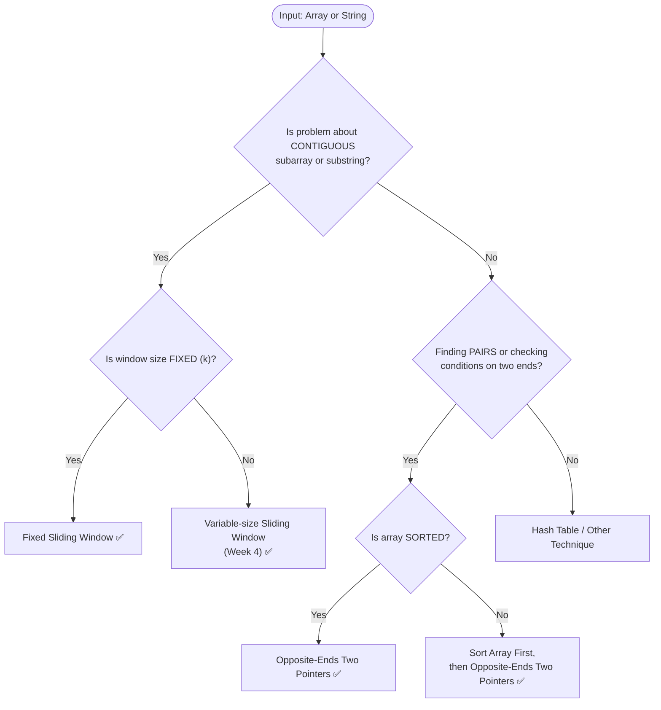

import DsaWeek2TwoPointersDiagram from '@site/src/components/DsaWeek2TwoPointersDiagram';

# Week 2: Two Pointers & Basic Sliding Window

## 1. Overview

Welcome to Week 2. Having mastered contiguous memory structures last week, we are now focusing on how to **traverse them efficiently**. The **Two Pointers** and **Sliding Window** techniques are optimization strategies designed to eliminate nested loops. By maintaining multiple references (pointers) to different indices in an array or string, you can reduce $O(N^2)$ brute-force solutions down to single-pass $O(N)$ solutions.

### Why Does This Matter?

Consider a naive approach: checking every pair of elements in an array of 100,000 items. That's roughly 5 billion operations. With Two Pointers, you do it in 100,000. **This is the difference between a query timing out and responding in milliseconds.**

**Goals for this week:**
- Understand the opposite-directional and same-directional two-pointer techniques.
- Master the fixed-size Sliding Window pattern.
- Build a reliable instinct for **when** to apply each technique.
- Learn Java-specific memory optimizations (e.g., `String.charAt()` vs. `toCharArray()`).

### Knowledge You Need Before Starting

- Solid Week 1 foundation: arrays/strings traversal and prefix sum basics.
- Sorting intuition: know why sorted input enables pointer elimination.
- Index arithmetic fluency (`left++`, `right--`, `i - k`) without off-by-one errors.
- Ability to reason about loop invariants and moving boundaries.

---

## 2. The Core Mental Model: What Is a "Pointer"?

<DsaWeek2TwoPointersDiagram />


A **pointer** in this context is simply an **integer variable holding an index**. It "points" to a position in the array or string. Nothing more. When we say "move the pointer right," we mean `pointer++`.



---

### 5.2 Keyword Trigger Table

| Problem Keywords                        | Technique                            | Why                                          |
| --------------------------------------- | ------------------------------------ | -------------------------------------------- |
| "sorted array" + "pair" / "two numbers" | Opposite-Ends Two Pointers           | Sorting enables the squeeze                  |
| "in-place" + "$O(1)$ space"             | Slow/Fast Two Pointers               | No extra data structures                     |
| "remove duplicates" / "move zeros"      | Slow/Fast Two Pointers               | Slow=write head, Fast=read head              |
| "palindrome"                            | Opposite-Ends Two Pointers           | Compare from both ends inward                |
| "contiguous subarray of size k"         | Fixed Sliding Window                 | Fixed window, slide across                   |
| "maximum/minimum average of k elements" | Fixed Sliding Window                 | Direct application                           |
| "anagram" / "permutation" in substring  | Fixed Sliding Window + frequency map | Window = length of the pattern               |
| "3Sum" / "4Sum"                         | Sort + Opposite-Ends Two Pointers    | Reduce to 2-pointer after fixing one element |
| "longest/shortest" + "at most/least"    | Variable Sliding Window (Week 4)     | Window size changes dynamically              |

---

### 5.3 Common Traps & How to Avoid Them

**Trap 1: Applying Two Pointers to an unsorted array for pair-finding**

```
❌ Wrong: [3, 1, 4, 1, 5], target=6
   left=0 (3), right=4 (5) → sum=8, move right...
   But arr[1]=1 and arr[4]=5 also sum to 6! We'd miss it.

✅ Fix: Sort first → [1, 1, 3, 4, 5], then apply Two Pointers.
   (If you can't sort, use a HashMap instead — O(N) time, O(N) space)
```

**Trap 2: Off-by-one in sliding window index math**

```
❌ Wrong: currentWindowSum += arr[i] - arr[i - k + 1]  // Removes wrong element

✅ Correct: currentWindowSum += arr[i] - arr[i - k]
   When i=k (second window), the element leaving is arr[k - k] = arr[0] ✅
```

**Trap 3: Forgetting to handle the `left < right` guard in inner while loops**

```java
// This is the Valid Palindrome inner loop:
while (left < right && !Character.isLetterOrDigit(s.charAt(left))) {
    left++;
}
// The `left < right` check is CRITICAL.
// Without it, left could overshoot right, causing incorrect comparisons.
```

**Trap 4: Mutating `slow` before confirming you need to write**

```java
// ❌ Wrong order
slow++;
arr[slow] = arr[fast];  // You incremented slow even if arr[fast] was a duplicate

// ✅ Correct: check FIRST, then act
if (arr[fast] != arr[slow]) {
    slow++;
    arr[slow] = arr[fast];
}
```

---

## 6. Worked Examples (Step-by-Step Walkthroughs)

### Example 1: LeetCode 125 — Valid Palindrome

**Problem:** Given a string `s`, return `true` if it is a palindrome, considering only alphanumeric characters and ignoring cases.

**Thought process:**
1. We need to compare characters from both ends → **Opposite-Ends Two Pointers**.
2. The tricky part: non-alphanumeric characters must be skipped.
3. Use inner `while` loops to advance each pointer past invalid characters.
4. After skipping, compare the characters (case-insensitive).

```
Input: "A man, a plan, a canal: Panama"
Cleaned (logical): "amanaplanacanalpanama"

Step 1: left='A', right='a' → 'a'=='a' ✅ → left++, right--
Step 2: left='m', right='m' → 'm'=='m' ✅ → left++, right--
...and so on until they meet.
```

**The "skip" inner loop is a common pattern — memorize this structure:**

```java
// Skip invalid characters from the left
while (left < right && !Character.isLetterOrDigit(s.charAt(left))) {
    left++;
}
// Skip invalid characters from the right
while (left < right && !Character.isLetterOrDigit(s.charAt(right))) {
    right--;
}
```

```java
class Solution {
    public boolean isPalindrome(String s) {
        int left = 0;
        int right = s.length() - 1;

        while (left < right) {
            // Skip non-alphanumeric from left
            while (left < right && !Character.isLetterOrDigit(s.charAt(left))) {
                left++;
            }
            // Skip non-alphanumeric from right
            while (left < right && !Character.isLetterOrDigit(s.charAt(right))) {
                right--;
            }

            // Compare characters (case-insensitive)
            if (Character.toLowerCase(s.charAt(left)) != Character.toLowerCase(s.charAt(right))) {
                return false;
            }
            left++;
            right--;
        }
        return true;
    }
}
```

**Complexity:** Time $O(N)$ — each character is visited at most once. Space $O(1)$ — no extra data structures.

---

### Example 2: LeetCode 643 — Maximum Average Subarray I

**Problem:** Given `nums` and integer `k`, find the contiguous subarray of length `k` with the maximum average.

**Thought process:**
1. "Contiguous subarray of specific size k" → **Fixed Sliding Window**.
2. We want to maximize the sum (average = sum / k, and k is constant, so maximizing sum = maximizing average).
3. Build the first window, then slide.

```
nums = [1, 12, -5, -6, 50, 3],  k = 4

Window 1: [1, 12, -5, -6]  sum = 2
Window 2:  [12, -5, -6, 50] sum = 2 - 1 + 50 = 51  ← MAX
Window 3:   [-5, -6, 50, 3] sum = 51 - 12 + 3 = 42

Answer: 51 / 4 = 12.75
```

```java
class Solution {
    public double findMaxAverage(int[] nums, int k) {
        // Use long to avoid integer overflow for large sums
        long currentSum = 0;
        for (int i = 0; i < k; i++) {
            currentSum += nums[i];
        }

        long maxSum = currentSum;
        for (int i = k; i < nums.length; i++) {
            currentSum += nums[i] - nums[i - k];   // Slide: add new, remove old
            maxSum = Math.max(maxSum, currentSum);
        }

        return (double) maxSum / k;
    }
}
```

**Why `long` instead of `int`?** With 10⁴ elements each up to 10⁴ in value, the sum can reach 10⁸ — safely within `int`, but it's a good habit for safety and prevents subtle bugs in competitions.

---

### Example 3: LeetCode 15 — 3Sum (Advanced: Two Pointers + Sorting)

**Problem:** Find all unique triplets in `nums` that sum to zero.

**Thought process:**
1. Three elements is too complex for a single two-pointer pass.
2. **Reduce to a known problem:** Fix one element (`nums[i]`), then the problem becomes **2Sum on the remaining sorted subarray**.
3. Sort the array first so Two Pointers can work.
4. Skip duplicates carefully to avoid returning duplicate triplets.

```
nums = [-4, -1, -1, 0, 1, 2]  (after sorting)

Fix i=0 (val=-4): find pair in [-1,-1,0,1,2] that sums to 4
  left=1(-1), right=5(2) → -1+2=1 < 4 → left++
  left=2(-1), right=5(2) → -1+2=1 < 4 → left++
  left=3(0),  right=5(2) → 0+2=2 < 4 → left++
  left=4(1),  right=5(2) → 1+2=3 < 4 → left++ → left crosses right, done

Fix i=1 (val=-1): find pair in [-1,0,1,2] that sums to 1
  left=2(-1), right=5(2) → -1+2=1 == 1 → FOUND: [-1,-1,2] ✅
  left=3(0),  right=4(1) → 0+1=1 == 1 → FOUND: [-1,0,1] ✅

Fix i=2: nums[2]==nums[1]==-1, SKIP (duplicate)
Fix i=3 (val=0): find pair in [1,2] that sums to 0
  → no valid pair

Result: [[-1,-1,2], [-1,0,1]]
```

```java
class Solution {
    public List<List<Integer>> threeSum(int[] nums) {
        Arrays.sort(nums);   // Sorting is the prerequisite
        List<List<Integer>> result = new ArrayList<>();

        for (int i = 0; i < nums.length - 2; i++) {
            // Skip duplicate values for the fixed element
            if (i > 0 && nums[i] == nums[i - 1]) continue;

            int left = i + 1;
            int right = nums.length - 1;

            while (left < right) {
                int sum = nums[i] + nums[left] + nums[right];

                if (sum == 0) {
                    result.add(Arrays.asList(nums[i], nums[left], nums[right]));
                    // Skip duplicates for left and right
                    while (left < right && nums[left] == nums[left + 1]) left++;
                    while (left < right && nums[right] == nums[right - 1]) right--;
                    left++;
                    right--;
                } else if (sum < 0) {
                    left++;
                } else {
                    right--;
                }
            }
        }
        return result;
    }
}
```

---

## 7. Problem-Solving Framework (Use This in Interviews)

When you see a new problem, follow these 5 steps out loud:

### Step 1 — Restate & Clarify (2 min)
> "So we have a sorted array and need to find... Can the input be empty? Can values be negative? Can k exceed array length?"

### Step 2 — Identify the Pattern (1 min)
> "I see: sorted array + pair finding → Opposite-Ends Two Pointers."
> "I see: fixed window size + subarray aggregate → Fixed Sliding Window."

### Step 3 — State the Brute Force (1 min)
Write it mentally or out loud. It shows you understand correctness.
> "Brute force: nested loops, $O(N^2)$. Works but won't scale."

### Step 4 — Apply the Optimization (3–5 min)
> "I can eliminate one pointer per step because the array is sorted, giving me $O(N)$."

### Step 5 — Test with an Example & Edge Cases (2 min)
Always test these edge cases:
- Empty array (`[]`)
- Single-element array (`[5]`)
- All duplicates (`[1,1,1,1]`)
- k equals array length
- No valid answer exists

---

## 8. 7-Day Practice Plan (21 Problems)

**Day 1: Two Pointers Basics (Opposite Ends)**
1. Valid Palindrome (LC 125) — *Skipping non-alphanumeric chars*
2. Reverse String (LC 344) — *Simplest opposite-ends, build intuition*
3. Two Sum II - Input Array Is Sorted (LC 167) — *Classic application*

> **Day 1 Focus:** After solving each problem, ask yourself: "Why did moving the pointer in this direction help eliminate possibilities?" Write the answer down.

**Day 2: Two Pointers (Same Direction & In-Place)**
4. Remove Duplicates from Sorted Array (LC 26) — *Slow=write, Fast=read*
5. Move Zeroes (LC 283) — *Same pattern, different condition*
6. Remove Element (LC 27) — *Minimal variation of LC 26*

> **Day 2 Focus:** For each problem, draw the slow and fast pointers on paper and trace through a 5-element example before coding.

**Day 3: Intermediate Two Pointers**
7. Container With Most Water (LC 11) — *Why move the shorter line?*
8. Squares of a Sorted Array (LC 977) — *Two pointers, building from the outside in*
9. 3Sum (LC 15) — *Combines sorting with Two Sum II*

> **Day 3 Focus:** LC 11 is conceptually tricky. The key insight: the area is limited by the shorter wall. Moving the taller wall inward can only decrease or maintain width while keeping the same height limit — so it's never beneficial. Always move the shorter wall.

**Day 4: Fixed Sliding Window Basics**
10. Maximum Average Subarray I (LC 643) — *Direct template application*
11. Diet Plan Performance (LC 1176)
12. Number of Sub-arrays of Size K and Average ≥ Threshold (LC 1343) — *Same template, different output*

> **Day 4 Focus:** After Day 4, you should be able to write the Fixed Sliding Window template from memory without looking.

**Day 5: Advanced Fixed Sliding Window**
13. Maximum Points You Can Obtain from Cards (LC 1423) — *Window from the edges, not the middle!*
14. Find All Anagrams in a String (LC 438) — *Frequency map inside the window*
15. Permutation in String (LC 567) — *Same as 438, different output format*

> **Day 5 Focus:** LC 1423 is a twist — the window is actually the part you **don't** take (the middle), not the part you do. Recognizing inverted framings is a senior-level skill.

**Day 6: Mixing Pointers & Strings**
16. Valid Palindrome II (LC 680) — *At most one deletion: try skipping left OR right*
17. Reverse Vowels of a String (LC 345) — *Opposite ends, conditional movement*
18. String Compression (LC 443) — *Slow/Fast on strings*

**Day 7: Review & Consolidation**
19. Sort Colors (LC 75) — *Dutch National Flag: three pointers*
20. 4Sum (LC 18) — *Extension of 3Sum: fix two, use two pointers*
21. Substring of Size Three with Distinct Characters (LC 1876)

> **Day 7 Focus:** On LC 75, pause before looking at the solution. Try to figure out how three pointers (low, mid, high) can partition the array in one pass. This is a great test of your pointer intuition.

---

## 9. Mock Interview Module

### Problem: The API Traffic Spike Analyzer

**Context:** You are writing an operational runbook utility to analyze server logs. You are given an array `requests`, where `requests[i]` represents the number of HTTP requests hitting your Tomcat server at second `i`. You are also given an integer `k`, representing a time window in seconds.

To configure your rate-limiting and auto-scaling thresholds properly, you need to find the maximum number of requests that occurred in *any* contiguous `k`-second window.

**Question:** Implement `public int maxTrafficSpike(int[] requests, int k)` that returns the maximum requests in a `k`-second window.

---

#### Step 1: Clarifying Questions & Expected Answers

- *Candidate:* "Can `k` be larger than the size of the `requests` array?"
  → *Interviewer:* No, assume $1 \le k \le requests.length$.
- *Candidate:* "Can the number of requests be negative?"
  → *Interviewer:* No, traffic counts are strictly non-negative integers.
- *Candidate:* "Should I handle the case where `requests` is empty?"
  → *Interviewer:* You can assume a non-empty array.
- *Candidate:* "Is there a constraint on total request counts? Could the sum overflow an `int`?"
  → *Interviewer:* Good catch. Assume it fits in an `int` for this problem.

> **Tip:** Asking the integer overflow question signals senior-level thinking. In real systems (millions of requests), sums easily overflow 32-bit integers.

---

#### Step 2: The Brute Force Solution

Explain that we could check every possible window of size `k` and sum its elements.

```java
// Time: O(N × K), Space: O(1)
public int maxTrafficSpike(int[] requests, int k) {
    int maxSpike = 0;
    for (int i = 0; i <= requests.length - k; i++) {
        int currentWindow = 0;
        for (int j = i; j < i + k; j++) {
            currentWindow += requests[j];
        }
        maxSpike = Math.max(maxSpike, currentWindow);
    }
    return maxSpike;
}
```

*Interviewer Critique:* "This works, but if `requests` represents a month of data (millions of seconds) and `k` is 3600 (one hour), $O(N \times K)$ will cause a massive CPU spike. Can we do this in a single pass?"

**How to recognize the optimization opportunity:**
- You're computing a sum over a window.
- The window moves by exactly 1 each time.
- The contents of adjacent windows overlap by k-1 elements.
- → **Reuse the previous sum instead of recomputing.**

---

#### Step 3: The Optimized Solution (Fixed Sliding Window)

```java
// Time: O(N), Space: O(1)
public int maxTrafficSpike(int[] requests, int k) {
    int currentSpike = 0;

    // Phase 1: Build the first k-second window
    for (int i = 0; i < k; i++) {
        currentSpike += requests[i];
    }

    int maxSpike = currentSpike;

    // Phase 2: Slide the window
    for (int i = k; i < requests.length; i++) {
        // Remove the second that just left the window: requests[i - k]
        // Add the new second entering the window:    requests[i]
        currentSpike += requests[i] - requests[i - k];
        maxSpike = Math.max(maxSpike, currentSpike);
    }

    return maxSpike;
}
```

**Talk through this during the interview:**
> "I build the initial window in $O(K)$. Then for each subsequent second, I do exactly 2 operations — subtract the outgoing second, add the incoming second. So the slide phase is $O(N - K)$. Total is $O(N)$, which scales to millions of log entries without issue."

---

#### Step 4: Follow-up Questions

**Follow-up 1:** "What if instead of a fixed window `k`, we want to find the *longest* time window where the total requests remained *under* a specific threshold `T`?"

*Expected thought process:*
- Window size is now variable → can't use fixed sliding window.
- Expand `right` until sum ≥ T, then shrink `left` until sum < T again.
- Track the maximum `right - left + 1` seen.
- This is **Variable-Size Sliding Window** (Week 4).

**Follow-up 2:** "What if the array is a stream and you can't store all values in memory?"

*Expected thought process:*
- You need a **circular buffer** (queue) of size `k`.
- For each new value, dequeue the oldest, enqueue the new one, update the running sum.
- This is the real-world production implementation.

**Follow-up 3:** "What if you need to find the window with the minimum and maximum in real-time?"

*Expected thought process:*
- Sum is easy to maintain with a variable, but min/max is harder.
- This requires a **Monotonic Deque** (advanced topic).

---

## 10. Quick Reference Cheat Sheet

```
╔══════════════════════════════════════════════════════════════╗
║              TWO POINTERS & SLIDING WINDOW                  ║
║                    CHEAT SHEET                               ║
╠══════════════════════════════════════════════════════════════╣
║ OPPOSITE-ENDS TWO POINTERS                                   ║
║  Requires: Sorted array (or string read from both ends)      ║
║  Template: left=0, right=n-1, while(left<right)             ║
║  Move left right  → when result is "too small"               ║
║  Move right left  → when result is "too large"               ║
║  Problems: TwoSum II, Valid Palindrome, Container Water      ║
╠══════════════════════════════════════════════════════════════╣
║ SLOW/FAST TWO POINTERS (same direction)                      ║
║  Requires: In-place modification, O(1) space                 ║
║  Template: slow=0, for fast in 1..n                         ║
║  Slow = write head, Fast = read/scan head                    ║
║  Problems: Remove Duplicates, Move Zeros, Remove Element     ║
╠══════════════════════════════════════════════════════════════╣
║ FIXED SLIDING WINDOW                                         ║
║  Requires: Fixed window size k given in problem              ║
║  Template: Build first window O(k), then slide O(n-k)       ║
║  Slide:  sum += arr[i] - arr[i - k]                         ║
║  Problems: Max Average Subarray, Anagrams, Permutation       ║
╠══════════════════════════════════════════════════════════════╣
║ COMPLEXITY SUMMARY                                           ║
║  All three techniques: Time O(N), Space O(1)                ║
║  Sorting (if needed first): Time O(N log N)                  ║
╚══════════════════════════════════════════════════════════════╝
```

---

## 11. What's Coming Next

**Week 3** builds on these patterns:
- **HashMap + Two Pointers:** When you need to track frequencies inside a window (e.g., Longest Substring Without Repeating Characters).
- **Prefix Sums:** A related technique for range-sum queries without sliding.

**Week 4** introduces:
- **Variable-Size Sliding Window:** The window grows and shrinks dynamically based on conditions. The template is different — `right` moves forward in an outer loop, `left` moves forward in an inner `while` loop. This handles problems like "Minimum Window Substring" and "Longest Substring with K Distinct Characters."