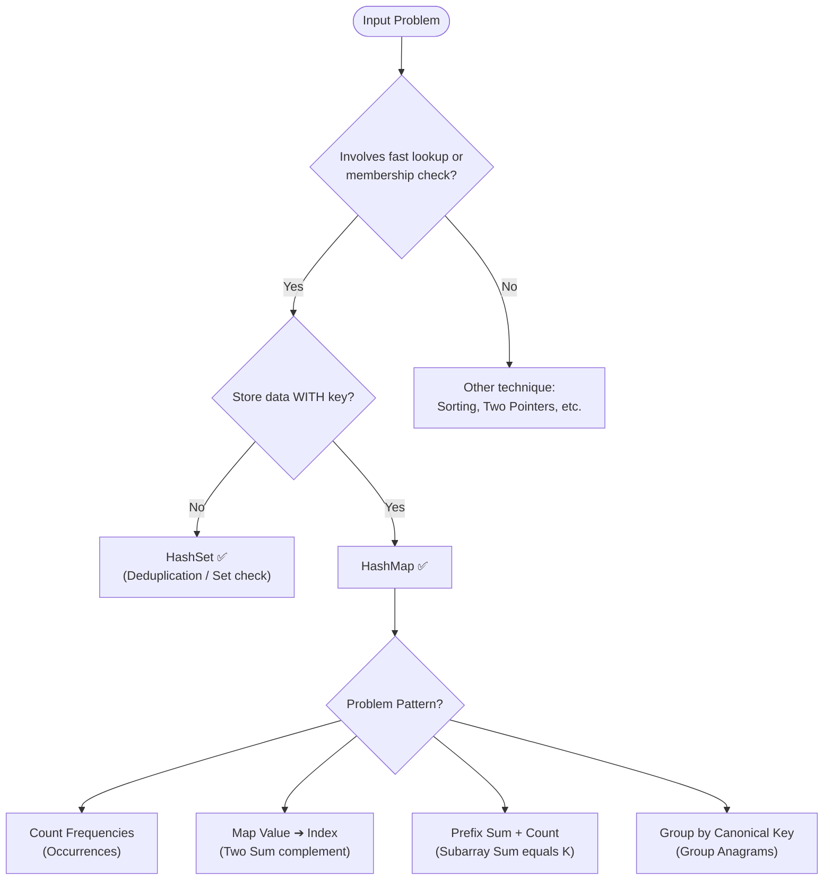

import DsaWeek4HashTablesDiagram from '@site/src/components/DsaWeek4HashTablesDiagram';

# Week 4: Hash Tables & Sets

## 1. Overview

Welcome to Week 4! This week concludes our first phase on Core Data Structures. We are diving into **Hash Tables** (specifically `HashMap` and `HashSet` in Java). This is arguably the **most important data structure for coding interviews** — it appears in roughly 40–50% of all LeetCode medium problems, either as the primary technique or as a key supporting structure.

Hash tables allow us to **trade space for time**, achieving lightning-fast $O(1)$ lookups and inserts. They are the backbone of caching, frequency counting, and relational mapping.

### Why Does This Matter?

Without a hash table, finding whether a number exists in an unsorted list takes $O(N)$ — you scan every element. With a hash table, it takes $O(1)$ — regardless of whether the list has 10 or 10 million elements. **This trade-off (spend memory, save time) is the single most common optimization in software engineering.**

**Goals for this week:**
- Understand how Hash Functions map arbitrary keys to array indices.
- Learn how Java handles hash collisions under the hood.
- Master the `equals()` and `hashCode()` contract for custom objects.
- Recognize patterns where $O(N^2)$ brute-force solutions can be reduced to $O(N)$ using a HashMap.
- Build intuition for when to use a `HashMap` vs. a `HashSet` vs. a `LinkedHashMap`.

### Knowledge You Need Before Starting

- Strong grasp of arrays/strings plus two-pointer/window fundamentals.
- Basic object identity vs equality understanding in Java.
- Comfort with Big-O average vs worst-case complexity discussion.
- Ability to model problems as membership, frequency, and key-value lookup.

---

## 2. The Core Mental Model: How Does a Hash Table Actually Work?

<DsaWeek4HashTablesDiagram />


Before memorizing templates, you need to understand **what is happening under the hood**. This will help you reason about edge cases and explain your choices in interviews.

### 2.1 The Bucket Array

A hash table is, at its core, just a **regular array** with a clever trick for finding things fast.



---

### 5.2 Keyword Trigger Table

| Problem Keywords                                 | Technique                   | Key Data Structure                 |
| ------------------------------------------------ | --------------------------- | ---------------------------------- |
| "two numbers that sum to target" (unsorted)      | Complement lookup           | `HashMap<value, index>`            |
| "contains duplicate" / "seen before"             | Membership tracking         | `HashSet`                          |
| "group anagrams" / "group by property"           | Canonical key grouping      | `HashMap<key, List>`               |
| "first unique character" / "first non-repeating" | Frequency map + scan        | `HashMap` or `LinkedHashMap`       |
| "count occurrences" / "frequency"                | Frequency counting          | `HashMap<element, count>`          |
| "subarray sum equals k" / "number of subarrays"  | Prefix sum + complement     | `HashMap<prefixSum, count>`        |
| "longest consecutive sequence"                   | Set membership check        | `HashSet`                          |
| "valid sudoku" / "valid board"                   | Multi-key existence check   | `HashSet` per row/col/box          |
| "top K frequent elements"                        | Freq map + heap/bucket sort | `HashMap` + `PriorityQueue`        |
| "design LRU cache"                               | O(1) access + O(1) eviction | `LinkedHashMap` or `HashMap` + DLL |
| "isomorphic strings" / "word pattern"            | Bidirectional mapping       | Two `HashMap`s                     |

---

### 5.3 Common Traps & How to Avoid Them

**Trap 1: Using a custom object as a key without overriding `hashCode()`**

```java
// ❌ Point only overrides equals()
Map<Point, String> map = new HashMap<>();
map.put(new Point(1,2), "A");
map.get(new Point(1,2));  // → null! Different hash → different bucket

// ✅ Always override BOTH equals() and hashCode()
@Override public int hashCode() { return Objects.hash(x, y); }
```

**Trap 2: Checking `containsValue()` in a hot loop**

```java
// ❌ containsValue is O(N) — scanning all values
if (map.containsValue(target)) { ... }  // Inside a loop → O(N²) total!

// ✅ Maintain a reverse map if you need value lookups
Map<Integer, String> reverseMap = new HashMap<>();
// Or restructure to use keys instead
```

**Trap 3: Modifying a map while iterating over it**

```java
// ❌ ConcurrentModificationException!
for (String key : map.keySet()) {
    if (shouldRemove(key)) {
        map.remove(key);   // Boom!
    }
}

// ✅ Use iterator.remove() or collect keys first
Iterator<String> it = map.keySet().iterator();
while (it.hasNext()) {
    if (shouldRemove(it.next())) it.remove();  // Safe
}

// ✅ Or collect removals separately
List<String> toRemove = new ArrayList<>();
for (String key : map.keySet()) {
    if (shouldRemove(key)) toRemove.add(key);
}
toRemove.forEach(map::remove);
```

**Trap 4: Forgetting `putIfAbsent(0, 1)` in prefix sum problems**

```java
// ❌ Missing the base case
Map<Integer, Integer> prefixCount = new HashMap<>();
// If the subarray starting at index 0 sums to k, we'll miss it!

// ✅ Always initialize with the empty prefix
prefixCount.put(0, 1);  // "A prefix sum of 0 has been seen once"
```

**Trap 5: Integer unboxing `NullPointerException` with `map.get()`**

```java
// ❌ map.get() returns Integer (boxed), not int
int val = map.get("key");  // NullPointerException if key doesn't exist!

// ✅ Always use getOrDefault for primitives
int val = map.getOrDefault("key", 0);
```

**Trap 6: Isomorphic string mapping in only one direction**

```java
// Problem: "paper" → "title" (p→t, a→i, e→l, r→e) — valid
// But also: "foo" → "bar" (f→b, o→a, o→r) — INVALID, 'o' maps to both 'a' and 'r'
// AND: "ab" → "aa" (a→a, b→a) — INVALID, both 'a' and 'b' map to 'a'

// ❌ Only mapping s→t direction misses the second case
// ✅ Use two maps: one for s→t, one for t→s
Map<Character, Character> sToT = new HashMap<>();
Map<Character, Character> tToS = new HashMap<>();
// Check both mappings are consistent
```

---

## 6. Worked Examples (Step-by-Step Walkthroughs)

### Example 1: LeetCode 1 — Two Sum

**Problem:** Return indices of two numbers that add up to `target`.

**Thought process:**
1. Brute force: check every pair → $O(N^2)$.
2. Key insight: for each `nums[i]`, we need `target - nums[i]`. If we've already seen that value, we're done.
3. Store `(value → index)` in a HashMap as we scan.
4. Check before inserting to avoid using the same index twice.

```
nums = [2, 7, 11, 15], target = 9

i=0: num=2, complement=7
  seen={} → 7 not found → add {2:0}

i=1: num=7, complement=2
  seen={2:0} → 2 FOUND at index 0 → return [0, 1] ✅
```

```java
class Solution {
    public int[] twoSum(int[] nums, int target) {
        Map<Integer, Integer> seen = new HashMap<>();  // value → index

        for (int i = 0; i < nums.length; i++) {
            int complement = target - nums[i];

            if (seen.containsKey(complement)) {
                return new int[]{seen.get(complement), i};
            }

            seen.put(nums[i], i);  // Add AFTER check
        }

        return new int[]{};
    }
}
```

**Complexity:** Time $O(N)$, Space $O(N)$. Each element visited once; map stores at most N entries.

---

### Example 2: LeetCode 49 — Group Anagrams

**Problem:** Group strings that are anagrams of each other.

**Thought process:**
1. Two strings are anagrams if they have the same characters in the same frequencies.
2. We need a **canonical key** that is identical for all anagrams.
3. Option A: Sort each string → `"eat"` and `"tea"` both become `"aet"`. Cost: $O(M \log M)$ per string where M = string length.
4. Option B: Build a 26-character frequency array → `"eat"` becomes `[1,0,0,0,1,0,...,1,0,0]` (counts for a,e,t). Cost: $O(M)$ per string. **Better.**

```
strs = ["eat","tea","tan","ate","nat","bat"]

"eat" → freq array → key="#1#0#0#0#1#...#1#..." → group A
"tea" → same freq   → key="#1#0#0#0#1#...#1#..." → group A ← SAME KEY
"ate" → same freq   → key="#1#0#0#0#1#...#1#..." → group A ← SAME KEY
"tan" → freq(a=1,n=1,t=1) → different key → group B
"nat" → same as tan → group B
"bat" → freq(a=1,b=1,t=1) → group C

Result: [["eat","tea","ate"], ["tan","nat"], ["bat"]]
```

```java
class Solution {
    public List<List<String>> groupAnagrams(String[] strs) {
        Map<String, List<String>> map = new HashMap<>();

        for (String s : strs) {
            // Build frequency key — O(M) instead of O(M log M) sorting
            int[] freq = new int[26];
            for (char c : s.toCharArray()) {
                freq[c - 'a']++;
            }
            // Convert array to string key: "#1#0#0#0#1#..."
            // Using Arrays.toString() also works but is slower due to brackets and commas
            StringBuilder sb = new StringBuilder();
            for (int f : freq) {
                sb.append('#').append(f);
            }
            String key = sb.toString();

            map.computeIfAbsent(key, k -> new ArrayList<>()).add(s);
        }

        return new ArrayList<>(map.values());
    }
}
```

**Why prefix `#` before each frequency?** Without it, frequencies `[1,12]` and `[11,2]` would both produce key `"112"` — a collision in our key design! With `#` as separator: `"#1#12"` vs `"#11#2"` → unambiguous.

**Complexity:** Time $O(N \times M)$, Space $O(N \times M)$ where N = number of strings, M = max string length.

---

### Example 3: LeetCode 128 — Longest Consecutive Sequence

**Problem:** Given an unsorted array, find the length of the longest sequence of consecutive integers. Must run in $O(N)$.

**Thought process:**
1. Sort and scan? That's $O(N \log N)$ — too slow.
2. Key insight: put everything in a `HashSet`. Then for each number, check if it's the **start of a sequence** (i.e., `num - 1` is NOT in the set).
3. If it's a sequence start, count upward: how many consecutive numbers follow?
4. Each number is visited at most twice (once for the "is it a start?" check, once for the count) → $O(N)$ total.

```
nums = [100, 4, 200, 1, 3, 2]
set  = {100, 4, 200, 1, 3, 2}

Check 100: is 99 in set? No → start of sequence. Count: 100, 101? No → length=1
Check 4:   is 3 in set? Yes → NOT a start, skip
Check 200: is 199 in set? No → start. Count: 200, 201? No → length=1
Check 1:   is 0 in set? No → start of sequence. Count: 1,2,3,4 → length=4 ✅
Check 3:   is 2 in set? Yes → NOT a start, skip
Check 2:   is 1 in set? Yes → NOT a start, skip

Answer: 4
```

```java
class Solution {
    public int longestConsecutive(int[] nums) {
        Set<Integer> numSet = new HashSet<>();
        for (int num : nums) numSet.add(num);

        int longestStreak = 0;

        for (int num : numSet) {
            // Only start counting from the beginning of a sequence
            if (!numSet.contains(num - 1)) {
                int currentNum = num;
                int currentStreak = 1;

                while (numSet.contains(currentNum + 1)) {
                    currentNum++;
                    currentStreak++;
                }

                longestStreak = Math.max(longestStreak, currentStreak);
            }
        }

        return longestStreak;
    }
}
```

**Why iterate over `numSet` not `nums`?** Iterating over the set avoids processing duplicates. If `nums = [1,1,1,2]`, iterating over `nums` would check `1` as a sequence start three times — wasted work.

**Complexity:** Time $O(N)$, Space $O(N)$. Each element is a sequence start at most once, and each element is visited in the `while` loop at most once.

---

### Example 4: LeetCode 560 — Subarray Sum Equals K

**Problem:** Count the number of subarrays that sum to `k`.

**Thought process:**
1. Brute force: check all subarrays → $O(N^2)$.
2. Key insight: use **prefix sums**. If `prefixSum[j] - prefixSum[i] == k`, then the subarray from index `i+1` to `j` sums to `k`.
3. Rearranging: `prefixSum[i] == prefixSum[j] - k`.
4. So for each `j`, we need to know how many previous prefix sums equal `prefixSum[j] - k`. Store prefix sum frequencies in a HashMap.

```
nums = [1, 1, 1],  k = 2

prefixCount = {0: 1}   ← empty prefix initialized
runningSum = 0

i=0, num=1: runningSum=1, needed=1-2=-1 → count+=0. add {1:1}
i=1, num=1: runningSum=2, needed=2-2=0 → count+=1 (found {0:1}). add {2:1}
i=2, num=1: runningSum=3, needed=3-2=1 → count+=1 (found {1:1}). add {3:1}

Answer: 2  ([1,1] at indices 0-1 and [1,1] at indices 1-2)
```

```java
class Solution {
    public int subarraySum(int[] nums, int k) {
        Map<Integer, Integer> prefixCount = new HashMap<>();
        prefixCount.put(0, 1);   // Critical: empty prefix
        int count = 0, runningSum = 0;

        for (int num : nums) {
            runningSum += num;
            count += prefixCount.getOrDefault(runningSum - k, 0);
            prefixCount.put(runningSum, prefixCount.getOrDefault(runningSum, 0) + 1);
        }

        return count;
    }
}
```

---

## 7. Problem-Solving Framework (Use This in Interviews)

### Step 1 — Recognize the Pattern (30 seconds)

Ask yourself:
- Do I need to check if something **exists**? → `HashSet`
- Do I need to check what **value is associated** with a key? → `HashMap`
- Am I **counting frequencies**? → `HashMap<element, count>`
- Am I **pairing elements** (A + B = target)? → `HashMap<value, index/count>`
- Am I **grouping things** by a shared property? → `HashMap<key, List>`
- Is this a **subarray sum** problem? → Prefix sum + `HashMap`

### Step 2 — State the Brute Force (1 minute)

Always lead with correctness:
> "The naive approach is $O(N^2)$ — check every pair. It gives the right answer but won't scale."

### Step 3 — Identify the Bottleneck

> "The bottleneck is the repeated inner loop lookup. Each time we scan the array for a complement, we're doing $O(N)$ work. If we could make that lookup $O(1)$, the whole solution becomes $O(N)$."

### Step 4 — Apply the HashMap Optimization

> "I'll use a HashMap to store elements we've seen so far. For each new element, I calculate what I'm looking for and check the map in $O(1)$."

### Step 5 — Handle Edge Cases Out Loud

Always mention these:
- Empty array/string
- All duplicate elements
- Negative numbers (prefix sums can be negative!)
- Target = 0 (complement of every element is itself)
- k = 0 in subarray sum (empty subarrays — does `prefixCount.put(0, 1)` handle this?)

---

## 8. 7-Day Practice Plan (21 Problems)

**Day 1: HashSet Basics**
1. Contains Duplicate (LC 217) — *Simplest possible HashSet problem*
2. Intersection of Two Arrays (LC 349) — *Set intersection*
3. Happy Number (LC 202) — *Cycle detection with a set*

> **Day 1 Focus:** For LC 202, the key insight is that if a number enters a cycle, we'll see a repeated value. A `HashSet` detects cycles by checking if the next value was already visited. Ask: "Why is a HashSet better than a list here?"

**Day 2: HashMap Fundamentals**
4. Two Sum (LC 1) — *Classic complement lookup*
5. Isomorphic Strings (LC 205) — *Bidirectional mapping — use two maps!*
6. Word Pattern (LC 290) — *Same as isomorphic strings but with words*

> **Day 2 Focus:** LC 205 and LC 290 share the exact same pattern. After solving one, solve the other in under 5 minutes. Notice what's reused.

**Day 3: Frequency Counting Patterns**
7. Valid Anagram (LC 242) — *26-element frequency array vs. HashMap — know both*
8. Ransom Note (LC 383) — *Same pattern as anagram, different story*
9. First Unique Character in a String (LC 387) — *Two passes: first to count, second to find*

> **Day 3 Focus:** For LC 387, can you do it in one pass using a `LinkedHashMap`? (Insert characters in order, then find first with count 1.)

**Day 4: Grouping & Matrix Mapping**
10. Group Anagrams (LC 49) — *Canonical key design*
11. Valid Sudoku (LC 36) — *Three HashSets per position: row, column, box*
12. Top K Frequent Elements (LC 347) — *Freq map + bucket sort (avoid heap for O(N))*

> **Day 4 Focus:** LC 347 has two approaches. The heap approach is $O(N \log K)$. The bucket sort approach is $O(N)$. Know both and when to use each.

**Day 5: Advanced Search & Subarrays**
13. Longest Consecutive Sequence (LC 128) — *The "only start from sequence beginnings" trick*
14. Subarray Sum Equals K (LC 560) — *Prefix sum + HashMap — master this pattern*
15. Contiguous Array (LC 525) — *Reframe 0s as -1s, then it becomes subarray sum = 0*

> **Day 5 Focus:** LC 525 is a clever disguise of LC 560. After solving 560, analyze 525 and identify the transformation. This is a senior-level pattern recognition skill.

**Day 6: Design Challenges**
16. Design HashMap (LC 706) — *Implement from scratch: array of lists*
17. Design HashSet (LC 705) — *Same, but without values*
18. Insert Delete GetRandom O(1) (LC 380) — *HashMap + ArrayList working together*

> **Day 6 Focus:** LC 380 is a common system design warm-up problem. The trick: the ArrayList enables O(1) random access; the HashMap enables O(1) deletion by swapping with the last element.

**Day 7: Complex Implementations & Review**
19. Find All Numbers Disappeared in an Array (LC 448) — *Solve twice: once with O(N) space, once in-place O(1)*
20. Minimum Window Substring (LC 76) — *Hard: Sliding window + two frequency maps*
21. Longest Palindrome (LC 409) — *Frequency map + parity check*

> **Day 7 Focus:** LC 76 is a hard problem that combines Week 2's sliding window with this week's frequency maps. Don't be discouraged if it takes time. Walk through the two-map comparison approach carefully.

---

## 9. Mock Interview Module

### Problem: The Fraudulent Transaction Detector

**Context:** You are building a risk-analysis engine for a fintech company. You are given a real-time stream of `Transaction` objects. A user's account is flagged if they make two transactions within `K` seconds of each other.

```java
class Transaction {
    int id;
    String accountId;
    int timestamp;
}
```

**Question:** `public boolean hasFraudulentActivity(Transaction[] txs, int k)`

---

#### Step 1: Clarifying Questions & Expected Answers

- *Candidate:* "Is the array sorted by timestamp?" → *Interviewer:* Roughly chronological, but don't rely on perfect sorting.
- *Candidate:* "Can an account have more than two transactions?" → *Interviewer:* Yes. Any two within K seconds triggers the flag.
- *Candidate:* "Should 'within K seconds' be strictly less than K, or less than or equal?" → *Interviewer:* Less than or equal (`<= k`).
- *Candidate:* "What should I return if `txs` is null or empty?" → *Interviewer:* Return `false`.

> **Tip:** The `<= vs <` clarification is subtle but can change output on boundary test cases. Always ask.

---

#### Step 2: Brute Force

```java
// Time: O(N²), Space: O(1)
public boolean hasFraudulentActivity(Transaction[] txs, int k) {
    for (int i = 0; i < txs.length; i++) {
        for (int j = i + 1; j < txs.length; j++) {
            if (txs[i].accountId.equals(txs[j].accountId) &&
                Math.abs(txs[i].timestamp - txs[j].timestamp) <= k) {
                return true;
            }
        }
    }
    return false;
}
```

*Interviewer:* "Millions of transactions per day. This crashes our servers. Single-pass solution?"

**How to spot the optimization:**
- We're repeatedly scanning all previous transactions for the same `accountId`.
- If we stored the **most recent timestamp per accountId**, we'd only need the last entry — no scanning needed.

---

#### Step 3: Optimized Solution (HashMap)

```java
// Time: O(N), Space: O(U) — U = number of unique accounts
public boolean hasFraudulentActivity(Transaction[] txs, int k) {
    if (txs == null || txs.length == 0) return false;

    Map<String, Integer> lastSeen = new HashMap<>();  // accountId → most recent timestamp

    for (Transaction tx : txs) {
        if (lastSeen.containsKey(tx.accountId)) {
            int previousTime = lastSeen.get(tx.accountId);
            if (tx.timestamp - previousTime <= k) {
                return true;
            }
        }
        // Always update to the most recent timestamp for this account
        lastSeen.put(tx.accountId, tx.timestamp);
    }

    return false;
}
```

**Walk through this aloud:**
> "I maintain a HashMap from accountId to the most recent timestamp. For each new transaction, I check if we've seen this account before and if the time gap is within K seconds. This makes the check O(1) per transaction, giving O(N) overall."

**Why only store the most recent timestamp?**
> "If the array is roughly chronological, the most recent timestamp is the only one that could form a valid pair with the current transaction. An older transaction would have a larger time gap — not smaller."

**Important caveat:** If the array is *not* sorted at all, this approach can fail. Discuss with the interviewer:
```
Scenario (unsorted): txs = [{acc:A, time:100}, {acc:A, time:5}, {acc:A, time:102}], k=5
With lastSeen approach:
  time=100 → lastSeen={A:100}
  time=5   → 100-5=95 > 5, no fraud → lastSeen={A:5}    ← replaced 100 with 5!
  time=102 → 102-5=97 > 5, no fraud → returns false

But {time:100} and {time:102} differ by only 2 seconds → should return true! ❌

Fix for unsorted input: Store ALL timestamps per account in a sorted structure.
Map<String, TreeSet<Integer>> lastSeen → for each tx, check floor/ceiling in O(log N).
```

---

#### Step 4: Follow-up Questions

**Follow-up 1 (Distributed Systems):**
*Interviewer:* "The system is distributed across 50 microservices. A Java HashMap only lives in one JVM's RAM. How do you redesign this?"

*Expected thought process:*
- Replace the in-memory `HashMap` with **Redis** (an external distributed key-value store).
- Each service does: `GET <accountId>` → compare timestamps → if fraud, flag → `SET <accountId> <timestamp>`.
- **TTL optimization:** Set a TTL of K seconds on each Redis key. If the key expires naturally, any new transaction for that account is automatically safe relative to it. This keeps memory lean without manual cleanup.
- **Atomicity concern:** What if two transactions for the same account arrive simultaneously at different servers? You need **Redis atomic operations** (`SET NX`, `EVAL` Lua scripts, or **Redis Streams**) to avoid a race condition.

**Follow-up 2 (Storing more transactions):**
*Interviewer:* "What if we need to track ALL recent transactions per account, not just the most recent, to detect complex fraud patterns (e.g., 5 transactions in 10 minutes)?"

*Expected thought process:*
- Change the map to `Map<String, Deque<Integer>>` — a sliding window per account.
- For each new transaction, add the timestamp to the deque. Then evict timestamps older than K seconds from the front.
- If `deque.size() >= threshold`, trigger fraud.
- This is essentially a **sliding window per account** — combining Week 2 and Week 4 concepts.

**Follow-up 3 (Space optimization):**
*Interviewer:* "What if there are 100 million unique accounts? Memory is a concern."

*Expected thought process:*
- For this scale, even $O(U)$ space (one entry per unique account) may be impractical in a single machine.
- Solutions: (1) **Sharding** — partition accounts across machines by hash of accountId. (2) **Bloom filters** — probabilistic membership check with minimal memory. (3) **Time-bucketing** — only keep accounts active in the last K seconds using a time-indexed structure.

---

## 10. Connecting to Other Weeks

Hash Tables rarely appear alone in real problems. Here's how this week connects to the roadmap:

```
Week 1 (Arrays) + Week 4 (HashMap):
  → Prefix Sum + HashMap = Subarray Sum problems (LC 560, LC 525)
  → This is one of the most frequent interview patterns!

Week 2 (Sliding Window) + Week 4 (HashMap):
  → Variable Sliding Window with character frequencies
  → Minimum Window Substring (LC 76), Longest Substring without Repeating (LC 3)
  → The window uses a HashMap to track what's inside

Week 4 (HashMap) + Later weeks (Graphs):
  → Adjacency list representation: Map<Node, List<Node>>
  → Visited tracking: Set<Node> visited
  → BFS/DFS become O(V+E) partly because HashSet lookups are O(1)

Week 4 (HashMap) + Later weeks (Design):
  → LRU Cache = HashMap + Doubly Linked List
  → The HashMap gives O(1) access, the DLL gives O(1) eviction
```

---

## 11. Quick Reference Cheat Sheet

```
╔══════════════════════════════════════════════════════════════╗
║              HASH TABLES & SETS CHEAT SHEET                 ║
╠══════════════════════════════════════════════════════════════╣
║ HASHSET — Use for membership / uniqueness                    ║
║  add(x), contains(x), remove(x) → all O(1) avg             ║
║  Patterns: seen-before, dedup, cycle detection              ║
╠══════════════════════════════════════════════════════════════╣
║ HASHMAP — Use for key→value mapping                         ║
║  put(k,v), get(k), getOrDefault(k,def) → all O(1) avg      ║
║  Patterns: freq count, complement lookup, grouping          ║
╠══════════════════════════════════════════════════════════════╣
║ FREQUENCY COUNTING TEMPLATE                                  ║
║  map.put(x, map.getOrDefault(x, 0) + 1)                    ║
╠══════════════════════════════════════════════════════════════╣
║ COMPLEMENT LOOKUP TEMPLATE                                   ║
║  if (seen.containsKey(target - num)) → found!               ║
║  seen.put(num, i)  ← add AFTER check                       ║
╠══════════════════════════════════════════════════════════════╣
║ PREFIX SUM + MAP TEMPLATE                                    ║
║  prefixCount.put(0, 1)  ← ALWAYS initialize                ║
║  count += prefixCount.getOrDefault(runningSum - k, 0)       ║
╠══════════════════════════════════════════════════════════════╣
║ THE CONTRACT (custom keys)                                   ║
║  equals() == true  →  hashCode() must be equal             ║
║  Always override BOTH or neither                            ║
╠══════════════════════════════════════════════════════════════╣
║ COMPLEXITY                                                   ║
║  Average: O(1) per operation                                ║
║  Worst case: O(N) if all keys collide (rare in practice)    ║
║  Java 8+: buckets > 8 entries → Red-Black Tree → O(log N) ║
╚══════════════════════════════════════════════════════════════╝
```

---

## 12. What's Coming Next

**Week 5** introduces **Stacks & Queues**, which build directly on this week:
- Monotonic Stack problems often use a `HashMap` to store index mappings.
- BFS (which uses a Queue) relies on a `HashSet` to track visited nodes.

**Week 6** introduces **Trees**, where HashMaps appear again:
- Storing parent pointers: `Map<TreeNode, TreeNode>`
- Memoization in tree recursion: `Map<state, result>`
- Serialization/deserialization of trees uses HashMaps for level-order tracking.

The pattern you will notice: **HashMaps are the glue that makes other data structures O(1)-efficient.** Almost every advanced data structure problem uses a HashMap internally. Mastering HashMaps now will make future weeks much easier.