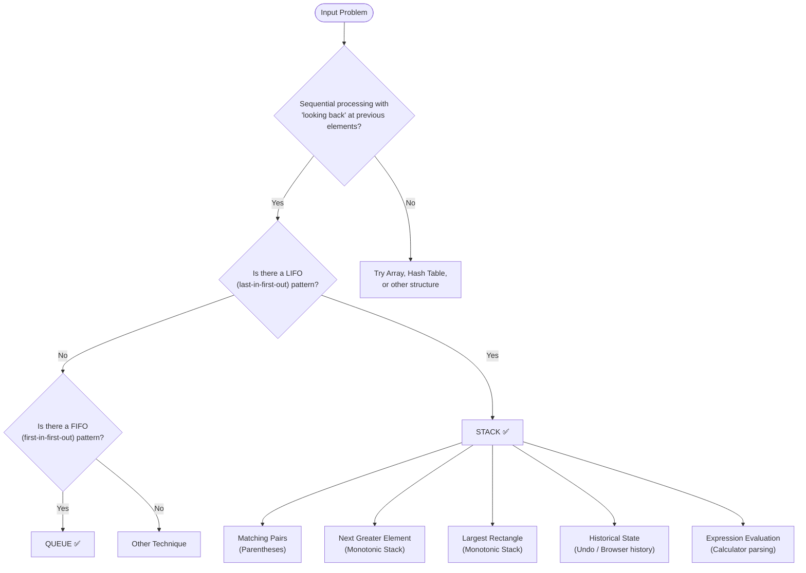

import DsaWeek5MonotonicStackDiagram from '@site/src/components/DsaWeek5MonotonicStackDiagram';

# Week 5: Stacks, Queues & Monotonic Stack

## 1. Overview

Welcome to Week 5 and the beginning of **Phase 2: Linear Data Structures with Constraints**! Having mastered arrays and hash tables, we now move to abstract data types that enforce **strict rules** on how data is inserted and removed: **Stacks (LIFO)** and **Queues (FIFO)**.

Beyond the basics, this week heavily emphasizes the **Monotonic Stack**, a pattern that sounds intimidating but is beautifully simple once understood. It's used to solve "Next Greater Element," "Largest Rectangle," and similar problems that would be $O(N^2)$ with brute force, but become $O(N)$ with this technique.

### Why Does This Matter?

Stacks and queues aren't just abstract concepts — they're the **fundamental building blocks of how computers work**:
- Your program's **call stack** (function calls) is a stack
- Your CPU's **instruction pipeline** is a queue
- Your browser's **back button** is a stack
- Your OS's **print spooler** is a queue

In interviews, stacks appear in roughly 15–20% of problems, and the **Monotonic Stack** pattern is a "must-know" that instantly separates junior from senior candidates.

**Goals for this week:**
- Understand LIFO (Last-In-First-Out) and FIFO (First-In-First-Out) principles at a deep level.
- Learn why Java's `java.util.Stack` is obsolete and what to use instead.
- Master the Monotonic Stack pattern to optimize nested loops dealing with sequential comparisons.
- Build the ability to recognize when a problem is "secretly" a stack or queue problem.

### Knowledge You Need Before Starting

- Fluency with arrays and index traversal from Weeks 1-2.
- Comfort with `ArrayDeque` operations and basic API usage.
- Ability to reason about amortized complexity and one-pass constraints.
- Pattern recognition from hash-map and two-pointer problems.

---

## 2. The Core Mental Models

<DsaWeek5MonotonicStackDiagram />


### 2.1 Stack (LIFO) — The "Plate Stack"

Imagine a stack of plates in a cafeteria. You can only add a plate to the top or remove the top plate. You **cannot** reach into the middle.



---

### 5.2 Keyword Trigger Table

| Problem Keywords                    | Technique          | Data Structure               |
| ----------------------------------- | ------------------ | ---------------------------- |
| "matching brackets/parentheses"     | Matching pairs     | Stack                        |
| "valid parentheses"                 | Matching pairs     | Stack                        |
| "next greater/smaller element"      | Monotonic stack    | Deque (as stack)             |
| "daily temperatures" / "stock span" | Monotonic stack    | Deque (as stack)             |
| "largest rectangle" / "max area"    | Monotonic stack    | Deque (as stack)             |
| "sliding window maximum"            | Monotonic deque    | Deque (both ends)            |
| "undo/redo"                         | Historical state   | Stack (or two stacks)        |
| "browser history"                   | Historical state   | Two stacks (back/forward)    |
| "evaluate expression"               | Expression parsing | Stack (operands + operators) |
| "simplify path"                     | String parsing     | Stack (directory levels)     |
| "decode string"                     | Nested structures  | Stack (track multipliers)    |
| "level-order traversal"             | Tree/graph BFS     | Queue                        |
| "implement queue with stacks"       | Design challenge   | Two stacks                   |
| "circular array"                    | Wrap-around        | Monotonic stack + 2× scan    |

---

### 5.3 Common Traps & How to Avoid Them

**Trap 1: Using `java.util.Stack` instead of `ArrayDeque`**

```java
// ❌ Slow and discouraged
Stack<Integer> stack = new Stack<>();

// ✅ Fast and modern
Deque<Integer> stack = new ArrayDeque<>();
```

---

**Trap 2: Storing values instead of indices in monotonic stack**

```java
// ❌ Lost position information
stack.push(nums[i]);

// ✅ Can always get value via nums[stack.peek()]
stack.push(i);
```

---

**Trap 3: Forgetting to initialize result array to -1**

```java
// ❌ Defaults to 0, which might be a valid answer!
int[] result = new int[n];

// ✅ Clear signal of "no answer found"
int[] result = new int[n];
Arrays.fill(result, -1);
```

---

**Trap 4: Wrong comparison in the while loop (monotonic stack)**

```java
// Next GREATER element (pop smaller ones)
while (!stack.isEmpty() && nums[i] > nums[stack.peek()]) {
                                   ↑ strictly greater
// Next SMALLER element (pop bigger ones)
while (!stack.isEmpty() && nums[i] < nums[stack.peek()]) {
                                   ↑ strictly smaller

// Mixing these up will give completely wrong results!
```

---

**Trap 5: Not handling circular arrays correctly**

```java
// For circular "next greater," traverse 2N elements
for (int i = 0; i < 2 * n; i++) {
    int idx = i % n;  // Map to actual index
    // But only fill result once (i < n)
    if (i < n) result[idx] = ...;
}
```

---

**Trap 6: Forgetting the "end" timestamp is inclusive in function execution time**

```java
// In LC 636 Exclusive Time of Functions:
// "0:end:5" means the function ran THROUGH second 5 (inclusive)
result[id] += timestamp - prevTime + 1;  // +1 is critical!
                                      ↑
```

---

**Trap 7: Not checking `isEmpty()` before `peek()` or `pop()`**

```java
// ❌ EmptyStackException or NullPointerException
char top = stack.pop();  // Crashes if stack is empty!

// ✅ Always guard with isEmpty()
if (stack.isEmpty()) return false;
char top = stack.pop();
```

---

## 6. Worked Examples (Step-by-Step Walkthroughs)

### Example 1: LeetCode 20 — Valid Parentheses

**Problem:** Determine if a string of brackets is valid (every opening has a matching closing in the correct order).

**Thought process:**
1. **Key insight:** An opening bracket must be closed by the **most recent** unclosed bracket. This is LIFO → Stack.
2. For every opening bracket `(`, `{`, `[` → push it.
3. For every closing bracket `)`, `}`, `]` → the top of the stack **must** be the matching opening. If not, return `false`.
4. At the end, the stack must be empty (all opened brackets were closed).

```
Input: "{[()]}"

Step 1: '{'  → opening → push '{'  → stack=['{ ']
Step 2: '['  → opening → push '['  → stack=['{','[']
Step 3: '('  → opening → push '('  → stack=['{','[','(']
Step 4: ')'  → closing → top='(' matches → pop → stack=['{','[']
Step 5: ']'  → closing → top='[' matches → pop → stack=['{']
Step 6: '}'  → closing → top='{' matches → pop → stack=[]

Stack is empty → Valid ✅
```

```java
class Solution {
    public boolean isValid(String s) {
        Deque<Character> stack = new ArrayDeque<>();

        for (char c : s.toCharArray()) {
            if (c == '(' || c == '{' || c == '[') {
                stack.push(c);
            } else {
                // Closing bracket
                if (stack.isEmpty()) return false;  // No matching opening
                char top = stack.pop();
                if (c == ')' && top != '(') return false;
                if (c == '}' && top != '{') return false;
                if (c == ']' && top != '[') return false;
            }
        }

        return stack.isEmpty();  // All brackets matched
    }
}
```

**Edge cases to test:**
- `"(]"` → wrong closing → `false`
- `"((("` → stack not empty at end → `false`
- `")))"` → stack empty when trying to pop → `false`
- `""` → empty string → `true` (vacuously valid)

---

### Example 2: LeetCode 739 — Daily Temperatures

**Problem:** For each day's temperature, find how many days you have to wait for a warmer day.

**Thought process:**
1. For each day `i`, we need to find the next day `j` where `temp[j] > temp[i]`.
2. This is exactly "Next Greater Element" → Monotonic Stack.
3. We'll maintain a **decreasing stack** (higher temps at bottom).
4. When we encounter a warmer day, pop all cooler days — they just found their answer.

```
temps = [73, 74, 75, 71, 69, 72, 76, 73]
result = [0, 0, 0, 0, 0, 0, 0, 0]  (default: 0 days = no warmer day)
stack = []

i=0, temp=73: stack=[] → push 0 → stack=[0]

i=1, temp=74: 74 > temps[0]=73 → pop 0
    result[0] = 1-0 = 1 ✅
  push 1 → stack=[1]

i=2, temp=75: 75 > temps[1]=74 → pop 1
    result[1] = 2-1 = 1 ✅
  push 2 → stack=[2]

i=3, temp=71: 71 < 75 → push 3 → stack=[2,3]

i=4, temp=69: 69 < 71 → push 4 → stack=[2,3,4]

i=5, temp=72: 72 > 69 → pop 4 → result[4] = 5-4 = 1 ✅
              72 > 71 → pop 3 → result[3] = 5-3 = 2 ✅
              72 < 75 → push 5 → stack=[2,5]

i=6, temp=76: 76 > 72 → pop 5 → result[5] = 6-5 = 1 ✅
              76 > 75 → pop 2 → result[2] = 6-2 = 4 ✅
  push 6 → stack=[6]

i=7, temp=73: 73 < 76 → push 7 → stack=[6,7]

End: indices 6 and 7 still in stack → no warmer day → result[6]=0, result[7]=0

Final: [1, 1, 4, 2, 1, 1, 0, 0] ✅
```

```java
class Solution {
    public int[] dailyTemperatures(int[] temperatures) {
        int n = temperatures.length;
        int[] answer = new int[n];  // Defaults to 0
        Deque<Integer> stack = new ArrayDeque<>();

        for (int i = 0; i < n; i++) {
            // Pop all days with cooler temperatures
            while (!stack.isEmpty() && temperatures[i] > temperatures[stack.peek()]) {
                int prevDayIndex = stack.pop();
                answer[prevDayIndex] = i - prevDayIndex;  // Distance in days
            }
            stack.push(i);
        }

        return answer;  // Days still in stack remain 0
    }
}
```

**Complexity:** Time $O(N)$ — each index is pushed and popped at most once. Space $O(N)$ — stack can hold all indices in worst case (strictly decreasing temps).

---

### Example 3: LeetCode 84 — Largest Rectangle in Histogram

**Problem:** Given an array of heights representing a histogram, find the area of the largest rectangle.

**Thought process:**
1. For each bar `i`, the largest rectangle using that bar's height extends left and right until it hits a shorter bar.
2. We need: "nearest smaller bar to the left" and "nearest smaller bar to the right."
3. This is a **Monotonic Stack** problem (increasing stack — pop when we see a shorter bar).

**The key insight:** When we pop a bar, we know:
- Its height: `heights[poppedIndex]`
- Its right boundary: current index `i` (first bar shorter than it on the right)
- Its left boundary: `stack.peek()` (first bar shorter than it on the left, or -1 if stack is empty)
- Width: `i - stack.peek() - 1`

```
heights = [2, 1, 5, 6, 2, 3]

i=0, h=2: stack=[] → push 0 → stack=[0]

i=1, h=1: 1 < 2 → pop 0
    height=2, left=-1 (stack empty), right=1
    area = 2 × (1 - (-1) - 1) = 2 × 1 = 2
  push 1 → stack=[1]

i=2, h=5: 5 > 1 → push 2 → stack=[1,2]

i=3, h=6: 6 > 5 → push 3 → stack=[1,2,3]

i=4, h=2: 2 < 6 → pop 3
    height=6, left=2, right=4
    area = 6 × (4-2-1) = 6 × 1 = 6
  2 < 5 → pop 2
    height=5, left=1, right=4
    area = 5 × (4-1-1) = 5 × 2 = 10 ✅ (current max)
  2 > 1 → push 4 → stack=[1,4]

i=5, h=3: 3 > 2 → push 5 → stack=[1,4,5]

End of array → process remaining bars:
  pop 5: height=3, left=4, right=6
    area = 3 × (6-4-1) = 3 × 1 = 3
  pop 4: height=2, left=1, right=6
    area = 2 × (6-1-1) = 2 × 4 = 8
  pop 1: height=1, left=-1, right=6
    area = 1 × (6-(-1)-1) = 1 × 6 = 6

Max area = 10 ✅
```

```java
class Solution {
    public int largestRectangleArea(int[] heights) {
        Deque<Integer> stack = new ArrayDeque<>();
        int maxArea = 0;
        int n = heights.length;

        for (int i = 0; i <= n; i++) {
            // Use 0 as a sentinel at the end to flush the stack
            int h = (i == n) ? 0 : heights[i];

            while (!stack.isEmpty() && h < heights[stack.peek()]) {
                int height = heights[stack.pop()];
                int left = stack.isEmpty() ? -1 : stack.peek();
                int width = i - left - 1;
                maxArea = Math.max(maxArea, height * width);
            }

            stack.push(i);
        }

        return maxArea;
    }
}
```

**Why append a `0` sentinel?** Without it, bars still in the stack at the end would never be popped. The sentinel (height 0) triggers a final flush of all remaining bars.

---

### Example 4: LeetCode 232 — Implement Queue Using Stacks

**Problem:** Design a queue using only two stacks.

**Thought process:**
1. A queue is FIFO, but a stack is LIFO. How can we "reverse" the order?
2. **Key insight:** If you pop all elements from stack A and push them into stack B, the order reverses.
3. Strategy: Use one stack for `enqueue` and one for `dequeue`. When `dequeue` is called, if the dequeue stack is empty, transfer everything from enqueue stack.

```
Example operations:

enqueue(1): enqueueStack=[1], dequeueStack=[]
enqueue(2): enqueueStack=[1,2], dequeueStack=[]
enqueue(3): enqueueStack=[1,2,3], dequeueStack=[]

dequeue(): dequeueStack is empty → transfer all from enqueueStack
    Pop from enqueueStack: 3, 2, 1
    Push to dequeueStack: 3, 2, 1 → dequeueStack=[3,2,1]
                                                   ↓
                                                  top
    Now dequeueStack has them in FIFO order!
    Pop from dequeueStack → returns 1 ✅
    dequeueStack=[3,2] after pop

dequeue(): dequeueStack not empty → pop directly
    Pop from dequeueStack → returns 2 ✅
    dequeueStack=[3]

enqueue(4): enqueueStack=[4], dequeueStack=[3]

dequeue(): dequeueStack not empty → pop directly
    Pop from dequeueStack → returns 3 ✅
    dequeueStack=[]

dequeue(): dequeueStack is empty → transfer from enqueueStack
    dequeueStack=[4]
    Pop → returns 4 ✅
```

```java
class MyQueue {
    private Deque<Integer> enqueueStack;  // For adding elements
    private Deque<Integer> dequeueStack;  // For removing elements

    public MyQueue() {
        enqueueStack = new ArrayDeque<>();
        dequeueStack = new ArrayDeque<>();
    }

    public void push(int x) {
        enqueueStack.push(x);
    }

    public int pop() {
        // Transfer if needed
        if (dequeueStack.isEmpty()) {
            while (!enqueueStack.isEmpty()) {
                dequeueStack.push(enqueueStack.pop());
            }
        }
        return dequeueStack.pop();
    }

    public int peek() {
        if (dequeueStack.isEmpty()) {
            while (!enqueueStack.isEmpty()) {
                dequeueStack.push(enqueueStack.pop());
            }
        }
        return dequeueStack.peek();
    }

    public boolean empty() {
        return enqueueStack.isEmpty() && dequeueStack.isEmpty();
    }
}
```

**Amortized complexity:** Each element is moved between stacks at most once → $O(1)$ amortized per operation.

---

## 7. Problem-Solving Framework (Use This in Interviews)

### Step 1 — Identify the Access Pattern (30 seconds)

Ask yourself:
- Do I need the **most recent** item? → Stack
- Do I need the **oldest** item? → Queue
- Am I checking "what comes next" repeatedly? → Monotonic Stack
- Am I dealing with **matching pairs** or **nesting**? → Stack

### Step 2 — Choose the Right Monotonic Direction (if applicable)

- "Next **Greater**" → **Decreasing** stack
- "Next **Smaller**" → **Increasing** stack

**Memory aid:** You pop when the current element **breaks** the monotonic order. The direction you maintain is **opposite** to what you're searching for.

### Step 3 — Decide: Values or Indices?

**Almost always store indices.** You can get the value via `arr[stack.peek()]`, but you can't recover the index from just a value.

### Step 4 — Initialize the Result

```java
// For "next greater/smaller" problems
int[] result = new int[n];
Arrays.fill(result, -1);  // Default: no answer
```

### Step 5 — Walk Through the Template

1. Loop through array
2. While loop: pop elements that found their answer
3. Update result for each popped index
4. Push current index
5. Return result

### Step 6 — Test Edge Cases Out Loud

- Empty array → return `[]`
- Single element → next greater = `-1`
- Strictly increasing → everyone's next greater = `-1` except first
- Strictly decreasing → everyone pops immediately
- Circular array → traverse `2N` elements, mod index

---

## 8. 7-Day Practice Plan (21 Problems)

**Day 1: Stack & Queue Basics**
1. Valid Parentheses (LC 20) — *The foundational stack problem*
2. Min Stack (LC 155) — *Design: maintain min in O(1)*
3. Implement Queue using Stacks (LC 232) — *Two-stack reversal technique*

> **Day 1 Focus:** After LC 155, ask yourself: "Why do we need a second stack to track the min?" Understanding auxiliary stacks is critical for design problems.

---

**Day 2: String Parsing with Stacks**
4. Simplify Path (LC 71) — *Unix path, uses stack for directory levels*
5. Evaluate Reverse Polish Notation (LC 150) — *Classic stack application*
6. Decode String (LC 394) — *Nested brackets, multiplier tracking*

> **Day 2 Focus:** LC 394 is tricky — you need to track BOTH the multiplier AND the partial string at each nesting level. Use two stacks or a stack of pairs.

---

**Day 3: State Management & Removal**
7. Remove All Adjacent Duplicates In String (LC 1047) — *Stack for "undo" the last character*
8. Make The String Great (LC 1544) — *Same pattern as 1047, different condition*
9. Asteroid Collision (LC 735) — *Simulation with stack*

> **Day 3 Focus:** LC 735 has multiple collision scenarios (left-moving vs right-moving, equal size). Draw the state machine before coding.

---

**Day 4: Introduction to Monotonic Stack**
10. Next Greater Element I (LC 496) — *Monotonic stack + HashMap*
11. Daily Temperatures (LC 739) — *Pure monotonic stack, distances*
12. Online Stock Span (LC 901) — *Running monotonic stack in a stream*

> **Day 4 Focus:** After solving LC 739, rewrite it from memory without looking. The template must become muscle memory.

---

**Day 5: Advanced Monotonic Stack**
13. Next Greater Element II (LC 503) — *Circular array: 2× traversal*
14. 132 Pattern (LC 456) — *Hard: maintain the "middle" value as you scan*
15. Remove K Digits (LC 402) — *Greedy + monotonic stack*

> **Day 5 Focus:** LC 503 is your first circular array problem. The trick: run the loop for `2*n` iterations but only update result once.

---

**Day 6: Histogram & Hard Patterns**
16. Largest Rectangle in Histogram (LC 84) — *The canonical monotonic stack problem*
17. Maximal Rectangle (LC 85) — *Convert to LC 84 by treating rows as histograms*
18. Sliding Window Maximum (LC 239) — *Monotonic deque (not stack!)*

> **Day 6 Focus:** LC 84 is hard but appears in many forms. Spend extra time understanding the width calculation: `i - stack.peek() - 1`.

---

**Day 7: Design & Review**
19. Design Circular Queue (LC 622) — *Array-based queue with wrap-around*
20. Number of Recent Calls (LC 933) — *Queue with time-based eviction*
21. Car Fleet (LC 853) — *Physics + monotonic stack*

> **Day 7 Focus:** LC 853 combines multiple concepts (sorting, physics calculation, stack). It's a great "synthesis" problem to test your full understanding.

---

## 9. Mock Interview Module

### Problem: The Microservice Profiler (Exclusive Execution Time)

**Context:** You're building a monitoring tool. Functions call other functions. You're given logs like:
- `"0:start:0"` → function 0 starts at second 0
- `"1:start:2"` → function 1 starts at second 2 (function 0 is paused)
- `"1:end:5"` → function 1 ends at second 5 (ran from 2 to 5 inclusive)
- `"0:end:6"` → function 0 ends at second 6

**Question:** Return the **exclusive** time for each function (don't count time when child functions are running).

```java
class Transaction {
    int id;
    String type;  // "start" or "end"
    int timestamp;
}
```

---

#### Step 1: Clarifying Questions

- *Candidate:* "Are logs sorted by timestamp?" → *Interviewer:* Yes.
- *Candidate:* "Can a function call itself recursively?" → *Interviewer:* Yes.
- *Candidate:* "Is every `start` guaranteed to have an `end`?" → *Interviewer:* Yes.
- *Candidate:* "If a function ends at second 5, does that mean it ran THROUGH second 5, or UP TO second 5?" → *Interviewer:* **Through second 5 (inclusive).** This is critical!

> **Tip:** The inclusive vs exclusive timestamp question catches many candidates. Always clarify!

---

#### Step 2: Formulating the Strategy

*Candidate's thought process:*
- Functions nest like a **call stack** → Stack data structure.
- When a function **starts**, push it and mark the time.
- When a function **ends**, calculate how long it ran **since the last event**, add that time, and pop it.
- The tricky part: when function A is paused by function B, we need to **subtract B's time from A's total**.

**The insight:** Track `prevTime` — the timestamp of the last event. Each event (start or end) runs from `prevTime` to the current timestamp.

---

#### Step 3: Optimized Solution (Stack)

```java
public int[] exclusiveTime(int n, List<String> logs) {
    int[] result = new int[n];
    Deque<Integer> stack = new ArrayDeque<>();  // Stores function IDs
    int prevTime = 0;

    for (String log : logs) {
        String[] parts = log.split(":");
        int id = Integer.parseInt(parts[0]);
        String type = parts[1];
        int timestamp = Integer.parseInt(parts[2]);

        if (type.equals("start")) {
            // If there's a function currently running, give it credit for time up to now
            if (!stack.isEmpty()) {
                result[stack.peek()] += timestamp - prevTime;
            }
            stack.push(id);
            prevTime = timestamp;  // Reset prevTime to when this function started
        } else {  // "end"
            // The function ending gets credit for time since prevTime
            // IMPORTANT: "end" is INCLUSIVE, so we add 1
            result[stack.pop()] += timestamp - prevTime + 1;
            prevTime = timestamp + 1;  // Next function resumes at the start of the next second
        }
    }

    return result;
}
```

**Walkthrough:**
```
logs = ["0:start:0", "1:start:2", "1:end:5", "0:end:6"]
n = 2

result = [0, 0]
stack = []
prevTime = 0

Event 1: "0:start:0"
  stack not empty? No
  push 0 → stack = [0]
  prevTime = 0

Event 2: "1:start:2"
  stack not empty? Yes → result[0] += 2-0 = 2 → result = [2, 0]
  push 1 → stack = [0, 1]
  prevTime = 2

Event 3: "1:end:5"
  pop 1 → result[1] += 5-2+1 = 4 → result = [2, 4]
  prevTime = 6  (5+1, next second)
  stack = [0]

Event 4: "0:end:6"
  pop 0 → result[0] += 6-6+1 = 1 → result = [3, 4]
  prevTime = 7
  stack = []

Answer: [3, 4] ✅
Function 0 ran seconds: 0,1,6 (3 seconds)
Function 1 ran seconds: 2,3,4,5 (4 seconds)
```

---

#### Step 4: Follow-up Questions

**Follow-up 1 (Out-of-Order Logs):**
*Interviewer:* "What if logs arrive out of order (distributed systems, network delay)?"

*Expected thought process:*
- The stack-based approach **requires** chronological order.
- Solution: Buffer all logs, sort by timestamp → $O(L \log L)$.
- Alternative: If we know the max timestamp `T`, use **bucket sort** → $O(L + T)$.
- If logs are streaming: maintain a **priority queue** (min-heap) by timestamp. Process events in order as they arrive.

---

**Follow-up 2 (Memory Optimization):**
*Interviewer:* "If there are 1 million functions and 100 million log events, how do you optimize memory?"

*Expected thought process:*
- Current space: $O(N)$ for result + $O(D)$ for stack (D = max call depth).
- If call depth is shallow (e.g., max 100), stack is fine.
- If we need to process logs in batches: process events in chunks, write partial results to disk, then merge.
- Use `int[]` not `Integer[]` to save wrapper object overhead (4-16 bytes per object).

---

**Follow-up 3 (Real-Time Profiling):**
*Interviewer:* "How would you extend this to a **real-time dashboard** showing live function execution times?"

*Expected thought process:*
- Current approach: batch processing after all logs are collected.
- Real-time: process each log event as it arrives, update a **shared data structure** (e.g., `ConcurrentHashMap<FunctionID, AtomicLong>`).
- When a function ends, atomically add its exclusive time.
- For visualization: poll the map every second to update the dashboard.
- **Concurrency concern:** Multiple threads writing to the same function's time → use `AtomicLong.addAndGet()` or synchronized blocks.

---

## 10. Connecting to Other Weeks

Stacks and queues are **bridge structures** that connect earlier topics to later ones:

```
Week 2 (Two Pointers) + Week 5 (Monotonic Stack):
  → Largest Rectangle problems combine both concepts
  → "Squeeze" from both ends (two pointers) while maintaining stack invariant

Week 4 (HashMap) + Week 5 (Monotonic Stack):
  → Next Greater Element I (LC 496) uses BOTH
  → HashMap maps values to indices, monotonic stack finds answers

Week 5 (Queue) + Week 6 (Trees):
  → BFS traversal is a direct application of queues
  → Level-order = queue-based tree traversal

Week 5 (Stack) + Week 6 (Trees):
  → DFS traversal can be implemented with an explicit stack
  → Recursion IS an implicit stack (call stack)

Week 5 (Monotonic Stack) + Later (Dynamic Programming):
  → Many DP problems can be optimized with monotonic deques
  → Sliding window DP: track min/max in O(1) with monotonic deque
```

---

## 11. Quick Reference Cheat Sheet

```
╔══════════════════════════════════════════════════════════════╗
║        STACKS, QUEUES & MONOTONIC STACK CHEAT SHEET         ║
╠══════════════════════════════════════════════════════════════╣
║ STACK (LIFO)                                                 ║
║  Deque<Integer> stack = new ArrayDeque<>();                 ║
║  push(x), pop(), peek(), isEmpty()                          ║
║  Use for: matching pairs, undo, nested structures           ║
╠══════════════════════════════════════════════════════════════╣
║ QUEUE (FIFO)                                                 ║
║  Queue<Integer> queue = new ArrayDeque<>();                 ║
║  offer(x), poll(), peek(), isEmpty()                        ║
║  Use for: BFS, level-order, scheduling                      ║
╠══════════════════════════════════════════════════════════════╣
║ MONOTONIC STACK (Next Greater)                              ║
║  while (!stack.isEmpty() && nums[i] > nums[stack.peek()]) {║
║      int idx = stack.pop();                                 ║
║      result[idx] = nums[i];                                 ║
║  }                                                           ║
║  stack.push(i);                                             ║
╠══════════════════════════════════════════════════════════════╣
║ CRITICAL RULES                                               ║
║  1. NEVER use java.util.Stack (synchronized overhead)       ║
║  2. Store INDICES not values (need position info)           ║
║  3. Initialize result to -1 (default "no answer")           ║
║  4. Next GREATER → DECREASING stack                         ║
║  5. Next SMALLER → INCREASING stack                         ║
║  6. Circular array → loop 2N times, mod index               ║
╠══════════════════════════════════════════════════════════════╣
║ COMPLEXITY                                                   ║
║  Stack/Queue ops: O(1)                                      ║
║  Monotonic stack: O(N) total (each element push+pop once)   ║
╚══════════════════════════════════════════════════════════════╝
```

---

## 12. What's Coming Next

**Week 6** introduces **Binary Trees & Tree Traversals**, where stacks and queues become your primary tools:
- **DFS (Depth-First Search)** → uses a Stack (or recursion, which is an implicit stack)
- **BFS (Breadth-First Search)** → uses a Queue
- **Inorder/Preorder/Postorder** → stack-based iterative implementations
- Many tree problems combine trees + monotonic stacks (e.g., Binary Search Tree Iterator)

**Week 7+** brings **Graphs**, where you'll use stacks/queues for:
- DFS traversal (stack or recursion)
- BFS traversal (queue)
- Topological sort (queue for Kahn's algorithm)
- Detecting cycles (stack for recursion-based DFS)

The pattern: **Stacks and queues are the engines that power graph and tree algorithms.** Everything from here builds on this week. Mastering these data structures now will make future topics much easier!