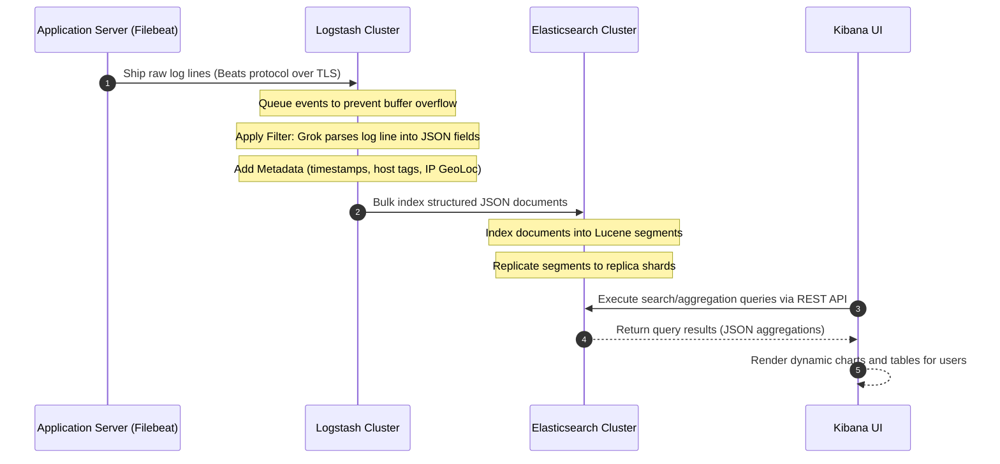

# Introduction to the ELK Stack

The **ELK Stack** is a collection of three open-source products — **Elasticsearch**, **Logstash**, and **Kibana** — designed to ingest, process, store, search, and visualize data in real time. Often supplemented by **Beats** (referred to as the *Elastic Stack*), it is the industry-standard logging, observability, and full-text search pipeline.

:::info[Who this guide is for]
- **New learners** — start here to understand the roles of Elasticsearch, Logstash, and Kibana, and how they connect.
- **Senior engineers** — jump to [Elasticsearch Internals](./elasticsearch-internals.md) for Lucene segment details and index lifecycles, or [Senior Deep Dive](./elasticsearch-senior-deep-dive.md) for JVM tuning and cluster discovery mechanics.
:::

---

## Core Components

The stack divides the responsibilities of data shipping, parsing, storage, and visualization among four specialized components:

```
┌─────────────┐     ┌─────────────┐     ┌─────────────┐     ┌─────────────┐
│    Beats    │ ──► │  Logstash   │ ──► │Elasticsearch│ ──► │   Kibana    │
│  (Collect)  │     │  (Process)  │     │   (Store)   │     │ (Visualize) │
└─────────────┘     └─────────────┘     └─────────────┘     └─────────────┘
```

### 1. Beats (Lightweight Data Shippers)
Beats are single-purpose, lightweight agents installed directly on host servers. Written in Go, they consume minimal CPU and memory, ensuring they do not steal resources from the primary application. 
- **Filebeat**: Harvests and forwards log files.
- **Metricbeat**: Collects system and service metrics (CPU, memory, disk).
- **Packetbeat**: Captures network traffic data.
- **Auditbeat**: Monitors user activity and file integrity.

### 2. Logstash (Data Processing Pipeline)
Logstash is a server-side data processing pipeline that ingests data from multiple sources simultaneously, transforms it, and sends it to your favored "stash" (most commonly Elasticsearch).
- **Inputs**: Supports ingest from files, syslog, Kafka, Beats, HTTP, TCP/UDP sockets, and databases.
- **Filters**: Parses unstructured logs into structured data. Grok filters use regex to extract variables; mutate filters clean, cast, and rename fields; GeoIP filters look up geographical coordinates from IP addresses.
- **Outputs**: Shards and routes parsed events to Elasticsearch indices, S3 buckets, Kafka topics, or databases.

### 3. Elasticsearch (Search & Analytics Engine)
Elasticsearch is a distributed, JSON-based search and analytics engine built on Apache Lucene. It serves as the centralized data store for the stack.
- **Speed**: Performs near-real-time searches (typically sub-second latency) by indexing JSON documents using inverted indexes.
- **Scalability**: Scales horizontally from a single node to clusters containing hundreds of nodes.
- **Resiliency**: Automatically distributes data (sharding) and creates replicas to ensure high availability and toleration against node failures.

### 4. Kibana (Visualization & Management Portal)
Kibana is a browser-based user interface that lets you search, visualize, and interact with the data stored in Elasticsearch indices.
- **Visualizations**: Allows creation of line charts, bar graphs, pie charts, heatmaps, maps, and coordinate grids.
- **Dashboards**: Combines multiple visualizations into a unified, interactive console with real-time refresh.
- **Management**: Serves as the control panel for index lifecycle management (ILM), user role-based access control (RBAC), and cluster health monitoring.

---

## System Architecture & Data Flow

In a standard enterprise production environment, the data flow proceeds linearly from raw source to visual dashboard.



---

## Primary Use Cases

The ELK Stack is uniquely flexible, adapting to several primary engineering domains:

### 1. Centralized Application Logging
Modern microservice architectures generate logs scattered across thousands of containers. ELK aggregates these logs, providing:
*   **Correlation**: Search for a transaction ID or correlation token across all services (Gateway, Auth, Inventory, Payment) to debug trace errors.
*   **Retention**: Archive logs off local servers onto cold Elasticsearch nodes or S3 buckets to comply with audit regulations.

### 2. Infrastructure Metrics & Observability
By pairing Metricbeat with Elasticsearch, teams monitor system health:
*   **Alerting**: Receive notifications (via Slack, PagerDuty, or Email) when heap usage, CPU saturation, or disk space exceeds defined thresholds.
*   **Capacity Planning**: Analyze historical trends to scale up databases or delete unused resources during off-peak seasons.

### 3. Application Performance Monitoring (APM)
Elastic APM collects detailed performance metrics, trace timelines, and database query durations from running code:
*   **Bottleneck Analysis**: Pinpoint which SQL query or HTTP call is causing latency spikes in the system.
*   **Error Tracking**: Automatically group and log stack traces, capturing exception rates by release version.

---

## How They Connect (Conceptual Configuration)

To build an active pipeline, the stacks are connected sequentially through simple configuration files:

1.  **Filebeat Config (`filebeat.yml`)**: Instructs Filebeat where to look for log files on the host and where to send them (typically a Logstash load-balancer endpoint).
    ```yaml
    filebeat.inputs:
      - type: log
        paths:
          - /var/log/apps/*.log
    output.logstash:
      hosts: ["logstash-internal.local:5044"]
    ```
2.  **Logstash Config (`logstash.conf`)**: Directs Logstash to open a Beats port, apply filters, and ship results to Elasticsearch.
    ```ruby
    input {
      beats {
        port => 5044
      }
    }
    filter {
      json {
        source => "message"
      }
    }
    output {
      elasticsearch {
        hosts => ["http://elasticsearch-cluster:9200"]
        index => "app-logs-%{+YYYY.MM.dd}"
      }
    }
    ```
3.  **Kibana Config (`kibana.yml`)**: Points Kibana directly to the Elasticsearch REST API.
    ```yaml
    server.port: 5601
    elasticsearch.hosts: ["http://elasticsearch-cluster:9200"]
    ```

For concrete, working configuration files, Docker setups, and Spring Boot app logs integration, refer to [Logstash & Kibana Integration](./logstash-kibana-integration.md).
