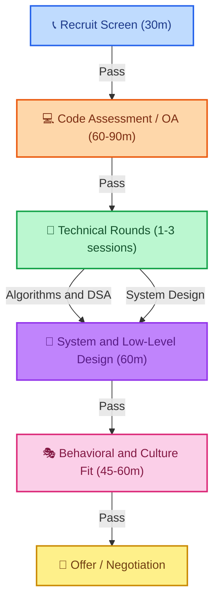

# Comprehensive Engineering Interview Framework

To successfully land a software engineering role, you must navigate a multi-stage evaluation process designed to test technical depth, system-level thinking, execution speed, and behavioral alignment. This guide provides a structured breakdown of each stage, what interviewers are looking for, and concrete strategies to pass them.

---

## The Interview Pipeline

The typical interview loop consists of five key phases. Understanding where you are and what signals are evaluated at each step is critical for targeted preparation.



---

## Phase 1 — Recruiter & Phone Screen (30m)

The recruiter screen is a high-level check to ensure basic qualifications, visa status, salary alignment, and communication skills. It is less about deep coding and more about professional alignment.

### Key Evaluation Criteria
* **Basic Technical Alignment:** Verification of core experience (e.g., years of experience with Java, Spring Boot, distributed systems).
* **Communication Clarity:** Can you concisely walk through your resume and projects?
* **Logistical Alignment:** Location, work authorisation/visas, start date, and salary expectations.

### Actionable Strategies
1. **The Elevator Pitch:** Prepare a structured 90-second response to *"Tell me about yourself."* Focus on your current role, key technical stack, recent impactful achievement, and why you are looking for a new challenge.
2. **Recruiter Collaboration:** Recruiters are your allies—they want you to be hired. Ask them about the interview loop structure, focus areas, and common reasons candidates fail at their company.
3. **Salary Discussion:** Try to avoid giving a specific number first. Instead, ask for the budget range for the target level: *"I'm flexible and open to market compensation. Could you share the approved range for this level?"*

---

## Phase 2 — Online Code Assessment (OA) (60–90m)

Most tech companies use automated platforms (HackerRank, CodeSignal, LeetCode) to filter candidates before live interviews.

### Core Structure
* **Format:** 2 to 4 coding questions in 60 to 90 minutes.
* **Grading:** Automated tests checking correctness, execution time limits, and memory limits.

### Common Pitfalls & Solutions
| Common Pitfall | How to Avoid It |
| :--- | :--- |
| **Spending too much time on Q1** | If stuck for > 15 minutes, write a brute-force solution to secure partial points and move on. |
| **Failing hidden edge cases** | Manually test inputs like empty arrays, negative numbers, extremely large values, and duplicates before submitting. |
| **Incorrect time/space complexity** | Ensure your nested loops do not exceed time limits (typically `O(N^2)` fails for inputs where `N > 10^4`). |

> [!TIP]
> Always check the constraints of the inputs. If `N <= 20`, an `O(2^N)` backtracking solution is fine. If `N <= 10^5`, you need `O(N)` or `O(N log N)` (e.g., sorting, heap, or two pointers).

---

## Phase 3 — Live Technical Interviews

This phase consists of multiple 45-to-60 minute rounds focused on coding, system design, and low-level design.

### 1. Algorithms & DSA Round
You will live-code in front of an interviewer. The goal is to evaluate problem-solving flow, code quality, and communication.

* **Step 1 — Clarify Constraints (5m):** Ask about duplicate values, sorting state, memory limits, and input size.
* **Step 2 — Propose & Trade-off (5m):** State a brute-force approach first, then propose the optimal one. Discuss time and space complexities (`O(N)` space vs `O(1)` space).
* **Step 3 — Code (15–20m):** Write modular, clean code. Use descriptive variable names.
* **Step 4 — Test & Dry Run (5m):** Walk through the code line-by-line using a trace table with a sample input. Do not run the code until you have dry-run it.

### 2. System Design Round
Evaluating your ability to design scalable, highly available distributed systems.

* **RADIO Framework:**
  * **R**equirements: Clarify functional features and non-functional metrics (QPS, storage, SLA).
  * **A**PI Design: Define REST, gRPC, or GraphQL endpoints.
  * **D**ata Model: Select SQL vs NoSQL, and define table schemas.
  * **I**nitial Architecture: Draw high-level blocks (Load Balancer, API Gateway, Services, DBs).
  * **O**ptimizations: Scale reads/writes, introduce caching, sharding, and message queues.

> [!IMPORTANT]
> Never jump straight to the architecture drawing. Always establish requirements and QPS estimates first. Refer to the [System Design Interview Framework](/technical-knowledge/system-design/interview-framework) for detailed deep dives.

### 3. Low-Level Design (LLD) / OOD Round
Testing your code extensibility, design pattern application, and object-oriented clean code.

* Focus on **SOLID Principles** and design patterns (e.g., Factory, Strategy, Observer, Decorator).
* Write clean interfaces, abstract classes, and model relationships clearly.

---

## Phase 4 — Behavioral & Culture Fit (45–60m)

Evaluating how you work in teams, handle conflicts, recover from failures, and align with company values.

### The STAR Method
Always structure your behavioral responses using the STAR method:

```
┌───────────────────────────────────────────────────────────────────────────┐
│  S - SITUATION  : Set the context (Company, role, project timeline)       │
│  T - TASK       : Define the challenge or problem you faced               │
│  A - ACTION     : Explain exactly what *you* did (decisions, technical)   │
│  R - RESULT     : Share the metrics-driven outcome (e.g., +30% throughput)│
└───────────────────────────────────────────────────────────────────────────┘
```

### Story Bank Creation
Prepare 6 to 8 stories from your past experience that you can adapt to different questions:
* **Conflict:** Resolving a technical disagreement with a peer or lead.
* **Failure:** A production incident or design mistake, and what you learned.
* **Leadership:** Mentoring someone or taking initiative to solve a technical debt.
* **Delivery:** Meeting a tight deadline under constraints.

> [!TIP]
> Use numbers to highlight results: *"reduced latency by 45%"*, *"onboarded 3 new engineers, reducing setup time by 2 days"*, or *"saved $12K/month in cloud infrastructure costs."*

---

## Preparation Roadmap

A suggested 3-month preparation schedule for backend engineering interviews:

### Month 1: Core Fundamentals & DSA
- [ ] Review core Java concepts, JVM memory, and thread pools.
- [ ] Practice fundamental DSA: Arrays, Hashing, Two Pointers, Sliding Window.
- [ ] Solve 2 LeetCode problems daily, focusing on understanding patterns rather than memorization.

### Month 2: System Design & Frameworks
- [ ] Study distributed systems patterns: Caching, Sharding, Message Queues.
- [ ] Learn to design common systems: URL Shortener, Rate Limiter, News Feed, Payment Gateway.
- [ ] Practice drawing system diagrams and writing APIs.

### Month 3: LLD, Behavioral, and Mock Interviews
- [ ] Build your STAR story bank (6-8 structured stories).
- [ ] Practice object-oriented design questions (Parking Lot, Elevator).
- [ ] Conduct mock interviews with peers or on mock platforms.

---

## Quick Navigation Links

Use these internal resources to jump straight into active preparation:

* ☕ **Java & Spring:** [Experienced Backend Q&A](/technical-knowledge/interview-questions/java/experienced-java-backend-interview) | [Core Java Q&A](/technical-knowledge/interview-questions/java/java-tricky-core-questions)
* 🧠 **DSA Progress:** [20-Week DSA Roadmap](/technical-knowledge/dsa/20-week-dsa-roadmap-intro)
* 📖 **System Design:** [System Design Overview](/system-design) | [Interview Framework](/technical-knowledge/system-design/interview-framework)
* 🎭 **Soft Skills:** [STAR Method Guide](/technical-knowledge/interview-questions/behavioral/star-method) | [Behavioral Overview](/technical-knowledge/interview-questions/behavioral/overview)
