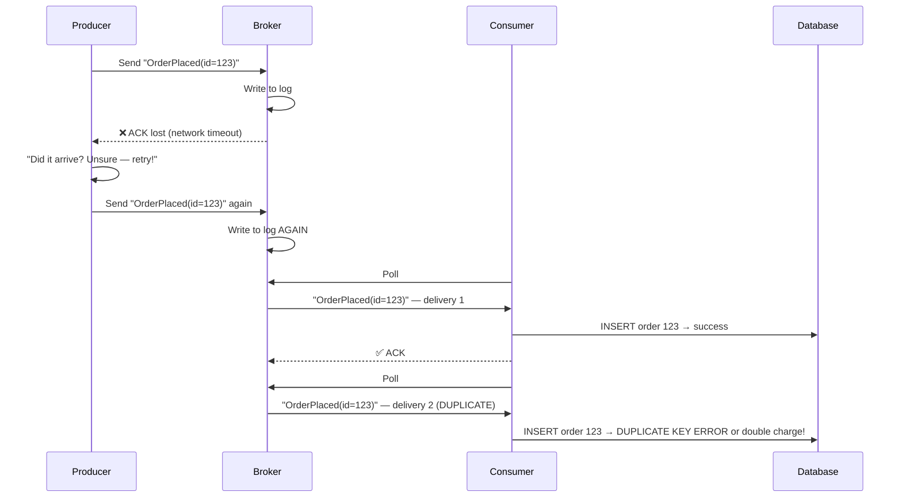
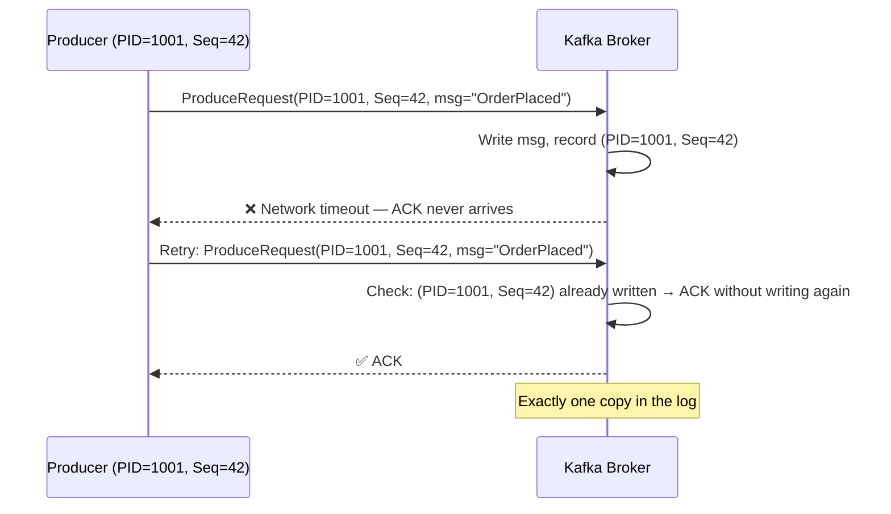

# Deduplication in Distributed Messaging

> **The core problem of distributed messaging in one sentence:** Any reliable system uses retries; any system with retries delivers messages more than once; any system that delivers messages more than once must handle duplicates — or it will corrupt business state.

There are two complementary and independent layers of defense:
- **Exactly-Once Semantics (EOS)** — a broker-level guarantee that the messaging infrastructure will not create duplicates *within its own boundary*.
- **Idempotent Consumers / Application Deduplication** — an application-level guarantee that processing the same message twice produces the same observable result, protecting everything *outside* the broker boundary.

Real production systems almost always need both. This guide explains how each works mechanically, how to implement them, and — most importantly — provides a deep analysis of the two dominant deduplication storage backends: **Kafka Streams State Store (RocksDB)** and **Redis**, covering their internals, trade-offs, failure modes, and when each is the right choice.

:::info[Who this guide is for]
- **New learners** — start at [Why Duplicates Happen](#1-why-duplicates-happen) and [The Three Delivery Guarantees](#2-the-three-delivery-guarantees).
- **Senior engineers** — the core of this guide is the [Kafka Streams State Store vs Redis Deep Dive](#7-kafka-streams-state-store-vs-redis-deep-dive), [Production Failure Modes](#11-senior-deep-dive-production-failure-modes), and the [Decision Matrix](#12-interview-decision-matrix).
:::

---

## 1. Why Duplicates Happen

### The Fundamental Trade-off

In any distributed system, you face an unavoidable dilemma:

```
Option A — At-most-once:    Send and forget. Fast, but messages can be LOST.
Option B — At-least-once:   Retry until acknowledged. Reliable, but messages can DUPLICATE.
Option C — Exactly-once:    Guaranteed delivery, guaranteed once. Requires coordination overhead.
```

Exactly-once is not magic — it is a careful combination of idempotent producers, transactional writes, and deduplication checks that together eliminate the gap where duplicates slip through. The exact mechanism differs at every layer.

### The Retry-Duplicate Root Cause



The ACK was lost — not the message. The producer correctly retried, but the broker already had the first copy. **This is the root cause of almost every duplicate in practice.** The consumer cannot distinguish delivery 1 from delivery 2 without application-level tracking.

---

## 2. The Three Delivery Guarantees

| Guarantee | How | Duplicate Risk | Loss Risk | Use For |
|:---|:---|:---|:---|:---|
| **At-most-once** | Send, no retry, no ACK | ❌ None | ✅ Yes | Metrics, analytics, telemetry |
| **At-least-once** | Retry until ACK'd | ✅ Yes | ❌ None | Most messaging — consumer must deduplicate |
| **Exactly-once** | Idempotent + transactions | ❌ None | ❌ None | Financial, ordering, inventory |

The key insight: **exactly-once is not a property of the broker alone — it requires the producer, broker, and consumer to all cooperate, and it only holds within the system boundaries that the transaction covers.**

---

## 3. Kafka Exactly-Once Semantics (EOS) Internals

Kafka's EOS is built from three independent but complementary mechanisms. Each solves a different part of the duplicate problem.

### Layer 1 — Idempotent Producer

Prevents duplicates caused by **producer transport retries** — when a producer resends because it did not receive an ACK, but the broker already wrote the first copy.



**Mechanics:**
- Broker assigns each producer a unique **Producer ID (PID)**.
- Producer maintains a monotonically incrementing **sequence number** per topic-partition.
- Broker tracks the highest committed `(PID, SequenceNumber)` per partition in memory.
- On retry: `(PID=1001, Seq=42)` already committed → return ACK, no second write.
- Sequence gap detected (`Seq=44` arrives without `Seq=43`) → `OutOfOrderSequenceException`. Configuring `max.in.flight.requests.per.connection ≤ 5` ensures reordering cannot produce false gaps.

```properties
enable.idempotence=true
acks=all
max.in.flight.requests.per.connection=5
retries=2147483647
```

```java
@Bean
public ProducerFactory<String, Object> idempotentProducerFactory() {
    Map<String, Object> props = new HashMap<>();
    props.put(ProducerConfig.BOOTSTRAP_SERVERS_CONFIG, "broker1:9092,broker2:9092");
    props.put(ProducerConfig.ENABLE_IDEMPOTENCE_CONFIG, true);
    props.put(ProducerConfig.ACKS_CONFIG, "all");
    props.put(ProducerConfig.RETRIES_CONFIG, Integer.MAX_VALUE);
    props.put(ProducerConfig.MAX_IN_FLIGHT_REQUESTS_PER_CONNECTION, 5);
    props.put(ProducerConfig.KEY_SERIALIZER_CLASS_CONFIG, StringSerializer.class);
    props.put(ProducerConfig.VALUE_SERIALIZER_CLASS_CONFIG, JsonSerializer.class);
    return new DefaultKafkaProducerFactory<>(props);
}
```

:::warning[What idempotent producer does NOT solve]
It prevents **transport-level** duplicates only — when the same PID+Seq combination is retried. It does NOT prevent an application bug that calls `producer.send(event)` twice from two code paths, or a service restart that creates a new producer (new PID) and re-publishes the same business event. Application-level deduplication is still required for those cases.
:::

---

### Layer 2 — Kafka Transactions (Read-Process-Write Atomicity)

Prevents duplicates caused by **consumer failures between processing and committing the offset**. The failure: consumer writes output records but crashes before committing the offset → restarts, re-reads the same input, writes output again.

```
WITHOUT transactions (partial failure window):
  Read offset 100 → Process → Write to output topic ← WRITTEN
                            → Commit offset 100     ← CRASH
  Restart: re-reads offset 100 → Writes output AGAIN → DUPLICATE

WITH transactions (atomic all-or-nothing):
  beginTransaction()
  Read offset 100
  Write to output topic       ← STAGED (not visible to read_committed consumers)
  Stage offset commit         ← STAGED
  commitTransaction()         ← ALL become visible atomically
  
  If crash before commit: transaction aborted, output invisible, offset unchanged
  Consumer restarts from offset 100 → processes exactly once
```

**Critical consumer config — `isolation.level`:**

```properties
# Consumer MUST set this to only see records from committed transactions
isolation.level=read_committed
# Without this: consumers see output records from aborted/incomplete transactions
# which is equivalent to reading uncommitted data — duplicates become visible
```

```java
@Bean
public ProducerFactory<String, Object> transactionalProducerFactory() {
    Map<String, Object> props = new HashMap<>();
    props.put(ProducerConfig.BOOTSTRAP_SERVERS_CONFIG, "broker1:9092");
    props.put(ProducerConfig.ENABLE_IDEMPOTENCE_CONFIG, true);
    props.put(ProducerConfig.ACKS_CONFIG, "all");
    // transactional.id must be unique per producer instance and stable across restarts
    // It enables the broker to fence zombie producers (old instances using the same ID)
    props.put(ProducerConfig.TRANSACTIONAL_ID_CONFIG, "payment-processor-0");
    return new DefaultKafkaProducerFactory<>(props);
}

@KafkaListener(topics = "orders", groupId = "payment-processor")
@Transactional("kafkaTransactionManager")
public void process(ConsumerRecord<String, Order> record) {
    Order order = record.value();
    PaymentResult result = paymentService.charge(order);
    // Output write + offset commit happen in ONE atomic Kafka transaction
    kafkaTemplate.send("payments", order.getId(), result);
    // No manual offset commit — Spring handles it atomically with the send
}
```

:::warning[What transactions do NOT solve]
Kafka transactions only cover **Kafka-to-Kafka** operations. Any call to an external system inside the transaction — a DB write, HTTP call, email send — is outside the transaction boundary. If the external call succeeds but the Kafka transaction rolls back, the external side effect persists while Kafka reprocesses the input. Application-level deduplication on the external system is still mandatory.
:::

---

### Layer 3 — Kafka Streams EOS (`processing.guarantee`)

Kafka Streams wraps all three layers (idempotent producer + transactions + offset commit + state store changelog) into a single configuration, making the entire stream topology exactly-once.

```java
@Bean
public KafkaStreamsConfiguration streamsConfig() {
    Map<String, Object> props = new HashMap<>();
    props.put(StreamsConfig.APPLICATION_ID_CONFIG, "order-enrichment");
    props.put(StreamsConfig.BOOTSTRAP_SERVERS_CONFIG, "broker1:9092");
    props.put(StreamsConfig.PROCESSING_GUARANTEE_CONFIG, StreamsConfig.EXACTLY_ONCE_V2);
    props.put(StreamsConfig.COMMIT_INTERVAL_MS_CONFIG, 100);
    return new KafkaStreamsConfiguration(props);
}
```

**What `EXACTLY_ONCE_V2` atomically commits per transaction:**

```
ONE atomic Kafka transaction includes:
    ✅ Output records → output Kafka topics
    ✅ State store changelog updates → RocksDB changelog topic
    ✅ Consumer group offset → __consumer_offsets topic

Crash before commit:
    → Transaction aborted
    → Output records invisible (read_committed consumers skip them)
    → State store reverted to last committed state
    → Offset not advanced → task restarts from last committed offset
    → Exactly-once output guaranteed
```

**`EXACTLY_ONCE_V2` vs `EXACTLY_ONCE` (V1) — Why V2 is preferred:**

| Aspect | V1 (`EXACTLY_ONCE`) | V2 (`EXACTLY_ONCE_V2`) |
|:---|:---|:---|
| Transaction scope | One transaction per task per poll | Epoch-based fencing — fewer, larger transactions |
| Broker overhead | High — many small transactions | Lower — batched commits |
| Zombie fencing | Via transactional.id | Via producer epoch (lighter weight) |
| Available since | Kafka 0.11 | Kafka 2.5 |
| **Recommendation** | Legacy | ✅ Always use V2 |

---

## 4. Consumer-Side Deduplication — Kafka to External Systems

EOS protects Kafka-internal pipelines. The moment a consumer writes to a database, calls an external REST API, sends an email, or publishes to any non-Kafka system, EOS no longer applies. Application-level deduplication is mandatory.

### Strategy 1 — DB Unique Constraint (Strongest Consistency)

```sql
CREATE TABLE processed_events (
    event_id       VARCHAR(255) PRIMARY KEY,
    consumer_group VARCHAR(255) NOT NULL,
    processed_at   TIMESTAMPTZ  NOT NULL DEFAULT now()
);

-- Partial index: only recent events need fast lookup
CREATE INDEX idx_processed_events_recent
    ON processed_events (event_id, processed_at)
    WHERE processed_at > now() - INTERVAL '7 days';
```

```java
@KafkaListener(topics = "orders", groupId = "order-service")
@Transactional  // DB transaction covers BOTH business write AND dedup record
public void consume(ConsumerRecord<String, Order> record) {
    String eventId = record.topic() + "-" + record.partition() + "-" + record.offset();

    if (processedEventRepo.existsById(eventId)) {
        log.debug("Duplicate skipped: {}", eventId);
        return; // Return normally → Kafka offset advances via ACK
    }

    orderRepository.save(Order.from(record.value()));
    // Dedup record in same transaction → atomic with business write
    processedEventRepo.save(new ProcessedEvent(eventId, Instant.now(), "order-service"));
}
```

**Why both writes must be in the same transaction:** if the business write commits but the dedup record write fails (or vice versa), the system is inconsistent — either the event is processed but will be re-processed (no dedup record), or there is a phantom dedup record for an event that was never processed. The transaction makes them atomic.

### Strategy 2 — Business-Level Idempotency Key (DLQ-Safe)

Kafka's `topic-partition-offset` is a transport coordinate, not a business identity. If an event is redriven from a DLQ to a different topic, it gets a new offset and bypasses offset-based dedup.

```java
// Event carries its own stable business identity
@Value
public class OrderPlacedEvent {
    String idempotencyKey;  // "order-placed-{orderId}" — stable across all transports
    String orderId;
    BigDecimal totalAmount;
    Instant occurredAt;
}

@KafkaListener(topics = "orders")
@Transactional
public void consume(OrderPlacedEvent event) {
    String key = event.getIdempotencyKey();  // Stable even after DLQ redrive to new topic

    if (processedEventRepo.existsById(key)) {
        return;
    }

    inventoryService.reserveStock(event.getOrderId());
    processedEventRepo.save(new ProcessedEvent(key, Instant.now()));
}
```

### Strategy 3 — Upsert (Idempotent SQL)

When the same event always produces the same target state, design the write itself to be idempotent:

```java
@KafkaListener(topics = "user-profile-updates")
public void syncProfile(UserProfileUpdatedEvent event) {
    jdbcTemplate.update("""
        INSERT INTO user_profiles (user_id, name, email, updated_at)
        VALUES (?, ?, ?, ?)
        ON CONFLICT (user_id) DO UPDATE SET
            name       = EXCLUDED.name,
            email      = EXCLUDED.email,
            updated_at = EXCLUDED.updated_at
        WHERE user_profiles.updated_at < EXCLUDED.updated_at
        """,
        event.getUserId(), event.getName(), event.getEmail(), event.getUpdatedAt());
    // WHERE clause prevents a stale re-delivery from overwriting a newer update
}
```

**Upsert is sufficient when:** the event represents the full current state of an entity (e.g., "user profile is now X"). Any number of re-deliveries produces identical final state.

**Upsert is NOT sufficient when:** the event represents an action (e.g., "transfer $100"). Processing it twice transfers $200 regardless of what the current row says. Use an explicit idempotency key for action events.

---

## 5. Deduplication in Kafka Streams

### Approach 1 — Stateful Transformer with Time-Windowed State Store

```java
@Configuration
public class DeduplicationTopology {

    private static final String STORE_NAME     = "dedup-event-store";
    private static final Duration DEDUP_WINDOW = Duration.ofHours(24);

    @Bean
    public Topology build(StreamsBuilder builder) {
        StoreBuilder<KeyValueStore<String, Long>> storeBuilder =
                Stores.keyValueStoreBuilder(
                        Stores.persistentKeyValueStore(STORE_NAME),
                        Serdes.String(),
                        Serdes.Long()
                );
        builder.addStateStore(storeBuilder);

        builder.stream("raw-events", Consumed.with(Serdes.String(), orderSerde()))
               .transform(() -> new DeduplicationTransformer(STORE_NAME, DEDUP_WINDOW), STORE_NAME)
               .filter((key, value) -> value != null)  // null = duplicate
               .to("deduplicated-events");

        return builder.build();
    }
}
```

```java
public class DeduplicationTransformer
        implements Transformer<String, Order, KeyValue<String, Order>> {

    private final String storeName;
    private final Duration windowSize;
    private KeyValueStore<String, Long> dedupStore;
    private ProcessorContext context;

    @Override
    public void init(ProcessorContext context) {
        this.context = context;
        this.dedupStore = context.getStateStore(storeName);
    }

    @Override
    public KeyValue<String, Order> transform(String key, Order order) {
        String eventId = order.getIdempotencyKey();
        Long lastSeenTimestamp = dedupStore.get(eventId);

        if (lastSeenTimestamp != null) {
            long ageMs = context.timestamp() - lastSeenTimestamp;
            if (ageMs < windowSize.toMillis()) {
                // Duplicate within the dedup window — return null to signal downstream filter
                log.debug("Duplicate suppressed: eventId={}, age={}ms", eventId, ageMs);
                return KeyValue.pair(key, null);
            }
            // Window expired — treat as new event (safe to process again)
        }

        dedupStore.put(eventId, context.timestamp());
        return KeyValue.pair(key, order);
    }

    @Override
    public void close() {}
}
```

### Approach 2 — Windowed Aggregation with `suppress()`

`suppress()` holds back intermediate results until a window definitively closes, preventing multiple downstream emissions for the same key within a window:

```java
@Bean
public Topology suppressedAggregation(StreamsBuilder builder) {
    builder.stream("orders")
           .groupByKey()
           .windowedBy(TimeWindows.ofSizeAndGrace(Duration.ofMinutes(10), Duration.ofMinutes(1)))
           .aggregate(
               OrderSummary::new,
               (key, order, summary) -> summary.add(order),
               Materialized.with(Serdes.String(), orderSummarySerde()))
           // Without suppress(): emits a new record every time a new order arrives in the window
           // With suppress():    emits ONLY once when the window definitively closes
           .suppress(Suppressed.untilWindowCloses(Suppressed.BufferConfig.unbounded()))
           .toStream()
           .to("order-summaries");

    return builder.build();
}
```

---

## 6. RabbitMQ, SQS, and Redis Deduplication

### RabbitMQ — Redis-Backed Dedup

RabbitMQ provides at-least-once delivery with no built-in deduplication:

```java
@RabbitListener(queues = "orders.queue")
public void consume(Message message, Channel channel,
                    @Header(AmqpHeaders.DELIVERY_TAG) long deliveryTag,
                    @Header(value = "messageId", required = false) String messageId)
        throws IOException {

    String dedupKey = "rmq:dedup:" + (messageId != null ? messageId : hashBody(message.getBody()));

    // SETNX: atomic check-and-set — only one concurrent thread wins
    Boolean isNew = redis.opsForValue().setIfAbsent(dedupKey, "1", Duration.ofHours(24));

    if (Boolean.FALSE.equals(isNew)) {
        channel.basicAck(deliveryTag, false);  // Remove from queue, skip processing
        return;
    }

    try {
        orderService.process(deserialize(message.getBody(), Order.class));
        channel.basicAck(deliveryTag, false);
    } catch (Exception e) {
        redis.delete(dedupKey);                  // Remove key → allow retry
        channel.basicNack(deliveryTag, false, true);
    }
}
```

Always set a stable producer-side message ID. A random UUID generated at send time is NOT a stable idempotency key — it changes on every retry:

```java
public void publishOrderPlaced(Order order) {
    MessageProperties props = new MessageProperties();
    props.setMessageId("order-placed-" + order.getId());  // Stable across retries
    props.setDeliveryMode(MessageDeliveryMode.PERSISTENT);
    rabbitTemplate.send("orders.exchange", "orders.placed",
                        new Message(serialize(order), props));
}
```

### AWS SQS FIFO — Built-in 5-Minute Deduplication

```java
public void publishOrderPlaced(Order order) {
    sqsClient.sendMessage(r -> r
        .queueUrl(fifoQueueUrl)
        .messageBody(serialize(order))
        .messageGroupId("customer-" + order.getCustomerId())
        // SQS silently discards any message with the same deduplication ID
        // within a 5-minute rolling window
        .messageDeduplicationId("order-placed-" + order.getId())
    );
}
```

SQS FIFO deduplication is broker-side and covers the 5-minute window. Application-level deduplication is still needed for DLQ redrives (which exceed the 5-minute window) and for consumer-side idempotency:

```java
@SqsListener(value = "${aws.sqs.orders-fifo-url}")
@Transactional
public void consume(Order order, @Header("MessageDeduplicationId") String deduplicationId) {
    // Use business key — not SQS MessageId (which changes per receive)
    String eventId = "order-placed-" + order.getId();

    if (processedEventRepo.existsById(eventId)) {
        return;  // Covers DLQ redrives that bypass the 5-min broker window
    }

    orderService.process(order);
    processedEventRepo.save(new ProcessedEvent(eventId, Instant.now()));
}
```

### Redis `SETNX` Deduplication — Standalone

```java
@Component
@RequiredArgsConstructor
public class RedisDeduplicator {

    private final StringRedisTemplate redis;

    /**
     * Atomically sets the key if not present.
     * Returns true if this is a NEW event (first time seen).
     * Returns false if DUPLICATE (key already exists).
     */
    public boolean isNew(String eventId, Duration ttl) {
        Boolean result = redis.opsForValue()
                .setIfAbsent("dedup:" + eventId, "1", ttl);
        return Boolean.TRUE.equals(result);
    }

    /** Remove key to allow retry after processing failure */
    public void remove(String eventId) {
        redis.delete("dedup:" + eventId);
    }
}
```

```java
@KafkaListener(topics = "payments")
public void processPayment(ConsumerRecord<String, PaymentRequest> record) {
    PaymentRequest request = record.value();

    if (!deduplicator.isNew(request.getIdempotencyKey(), Duration.ofDays(7))) {
        return;  // Duplicate — skip
    }

    try {
        paymentGateway.charge(request);
    } catch (Exception e) {
        deduplicator.remove(request.getIdempotencyKey());  // Allow retry
        throw e;
    }
}
```

---

## 7. Kafka Streams State Store vs Redis — Deep Dive

This is the central architectural decision for deduplication in stream-processing systems. The choice has far-reaching consequences for consistency, latency, operational complexity, failure behavior, and cost.

### What Is a Kafka Streams State Store (RocksDB)?

Kafka Streams embeds **RocksDB** as its local state backend. Each Streams task maintains its own RocksDB instance on the local disk of the container that hosts it. The state store is not shared across instances — it is partitioned exactly the same way the Kafka topic it reads from is partitioned.

```
Kafka Topic: "payments" (6 partitions)
    │
    ▼
Kafka Streams Application (3 instances, 2 partitions each)

  Instance A:                Instance B:                Instance C:
  Partitions [0, 1]          Partitions [2, 3]          Partitions [4, 5]
  ┌────────────────────┐     ┌────────────────────┐     ┌────────────────────┐
  │  RocksDB           │     │  RocksDB           │     │  RocksDB           │
  │  (partitions 0+1   │     │  (partitions 2+3   │     │  (partitions 4+5   │
  │   state only)      │     │   state only)      │     │   state only)      │
  └─────────┬──────────┘     └─────────┬──────────┘     └─────────┬──────────┘
            │                          │                           │
            └──────── Kafka Changelog Topics (replication) ────────┘
```

**The key property**: messages from partition 0 always go to Instance A. RocksDB for partition 0 is always on Instance A. Lookups are always local — no network hop required.

### What Happens During a State Store Lookup

```
Event arrives (partition 0, offset 5000)
    │
    ▼
Streams task for partition 0 (Instance A)
    │
    ├── 1. Check in-memory memtable (RocksDB L0) — sub-microsecond
    │         Hit? → return immediately
    │
    ├── 2. Check L1–L6 SSTable files (on local NVMe disk) — microseconds
    │         RocksDB uses bloom filters to skip non-matching SSTables
    │         Block cache (in-memory LRU) absorbs hot reads
    │
    └── 3. State not found → new event → write to memtable → continue processing

RocksDB write path (after processing):
    memtable write → WAL (write-ahead log on disk) → background compaction to SSTables
    
Kafka Streams commits:
    Every commit.interval.ms (default 100ms):
    - Flush RocksDB memtable to disk
    - Write changelog record to Kafka changelog topic
    - Commit consumer offset
    ALL in one Kafka transaction (with EXACTLY_ONCE_V2)
```

### What Happens During a Redis Deduplication Check

```
Event arrives
    │
    ▼
Consumer thread
    │
    ├── 1. Build Redis key: "dedup:" + eventId
    │
    ├── 2. Network hop to Redis cluster:
    │      Client → Hash slot routing → Redis shard → SETNX → response
    │      Typical: 1–5ms round-trip (datacenter), 0.3–1ms (same rack)
    │
    └── 3. Response: 1 (new) or 0 (duplicate)
               │
    ┌──────────┴────────────┐
    │ New (1)               │ Duplicate (0)
    │ Process event         │ Skip, ACK
    └───────────────────────┘
```

### Consistency Model — The Critical Difference

This is the most important architectural distinction between the two approaches.

#### Kafka Streams State Store: Transactionally Consistent

With `EXACTLY_ONCE_V2`, the state store update, output record write, and offset commit are **all part of one atomic Kafka transaction**:

```
BEGIN TRANSACTION
    ├── Write deduplicated output record → output topic (staged)
    ├── Update RocksDB state store → changelog topic (staged)
    └── Advance consumer offset → __consumer_offsets (staged)
COMMIT TRANSACTION → all three become visible atomically

If crash before commit:
    → All three rolled back
    → Task restarts from previous offset
    → Reprocesses the same input
    → State store is back to pre-crash state → dedup check still works correctly
    → Output topic has no partial record from the failed attempt
```

There is no dual-write hazard. The state store and the offset are always consistent with each other because they commit together.

#### Redis: Eventual Consistency with Dual-Write Hazard

Redis is an external system. The Redis write and the Kafka offset commit are two separate network operations with no coordinator:

```
Consumer processes event:
    Step 1: redis.setIfAbsent("dedup:event-123", ...)  → Redis committed ✅
    Step 2: process the event                           → side effect done ✅
    Step 3: ack.acknowledge()                           → Kafka offset committed ✅

Happy path: all three succeed → correct

Failure paths:
    Crash after Step 1, before Step 2:
        Redis key exists, event never processed
        Retry: Redis key found → duplicate detected → event NEVER processed ❌
        (Fix: use PROCESSING/COMPLETED states in Redis)

    Crash after Step 2, before Step 3:
        Event processed, Redis key set, offset NOT committed
        Retry: Redis key found → duplicate detected → skipped ✅ (correct by luck)
        
    Redis unavailable during Step 1:
        Cannot check dedup → must choose: fail-open (process and risk duplicate)
                                       or fail-closed (block and risk availability)
```

The fundamental problem: **Redis and Kafka do not share a transaction**. Partial failure is always possible. The application must be designed to handle every partial-failure permutation.

### Latency Comparison

```
Kafka Streams State Store (RocksDB) lookup:
    In-memory block cache hit:    0.01–0.1 ms  ← typical for hot keys
    Local SSD miss:               0.1–1 ms
    No network hop required

Redis lookup (same datacenter):
    Standard key lookup:          0.3–2 ms
    With TLS:                     0.5–3 ms
    Under high concurrency:       1–5 ms (connection pool contention)
    Cross-AZ (different rack):    2–10 ms

For a stream processing 1M events/second:
    RocksDB: 0.1ms × 1M = 100s of CPU-equivalent latency budget
    Redis:   2ms   × 1M = 2,000s of CPU-equivalent latency budget
    
Redis adds ~20x more latency per lookup for high-throughput pipelines.
```

### Memory and Storage Architecture

```
Kafka Streams State Store (RocksDB):
    Write path: Event → memtable (RAM) → WAL (disk) → SSTable (disk via compaction)
    Read path:  memtable → L0 SSTable → L1–L6 SSTables (with bloom filter pruning)
    Block cache: configurable (default 50MB per store, tune to available RAM)
    Disk usage: proportional to (events × key size × retention window)
    Example: 10M events, 256-byte key, 24h window = ~2.5GB local disk

Redis:
    All keys stored in RAM (with optional persistence to RDB/AOF)
    Key overhead: ~80–120 bytes per key (metadata + TTL)
    Example: 10M events × 120 bytes = 1.2GB Redis RAM
    Redis Cluster: data partitioned across shards; each shard handles its fraction
```

### Rebalance Behavior — The Most Operationally Significant Difference

#### Kafka Streams Rebalance + State Rebuild

When a Kafka Streams instance fails or a new instance joins, partitions are rebalanced. The new instance receiving a partition must **rebuild its RocksDB state store** from the changelog topic before it can process any events.

```
Timeline of a Kafka Streams rebalance:

t=0s    Instance A crashes (owned partitions 0+1)
t=1s    Kafka Streams detects failure
t=2s    Rebalance: Instance B takes over partition 0, Instance C takes partition 1

        Instance B: must rebuild state for partition 0
        ├── Reads entire changelog topic for partition 0 from beginning (or last snapshot)
        ├── Applies all entries to local RocksDB
        └── Only when fully rebuilt → begins processing new events

        Rebuild time depends on:
        - State store size (number of entries × entry size)
        - Changelog topic throughput
        - Disk I/O speed of the new instance

        Typical rebuild times:
        - Small state (< 100K entries): 1–10 seconds
        - Medium state (1M entries): 30 seconds – 2 minutes
        - Large state (100M entries): 10 – 30 minutes ← significant gap

t=45s   Rebuild complete → Instance B begins processing partition 0
        During t=2s to t=45s: partition 0 was NOT being processed
        Events are queued in Kafka (not lost, but delayed)
```

**Mitigations for rebuild latency:**

```properties
# Enable standby replicas — each partition's state is maintained on N standby instances
# When the primary fails, a standby can take over with minimal rebuild
num.standby.replicas=1   # Each partition's state mirrored on 1 additional instance
                          # Doubles state storage cost but eliminates most rebuild time

# State directory on fast local NVMe — dramatically reduces rebuild I/O time
state.dir=/nvme/kafka-streams/state

# Increase changelog cleanup to keep the changelog compact
# Smaller changelog = faster rebuild
# Set per store in StreamsBuilder
Materialized.as(Stores.persistentKeyValueStore("dedup-store"))
    .withLoggingEnabled(Map.of(
        "cleanup.policy", "compact",
        "min.compaction.lag.ms", "0"
    ))
```

#### Redis Rebalance — Zero Rebuild Time

When a Kafka consumer (not Kafka Streams) using Redis for dedup restarts or rebalances:

```
t=0s    Consumer instance restarts
t=1s    Consumer reconnects to Kafka broker
t=2s    Partition assignment received
t=2s    Consumer begins processing — immediately
        (Redis is already populated; no local state to rebuild)

No rebuild penalty. Startup time = broker connection + poll start.
```

This is the dominant operational advantage of Redis in consumer-side deduplication — instant startup, no partition rebalance penalty.

### Partition Locality and Horizontal Scaling

#### Kafka Streams: Partition-Aligned Scaling

```
State is partitioned by the same key as the Kafka topic.
If event key = customerId, then:
    All events for customer-123 → always go to the same Streams task → same RocksDB
    Lookup for customer-123 is always a local read → O(1) local disk access

Scaling: add more Streams instances → partitions redistribute → state rebuilds
```

#### Redis: Shared Global State

```
Redis is shared across all consumer instances.
Any consumer instance can check any event ID:
    Consumer 1 processes event-123 → sets Redis key
    Consumer 2 receives event-123 (from different partition) → reads Redis key → skipped

This cross-instance dedup is a capability Kafka Streams local state cannot provide,
because each Streams task only has visibility into its own partition's state.
```

**When this matters**: If the same business event can arrive on different Kafka partitions (e.g., a fanout to multiple topics, or a DLQ redrive that re-partitions by a different key), Kafka Streams local state store cannot catch the cross-partition duplicate. Redis can.

### Operational Comparison

| Operational Dimension | Kafka Streams State Store (RocksDB) | Redis |
|:---|:---|:---|
| **Infrastructure to provision** | None — embedded in Streams app | Redis Cluster (3–6 nodes typical) |
| **Scaling mechanism** | Add Streams instances + Kafka partitions | Add Redis shards (cluster resharding) |
| **Monitoring** | RocksDB JMX metrics, Kafka Streams metrics | Redis INFO, SLOWLOG, keyspace metrics |
| **Backup / restore** | Kafka changelog topic (replicated, durable) | RDB snapshots + AOF (must configure) |
| **Data eviction** | Manual cleanup in transformer, or window-based | Native per-key TTL (automatic) |
| **Memory management** | JVM heap + off-heap RocksDB block cache | All in Redis RAM (off-heap, no GC) |
| **Cross-service visibility** | No — state is private to the Streams app | Yes — any service with Redis access |
| **Schema/versioning** | Opaque byte arrays in RocksDB | Opaque values in Redis; schema in value bytes |
| **Cost model** | Application container disk + CPU | Dedicated Redis cluster nodes (memory-priced) |

---

## 8. State Store vs Redis — Comprehensive Decision Framework

### Decision Tree

```
Is your deduplication inside a Kafka Streams topology?
(Reading from Kafka, processing, writing back to Kafka)
    │
    ├── YES
    │   │
    │   ├── Is EXACTLY_ONCE_V2 required?
    │   │   │
    │   │   ├── YES → Kafka Streams State Store (RocksDB)
    │   │   │         Only option that provides transactional consistency
    │   │   │         across state store + output topic + offset commit
    │   │   │
    │   │   └── NO  → Either works; State Store preferred for zero infra overhead
    │   │
    │   ├── Does state need to be shared across services?
    │   │   ├── YES → Redis (State Store is private to the Streams app)
    │   │   └── NO  → State Store
    │   │
    │   └── Are rebalance rebuild times acceptable?
    │       (State size > 10M entries → rebuild may take minutes)
    │       ├── NO  → Redis + num.standby.replicas=1 hybrid
    │       └── YES → State Store
    │
    └── NO (Consumer writing to external DB, REST API, email, etc.)
        │
        ├── Is consistency critical? (financial, ordering, inventory)
        │   ├── YES → DB unique constraint + Redis fast path (two layers)
        │   └── NO  → Redis SETNX alone (high throughput, simpler)
        │
        ├── Is dedup window > 7 days? (long TTL, large state)
        │   ├── YES → Redis (TTL management easier; State Store disk grows large)
        │   └── NO  → Either
        │
        ├── Do multiple heterogeneous services need the same dedup state?
        │   ├── YES → Redis (shared; State Store is private)
        │   └── NO  → Either
        │
        └── Is startup/rebalance latency critical? (SLO < 10s recovery)
            ├── YES → Redis (zero rebuild time)
            └── NO  → Either
```

### Use Kafka Streams State Store (RocksDB) When

1. **Your pipeline is Kafka → processing → Kafka** (no external side effects). State store is the only option that provides transactional atomicity with the offset commit and output record — Redis cannot participate in a Kafka transaction.

2. **You need true exactly-once with `EXACTLY_ONCE_V2`**. State store updates are committed atomically with offsets. Redis updates cannot be.

3. **You want zero external infrastructure**. State store is embedded — no Redis cluster to provision, size, monitor, or pay for.

4. **Latency budget is extremely tight** (sub-millisecond per lookup). Local RocksDB block cache reads are 10–100× faster than Redis round-trips.

5. **Your state is small enough to rebuild quickly** (< 1M entries per partition) or you have `num.standby.replicas` configured.

6. **State is strictly partition-local** (no cross-partition or cross-service dedup needed).

### Use Redis When

1. **Your consumer writes to an external system** (database, REST API, email). Kafka EOS does not cover external writes. Redis provides a fast, shared dedup gate that works across any technology.

2. **Multiple services or components share dedup state**. An API gateway, a Kafka consumer, and a background worker all need to agree that event-123 was processed. Redis is the shared store.

3. **Startup and rebalance latency is a hard SLO**. A Redis-backed consumer starts processing immediately after connecting to Kafka, with no state rebuild. A Kafka Streams app with large state may be unavailable for minutes during a rebalance.

4. **Deduplication windows are very long** (7+ days, 30 days). Storing 30 days of event IDs in RocksDB on the container's local disk is operationally risky — disk pressure, slow rebuilds, state loss on disk failure. Redis TTL-based eviction is native and automatic.

5. **False-positive rate is acceptable and throughput is extreme** (millions/sec). Redis Bloom Filter uses 1/50th the memory of exact key storage with configurable false-positive rate.

6. **Your deployment model does not support local persistent storage**. Ephemeral containers without persistent volumes cannot host a reliable RocksDB state store.

### Side-by-Side Summary Table

| Dimension | Kafka Streams State Store | Redis | Winner |
|:---|:---|:---|:---|
| **Consistency with Kafka offset** | ✅ Atomic (same transaction) | ❌ Dual-write (separate ops) | State Store |
| **Latency per lookup** | ✅ Sub-millisecond (local disk/cache) | ⚠️ 1–5ms (network) | State Store |
| **Infrastructure overhead** | ✅ None (embedded) | ❌ Dedicated cluster required | State Store |
| **Cross-instance dedup** | ❌ Partition-local only | ✅ Globally shared | Redis |
| **Cross-service dedup** | ❌ Private to Streams app | ✅ Any service can access | Redis |
| **Rebalance / restart time** | ❌ Rebuild required (seconds–minutes) | ✅ Instant (zero rebuild) | Redis |
| **Native TTL eviction** | ❌ Manual (custom transformer) | ✅ Per-key TTL built-in | Redis |
| **Long dedup windows (30d+)** | ❌ Large local disk required | ✅ TTL-managed, predictable memory | Redis |
| **External system dedup** | ❌ Cannot cover external writes | ✅ Works for any consumer | Redis |
| **Memory efficiency** | ✅ Disk-backed; large datasets OK | ❌ All in RAM; expensive at scale | State Store |
| **Bloom filter support** | ❌ | ✅ RedisBloom module | Redis |
| **Operational simplicity** | ✅ No extra infra | ❌ Redis ops (cluster, backups, alerts) | State Store |

---

## 9. Combined Architecture: Multi-Layer Deduplication

In production at scale, the two approaches are layered: Kafka Streams handles the intra-Kafka dedup, and Redis handles the external-system dedup. This is the correct model for any pipeline that both processes streams and calls external APIs.

```mermaid
flowchart TD
    Producer[Upstream Producer] -->|at-least-once| InTopic[Kafka Input Topic]

    subgraph StreamsApp [Kafka Streams Application — Layer 1 Dedup]
        InTopic -->|read| KStream[KStream Processing]
        KStream -->|transform| DedupTrans[DeduplicationTransformer]
        DedupTrans <-->|check + put| RocksDB[(RocksDB Local State Store\nExactly-Once with EOS)]
        DedupTrans -->|write| OutTopic[Kafka Output Topic]
    end

    subgraph ConsumerApp [Downstream Consumer — Layer 2 Dedup]
        OutTopic -->|poll| Listener[@KafkaListener Consumer]
        Listener <-->|SETNX / EX| Redis[(Redis Cluster\nFast external dedup)]
        Listener -->|execute| ExtAPI[External Payment API]
    end
```

**Why two layers:**

- **Layer 1 (RocksDB)**: Reduces downstream queue depth — deduplication inside Kafka Streams means the output topic only receives unique events. This reduces the load on Redis and the external API.
- **Layer 2 (Redis)**: The consumer calls an external API that cannot participate in a Kafka transaction. Redis provides the idempotency gate for the external call. Even if a message is re-delivered to the consumer (rebalance, retry), Redis blocks the duplicate API call.

### Full Combined Implementation

```java
// Layer 1: Kafka Streams with RocksDB dedup (EOS)
@Configuration
@EnableKafkaStreams
public class StreamsDedupConfig {

    @Bean(name = KafkaStreamsDefaultConfiguration.DEFAULT_STREAMS_CONFIG_BEAN_NAME)
    public KafkaStreamsConfiguration streamsConfig() {
        return new KafkaStreamsConfiguration(Map.of(
            StreamsConfig.APPLICATION_ID_CONFIG,        "payment-dedup-pipeline",
            StreamsConfig.BOOTSTRAP_SERVERS_CONFIG,     "broker1:9092",
            StreamsConfig.PROCESSING_GUARANTEE_CONFIG,  StreamsConfig.EXACTLY_ONCE_V2,
            StreamsConfig.COMMIT_INTERVAL_MS_CONFIG,    100
        ));
    }

    @Bean
    public Topology paymentDeduplicationTopology(StreamsBuilder builder) {
        final String STORE = "payment-dedup-store";
        final Duration WINDOW = Duration.ofHours(24);

        builder.addStateStore(Stores.keyValueStoreBuilder(
                Stores.persistentKeyValueStore(STORE), Serdes.String(), Serdes.Long()));

        builder.stream("raw-payments", Consumed.with(Serdes.String(), paymentSerde()))
               .transform(() -> new DeduplicationTransformer(STORE, WINDOW), STORE)
               .filter((k, v) -> v != null)
               .to("deduplicated-payments", Produced.with(Serdes.String(), paymentSerde()));

        return builder.build();
    }
}
```

```java
// Layer 2: Consumer with Redis dedup for external API call
@Component
@Slf4j
@RequiredArgsConstructor
public class PaymentGatewayConsumer {

    private final StringRedisTemplate redis;
    private final ExternalPaymentGateway gateway;

    private static final String PREFIX  = "payment:dedup:";
    private static final Duration TTL   = Duration.ofHours(24);

    @KafkaListener(topics = "deduplicated-payments", groupId = "payment-gateway-consumer")
    public void consume(PaymentEvent event, Acknowledgment ack) {
        String redisKey = PREFIX + event.getPaymentId();

        // Atomic SETNX with PROCESSING status
        Boolean isNew = redis.opsForValue().setIfAbsent(redisKey, "PROCESSING", TTL);

        if (Boolean.FALSE.equals(isNew)) {
            String status = redis.opsForValue().get(redisKey);
            if ("COMPLETED".equals(status)) {
                log.info("Payment {} already completed — skipping", event.getPaymentId());
            } else {
                log.warn("Payment {} in PROCESSING state — possible concurrent consumer", event.getPaymentId());
            }
            ack.acknowledge();
            return;
        }

        try {
            gateway.executeCharge(event.getAmount(), event.getDestinationAccount());
            // Update status to COMPLETED — important for crash-recovery detection
            redis.opsForValue().set(redisKey, "COMPLETED", TTL);
            ack.acknowledge();
        } catch (Exception e) {
            log.error("Payment gateway call failed for paymentId={}. Rolling back Redis lock.", event.getPaymentId(), e);
            redis.delete(redisKey);  // Allow retry
            throw e;
        }
    }
}
```

**The `PROCESSING` / `COMPLETED` status in Redis is critical**: if a consumer crashes after the external API call succeeds but before `ack.acknowledge()`, the Kafka offset is not committed. On restart, the same event is re-delivered. Without the `COMPLETED` status, the `SETNX` would find the old `PROCESSING` key and skip the event — but the external API already processed it and the consumer thinks it failed. The `COMPLETED` status tells the retry it was successfully processed, and the `ack.acknowledge()` advances the offset.

---

## 10. Idempotency Key Design

The idempotency key is the most critical and most overlooked aspect of deduplication. A poorly designed key causes over-deduplication (drops legitimate events) or under-deduplication (lets duplicates through).

### Design Principles

```
✅ Good idempotency keys:
   - Stable across retries (same logical event = same key, always)
   - Unique per business operation (not per transport delivery)
   - Include domain context, not just a UUID
   - DLQ-safe (stable even when event is redriven to a different topic)

❌ Bad idempotency keys:
   - Kafka offset alone (new offset on DLQ redrive)
   - SQS MessageId alone (new ID per delivery attempt)
   - UUID generated at send time (new UUID = no dedup on retry)
   - Timestamp alone (two events at same millisecond = false dedup)
```

### Key Design by Event Type

```java
// State-change events: entity ID + event type ensures uniqueness per logical transition
"order-placed-"   + orderId           // Only one OrderPlaced per order
"order-cancelled-" + orderId          // Only one OrderCancelled per order

// Action events: use the action's own transaction ID
"payment-"       + paymentTransactionId    // One charge per payment transaction
"transfer-"      + transferId              // One transfer per transfer record

// External API calls: client-generated, sent as header to the API
String idempotencyKey = "charge-" + orderId + "-attempt-1";
// Send as: Idempotency-Key: charge-ord-123-attempt-1
// Stripe/Adyen/etc. deduplicates on their side using this header

// Composite key when no single stable ID exists
String key = DigestUtils.sha256Hex(
    eventType + "|" + aggregateId + "|" + eventTimestamp.toEpochMilli()
);
```

---

## 11. Senior Deep Dive: Production Failure Modes

### 1. TOCTOU Race Condition (Most Common Bug)

Time-of-Check-to-Time-of-Use: the check and the action are not atomic — two concurrent threads both check, both find "not exists," and both proceed.

```java
// ❌ BROKEN — race window between check and insert
@KafkaListener(topics = "payments")
public void process(PaymentEvent event) {
    if (!processedEventRepo.existsById(event.getId())) {
        // Thread A: finds not exists → proceeds
        // Thread B: ALSO finds not exists → ALSO proceeds
        // Both threads call charge() → double charge!
        paymentGateway.charge(event);
        processedEventRepo.save(new ProcessedEvent(event.getId()));
    }
}

// ✅ FIXED — write the dedup record FIRST; unique constraint makes the second fail
@KafkaListener(topics = "payments")
@Transactional
public void process(PaymentEvent event) {
    try {
        // INSERT with PRIMARY KEY — second concurrent insert throws immediately
        processedEventRepo.save(new ProcessedEvent(event.getId()));
    } catch (DataIntegrityViolationException e) {
        log.debug("Duplicate payment suppressed: {}", event.getId());
        return;  // ACK by returning; offset advances
    }
    paymentGateway.charge(event);  // Only reached by the winner of the INSERT race
}
```

```java
// ❌ BROKEN Redis — two non-atomic operations
if (!redis.hasKey("dedup:" + eventId)) {     // Check
    redis.opsForValue().set("dedup:" + eventId, "1"); // Set — RACE WINDOW between these
    processEvent();
}

// ✅ FIXED Redis — single atomic SETNX operation
Boolean isNew = redis.opsForValue().setIfAbsent("dedup:" + eventId, "1", Duration.ofHours(24));
if (Boolean.TRUE.equals(isNew)) {
    processEvent();
}
```

### 2. TTL Expiry + Late DLQ Redrive

Dedup keys expire after TTL. DLQ messages can be redriven days later, after the TTL has expired.

```
Timeline:
t=0h:   OrderPlaced(id=123) processed → dedup key set, TTL=24h
t=25h:  Dedup key expires (TTL)
t=26h:  DLQ redrive: OrderPlaced(id=123) → dedup check: key not found → reprocessed → DOUBLE ORDER ❌

Mitigations:
  1. TTL > DLQ max retention (SQS max = 14 days → TTL = 15 days; trade-off: more memory)
  2. DB unique constraint as a second layer of defense (catches expired-TTL duplicates)
  3. DLQ redrive validates event was not already processed before requeueing
```

```java
@Transactional
public void process(OrderPlacedEvent event) {
    // Fast path: Redis (covers recent duplicates cheaply)
    if (!redis.opsForValue().setIfAbsent("dedup:" + event.getId(), "1", Duration.ofDays(7))) {
        return;
    }

    try {
        orderRepository.save(Order.from(event));  // UNIQUE(order_id) = second defense
    } catch (DataIntegrityViolationException e) {
        // Redis TTL expired + late DLQ redrive — caught by DB constraint
        log.warn("Late duplicate caught by DB constraint for order {}", event.getId());
        redis.opsForValue().set("dedup:" + event.getId(), "1", Duration.ofDays(7)); // Re-set TTL
    }
}
```

### 3. Kafka Streams State Rebuild Under High Load

A Kafka Streams instance receiving a large partition assignment during rebalance may take minutes to rebuild its state store from the changelog. During this window, that partition is not being processed.

```
Mitigation 1 — Standby replicas:
    num.standby.replicas=1
    Each partition's state is hot-copied on another instance.
    Failover: standby takes over with minimal additional rebuild.

Mitigation 2 — State store snapshots:
    Kafka Streams periodically snapshots state to local disk.
    Rebuild from snapshot + replay only the changelog delta → much faster.
    Configure: state.dir on fast NVMe disk.

Mitigation 3 — Limit state store size:
    Use windowed state stores with appropriate retention.
    Delete expired entries in the transformer (dedup window check + eviction).
    Smaller state = faster rebuild.

Mitigation 4 — Redis as dedup backend for long windows:
    If dedup window is 30 days (large state), use Redis instead of State Store.
    Trade EOS atomicity for faster rebalance. Add DB constraint as compensating control.
```

### 4. Deduplication Storage Growth

Without cleanup, `processed_events` tables and Redis keyspaces grow unboundedly.

```java
// Scheduled DB cleanup — partition table for O(1) bulk delete
@Scheduled(cron = "0 0 3 * * *")
@Transactional
public void cleanupProcessedEvents() {
    Instant cutoff = Instant.now().minus(7, ChronoUnit.DAYS);
    int deleted = processedEventRepo.deleteByProcessedAtBefore(cutoff);
    log.info("Cleaned {} dedup records older than {}", deleted, cutoff);
}
```

```sql
-- PostgreSQL partitioned table for zero-cost bulk cleanup
CREATE TABLE processed_events (
    event_id       VARCHAR(255) NOT NULL,
    processed_at   TIMESTAMPTZ  NOT NULL DEFAULT now(),
    consumer_group VARCHAR(255) NOT NULL
) PARTITION BY RANGE (processed_at);

-- Drop an entire week of records in milliseconds — no full table scan
DROP TABLE processed_events_week_2024_w01;  -- O(1) vs O(N) DELETE
```

### 5. Observability — What to Monitor

```java
// Emit metrics from every dedup decision
@Component
@RequiredArgsConstructor
public class DeduplicationMetrics {

    private final MeterRegistry registry;

    public void recordDuplicate(String topic, String layer, String reason) {
        registry.counter("dedup.duplicate.detected",
            "topic", topic, "layer", layer, "reason", reason).increment();
    }

    public void recordNew(String topic, String layer) {
        registry.counter("dedup.event.processed",
            "topic", topic, "layer", layer).increment();
    }

    public void recordCheckLatency(String backend, long nanos) {
        registry.timer("dedup.check.duration", "backend", backend)
                .record(Duration.ofNanos(nanos));
    }
}
```

**Alert thresholds:**

| Metric | Alert Condition | Root Cause |
|:---|:---|:---|
| `dedup.duplicate.detected` rate spike | > 5% of events | Producer bug or upstream retry storm |
| `dedup.check.duration` p99 > 10ms (Redis) | Sustained | Redis cluster under pressure |
| `dedup.check.duration` p99 > 5ms (RocksDB) | Sustained | State store needs more block cache |
| `dedup.duplicate.detected` drops to 0 suddenly | Any | Dedup check may be bypassed by a bug |
| `processed_events` table rows > 50M | Any | Cleanup job not running |
| Redis `dedup:*` key count > expected | Any | TTL misconfiguration |
| Kafka Streams `rocksdb.bytes-written-rate` | Sudden spike | Compaction storm or large rebalance |

---

## 12. Interview Decision Matrix

| Scenario | Recommended Strategy | Key Reason |
|:---|:---|:---|
| Kafka → Kafka stream processing only | Kafka Streams State Store + `EXACTLY_ONCE_V2` | Atomic with offset commit and output; no extra infra |
| Kafka consumer → PostgreSQL write | DB unique constraint + `ON CONFLICT DO NOTHING` | Atomic; handles concurrent consumers; no extra infra |
| Kafka consumer → external REST API | Redis SETNX + business-level idempotency key + DB second layer | Fast check; API dedup must be at application layer |
| RabbitMQ with retries | Message ID header + Redis or DB dedup | No native dedup in RabbitMQ |
| AWS SQS moderate throughput | SQS FIFO + `MessageDeduplicationId` | Native 5-min broker dedup |
| AWS SQS + DLQ redrive | SQS FIFO + application DB check | 5-min broker window too short for DLQ |
| 1M+ events/sec analytics (false-positives OK) | Redis Bloom Filter | 50× memory savings; no false negatives |
| Financial transactions (no false positives ever) | DB unique constraint + Redis fast path + upsert | Multiple layers; no single point of failure |
| Cross-service dedup (API + consumer + worker) | Redis | Shared store accessible by all services |
| Rebalance latency SLO < 10s, large state | Redis | Zero rebuild time; State Store rebuild too slow |
| Long dedup window (30 days) | Redis with TTL | State Store local disk impractical at this retention |

:::tip[Interview Phrasing — EOS vs Application Dedup]
*"Kafka's exactly-once semantics guarantee that records are written exactly once within the Kafka ecosystem — the output record write, state store update, and offset commit are all atomic in one Kafka transaction. The moment you step outside that boundary — writing to a database, calling Stripe, sending an email — exactly-once no longer holds, because those systems cannot participate in the Kafka transaction. That's where application-level deduplication is required. My default for financial systems is three layers: a business-level idempotency key embedded in the event payload (stable across DLQ redrives), a Redis SETNX check for speed, and a DB unique constraint as the backstop for when Redis TTL expires and a late DLQ redrive arrives. The key must be based on business identity — not Kafka offset — so it remains stable across topic migrations."*
:::

:::tip[Interview Phrasing — State Store vs Redis]
*"The core trade-off is consistency vs. operational simplicity. Kafka Streams State Store gives you transactional atomicity — the state update commits in the same Kafka transaction as the output record and offset, so you cannot have a state/offset mismatch on crash. Redis cannot offer this because it's an external system outside the Kafka transaction boundary. On the other hand, Redis is better for any consumer that writes to an external system, for shared cross-service dedup state, and for deployments where rebalance rebuild time is a hard SLO — a Streams app with 100M state entries can take 20 minutes to rebuild after a partition rebalance, while a Redis-backed consumer starts in seconds. In practice I layer them: Kafka Streams with RocksDB handles intra-Kafka dedup atomically, and Redis handles the external API call dedup where atomicity is impossible anyway."*
:::

---

## 13. Further Reading

### External Resources
- [Kafka Documentation — Transactions](https://kafka.apache.org/documentation/#transactions) — Official explanation of the transactional producer, `isolation.level`, and EOS guarantees.
- [KIP-98 — Exactly-Once Delivery](https://cwiki.apache.org/confluence/display/KAFKA/KIP-98+-+Exactly+Once+Delivery+and+Transactional+Messaging) — Original design proposal; covers every design decision and trade-off.
- [KIP-447 — `exactly_once_v2`](https://cwiki.apache.org/confluence/display/KAFKA/KIP-447%3A+Producer+scalability+for+exactly+once+semantics) — V2 epoch-based fencing improvements.
- [Kafka Streams State Stores](https://kafka.apache.org/documentation/streams/developer-guide/processor-api.html#state-stores) — Official docs on state store types, changelog topics, and standby replicas.
- [RocksDB Tuning Guide](https://github.com/facebook/rocksdb/wiki/RocksDB-Tuning-Guide) — Block cache, compaction, and write amplification tuning.
- [Redis SET NX EX](https://redis.io/commands/set/) — Atomic set-if-not-exists; the foundation of Redis deduplication.
- [Amazon SQS FIFO Exactly-Once](https://docs.aws.amazon.com/AWSSimpleQueueService/latest/SQSDeveloperGuide/FIFO-queues-exactly-once-processing.html) — AWS docs on the 5-minute deduplication window.
- [Designing Data-Intensive Applications — Chapter 11](https://dataintensive.net/) — Kleppmann's treatment of exactly-once semantics and the fundamental impossibility of exactly-once across system boundaries.

### Internal Reference Guides
- [Exactly-Once Semantics in Kafka](./exactly-once.md) — Under-the-hood analysis of the transactional coordinator, transaction log, and epoch fence validation.
- [Kafka Streams Deep Dive](./kafka-streams-deep-dive.md) — Detailed architecture of KStreams processing topology, partition assignment, state stores, and rebalancing.
- [Redis Distributed Locks](../../redis/redis-distributed-lock.md) — Comprehensive guide to distributed lock implementations, Redlock algorithms, and fencing tokens.
- [Redis Performance Patterns](../../redis/redis-performance-patterns.md) — High-throughput cache design patterns, handling cache stampede, hot keys, and single-flight lock caching.
- [The Retry Pattern](../../system-design/retry-pattern.md) — Design principles for retries, exponential backoff, jitter, and circuit-breaking to prevent cascading failures.
- [The Outbox Pattern](../../system-design/outbox-pattern.md) — Companion pattern for reliable event publishing, which is a prerequisite for deduplication to be the only concern at the consumer.