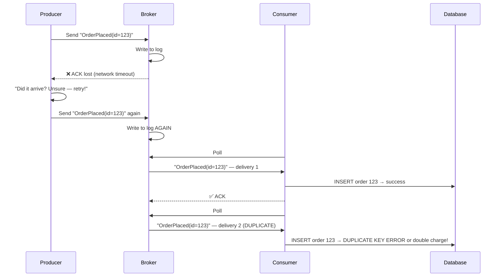
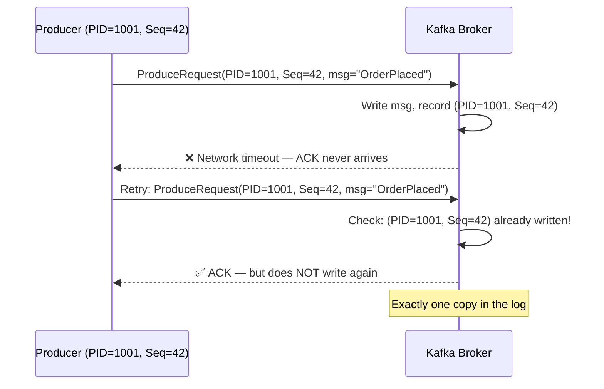

# Deduplication in Distributed Messaging

> **The core problem of distributed messaging in one sentence:** Any reliable system uses retries; any system with retries delivers messages more than once; any system that delivers messages more than once must handle duplicates — or it will corrupt business state.

There are two complementary layers of defense:
- **Exactly-Once Semantics (EOS)** — a broker-level guarantee that the messaging infrastructure will not create duplicates *within its own boundary*.
- **Idempotent Consumers / Application Deduplication** — an application-level guarantee that processing the same message twice produces the same result, protecting everything *outside* the broker boundary.

Real production systems almost always need both. This guide explains how each works internally, how to implement them, and when each is sufficient.

:::info[Who this guide is for]
- **New learners** — start at [Why Duplicates Happen](#why-duplicates-happen) and [The Three Delivery Guarantees](#the-three-delivery-guarantees).
- **Senior engineers** — jump to [Kafka EOS Internals](#kafka-exactly-once-semantics-eos-internals), [Kafka Streams Deduplication](#deduplication-in-kafka-streams), [RabbitMQ](#deduplication-in-rabbitmq), [SQS](#deduplication-in-aws-sqs), [Redis](#deduplication-with-redis), or [Production Failure Modes](#senior-deep-dive-production-failure-modes).
:::

---

## Why Duplicates Happen

### The Fundamental Trade-off

In any distributed system, you face an unavoidable dilemma:

```
Option A — At-most-once:    Send and forget. Fast, but messages can be LOST.
Option B — At-least-once:   Retry until acknowledged. Reliable, but messages can DUPLICATE.
Option C — Exactly-once:    Guaranteed delivery, guaranteed once. Requires coordination overhead.
```

Exactly-once is not magic — it is a careful combination of idempotent producers, transactional writes, and deduplication checks that together eliminate the gap where duplicates slip through.

### The Retry-Duplicate Scenario



The ACK was lost — not the message. The producer correctly retried, but the broker already had the first copy. **This is the root cause of almost every duplicate in practice.**

---

## The Three Delivery Guarantees

| Guarantee | How | Duplicate Risk | Loss Risk | Use For |
|---|---|---|---|---|
| **At-most-once** | Send, no retry, no ACK | ❌ None | ✅ Yes | Metrics, analytics, telemetry |
| **At-least-once** | Retry until ACK'd | ✅ Yes | ❌ None | Most messaging; consumer must deduplicate |
| **Exactly-once** | Idempotent + transactions | ❌ None | ❌ None | Financial, ordering, inventory |

The key insight: **exactly-once is not a property of the broker alone — it requires the producer, broker, and consumer to all cooperate.**

---

## Kafka Exactly-Once Semantics (EOS) Internals

Kafka's EOS is built from three independent but complementary mechanisms. Understanding each one separately is essential because they solve different parts of the duplicate problem.

### Layer 1: Idempotent Producer

Prevents duplicates caused by **producer retries** — when a producer resends a message because it did not receive an ACK, but the broker already wrote the first copy.



**How it works:**
- The broker assigns each producer a unique **Producer ID (PID)**.
- The producer maintains a monotonically incrementing **sequence number** per topic-partition.
- The broker tracks the last written `(PID, SequenceNumber)` per partition.
- On retry: if the broker has already seen `(PID=1001, Seq=42)` → return ACK without writing again.
- If a sequence gap is detected (`Seq=44` arrives before `Seq=43`) → error (out-of-order).

```properties
# Enable idempotent producer
enable.idempotence=true           # Enables PID + sequence tracking
acks=all                          # Required: wait for all ISR replicas
max.in.flight.requests.per.connection=5  # Max unacknowledged requests (≤5 for ordering)
retries=Integer.MAX_VALUE         # Retry indefinitely (idempotency makes this safe)
```

```java
// Spring Boot — idempotent Kafka producer
@Configuration
public class IdempotentProducerConfig {

    @Bean
    public ProducerFactory<String, Object> producerFactory() {
        Map<String, Object> props = new HashMap<>();
        props.put(ProducerConfig.BOOTSTRAP_SERVERS_CONFIG, "broker1:9092,broker2:9092");
        props.put(ProducerConfig.KEY_SERIALIZER_CLASS_CONFIG, StringSerializer.class);
        props.put(ProducerConfig.VALUE_SERIALIZER_CLASS_CONFIG, JsonSerializer.class);

        // Idempotent producer settings
        props.put(ProducerConfig.ENABLE_IDEMPOTENCE_CONFIG, true);  // Core setting
        props.put(ProducerConfig.ACKS_CONFIG, "all");
        props.put(ProducerConfig.RETRIES_CONFIG, Integer.MAX_VALUE);
        props.put(ProducerConfig.MAX_IN_FLIGHT_REQUESTS_PER_CONNECTION, 5);

        return new DefaultKafkaProducerFactory<>(props);
    }
}
```

**What idempotent producer does NOT solve:** Duplicates caused by the **application** re-publishing the same business event (e.g., a bug sends `OrderPlaced` twice from two code paths). The broker only deduplicates transport-level retries, not application-level republishing.

---

### Layer 2: Kafka Transactions (Read-Process-Write Atomicity)

Prevents duplicates caused by **consumer failures between processing and committing the offset**. The classic failure: consumer writes output to a topic but crashes before committing the offset → consumer restarts, re-reads the same input, writes output again.

```mermaid
sequenceDiagram
    participant C as Consumer / Producer
    participant I as Input Topic
    participant O as Output Topic
    participant Off as Offset Topic

    Note over C,Off: Without transactions — partial failure possible
    C->>I: Read record (offset 100)
    C->>O: Write "PaymentProcessed" ← WRITTEN
    C->>Off: Commit offset 100 ← CRASH HERE
    C->>I: Restart: re-reads offset 100
    C->>O: Write "PaymentProcessed" AGAIN ← DUPLICATE!

    Note over C,Off: With Kafka transactions — atomic
    C->>C: beginTransaction()
    C->>I: Read record (offset 100)
    C->>O: Write "PaymentProcessed" (staged, not visible)
    C->>Off: Stage offset commit (not committed)
    C->>C: commitTransaction() → ALL visible atomically
    Note over O,Off: If crash before commit: transaction aborted,\noutput record invisible, offset not advanced
```

**The `isolation.level` setting on consumers:**

```properties
# Consumer must set this to only see committed transactional records
isolation.level=read_committed  # ← Skip records from open/aborted transactions
# vs.
isolation.level=read_uncommitted # ← See all records including from aborted transactions
```

```java
// Spring Boot — Kafka transactions (read-process-write atomically)
@Configuration
public class KafkaTransactionConfig {

    @Bean
    public ProducerFactory<String, Object> transactionalProducerFactory() {
        Map<String, Object> props = new HashMap<>();
        props.put(ProducerConfig.BOOTSTRAP_SERVERS_CONFIG, "broker1:9092");
        props.put(ProducerConfig.ENABLE_IDEMPOTENCE_CONFIG, true);
        props.put(ProducerConfig.ACKS_CONFIG, "all");
        // Unique transactional ID per producer instance
        // Must be stable across restarts for transaction recovery
        props.put(ProducerConfig.TRANSACTIONAL_ID_CONFIG, "payment-processor-0");
        return new DefaultKafkaProducerFactory<>(props);
    }

    @Bean
    public KafkaTransactionManager<String, Object> kafkaTransactionManager(
            ProducerFactory<String, Object> pf) {
        return new KafkaTransactionManager<>(pf);
    }
}
```

```java
@Service
@RequiredArgsConstructor
public class PaymentProcessor {

    private final KafkaTemplate<String, Object> kafkaTemplate;

    @KafkaListener(topics = "orders", groupId = "payment-processor")
    @Transactional("kafkaTransactionManager") // Wraps read+process+write in one Kafka TX
    public void process(ConsumerRecord<String, Order> record) {
        Order order = record.value();

        PaymentResult result = paymentService.charge(order); // Business logic

        // Write output — part of the same transaction as the offset commit
        kafkaTemplate.send("payments", order.getId(), result);

        // No explicit offset commit — Spring commits atomically with the send
        // If any step fails → transaction rolls back → input record re-processed
    }
}
```

**What transactions do NOT solve:** Side effects to external systems (DB writes, HTTP calls, emails). The transaction only covers Kafka-to-Kafka operations. Any external call inside the transaction can succeed while the Kafka transaction rolls back — leaving inconsistent state. This is why application-level deduplication is still required.

---

### Layer 3: EOS in Kafka Streams (`processing.guarantee`)

Kafka Streams wraps all three layers (idempotent producer + transactions + offset commit) in a single configuration property, making the entire stream topology exactly-once.

```java
@Configuration
public class KafkaStreamsConfig {

    @Bean
    public KafkaStreamsConfiguration streamsConfig() {
        Map<String, Object> props = new HashMap<>();
        props.put(StreamsConfig.APPLICATION_ID_CONFIG, "order-enrichment");
        props.put(StreamsConfig.BOOTSTRAP_SERVERS_CONFIG, "broker1:9092");

        // EOS — atomically commits: output records + offset + state store changelog
        props.put(StreamsConfig.PROCESSING_GUARANTEE_CONFIG,
                StreamsConfig.EXACTLY_ONCE_V2); // Prefer V2 (Kafka 2.5+)
        // EXACTLY_ONCE_V2 improvements over V1:
        //   V1: transaction per task per poll, high broker overhead
        //   V2: epoch-based fencing — fewer transactions, better throughput

        props.put(StreamsConfig.DEFAULT_KEY_SERDE_CLASS_CONFIG, Serdes.String().getClass());
        props.put(StreamsConfig.DEFAULT_VALUE_SERDE_CLASS_CONFIG, Serdes.String().getClass());

        // Commit interval — how often to commit transactions
        // Lower = less re-processing on failure, higher overhead
        props.put(StreamsConfig.COMMIT_INTERVAL_MS_CONFIG, 100); // 100ms default
        return new KafkaStreamsConfiguration(props);
    }

    @Bean
    public Topology orderEnrichmentTopology(StreamsBuilder builder) {
        KStream<String, Order> orders = builder.stream("orders");

        KTable<String, Customer> customers = builder.table("customers");

        orders
            .leftJoin(customers,
                    (order, customer) -> new EnrichedOrder(order, customer))
            .filter((key, enriched) -> enriched != null)
            .to("enriched-orders");

        return builder.build();
        // With EXACTLY_ONCE_V2:
        // Read from "orders" + join + write to "enriched-orders" + commit offset
        // ALL happen in a single Kafka transaction
    }
}
```

**What `exactly_once_v2` atomically commits:**

```
ONE atomic transaction includes:
    ✅ Output records written to "enriched-orders" topic
    ✅ State store changelog updates (the customer KTable state)
    ✅ Consumer group offset advancement on "orders" topic

If crash happens before commit:
    → Transaction aborted
    → Output records invisible (read_committed consumers skip them)
    → Offset not advanced
    → Streams task restarts from last committed offset
    → Re-processes the same records → exactly-once output guaranteed
```

---

## Deduplication in Kafka (Consumer-Side)

EOS protects Kafka-internal pipelines. But most production services consume from Kafka and write to external systems (databases, REST APIs, email). For these, application-level deduplication is required.

### Strategy 1: Idempotency Key in Database (Strong Consistency)

```sql
-- Schema: track every processed event ID
CREATE TABLE processed_events (
    event_id     VARCHAR(255) PRIMARY KEY,  -- Kafka topic + partition + offset
    processed_at TIMESTAMPTZ NOT NULL DEFAULT now(),
    consumer_group VARCHAR(255) NOT NULL
);

-- Partial index to keep the table small
-- (Only keep events processed in the last 7 days)
CREATE INDEX idx_processed_events_ttl ON processed_events (processed_at)
    WHERE processed_at > now() - INTERVAL '7 days';
```

```java
@Component
@RequiredArgsConstructor
@Slf4j
public class IdempotentOrderConsumer {

    private final OrderRepository orderRepository;
    private final ProcessedEventRepository processedEventRepo;

    @KafkaListener(topics = "orders", groupId = "order-service")
    @Transactional // Single DB transaction covers both business write AND dedup record
    public void consume(ConsumerRecord<String, Order> record) {
        // Build a stable, unique event ID from Kafka coordinates
        String eventId = buildEventId(record);

        // Check-then-act inside the SAME transaction (prevents race condition)
        if (processedEventRepo.existsById(eventId)) {
            log.debug("Duplicate event skipped: {}", eventId);
            return; // ACK by returning normally — Kafka offset advances
        }

        Order order = record.value();
        orderRepository.save(order); // Business write

        // Mark as processed — same transaction → atomic with business write
        processedEventRepo.save(new ProcessedEvent(eventId, Instant.now(), "order-service"));

        // If transaction commits: both writes succeed → safe
        // If transaction rolls back: both writes fail → event re-processed next time
    }

    private String buildEventId(ConsumerRecord<?, ?> record) {
        // topic + partition + offset is globally unique within a Kafka cluster
        return record.topic() + "-" + record.partition() + "-" + record.offset();
    }
}
```

**Why put both writes in the same transaction:** If the business write succeeds but the dedup record write fails (or vice versa), you have an inconsistent state. The single transaction ensures they are atomic — either both succeed or both roll back.

---

### Strategy 2: Business-Level Idempotency Key (Domain-Driven)

Using Kafka's `topic-partition-offset` as the event ID is brittle — if the event is republished to a different topic (e.g., after a DLQ redrive), it gets a new offset and bypasses the dedup check.

**Better approach:** embed a stable business-level idempotency key in the event payload itself.

```java
// Event payload carries its own stable ID
@Value
public class OrderPlacedEvent {
    String idempotencyKey;  // e.g., "order-service-{orderId}" — stable across retries
    String orderId;
    String customerId;
    BigDecimal totalAmount;
    Instant occurredAt;
}
```

```java
@KafkaListener(topics = "orders", groupId = "inventory-service")
@Transactional
public void consume(OrderPlacedEvent event) {
    // Idempotency key from the event — stable even after DLQ redrive
    String idempotencyKey = event.getIdempotencyKey();

    if (processedEventRepo.existsById(idempotencyKey)) {
        log.debug("Business duplicate skipped: {}", idempotencyKey);
        return;
    }

    inventoryService.reserveStock(event.getOrderId(), event.getItems());

    processedEventRepo.save(new ProcessedEvent(idempotencyKey, Instant.now()));
}
```

---

### Strategy 3: Upsert (Idempotent SQL)

For cases where the same event always produces the same DB state, design the DB write itself to be idempotent — no separate dedup table needed.

```java
@KafkaListener(topics = "user-profile-updates", groupId = "profile-sync")
public void syncProfile(UserProfileUpdatedEvent event) {
    // ON CONFLICT DO UPDATE = upsert — safe to call multiple times
    // If event re-delivered: same data written again, no corruption
    jdbcTemplate.update("""
            INSERT INTO user_profiles (user_id, name, email, updated_at)
            VALUES (?, ?, ?, ?)
            ON CONFLICT (user_id) DO UPDATE SET
                name = EXCLUDED.name,
                email = EXCLUDED.email,
                updated_at = EXCLUDED.updated_at
            WHERE user_profiles.updated_at < EXCLUDED.updated_at
            """,
            event.getUserId(), event.getName(),
            event.getEmail(), event.getUpdatedAt());
    // The WHERE clause prevents stale events from overwriting newer state
}
```

**When upsert is sufficient:** The event represents the full current state of an entity (e.g., "user profile is now X"). Any number of re-deliveries produces the same final state.

**When upsert is not sufficient:** The event represents an action (e.g., "transfer $100"). Processing it twice would transfer $200. Upsert cannot protect against this — you need an explicit idempotency key.

---

## Deduplication in Kafka Streams

Kafka Streams has multiple deduplication strategies depending on whether you use the stateless API or stateful operators.

### Approach 1: State Store Deduplication (Within a Time Window)

```java
@Configuration
public class DeduplicationTopology {

    private static final Duration DEDUP_WINDOW = Duration.ofHours(24);

    @Bean
    public Topology deduplicationTopology(StreamsBuilder builder) {

        // Persistent state store backed by a Kafka changelog topic
        StoreBuilder<KeyValueStore<String, Long>> storeBuilder =
                Stores.keyValueStoreBuilder(
                        Stores.persistentKeyValueStore("dedup-store"),
                        Serdes.String(),
                        Serdes.Long()
                );
        builder.addStateStore(storeBuilder);

        builder.stream("raw-events", Consumed.with(Serdes.String(), orderSerde()))
                .transform(() -> new DeduplicationTransformer(DEDUP_WINDOW), "dedup-store")
                .filter((key, value) -> value != null) // null = duplicate, filtered out
                .to("deduplicated-events");

        return builder.build();
    }
}
```

```java
public class DeduplicationTransformer
        implements Transformer<String, Order, KeyValue<String, Order>> {

    private final Duration windowSize;
    private KeyValueStore<String, Long> dedupStore;
    private ProcessorContext context;

    @Override
    public void init(ProcessorContext context) {
        this.context = context;
        this.dedupStore = context.getStateStore("dedup-store");
    }

    @Override
    public KeyValue<String, Order> transform(String key, Order order) {
        String eventId = order.getIdempotencyKey();
        Long existingTimestamp = dedupStore.get(eventId);

        if (existingTimestamp != null) {
            long ageMs = context.timestamp() - existingTimestamp;
            if (ageMs < windowSize.toMillis()) {
                // Within dedup window — duplicate
                log.debug("Duplicate detected for eventId={}, age={}ms", eventId, ageMs);
                return KeyValue.pair(key, null); // null signals duplicate to downstream filter
            }
        }

        // New event or window expired — process it
        dedupStore.put(eventId, context.timestamp());
        return KeyValue.pair(key, order);
    }

    @Override
    public void close() {}
}
```

**Important:** The state store is backed by a Kafka changelog topic and is replicated across Kafka Streams instances. With `exactly_once_v2`, state store updates are committed atomically with output records — no duplicate processing even on crash.

---

### Approach 2: Windowed Aggregation for Dedup (Count-Based)

For cases where you want to deduplicate by counting occurrences within a time window:

```java
@Bean
public Topology deduplicateByWindow(StreamsBuilder builder) {
    TimeWindows window = TimeWindows.ofSizeAndGrace(
            Duration.ofMinutes(5),   // 5-minute dedup window
            Duration.ofMinutes(1)    // Grace period for late arrivals
    );

    builder.stream("payment-events", Consumed.with(Serdes.String(), paymentSerde()))
            // Count occurrences of each key within the window
            .groupByKey()
            .windowedBy(window)
            .count(Materialized.as("payment-count-store"))
            .toStream()
            // Only emit when count == 1 (first occurrence in window)
            .filter((windowedKey, count) -> count == 1)
            .map((windowedKey, count) -> KeyValue.pair(windowedKey.key(), count))
            // Join back with original stream to get the actual event payload
            // (simplified: in practice, store the event in the state store)
            .to("deduplicated-payments");

    return builder.build();
}
```

---

### Approach 3: Kafka Streams `suppress()` for Exactly-Once Aggregations

```java
@Bean
public Topology suppressedAggregation(StreamsBuilder builder) {
    // suppress() holds back results until the window closes definitively
    // Prevents emitting multiple updates for the same window key

    builder.stream("orders")
            .groupByKey()
            .windowedBy(TimeWindows.ofSizeAndGrace(
                    Duration.ofMinutes(10), Duration.ofMinutes(1)))
            .aggregate(
                    OrderSummary::new,
                    (key, order, summary) -> summary.add(order),
                    Materialized.with(Serdes.String(), orderSummarySerde()))
            // suppress: emit ONLY the final value when the window closes
            // Without suppress: emits an update on EVERY new order in the window
            .suppress(Suppressed.untilWindowCloses(
                    Suppressed.BufferConfig.unbounded()))
            .toStream()
            .to("order-summaries");

    return builder.build();
}
```

---

## Deduplication in RabbitMQ

RabbitMQ guarantees **at-least-once** delivery — it does not have built-in exactly-once semantics. Deduplication must be handled at the application level.

### Strategy 1: Message ID Header + Redis Dedup

```java
@Component
@RequiredArgsConstructor
@Slf4j
public class RabbitMqOrderConsumer {

    private final RedisTemplate<String, String> redis;
    private final OrderService orderService;

    private static final Duration DEDUP_TTL = Duration.ofHours(24);

    @RabbitListener(queues = "orders.queue")
    public void consume(Message message, Channel channel,
                        @Header(AmqpHeaders.DELIVERY_TAG) long deliveryTag,
                        @Header(value = "messageId", required = false) String messageId)
            throws IOException {

        // Use RabbitMQ message ID header (set by producer)
        // Falls back to a hash of the body if not set
        String dedupKey = messageId != null
                ? "rmq:dedup:" + messageId
                : "rmq:dedup:" + hashBody(message.getBody());

        // SETNX (Set if Not Exists) — atomic Redis operation
        Boolean isNew = redis.opsForValue()
                .setIfAbsent(dedupKey, "1", DEDUP_TTL);

        if (Boolean.FALSE.equals(isNew)) {
            log.debug("Duplicate RabbitMQ message skipped: {}", dedupKey);
            channel.basicAck(deliveryTag, false); // ACK to remove from queue
            return;
        }

        try {
            Order order = deserialize(message.getBody(), Order.class);
            orderService.process(order);
            channel.basicAck(deliveryTag, false); // ✅ Success
        } catch (Exception e) {
            // Remove the dedup key so the message can be retried
            redis.delete(dedupKey);
            log.error("Processing failed, dedup key removed for retry: {}", dedupKey);
            channel.basicNack(deliveryTag, false, true); // Requeue for retry
        }
    }
}
```

**The critical race condition with this approach:** If the consumer crashes between `basicAck` and the Redis key being set durably, the message is ACK'd but the dedup key disappears (Redis restart, TTL, etc.). Solution: always set the Redis key **before** the business logic, not after. If the business logic fails, delete the Redis key to allow retry.

### Strategy 2: RabbitMQ with the Idempotent Consumer Pattern (DB-backed)

```java
@RabbitListener(queues = "payments.queue")
@Transactional
public void processPayment(Message message, Channel channel,
                            @Header(AmqpHeaders.DELIVERY_TAG) long deliveryTag)
        throws IOException {

    String messageId = extractMessageId(message);

    // Check + persist in one DB transaction (no Redis needed)
    if (processedMessageRepo.existsById(messageId)) {
        channel.basicAck(deliveryTag, false);
        return;
    }

    PaymentRequest request = deserialize(message.getBody(), PaymentRequest.class);
    paymentService.charge(request); // Business logic

    // Both writes in same transaction — atomic
    processedMessageRepo.save(new ProcessedMessage(messageId, Instant.now()));
    channel.basicAck(deliveryTag, false);
}
```

### Setting a Message ID on the Producer Side

```java
// Always set a stable message ID when publishing to RabbitMQ
@Service
@RequiredArgsConstructor
public class OrderEventPublisher {

    private final RabbitTemplate rabbitTemplate;

    public void publishOrderPlaced(Order order) {
        MessageProperties props = new MessageProperties();
        // Use a stable business-level ID — not a random UUID (which changes on retry)
        props.setMessageId("order-placed-" + order.getId()); // Stable across retries
        props.setContentType(MessageProperties.CONTENT_TYPE_JSON);
        props.setDeliveryMode(MessageDeliveryMode.PERSISTENT);

        Message message = new Message(serialize(order), props);
        rabbitTemplate.send("orders.exchange", "orders.placed", message);
    }
}
```

---

## Deduplication in AWS SQS

### SQS FIFO Queue: Built-in Deduplication

SQS FIFO queues provide **native 5-minute deduplication** using a `MessageDeduplicationId`.

```java
@Service
@RequiredArgsConstructor
public class SqsFifoPublisher {

    private final SqsClient sqsClient;

    @Value("${aws.sqs.orders-fifo-url}")
    private String queueUrl;

    public void publishOrderPlaced(Order order) {
        sqsClient.sendMessage(r -> r
                .queueUrl(queueUrl)
                .messageBody(serialize(order))
                // MessageGroupId: orders for the same customer are ordered (FIFO within group)
                .messageGroupId("customer-" + order.getCustomerId())
                // MessageDeduplicationId: SQS deduplicates messages with the same ID
                // within a 5-minute deduplication window
                // Same message sent twice within 5 min → second is silently discarded
                .messageDeduplicationId("order-placed-" + order.getId())
        );
    }
}
```

**SQS FIFO deduplication mechanics:**

```
MessageDeduplicationId = "order-placed-order-123"

Send 1 at t=0:    Accepted → written to queue
Send 2 at t=30s:  Rejected → same ID within 5 min → silently discarded
Send 3 at t=6min: Accepted → window expired, treated as new message

5-minute dedup window is fixed — cannot be extended.
After 5 minutes, the same ID can be used again.
```

```java
// SQS FIFO consumer — still needs application-level dedup for post-5-min scenarios
@SqsListener(value = "${aws.sqs.orders-fifo-url}", acknowledgementMode = AcknowledgementMode.MANUAL)
@Transactional
public void consume(Order order,
                    @Header("MessageDeduplicationId") String deduplicationId,
                    Acknowledgement ack) {

    // SQS provides 5-min broker dedup, but application dedup is still needed
    // for redriven DLQ messages (which get a new MessageId but same business content)
    String eventId = "order-placed-" + order.getId();

    if (processedEventRepo.existsById(eventId)) {
        ack.acknowledge(); // ACK to delete from queue, skip processing
        return;
    }

    orderService.process(order);
    processedEventRepo.save(new ProcessedEvent(eventId, Instant.now()));
    ack.acknowledge();
}
```

### SQS Standard Queue: Consumer-Side Dedup Only

SQS Standard queues have no built-in deduplication — the consumer must handle everything.

```java
@SqsListener(value = "${aws.sqs.orders-standard-url}")
@Transactional
public void consume(ConsumerRecord<String, Order> order,
                    @Header("MessageId") String sqsMessageId,
                    @Header("ApproximateReceiveCount") int receiveCount) {

    // SQS Standard: same message can arrive multiple times, in any order
    // Must use a business-level key (not sqsMessageId — that changes per delivery)
    String eventId = "order-placed-" + order.getId();

    if (processedEventRepo.existsById(eventId)) {
        log.debug("Duplicate SQS message (receive count={}), skipping: {}",
                receiveCount, eventId);
        return; // Return normally → SQS auto-deletes on successful return
    }

    orderService.process(order);
    processedEventRepo.save(new ProcessedEvent(eventId, Instant.now()));
}
```

---

## Deduplication with Redis

Redis is the most common infrastructure for high-throughput deduplication. It provides atomic check-and-set operations that prevent the check-then-act race condition.

### Strategy 1: `SET NX EX` (Atomic Set-If-Not-Exists with TTL)

```java
@Component
@RequiredArgsConstructor
public class RedisDeduplicator {

    private final StringRedisTemplate redis;

    private static final String DEDUP_PREFIX = "dedup:";
    private static final Duration DEFAULT_TTL = Duration.ofHours(24);

    /**
     * Returns true if this is the FIRST time we've seen this eventId.
     * Returns false if it's a duplicate (already processed).
     *
     * Uses atomic SET NX EX — no race condition possible.
     */
    public boolean isNew(String eventId) {
        return isNew(eventId, DEFAULT_TTL);
    }

    public boolean isNew(String eventId, Duration ttl) {
        String key = DEDUP_PREFIX + eventId;
        // SET key value NX EX seconds
        // NX = only set if not exists
        // Returns true if key was set (new), false if key already existed (duplicate)
        Boolean result = redis.opsForValue()
                .setIfAbsent(key, "1", ttl);
        return Boolean.TRUE.equals(result);
    }

    /**
     * For cases where processing failed — remove the dedup key
     * so the event can be retried.
     */
    public void remove(String eventId) {
        redis.delete(DEDUP_PREFIX + eventId);
    }
}
```

```java
// Usage in a Kafka consumer
@KafkaListener(topics = "payments", groupId = "payment-processor")
public void processPayment(ConsumerRecord<String, PaymentRequest> record) {
    PaymentRequest request = record.value();
    String eventId = request.getIdempotencyKey();

    if (!deduplicator.isNew(eventId)) {
        log.debug("Duplicate payment event skipped: {}", eventId);
        return;
    }

    try {
        paymentGateway.charge(request);
        // Redis key remains set → future duplicates are blocked
    } catch (Exception e) {
        // Remove dedup key on failure → allow retry
        deduplicator.remove(eventId);
        throw e; // Re-throw to trigger retry / DLQ routing
    }
}
```

### Strategy 2: Redis Lua Script (Check + Set + Process Atomically)

For cases where you need to check AND update state atomically in one Redis round-trip:

```java
@Component
@RequiredArgsConstructor
public class AtomicRedisDeduplicator {

    private final StringRedisTemplate redis;

    // Lua script: atomically check-and-set with metadata
    // Returns 1 if new (set successfully), 0 if duplicate
    private static final String DEDUP_SCRIPT = """
            local existing = redis.call('GET', KEYS[1])
            if existing then
                return 0
            end
            redis.call('SET', KEYS[1], ARGV[1])
            redis.call('EXPIRE', KEYS[1], ARGV[2])
            return 1
            """;

    private final RedisScript<Long> dedupScript =
            RedisScript.of(DEDUP_SCRIPT, Long.class);

    public boolean markProcessed(String eventId, String metadata, Duration ttl) {
        Long result = redis.execute(
                dedupScript,
                List.of("dedup:" + eventId),         // KEYS[1]
                metadata,                             // ARGV[1] — e.g., timestamp, consumer ID
                String.valueOf(ttl.toSeconds())       // ARGV[2] — TTL in seconds
        );
        return Long.valueOf(1L).equals(result);
    }
}
```

### Strategy 3: Redis Bloom Filter (High-Throughput Approximate Deduplication)

For extremely high-throughput systems (millions of events/second) where a small false-positive rate is acceptable:

```java
// Requires RedisBloom module (available in Redis Stack or Redis Enterprise)
@Component
@RequiredArgsConstructor
public class BloomFilterDeduplicator {

    private final StatefulRedisModulesConnection<String, String> connection;
    private static final String BLOOM_KEY = "dedup:bloom";

    @PostConstruct
    public void initBloomFilter() {
        // Create bloom filter: 1M expected items, 0.01% false positive rate
        // Memory: ~1.8MB (vs. ~100MB for storing 1M actual keys)
        connection.sync().bfReserve(BLOOM_KEY, 0.0001, 1_000_000);
    }

    /**
     * Returns true if the event is NEW (not seen before).
     * Returns false if PROBABLY duplicate (0.01% chance of false positive).
     *
     * Use for: high-throughput dedup where occasional false positives are acceptable
     * (e.g., analytics events, metrics ingestion)
     * Do NOT use for: financial transactions, order processing
     */
    public boolean isNew(String eventId) {
        // BF.ADD: adds to filter, returns 1 if truly new, 0 if probably exists
        return connection.sync().bfAdd(BLOOM_KEY, eventId);
    }
}
```

**Bloom filter trade-offs:**

| Aspect | Exact Dedup (Redis SET) | Bloom Filter |
|---|---|---|
| **False positives** | ❌ Never | ✅ Possible (configurable rate) |
| **False negatives** | ❌ Never | ❌ Never (if it says new, it's new) |
| **Memory (1M events)** | ~50 MB (full keys) | ~1.8 MB |
| **Throughput** | Very high | Extremely high |
| **TTL / cleanup** | Per-key TTL | Cannot remove individual items |
| **Best for** | Financial, ordering | Analytics, metrics, logging |

---

## Choosing the Right Idempotency Key

The idempotency key design is the most critical and most overlooked aspect of deduplication. A poorly designed key either over-deduplicates (drops legitimate events) or under-deduplicates (lets duplicates through).

### Key Design Principles

```
Good idempotency keys:
✅ Stable across retries (same logical event = same key, always)
✅ Unique per business operation (not per transport delivery)
✅ Include domain context (not just a UUID)
✅ Have bounded uniqueness (TTL-aware — keys older than N days are irrelevant)

Bad idempotency keys:
❌ Kafka offset alone (changes on DLQ redrive)
❌ SQS MessageId alone (new ID per delivery attempt)
❌ Random UUID at send time (different UUID on retry = no deduplication)
❌ Timestamp alone (two events at same millisecond = false dedup)
```

```java
// Idempotency key design by event type

// 1. State-change events — use the entity ID + event type + version
"order-" + orderId + "-placed"         // OrderPlaced — only one per order
"order-" + orderId + "-status-" + newStatus  // Status change — one per state

// 2. Action events — use the action + business transaction ID
"payment-" + paymentTransactionId      // One payment per transaction
"transfer-" + transferId + "-v1"       // Version suffix for retry safety

// 3. External API calls — use a client-generated idempotency key
String idempotencyKey = "charge-" + orderId + "-" + Instant.now().toEpochMilli();
// Pass to Stripe/payment gateway as Idempotency-Key header
// Gateway deduplicates retries with the same key

// 4. Composite key when no single ID is stable
String key = DigestUtils.md5Hex(
    eventType + "|" + aggregateId + "|" + eventTimestamp.toEpochMilli()
);
```

---

## Full Comparison: Deduplication Strategies

| Strategy | Consistency | Throughput | TTL Support | Distributed | Best For |
|---|---|---|---|---|---|
| **DB unique constraint** | ✅ Strong | ⚠️ Medium | Manual cleanup | ✅ Yes | Financial, ordering — correctness critical |
| **DB + upsert** | ✅ Strong | ✅ High | N/A | ✅ Yes | Full-state events (last write wins) |
| **Redis SETNX** | ⚠️ Eventual (Redis crash) | ✅ Very high | ✅ Built-in | ✅ Yes | High-throughput; Redis persistence required |
| **Redis Lua script** | ⚠️ Eventual | ✅ Very high | ✅ Built-in | ✅ Yes | Atomic check + metadata update |
| **Redis Bloom Filter** | ❌ Approximate | ✅ Extremely high | ❌ No per-key TTL | ✅ Yes | Analytics, metrics — false positives OK |
| **Kafka EOS (producer)** | ✅ Strong | ⚠️ Lower (transactions) | N/A | Kafka only | Kafka→Kafka; transport-level only |
| **Kafka Streams state store** | ✅ Strong | ✅ High | ✅ Window-based | Within Streams app | Streams pipelines |
| **SQS FIFO dedup ID** | ✅ Strong | ⚠️ Lower (FIFO) | 5 min fixed | AWS only | AWS workloads; moderate throughput |
| **In-memory (single instance)** | ❌ Lost on restart | ✅ Extremely high | ✅ Manual | ❌ No | Dev/test only — never production |

---

## Senior Deep Dive: Production Failure Modes

### 1. The TOCTOU Race Condition

Time-of-Check-to-Time-of-Use (TOCTOU) is the most common deduplication bug in production. It occurs when the check and the action are not atomic.

```java
// ❌ BROKEN — race condition between check and insert
@KafkaListener(topics = "payments")
public void process(PaymentEvent event) {
    // Thread A: checks → not found → proceeds
    // Thread B: checks → not found → proceeds
    // Both threads now execute the business logic!
    if (!processedEventRepo.existsById(event.getId())) {
        paymentGateway.charge(event); // BOTH THREADS CHARGE!
        processedEventRepo.save(new ProcessedEvent(event.getId()));
    }
}

// ✅ FIXED — atomic check-and-insert with DB unique constraint
@KafkaListener(topics = "payments")
@Transactional
public void process(PaymentEvent event) {
    try {
        // INSERT with unique constraint — second attempt throws DataIntegrityViolationException
        processedEventRepo.save(new ProcessedEvent(event.getId())); // FAILS on duplicate
        paymentGateway.charge(event); // Only reached if insert succeeded
    } catch (DataIntegrityViolationException e) {
        log.debug("Duplicate payment event suppressed: {}", event.getId());
        // ACK by returning — Kafka offset advances
    }
}
```

**For Redis:** Use `SET NX EX` (atomic) instead of `GET` then `SET` (non-atomic):

```java
// ❌ BROKEN — two commands, not atomic
Boolean exists = redis.hasKey("dedup:" + eventId);
if (!exists) {
    redis.opsForValue().set("dedup:" + eventId, "1"); // Race window between these two!
    processEvent();
}

// ✅ FIXED — single atomic command
Boolean isNew = redis.opsForValue().setIfAbsent("dedup:" + eventId, "1", Duration.ofHours(24));
if (Boolean.TRUE.equals(isNew)) {
    processEvent();
}
```

---

### 2. TTL Expiry and Late Message Re-Processing

Deduplication keys have TTLs to prevent unbounded storage growth. If a message is redriven from a DLQ after the TTL expires, it passes the dedup check and gets processed again.

```
Timeline:
    t=0:   OrderPlaced(id=123) processed successfully → dedup key set, TTL=24h
    t=1h:  Processing result is correct
    t=25h: Dedup key expires (TTL)
    t=26h: DLQ redrive: OrderPlaced(id=123) redriven to main queue
           → dedup check: key not found → processes AGAIN → double order! ❌
```

**Mitigations:**

```java
// Option 1: Longer TTL than your maximum DLQ retention
// SQS DLQ max retention = 14 days → dedup TTL should be 15 days
// Trade-off: more Redis memory

// Option 2: Business-level idempotency in the target system
// The order table has UNIQUE(order_id) → INSERT fails on re-processing
// This is a second line of defense independent of the dedup layer

// Option 3: DLQ redrive always goes through a pre-check service
// that verifies the event was not already processed before requeueing

// Option 4: Combine short TTL dedup (fast path) with DB constraint (slow path)
@Transactional
public void process(OrderPlacedEvent event) {
    // Fast path: Redis dedup (handles recent duplicates cheaply)
    if (!redisDeduplicator.isNew(event.getId(), Duration.ofDays(7))) {
        return;
    }

    try {
        orderRepository.save(Order.from(event)); // UNIQUE constraint = second defense
    } catch (DataIntegrityViolationException e) {
        // Expired Redis key + late DLQ redrive → caught here
        log.warn("Late duplicate caught by DB constraint: {}", event.getId());
    }
}
```

---

### 3. Deduplication Storage Growth and Cleanup

Without cleanup, deduplication tables grow unboundedly. At 1 million events per day, a 7-day retention means 7 million rows — which degrades lookup performance.

```java
// Scheduled cleanup for the processed_events table
@Scheduled(cron = "0 0 3 * * *") // 3 AM daily
@Transactional
public void cleanupOldDeduplicationRecords() {
    Instant cutoff = Instant.now().minus(7, ChronoUnit.DAYS);
    int deleted = processedEventRepo.deleteByProcessedAtBefore(cutoff);
    log.info("Cleaned up {} deduplication records older than {}", deleted, cutoff);

    // Vacuum the table to reclaim space (PostgreSQL)
    jdbcTemplate.execute("VACUUM ANALYZE processed_events");
}
```

```sql
-- Partitioned processed_events table for efficient bulk deletion
CREATE TABLE processed_events (
    event_id     VARCHAR(255) NOT NULL,
    processed_at TIMESTAMPTZ NOT NULL DEFAULT now(),
    consumer_group VARCHAR(255) NOT NULL
) PARTITION BY RANGE (processed_at);

-- Create weekly partitions
CREATE TABLE processed_events_2024_w01 PARTITION OF processed_events
    FOR VALUES FROM ('2024-01-01') TO ('2024-01-08');

-- Drop an entire week of records with zero table rewrite cost
DROP TABLE processed_events_2024_w01; -- O(1) vs O(N) DELETE
```

---

### 4. Deduplication Across Multiple Consumer Instances

In a Kubernetes deployment with 10 replicas of a consumer, two replicas can concurrently receive different Kafka partitions. Deduplication must be shared across all instances.

```
Consumer Instance 1 (partition 0): receives OrderPlaced(id=123) at t=0
Consumer Instance 2 (partition 3): receives OrderPlaced(id=123) at t=0ms
(same event published to two topics, or same event due to consumer group rebalance)

Both instances check dedup simultaneously:
    Instance 1: Redis SETNX dedup:order-123 → returns 1 (new) → processes
    Instance 2: Redis SETNX dedup:order-123 → returns 0 (exists) → skipped ✅
```

**Redis `SETNX` is atomic at the Redis server level** — even under concurrent requests from multiple consumer instances, only one `SETNX` call returns 1 (success). The other returns 0. This is why Redis is the preferred dedup backend for horizontally-scaled consumers.

**For DB-based dedup under concurrency:**

```sql
-- PostgreSQL: INSERT ... ON CONFLICT handles concurrent inserts safely
-- Second insert for the same event_id → silently ignored, no error
INSERT INTO processed_events (event_id, processed_at, consumer_group)
VALUES ('order-123', now(), 'order-service')
ON CONFLICT (event_id) DO NOTHING;
-- Both instances try this simultaneously → only one succeeds → no race condition
```

---

### 5. Observability: What to Monitor

```java
@Component
@RequiredArgsConstructor
public class DeduplicationMetrics {

    private final MeterRegistry registry;

    public void recordDuplicate(String topic, String reason) {
        registry.counter("dedup.duplicates.detected",
                "topic", topic,
                "reason", reason).increment(); // "redis_hit", "db_constraint", etc.
    }

    public void recordNew(String topic) {
        registry.counter("dedup.events.processed", "topic", topic).increment();
    }

    public void recordDedupLatency(String strategy, long nanos) {
        registry.timer("dedup.check.duration", "strategy", strategy)
                .record(Duration.ofNanos(nanos));
    }
}
```

**Key metrics and alerts:**

| Metric | Alert Threshold | What It Means |
|---|---|---|
| `dedup.duplicates.detected` rate | Spike > 5% of events | Upstream producing excessive duplicates — investigate producer |
| `dedup.check.duration` p99 | > 10ms (Redis) / > 50ms (DB) | Dedup layer becoming a bottleneck |
| `processed_events` table size | > 50M rows | Cleanup job not running or TTL too long |
| Redis `dedup:*` key count | > expected (events/day × TTL days) | TTL misconfiguration |
| Duplicate rate drops to 0 suddenly | Any | Dedup check may be bypassed by a bug |

---

## Interview Decision Matrix

| Scenario | Recommended Strategy | Why |
|---|---|---|
| Kafka → Kafka stream processing only | Kafka EOS (`exactly_once_v2`) | Native, atomic, zero extra infrastructure |
| Kafka consumer → PostgreSQL write | DB unique constraint + `ON CONFLICT DO NOTHING` | Atomic, no extra infrastructure, handles concurrent consumers |
| Kafka consumer → external REST API | Redis `SETNX` + business-level idempotency key | Fast check; API must also support idempotency headers |
| RabbitMQ consumer with retries | Message ID header + Redis or DB dedup | RabbitMQ has no built-in dedup |
| AWS SQS with moderate throughput | SQS FIFO + `MessageDeduplicationId` | Native broker-level 5-min dedup |
| AWS SQS + DLQ redrive | SQS FIFO dedup + application-level DB check | 5-min broker window too short for DLQ scenarios |
| 1M+ events/second analytics | Redis Bloom Filter | Memory-efficient; false positives acceptable for analytics |
| Financial transactions | DB constraint + Redis fast path + business upsert | Multiple layers; no single point of dedup failure |
| Kafka Streams with state | State store + window-based dedup | Fully integrated with EOS; no external Redis needed |

:::tip[Interview Phrasing — EOS vs. Deduplication]
*"Kafka's exactly-once semantics only guarantee that records are written exactly once within the Kafka ecosystem — reads, writes, and offset commits happen atomically. The moment you write to a database or call an external API inside a consumer, you're outside Kafka's transaction boundary, and exactly-once no longer applies. That's where application-level deduplication comes in. My default pattern is: a stable business-level idempotency key in the event payload, a Redis SETNX check on the consumer for speed, and a DB unique constraint as the second line of defense — because Redis TTL expiry plus DLQ redrives can let duplicates through to the DB layer. The deduplication key must be based on business identity, not Kafka offset, so it remains stable across topic migrations and DLQ redrives."*
:::

:::tip[Interview Phrasing — TOCTOU Race Condition]
*"The most common deduplication bug is the check-then-act race condition: you check if the event ID exists, find it doesn't, and then multiple concurrent consumers all proceed to process the same event simultaneously. For Redis, the fix is using the atomic SETNX command — it checks and sets in one operation, and only one caller gets a true return. For databases, the fix is writing the dedup record first with a unique constraint — the second concurrent INSERT either throws DataIntegrityViolationException or returns 0 rows with ON CONFLICT DO NOTHING. Never use GET then SET in Redis, and never use SELECT-then-INSERT in SQL for deduplication — those patterns have a race window."*
:::

---

## Further Reading

- [Kafka Documentation — Transactions](https://kafka.apache.org/documentation/#transactions) — Official Kafka docs explaining the transactional producer, `isolation.level`, and exactly-once guarantees.
- [Kafka Improvement Proposal — KIP-98 (Exactly-Once)](https://cwiki.apache.org/confluence/display/KAFKA/KIP-98+-+Exactly+Once+Delivery+and+Transactional+Messaging) — The original design proposal for Kafka EOS; explains every design decision and trade-off.
- [Kafka Improvement Proposal — KIP-447 (exactly_once_v2)](https://cwiki.apache.org/confluence/display/KAFKA/KIP-447%3A+Producer+scalability+for+exactly+once+semantics) — V2 improvements using epoch-based fencing instead of per-task transactions.
- [Spring Kafka — Exactly Once](https://docs.spring.io/spring-kafka/reference/kafka/exactly-once.html) — Spring Kafka documentation on `KafkaTransactionManager`, `@Transactional`, and Kafka Streams `processing.guarantee`.
- [Redis — SET command with NX and EX](https://redis.io/commands/set/) — Official Redis documentation on atomic set-if-not-exists; the foundation of Redis-based deduplication.
- [Amazon SQS — Exactly-Once Processing](https://docs.aws.amazon.com/AWSSimpleQueueService/latest/SQSDeveloperGuide/FIFO-queues-exactly-once-processing.html) — AWS documentation on FIFO queue deduplication ID mechanics and the 5-minute window.
- [Designing Data-Intensive Applications — Chapter 11](https://dataintensive.net/) — Kleppmann's treatment of exactly-once semantics, idempotency, and the fundamental impossibility of exactly-once across system boundaries.
- [The Outbox Pattern](../../system-design/outbox-pattern.md) — The companion pattern: ensuring events are reliably published to Kafka/RabbitMQ in the first place, which is a prerequisite for deduplication to be the only concern at the consumer.