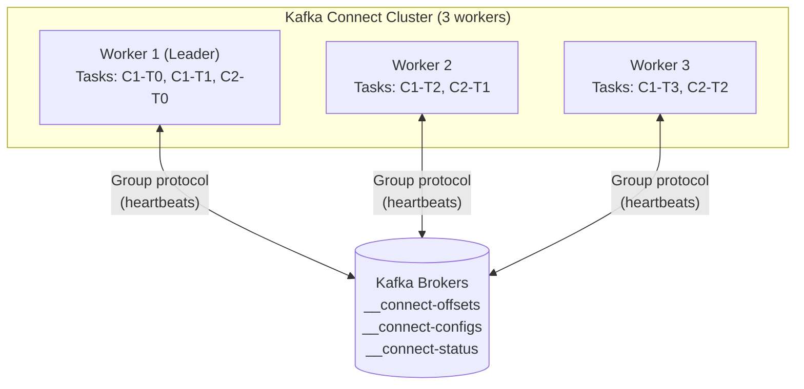

# Preventing Kafka Connect Rebalance Storms

A **rebalance storm** is a self-reinforcing cycle of cluster-wide task reassignments triggered by workers joining or leaving a Kafka Connect cluster. What should be a routine rolling restart becomes a cascade of stop-the-world pauses that can halt data pipelines for minutes at a time.

This guide explains **why** rebalance storms happen at the protocol level, **how** each configuration parameter actually works, and the precise steps to eliminate downtime during rolling restarts.

---

## Why Rebalance Storms Happen: The Root Cause

### Kafka Connect's Distributed Architecture

A Kafka Connect cluster is a group of **worker processes** that collectively own a set of **connector tasks**. Workers coordinate using Kafka's group membership protocol — the same mechanism used by standard consumer groups.



The cluster leader (always the first member in the group) is responsible for computing the **task assignment** — deciding which worker runs which connector task. This assignment is recalculated every time the group membership changes.

### The Three Internal Kafka Topics

Kafka Connect uses three compacted topics as its distributed state store:

| Topic | Purpose | Contents |
|:---|:---|:---|
| `__connect-configs` | Connector and task configurations | Connector JSON configs, task counts |
| `__connect-offsets` | Source connector progress | Last read offset per source partition |
| `__connect-status` | Task and connector status | RUNNING / FAILED / PAUSED states |

When a worker restarts, it **replays all three topics** from the beginning to reconstruct cluster state before it can rejoin. This replay time is a major contributor to restart duration and directly impacts how long `scheduled.rebalance.max.delay.ms` needs to be set.

### The Rebalance Trigger Chain

```
Worker 3 stops for patching
        │
        ▼
Worker 3 misses heartbeats for session.timeout.ms (default: 10s)
        │
        ▼
Kafka broker marks Worker 3 dead → sends REBALANCE_IN_PROGRESS to all workers
        │
        ├──── Eager Protocol (default pre-Kafka 2.4):
        │     All workers STOP ALL tasks immediately
        │     Leader recomputes full assignment
        │     All workers restart tasks (even unchanged ones)
        │     → Full stop-the-world
        │
        └──── Incremental Cooperative (Kafka 2.4+):
              Only orphaned tasks (formerly on Worker 3) are stopped
              Other tasks continue running
              → Minimal disruption
        
Worker 3 restarts and rejoins (2 minutes later)
        │
        ▼
ANOTHER rebalance triggered (worker joined)
        │
        (In Eager protocol — all tasks stop again)
        (In Cooperative protocol — orphaned tasks reassigned only)
```

**The "storm" pattern** occurs when:
1. Workers restart faster than `scheduled.rebalance.max.delay.ms` → rebalance triggered before the node rejoins
2. Multiple workers restart in quick succession → each triggers its own rebalance
3. Connectors fail during the rebalance chaos → connector restart triggers a third rebalance

---

## Protocol Deep Dive: Eager vs. Incremental Cooperative

### Eager Rebalancing (Stop-the-World)

In the **Eager** protocol, every rebalance is a full reset:

```
Step 1: Trigger (worker leaves/joins)
  → All workers receive REBALANCE_IN_PROGRESS notification
  → All workers immediately REVOKE all their current task assignments
  → All tasks across the entire cluster STOP

Step 2: Synchronization barrier
  → All workers must call rejoin() — even workers with no task changes
  → Group waits for ALL workers to check in (slow workers delay everyone)

Step 3: Leader recomputes full assignment
  → Leader assigns ALL tasks to ALL workers from scratch

Step 4: Workers receive new assignments
  → All tasks START on their (possibly unchanged) workers
  → End-to-end pause typically 10–60 seconds per rebalance
```

**Why this is catastrophic for rolling restarts:**
- 3 workers restarting sequentially = minimum 3 full cluster pauses
- Each pause stops ALL connectors (not just the ones on the restarting worker)
- A sink connector stopped mid-batch may need to reprocess from last committed offset → duplicate processing downstream

### Incremental Cooperative Rebalancing (the Fix)

In the **Incremental Cooperative** protocol, rebalances are surgical:

```
Step 1: Trigger (worker leaves/joins)
  → Only the DEPARTING worker revokes its task assignments
  → All other workers continue running their tasks uninterrupted

Step 2: Leader recomputes assignment delta
  → Only the orphaned tasks (from the departed worker) need reassignment
  → Existing worker → task mappings are preserved

Step 3: Workers with NEW tasks start them
  → Only the newly assigned tasks are started
  → No existing running tasks are interrupted

Step 4: Worker rejoins (after patching)
  → Another incremental rebalance
  → Some tasks may migrate back to the rejoining worker
  → Tasks that migrate: briefly stopped on source, started on destination
  → Tasks that don't migrate: never interrupted
```

```
Eager (3 workers, 9 tasks):                Incremental Cooperative:
  Restart W1:                                Restart W1:
    ALL 9 tasks STOP                           W1's 3 tasks STOP
    ALL 9 tasks RESTART                        W2 and W3's 6 tasks continue
    Duration: ~30s                             Duration: ~5s (only 3 tasks)

  Restart W2:                                Restart W2:
    ALL 9 tasks STOP again                     W2's 3 tasks STOP
    ALL 9 tasks RESTART                        Other tasks continue
    Duration: ~30s                             Duration: ~5s

Total downtime: ~90s                         Total task disruption: ~15s
                                              (and only for specific tasks)
```

### What `connect.protocol=compatible` Actually Does

The `compatible` setting tells each worker to **advertise support for both protocols**. The cluster uses the highest protocol version all workers support. During a rolling upgrade:

- Old workers (eager-only) + new workers (compatible) → cluster uses **eager** (lowest common denominator)
- All workers on `compatible` → cluster uses **incremental cooperative**

This is why you must complete the rolling restart before the protocol upgrade takes effect — the cluster stays in eager mode until all workers are on `compatible`.

---

## Configuration Reference: Every Parameter Explained

### `connect.protocol`

```properties
connect.protocol=compatible
```

| Value | Protocol Used | When to Use |
|:---|:---|:---|
| `eager` | Always eager (stop-the-world) | Legacy compatibility only |
| `compatible` | Incremental cooperative if all workers support it | Default since Kafka 3.0; use explicitly on older versions |

**Internals:** This setting is advertised in the `JoinGroup` request each worker sends to the Kafka group coordinator. The coordinator selects the protocol version based on what all current members support.

### `scheduled.rebalance.max.delay.ms`

```properties
scheduled.rebalance.max.delay.ms=300000
```

This is the most operationally critical setting. When a worker leaves the group, the **leader does not trigger a rebalance immediately**. Instead it starts a countdown timer. If the worker rejoins before the timer expires, no rebalance occurs at all — tasks remain on the workers they were on.

```
Worker 3 leaves at T=0
  Leader starts countdown: 300,000ms (5 minutes)

T=90s: Worker 3 finishes patching and rejoins
  Timer cancelled. No rebalance triggered.
  Worker 3's tasks resume exactly where they were.
  Zero disruption to other workers.

vs.

T=0:   Worker 3 leaves
T=0:   delay = 0 (or very small) → immediate rebalance
T=30s: Worker 3 rejoins → second rebalance
       (2 rebalances for one worker restart)
```

**How to size it correctly:**

```
Measure each phase of your restart:
  1. Service stop signal → process exit:         ~5s
  2. OS patch application:                       ~60s
  3. System reboot (if required):                ~90s
  4. Service start → process ready:              ~15s
  5. Connect worker topic replay (critical!):    ~60-180s*
  6. Worker joins group + gets assignment:       ~10s
                                              ─────────
  Total:                                     ~240-360s

Add 20% buffer:                              ~300-430s

Set: scheduled.rebalance.max.delay.ms=300000 (5 min) to 420000 (7 min)
```

*The topic replay time (step 5) grows with the size of `__connect-configs` and `__connect-status`. Clusters with hundreds of connectors may take several minutes just to replay these topics on startup.

**Measure your actual replay time:**
```bash
# Start a worker in foreground and time from start to "Joined group" log message
time confluent local services connect start 2>&1 | grep -m1 "Successfully joined"
```

### `task.shutdown.graceful.timeout.ms`

```properties
task.shutdown.graceful.timeout.ms=5000
```

When a worker is asked to stop, it sends a `stop()` signal to each task. If a task does not stop within this window, the worker force-kills it and proceeds. Without this, a single hung connector (e.g., waiting on a database connection) can block the entire worker shutdown indefinitely — consuming valuable time from your `scheduled.rebalance.max.delay.ms` budget.

**Common causes of hung task shutdown:**
- JDBC source connector waiting for a slow query to complete
- S3 sink connector mid-upload of a large file
- HTTP sink connector waiting on a downstream timeout
- Debezium connector waiting for a database transaction log read

**Diagnosis:**
```bash
# See which tasks are slow to stop
grep "Waiting for task" /var/log/kafka/connect.log | tail -20
```

### `session.timeout.ms` and `heartbeat.interval.ms`

```properties
session.timeout.ms=45000
heartbeat.interval.ms=15000
```

`session.timeout.ms` is how long the Kafka broker waits without receiving a heartbeat before declaring a worker dead and triggering a rebalance.

`heartbeat.interval.ms` is how frequently the worker sends heartbeats. Must be less than `session.timeout.ms / 3`.

**The tradeoff:**

| Setting | Low Value | High Value |
|:---|:---|:---|
| `session.timeout.ms` | Fast failure detection; rebalance starts sooner | Slow detection; delays start of `scheduled.rebalance.max.delay.ms` timer |
| Heartbeat interval | More network traffic | Slower to detect worker death |

**Recommended for rolling restarts:**
```properties
# Balanced: detects dead workers in ~10-15s but doesn't trigger false alarms
session.timeout.ms=45000
heartbeat.interval.ms=15000
```

**Do not set `session.timeout.ms` too low** (e.g., 5000ms) on a busy cluster. Under GC pressure or CPU saturation, a worker may miss heartbeats temporarily without actually being dead — causing spurious rebalances.

### `offset.flush.interval.ms` and `offset.flush.timeout.ms`

```properties
offset.flush.interval.ms=10000
offset.flush.timeout.ms=5000
```

Source connectors periodically flush their consumed offsets to `__connect-offsets`. When a worker shuts down, it attempts a final offset flush. If this flush times out, the connector will reprocess records from the last successfully committed offset on restart.

**Implication for rolling restarts:** A long `offset.flush.timeout.ms` adds to your shutdown time and eats into `scheduled.rebalance.max.delay.ms`.

---

## Task Assignment Algorithm Internals

Understanding how the leader assigns tasks helps you predict rebalance impact and configure connectors optimally.

### Round-Robin Assignment (default)

The Connect leader assigns tasks to workers in round-robin order based on worker capacity. With 3 workers and 9 tasks:

```
Worker 1: Task 0, Task 3, Task 6
Worker 2: Task 1, Task 4, Task 7
Worker 3: Task 2, Task 5, Task 8
```

When Worker 3 leaves, tasks 2, 5, and 8 become orphaned. With incremental cooperative rebalancing, they are redistributed:

```
After Worker 3 leaves (incremental):
  Worker 1: Task 0, Task 3, Task 6, Task 2   (absorbed 1 orphan)
  Worker 2: Task 1, Task 4, Task 7, Task 5, Task 8   (absorbed 2 orphans)
  → Only 3 tasks stopped and restarted
```

When Worker 3 rejoins, some tasks migrate back:

```
After Worker 3 rejoins (incremental):
  Worker 1: Task 0, Task 3, Task 6
  Worker 2: Task 1, Task 4, Task 7
  Worker 3: Task 2, Task 5, Task 8   (re-migrated back)
  → Only migrated tasks briefly stopped; others uninterrupted
```

### Task Count Sizing Strategy

Connector `tasks.max` controls how many parallel tasks a connector spawns. More tasks = higher throughput but also more migration overhead during rebalances.

```json
{
  "name": "jdbc-source-orders",
  "config": {
    "connector.class": "io.confluent.connect.jdbc.JdbcSourceConnector",
    "tasks.max": "4",
    "connection.url": "jdbc:postgresql://db:5432/orders",
    "table.whitelist": "orders",
    "mode": "incrementing"
  }
}
```

**Rule of thumb:** Set `tasks.max` = number of source partitions (for JDBC: number of tables or query splits). Going higher wastes resources; going lower limits throughput.

---

## Monitoring: Detecting Rebalance Storms

### JMX Metrics to Watch

Kafka Connect exposes JMX metrics that reveal rebalance activity in real-time:

```
# Number of rebalances this worker has participated in
kafka.connect:type=connect-worker-rebalance-metrics,connector=*
  → rebalance-total
  → rebalance-avg-time-ms
  → rebalance-max-time-ms
  → completed-rebalances-total

# Task state metrics — watch for rapid transitions
kafka.connect:type=connector-task-metrics,connector=*,task=*
  → status           (running / paused / failed / unassigned)
  → offset-commit-avg-time-ms
  → offset-commit-failure-percentage
```

### Spring Boot Monitoring Integration

For Spring Boot applications that interact with Kafka Connect via its REST API, implement a monitoring service that tracks cluster health and alerts on rebalance activity:

```java
@Service
@Slf4j
public class KafkaConnectClusterMonitor {

    private final RestClient connectClient;
    private final MeterRegistry meterRegistry;

    public KafkaConnectClusterMonitor(
            @Value("${kafka.connect.url}") String connectUrl,
            MeterRegistry meterRegistry) {
        this.connectClient = RestClient.builder()
            .baseUrl(connectUrl)
            .defaultHeader(HttpHeaders.CONTENT_TYPE, MediaType.APPLICATION_JSON_VALUE)
            .build();
        this.meterRegistry = meterRegistry;
    }

    // Poll every 30 seconds — fast enough to catch rebalances in progress
    @Scheduled(fixedDelay = 30_000)
    public void pollClusterHealth() {
        try {
            ConnectClusterInfo clusterInfo = connectClient.get()
                .uri("/")
                .retrieve()
                .body(ConnectClusterInfo.class);

            List<String> connectors = connectClient.get()
                .uri("/connectors?expand=status&expand=info")
                .retrieve()
                .body(new ParameterizedTypeReference<List<String>>() {});

            checkConnectorStates(connectors);

        } catch (Exception e) {
            log.error("Failed to poll Kafka Connect cluster health", e);
            meterRegistry.counter("kafka.connect.poll.error").increment();
        }
    }

    private void checkConnectorStates(List<String> connectorNames) {
        int failedTasks = 0;
        int pausedTasks = 0;
        int runningTasks = 0;

        for (String name : connectorNames) {
            ConnectorStatusResponse status = connectClient.get()
                .uri("/connectors/{name}/status", name)
                .retrieve()
                .body(ConnectorStatusResponse.class);

            if (status == null) continue;

            for (TaskStatus task : status.getTasks()) {
                switch (task.getState()) {
                    case "RUNNING" -> runningTasks++;
                    case "FAILED" -> {
                        failedTasks++;
                        log.error("TASK FAILED: connector={} task={} worker={} error={}",
                            name, task.getId(), task.getWorkerId(), task.getTrace());
                        meterRegistry.counter("kafka.connect.task.failed",
                            "connector", name).increment();
                    }
                    case "UNASSIGNED" -> {
                        // UNASSIGNED during a rebalance is normal; persistent UNASSIGNED is a bug
                        log.warn("Task UNASSIGNED: connector={} task={}", name, task.getId());
                        meterRegistry.counter("kafka.connect.task.unassigned",
                            "connector", name).increment();
                    }
                    case "PAUSED" -> pausedTasks++;
                }
            }
        }

        meterRegistry.gauge("kafka.connect.tasks.running",
            Tags.empty(), runningTasks);
        meterRegistry.gauge("kafka.connect.tasks.failed",
            Tags.empty(), failedTasks);
        meterRegistry.gauge("kafka.connect.tasks.paused",
            Tags.empty(), pausedTasks);

        if (failedTasks > 0) {
            log.warn("Kafka Connect cluster degraded: {} failed tasks", failedTasks);
        }
    }
}
```

```java
// REST API client for Connect operations (rolling restart automation)
@Service
@Slf4j
public class KafkaConnectAdminClient {

    private final RestClient connectClient;

    // Restart a specific failed task
    public void restartTask(String connectorName, int taskId) {
        connectClient.post()
            .uri("/connectors/{name}/tasks/{taskId}/restart", connectorName, taskId)
            .retrieve()
            .toBodilessEntity();
        log.info("Restarted task: connector={} taskId={}", connectorName, taskId);
    }

    // Pause a connector before node maintenance (reduces rebalance scope)
    public void pauseConnector(String connectorName) {
        connectClient.put()
            .uri("/connectors/{name}/pause", connectorName)
            .retrieve()
            .toBodilessEntity();
        log.info("Paused connector: {}", connectorName);
    }

    // Resume connector after maintenance
    public void resumeConnector(String connectorName) {
        connectClient.put()
            .uri("/connectors/{name}/resume", connectorName)
            .retrieve()
            .toBodilessEntity();
        log.info("Resumed connector: {}", connectorName);
    }

    // Get full cluster status
    public Map<String, ConnectorStatusResponse> getAllConnectorStatuses() {
        List<String> connectors = connectClient.get()
            .uri("/connectors")
            .retrieve()
            .body(new ParameterizedTypeReference<List<String>>() {});

        return connectors.stream()
            .collect(Collectors.toMap(
                Function.identity(),
                name -> connectClient.get()
                    .uri("/connectors/{name}/status", name)
                    .retrieve()
                    .body(ConnectorStatusResponse.class)
            ));
    }

    // Wait for all tasks to be RUNNING (use after node rejoins)
    public void awaitAllTasksRunning(Duration timeout) throws InterruptedException {
        Instant deadline = Instant.now().plus(timeout);
        while (Instant.now().isBefore(deadline)) {
            Map<String, ConnectorStatusResponse> statuses = getAllConnectorStatuses();
            boolean allRunning = statuses.values().stream()
                .flatMap(s -> s.getTasks().stream())
                .allMatch(t -> "RUNNING".equals(t.getState()));

            if (allRunning) {
                log.info("All tasks RUNNING — cluster is stable");
                return;
            }

            log.info("Waiting for tasks to stabilize...");
            Thread.sleep(5_000);
        }
        throw new TimeoutException("Tasks did not reach RUNNING state within " + timeout);
    }
}
```

### Prometheus Alert Rules

```yaml
groups:
- name: kafka-connect-rebalance
  rules:

  # Alert: Tasks failing during or after a rebalance
  - alert: KafkaConnectTaskFailed
    expr: kafka_connect_tasks_failed > 0
    for: 2m
    labels:
      severity: warning
    annotations:
      summary: "{{ $value }} Kafka Connect tasks are in FAILED state"
      description: "Check connector logs and restart failed tasks via REST API"

  # Alert: Tasks stuck UNASSIGNED — rebalance may be stuck
  - alert: KafkaConnectTaskUnassigned
    expr: kafka_connect_tasks_unassigned > 0
    for: 5m
    labels:
      severity: warning
    annotations:
      summary: "{{ $value }} tasks stuck UNASSIGNED for >5 minutes"
      description: "Possible stuck rebalance. Check worker logs for group coordination errors."

  # Alert: Rebalance duration spike — indicates storm
  - alert: KafkaConnectRebalanceSlow
    expr: kafka_connect_rebalance_avg_time_ms > 30000
    for: 1m
    labels:
      severity: critical
    annotations:
      summary: "Kafka Connect rebalance taking >30s — possible storm"
      description: "Check if multiple workers are restarting simultaneously"

  # Alert: Zero running tasks — full cluster outage
  - alert: KafkaConnectNoRunningTasks
    expr: kafka_connect_tasks_running == 0
    for: 1m
    labels:
      severity: critical
    annotations:
      summary: "CRITICAL: No Kafka Connect tasks running"
      description: "Possible rebalance storm or cluster failure. Immediate investigation required."
```

---

## Production Configuration (Complete Reference)

```properties title="connect-distributed.properties"
# ─── Group Identity ───────────────────────────────────────────────────────────
bootstrap.servers=kafka-1:9092,kafka-2:9092,kafka-3:9092
group.id=connect-cluster-prod

# ─── Internal Topics ──────────────────────────────────────────────────────────
config.storage.topic=__connect-configs
offset.storage.topic=__connect-offsets
status.storage.topic=__connect-status

# Replication factor — set to min(3, broker count)
config.storage.replication.factor=3
offset.storage.replication.factor=3
status.storage.replication.factor=3

# ─── Rebalance Protocol ───────────────────────────────────────────────────────
# Use incremental cooperative rebalancing (default since Kafka 3.0)
connect.protocol=compatible

# How long to wait for a departed worker to rejoin before triggering rebalance
# Size this to: (actual restart time) + 20% buffer + topic replay time
# Minimum recommended: 3 minutes. Typical: 5-7 minutes.
scheduled.rebalance.max.delay.ms=300000

# ─── Worker Session Management ────────────────────────────────────────────────
# How long broker waits without heartbeat before declaring worker dead
# Too low → spurious rebalances under GC pressure
# Too high → slow failure detection
session.timeout.ms=45000

# Must be < session.timeout.ms / 3
heartbeat.interval.ms=15000

# ─── Graceful Shutdown ────────────────────────────────────────────────────────
# Maximum time to wait for a task to stop before force-killing it
# Lower = faster shutdown = more time saved in rebalance delay budget
task.shutdown.graceful.timeout.ms=5000

# ─── Offset Management ────────────────────────────────────────────────────────
# How often source connectors flush offsets to __connect-offsets
offset.flush.interval.ms=10000

# Timeout for each offset flush (affects shutdown speed)
offset.flush.timeout.ms=5000

# ─── REST API ─────────────────────────────────────────────────────────────────
rest.port=8083
rest.advertised.host.name=<this-worker-hostname>   # MUST be unique per worker
rest.advertised.port=8083

# ─── Worker Thread Pool ───────────────────────────────────────────────────────
# Number of threads for processing connector configs and status updates
# Default (1) is fine for small clusters; increase for 50+ connectors
connector.client.config.override.policy=All
```

---

## Rolling Restart Runbook

### Pre-Flight Checklist

Before touching any worker:

```bash
# 1. Verify cluster is healthy — all tasks RUNNING
curl -s http://worker-1:8083/connectors?expand=status | \
  jq '[.[] | .status.tasks[] | select(.state != "RUNNING")] | length'
# Expected output: 0

# 2. Verify all workers are present in the group
curl -s http://worker-1:8083/ | jq .
# Check: "kafka_cluster_id" matches across all workers

# 3. Confirm scheduled.rebalance.max.delay.ms is set (check running config)
curl -s http://worker-1:8083/config | jq '."scheduled.rebalance.max.delay.ms"'
# Expected: "300000" (or your configured value)

# 4. Measure baseline connector lag (source connectors)
# Use kafka-consumer-groups.sh to check source topic consumer group lag
kafka-consumer-groups.sh --bootstrap-server kafka:9092 \
  --describe --group connect-cluster-prod 2>/dev/null | \
  grep -v "^$" | head -20

# 5. Note which connectors are on which worker (to verify after restart)
curl -s http://worker-1:8083/connectors?expand=status | \
  jq 'to_entries[] | {connector: .key, workers: [.value.status.tasks[].worker_id]} | unique'
```

### Execution: One Worker at a Time

```bash
TARGET_WORKER="worker-3"
CONNECT_URL="http://${TARGET_WORKER}:8083"
DELAY_MS=300000   # Must match scheduled.rebalance.max.delay.ms

echo "=== Step 1: Record current task assignments ==="
curl -s http://worker-1:8083/connectors?expand=status | \
  jq 'to_entries[] | {(.key): [.value.status.tasks[] | {id:.id, worker:.worker_id, state:.state}]}'

echo "=== Step 2: Stop Connect service on ${TARGET_WORKER} ==="
ssh ${TARGET_WORKER} "sudo systemctl stop confluent-kafka-connect"

echo "=== Step 3: Verify worker is detected as leaving (check logs on another worker) ==="
# Within session.timeout.ms (~45s), other workers will log:
# "Rebalance started" or "Member <worker> left group"
ssh worker-1 "grep 'Rebalance\|left group\|joined group' /var/log/kafka/connect.log | tail -5"

echo "=== Step 4: Apply patches ==="
ssh ${TARGET_WORKER} "sudo apt-get update && sudo apt-get upgrade -y"
# Or: sudo yum update -y, OS-specific patching commands

echo "=== Step 5: Reboot if required ==="
ssh ${TARGET_WORKER} "sudo reboot" || true
sleep 60   # Wait for reboot

echo "=== Step 6: Start Connect service ==="
ssh ${TARGET_WORKER} "sudo systemctl start confluent-kafka-connect"

echo "=== Step 7: Wait for worker to complete topic replay and rejoin group ==="
# Poll until the worker's REST API is responsive
DEADLINE=$((SECONDS + ${DELAY_MS}/1000 - 60))   # Must rejoin before delay expires
until curl -sf ${CONNECT_URL}/ > /dev/null 2>&1; do
    if [ $SECONDS -gt $DEADLINE ]; then
        echo "ERROR: Worker did not rejoin within the rebalance delay window!"
        echo "Manual intervention required. The cluster will rebalance now."
        exit 1
    fi
    echo "Waiting for ${TARGET_WORKER} REST API... (${SECONDS}s elapsed)"
    sleep 10
done
echo "${TARGET_WORKER} REST API is responding — worker has rejoined the group"

echo "=== Step 8: Wait for all tasks to reach RUNNING state ==="
MAX_WAIT=120
ELAPSED=0
while [ $ELAPSED -lt $MAX_WAIT ]; do
    FAILED=$(curl -s http://worker-1:8083/connectors?expand=status | \
        jq '[.[] | .status.tasks[] | select(.state != "RUNNING")] | length')
    if [ "$FAILED" == "0" ]; then
        echo "All tasks RUNNING — cluster is stable"
        break
    fi
    echo "Waiting: ${FAILED} tasks not yet RUNNING (${ELAPSED}s elapsed)"
    sleep 10
    ELAPSED=$((ELAPSED + 10))
done

echo "=== Step 9: Verify no rebalance occurred (check logs) ==="
ssh worker-1 "grep 'Rebalance\|Assignment' /var/log/kafka/connect.log | tail -10"

echo "=== Step 10: Proceed to next worker ==="
```

### Verification After All Workers Patched

```bash
echo "=== Final verification ==="

# All tasks running
FAILED=$(curl -s http://worker-1:8083/connectors?expand=status | \
    jq '[.[] | .status.tasks[] | select(.state != "RUNNING")] | length')
echo "Failed/non-running tasks: ${FAILED}"

# Connector count matches expected
CONNECTOR_COUNT=$(curl -s http://worker-1:8083/connectors | jq 'length')
echo "Active connectors: ${CONNECTOR_COUNT}"

# Source connector lag (should be near baseline from pre-flight)
kafka-consumer-groups.sh --bootstrap-server kafka:9092 \
  --describe --group connect-cluster-prod 2>/dev/null | head -20

# Rebalance count from JMX (incremental cooperative should be low)
# Use your monitoring tooling to check: kafka.connect:type=connect-worker-rebalance-metrics
```

---

## Troubleshooting Guide

### Symptom: Tasks still stop globally during restart

**Root cause:** `connect.protocol=compatible` is not active on all workers.

**Diagnosis:**
```bash
# Check the effective protocol by inspecting Connect worker startup logs
grep "connect.protocol\|Protocol\|rebalance" /var/log/kafka/connect.log | grep -i "protocol" | head -5

# Expected (incremental cooperative):
# "Using 'compatible' protocol for Kafka Connect group"
# "Performing incremental cooperative rebalance"

# Problem indicator (eager):
# "Performing eager rebalance"
# "Revoking all task assignments"
```

**Fix:** Ensure all workers have `connect.protocol=compatible` in their config files. The setting only takes effect after all workers have been restarted — if even one worker is still on the eager protocol, the whole cluster drops to eager.

---

### Symptom: Rebalance triggers before the patched worker comes back

**Root cause:** `scheduled.rebalance.max.delay.ms` is smaller than the actual restart time.

**Diagnosis:**
```bash
# Measure actual restart time from shutdown signal to "Joined group" log
# On the restarting worker:
grep "systemd.*confluent-kafka-connect\|Joined group\|Assignment received" \
    /var/log/kafka/connect.log | tail -20

# Compare timestamps to your configured delay value
```

**Fix:**
1. Increase `scheduled.rebalance.max.delay.ms` to exceed measured restart time + 20% buffer
2. Reduce topic replay time by compacting `__connect-configs` and `__connect-status`:
   ```bash
   # Check current topic sizes
   kafka-log-dirs.sh --bootstrap-server kafka:9092 --topic-list __connect-configs | \
     jq '.brokers[].logDirs[].partitions[] | {partition:.partition, size:.size}'
   ```
3. Consider reducing connector count on the cluster if topic replay is the bottleneck

---

### Symptom: Worker stuck in `STOPPING` state

**Root cause:** A connector task is ignoring the stop signal.

**Diagnosis:**
```bash
# Find which task is hanging
grep "Waiting for task\|TimeoutException\|task.*stop" /var/log/kafka/connect.log | tail -20

# Common culprit: JDBC source connector mid-query
grep "JDBC\|ResultSet\|Connection" /var/log/kafka/connect.log | tail -10
```

**Fix — immediate (during incident):**
```bash
# Force kill the Connect process (tasks will be rebalanced)
sudo kill -9 $(pgrep -f "kafka.connect.Connect")
```

**Fix — permanent:**
```properties
# Reduce grace period so hanging tasks are force-killed faster
task.shutdown.graceful.timeout.ms=3000
```

For JDBC connectors specifically, set a database query timeout:
```json
{
  "name": "jdbc-source-orders",
  "config": {
    "connector.class": "io.confluent.connect.jdbc.JdbcSourceConnector",
    "connection.url": "jdbc:postgresql://db:5432/orders?socketTimeout=5&connectTimeout=3",
    "query.timeout.ms": "4000"
  }
}
```

---

### Symptom: Rebalance storm — continuous rebalancing, no stability

**Root cause:** Multiple workers restarting simultaneously, or a worker crashing repeatedly.

**Diagnosis:**
```bash
# Count rebalances per minute
grep "Rebalance\|rebalance" /var/log/kafka/connect.log | \
    awk '{print $1, $2}' | uniq -c | sort -rn | head -20

# Find crashing worker
grep "Exception\|ERROR\|FATAL\|Worker.*died" /var/log/kafka/connect.log | tail -30
```

**Immediate mitigation:**
```bash
# 1. Pause all connectors to stop task churn during the storm
for connector in $(curl -s http://worker-1:8083/connectors | jq -r '.[]'); do
    echo "Pausing: $connector"
    curl -s -X PUT http://worker-1:8083/connectors/${connector}/pause
done

# 2. Fix the root cause (crashing worker, config error, etc.)

# 3. Resume all connectors
for connector in $(curl -s http://worker-1:8083/connectors | jq -r '.[]'); do
    echo "Resuming: $connector"
    curl -s -X PUT http://worker-1:8083/connectors/${connector}/resume
done
```

---

### Symptom: `offset.flush.timeout.ms` warnings in logs

**Root cause:** Source connectors cannot flush offsets fast enough during shutdown.

```
# Log pattern:
WARN Failed to flush offsets within the timeout. This may cause some sources to be reprocessed on the next connect worker startup. (org.apache.kafka.connect.runtime.WorkerSourceTask)
```

**Fix:**
1. Increase `offset.flush.timeout.ms` if your Kafka brokers are slow to acknowledge writes
2. Check Kafka broker health — slow acks cause flush timeouts
3. Accept the duplicate processing and ensure your sink connectors or downstream systems are idempotent

---

## Decision Matrix

| Scenario | Recommended Action |
|:---|:---|
| Fresh cluster setup | Set `connect.protocol=compatible`, `scheduled.rebalance.max.delay.ms=300000`, measure restart time and adjust |
| Kafka < 2.4 (no cooperative support) | Upgrade Kafka first; there is no safe workaround for eager-only clusters |
| Restart time > `scheduled.rebalance.max.delay.ms` | Increase delay OR reduce restart time via faster OS patching / smaller topic logs |
| Connector task hangs on shutdown | Lower `task.shutdown.graceful.timeout.ms`; add DB query timeouts to connector config |
| Rebalance storm in progress | Pause all connectors → fix root cause → resume |
| Single worker crashing repeatedly | Check worker OOM, connector heap usage, GC logs; don't restart until root cause fixed |
| Rolling upgrade of Connect version | Follow same runbook; `connect.protocol=compatible` ensures old + new workers coexist |
| 50+ connectors, slow topic replay | Add `__connect-configs` compaction, consider separate clusters per domain |