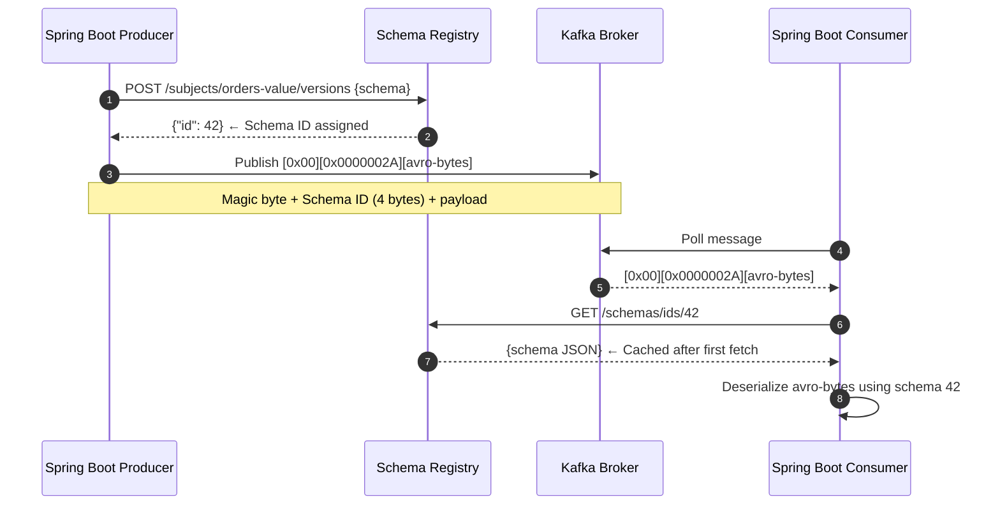

# Schema Registry

**Schema Registry** is a centralized repository for managing, versioning, and validating schemas for Kafka messages. It ensures producers and consumers agree on the data contract, preventing silent data corruption and pipeline failures when schemas evolve.

---

## The Problem Without Schema Registry

In a Kafka-based system without schema governance, schema drift is invisible until it breaks production:

```
Day 1:  Producer sends {"orderId": "123", "amount": 99.99}
        Consumer parses fine.

Day 30: Engineer renames field: {"orderIdentifier": "123", "amount": 99.99}
        Producer deploys. Consumers crash with NullPointerException or DeserializationException.
        No warning. No gate. No versioning.

Day 31: Post-mortem: "We need a schema registry."
```

With Schema Registry:
```
Day 30: Engineer submits new schema to registry.
        Registry checks: BACKWARD compatibility FAILS — renamed field breaks existing consumers.
        Deployment blocked at CI/CD gate.
        No production impact.
```

---

## Architecture Internals

### How Producer and Consumer Use the Registry



The **Schema ID (4 bytes)** is the entire coordination mechanism. The full schema is never embedded in the message — only its registry-assigned integer ID. This keeps messages compact regardless of schema complexity.

Schema IDs are globally unique within a Schema Registry instance. Schema ID `42` always refers to the same schema, forever. IDs are never reused.

### The Wire Format

```
┌────────────┬──────────────────────┬────────────────────────────────┐
│  Byte 0    │  Bytes 1–4           │  Bytes 5+                      │
│  0x00      │  Schema ID (int32)   │  Avro/Protobuf/JSON payload    │
│ Magic byte │  Big-endian          │  Binary encoded                │
└────────────┴──────────────────────┴────────────────────────────────┘
```

The magic byte `0x00` distinguishes Schema Registry messages from raw bytes. Any consumer receiving a message without this magic byte will throw a `SerializationException` immediately.

### Schema Registry Internal Storage

Confluent Schema Registry stores all schemas in a Kafka topic:

```
Topic: _schemas (single partition, compacted)
  Key:   {"subject":"orders-value","version":1,"magic":1}
  Value: {"schema":"{\"type\":\"record\",...}","id":42,"deleted":false}
```

The Registry is itself a stateful Kafka consumer — it rebuilds its in-memory cache by replaying `_schemas` on startup. This means:
- Schema Registry is **highly available** when multiple instances are running (all share the same `_schemas` topic)
- Losing the `_schemas` topic = losing all schemas. **Back it up.**

---

## Subject Naming Strategies

A **subject** is the namespace under which a schema is registered. The naming strategy determines how subjects are constructed, which directly controls schema enforcement scope.

### TopicNameStrategy (default)

```
Subject = <topic-name>-key   or   <topic-name>-value

Example:
  Topic: orders
  Key subject:   orders-key
  Value subject: orders-value
```

**Implication:** All messages on the `orders` topic must share one key schema and one value schema. Different event types on the same topic (e.g., `OrderCreated`, `OrderCancelled`) must use a union type — or separate topics.

### RecordNameStrategy

```
Subject = <fully-qualified-record-name>

Example:
  Record: com.example.events.OrderCreated
  Subject: com.example.events.OrderCreated
```

**Implication:** The same schema can be used across multiple topics. A schema change anywhere it is used is governed by the same subject. Good for shared event libraries.

### TopicRecordNameStrategy

```
Subject = <topic-name>-<fully-qualified-record-name>

Example:
  Topic: orders, Record: com.example.events.OrderCreated
  Subject: orders-com.example.events.OrderCreated
```

**Implication:** Each (topic, record-type) pair has its own schema evolution history. Best for topics carrying multiple event types (event envelopes).

### Configuring Subject Strategy in Spring Boot

```java
@Bean
public ProducerFactory<String, SpecificRecord> avroProducerFactory() {
    Map<String, Object> props = new HashMap<>();
    props.put(ProducerConfig.BOOTSTRAP_SERVERS_CONFIG, "kafka:9092");
    props.put(ProducerConfig.KEY_SERIALIZER_CLASS_CONFIG, StringSerializer.class);
    props.put(ProducerConfig.VALUE_SERIALIZER_CLASS_CONFIG, KafkaAvroSerializer.class);
    props.put(KafkaAvroSerializerConfig.SCHEMA_REGISTRY_URL_CONFIG, "http://schema-registry:8081");

    // Change subject naming strategy (default: TopicNameStrategy)
    props.put(KafkaAvroSerializerConfig.VALUE_SUBJECT_NAME_STRATEGY,
        TopicRecordNameStrategy.class.getName());

    props.put(ProducerConfig.ACKS_CONFIG, "all");
    props.put(ProducerConfig.ENABLE_IDEMPOTENCE_CONFIG, true);
    return new DefaultKafkaProducerFactory<>(props);
}
```

---

## Avro Schema Design

### Schema File (`src/main/avro/OrderEvent.avsc`)

Avro schemas are written in JSON. The Maven/Gradle plugin generates Java classes at build time.

```json
{
  "type": "record",
  "name": "OrderEvent",
  "namespace": "com.example.kafka.avro",
  "doc": "Represents a customer order placed in the system",
  "fields": [
    {
      "name": "orderId",
      "type": "string",
      "doc": "UUID of the order"
    },
    {
      "name": "userId",
      "type": "string"
    },
    {
      "name": "amount",
      "type": {
        "type": "bytes",
        "logicalType": "decimal",
        "precision": 19,
        "scale": 4
      },
      "doc": "Use decimal logical type for money — never double"
    },
    {
      "name": "currency",
      "type": {"type": "enum", "name": "Currency", "symbols": ["AUD", "USD", "EUR", "SGD"]},
      "default": "AUD"
    },
    {
      "name": "status",
      "type": {
        "type": "enum",
        "name": "OrderStatus",
        "symbols": ["PENDING", "CONFIRMED", "SHIPPED", "CANCELLED"]
      }
    },
    {
      "name": "createdAt",
      "type": {"type": "long", "logicalType": "timestamp-millis"},
      "doc": "Epoch milliseconds UTC"
    },
    {
      "name": "metadata",
      "type": {
        "type": "map",
        "values": "string"
      },
      "default": {},
      "doc": "Extensible key-value metadata without schema changes"
    },
    {
      "name": "lineItems",
      "type": {
        "type": "array",
        "items": {
          "type": "record",
          "name": "LineItem",
          "fields": [
            {"name": "productId", "type": "string"},
            {"name": "quantity",  "type": "int"},
            {"name": "unitPrice", "type": {"type": "bytes", "logicalType": "decimal", "precision": 19, "scale": 4}}
          ]
        }
      },
      "default": []
    },
    {
      "name": "notes",
      "type": ["null", "string"],
      "default": null,
      "doc": "Always union with null for optional fields. null MUST be first for default=null."
    }
  ]
}
```

:::warning[Common Avro Pitfalls]
- **Never use `double` for money** — floating-point precision errors. Use `bytes` with `logicalType: decimal`.
- **Optional fields** must be `["null", "string"]` union with `null` first and `"default": null`. If `null` is not first in the union, `"default": null` is invalid Avro.
- **Enum evolution** — adding a new enum symbol is backward-compatible. Removing one is not. Always add an `UNKNOWN` catch-all symbol for future safety.
:::

### Maven Avro Plugin (Code Generation)

```xml
<!-- pom.xml -->
<dependency>
    <groupId>org.apache.avro</groupId>
    <artifactId>avro</artifactId>
    <version>1.11.3</version>
</dependency>
<dependency>
    <groupId>io.confluent</groupId>
    <artifactId>kafka-avro-serializer</artifactId>
    <version>7.6.0</version>
</dependency>

<build>
    <plugins>
        <plugin>
            <groupId>org.apache.avro</groupId>
            <artifactId>avro-maven-plugin</artifactId>
            <version>1.11.3</version>
            <executions>
                <execution>
                    <phase>generate-sources</phase>
                    <goals>
                        <goal>schema</goal>
                    </goals>
                    <configuration>
                        <!-- Source .avsc files -->
                        <sourceDirectory>${project.basedir}/src/main/avro</sourceDirectory>
                        <!-- Generated Java classes -->
                        <outputDirectory>${project.build.directory}/generated-sources/avro</outputDirectory>
                        <!-- Use Java strings instead of Avro's Utf8 type -->
                        <stringType>String</stringType>
                        <!-- Generate builder pattern for immutable construction -->
                        <createSetters>false</createSetters>
                        <enableDecimalLogicalType>true</enableDecimalLogicalType>
                    </configuration>
                </execution>
            </executions>
        </plugin>
    </plugins>
</build>

<!-- Confluent Maven repo (required for kafka-avro-serializer) -->
<repositories>
    <repository>
        <id>confluent</id>
        <url>https://packages.confluent.io/maven/</url>
    </repository>
</repositories>
```

After `mvn generate-sources`, the plugin generates:

```java
// target/generated-sources/avro/com/example/kafka/avro/OrderEvent.java
// (Do not edit — regenerated on every build)
public class OrderEvent extends SpecificRecordBase implements SpecificRecord {
    public static final Schema SCHEMA$ = new Schema.Parser().parse("{...}");

    private String orderId;
    private String userId;
    private ByteBuffer amount;     // decimal logical type
    private Currency currency;     // generated enum
    private OrderStatus status;    // generated enum
    private Long createdAt;
    private Map<String, String> metadata;
    private List<LineItem> lineItems;
    private String notes;

    // Builder pattern (createSetters=false enforces immutable construction)
    public static Builder newBuilder() { return new Builder(); }
    public static class Builder extends SpecificRecordBuilderBase<OrderEvent, Builder> {
        // ...generated builder methods
    }
}
```

---

## Full Spring Boot Producer and Consumer Configuration

### `application.yml`

```yaml
spring:
  kafka:
    bootstrap-servers: kafka-1:9092,kafka-2:9092,kafka-3:9092
    properties:
      schema.registry.url: http://schema-registry:8081
      # Cache schemas locally — avoids registry lookup on every message
      schema.registry.cache.capacity: 1000
      # Authentication if Schema Registry is secured
      # basic.auth.credentials.source: USER_INFO
      # basic.auth.user.info: "api-key:api-secret"

    producer:
      key-serializer: org.apache.kafka.common.serialization.StringSerializer
      value-serializer: io.confluent.kafka.serializers.KafkaAvroSerializer
      acks: all
      enable-idempotence: true
      properties:
        auto.register.schemas: false        # CRITICAL in production — never auto-register
        use.latest.version: false           # Always use the schema the code was compiled against
        value.subject.name.strategy: io.confluent.kafka.serializers.subject.TopicRecordNameStrategy

    consumer:
      key-deserializer: org.apache.kafka.common.serialization.StringDeserializer
      value-deserializer: io.confluent.kafka.serializers.KafkaAvroDeserializer
      group-id: order-service
      auto-offset-reset: earliest
      enable-auto-commit: false
      properties:
        specific.avro.reader: true          # Return generated Java class, not GenericRecord
        value.subject.name.strategy: io.confluent.kafka.serializers.subject.TopicRecordNameStrategy
```

:::warning[`auto.register.schemas: false` is Critical in Production]
With `auto.register.schemas: true` (the default), the producer registers any schema it sees — including accidental breaking changes — straight to the registry. This bypasses all compatibility checks. Always set `false` in staging and production. Register schemas explicitly via CI/CD (see §CI/CD Integration).
:::

### Producer Service

```java
@Service
@Slf4j
public class OrderEventProducer {

    private final KafkaTemplate<String, OrderEvent> kafkaTemplate;

    private static final String TOPIC = "orders";

    public CompletableFuture<SendResult<String, OrderEvent>> publishOrderEvent(
            Order order, String traceId) {

        OrderEvent event = OrderEvent.newBuilder()
            .setOrderId(order.getId().toString())
            .setUserId(order.getUserId().toString())
            .setAmount(order.getAmount().unscaledValue().toByteArray())  // decimal → bytes
            .setCurrency(Currency.valueOf(order.getCurrency()))
            .setStatus(OrderStatus.PENDING)
            .setCreatedAt(Instant.now().toEpochMilli())
            .setMetadata(Map.of("traceId", traceId, "source", "order-api"))
            .setLineItems(toAvroLineItems(order.getLineItems()))
            .setNotes(order.getNotes())  // null-safe — optional field
            .build();

        ProducerRecord<String, OrderEvent> record = new ProducerRecord<>(
            TOPIC,
            null,                  // partition: null = let partitioner decide
            order.getId().toString(),  // key: used for partitioning and KEY ordering
            event,
            buildHeaders(traceId)  // propagate trace headers
        );

        return kafkaTemplate.send(record)
            .whenComplete((result, ex) -> {
                if (ex != null) {
                    log.error("Failed to publish OrderEvent. orderId={} traceId={}",
                        order.getId(), traceId, ex);
                } else {
                    log.info("Published OrderEvent. orderId={} partition={} offset={} schemaId={}",
                        order.getId(),
                        result.getRecordMetadata().partition(),
                        result.getRecordMetadata().offset(),
                        // Schema ID is embedded in the serialized bytes:
                        ByteBuffer.wrap(result.getProducerRecord().value().toByteBuffer().array(), 1, 4).getInt()
                    );
                }
            });
    }

    private Headers buildHeaders(String traceId) {
        RecordHeaders headers = new RecordHeaders();
        headers.add("X-Trace-Id", traceId.getBytes(StandardCharsets.UTF_8));
        return headers;
    }

    private List<LineItem> toAvroLineItems(List<com.example.domain.LineItem> items) {
        return items.stream()
            .map(item -> LineItem.newBuilder()
                .setProductId(item.getProductId())
                .setQuantity(item.getQuantity())
                .setUnitPrice(item.getUnitPrice().unscaledValue().toByteArray())
                .build())
            .collect(Collectors.toList());
    }
}
```

### Consumer Service

```java
@Service
@Slf4j
public class OrderEventConsumer {

    private final OrderProcessingService orderService;
    private final MeterRegistry meterRegistry;

    @KafkaListener(
        topics = "orders",
        groupId = "order-service",
        containerFactory = "avroKafkaListenerContainerFactory"
    )
    public void consume(
            @Payload OrderEvent event,
            @Header(KafkaHeaders.RECEIVED_PARTITION) int partition,
            @Header(KafkaHeaders.OFFSET) long offset,
            @Header(value = "X-Trace-Id", required = false) byte[] traceIdBytes,
            Acknowledgment ack) {

        String traceId = traceIdBytes != null
            ? new String(traceIdBytes, StandardCharsets.UTF_8) : "unknown";

        MDC.put("traceId", traceId);
        MDC.put("orderId", event.getOrderId());

        Timer.Sample sample = Timer.start(meterRegistry);
        try {
            log.info("Consuming OrderEvent. orderId={} partition={} offset={}",
                event.getOrderId(), partition, offset);

            // Convert Avro → domain model before passing to business logic
            Order order = toDomainOrder(event);
            orderService.process(order);

            ack.acknowledge();
            sample.stop(meterRegistry.timer("kafka.consumer.order",
                Tags.of("status", "success")));

        } catch (NonRetryableException e) {
            // Business rule violation — do not retry, ack and route to DLQ
            log.error("Non-retryable error processing order. orderId={}", event.getOrderId(), e);
            ack.acknowledge();  // Ack to prevent redelivery
            routeToDlq(event, e);
            sample.stop(meterRegistry.timer("kafka.consumer.order", Tags.of("status", "dlq")));
        } catch (Exception e) {
            log.error("Retryable error processing order. orderId={}", event.getOrderId(), e);
            // Do NOT ack — Spring Kafka error handler will retry
            sample.stop(meterRegistry.timer("kafka.consumer.order", Tags.of("status", "error")));
            throw e;
        } finally {
            MDC.clear();
        }
    }

    private Order toDomainOrder(OrderEvent event) {
        // Convert Avro decimal bytes → BigDecimal
        BigDecimal amount = new BigDecimal(
            new BigInteger(event.getAmount().array()),
            4  // scale from schema
        );
        return Order.builder()
            .id(UUID.fromString(event.getOrderId()))
            .userId(UUID.fromString(event.getUserId()))
            .amount(amount)
            .currency(event.getCurrency().toString())
            .status(event.getStatus().toString())
            .createdAt(Instant.ofEpochMilli(event.getCreatedAt()))
            .notes(event.getNotes())   // nullable — already Optional in Avro
            .build();
    }
}
```

### Error Handler Configuration for Schema Failures

```java
@Configuration
public class KafkaAvroConsumerConfig {

    @Bean
    public ConcurrentKafkaListenerContainerFactory<String, SpecificRecord>
            avroKafkaListenerContainerFactory(
                ConsumerFactory<String, SpecificRecord> consumerFactory,
                KafkaTemplate<String, SpecificRecord> dlqTemplate) {

        var factory = new ConcurrentKafkaListenerContainerFactory<String, SpecificRecord>();
        factory.setConsumerFactory(consumerFactory);
        factory.getContainerProperties().setAckMode(ContainerProperties.AckMode.MANUAL_IMMEDIATE);

        // Dead letter publisher for unrecoverable failures (including schema errors)
        var dlqRecoverer = new DeadLetterPublishingRecoverer(
            dlqTemplate,
            (record, ex) -> {
                // Route schema errors to a dedicated schema-error DLQ
                if (ex.getCause() instanceof SerializationException) {
                    return new TopicPartition("orders.DLT.schema-error", record.partition());
                }
                return new TopicPartition("orders.DLT", record.partition());
            }
        );

        // Retry 3 times with exponential backoff before sending to DLQ
        var errorHandler = new DefaultErrorHandler(
            dlqRecoverer,
            new ExponentialBackOffWithMaxRetries(3)
        );

        // Do NOT retry on schema/deserialization errors — they will never resolve without a fix
        errorHandler.addNotRetryableExceptions(
            SerializationException.class,
            DeserializationException.class
        );

        factory.setCommonErrorHandler(errorHandler);
        return factory;
    }
}
```

---

## Schema Compatibility Modes — Deep Dive

### How the Registry Enforces Compatibility

When a new schema version is submitted, the registry runs a compatibility check against the subject's configured mode. The check is performed **server-side** — the producer never validates locally.

```
POST /subjects/orders-value/versions
  Body: {new schema}

Registry logic:
  1. Fetch current registered schema for this subject
  2. Run compatibility algorithm (based on configured mode)
  3. If compatible: assign new schema ID, return {"id": 43}
  4. If incompatible: return 409 Conflict with reason
```

### BACKWARD (default) — Consumers Upgrade First

```
"New schema can read data written with old schema"

Safe changes:
  ✅ Add optional field (with default)
  ✅ Remove a field (consumers reading old data just get default for missing field)
  ✅ Add null to an existing union type
  ✅ Promote type: int → long → float → double (widening)

Breaking changes:
  ❌ Add required field (no default) — old messages missing this field → error
  ❌ Rename a field — old field name disappears
  ❌ Change field type (narrowing: double → int)
  ❌ Remove a field with no default — consumers expecting it crash

Deploy order: Upgrade consumers first, then producers.
Consumers reading V1 messages with V2 schema: safe (defaults applied for new fields).
Consumers reading V2 messages with V1 schema: safe if new fields had defaults.
```

### FORWARD — Producers Upgrade First

```
"Old schema can read data written with new schema"

Safe changes:
  ✅ Add required fields — old consumers ignore unknown fields
  ✅ Delete optional fields — old consumers were providing defaults anyway

Deploy order: Upgrade producers first, then consumers.
Old consumers reading V2 messages: safe (extra fields ignored).
```

### FULL — Both Directions

```
Safe changes only:
  ✅ Add optional field (with default)
  ❌ Add required field
  ❌ Remove any field

Deploy order: Either order works — both producer and consumer can be on different schema versions.
Best choice for services where you cannot control the upgrade order.
```

### TRANSITIVE Variants

The non-transitive modes only check against the **latest version**. Transitive modes check against **all previous versions**.

```
Versions: V1 → V2 → V3

BACKWARD:            V3 must be backward-compatible with V2 only.
BACKWARD_TRANSITIVE: V3 must be backward-compatible with V2 AND V1.

Why TRANSITIVE matters:
  If a consumer is 2 versions behind (still on V1), BACKWARD alone doesn't protect them.
  BACKWARD_TRANSITIVE ensures any consumer on any previous version can still read V3.
```

**Recommendation:** Use `FULL_TRANSITIVE` for critical data pipelines. It's the strictest but safest — any version can read any other version in either direction.

### Setting Compatibility per Subject

```bash
# Set for a specific subject (overrides global default)
curl -X PUT http://schema-registry:8081/config/orders-value \
  -H "Content-Type: application/vnd.schemaregistry.v1+json" \
  -d '{"compatibility": "FULL_TRANSITIVE"}'

# Set global default
curl -X PUT http://schema-registry:8081/config \
  -H "Content-Type: application/vnd.schemaregistry.v1+json" \
  -d '{"compatibility": "BACKWARD"}'
```

---

## Schema Evolution Patterns

### Pattern 1: Adding an Optional Field (Safe — all modes)

```json
// V1
{"name": "orderId", "type": "string"},
{"name": "amount",  "type": "double"}

// V2 — backward-compatible addition
{"name": "orderId",   "type": "string"},
{"name": "amount",    "type": "double"},
{"name": "currency",  "type": ["null", "string"], "default": null},
{"name": "channelId", "type": ["null", "string"], "default": null}
```

Old consumers reading V2 messages: `currency` and `channelId` are ignored.
New consumers reading V1 messages: `currency` and `channelId` default to `null`.

### Pattern 2: Renaming a Field (Breaking — requires migration)

Avro does not support field renaming natively as a compatible change. The correct approach uses **aliases**:

```json
// V1
{"name": "orderId", "type": "string"}

// V2 — rename via alias (backward-compatible under some readers, not all)
{
  "name": "orderIdentifier",
  "type": "string",
  "aliases": ["orderId"]     // Allows readers using V1 schema to map orderId → orderIdentifier
}
```

:::warning[Alias Compatibility]
Aliases enable Avro readers using the OLD schema to read data written with the NEW schema (forward-compatible). But the reverse — old data being read by the new schema — still maps correctly via the alias. This is **schema projection**, not automatic renaming. Not all consumers handle aliases transparently. Test your specific deserializer before relying on this.
:::

### Pattern 3: Evolving an Enum (Safe — add only)

```json
// V1
{"name": "status", "type": {"type": "enum", "name": "OrderStatus",
  "symbols": ["PENDING", "CONFIRMED", "CANCELLED"]}}

// V2 — add new status (backward-compatible if enum has default)
{"name": "status",
  "type": {"type": "enum", "name": "OrderStatus",
    "symbols": ["PENDING", "CONFIRMED", "CANCELLED", "SHIPPED", "RETURNED"],
    "default": "PENDING"   // ← enum-level default for unknown symbols
  },
  "default": "PENDING"     // ← field-level default
}
```

Old consumers receiving a message with `status = "SHIPPED"` will use the enum's `default = "PENDING"` if they don't recognize the symbol.

### Pattern 4: Splitting a Schema (Major redesign)

When a schema needs breaking changes that cannot be made compatible, the correct approach is to **introduce a new topic** rather than break the existing one:

```
orders-v1 topic → Schema: OrderEventV1 (old format)
orders-v2 topic → Schema: OrderEventV2 (new format, breaking changes)

Migration:
  1. Deploy new producer writing to orders-v2
  2. Deploy new consumers reading from orders-v2
  3. Run dual-write period: producer writes to both orders-v1 and orders-v2
  4. Migrate all consumers to orders-v2
  5. Stop writing to orders-v1
  6. Drain and delete orders-v1 after retention period
```

---

## Topic Reset with Schema Changes

This is one of the most operationally dangerous procedures in Kafka. A topic reset combined with a schema change can result in consumers attempting to deserialize new-format messages with old schemas.

### Scenario 1: Reset Topic, Schema UNCHANGED

The safest case. Old messages are gone; new messages use the same schema.

```bash
# 1. Stop all consumers
# 2. Delete and recreate the topic
kafka-topics.sh --bootstrap-server kafka:9092 --delete --topic orders
kafka-topics.sh --bootstrap-server kafka:9092 --create --topic orders \
  --partitions 12 --replication-factor 3

# 3. Schema in registry is UNCHANGED — no action needed
# 4. Restart consumers with auto.offset.reset=earliest
# 5. Start producers
```

### Scenario 2: Reset Topic + Breaking Schema Change (NONE compatibility required)

The most dangerous pattern. Only safe if ALL consumers are simultaneously upgraded.

```bash
# 1. Stop ALL producers and consumers

# 2. Temporarily set compatibility to NONE for this subject
curl -X PUT http://schema-registry:8081/config/orders-value \
  -H "Content-Type: application/vnd.schemaregistry.v1+json" \
  -d '{"compatibility": "NONE"}'

# 3. Register the new (breaking) schema
curl -X POST http://schema-registry:8081/subjects/orders-value/versions \
  -H "Content-Type: application/vnd.schemaregistry.v1+json" \
  -d "{\"schema\": $(cat new-order-schema.avsc | jq -Rs .)}"

# 4. Note the new schema ID returned — producers must use this version
NEW_SCHEMA_ID=$(curl -s http://schema-registry:8081/subjects/orders-value/versions/latest \
  | jq '.id')
echo "New schema ID: ${NEW_SCHEMA_ID}"

# 5. Delete and recreate topic
kafka-topics.sh --bootstrap-server kafka:9092 --delete --topic orders
kafka-topics.sh --bootstrap-server kafka:9092 --create --topic orders \
  --partitions 12 --replication-factor 3

# 6. SOFT DELETE old schema versions (marks as deleted but retains ID)
# This prevents consumers on old schema IDs from resolving them
curl -X DELETE http://schema-registry:8081/subjects/orders-value/versions/1
curl -X DELETE http://schema-registry:8081/subjects/orders-value/versions/2
# ... delete all old versions

# 7. Restore compatibility mode
curl -X PUT http://schema-registry:8081/config/orders-value \
  -H "Content-Type: application/vnd.schemaregistry.v1+json" \
  -d '{"compatibility": "BACKWARD"}'

# 8. Deploy new consumers (compiled against new schema)
# 9. Deploy new producers
```

### Scenario 3: Soft Delete vs. Hard Delete

Schema Registry supports two deletion modes:

```bash
# SOFT DELETE — marks schema as deleted in registry but ID still exists
# Consumers with old schema ID cached can still deserialize existing messages
curl -X DELETE http://schema-registry:8081/subjects/orders-value/versions/1

# HARD DELETE — permanently removes the schema ID from the registry
# Any consumer trying to look up this schema ID will get 404 → DeserializationException
# DANGEROUS: Only use if you are 100% certain no messages with this schema ID remain in any topic
curl -X DELETE http://schema-registry:8081/subjects/orders-value/versions/1?permanent=true

# Hard delete all versions of a subject (nuclear option)
curl -X DELETE "http://schema-registry:8081/subjects/orders-value?permanent=true"
```

:::danger[Hard Delete is Irreversible]
Hard-deleting a schema that is still referenced by messages in a Kafka topic causes permanent deserialization failures for those messages. Any consumer that encounters those messages will fail. Only hard-delete schemas after you have confirmed all messages referencing that schema ID have been either consumed and processed, or the topic has been deleted and recreated.
:::

### Scenario 4: Consumer Group Offset Reset

When replaying a topic from scratch after a schema change, consumers must reset their offsets:

```bash
# Reset a consumer group to earliest (reprocess all messages)
kafka-consumer-groups.sh --bootstrap-server kafka:9092 \
  --group order-service \
  --topic orders \
  --reset-offsets \
  --to-earliest \
  --execute

# Reset to a specific timestamp (reprocess from a point in time)
kafka-consumer-groups.sh --bootstrap-server kafka:9092 \
  --group order-service \
  --topic orders \
  --reset-offsets \
  --to-datetime "2025-01-01T00:00:00.000" \
  --execute

# Reset to a specific offset per partition
kafka-consumer-groups.sh --bootstrap-server kafka:9092 \
  --group order-service \
  --topic orders \
  --reset-offsets \
  --to-offset 5000 \
  --execute
```

```java
// Programmatic offset reset in Spring Boot (useful for automated replay procedures)
@Service
@Slf4j
public class ConsumerGroupResetService {

    private final KafkaAdmin kafkaAdmin;

    public void resetConsumerGroupToEarliest(String groupId, String topic) throws Exception {
        try (AdminClient adminClient = AdminClient.create(kafkaAdmin.getConfigurationProperties())) {
            // 1. Get all partitions for the topic
            DescribeTopicsResult topicDesc = adminClient.describeTopics(List.of(topic));
            Map<String, TopicDescription> descriptions = topicDesc.allTopicNames().get();
            List<TopicPartition> partitions = descriptions.get(topic).partitions().stream()
                .map(p -> new TopicPartition(topic, p.partition()))
                .collect(Collectors.toList());

            // 2. Fetch earliest offset for each partition
            ListOffsetsResult earliestOffsets = adminClient.listOffsets(
                partitions.stream().collect(Collectors.toMap(
                    Function.identity(),
                    p -> OffsetSpec.earliest()
                ))
            );
            Map<TopicPartition, ListOffsetsResult.ListOffsetsResultInfo> offsets =
                earliestOffsets.all().get();

            // 3. Build offset map
            Map<TopicPartition, OffsetAndMetadata> resetMap = offsets.entrySet().stream()
                .collect(Collectors.toMap(
                    Map.Entry::getKey,
                    e -> new OffsetAndMetadata(e.getValue().offset())
                ));

            // 4. Apply reset (consumer group must be inactive)
            adminClient.alterConsumerGroupOffsets(groupId, resetMap).all().get();

            log.info("Reset consumer group {} on topic {} to earliest offsets", groupId, topic);
        }
    }
}
```

---

## CI/CD Schema Registration

In production, schemas must be registered through a pipeline — never by the application at runtime (`auto.register.schemas=false`). This enforces review and compatibility checks before any schema reaches the cluster.

### Maven Plugin for Schema Registration

```xml
<!-- Register schemas as part of CI/CD -->
<plugin>
    <groupId>io.confluent</groupId>
    <artifactId>kafka-schema-registry-maven-plugin</artifactId>
    <version>7.6.0</version>
    <configuration>
        <schemaRegistryUrls>
            <param>http://schema-registry:8081</param>
        </schemaRegistryUrls>
        <subjects>
            <orders-value>src/main/avro/OrderEvent.avsc</orders-value>
            <orders-key>src/main/avro/OrderKey.avsc</orders-key>
        </subjects>
        <!-- Fail the build if schema is incompatible -->
        <compatibilityLevels>
            <orders-value>FULL_TRANSITIVE</orders-value>
        </compatibilityLevels>
    </configuration>
    <executions>
        <!-- Test compatibility without registering (CI check) -->
        <execution>
            <id>test-compatibility</id>
            <phase>verify</phase>
            <goals>
                <goal>test-compatibility</goal>
            </goals>
        </execution>
        <!-- Register schema (CD — only on main branch deploy) -->
        <execution>
            <id>register-schemas</id>
            <phase>deploy</phase>
            <goals>
                <goal>register</goal>
            </goals>
        </execution>
    </executions>
</plugin>
```

### GitHub Actions Pipeline

```yaml
# .github/workflows/schema-check.yml
name: Schema Compatibility Check

on:
  pull_request:
    paths:
      - 'src/main/avro/**'   # Only run when schema files change

jobs:
  schema-check:
    runs-on: ubuntu-latest
    services:
      zookeeper:
        image: confluentinc/cp-zookeeper:7.6.0
        env:
          ZOOKEEPER_CLIENT_PORT: 2181
      kafka:
        image: confluentinc/cp-kafka:7.6.0
        env:
          KAFKA_ZOOKEEPER_CONNECT: zookeeper:2181
          KAFKA_ADVERTISED_LISTENERS: PLAINTEXT://kafka:9092
      schema-registry:
        image: confluentinc/cp-schema-registry:7.6.0
        env:
          SCHEMA_REGISTRY_KAFKASTORE_BOOTSTRAP_SERVERS: kafka:9092
          SCHEMA_REGISTRY_HOST_NAME: schema-registry
        ports:
          - 8081:8081

    steps:
      - uses: actions/checkout@v4

      - name: Set up JDK 21
        uses: actions/setup-java@v4
        with:
          java-version: '21'
          distribution: 'temurin'

      - name: Wait for Schema Registry
        run: |
          until curl -sf http://localhost:8081/subjects; do sleep 2; done

      - name: Test Schema Compatibility
        run: mvn kafka-schema-registry:test-compatibility -Dschema.registry.url=http://localhost:8081

      - name: Validate Avro Schema Syntax
        run: mvn generate-sources   # Will fail if .avsc files have syntax errors
```

---

## REST API Reference

```bash
# ─── Subject & Schema Operations ─────────────────────────────────────────────

# List all subjects
curl http://schema-registry:8081/subjects

# Register new schema version
curl -X POST http://schema-registry:8081/subjects/orders-value/versions \
  -H "Content-Type: application/vnd.schemaregistry.v1+json" \
  -d "{\"schema\": $(cat OrderEvent.avsc | jq -Rs .)}"

# Get all versions of a subject
curl http://schema-registry:8081/subjects/orders-value/versions

# Get specific version
curl http://schema-registry:8081/subjects/orders-value/versions/2

# Get latest version
curl http://schema-registry:8081/subjects/orders-value/versions/latest

# Fetch schema by global ID (what consumers use during deserialization)
curl http://schema-registry:8081/schemas/ids/42

# Check if a schema already exists under a subject (returns version + ID if found)
curl -X POST http://schema-registry:8081/subjects/orders-value \
  -H "Content-Type: application/vnd.schemaregistry.v1+json" \
  -d "{\"schema\": $(cat OrderEvent.avsc | jq -Rs .)}"

# ─── Compatibility ────────────────────────────────────────────────────────────

# Test compatibility against latest version (does NOT register)
curl -X POST http://schema-registry:8081/compatibility/subjects/orders-value/versions/latest \
  -H "Content-Type: application/vnd.schemaregistry.v1+json" \
  -d "{\"schema\": $(cat NewOrderEvent.avsc | jq -Rs .)}"

# Test against a specific version
curl -X POST http://schema-registry:8081/compatibility/subjects/orders-value/versions/3 \
  -H "Content-Type: application/vnd.schemaregistry.v1+json" \
  -d "{\"schema\": $(cat NewOrderEvent.avsc | jq -Rs .)}"

# ─── Configuration ────────────────────────────────────────────────────────────

# Get global compatibility setting
curl http://schema-registry:8081/config

# Set global compatibility
curl -X PUT http://schema-registry:8081/config \
  -H "Content-Type: application/vnd.schemaregistry.v1+json" \
  -d '{"compatibility": "FULL_TRANSITIVE"}'

# Set per-subject compatibility (overrides global)
curl -X PUT http://schema-registry:8081/config/orders-value \
  -H "Content-Type: application/vnd.schemaregistry.v1+json" \
  -d '{"compatibility": "BACKWARD"}'

# ─── Deletion ─────────────────────────────────────────────────────────────────

# Soft delete a version
curl -X DELETE http://schema-registry:8081/subjects/orders-value/versions/1

# Hard delete a version (permanent — irreversible)
curl -X DELETE "http://schema-registry:8081/subjects/orders-value/versions/1?permanent=true"

# Soft delete all versions of a subject
curl -X DELETE http://schema-registry:8081/subjects/orders-value

# Hard delete entire subject (permanent)
curl -X DELETE "http://schema-registry:8081/subjects/orders-value?permanent=true"
```

---

## Observability

```java
@Component
@Slf4j
public class SchemaRegistryHealthMonitor {

    private final RestClient schemaRegistryClient;
    private final MeterRegistry meterRegistry;

    @Scheduled(fixedDelay = 60_000)
    public void checkSchemaRegistryHealth() {
        try {
            // Check registry is reachable and responsive
            String response = schemaRegistryClient.get()
                .uri("/subjects")
                .retrieve()
                .body(String.class);

            meterRegistry.gauge("schema.registry.subjects.count",
                (double) new ObjectMapper().readTree(response).size());
            meterRegistry.counter("schema.registry.health.check", "status", "success")
                .increment();
        } catch (Exception e) {
            log.error("Schema Registry health check failed", e);
            meterRegistry.counter("schema.registry.health.check", "status", "failure")
                .increment();
        }
    }
}
```

```yaml
# Prometheus alerts
groups:
- name: schema-registry
  rules:
  - alert: SchemaRegistryDown
    expr: up{job="schema-registry"} == 0
    for: 1m
    labels:
      severity: critical
    annotations:
      summary: "Schema Registry is down — all Avro producers and consumers will fail"

  - alert: SchemaDeserializationErrors
    expr: rate(kafka_consumer_fetch_manager_records_consumed_total{topic="orders"}[5m]) == 0
      and rate(kafka_consumer_fetch_manager_fetch_total[5m]) > 0
    for: 2m
    labels:
      severity: warning
    annotations:
      summary: "Possible schema deserialization errors — consumer fetching but not processing"
```

---

## Decision Matrix

| Scenario | Recommendation |
|:---|:---|
| New project, greenfield | Avro with `FULL_TRANSITIVE` compatibility; register via CI/CD pipeline |
| Polyglot environment (Java + Python + Go) | Protobuf — better multi-language code generation than Avro |
| Human-readable messages needed | JSON Schema — less compact but debuggable without tooling |
| Adding a new field | Always add as optional (`["null", "type"]`) with `"default": null` |
| Renaming a field | Use `aliases` or introduce a new topic with the new schema |
| Breaking schema change required | New topic name + migration period; never mutate existing topic schemas destructively |
| Topic reset + same schema | Safe — no schema registry changes needed |
| Topic reset + new schema | Set `NONE` compatibility temporarily, delete old versions after draining, restore compatibility |
| `auto.register.schemas` setting | `false` in staging and production; `true` in local dev only |
| Consumer group offset reset | Use `kafka-consumer-groups.sh --reset-offsets` or programmatic `AdminClient` |
| Schema Registry HA | Deploy 3+ instances sharing the same `_schemas` topic; use a load balancer |