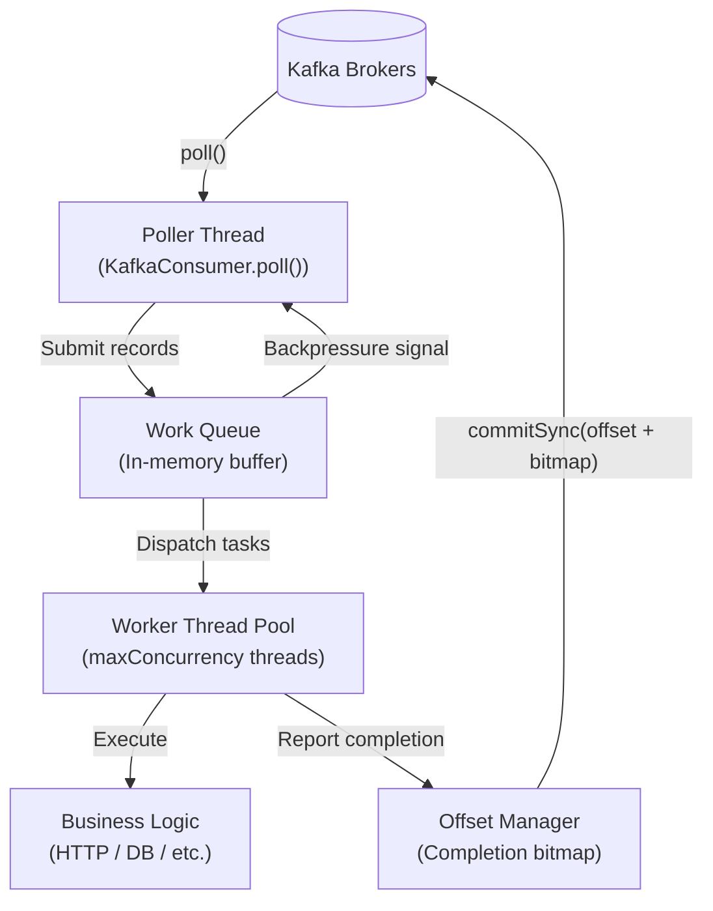

# Parallel Consumer & Alternatives

:::danger[Project No Longer Maintained]
The Confluent Parallel Consumer library (`io.confluent.parallelconsumer`) is **no longer maintained**. Confluent's own documentation now points to [Apache Kafka Share Groups (KIP-932)](https://cwiki.apache.org/confluence/display/KAFKA/KIP-932%3A+Queues+for+Kafka) as the successor for similar functionality. An unofficial fork by one of the original authors is available at [github.com/astubbs/parallel-consumer](https://github.com/astubbs/parallel-consumer) but carries the same risks of an unmaintained dependency.

**For new projects, use one of the alternatives described at the bottom of this document.**

This page retains the library's internals as a reference — the architecture and offset management concepts are valuable regardless of which implementation you choose.
:::

---

## 1. The Scaling Bottleneck of Standard Consumers

### Sequential Partition Processing

In a standard Kafka consumer, a single thread is responsible for polling and processing all records from its assigned partitions **sequentially**:

```
Partition 0: [msg1] ──► process(msg1) ──► [msg2] ──► process(msg2) ──► [msg3]
                           ▲
              (Blocks next poll until completed — I/O wait time wasted)
```

This creates two compounding problems:

**1. Parallelism ceiling = partition count.** The maximum active consumers in a consumer group equals the number of topic partitions. Adding more consumer instances beyond partition count leaves them idle. To increase throughput, you must increase partitions — which has real cost.

**2. I/O blocking kills throughput.** If processing involves a slow external call (REST API, DB write, 3rd-party service), the consumer thread blocks and no other messages in that partition are touched until the call completes.

### The Cost of Over-Partitioning

The naive fix — just add more partitions — has significant downsides:

| Problem | Detail |
|:---|:---|
| **Broker memory and file handles** | Each partition is a directory of segment files; 10,000 partitions = 10,000+ open file descriptors per broker |
| **Metadata propagation latency** | More partitions → larger metadata payloads → slower cluster propagation |
| **Rebalance duration** | Rebalances scale with partition count; 10,000-partition topics can take minutes |
| **Irreversibility** | Kafka has no native mechanism to decrease partition count |
| **End-to-end latency** | More partitions can increase tail latency due to scheduling contention |

The Parallel Consumer solves this by decoupling **thread concurrency from partition count entirely**.

---

## 2. Parallel Consumer Architecture

The library wraps a standard `KafkaConsumer` and adds an asynchronous dispatch layer between polling and processing:



### Key Components

**Poller Thread:** Runs a tight loop calling native `KafkaConsumer.poll()`. It submits records to the work queue immediately and returns — it never executes business logic. Its only job is ingestion rate.

**Work Queue:** An in-memory bounded buffer. When the queue fills to capacity, it signals the poller to pause (backpressure), preventing unbounded memory growth.

**Worker Thread Pool:** A configurable pool of threads executing user-defined processing logic concurrently. Each thread is independent — I/O waits in one thread do not block others.

**Offset Manager:** The most critical component. Because records complete **out of order**, the offset manager tracks which offsets are completed and computes the safe commit point. It uses a **completion bitmap** (see §5) to avoid losing progress on completed records when a gap exists.

---

## 3. Ordering Modes

The library's key design decision is how to balance ordering guarantees against throughput.

```
                    ┌──────────────────────────────────┐
                    │         Ordering Modes           │
                    └────────────────┬─────────────────┘
         ┌──────────────────────────┼──────────────────────────┐
         ▼                          ▼                          ▼
   [ UNORDERED ]                 [ KEY ]               [ PARTITION ]
All records dispatched        Sequential per key,     Sequential per
to pool immediately.          parallel across keys.   partition.
Max throughput.               High throughput.        Matches standard consumer.
```

### UNORDERED

All records are dispatched to the worker pool as soon as a thread is available, with no sequencing constraint whatsoever.

- **Throughput:** Maximum — only limited by `maxConcurrency` and downstream latency
- **Ordering:** None — records from the same partition may complete in any order
- **Use when:** Processing is stateless and idempotent (e.g., enriching events and writing to Elasticsearch, stateless HTTP webhook delivery)

### KEY (Recommended for most use cases)

Records sharing the same Kafka key are processed sequentially in arrival order. Records with different keys are processed concurrently.

**Implementation:** The library maintains an in-memory per-key dispatch queue. When a worker is processing `key=order-123`, all subsequent records for `key=order-123` wait in the per-key queue. Records for `key=order-456` dispatch independently.

- **Throughput:** High — limited only by the number of unique keys in-flight
- **Ordering:** Strict per key, across all partitions the consumer owns
- **Use when:** Entity-based event streams — order state machines, account balance updates, user profile events

### PARTITION

Restricts processing to one record per partition at a time. Semantically equivalent to a standard consumer but with parallel dispatch across different partitions.

- **Throughput:** Low — same ceiling as standard consumer
- **Ordering:** Strict per partition (matches Kafka's native guarantee)
- **Use when:** Migrating legacy systems that assume partition-level ordering; audit log pipelines

### Mode Comparison

| Mode | Ordering Guarantee | Concurrency Ceiling | Throughput | Failure Isolation |
|:---|:---|:---|:---|:---|
| **UNORDERED** | None | `maxConcurrency` | Highest | Per-record |
| **KEY** | Strict per key | Unique keys in-flight | High | Per-key sequence |
| **PARTITION** | Strict per partition | Partition count | Low | Per-partition |

---

## 4. Setup (Legacy Reference)

:::warning[Unmaintained Dependency]
This is provided as a reference for systems already using the library. Do not add this to new projects.
:::

```xml
<!-- pom.xml — Last stable version -->
<dependency>
    <groupId>io.confluent.parallelconsumer</groupId>
    <artifactId>parallel-consumer-core</artifactId>
    <version>0.5.3.3</version>
</dependency>
```

```java
@Service
@Slf4j
public class OrderParallelConsumer implements InitializingBean, DisposableBean {

    private ParallelStreamProcessor<String, OrderEvent> processor;
    private final OrderProcessingService orderService;
    private final MeterRegistry meterRegistry;

    @Override
    public void afterPropertiesSet() {
        KafkaConsumer<String, OrderEvent> consumer = buildNativeConsumer();

        ParallelConsumerOptions<String, OrderEvent> options =
            ParallelConsumerOptions.<String, OrderEvent>builder()
                .ordering(ParallelConsumerOptions.ProcessingOrder.KEY)
                .maxConcurrency(150)
                .consumer(consumer)
                // Backpressure: pause polling when queue exceeds 50MB
                .maximumSizeBytes(50 * 1024 * 1024L)
                // Task timeout: fail tasks that hang beyond 30s
                .timeouts(new TaskTimeouts(Duration.ofSeconds(30)))
                .build();

        processor = ParallelStreamProcessor.createEosStreamProcessor(options);
        processor.subscribe(List.of("order-events"));

        processor.poll(context -> {
            ConsumerRecord<String, OrderEvent> record = context.getSingleConsumerRecord();
            String dedupKey = buildDedupKey(record);

            Timer.Sample sample = Timer.start(meterRegistry);
            try {
                orderService.process(record.key(), record.value(), dedupKey);
                sample.stop(meterRegistry.timer("order.processing.success",
                    "partition", String.valueOf(record.partition())));
            } catch (Exception e) {
                log.error("Processing failed. key={} offset={} partition={}",
                    record.key(), record.offset(), record.partition(), e);
                sample.stop(meterRegistry.timer("order.processing.failure"));
                throw e;   // Re-throw → library applies retry policy
            }
        });
    }

    private String buildDedupKey(ConsumerRecord<?, ?> r) {
        // Use topic+partition+offset as a globally unique record identifier
        return String.format("%s:%d:%d", r.topic(), r.partition(), r.offset());
    }

    private KafkaConsumer<String, OrderEvent> buildNativeConsumer() {
        Map<String, Object> props = new HashMap<>();
        props.put(ConsumerConfig.BOOTSTRAP_SERVERS_CONFIG, "kafka:9092");
        props.put(ConsumerConfig.GROUP_ID_CONFIG, "order-parallel-processor");
        props.put(ConsumerConfig.ENABLE_AUTO_COMMIT_CONFIG, false); // MANDATORY
        props.put(ConsumerConfig.AUTO_OFFSET_RESET_CONFIG, "earliest");
        props.put(ConsumerConfig.KEY_DESERIALIZER_CLASS_CONFIG, StringDeserializer.class);
        props.put(ConsumerConfig.VALUE_DESERIALIZER_CLASS_CONFIG, JsonDeserializer.class);
        props.put(JsonDeserializer.VALUE_DEFAULT_TYPE, OrderEvent.class.getName());
        return new KafkaConsumer<>(props);
    }

    @Override
    public void destroy() {
        if (processor != null) {
            // Drain in-flight work before shutdown — prevents in-progress records from being re-delivered
            processor.closeDrainFirst(Duration.ofSeconds(30));
        }
    }
}
```

---

## 5. Offset Management: Completion Bitmaps

This is the library's most technically sophisticated component — and the hardest to replicate correctly in a DIY approach.

### The Contiguous Offset Problem

Kafka's offset commit model is monotonic: committing offset `N` implicitly declares that all records up to `N-1` have been processed. In a parallel execution model, records complete out of order:

```
Parallel execution timeline:

Thread 1: [offset 100: ████████████████ DONE]
Thread 2: [offset 101: ████████████████████████████ IN FLIGHT...]
Thread 3: [offset 102: ████████ DONE]
Thread 4: [offset 103: ██████████ DONE]

Safe commit point: offset 100 only.
102 and 103 are done but CANNOT be committed because 101 is still in-flight.

If consumer restarts here:
  Without bitmaps: re-process 101, 102, 103 (102 and 103 are duplicates)
  With bitmaps:    re-process 101 only (102 and 103 are marked in the bitmap)
```

### Bitmap Serialization

The Parallel Consumer serializes out-of-order completions into a compressed bitmap stored in the `metadata` field of the Kafka offset commit:

```
Committed to __consumer_offsets:
  partition: 0
  offset: 100           ← highest contiguous completed offset
  metadata: [bitmap]    ← encodes: 101=pending, 102=done, 103=done

On restart:
  Consumer reads offset=100 + bitmap
  Resumes processing at offset 100+1 = 101
  Skips 102 and 103 (bitmap says DONE)
  Result: exactly-once-like behavior for 102 and 103
```

**Bitmap encoding:** The library uses a compressed run-length encoding. A gap of 10,000 pending records encodes as a few bytes — not proportional to the gap size. The metadata field has a practical limit of ~1MB, which is sufficient for very large in-flight windows.

### The Hung-Task Problem

A single hung task at offset `X` freezes all offset commits for that partition:

```
offset X: IN FLIGHT (hung at 30s, 60s, 90s...)
offset X+1 to X+10000: ALL COMPLETED

Committed offset: X-1
Kafka lag metric: 10,001 ← misleading — most records are already done
```

**Mitigation:** Configure task timeouts. The library will interrupt and fail hung tasks after the configured threshold, allowing offset progress to resume:

```java
ParallelConsumerOptions.builder()
    .timeouts(new TaskTimeouts(
        Duration.ofSeconds(30),    // Individual task timeout
        Duration.ofSeconds(60)     // Retry timeout (if retry configured)
    ))
    .build();
```

Alert on `pc.partition.incomplete.offsets` metric — a sustained non-zero value on a healthy consumer indicates a hung task, not genuine lag.

---

## 6. Exactly-Once Semantics and Deduplication

### EOS Scope

`createEosStreamProcessor()` wraps Kafka offset commits in a transactional producer. If a task fails, the transaction aborts — no offsets are exposed to downstream read-committed consumers.

**This only protects Kafka → Kafka pipelines.** If your consumer calls an external REST API or writes to a database, EOS does not prevent duplicate side effects on retry.

### External Deduplication Pattern

Use topic+partition+offset as a globally unique record identifier — this is stable across restarts and retries:

```java
@Service
@Transactional
public class IdempotentOrderService {

    private final OrderRepository orderRepo;
    private final ProcessedRecordRepository processedRepo;

    public void process(String key, OrderEvent event, String dedupKey) {
        // Check for prior processing — unique index on dedup_key
        if (processedRepo.existsByDedupKey(dedupKey)) {
            log.info("Duplicate record skipped. dedupKey={}", dedupKey);
            return;
        }

        // Process and record completion atomically in one DB transaction
        Order order = orderRepo.save(Order.from(event));
        processedRepo.save(new ProcessedRecord(dedupKey, order.getId(), Instant.now()));

        log.info("Order processed. orderId={} dedupKey={}", order.getId(), dedupKey);
    }
}
```

```sql
-- Schema for deduplication table
CREATE TABLE processed_records (
    dedup_key    VARCHAR(128) PRIMARY KEY,  -- topic:partition:offset
    order_id     UUID NOT NULL,
    processed_at TIMESTAMPTZ NOT NULL DEFAULT NOW()
);

-- Clean up records older than retention window
CREATE INDEX idx_processed_at ON processed_records (processed_at);
```

For Redis-based deduplication (lower latency, shorter TTL):

```java
public void process(String key, OrderEvent event, String dedupKey) {
    Boolean isNew = redisTemplate.opsForValue()
        .setIfAbsent(dedupKey, "PROCESSING", Duration.ofHours(24));

    if (Boolean.FALSE.equals(isNew)) {
        log.info("Duplicate record. dedupKey={}", dedupKey);
        return;
    }

    try {
        Order order = orderRepo.save(Order.from(event));
        redisTemplate.opsForValue().set(dedupKey, "DONE:" + order.getId(), Duration.ofHours(24));
    } catch (Exception e) {
        redisTemplate.delete(dedupKey);   // Allow retry on failure
        throw e;
    }
}
```

---

## 7. The DIY Anti-Pattern

Engineers sometimes implement their own parallel dispatch inside `@KafkaListener`. This approach has subtle and dangerous failure modes.

```java
// ⚠️ DANGEROUS — do not use in production
@KafkaListener(topics = "orders")
public void listen(ConsumerRecord<String, OrderEvent> record, Acknowledgment ack) {
    CompletableFuture.runAsync(() -> {
        processOrder(record.value());
        ack.acknowledge();   // Commits this offset regardless of what came before
    }, executor);
}
```

**Why this breaks:**

**Problem 1: Commit race conditions.** Spring Kafka's `Acknowledgment.acknowledge()` calls `commitSync()` for the offset of that specific record. If Thread B finishes offset 102 and commits, and Thread A (processing offset 101) then crashes, offset 101 is **permanently lost** — Kafka's broker has already recorded a commit past it.

**Problem 2: No key ordering.** An `ExecutorService` assigns tasks to threads by availability, not by key. Two records for `key=order-123` may run concurrently on Thread 1 and Thread 2, creating a race condition on whatever state is associated with that order.

**Problem 3: No backpressure.** Without a bounded work queue, a slow downstream causes unbounded task accumulation in memory, eventually causing OOM.

The correct alternative is described in §8.

---

## 8. Production Alternatives (Choose These for New Work)

### Option 1: Spring Kafka with Manual Async Dispatch + Key-Based Striping (Java 21+)

The most practical replacement for new Spring Boot 3.2+ projects running Java 21. Dispatch processing to a virtual thread executor after polling, using a striped key lock to preserve per-key ordering.

```java
@Configuration
public class KafkaParallelConsumerConfig {

    @Bean(name = "orderProcessingExecutor")
    public Executor orderProcessingExecutor() {
        // Virtual thread executor — each submitted task gets its own virtual thread
        // Handles thousands of concurrent I/O-bound tasks with minimal overhead
        return Executors.newVirtualThreadPerTaskExecutor();
    }
}
```

```java
@Service
@Slf4j
public class ParallelOrderConsumer {

    private final OrderProcessingService orderService;
    private final Executor executor;

    // Striped locks: per-key serialization with bounded memory (512 stripes)
    // Keys hashing to the same stripe serialize; different stripes run concurrently
    private final Striped<Semaphore> keyLocks = Striped.semaphore(512, 1);

    // Tracks in-flight futures for graceful shutdown drain
    private final Set<CompletableFuture<?>> inFlight =
        Collections.newSetFromMap(new ConcurrentHashMap<>());

    @KafkaListener(
        topics = "order-events",
        groupId = "order-processor",
        concurrency = "6",                         // One listener thread per partition assignment
        containerFactory = "batchListenerFactory"
    )
    public void consume(
        List<ConsumerRecord<String, OrderEvent>> records,
        Acknowledgment ack
    ) {
        // Dispatch each record to virtual thread pool
        // Key-striped semaphore preserves per-key ordering
        List<CompletableFuture<Void>> futures = records.stream()
            .map(record -> dispatchWithKeyOrder(record))
            .collect(Collectors.toList());

        // Wait for all records in this batch to complete before committing offsets
        // This is the safe offset management approach — batch-level atomicity
        CompletableFuture.allOf(futures.toArray(new CompletableFuture[0]))
            .thenRun(ack::acknowledge)
            .exceptionally(ex -> {
                log.error("Batch processing failed — not committing offsets", ex);
                // Do NOT ack — Kafka will re-deliver the batch
                return null;
            })
            .join();
    }

    private CompletableFuture<Void> dispatchWithKeyOrder(ConsumerRecord<String, OrderEvent> record) {
        Semaphore keyLock = keyLocks.get(record.key());
        CompletableFuture<Void> future = CompletableFuture.runAsync(() -> {
            try {
                keyLock.acquire();        // Serialize records with same key (or same hash stripe)
                try {
                    orderService.process(record.key(), record.value(),
                        buildDedupKey(record));
                } finally {
                    keyLock.release();
                }
            } catch (InterruptedException e) {
                Thread.currentThread().interrupt();
                throw new RuntimeException("Interrupted while waiting for key lock", e);
            }
        }, executor);

        inFlight.add(future);
        future.whenComplete((r, ex) -> inFlight.remove(future));
        return future;
    }

    // Drain in-flight tasks on graceful shutdown
    @PreDestroy
    public void drain() throws Exception {
        log.info("Draining {} in-flight tasks...", inFlight.size());
        CompletableFuture.allOf(inFlight.toArray(new CompletableFuture[0]))
            .get(30, TimeUnit.SECONDS);
    }

    private String buildDedupKey(ConsumerRecord<?, ?> r) {
        return r.topic() + ":" + r.partition() + ":" + r.offset();
    }
}
```

```java
@Configuration
public class BatchListenerConfig {

    @Bean("batchListenerFactory")
    public ConcurrentKafkaListenerContainerFactory<String, OrderEvent> batchListenerFactory(
            ConsumerFactory<String, OrderEvent> consumerFactory) {
        var factory = new ConcurrentKafkaListenerContainerFactory<String, OrderEvent>();
        factory.setConsumerFactory(consumerFactory);
        factory.setBatchListener(true);
        factory.getContainerProperties().setAckMode(ContainerProperties.AckMode.MANUAL_IMMEDIATE);
        factory.setCommonErrorHandler(new DefaultErrorHandler(
            new DeadLetterPublishingRecoverer(kafkaTemplate),
            new ExponentialBackOffWithMaxRetries(3)
        ));
        return factory;
    }
}
```

**Virtual thread pinning warning (Spring Kafka):** As of Spring Kafka 3.x, the Kafka consumer polling loop itself uses `synchronized` blocks internally, which can **pin** a virtual thread to its carrier platform thread during the poll call. This means the listener thread should stay on platform threads — only dispatch the *processing work* to virtual threads. The pattern above does exactly this: `@KafkaListener` runs on a platform thread (the container's standard thread pool) and dispatches processing to virtual threads via `executor`.

```yaml
# application.yml — Virtual thread configuration
spring:
  threads:
    virtual:
      enabled: true    # Enables VT for @Async, web request handling
                       # Do NOT rely on this for KafkaListener internals — see above

  kafka:
    listener:
      ack-mode: manual_immediate
      type: batch
    consumer:
      enable-auto-commit: false
      max-poll-records: 500
      max-poll-interval-ms: 300000   # Must exceed worst-case batch processing time
```

### Option 2: Kafka Streams with Parallel Branch Processing

For workloads that already use Kafka Streams topology or need stateful operations (joins, aggregations, windowing), process records in parallel branches after key-based branching:

```java
@Configuration
public class OrderStreamTopology {

    @Bean
    public KStream<String, OrderEvent> orderProcessingStream(StreamsBuilder builder) {
        KStream<String, OrderEvent> stream = builder.stream("order-events",
            Consumed.with(Serdes.String(), orderEventSerde()));

        // Branch by processing type — each branch processes concurrently
        // Records with same key still land in same partition → ordered within branch
        Map<String, KStream<String, OrderEvent>> branches = stream.split(Named.as("branch-"))
            .branch((key, event) -> event.getType() == OrderType.EXPRESS,
                Branched.as("express"))
            .branch((key, event) -> event.getType() == OrderType.STANDARD,
                Branched.as("standard"))
            .defaultBranch(Branched.as("other"));

        // Each branch can have its own processing logic
        branches.get("branch-express")
            .mapValues(event -> processExpress(event))
            .to("express-processed-orders");

        branches.get("branch-standard")
            .mapValues(event -> processStandard(event))
            .to("standard-processed-orders");

        return stream;
    }
}
```

### Option 3: Project Reactor (WebFlux) for Non-Blocking Pipelines

For services already on the reactive stack — maximum concurrency with zero blocking threads:

```java
@Service
@Slf4j
public class ReactiveOrderConsumer {

    private final ReactiveKafkaConsumerTemplate<String, OrderEvent> consumer;
    private final WebClient orderApiClient;

    public Disposable startConsuming() {
        return consumer.receiveAutoAck()
            .groupBy(record -> record.key())           // Group by key for ordered processing
            .flatMap(keyedFlux -> keyedFlux
                .concatMap(record ->                   // concatMap: sequential within key
                    processRecord(record)
                    .doOnError(e -> log.error("Failed: key={} offset={}",
                        record.key(), record.offset(), e))
                    .onErrorResume(e -> Mono.empty())  // Skip and continue
                ),
                256                                    // Max concurrent keys
            )
            .subscribe(
                result -> log.debug("Processed: {}", result),
                error -> log.error("Stream error", error)
            );
    }

    private Mono<ProcessedOrder> processRecord(ReceiverRecord<String, OrderEvent> record) {
        return orderApiClient.post()
            .uri("/process")
            .bodyValue(record.value())
            .retrieve()
            .bodyToMono(ProcessedOrder.class)
            .timeout(Duration.ofSeconds(5))
            .retryWhen(Retry.backoff(3, Duration.ofMillis(500))
                .filter(e -> e instanceof WebClientRequestException));
    }
}
```

:::warning[Blocking inside Reactive Pipeline]
Never call blocking operations (`Thread.sleep`, JDBC, synchronous HTTP) inside a Reactor pipeline without explicitly scheduling on `Schedulers.boundedElastic()`. Blocking the event loop thread stalls all other concurrent pipelines.
:::

---

## 9. Kafka Share Groups (KIP-932) — The Native Successor

**Status:** Early access in Kafka 4.0 (released Q1 2025); Preview in Kafka 4.1 (targeted late 2025); General Availability expected Kafka 4.2.

Share Groups are Kafka's native answer to the parallel consumer problem: multiple consumers in a share group can all read from the **same partition** simultaneously.

```
Standard Consumer Group (Kafka ≤ 3.x):
  Partition 0 → Consumer A only
  Partition 1 → Consumer B only
  Consumer C  → idle (more consumers than partitions)

Share Group (KIP-932):
  Partition 0 → Consumer A, Consumer B, Consumer C all concurrently
  Records distributed cooperatively — no partition-consumer exclusivity
```

### Key Differences from Parallel Consumer

| Feature | Confluent Parallel Consumer | Kafka Share Groups (KIP-932) |
|:---|:---|:---|
| **Implementation** | Client-side library (abandoned) | Broker-native protocol |
| **Partition ownership** | Standard consumer group (exclusive) | Cooperative — multiple consumers per partition |
| **Per-record ACK** | Yes | Yes |
| **Key ordering** | Yes (KEY mode) | Not yet (planned for future) |
| **EOS** | Yes (with transactional producer) | Not yet supported |
| **Dead letter queue** | Manual | Not yet (KIP open) |
| **Spring Boot support** | None (library abandoned) | Planned |
| **Production ready** | N/A (unmaintained) | No — Early Access only |

### Share Group Java API (Preview — not for production)

```java
// Share Consumer API (Kafka 4.0 early access — unstable, do not use in production)
Properties props = new Properties();
props.put(ConsumerConfig.BOOTSTRAP_SERVERS_CONFIG, "kafka:9092");
props.put(ConsumerConfig.GROUP_ID_CONFIG, "order-share-group");
props.put(ConsumerConfig.KEY_DESERIALIZER_CLASS_CONFIG, StringDeserializer.class);
props.put(ConsumerConfig.VALUE_DESERIALIZER_CLASS_CONFIG, StringDeserializer.class);

// Enable unstable APIs required for share groups in Kafka 4.0
props.put("unstable.api.versions.enable", "true");

try (KafkaShareConsumer<String, String> consumer = new KafkaShareConsumer<>(props)) {
    consumer.subscribe(List.of("order-events"));

    while (true) {
        ConsumerRecords<String, String> records = consumer.poll(Duration.ofMillis(1000));
        for (ConsumerRecord<String, String> record : records) {
            try {
                processOrder(record);
                consumer.acknowledge(record);   // Per-record ACK (not offset-based)
            } catch (Exception e) {
                consumer.acknowledge(record, AcknowledgeType.RELEASE);  // Re-deliver
            }
        }
        consumer.commitSync();
    }
}
```

### Broker Configuration for Share Groups (Kafka 4.0)

```properties
# server.properties — required to enable Share Groups
group.coordinator.rebalance.protocols=classic,consumer,share
unstable.api.versions.enable=true
share.coordinator.state.topic.replication.factor=1  # For single-node test only
```

:::warning[Not Production Ready]
Kafka 4.0's Share Group implementation has the `unstable.api.versions.enable` requirement because the wire protocol is still evolving. Clusters created with Kafka 4.0 Share Groups cannot be upgraded to Kafka 4.1 while retaining Share Group state. Use only in sandboxes for evaluation.
:::

---

## 10. Concurrency and Throughput Math

The throughput formula holds regardless of which implementation you choose:

$$\text{Throughput (msg/sec)} \approx \frac{\text{Concurrent threads}}{\text{Processing latency (seconds)}}$$

### Example: I/O-bound processing (REST API call, 50ms average)

| Strategy | Active Threads | Throughput | Notes |
|:---|:---|:---|:---|
| Standard consumer (6 partitions) | 6 | ~120 msg/s | Each thread waits on I/O |
| Spring Kafka `concurrency=18` | 18 | ~360 msg/s | 3× partition count limit |
| Virtual thread dispatch (Option 1) | 150+ | ~3,000 msg/s | JVM manages scheduling |
| Reactor `flatMap` (Option 3) | Event loop | ~3,000+ msg/s | Zero thread blocking |
| Parallel Consumer (unmaintained) | 150 | ~3,000 msg/s | Reference only |

### CPU-bound vs. I/O-bound

- **I/O-bound** (HTTP calls, DB writes, file I/O): Thread is blocked waiting for response. Virtual threads shine here — the carrier thread is freed while the virtual thread waits. Scale `maxConcurrency` aggressively.
- **CPU-bound** (heavy computation, crypto, compression): Thread actively uses CPU. Virtual threads provide no benefit. Limit concurrency to `CPU cores` to avoid context-switching overhead. Use standard platform threads.

---

## 11. Migration Guide

### From Confluent Parallel Consumer → Option 1 (Spring Kafka + Virtual Threads)

| Parallel Consumer Concept | Option 1 Equivalent |
|:---|:---|
| `ProcessingOrder.KEY` | `Striped<Semaphore>` keyed lock in dispatch |
| `ProcessingOrder.UNORDERED` | Direct `CompletableFuture.runAsync()` with no lock |
| `maxConcurrency` | Virtual thread pool (unbounded by default; bound via semaphore if needed) |
| `maximumSizeBytes` | Bounded `BlockingQueue` in custom executor |
| `closeDrainFirst()` | `CompletableFuture.allOf(inFlight).get(timeout)` in `@PreDestroy` |
| Completion bitmap | Batch-level `ack.acknowledge()` after `allOf()` completes |
| `pollAndProduce()` | `KafkaTemplate.send()` inside processing lambda before `ack` |

### From Confluent Parallel Consumer → Option 3 (Reactor)

| Parallel Consumer Concept | Reactor Equivalent |
|:---|:---|
| `ProcessingOrder.KEY` | `groupBy(key).flatMap(g -> g.concatMap(...))` |
| `ProcessingOrder.UNORDERED` | `.flatMap(record -> process(record), maxConcurrency)` |
| `maxConcurrency` | Second argument to `flatMap` |
| EOS | Kafka transactions via `ReactiveKafkaProducerTemplate` |

---

## 12. Observability

Regardless of which approach you use, emit these metrics:

```java
@Component
public class ParallelConsumerMetrics {

    @Scheduled(fixedDelay = 5000)
    public void reportMetrics() {
        meterRegistry.gauge("consumer.inflight.tasks",
            Tags.of("consumer", "order-processor"),
            inFlight, Set::size);
    }
}
```

**Key SLOs for parallel consumers:**

| Metric | Warning | Critical |
|:---|:---|:---|
| Consumer group lag | > 10k records | > 100k records |
| In-flight task count | > 80% of `maxConcurrency` | = `maxConcurrency` (backpressure active) |
| Per-key queue depth (KEY mode) | > 100 per key | > 1,000 (hot key / processing failure) |
| Task timeout/failure rate | > 0.1% | > 1% |
| Dedup cache hit rate | > 5% (retry storm) | > 20% (upstream failure loop) |
| Batch commit lag | > 5s | > 30s (hung task blocking commit) |

---

## 13. Decision Matrix

| Scenario | Recommended Approach |
|:---|:---|
| New project, Spring Boot 3.2+, Java 21, I/O-bound | **Option 1**: Spring Kafka batch listener + Virtual thread dispatch |
| Already on reactive stack (WebFlux) | **Option 3**: Reactor `groupBy` + `concatMap` per key |
| Complex stateful processing (joins, windowing, aggregations) | **Kafka Streams** with branching topology |
| CPU-bound processing | Standard `@KafkaListener concurrency=N` where N ≤ CPU cores |
| Evaluating future direction (not production) | **Kafka 4.0 Share Groups** in sandbox |
| Existing system with Parallel Consumer | Migrate to Option 1 using the migration table above |
| Need strict per-key ordering + high throughput | Option 1 with `Striped<Semaphore>` or Option 3 with `concatMap` |
| Need exactly-once to external DB | Any option + idempotent dedup table (topic:partition:offset PK) |