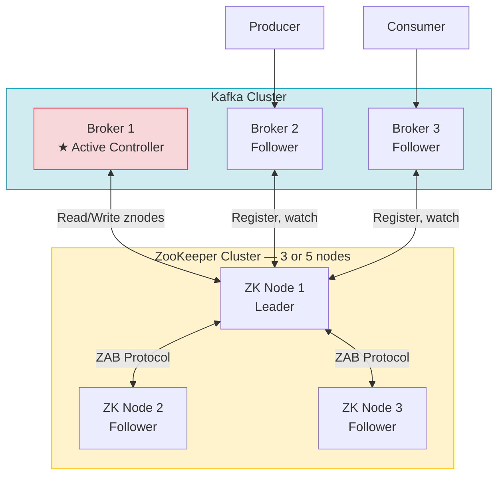
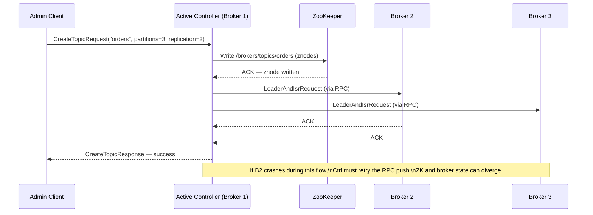
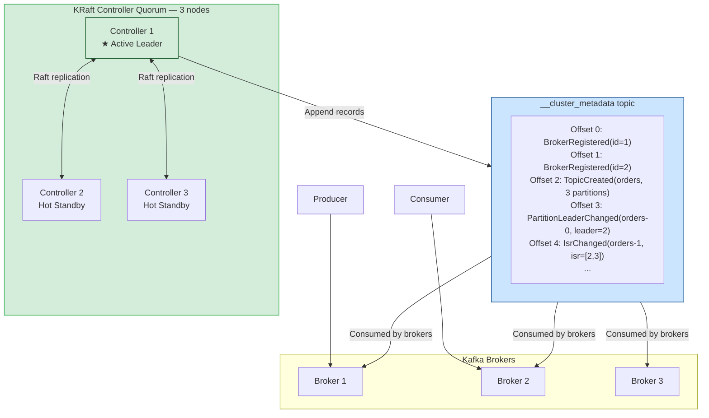
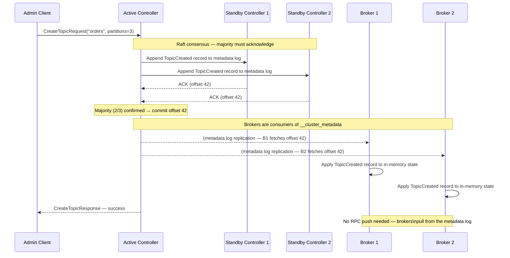
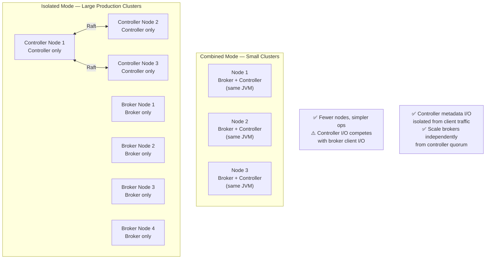
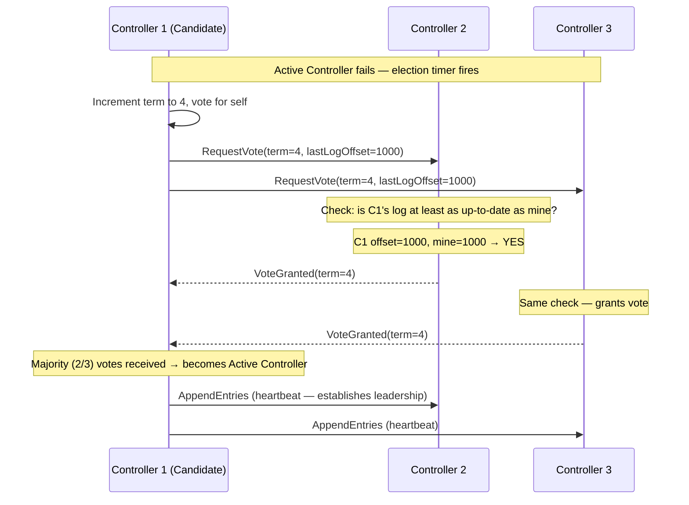
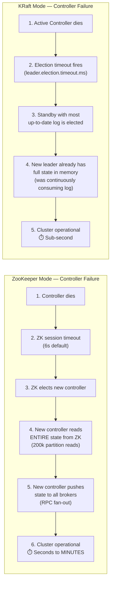
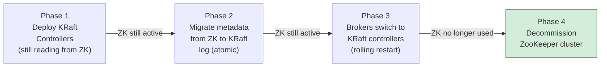

# KRaft vs ZooKeeper: Kafka Metadata Architecture

> Apache Kafka relied on **Apache ZooKeeper** for over a decade to manage cluster metadata, broker registration, and leader election. Starting with KIP-500, Kafka introduced **KRaft (Kafka Raft Metadata mode)** — replacing ZooKeeper with an internal Raft-based consensus protocol. As of Kafka 3.3, KRaft is production-ready. ZooKeeper mode is officially deprecated and will be **removed in Kafka 4.0**.

Understanding this architectural shift is not just a migration concern — it is a window into fundamental distributed systems concepts: consensus protocols, split-brain prevention, event-sourced metadata, and the trade-offs of coordinating a high-throughput distributed log at scale.

:::info[Who this guide is for]
- **New learners** — start at [The City Hall Analogy](#-the-city-hall-analogy) and [How ZooKeeper Works](#1-the-legacy-architecture-kafka-with-zookeeper).
- **Senior engineers** — jump to [Raft Consensus Deep Dive](#1-the-raft-consensus-protocol-how-kraft-achieves-agreement), [Failure Scenario Comparison](#3-failure-scenario-walkthrough), [Migration Strategy](#-migrating-from-zookeeper-to-kraft), or [Production Configuration](#-production-configuration--tuning).
:::

---

## 👶 The City Hall Analogy

Before any diagrams, a concrete mental model for both architectures.

**ZooKeeper Mode — The External Registry:**
Imagine a city (your Kafka cluster) where all official records — property deeds, business licenses, population data — are stored in a **separate government building across town** (ZooKeeper). The city mayor (the Active Controller broker) runs the city, but every time they need to know who owns what property, they must physically travel to the registry, retrieve the records, and come back. When the mayor leaves office, the incoming mayor must travel to the registry, read *all* the city records from scratch before they can do anything. If the road between the city hall and the registry is congested or the registry building has issues, the entire city grinds to a halt.

**KRaft Mode — The Internal Record Office:**
The city now keeps its own **internal archive room** (the `__cluster_metadata` log). Every decision ever made is recorded as an entry in a logbook that all council members (controller quorum) replicate among themselves. When the mayor leaves, any council member already has an up-to-date copy of *every* record in their own office — they can step in as mayor in seconds. There is no separate building to maintain, no dependency on road conditions, and no risk of the archive being in a different state than what the mayor believes.

---

## 1. The Legacy Architecture: Kafka with ZooKeeper

### What ZooKeeper Is

ZooKeeper is an independent distributed coordination service — a separate cluster, a separate JVM, a separate operational concern — built around a hierarchical namespace of **znodes** (analogous to a filesystem). Kafka used it as an external distributed database for cluster state.



### What ZooKeeper Stored

Every piece of Kafka cluster state lived in ZooKeeper znodes:

```
ZooKeeper namespace (znodes):
/kafka
  /brokers
    /ids
      /1    → {"host":"broker1","port":9092,"jmx_port":9999}
      /2    → {"host":"broker2","port":9092,"jmx_port":9999}
    /topics
      /orders
        /partitions
          /0 → {"leader":1,"replicas":[1,2,3],"isr":[1,2,3]}
          /1 → {"leader":2,"replicas":[2,3,1],"isr":[2,3,1]}
  /controller  → {"brokerid":1,"timestamp":"1718000000"}  ← ephemeral lock
  /admin
    /delete_topics → [...]
  /config
    /topics
      /orders → {"retention.ms":"604800000"}
  /isr_change_notification  → [...]
  /consumers
    /my-group → [...]
```

### How a Topic Creation Works in ZooKeeper Mode



### The Four Critical Limitations

**Limitation 1 — Two Systems to Operate:**

```
For every Kafka cluster, you need:
    Kafka cluster:     N brokers × (JVM, config, TLS certs, SASL config, JMX, monitoring)
    ZooKeeper cluster: M nodes × (JVM, config, TLS certs, SASL config, JMX, monitoring)

    Typical production setup: 5 Kafka brokers + 3–5 ZK nodes = 8–10 JVM processes
    Two separate security models to maintain (ZK has its own SASL, separate from Kafka)
    Two separate monitoring dashboards
    Two separate incident runbooks
```

**Limitation 2 — Controller Failover Bottleneck:**

```
Controller (Broker 1) dies unexpectedly

New controller election process:
    Step 1: ZK detects session timeout (zookeeper.session.timeout.ms = 6s by default)
    Step 2: ZK ephemeral /controller znode is deleted — triggers watch
    Step 3: All eligible brokers race to create /controller (one wins)
    Step 4: New controller reads ENTIRE cluster state from ZK:
              - Read all /brokers/ids znodes
              - Read all /brokers/topics/*/partitions/* znodes
              - For a cluster with 200k partitions: 200k+ ZK reads
    Step 5: New controller pushes metadata to all brokers via RPC

Total time: seconds to MINUTES for large clusters
During this window: clients cannot get metadata updates — "metadata freeze"
```

**Limitation 3 — Split-Brain Risk:**

```
Scenario: Network partition between Controller and ZooKeeper

Controller thinks: "I am still the active controller"
ZooKeeper thinks: "Controller session timed out, elected new controller"
Brokers think:    "I received a LeaderAndIsr from the old controller"

Two controllers issue conflicting commands:
    Old Controller: "Partition 0 leader = Broker 1"
    New Controller: "Partition 0 leader = Broker 2"

→ Split-brain: two brokers believe they are the leader for the same partition
→ Potential: duplicate writes, data loss, consumer confusion
```

**Limitation 4 — Partition Scalability Ceiling:**

```
ZK-based cluster practical limit: ~200,000 partitions

Why?
    - Each partition = multiple ZK znodes (leader, replicas, ISR)
    - Controller must push LeaderAndIsr to all brokers on any ISR change
    - At 200k partitions: even a routine ISR change triggers massive RPC fan-out
    - ZK's watch notification system saturates under heavy partition churn

Result: Large LinkedIn/Uber-scale Kafka deployments required multiple smaller clusters
        instead of one large cluster — increasing operational complexity
```

---

## 2. The Modern Architecture: KRaft (Kafka Raft)

### The Core Insight

KRaft's fundamental insight: **Kafka is already excellent at replicating sequential logs reliably and efficiently.** Why use an external system (ZooKeeper) for metadata when Kafka's own log replication can manage it? KRaft applies Kafka's core competency — the replicated, append-only log — to metadata itself.

### What KRaft Is

KRaft stores all cluster metadata as records in an internal Kafka topic: `__cluster_metadata`. Controllers form a Raft consensus group — they elect a leader, replicate the metadata log, and commit changes using the same Raft protocol that underpins databases like etcd and CockroachDB.



### How a Topic Creation Works in KRaft Mode



### KRaft Deployment Modes



**Combined Mode:** The same JVM process acts as both Broker and Controller. Suitable for development and small clusters (< 10 brokers, < 10,000 partitions).

**Isolated Mode:** Dedicated controller nodes run no client traffic. Recommended for production clusters where metadata operations should not compete with producer/consumer I/O.

### The Metadata Log: What Records Look Like

```
__cluster_metadata topic records:

Offset 0:  RegisterBrokerRecord      { brokerId: 1, host: "broker1", port: 9092 }
Offset 1:  RegisterBrokerRecord      { brokerId: 2, host: "broker2", port: 9092 }
Offset 2:  RegisterBrokerRecord      { brokerId: 3, host: "broker3", port: 9092 }
Offset 3:  TopicRecord               { topicId: "uuid-abc", name: "orders" }
Offset 4:  PartitionRecord           { topicId: "uuid-abc", partitionId: 0,
                                       leader: 1, replicas: [1,2,3], isr: [1,2,3] }
Offset 5:  PartitionRecord           { topicId: "uuid-abc", partitionId: 1,
                                       leader: 2, replicas: [2,3,1], isr: [2,3,1] }
Offset 6:  PartitionChangeRecord     { topicId: "uuid-abc", partitionId: 0,
                                       leader: 2, isr: [2,3] }  ← Broker 1 left ISR
Offset 7:  ConfigRecord              { resource: "orders", key: "retention.ms",
                                       value: "604800000" }
Offset 8:  ClientQuotaRecord         { ...quotas... }
...
Offset 10,000: MetadataVersionRecord { version: 7 }  ← Snapshot trigger point
```

Any broker joining the cluster replays this log from the latest snapshot to reconstruct its complete in-memory metadata state — without contacting any external system.

---

## 3. The Raft Consensus Protocol: How KRaft Achieves Agreement

Understanding Raft is essential for understanding KRaft's guarantees. Raft is the consensus algorithm that ensures all controllers agree on the metadata log — even in the presence of failures.

### Raft Leader Election



**Key Raft guarantees KRaft inherits:**

- **Election Safety:** At most one leader per term. No two controllers believe they are both active simultaneously — eliminating split-brain.
- **Log Matching:** If two logs have the same offset and term for an entry, they are identical up to that point — ensuring all controllers agree on history.
- **Leader Completeness:** A new leader always has all committed entries from previous terms — no data loss on failover.

### Why Raft Beats ZooKeeper's ZAB Protocol for This Use Case

ZooKeeper uses its own consensus protocol (ZAB — ZooKeeper Atomic Broadcast). While robust, it was designed for a general-purpose coordination service. KRaft uses Raft specifically tuned for Kafka's metadata log:

| Aspect | ZAB (ZooKeeper) | Raft (KRaft) |
|---|---|---|
| **Designed for** | General key-value coordination | Append-only log replication |
| **State model** | Hierarchical znodes (like a filesystem) | Sequential log entries (like a Kafka topic) |
| **Leader transfer** | Complex, slow | Clean, fast (explicit leader transfer command) |
| **Log compaction** | Not built-in (ZK znodes are durable state) | Snapshot-based (Kafka-native) |
| **Integration** | External system — separate protocol, separate JVM | Internal — same codebase, same tooling |

---

## 4. Failure Scenario Walkthrough

The most revealing way to compare the architectures is through concrete failure scenarios.

### Scenario 1: Active Controller Fails



**Why KRaft failover is sub-second:** Standby controllers are continuously streaming the `__cluster_metadata` log. Their in-memory state is always within a few milliseconds of the active controller. When elected, they need zero catch-up reads — they are already current.

---

### Scenario 2: Network Partition (Split-Brain Risk)

```
ZooKeeper Mode — split-brain scenario:

Network partitions: [Controller + Brokers 1,2] | [ZooKeeper + Brokers 3,4,5]

From Controller's perspective:
    "I cannot reach ZooKeeper, but I still have my in-memory metadata.
     I'll keep serving metadata to Brokers 1 and 2."

From ZooKeeper's perspective:
    "Controller session timed out. Electing Broker 3 as new controller."

Result:
    Broker 1,2: receiving leadership commands from OLD controller
    Broker 3,4,5: receiving leadership commands from NEW controller
    → Two leaders for the same partition = SPLIT-BRAIN
    → Potential data loss when partition heals and logs must be reconciled
```

```
KRaft Mode — same network partition:

[Controller 1 (Active) + Brokers 1,2] | [Controller 2,3 + Brokers 3,4,5]

Controllers 2 and 3 form a majority quorum (2 of 3 controllers):
    → Elect Controller 2 as new Active Controller
    → Controller 2 knows its log is up-to-date (Raft log matching guarantee)
    → Controller 1 cannot commit any new entries (no majority)
    → Controller 1's epoch/term is outdated — any broker receiving
      a request from it will REJECT it (term check)

Result:
    Clean leadership transfer. No split-brain.
    Controller 1 is automatically fenced — its writes are rejected.
    When partition heals, Controller 1 discovers higher term and steps down.
```

**The Raft epoch/term mechanism prevents split-brain:** Every metadata record carries the controller's epoch (term). Brokers reject any metadata from a controller with an outdated term. This is the Raft equivalent of a database's fencing token — a monotonically increasing number that makes old leaders' writes invalid.

---

### Scenario 3: Broker Restart After Long Absence

```
ZooKeeper Mode:
    Broker 2 was down for 2 hours (maintenance, crash)
    Restarts:
        1. Registers with ZooKeeper (/brokers/ids/2)
        2. Controller detects registration via ZK watch
        3. Controller pushes current state to Broker 2 via RPC
        → Time to operational: seconds to tens of seconds
           (Controller must push full metadata for all its partitions)

KRaft Mode:
    Broker 2 was down for 2 hours
    Restarts:
        1. Loads latest metadata snapshot from local disk
        2. Starts consuming __cluster_metadata from snapshot offset
        3. Streams log entries until caught up to current offset
        4. Registers with Active Controller (fetch only missing records)
        → Time to operational: depends only on how many records
           accumulated during downtime — typically seconds
           No RPC push from Controller needed — broker self-heals
```

---

## 5. Deep Comparison Matrix

| Dimension | ZooKeeper Architecture | KRaft Architecture |
|---|---|---|
| **External dependency** | ❌ Requires separate ZK cluster | ✅ Self-contained |
| **JVM processes per cluster** | N Kafka + M ZK (typically N+3 to N+5) | N Kafka nodes only |
| **Metadata storage model** | Hierarchical znodes | Append-only event log |
| **Consensus protocol** | ZAB (ZooKeeper Atomic Broadcast) | Raft |
| **Controller failover time** | Seconds to minutes (full ZK read + RPC push) | Sub-second (log already in memory) |
| **Split-brain prevention** | Weak (ZK session timeout ≠ broker fencing) | ✅ Strong (Raft epoch/term fencing) |
| **Metadata propagation** | Push via RPC (Controller → Brokers) | Pull via log consumption (Brokers → metadata log) |
| **Max practical partitions** | ~200,000 | 1,000,000+ (tested) |
| **Security model** | Dual: ZK SASL + Kafka SASL | Single: Kafka SASL/TLS only |
| **Startup time (broker)** | Wait for ZK + metadata propagation | Load snapshot + stream log tail |
| **Operational tooling** | Two systems: kafka-* CLI + zkCli | One system: kafka-* CLI only |
| **Snapshot support** | ❌ (ZK state is always full) | ✅ Periodic snapshots for fast startup |
| **Production readiness** | Deprecated (removed in Kafka 4.0) | ✅ GA since Kafka 3.3 |

---

## 6. When to Use Each (Migration Context)

Since ZooKeeper is deprecated and removed in Kafka 4.0, this is now a **migration timeline decision**, not an architectural choice between equals.

### Migration Urgency Matrix

| Kafka Version | ZooKeeper Support | KRaft Status | Action |
|---|---|---|---|
| < 2.8 | Only option | Not available | Plan upgrade path |
| 2.8 – 3.2 | Available | Early access / preview | Begin migration planning |
| 3.3 – 3.7 | Available (deprecated) | ✅ Production-ready | Migrate actively |
| 4.0+ | ❌ Removed | ✅ Only option | Must be on KRaft |

### Migration Path Decision

```
Are you on Kafka < 3.3?
    → Upgrade to 3.5+ first (ZK mode still supported)
    → Then migrate to KRaft in-place (rolling migration supported since 3.4)
    → Target: KRaft before your team is forced by a 4.0 upgrade

Is your cluster small (< 5 brokers, dev/staging)?
    → Use Combined Mode: brokers also act as controllers
    → Simplest possible setup, no dedicated controller nodes

Is your cluster production with > 10 brokers or > 10,000 partitions?
    → Use Isolated Mode: dedicated controller nodes (3 or 5)
    → Prevents metadata I/O from competing with producer/consumer throughput

Do you need > 200,000 partitions?
    → KRaft is the only option — ZK cannot handle this scale
```

---

## ⚙️ Production Configuration & Tuning

### KRaft Broker Configuration (`server.properties`)

```properties
# ── Node Identity ─────────────────────────────────────────────────────────
# Unique ID for this node (must be unique across the entire cluster)
node.id=1

# Role: 'broker', 'controller', or 'broker,controller' (combined mode)
process.roles=broker,controller   # Combined mode
# process.roles=broker            # Isolated mode — broker only
# process.roles=controller        # Isolated mode — controller only

# ── KRaft Cluster Identity ────────────────────────────────────────────────
# Must be generated once per cluster: kafka-storage.sh random-uuid
cluster.id=MkU3OEVBNTcwNTJENDM2Qg

# Controller quorum — all controller node.id:host:port pairs
# Must be the same on ALL nodes in the cluster
controller.quorum.voters=1@controller1:9093,2@controller2:9093,3@controller3:9093

# ── Listeners ──────────────────────────────────────────────────────────────
# PLAINTEXT: client traffic (brokers only)
# CONTROLLER: controller-to-controller and broker-to-controller (controllers)
listeners=PLAINTEXT://:9092,CONTROLLER://:9093
advertised.listeners=PLAINTEXT://broker1.internal:9092

# Which listener is used for controller communication
controller.listener.names=CONTROLLER
inter.broker.listener.name=PLAINTEXT

# ── Log and Metadata Storage ───────────────────────────────────────────────
log.dirs=/data/kafka/logs
metadata.log.dir=/data/kafka/metadata   # Separate disk recommended for metadata

# ── KRaft Tuning ──────────────────────────────────────────────────────────
# How often to take a metadata snapshot (in number of records)
# Lower = faster broker startup, more snapshot I/O
metadata.log.max.record.bytes.between.snapshots=20971520  # 20 MB

# How long to retain old snapshots (for lagging brokers to catch up)
metadata.max.retention.bytes=104857600  # 100 MB

# Raft election timeout — how long to wait before triggering election
# Default 1000ms — reduce only if you need faster failover
# (lower values increase false-positive elections under load)
controller.quorum.election.timeout.ms=1000
controller.quorum.fetch.timeout.ms=2000
```

### Format and Bootstrap a New KRaft Cluster

```bash
# Step 1: Generate a unique cluster ID (do this ONCE — same ID for all nodes)
CLUSTER_ID=$(kafka-storage.sh random-uuid)
echo "Cluster ID: $CLUSTER_ID"
# Output: MkU3OEVBNTcwNTJENDM2Qg

# Step 2: Format storage on EVERY node (uses the same CLUSTER_ID)
kafka-storage.sh format \
    --config /etc/kafka/server.properties \
    --cluster-id $CLUSTER_ID
# Output: Formatting /data/kafka/logs with metadata.version 3.7-IV4

# Step 3: Start brokers (they self-discover via controller.quorum.voters)
kafka-server-start.sh /etc/kafka/server.properties
```

### Spring Boot Producer/Consumer — No ZooKeeper Config Needed

One of the most visible operational improvements: Spring Boot Kafka configuration becomes simpler with KRaft — no ZooKeeper connection string required anywhere.

```yaml
# application.yml — KRaft cluster (no zookeeper.connect property)
spring:
  kafka:
    bootstrap-servers: broker1:9092,broker2:9092,broker3:9092
    # That's it — ZK is gone from client configuration entirely

    producer:
      key-serializer: org.apache.kafka.common.serialization.StringSerializer
      value-serializer: org.springframework.kafka.support.serializer.JsonSerializer
      acks: all              # Wait for all ISR replicas to confirm
      retries: 3
      properties:
        enable.idempotence: true
        max.in.flight.requests.per.connection: 5

    consumer:
      group-id: order-processor
      auto-offset-reset: earliest
      key-deserializer: org.apache.kafka.common.serialization.StringDeserializer
      value-deserializer: org.springframework.kafka.support.serializer.JsonDeserializer
      properties:
        spring.json.trusted.packages: "com.example.events"
        isolation.level: read_committed  # Only read committed transactions
```

```java
// Checking cluster metadata — works identically on ZK and KRaft
@Service
@RequiredArgsConstructor
public class KafkaClusterInspector {

    private final KafkaAdmin kafkaAdmin;

    public ClusterInfo inspectCluster() throws Exception {
        try (AdminClient adminClient = AdminClient.create(kafkaAdmin.getConfigurationProperties())) {
            // Describe the cluster
            DescribeClusterResult cluster = adminClient.describeCluster();
            String clusterId = cluster.clusterId().get();
            Node controller = cluster.controller().get();
            Collection<Node> nodes = cluster.nodes().get();

            log.info("Cluster ID: {}", clusterId);
            log.info("Active Controller: node {} at {}:{}",
                    controller.id(), controller.host(), controller.port());
            log.info("Cluster nodes: {}", nodes.size());

            // Describe a specific topic
            DescribeTopicsResult topics = adminClient.describeTopics(List.of("orders"));
            TopicDescription orders = topics.topicNameValues().get("orders").get();
            orders.partitions().forEach(p ->
                    log.info("Partition {}: leader={}, isr={}",
                            p.partition(), p.leader().id(),
                            p.isr().stream().map(Node::id).toList())
            );

            return new ClusterInfo(clusterId, controller.id(), nodes.size());
        }
    }

    // Check if we're running KRaft (useful during migration period)
    public boolean isKRaftMode() throws Exception {
        try (AdminClient client = AdminClient.create(kafkaAdmin.getConfigurationProperties())) {
            // KRaft clusters have a non-null cluster ID from kafka-storage format
            // ZK clusters use a ZK-generated cluster ID that may be absent in older versions
            String clusterId = client.describeCluster().clusterId().get();
            // KRaft cluster IDs are base64-encoded UUIDs (22 chars)
            return clusterId != null && clusterId.length() == 22;
        }
    }
}
```

### Programmatic Topic Management

```java
@Configuration
public class KafkaTopicConfig {

    // With KRaft, topic creation is faster and more consistent
    // No ZK round-trips — changes commit via Raft immediately
    @Bean
    public NewTopic ordersTopic() {
        return TopicBuilder.name("orders")
                .partitions(12)
                .replicas(3)
                .config(TopicConfig.RETENTION_MS_CONFIG, String.valueOf(Duration.ofDays(7).toMillis()))
                .config(TopicConfig.COMPRESSION_TYPE_CONFIG, "lz4")
                .config(TopicConfig.MIN_IN_SYNC_REPLICAS_CONFIG, "2")
                .build();
    }

    @Bean
    public NewTopic ordersDlqTopic() {
        return TopicBuilder.name("orders.DLQ")
                .partitions(12)
                .replicas(3)
                .config(TopicConfig.RETENTION_MS_CONFIG, String.valueOf(Duration.ofDays(14).toMillis()))
                .build();
    }
}
```

---

## 🚀 Migrating from ZooKeeper to KRaft

### Migration Overview (Kafka 3.4+ Rolling Migration)

Since Kafka 3.4, in-place migration is supported: you can migrate a live ZooKeeper-backed cluster to KRaft **without downtime** — brokers keep serving traffic throughout.



### Migration Checklist

```bash
# ── Pre-migration validation ───────────────────────────────────────────────

# 1. Confirm Kafka version is 3.4+ (rolling migration requires this)
kafka-broker-api-versions.sh --bootstrap-server broker1:9092 | grep "ApiVersions"

# 2. Check current ZK-mode cluster health
kafka-metadata-quorum.sh --bootstrap-server broker1:9092 describe --status
# Should show: MetadataVersion, ClusterId, ActiveControllerId

# 3. Verify ZK is healthy
echo "srvr" | nc zookeeper1 2181
# Should return Mode: leader or Mode: follower

# 4. Document current partition count and topic list
kafka-topics.sh --bootstrap-server broker1:9092 --list | wc -l

# ── Phase 1: Deploy KRaft controllers alongside ZK ────────────────────────

# 5. Format storage on NEW controller nodes (NOT existing brokers yet)
kafka-storage.sh format --config controller.properties --cluster-id $(cat /etc/kafka/cluster.id)

# 6. Start KRaft controllers with migration mode enabled
# controller.properties additions:
# zookeeper.connect=zk1:2181,zk2:2181,zk3:2181  ← still reading from ZK
# zookeeper.metadata.migration.enable=true

# ── Phase 2: Migrate metadata ─────────────────────────────────────────────

# 7. Trigger metadata migration (atomic — ZK state → KRaft log)
kafka-metadata-quorum.sh --bootstrap-server broker1:9092 describe --status
# Watch for: MetadataMigrationState: MIGRATION_COMPLETE

# ── Phase 3: Rolling broker migration ─────────────────────────────────────

# 8. Rolling restart brokers with KRaft config
# Add to broker server.properties:
# process.roles=broker
# controller.quorum.voters=1@ctrl1:9093,2@ctrl2:9093,3@ctrl3:9093
# Remove: zookeeper.connect

# Restart one broker at a time, verify health between each:
kafka-topics.sh --bootstrap-server broker1:9092 --describe --topic orders
# Confirm: all partitions have leaders, ISR is full

# ── Phase 4: Decommission ZooKeeper ───────────────────────────────────────

# 9. Verify no broker is connected to ZK
echo "dump" | nc zookeeper1 2181 | grep -c "kafka"
# Should return 0

# 10. Stop ZooKeeper nodes — you are done
```

---

## 🧠 Senior Deep Dive

### 1. KRaft Metadata Snapshots: Preventing Log Growth

Without snapshots, the `__cluster_metadata` log grows indefinitely. A broker that restarts after being down for weeks would need to replay years of log history to reconstruct current state.

```
KRaft snapshot lifecycle:

1. Active Controller writes records to __cluster_metadata
   Offset 0 ... 50,000 records accumulated

2. Snapshot trigger: records since last snapshot > metadata.log.max.record.bytes.between.snapshots
   → Controller serializes full in-memory state to snapshot file
   → Snapshot file: /data/kafka/metadata/__cluster_metadata-0/00000000000050000-0000001234.checkpoint

3. New broker starts:
   a. Finds latest snapshot: 00000000000050000-0000001234.checkpoint
   b. Loads snapshot into memory (fast: one file read)
   c. Starts consuming __cluster_metadata from offset 50,001
   d. Applies all records since snapshot → fully up-to-date
   e. Joins the cluster

4. Old snapshots cleaned up based on metadata.max.retention.bytes
   (keep enough for lagging brokers to catch up)
```

```bash
# Inspect snapshots on a running controller node
ls -la /data/kafka/metadata/__cluster_metadata-0/
# Output:
# 00000000000000000-0000000001.checkpoint  ← initial snapshot
# 00000000000050000-0000001234.checkpoint  ← after 50k records
# 00000000000100000-0000002468.checkpoint  ← after 100k records
# ...

# View snapshot contents (diagnostic)
kafka-metadata-shell.sh \
    --snapshot /data/kafka/metadata/__cluster_metadata-0/00000000000100000-0000002468.checkpoint
# Interactive shell: ls, cat, describe on metadata state at that snapshot
```

---

### 2. The `kafka-metadata-quorum.sh` Operational Toolkit

KRaft ships with dedicated tooling for inspecting the Raft quorum — something that had no equivalent in ZooKeeper mode.

```bash
# Describe quorum status — who is the leader, what is each node's lag?
kafka-metadata-quorum.sh \
    --bootstrap-server broker1:9092 \
    describe --status

# Output:
# ClusterId:              MkU3OEVBNTcwNTJENDM2Qg
# LeaderId:               1
# LeaderEpoch:            5
# HighWatermark:          102450
# MaxFollowerLag:         3        ← Followers are 3 records behind
# MaxFollowerLagTimeMs:   12       ← 12ms behind the leader
# CurrentVoters:          [1,2,3]
# CurrentObservers:       [4,5,6]  ← Brokers consuming metadata log but not voting

# Describe individual replica states
kafka-metadata-quorum.sh \
    --bootstrap-server broker1:9092 \
    describe --replication

# Output:
# NodeId  LogEndOffset  Lag  LastFetchTimestamp  LastCaughtUpTimestamp  Status
# 1       102450        0    1718000100000       1718000100000          Leader
# 2       102447        3    1718000099988       1718000099988          Follower
# 3       102450        0    1718000100000       1718000100000          Follower
# 4       102448        2    1718000099991       1718000099991          Observer (broker)
```

---

### 3. Observability: What to Monitor in KRaft

KRaft exposes new JMX metrics that replace ZooKeeper-specific monitoring.

```java
// Micrometer / Spring Boot Actuator — KRaft-specific metrics to watch

// 1. Controller active status — alert if 0 (no active controller)
// kafka.controller:type=KafkaController,name=ActiveControllerCount
// Expected: exactly 1 across the cluster

// 2. Metadata log offset lag per broker
// kafka.server:type=MetadataManager,name=MetadataMirrorer$CurrentControllerId
// kafka.server:type=KafkaBroker,name=metadataCurrentOffset
// kafka.server:type=KafkaBroker,name=metadataAppliedOffset

// 3. Controller failover rate — alert if > 0 in last 5 minutes
// kafka.controller:type=ControllerStats,name=LeaderElectionRateAndTimeMs

// 4. Raft quorum lag
// kafka.raft:type=raft-metrics,name=current-leader
// kafka.raft:type=raft-metrics,name=high-watermark
```

```yaml
# Prometheus alerting rules for KRaft
groups:
  - name: kraft_alerts
    rules:
      # CRITICAL: No active controller
      - alert: KafkaNoActiveController
        expr: kafka_controller_kafkacontroller_activecontrollercount != 1
        for: 30s
        labels:
          severity: critical
        annotations:
          summary: "No active Kafka controller — cluster cannot accept metadata changes"

      # WARNING: Controller failover occurred
      - alert: KafkaControllerFailover
        expr: increase(kafka_controller_controllerstats_leaderelectionrateanddtimems_count[5m]) > 0
        labels:
          severity: warning
        annotations:
          summary: "Kafka controller failover detected in the last 5 minutes"

      # WARNING: Broker significantly behind on metadata log
      - alert: KafkaBrokerMetadataLag
        expr: kafka_server_metadatamanager_metadatacurrentoffset - on(instance)
              kafka_server_metadatamanager_metadataappliedoffset > 1000
        for: 1m
        labels:
          severity: warning
        annotations:
          summary: "Broker {{ $labels.instance }} is {{ $value }} records behind on metadata log"
```

---

### 4. KRaft Limitations and Known Constraints

KRaft is production-ready but has some known limitations as of Kafka 3.x:

| Limitation | Status | Workaround |
|---|---|---|
| **JBOD (multiple data dirs per broker)** | Not supported in KRaft (KIP-858 pending) | Use single `log.dirs` per broker or RAID |
| **Delegation token migration** | Manual re-creation needed during ZK → KRaft migration | Re-issue delegation tokens post-migration |
| **Some legacy tools** | `kafka-preferred-replica-election.sh` deprecated | Use `kafka-leader-election.sh` instead |
| **Cluster linking (Confluent)** | Verify version compatibility | Check Confluent Platform KRaft support matrix |
| **Mirror Maker 2 with KRaft source** | Supported from MM2 3.4+ | Upgrade MM2 before migrating source cluster |

---

### 5. KRaft Isolated Mode: Sizing the Controller Quorum

For production clusters, how many dedicated controller nodes should you run?

```
Raft quorum fault tolerance formula:
    Can tolerate F failures with 2F+1 nodes

    3 controllers → tolerate 1 failure (minimum for production)
    5 controllers → tolerate 2 simultaneous failures (for critical clusters)
    7 controllers → tolerate 3 simultaneous failures (rare; adds latency)

Controller write latency:
    Write commits when majority (F+1) nodes acknowledge
    3-node quorum: need 2 ACKs (1 network hop)
    5-node quorum: need 3 ACKs (potentially 2 network hops to the slowest)
    → 5-node quorum adds ~20-30% more latency on metadata writes
    → Only use 5 nodes if the 2-failure tolerance is genuinely required

Controller node sizing:
    CPU:  4 cores (metadata operations are not CPU-intensive)
    RAM:  16–32 GB (metadata snapshot + log in memory)
    Disk: Fast SSD for metadata.log.dir (separate from broker data disks)
    IOPS: 3,000+ IOPS for metadata disk (snapshot writes are periodic bursts)
```

---

## 🎯 Interview Decision Matrix

| Question | Answer |
|---|---|
| **Why did Kafka deprecate ZooKeeper?** | Scalability ceiling (~200k partitions), minutes-long controller failovers, split-brain risk, operational complexity of running two distributed systems |
| **How does KRaft prevent split-brain?** | Raft epoch/term fencing: any controller with an outdated term is rejected by brokers. Only the current Raft leader can commit metadata changes |
| **How do brokers get metadata updates in KRaft?** | They consume `__cluster_metadata` topic as standard Kafka consumers — pull-based, not push-based |
| **Why is KRaft failover sub-second?** | Standby controllers continuously consume the metadata log; their in-memory state is already current. No catch-up reads needed on election |
| **What is a KRaft snapshot?** | A point-in-time serialization of the full metadata state, enabling new/restarting brokers to bootstrap without replaying the full log history |
| **Combined vs. Isolated mode?** | Combined for dev/small clusters (simpler). Isolated for production (isolates metadata I/O from client traffic, independent scaling) |
| **Can I migrate live without downtime?** | Yes, since Kafka 3.4 — rolling migration keeps ZK active until all brokers have switched to the KRaft controllers |

:::tip[Interview Phrasing — Why KRaft?]
*"Kafka moved away from ZooKeeper to solve three compounding problems. First, scalability: ZK-backed clusters are limited to ~200k partitions because the controller must push state changes to every broker via RPC — this saturates at scale. Second, failover latency: when a ZK-mode controller fails, the new controller must read the entire cluster state from ZooKeeper before it can function — minutes of metadata freeze on large clusters. Third, operational complexity: two separate distributed systems, two JVM clusters, two security models, two monitoring stacks. KRaft solves all three: metadata is an internal Kafka log, standbys are always current, and there's only one system to operate."*
:::

:::tip[Interview Phrasing — How KRaft Works]
*"KRaft stores cluster metadata as records in an internal topic called `__cluster_metadata`, replicated using the Raft consensus protocol across a quorum of controller nodes. Brokers are consumers of this topic — they continuously stream metadata changes and update their in-memory state. When the active controller fails, a standby is elected in sub-second time because it already has the full state in memory. There's no external system to consult. The Raft epoch/term mechanism ensures that any controller with a stale term is immediately fenced — eliminating the split-brain risk that existed in ZooKeeper mode where the ZK state and in-broker state could diverge."*
:::

---

## 📚 Further Reading

- [KIP-500: Replace ZooKeeper with a Self-Managed Metadata Quorum](https://cwiki.apache.org/confluence/display/KAFKA/KIP-500%3A+Replace+ZooKeeper+with+a+Self-Managed+Metadata+Quorum) — The original design proposal; explains every motivation and design decision from the Kafka team.
- [Kafka 3.7 KRaft Migration Guide](https://kafka.apache.org/documentation/#kraft_migration) — Official step-by-step migration documentation including rollback procedures.
- [In Search of an Understandable Consensus Algorithm (Raft Paper)](https://raft.github.io/raft.pdf) — Diego Ongaro's original Raft paper; the algorithm underpinning KRaft's controller quorum.
- [The Raft Consensus Algorithm — Interactive Visualization](https://raft.github.io/) — Visual walkthrough of leader election and log replication; build intuition before reading the paper.
- [KIP-630: Kafka Raft Snapshot](https://cwiki.apache.org/confluence/display/KAFKA/KIP-630%3A+Kafka+Raft+Snapshot) — The design proposal for metadata snapshots; explains why they exist and how they interact with log retention.
- [Confluent — Running Kafka in KRaft Mode](https://docs.confluent.io/platform/current/kafka/kraft.html) — Confluent's production deployment guide with Confluent Platform-specific KRaft configuration.
- [Apache Kafka Documentation — KRaft Mode](https://kafka.apache.org/documentation/#kraft) — Official Kafka docs; covers `server.properties` configuration, storage format, and operational commands.
- [kafka-metadata-shell.sh](https://kafka.apache.org/documentation/#metadata_shell) — The interactive metadata snapshot inspector tool; invaluable for debugging KRaft state.

# KRaft vs ZooKeeper: Deep Dive Comparison

For a long time, Apache Kafka relied on **Apache ZooKeeper** to manage cluster metadata, leader election, and broker registration. Starting in KIP-500, Kafka introduced **KRaft (Kafka Raft Metadata mode)** to remove this dependency and manage metadata internally using a Raft-based consensus protocol. As of Kafka 3.3, KRaft became production-ready, and ZooKeeper is now officially deprecated and will be removed in Kafka 4.0.

This guide explores both architectures in detail and explains why the shift to KRaft is a massive leap forward for Kafka.

---

## 1. The Legacy Architecture: Kafka with ZooKeeper

In the traditional architecture, a Kafka cluster requires a separate ZooKeeper cluster (usually an odd number of nodes like 3, 5, or 7) running alongside it.

### How it Works
1. **The Controller Broker:** One Kafka broker is elected as the "Active Controller" by grabbing a lock in ZooKeeper.
2. **Metadata Storage:** ZooKeeper stores all cluster metadata:
   - Broker IDs and endpoints
   - Topics, partitions, and their configurations
   - Replica assignments (Leader, Follower, ISR - In-Sync Replicas)
   - Temporary ACLs and quotas
3. **Write Path:** When an admin creates a topic, the Controller updates ZooKeeper, then propagates the state to all other brokers via RPC calls.
4. **Read Path:** Brokers cache the metadata in memory to serve client requests fast.

### Limitations of ZooKeeper
- **Two Systems to Manage:** Operators must deploy, secure, monitor, and tune two entirely different distributed systems (Kafka and ZooKeeper), each with its own JVM and configurations.
- **Controller Bottleneck:** The Controller must load the *entire* cluster state from ZooKeeper on startup or failover. If a cluster has hundreds of thousands of partitions, electing a new controller can take several minutes, causing a cluster-wide metadata freeze.
- **Split-Brain Risk:** The state in ZooKeeper and the state cached in the Controller/Brokers can drift out of sync, leading to "split-brain" scenarios.
- **Scalability Limit:** Because of the metadata propagation bottleneck, ZK-backed Kafka clusters are practically limited to around 200,000 partitions.

---

## 2. The Modern Architecture: KRaft (Kafka Raft)

KRaft removes the need for ZooKeeper entirely. Instead of an external system, metadata is managed internally as an **event-sourced log** using the Raft consensus protocol.

### How it Works
1. **Quorum Controllers:** A subset of brokers (or dedicated nodes) act as "Controllers". They form a Raft quorum. One is the Active Controller; the others are hot standbys.
2. **The Metadata Topic (`__cluster_metadata`):** Instead of saving state in a hierarchical database like ZK, KRaft stores metadata as a standard Kafka log. Every change (e.g., partition creation, leader change) is appended as a record to this topic.
3. **Event-Sourced Architecture:**
   - Brokers consume the `__cluster_metadata` topic just like normal consumers.
   - When the Active Controller writes a metadata change, all brokers continuously replicate it.
   - Brokers always have the most up-to-date state in memory by simply replaying the log.

### Deployment Modes
KRaft supports two deployment models:
- **Combined Mode:** The same JVM process acts as both a Broker (handling client traffic) and a Controller. Great for smaller clusters to save resources.
- **Isolated Mode:** Dedicated nodes run only as Controllers, while other nodes run only as Brokers. Recommended for large production clusters to isolate metadata I/O from heavy client I/O.

---

## 3. Deep Dive Comparison

| Feature | ZooKeeper Architecture | KRaft Architecture |
| :--- | :--- | :--- |
| **System Dependency** | External (Apache ZooKeeper) | **Internal** (Self-managed via Raft) |
| **Data Propagation** | RPC calls push state from Controller to Brokers | **Event-driven** (Brokers consume metadata log) |
| **Metadata Representation**| Hierarchical Nodes (ZNodes) | **Event Sourced** (Append-only log) |
| **Controller Failover** | Slow (Minutes). Must load entire state from ZK. | **Instant** (Sub-second). Standbys are already fully synced via the log. |
| **Scalability Limit** | ~200,000 partitions | **1,000,000+** partitions |
| **Split-Brain Risk** | High. ZK state and Broker memory can diverge. | **None**. The metadata log *is* the single source of truth. |
| **Security Setup** | Double effort (SASL/TLS for ZK + Kafka) | **Single unified security model** |
| **Startup Time** | Slow (Metadata propagation takes time) | **Fast** (Brokers just read local snapshot + log tail) |

---

## 4. Why KRaft is a Game Changer

### Event-Sourced Metadata
In ZooKeeper mode, the Controller computes the steady state and pushes it out. If a broker misses the push, it's out of sync. In KRaft, metadata *is data*. The metadata log is exactly the same append-only, sequential data structure Kafka uses for normal messages. This allows Kafka to use its core competency (replicating logs efficiently) to manage itself. 

### Sub-Second Controller Failover
Because standby KRaft controllers are continuously consuming the metadata log, they already have the entire cluster state loaded in memory. If the Active Controller dies, a standby is elected in milliseconds and can begin accepting writes immediately. This completely eliminates the dreaded "metadata freeze" during failovers.

### Snapshots for Fast Startup
To prevent the metadata log from growing infinitely, KRaft periodically writes **Metadata Snapshots** to disk. When a new broker starts up, it doesn't need to read the log from the very beginning; it simply loads the latest snapshot into memory and starts consuming the log from that point forward.

### Simpler Operations
Operating one system is easier than operating two. With KRaft, there are no ZooKeeper ensemble configurations, no complex JMX metrics to decode across different systems, and a unified security model (TLS/SASL config is the same for the whole cluster).

---

## 5. Interview Questions — KRaft vs ZooKeeper

**Q: Why did Kafka move away from ZooKeeper?**

> Kafka moved away from ZooKeeper primarily to solve **scalability and operational bottlenecks**. ZooKeeper limited Kafka clusters to roughly 200k partitions because the Active Controller had to load the entire state from ZK on failover and push state changes synchronously via RPCs to all brokers. Furthermore, managing two distinct distributed systems doubled the operational burden (security, monitoring, deployment). KRaft solves this by managing metadata internally using an event-sourced log.

**Q: In KRaft mode, how do normal brokers get metadata updates?**

> In KRaft mode, metadata is stored in an internal Kafka topic called `__cluster_metadata`. Normal brokers act as consumers of this topic. When the Active Controller makes a metadata change (like electing a new partition leader), it appends a record to this log. Brokers asynchronously consume this log and update their in-memory state, ensuring they are always in sync with the controller quorum.

**Q: What happens if the Active Controller fails in KRaft vs ZooKeeper?**

> In ZooKeeper mode, a new Controller must be elected, which then has to read the entire cluster state from ZooKeeper before it can function. In large clusters, this causes a "metadata freeze" lasting minutes. In KRaft mode, the other nodes in the controller quorum are continuously consuming the metadata log, so their in-memory state is already perfectly up to date. Controller failover happens almost instantaneously (under a second).

**Q: What is a KRaft snapshot and why is it necessary?**

> Because KRaft treats cluster metadata as an append-only log, the log could theoretically grow forever, increasing broker startup times as they replay the entire history. A KRaft snapshot is a point-in-time compaction of the state. Brokers read the latest snapshot to establish the baseline state in memory, and then only stream the tail of the log that occurred after the snapshot.
