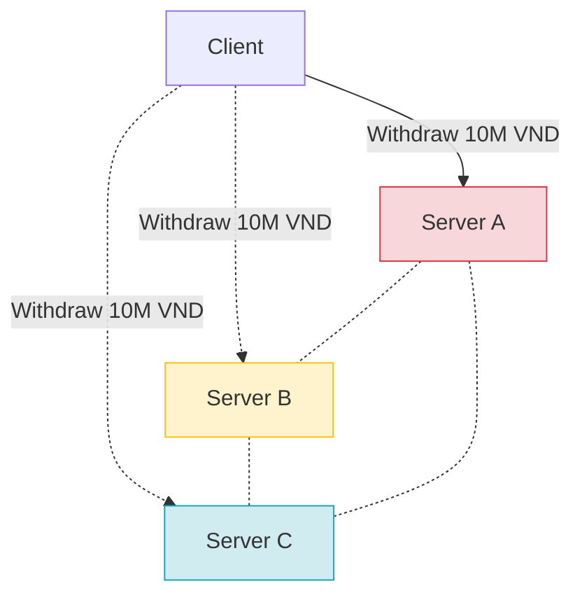
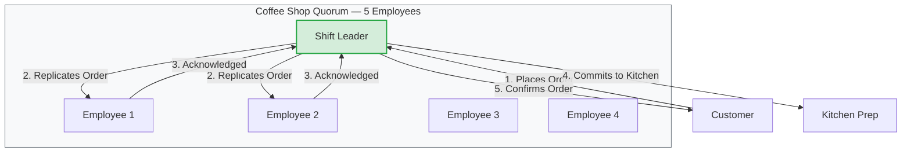
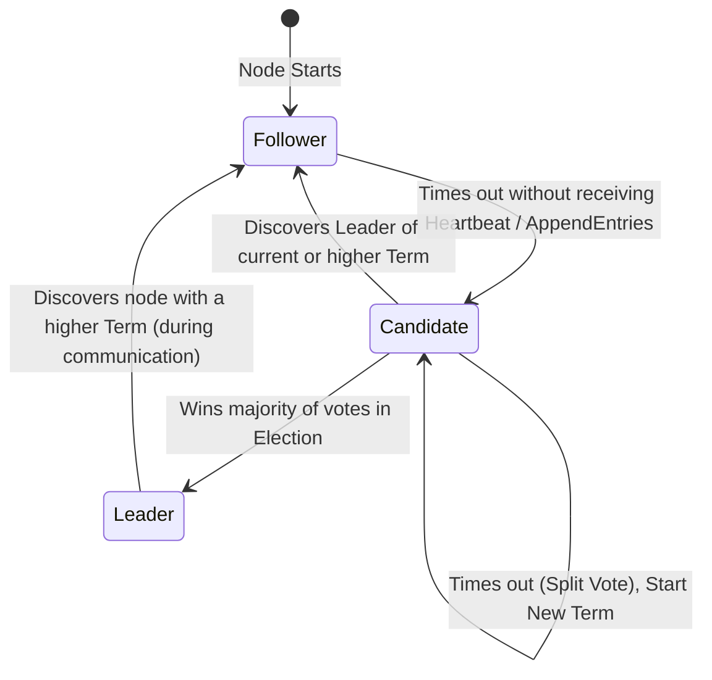
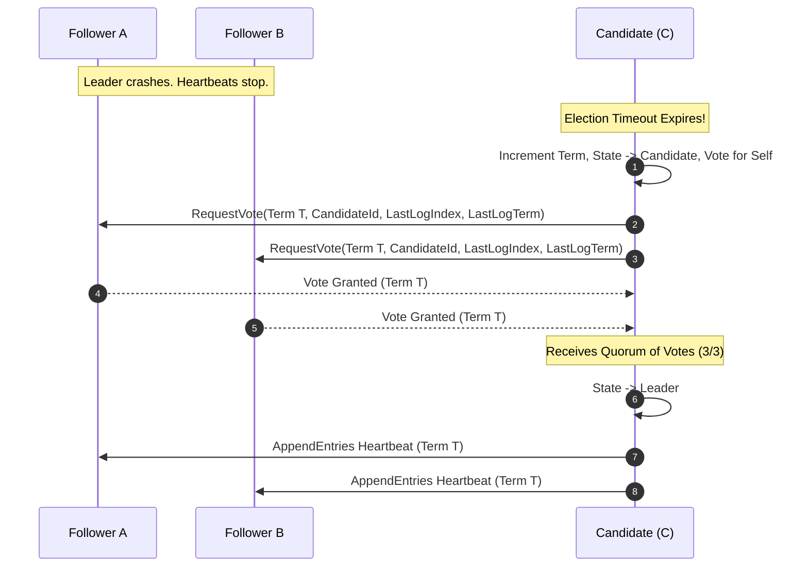
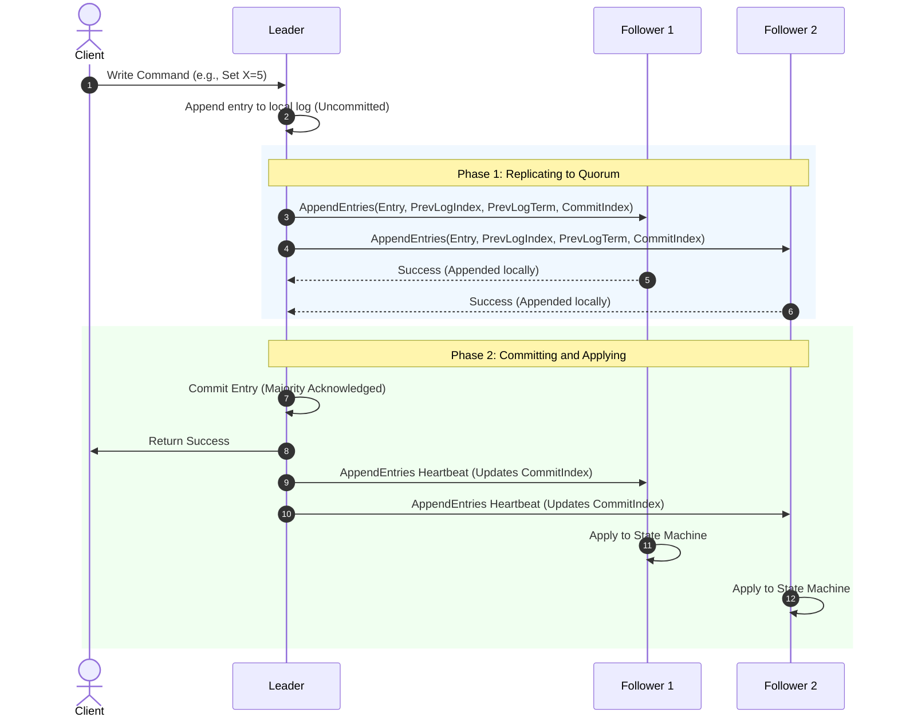

# Raft Consensus Algorithm

> A distributed consensus protocol designed at Stanford University in 2013 to be understandable and easy to implement. Raft guarantees safety, liveness, and fault tolerance across a cluster of machines. It forms the foundational consensus backbone of modern state stores like `etcd` (used by Kubernetes) and Apache Kafka's modern metadata layer, **KRaft**.

Understanding Raft is essential for understanding how modern distributed databases and message queues achieve strong consistency and resilience in the face of machine crashes, network partitions, and message delays.

:::info[Who this guide is for]
- **New learners** — start with [The Core Problem: Distributed Consensus](#the-core-problem-distributed-consensus) and [The Coffee Shop Analogy](#the-coffee-shop-analogy).
- **Senior engineers** — skip to [The Three Pillars of Raft](#the-three-pillars-of-raft) and [Raft in Action: KRaft vs. Standard Raft](#raft-in-action-kraft-vs-standard-raft) to explore implementation details.
:::

---

## The Core Problem: Distributed Consensus

In a single-node system, data consistency is trivial. The node processes a transaction, writes it to disk, and acknowledges the client. However, a single node represents a single point of failure (SPOF). 

To build a highly available system, we must distribute data and decision-making across a cluster of servers. This introduces a major challenge: **how do multiple independent machines agree on a value or a sequence of operations, even when some nodes are slow, crashed, or disconnected?**

This is the **Distributed Consensus** problem.

### The Split-Brain Problem

To understand the stakes, consider a cluster of three database servers processing bank account updates. A customer initiates a withdrawal of **10,000,000 VND**.



- **Scenario 1 (No Coordination):** If all three servers accept the request independently, the client is charged 30,000,000 VND instead of 10,000,000 VND.
- **Scenario 2 (Naive Master-Slave):** If Server A acts as the leader but experiences a network partition separating it from Server B and Server C:
  - Server B and Server C might assume Server A is dead and elect Server B as a new leader.
  - Server A (still running) continues to accept writes from a subset of clients, while Server B accepts writes from other clients.
  - Once the partition heals, the cluster is in an irreconcilable state with diverging histories. This is the classic **Split-Brain Problem**.

### Gaps in Paxos

Prior to Raft, the industry-standard algorithm for consensus was **Paxos** (introduced by Leslie Lamport in 1989). While mathematically elegant, Paxos is notoriously difficult to understand and implement in real-world systems. 

Google, which implemented Paxos for its lock service *Chubby*, noted:
> *"There are significant gaps between the description of the Paxos algorithm and the needs of a real-world system. In order to build a real-world system, a large number of undocumented features and optimizations must be added, transforming a simple algorithm into a highly complex beast."*
> — Google Chubby Paper

In 2013, Stanford researchers Diego Ongaro and John Ousterhout set out to design a consensus algorithm that was deliberately optimized for **understandability**. They introduced **Raft** in their landmark paper: *"In Search of an Understandable Consensus Algorithm."*

---

## The Coffee Shop Analogy

To grasp Raft's mechanics before diving into its mathematical invariants, imagine a coffee shop operated by **five employees** working the evening shift:



1. **The Role of the Leader:** The employees elect one **Shift Leader** (Leader). All customer orders (client write requests) must go through this Shift Leader.
2. **Order Replication:** When a customer places an order for a *Phin Sữa Đá*:
   - The Shift Leader writes it down in their order book.
   - The Shift Leader calls out the order to the other four employees.
   - The employees write the order down in their respective notebooks.
3. **Achieving Quorum:** Once at least two other employees confirm they have written the order down (making a total of **three out of five** employees who have recorded it), a **quorum (majority)** has been reached.
4. **Committing the Order:** The Shift Leader officially commits the order, hands it to the kitchen to brew the coffee, and confirms the transaction to the customer.
5. **Leader Election:** If the Shift Leader suddenly falls ill and leaves the shop:
   - The remaining employees notice the lack of communication after a short duration (election timeout).
   - They initiate an election.
   - To become the new Shift Leader, an employee must solicit votes and win support from a majority (at least 3 out of 5). 
   - Crucially, an employee will refuse to vote for anyone whose notebook has fewer recorded orders than their own, ensuring that committed orders are never lost.

---

## Raft Node States and Transitions

A Raft cluster typically consists of an odd number of nodes (e.g., 3, 5, or 7) to ensure a clear majority can be established. At any given moment, each node is in one of three states:

| State | Description |
| :--- | :--- |
| **Follower** | Completely passive. Does not initiate communication; simply responds to incoming requests from Leaders and Candidates. |
| **Candidate** | An active state assumed when a Follower suspects the Leader has failed. Initiates an election to become the new Leader. |
| **Leader** | Manages the cluster. Handles all client write requests, coordinates log replication, and issues heartbeats to prevent elections. |

### The State Machine Transition Flow

The lifecycle of a node flows dynamically through these states based on heartbeats, timeouts, and vote outcomes:



---

## The Three Pillars of Raft

Raft achieves consensus by dividing the problem into three decoupled subsystems: **Leader Election**, **Log Replication**, and **Safety**.

### 1. Leader Election

Raft operates on a system of **logical time** called **Terms**. Terms are represented by monotonically increasing integers. 

```
Terms:
|----- Term 1 -----|----- Term 2 -----|---------- Term 3 ----------|
  Elected Leader 1     Election fails     Elected Leader 2
                       (Split Vote)
```

Each term begins with an election. If a candidate wins, it serves as the leader for the remainder of that term. If a split vote occurs (no candidate wins a majority), the term ends immediately, and a new term begins.

#### Heartbeats and Timeouts

- **Heartbeat Interval:** The Leader periodically sends empty `AppendEntries` RPCs to all followers (typically every **50ms - 100ms**) to assert its authority.
- **Election Timeout:** Followers expect heartbeats within a specific window (typically **150ms - 300ms**). If this timeout expires without a heartbeat, the follower assumes the leader has failed, increments its term, transitions to **Candidate**, votes for itself, and broadcasts a `RequestVote` RPC.



:::tip[Mitigating Split Votes via Randomized Timeouts]
If multiple followers time out simultaneously, they will all vote for themselves, causing a **Split Vote** where no one gains a majority. Raft solves this by **randomizing election timeouts** (e.g., Node 1 has 180ms, Node 2 has 250ms, Node 3 has 150ms). The node with the shortest timeout will transition to candidate first and secure the majority of votes before others time out.
:::

---

### 2. Log Replication

Once a Leader is elected, it begins accepting writes from clients. Each write is structured as an entry in the replicated log.



1. **Client Request:** The client sends a state change command to the Leader.
2. **Local Append:** The Leader appends the command to its local log as an **Uncommitted** entry.
3. **Replication Broadcast:** The Leader broadcasts `AppendEntries` RPCs containing the new log entry.
4. **Follower Verification:** Followers verify the entry's integrity and sequence, append it to their logs, and send a success response to the Leader.
5. **Commit Phase:** Once the Leader receives success confirmations from a majority of nodes (quorum), the entry is marked as **Committed**.
6. **State Machine Application:** The Leader applies the committed entry to its state machine (e.g., writing the key-value pair to its database engine) and returns the result to the client.
7. **Global Committing:** On subsequent heartbeats or append requests, the Leader updates the `leaderCommit` index sent to followers, prompting them to apply the committed entries to their local state machines.

---

### 3. Safety Guarantees

Consensus is meaningless if committed data can be overwritten or lost. Raft enforces several key invariants to guarantee safety:

#### A. Election Safety
* **Rule:** At most one leader can be elected per term.
* **Mechanism:** A node can cast at most one vote per term (on a first-come, first-served basis). This prevents two candidates from both securing a majority in the same term.

#### B. Leader Completeness
* **Rule:** If a log entry is committed in a given term, that entry will be present in the logs of the leaders for all higher-numbered terms.
* **Mechanism:** When voting, followers compare their logs with the candidate's log. If the candidate's log is less up-to-date than the voter's log, the voter rejects the request. A candidate's log is considered more up-to-date if:
  1. Its last entry has a higher term than the voter's last entry.
  2. The terms are identical, but the candidate has a longer log (higher index).

```
Candidate Log: [Term 1, Index 1] -> [Term 1, Index 2] -> [Term 2, Index 3]  (Last Term: 2, Index: 3)
Voter Log:     [Term 1, Index 1] -> [Term 1, Index 2]                       (Last Term: 1, Index: 2)
Result: Voter grants vote. Candidate is more up-to-date.

Candidate Log: [Term 1, Index 1] -> [Term 1, Index 2]                       (Last Term: 1, Index: 2)
Voter Log:     [Term 1, Index 1] -> [Term 1, Index 2] -> [Term 2, Index 3]  (Last Term: 2, Index: 3)
Result: Voter rejects vote. Candidate is missing committed entry at Index 3.
```

#### C. Log Matching Invariant
* **Rule:** If two logs contain an entry with the same index and term, then:
  1. The entries store the same command.
  2. The logs are identical in all preceding entries.
* **Mechanism:** When sending an `AppendEntries` RPC, the leader includes the index and term of its immediately preceding entry (`prevLogIndex` and `prevLogTerm`). If a follower does not find a matching entry in its log, it rejects the new entry. The leader then backtracks with that follower until a match is found, overriding any diverging follower logs with the leader's correct history.

---

## Raft in Action: KRaft vs. Standard Raft

Apache Kafka historically relied on **Apache ZooKeeper** to coordinate cluster state (managing broker configurations, topic partitions, leader elections, and ACLs). Starting with KIP-500, Kafka introduced **KRaft (Kafka Raft)**, replacing ZooKeeper entirely and bringing metadata management directly into Kafka brokers.

While KRaft is based on the Raft algorithm, it deviates in several architectural ways to optimize metadata storage for high-throughput distributed logs.

```mermaid
graph LR
    subgraph Standard_Raft [Standard Raft (Push-Based)]
        Leader_Std[Leader Node]
        Follower_Std1[Follower 1]
        Follower_Std2[Follower 2]
        Leader_Std -->|AppendEntries RPC\nPush Data| Follower_Std1
        Leader_Std -->|AppendEntries RPC\nPush Data| Follower_Std2
    end

    subgraph KRaft [KRaft (Pull-Based)]
        Leader_KR[Active Controller]
        Follower_KR1[Standby Controller 1]
        Follower_KR2[Standby Controller 2]
        Follower_KR1 -->|Fetch Request\nPull Data| Leader_KR
        Follower_KR2 -->|Fetch Request\nPull Data| Leader_KR
    end

    style Standard_Raft fill:#f5f5f5,stroke:#9e9e9e
    style KRaft fill:#e8f5e9,stroke:#4caf50
```

### Key Architectural Differences

| Dimension | Standard Raft (e.g., `etcd`) | KRaft (Kafka Raft) |
| :--- | :--- | :--- |
| **Data Replication Direction** | **Push-Based:** Leader pushes entries to followers using `AppendEntries` RPCs. | **Pull-Based:** Followers (standby controllers) poll the active controller using `Fetch` requests, matching Kafka's data broker log replication model. |
| **Data Format** | Key-Value pairs or general state store logs. | Event-sourced metadata log (`__cluster_metadata` partition). |
| **Membership Changes** | Joint consensus configuration changes. | Uses standard Kafka metadata events appended to the log itself to update quorum membership. |
| **Logical State Store** | Replicated state machine loaded in-memory. | Active Controller state machine in-memory, backed by a persistent log segment on disk. |

### How KRaft Leverages Raft for Metadata

Under KRaft, a set of designated brokers act as the **Controller Quorum**. One of these controllers is elected as the **Active Controller** (the Raft Leader), while the others remain as **Standby Controllers** (Raft Followers).

1. **Event Sourcing:** Every metadata change (e.g., creating a topic, reassigning partition leaders, registering a broker) is written as an event to the `__cluster_metadata` log.
2. **Quorum Replication:** The active controller replicates these events to the standby controllers using the KRaft consensus loop.
3. **Instantaneous Failover:** Since the standby controllers are constantly pulling and applying the metadata log, they maintain an up-to-date memory-resident copy of the cluster state. If the active controller crashes, a standby controller can be elected and take over within **milliseconds** — completely avoiding ZooKeeper's legacy performance bottlenecks during leader re-elections.
