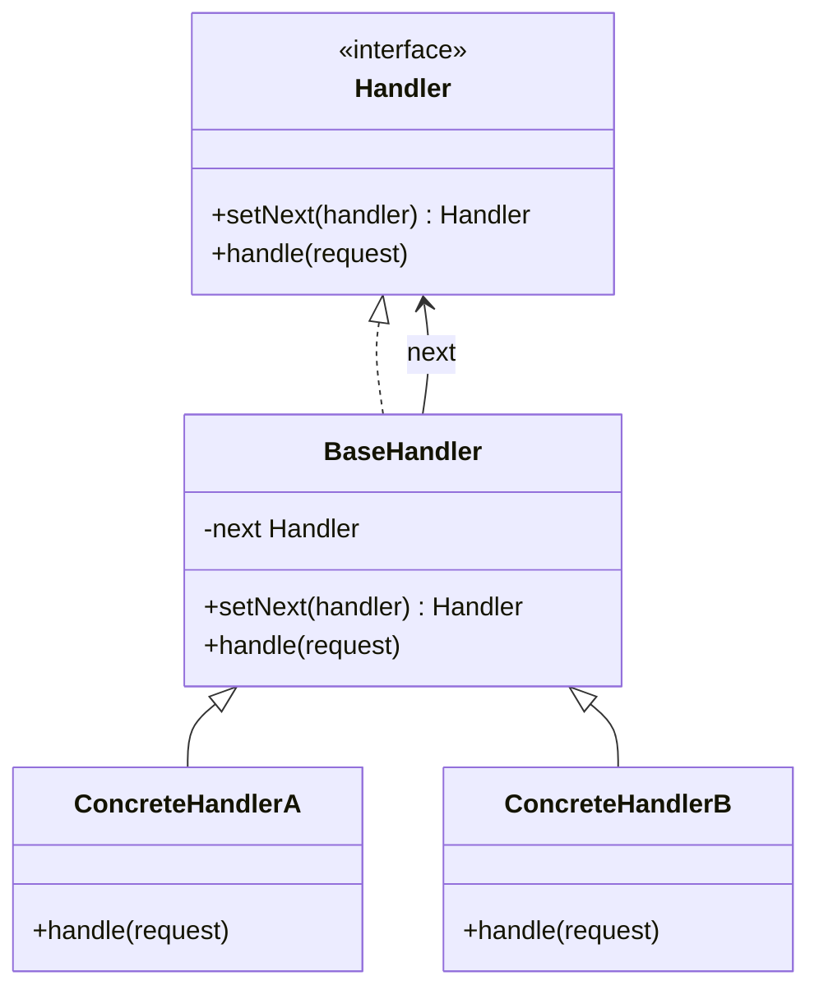
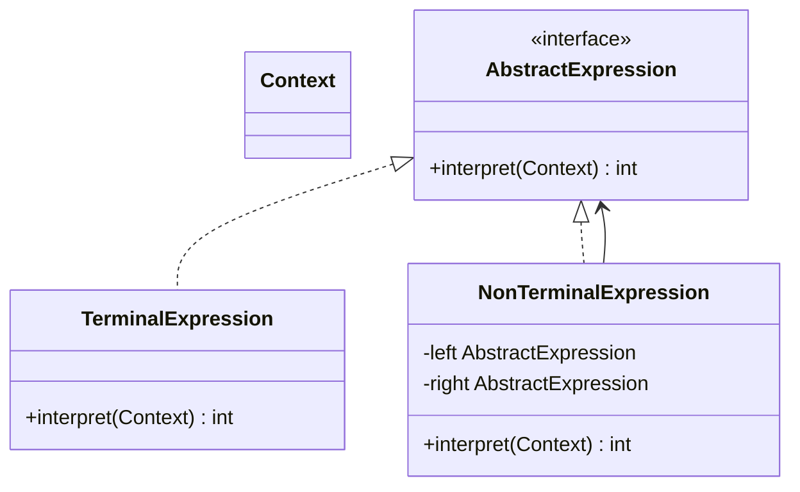
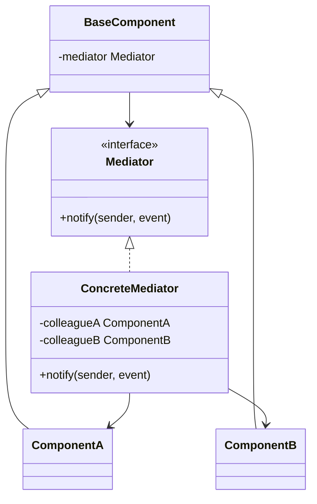
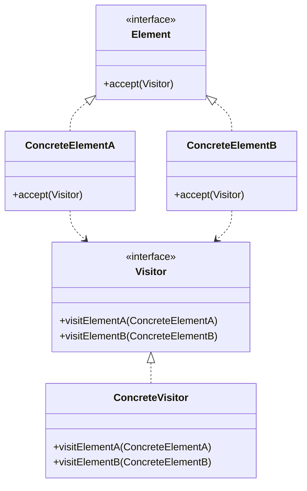

# Behavioral Patterns

> Behavioral patterns focus on algorithms and the assignment of responsibilities between objects. They describe not just patterns of objects or classes but also the patterns of communication between them.

---

## 1. Chain of Responsibility

👉 **[Detailed Guide & Interview Questions](../../design-patterns/chain-of-responsibility.md)**

### Intent
Avoid coupling the sender of a request to its receiver by giving more than one object a chance to handle the request. Chain the receiving objects and pass the request along the chain until an object handles it.

### How it Works
Handlers implement a common Handler interface or abstract class. Each handler retains a private reference to the next handler in the chain (the successor). When a request is received, the handler processes it if it matches its scope, or delegates the request to the successor if one exists.



### Pros and Cons
:::info[Trade-offs]
* **Pros:**
  * **Reduced Coupling:** Senders do not know which concrete handler will process the request.
  * **Flexibility:** Can dynamically reorder, add, or delete handlers in the chain at runtime.
  * **Single Responsibility Principle:** Isolates the decision logic of each distinct handling step.
* **Cons:**
  * **No Guarantee of Receipt:** Requests can pass through the entire chain without being processed (silently dropped).
  * **Debugging Hurdles:** It is difficult to trace requests passing through multiple handlers.
:::

### When and Why to Use
* **When:**
  * Multiple objects can handle a request, and the handler is not known beforehand.
  * You want to execute multiple sequential checks or pipelines in a specific order (e.g. authorization, caching, parsing).
* **Why:**
  * It avoids complex, nested if-else structures or switch statements that statically bind request checking logic.

### Specific Use Case
* **Java Web Filters:** Servlet `FilterChain` applies filters sequentially (logging, security, CORS, compression) to incoming HTTP requests.
* **Logging Frameworks:** Logging handlers that write to console, file, or send notifications depending on logging severity.

### Code Implementation

```java
public record SupportTicket(String id, String issue, Priority priority) {}
public enum Priority { LOW, MEDIUM, HIGH }

// Handler Abstract Class
public abstract class SupportHandler {
    private SupportHandler nextHandler;

    public SupportHandler setNext(SupportHandler nextHandler) {
        this.nextHandler = nextHandler;
        return nextHandler; // Enables builder-like chaining: h1.setNext(h2).setNext(h3)
    }

    protected void passToNext(SupportTicket ticket) {
        if (nextHandler != null) {
            nextHandler.handle(ticket);
        } else {
            System.out.println("End of chain. Ticket left unresolved: " + ticket.id());
        }
    }

    public abstract void handle(SupportTicket ticket);
}

// Concrete Handler A
public class Level1Support extends SupportHandler {
    @Override
    public void handle(SupportTicket ticket) {
        if (ticket.priority() == Priority.LOW) {
            System.out.println("L1 Support resolved ticket " + ticket.id());
        } else {
            System.out.println("L1 unable to handle. Escalating...");
            passToNext(ticket);
        }
    }
}

// Concrete Handler B
public class Level2Support extends SupportHandler {
    @Override
    public void handle(SupportTicket ticket) {
        if (ticket.priority() == Priority.MEDIUM) {
            System.out.println("L2 Support resolved ticket " + ticket.id());
        } else {
            System.out.println("L2 unable to handle. Escalating...");
            passToNext(ticket);
        }
    }
}
```

---

## 2. Command

👉 **[Detailed Guide & Interview Questions](../../design-patterns/command.md)**

### Intent
Encapsulate a request as an object, thereby letting you parameterize clients with different requests, queue or log requests, and support undoable operations.

### How it Works
Declares a Command interface with a method like `execute()` and optionally `undo()`. Concrete Command classes link a Receiver object (which does the actual work) to specific operations. The Invoker (sender) stores commands and triggers them without knowing the Receiver's internal methods.

### Pros and Cons
:::info[Trade-offs]
* **Pros:**
  * **Loose Coupling:** The class invoking the operation is decoupled from the class performing it.
  * **Extensibility (OCP):** Introducing new commands does not require editing existing client or invoker code.
  * **State Snapshot/History:** Commands can track changes and parameters, enabling undo/redo history stacks.
* **Cons:**
  * **Class Multiplication:** You need a separate concrete class for every distinct action, which increases code footprint.
:::

### When and Why to Use
* **When:**
  * You need to parameterize objects by an action to perform.
  * You want to queue, schedule, serialize, or log requests for execution later.
  * You need to support undo/redo stacks.
* **Why:**
  * By representing commands as objects, you turn actions into data structures that can be passed, stored, and audited.

### Specific Use Case
* **Java Concurrent Framework:** Java's `Runnable` and `Callable` interfaces act as commands that are passed to thread pool executors (`ExecutorService`) to run tasks asynchronously.
* **Text Editors:** Undo and Redo operations for actions like copy, paste, delete, or typing.

### Code Implementation

```java
// Command Interface
public interface Command {
    void execute();
    void undo();
}

// Receiver class containing the core logic
public class TextEditor {
    private final StringBuilder content = new StringBuilder();

    public void insert(int index, String text) { content.insert(index, text); }
    public void delete(int index, int length) { content.delete(index, index + length); }
    public String getContent() { return content.toString(); }
}

// Concrete Command
public class InsertTextCommand implements Command {
    private final TextEditor editor;
    private final int index;
    private final String text;

    public InsertTextCommand(TextEditor editor, int index, String text) {
        this.editor = editor;
        this.index = index;
        this.text = text;
    }

    @Override
    public void execute() {
        editor.insert(index, text);
    }

    @Override
    public void undo() {
        editor.delete(index, text.length());
    }
}

// Invoker Class
public class CommandHistory {
    private final Deque<Command> history = new ArrayDeque<>();

    public void executeCommand(Command command) {
        command.execute();
        history.push(command);
    }

    public void undoLast() {
        if (!history.isEmpty()) {
            Command lastCommand = history.pop();
            lastCommand.undo();
        }
    }
}
```

---

## 3. Interpreter

👉 **[Detailed Guide & Interview Questions](../../design-patterns/interpreter.md)**

### Intent
Given a language, define a representation for its grammar along with an interpreter that uses the representation to interpret sentences in the language.

### How it Works
The grammar is represented as an Abstract Syntax Tree (AST). The base Expression class specifies an `interpret(Context)` method. Terminal Expressions represent leaf nodes (literals, variables) in the tree, while Non-Terminal Expressions represent nodes containing operations (add, subtract, and) that evaluate child expressions recursively.



### Pros and Cons
:::info[Trade-offs]
* **Pros:**
  * **Easy to Extend:** Introducing new grammar rules requires creating new classes without affecting existing structures.
  * **Modular Grammar:** Decouples the syntax analysis from execution.
* **Cons:**
  * **Complexity Bloat:** For large or complex grammars, the AST grows huge and becomes difficult to maintain. Custom compilers/parser generators (like ANTLR) are much better suited for complex languages.
:::

### When and Why to Use
* **When:**
  * You need to interpret a simple, repetitive language, expression, or query structure.
  * Grammar rules are simple, and efficiency is not a critical concern.
* **Why:**
  * It maps language parsing rules to clean object-oriented hierarchies, enabling simple custom mathematical or logical evaluations.

### Specific Use Case
* **Spring Expression Language (SpEL):** Parsing and interpreting expression text variables inside Spring configurations.
* **SQL Query Parsers:** Light parsers converting text rules like `age > 18 AND country = 'US'` into SQL queries.

### Code Implementation

```java
// Context (variables/values)
public class EvaluationContext {
    private final Map<String, Integer> variables = new HashMap<>();

    public void set(String var, int val) { variables.put(var, val); }
    public int get(String var) { return variables.getOrDefault(var, 0); }
}

// Abstract Expression
public interface Expression {
    int interpret(EvaluationContext context);
}

// Terminal Expression (Variable)
public class VariableExpression implements Expression {
    private final String name;

    public VariableExpression(String name) { this.name = name; }

    @Override
    public int interpret(EvaluationContext context) {
        return context.get(name);
    }
}

// Terminal Expression (Constant)
public class NumberExpression implements Expression {
    private final int number;

    public NumberExpression(int number) { this.number = number; }

    @Override
    public int interpret(EvaluationContext context) {
        return number;
    }
}

// Non-Terminal Expression (Add)
public class AddExpression implements Expression {
    private final Expression left;
    private final Expression right;

    public AddExpression(Expression left, Expression right) {
        this.left = left;
        this.right = right;
    }

    @Override
    public int interpret(EvaluationContext context) {
        return left.interpret(context) + right.interpret(context);
    }
}
```

---

## 4. Iterator

👉 **[Detailed Guide & Interview Questions](../../design-patterns/iterator.md)**

### Intent
Provide a way to access the elements of an aggregate object sequentially without exposing its underlying representation.

### How it Works
Aggregates (collections) implement an interface declaring a method (like `iterator()`) that returns an Iterator instance. The Iterator class keeps track of the current cursor index or node. It provides methods like `hasNext()` to check progress and `next()` to return the current element and step forward.

### Pros and Cons
:::info[Trade-offs]
* **Pros:**
  * **Separation of Concerns:** Decouples collection storage from iteration algorithms.
  * **Uniform Interface:** Client code can traverse Lists, Sets, and custom Trees using the exact same API.
  * **Concurrent Iterations:** Multiple iterators can traverse the same collection instance independently at the same time.
* **Cons:**
  * **Overkill:** Adds unnecessary interface wrappers for simple collections like standard arrays or key-value pairs where index/keys are already exposed.
:::

### When and Why to Use
* **When:**
  * Your collection uses complex structures (graphs, trees, linked lists) internally, and you want to hide this complexity from clients.
  * You need to support multiple traversal algorithms (e.g. depth-first, breadth-first).
* **Why:**
  * It keeps your client code simple and prevents changes in collection internals from breaking client traversal code.

### Specific Use Case
* **Java Collections API:** The `java.util.Iterator` interface is implemented by all `Collection` types, enabling standard foreach loop capabilities (`for (T item : collection)`).
* **Database Cursors:** Sequentially fetching query rows from database drivers.

### Code Implementation

```java
// Iterator Interface
public interface SimpleIterator<T> {
    boolean hasNext();
    T next();
}

// Aggregate Interface
public interface SimpleCollection<T> {
    SimpleIterator<T> createIterator();
}

// Concrete Aggregate and Iterator
public class CustomNameList implements SimpleCollection<String> {
    private final String[] names;
    private int index = 0;

    public CustomNameList(int size) {
        names = new String[size];
    }

    public void add(String name) {
        if (index < names.length) {
            names[index++] = name;
        }
    }

    @Override
    public SimpleIterator<String> createIterator() {
        return new CustomNameListIterator();
    }

    // Inner iterator class preserves access to private fields
    private class CustomNameListIterator implements SimpleIterator<String> {
        private int cursor = 0;

        @Override
        public boolean hasNext() {
            return cursor < names.length && names[cursor] != null;
        }

        @Override
        public String next() {
            if (!hasNext()) {
                throw new NoSuchElementException();
            }
            return names[cursor++];
        }
    }
}
```

---

## 5. Mediator

👉 **[Detailed Guide & Interview Questions](../../design-patterns/mediator.md)**

### Intent
Define an object that encapsulates how a set of objects interact. Mediator promotes loose coupling by keeping objects from referring to each other explicitly, and it lets you vary their interaction independently.

### How it Works
Colleagues (components) reference only the Mediator object instead of calling each other directly. When a Colleague needs to trigger reactions in another, it calls the Mediator. The Mediator coordinates the logic and directs updates to the appropriate target Colleagues.



### Pros and Cons
:::info[Trade-offs]
* **Pros:**
  * **Loose Coupling:** Eliminates complex, multi-directional dependencies between colleague components.
  * **Centralization:** Consolidates communication logic into a single hub, making it easy to change.
* **Cons:**
  * **God Object Vulnerability:** The Mediator class can easily grow into a massive, unmaintainable monolithic controller class.
:::

### When and Why to Use
* **When:**
  * A set of objects communicate in well-defined but complex ways, resulting in a tangled web of dependencies.
  * It is difficult to reuse a component because it refers to and communicates with many other classes.
* **Why:**
  * It replaces chaotic "many-to-many" dependencies with structured "one-to-many" interactions, simplifying class design.

### Specific Use Case
* **Air Traffic Control (ATC):** Airplanes do not communicate directly with each other to coordinate landings. They coordinate only with the ATC tower (the Mediator), which schedules and coordinates all flights.
* **Spring MVC HandlerMapping:** Resolving controller mappings through centralized dispatcher registries.

### Code Implementation

```java
// Mediator Interface
public interface ChatMediator {
    void sendMessage(String msg, User user);
    void addUser(User user);
}

// Colleague Base Class
public abstract class User {
    protected final ChatMediator mediator;
    protected final String name;

    protected User(ChatMediator med, String name) {
        this.mediator = med;
        this.name = name;
    }

    public abstract void send(String msg);
    public abstract void receive(String msg);
}

// Concrete Colleague
public class ChatUser extends User {
    public ChatUser(ChatMediator med, String name) {
        super(med, name);
    }

    @Override
    public void send(String msg) {
        System.out.println(this.name + " sends: " + msg);
        mediator.sendMessage(msg, this); // Route through Mediator
    }

    @Override
    public void receive(String msg) {
        System.out.println(this.name + " received: " + msg);
    }
}

// Concrete Mediator
public class ChatRoom implements ChatMediator {
    private final List<User> users = new ArrayList<>();

    @Override
    public void addUser(User user) { users.add(user); }

    @Override
    public void sendMessage(String msg, User sender) {
        for (User u : users) {
            // Coordinate routing details (exclude sender)
            if (u != sender) {
                u.receive(msg);
            }
        }
    }
}
```

---

## 6. Memento

👉 **[Detailed Guide & Interview Questions](../../design-patterns/memento.md)**

### Intent
Without violating encapsulation, capture and externalize an object's internal state so that the object can be restored to this state later.

### How it Works
The pattern uses three roles:
1. **Originator:** The class whose state we want to save. It creates the Memento containing a snapshot of its state and uses it to restore itself.
2. **Memento:** An immutable value object holding the Originator's state. It is designed to be opaque to other classes (often implementing a private/inner class structure).
3. **Caretaker:** Manages the saved Mementos (typically in a stack for undo/redo history) but never reads or modifies their contents.

### Pros and Cons
:::info[Trade-offs]
* **Pros:**
  * **Preserves Encapsulation:** Captures object state without exposing internal variables or creating public getters and setters.
  * **Simplifies Originator:** Delegates history tracking and state recovery management to a separate Caretaker class.
* **Cons:**
  * **High Memory Consumption:** Creating and keeping copy snapshots of large objects in memory can consume significant RAM.
:::

### When and Why to Use
* **When:**
  * You need to support undo/redo actions, checkpoints, or transaction rollbacks.
  * Exposing the internal variables of an object directly would violate its encapsulation limits.
* **Why:**
  * It guarantees that state recovery logic is clean, safe, and encapsulated within the target class itself.

### Specific Use Case
* **Text Editors:** Capturing text buffers and cursor positions to support undo stacks.
* **Database Rollback Segments:** Saving data states before updates to support transactional checkpoints.

### Code Implementation

```java
// Originator
public class DocumentEditor {
    private String text;

    public void setText(String text) { this.text = text; }
    public String getText() { return text; }

    public DocumentMemento save() {
        return new DocumentMemento(text); // Capture snapshot
    }

    public void restore(DocumentMemento memento) {
        this.text = memento.state(); // Restore snapshot
    }

    // Opaque Memento Object
    public record DocumentMemento(String state) {}
}

// Caretaker
public class HistoryManager {
    private final Deque<DocumentEditor.DocumentMemento> undoStack = new ArrayDeque<>();

    public void save(DocumentEditor editor) {
        undoStack.push(editor.save());
    }

    public void undo(DocumentEditor editor) {
        if (!undoStack.isEmpty()) {
            editor.restore(undoStack.pop());
        }
    }
}
```

---

## 7. Observer

👉 **[Detailed Guide & Interview Questions](../../design-patterns/observer.md)**

### Intent
Define a one-to-many dependency so that when one object changes state, all its dependents are notified automatically.

### How it Works
The Subject maintains a list of observer references. It provides registration methods (`subscribe()`, `unsubscribe()`). When the Subject's state updates, it loops through its registered observers and calls a callback method, such as `update(data)`, on each one.

### Pros and Cons
:::info[Trade-offs]
* **Pros:**
  * **Loose Coupling:** The Subject only knows that observers implement a specific interface; it doesn't need to know their concrete classes.
  * **Open/Closed Principle:** New observers can be added without modifying the Subject's code.
  * **Real-time Notifications:** Observers are updated automatically and instantly when state changes.
* **Cons:**
  * **Memory Leaks:** If observers fail to unsubscribe, the Subject retains strong references to them, preventing garbage collection (the "lapsed listener" problem).
  * **Cascade Cascades:** Chain updates between multiple subjects/observers can cause infinite loop traps or performance drops.
:::

### When and Why to Use
* **When:**
  * A change in one object requires updating other objects, and you don't know how many objects need to change.
  * You want to implement an event-driven architecture.
* **Why:**
  * It enables reactive systems where components react to events asynchronously rather than polling for changes.

### Specific Use Case
* **Spring Application Events:** Publishing and subscribing to events using `ApplicationEventPublisher` and `@EventListener`.
* **Reactive Streams:** The JDK `Flow` API (Publisher/Subscriber model) for processing data streams reactively.

### Code Implementation

```java
// Observer Interface
public interface EventListener {
    void update(String eventType, String fileName);
}

// Subject / Publisher
public class EventManager {
    private final Map<String, List<EventListener>> listeners = new ConcurrentHashMap<>();

    public void subscribe(String eventType, EventListener listener) {
        listeners.computeIfAbsent(eventType, k -> new CopyOnWriteArrayList<>()).add(listener);
    }

    public void unsubscribe(String eventType, EventListener listener) {
        List<EventListener> users = listeners.get(eventType);
        if (users != null) {
            users.remove(listener);
        }
    }

    public void notify(String eventType, String fileName) {
        List<EventListener> users = listeners.get(eventType);
        if (users != null) {
            for (EventListener listener : users) {
                listener.update(eventType, fileName);
            }
        }
    }
}

// Concrete Observer A
public class LogListener implements EventListener {
    @Override
    public void update(String eventType, String fileName) {
        System.out.println("Log Alert: File " + fileName + " updated with action: " + eventType);
    }
}

// Concrete Observer B
public class EmailNotificationListener implements EventListener {
    @Override
    public void update(String eventType, String fileName) {
        System.out.println("Sending Email alert for file: " + fileName);
    }
}
```

---

## 8. State

👉 **[Detailed Guide & Interview Questions](../../design-patterns/state.md)**

### Intent
Allow an object to alter its behavior when its internal state changes. The object will appear to change its class.

### How it Works
The Context class represents the main object. It contains a reference to a State interface. The Context delegates all state-specific actions to its current State object. State classes implement these actions and handle state transitions by updating the Context's active State reference.

### Pros and Cons
:::info[Trade-offs]
* **Pros:**
  * **Single Responsibility Principle:** Organizes state-specific logic into clean, separate classes.
  * **Eliminates Switch Blocks:** Replaces complex nested switch/if-else logic with object-oriented delegation.
  * **Explicit Transitions:** State transitions are clearly defined and easy to find within each State class.
* **Cons:**
  * **Complexity Overhead:** For simple machines with only a couple of states and basic rules, this pattern introduces unnecessary class bloat.
:::

### When and Why to Use
* **When:**
  * An object's behavior depends on its state, and it must change its behavior at runtime based on that state.
  * You find yourself writing large, complex conditional statements checking boolean status flags across multiple methods.
* **Why:**
  * It encapsulates state behaviors, preventing code rot when adding new states or altering transition paths.

### Specific Use Case
* **E-Commerce Order Workflows:** Order lifecycles (Placing, Paid, Shipping, Completed, Refunded) where actions like `cancel()` or `addItems()` change behavior based on the current step.
* **ATM Machines:** Managing cash dispense rules depending on whether a card is inserted, authenticated, or out of cash.

### Code Implementation

```java
// State Interface
public interface PackageState {
    void next(Package pkg);
    void prev(Package pkg);
    void printStatus();
}

// Context
public class Package {
    private PackageState state = new OrderedState(); // Initial State

    public void setState(PackageState state) { this.state = state; }
    public PackageState getState() { return state; }

    public void nextState() { state.next(this); }
    public void previousState() { state.prev(this); }
    public void printStatus() { state.printStatus(); }
}

// Concrete State A
public class OrderedState implements PackageState {
    @Override
    public void next(Package pkg) {
        pkg.setState(new DeliveredState());
    }

    @Override
    public void prev(Package pkg) {
        System.out.println("The package is in its root state.");
    }

    @Override
    public void printStatus() {
        System.out.println("Package ordered, not delivered yet.");
    }
}

// Concrete State B
public class DeliveredState implements PackageState {
    @Override
    public void next(Package pkg) {
        pkg.setState(new ReceivedState());
    }

    @Override
    public void prev(Package pkg) {
        pkg.setState(new OrderedState());
    }

    @Override
    public void printStatus() {
        System.out.println("Package delivered to carrier.");
    }
}

// Concrete State C
public class ReceivedState implements PackageState {
    @Override public void next(Package pkg) { System.out.println("Package already received."); }
    @Override public void prev(Package pkg) { pkg.setState(new DeliveredState()); }
    @Override public void printStatus() { System.out.println("Package received by client."); }
}
```

---

## 9. Strategy

👉 **[Detailed Guide & Interview Questions](../../design-patterns/strategy.md)**

### Intent
Define a family of algorithms, encapsulate each one, and make them interchangeable. Strategy lets the algorithm vary independently from clients that use it.

### How it Works
The Strategy interface defines a common entry point for executing algorithms. The Context class maintains a reference to a Strategy interface and delegates execution to it. Client classes inject a concrete Strategy into the Context at runtime.

### Pros and Cons
:::info[Trade-offs]
* **Pros:**
  * **Interchangeable Algorithms:** Swap algorithms at runtime without modifying client classes.
  * **Open/Closed Principle:** Add new strategies easily without altering the Context or existing strategy classes.
  * **Eliminates Conditionals:** Replaces conditional code structures (e.g. choosing search algorithms based on size).
* **Cons:**
  * **Client Awareness:** Clients must understand how strategies differ to choose the right one for their context.
  * **Memory Overhead:** Allocates additional Strategy wrapper objects.
:::

### When and Why to Use
* **When:**
  * You need multiple variations of an algorithm (e.g., sorting, compression, tax calculation) and want to swap them dynamically.
  * You want to isolate an algorithm's execution details from the business logic of the client.
* **Why:**
  * It decouples algorithm logic, making your code easier to maintain, test, and extend.

### Specific Use Case
* **Spring Resource Loader:** The `Resource` interface encapsulates different resource loading strategies (`ClassPathResource`, `FileSystemResource`, `UrlResource`).
* **Rate Limiting:** Swapping algorithms (Token Bucket, Leaky Bucket) depending on client tier and limits.

### Code Implementation

```java
// Strategy Interface
public interface RouteStrategy {
    String buildRoute(String start, String end);
}

// Concrete Strategy A
public class RoadStrategy implements RouteStrategy {
    @Override
    public String buildRoute(String start, String end) {
        return "Road route from " + start + " to " + end + " via Highway 1.";
    }
}

// Concrete Strategy B
public class WalkingStrategy implements RouteStrategy {
    @Override
    public String buildRoute(String start, String end) {
        return "Walking path from " + start + " to " + end + " via pedestrian paths.";
    }
}

// Context
public class Navigator {
    private RouteStrategy routeStrategy;

    public void setStrategy(RouteStrategy strategy) {
        this.routeStrategy = strategy;
    }

    public void executeRoute(String start, String end) {
        if (routeStrategy == null) {
            throw new IllegalStateException("Strategy not set");
        }
        String route = routeStrategy.buildRoute(start, end);
        System.out.println("Route Output: " + route);
    }
}
```

---

## 10. Template Method

👉 **[Detailed Guide & Interview Questions](../../design-patterns/template-method.md)**

### Intent
Define the skeleton of an algorithm in an operation, deferring some steps to subclasses. Template Method lets subclasses redefine certain steps of an algorithm without changing the algorithm's structure.

### How it Works
The abstract base class defines a final method (the Template Method) that contains the fixed execution sequence. Subclasses implement the abstract primitive steps or override optional hook methods to customize specific parts of the algorithm, while leaving the overall execution sequence unchanged.

### Pros and Cons
:::info[Trade-offs]
* **Pros:**
  * **Code Reuse:** Centralizes common algorithm logic in a single base class, reducing code duplication.
  * **Subclass Customization:** Allows subclasses to override specific steps without modifying the overall process flow.
* **Cons:**
  * **Inflexible Structure:** Subclasses are tightly coupled to the parent class's skeleton structure and cannot reorder steps.
  * **Violates LSP Risk:** Overriding primitive steps incorrectly can break the invariant assumptions of the parent template.
:::

### When and Why to Use
* **When:**
  * Subclasses share identical sequence workflows, but differ in specific implementation details.
  * You want to control how subclasses extend your algorithm, exposing only specific hook points.
* **Why:**
  * It enforces a standard process sequence across different implementations while allowing them to customize details.

### Specific Use Case
* **Spring JDBC Template:** Spring manages connection, transaction, query execution, and cleanup lifecycles, while leaving data parsing to custom subclass mapper implementations.
* **HTTP Servlets:** The `HttpServlet#service` method acts as a template method, orchestrating the request lifecycle and delegating to hook methods like `doGet()` and `doPost()`.

### Code Implementation

```java
// Abstract Class defining the Template Method
public abstract class NetworkNetworkManager {
    // Final Template Method defines the fixed execution sequence
    public final boolean postMessage(String username, String password, String text) {
        if (logIn(username, password)) {
            boolean result = sendData(text.getBytes());
            logOut();
            return result;
        }
        return false;
    }

    protected abstract boolean logIn(String username, String password);
    protected abstract boolean sendData(byte[] data);
    protected abstract void logOut();
}

// Concrete Subclass A
public class TwitterNetwork extends NetworkNetworkManager {
    @Override
    protected boolean logIn(String username, String password) {
        System.out.println("Logging in to Twitter/X for: " + username);
        return true;
    }

    @Override
    protected boolean sendData(byte[] data) {
        System.out.println("Posting tweet: " + new String(data));
        return true;
    }

    @Override
    protected void logOut() {
        System.out.println("Logged out from Twitter/X.");
    }
}

// Concrete Subclass B
public class FacebookNetwork extends NetworkNetworkManager {
    @Override
    protected boolean logIn(String username, String password) {
        System.out.println("Logging in to Facebook for: " + username);
        return true;
    }

    @Override
    protected boolean sendData(byte[] data) {
        System.out.println("Posting status update: " + new String(data));
        return true;
    }

    @Override
    protected void logOut() {
        System.out.println("Logged out from Facebook.");
    }
}
```

---

## 11. Visitor

👉 **[Detailed Guide & Interview Questions](../../design-patterns/visitor.md)**

### Intent
Represent an operation to be performed on the elements of an object structure. Visitor lets you define a new operation without changing the classes of the elements on which it operates.

### How it Works
The pattern uses Double Dispatch. Element classes implement an `accept(Visitor v)` method. When called, the element passes itself to the Visitor (`v.visit(this)`). The Visitor interface defines overloaded `visit` methods for each concrete Element type.



### Pros and Cons
:::info[Trade-offs]
* **Pros:**
  * **Open/Closed Principle:** Add new operations (such as export filters, compilers, or reports) across complex hierarchies by writing new visitor classes, without changing the element classes.
  * **SRP-Compliant:** Consolidates related operations into a single class instead of spreading them across multiple elements.
* **Cons:**
  * **Rigid Object Structure:** Adding a new Element class requires updating the Visitor interface and all concrete visitor implementations.
  * **Encapsulation Violations:** Visitors often require access to elements' private variables to do their work, which can violate encapsulation.
:::

### When and Why to Use
* **When:**
  * You need to perform operations across a complex structure of objects (like a composite tree or abstract syntax tree).
  * You want to avoid polluting element classes with unrelated operations.
  * The object structure is stable (few changes or new classes), but you frequently need to add new operations.
* **Why:**
  * It allows you to separate operations from the object structures they operate on, making it easy to add new operations.

### Specific Use Case
* **Compilers (AST Parsing):** Visitor traverses abstract syntax trees (AST) to perform type checking, syntax optimization, and machine code generation.
* **Document Exporters:** Exporting a document composed of Paragraphs, Images, and Tables to formats like PDF, XML, or HTML by writing specific Visitor classes for each format.

### Code Implementation

```java
// Visitor Interface
public interface ReportVisitor {
    void visit(IndividualCustomer customer);
    void visit(EnterpriseCustomer customer);
}

// Element Interface
public interface Customer {
    void accept(ReportVisitor visitor);
}

// Concrete Element A
public class IndividualCustomer implements Customer {
    private final String name;
    private final double annualSpend;

    public IndividualCustomer(String name, double spend) {
        this.name = name;
        this.annualSpend = spend;
    }

    public String getName() { return name; }
    public double getAnnualSpend() { return annualSpend; }

    @Override
    public void accept(ReportVisitor visitor) {
        visitor.visit(this); // Double Dispatch callback
    }
}

// Concrete Element B
public class EnterpriseCustomer implements Customer {
    private final String companyName;
    private final int activeLicenses;

    public EnterpriseCustomer(String name, int licenses) {
        this.companyName = name;
        this.activeLicenses = licenses;
    }

    public String getCompanyName() { return companyName; }
    public int getActiveLicenses() { return activeLicenses; }

    @Override
    public void accept(ReportVisitor visitor) {
        visitor.visit(this); // Double Dispatch callback
    }
}

// Concrete Visitor
public class ExportVisitor implements ReportVisitor {
    @Override
    public void visit(IndividualCustomer customer) {
        System.out.printf("<individual><name>%s</name><spend>%.2f</spend></individual>%n",
            customer.getName(), customer.getAnnualSpend());
    }

    @Override
    public void visit(EnterpriseCustomer customer) {
        System.out.printf("<enterprise><company>%s</company><licenses>%d</licenses></enterprise>%n",
            customer.getCompanyName(), customer.getActiveLicenses());
    }
}
```

---

## Behavioral Patterns Quick Reference

| Pattern | Key Diagnostic Question | Common LLD Scenarios |
| :--- | :--- | :--- |
| **Chain of Responsibility** | Who handles this request? | Middleware, validation checks, request routing. |
| **Command** | Can this operation be undone, queued, or logged? | Command executors, undo/redo stacks, thread pools. |
| **Interpreter** | Do I need to parse a simple query or expression? | SQL parsers, calculation engines, grammar solvers. |
| **Iterator** | How do I traverse this collection without exposing it? | Traversing trees/graphs, cursor pagination, collection APIs. |
| **Mediator** | How do I simplify many-to-many communication? | Chat rooms, air traffic control, system controllers. |
| **Memento** | Can I save and restore snapshots of state? | Undo stacks, recovery points, transaction rollbacks. |
| **Observer** | Who needs to know when state changes? | Event publishers, UI change handlers, reactive streams. |
| **State** | Does behavior change dynamically based on status? | Document approvals, ATM states, TCP lifecycles. |
| **Strategy** | Which algorithm should execute at runtime? | Sorting choices, routing, pricing algorithms. |
| **Template Method** | Do subclasses share a workflow sequence? | Core frameworks, servlet lifecycles, database operations. |
| **Visitor** | Can I add new operations to a hierarchy without edits? | Code compilers (AST), document exporters (PDF, HTML). |

**Next →** [Concurrency — Correctness](../concurrency/correctness)
