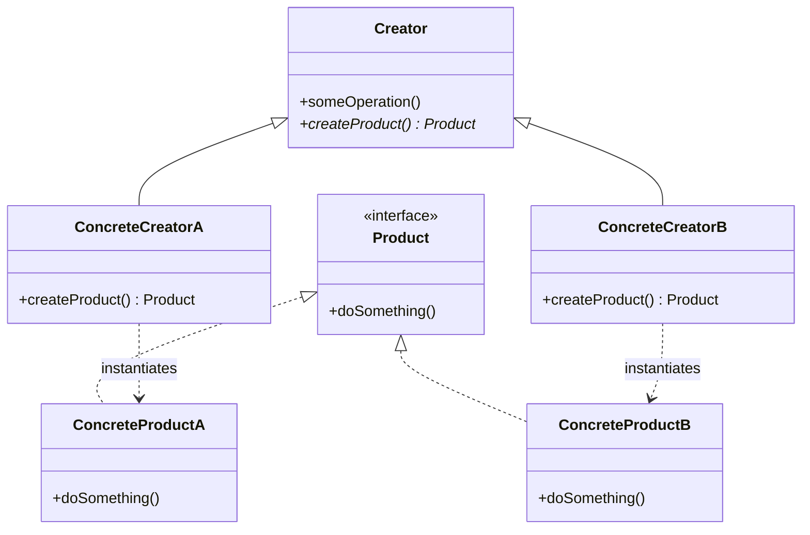

# Creational Patterns

> Creational patterns abstract the instantiation process. They help make a system independent of how its objects are created, composed, and represented. By encapsulating knowledge about which concrete classes the system uses, they hide how instances of these classes are created and put together.

---

## 1. Singleton

👉 **[Detailed Guide & Interview Questions](../../design-patterns/singleton.md)**

### Intent
Ensure a class has exactly one instance and provide a global point of access to it.

### How it Works
A Singleton class restricts direct instantiation by making its constructor private. It exposes a static method (typically `getInstance()`) that returns the single, lazily or eagerly created instance. To ensure safety across multi-threaded applications, synchronization or language-specific features (like Java `enum` structures) are used to prevent duplicate instantiation.

### Pros and Cons
:::info[Trade-offs]
* **Pros:**
  * **Controlled Access:** Strict control over how and when clients access the instance.
  * **Reduced Memory Overhead:** Avoids repeated allocation and garbage collection of expensive objects.
  * **Lazy Initialization:** The instance is only initialized when first requested (saving startup memory).
* **Cons:**
  * **Violates Single Responsibility Principle:** The class controls its own lifecycle and initialization alongside its primary business logic.
  * **Hard to Unit Test:** Global state makes it difficult to mock or isolate components during testing.
  * **Concurrency Bottleneck:** Synchronized access to a single instance can lead to thread contention in high-throughput applications.
  * **Classloader Issues:** If multiple classloaders load the class, multiple singleton instances can exist in the same JVM.
:::

### When and Why to Use
* **When:**
  * You need to manage a shared resource that must be accessed globally (e.g., database connection pool, logger, configuration manager, or hardware device driver).
  * Strict synchronization or serialized access to a shared resource is required to prevent data corruption.
* **Why:**
  * Creating multiple instances of these objects is either computationally expensive or logically incorrect (e.g., having two loggers writing to the same file concurrently).

### Specific Use Case
* **Java Standard Library:** `java.lang.Runtime#getRuntime()`, `java.awt.Desktop#getDesktop()`.
* **Spring Framework:** By default, all Spring beans are registered as singletons within the container (`ApplicationContext`), although they are managed singletons (dependency injection container ensures one instance) rather than hardcoded class-level singletons.

### Code Implementation

#### Option A: Enum Singleton (Recommended)
This is the safest and most robust way to implement a Singleton in Java, as it provides absolute guarantees against instantiation via reflection or deserialization out of the box.

```java
// ✅ Thread-safe, reflection-safe, and serialization-safe Singleton
public enum AppConfiguration {
    INSTANCE;

    private final Properties properties = new Properties();

    AppConfiguration() {
        try (InputStream input = getClass().getResourceAsStream("/app.properties")) {
            if (input != null) {
                properties.load(input);
            }
        } catch (IOException e) {
            throw new IllegalStateException("Failed to load application properties", e);
        }
    }

    public String getProperty(String key) {
        return properties.getProperty(key);
    }

    public int getIntProperty(String key, int defaultValue) {
        String val = properties.getProperty(key);
        return val != null ? Integer.parseInt(val) : defaultValue;
    }
}
```

#### Option B: Double-Checked Locking (Lazy Initialization)
Use this if you need lazy initialization and cannot use an `enum` (e.g., if you need to inherit from a base class).

```java
// ✅ Classic thread-safe lazy Singleton using double-checked locking
public final class DatabaseConnectionPool {
    // The volatile keyword is mandatory to prevent instruction reordering
    private static volatile DatabaseConnectionPool instance;
    private final List<Connection> pool;

    private DatabaseConnectionPool(int poolSize) {
        this.pool = new ArrayList<>(poolSize);
        for (int i = 0; i < poolSize; i++) {
            this.pool.add(createNewConnection());
        }
    }

    public static DatabaseConnectionPool getInstance() {
        DatabaseConnectionPool result = instance;
        if (result == null) { // First check (no locking)
            synchronized (DatabaseConnectionPool.class) {
                result = instance;
                if (result == null) { // Second check (with locking)
                    instance = result = new DatabaseConnectionPool(10);
                }
            }
        }
        return result;
    }

    private Connection createNewConnection() {
        // Mock connection creation
        return null; 
    }

    public synchronized Connection getConnection() {
        if (pool.isEmpty()) {
            throw new RuntimeException("No connections available");
        }
        return pool.remove(pool.size() - 1);
    }

    public synchronized void releaseConnection(Connection connection) {
        pool.add(connection);
    }
}
```

:::warning[Volatile Requirement]
Without the `volatile` modifier, another thread could observe a non-null but partially initialized `instance` object. This occurs because compiler optimization can reorder the memory allocation and the constructor execution.
:::

---

## 2. Factory Method

👉 **[Detailed Guide & Interview Questions](../../design-patterns/factory-method.md)**

### Intent
Define an interface for creating an object, but let subclasses decide which class to instantiate. Factory Method lets a class defer instantiation to subclasses.

### How it Works
The Creator class declares the abstract factory method that returns a Product object. Subclasses of the Creator override this factory method to return instances of Concrete Products. This decouples the client code from the concrete classes that are instantiated.



### Pros and Cons
:::info[Trade-offs]
* **Pros:**
  * **Decoupled Code:** Clients depend solely on the abstract Product interface rather than concrete product classes.
  * **Open/Closed Principle:** You can introduce new products into the system without breaking existing client code.
  * **Single Responsibility Principle:** Object creation code is isolated in one place, making the system easier to maintain.
* **Cons:**
  * **Subclass Explosion:** Clients must create a new Creator subclass for every new Product type, which can significantly inflate the class hierarchy.
:::

### When and Why to Use
* **When:**
  * A class cannot anticipate the class of objects it must create.
  * A class wants its subclasses to specify the objects it creates.
  * You want to localize and delegate object-creation responsibilities.
* **Why:**
  * It prevents hardcoding concrete types inside your core business logic, enabling runtime extensibility.

### Specific Use Case
* **Java Collections Framework:** The `iterator()` method in the `Iterable` interface (implemented by lists, sets, etc.) acts as a Factory Method. Subclasses like `ArrayList` or `HashSet` override it to return their custom iterator implementations (`ArrayList$Itr` vs `HashSet$KeyIterator`).
* **Logging Frameworks:** `LoggerFactory.getLogger()` delegating logger creation depending on configuration.

### Code Implementation

```java
// Product Interface
public interface Notification {
    void send(String recipient, String message);
}

// Concrete Product A
public class EmailNotification implements Notification {
    @Override
    public void send(String recipient, String message) {
        System.out.println("Email to " + recipient + ": " + message);
    }
}

// Concrete Product B
public class SmsNotification implements Notification {
    @Override
    public void send(String recipient, String message) {
        System.out.println("SMS to " + recipient + ": " + message);
    }
}

// Creator Interface / Abstract Class
public abstract class NotificationSender {
    // Business logic depends on Product interface, not concrete implementations
    public void dispatch(String recipient, String message) {
        Notification notification = createNotification();
        notification.send(recipient, message);
    }

    // Factory Method (abstract or with default implementation)
    protected abstract Notification createNotification();
}

// Concrete Creator A
public class EmailNotificationSender extends NotificationSender {
    @Override
    protected Notification createNotification() {
        return new EmailNotification();
    }
}

// Concrete Creator B
public class SmsNotificationSender extends NotificationSender {
    @Override
    protected Notification createNotification() {
        return new SmsNotification();
    }
}
```

---

## 3. Abstract Factory

👉 **[Detailed Guide & Interview Questions](../../design-patterns/abstract-factory.md)**

### Intent
Provide an interface for creating families of related or dependent objects without specifying their concrete classes.

### How it Works
The Abstract Factory interface defines methods for creating each of the abstract products in a family. Concrete Factories implement these methods to create concrete product instances. Client code interacts only with the Abstract Factory and Abstract Product interfaces, ensuring that objects from the same family are always used together.

### Pros and Cons
:::info[Trade-offs]
* **Pros:**
  * **Product Compatibility:** Guarantees that products created by a factory are compatible and designed to work together.
  * **Loose Coupling:** Avoids tight coupling between clients and concrete products.
  * **Consistency:** Simplifies changing product families (you swap the concrete factory instance at startup).
* **Cons:**
  * **Complex Maintenance:** Adding a new abstract product to the family requires changing the Abstract Factory interface and updating all concrete factories.
:::

### When and Why to Use
* **When:**
  * A system needs to be independent of how its products are created, composed, and represented.
  * A system needs to be configured with one of multiple product families.
  * A family of related product objects is designed to be used together, and you need to enforce this constraint.
* **Why:**
  * It prevents runtime bugs where objects from incompatible families are mixed (e.g., trying to use Windows button controls inside a macOS window container).

### Specific Use Case
* **JDBC API:** JDBC provides abstract factories for database interactions. A `java.sql.Connection` acts as an Abstract Factory which creates related database structures like `Statement`, `PreparedStatement`, and `CallableStatement` tailored to PostgreSQL, MySQL, or Oracle.

### Code Implementation

```java
// Abstract Products
public interface Button {
    void paint();
}

public interface Checkbox {
    void paint();
}

// Abstract Factory
public interface GUIFactory {
    Button createButton();
    Checkbox createCheckbox();
}

// --- Windows Family ---
public class WindowsButton implements Button {
    @Override
    public void paint() {
        System.out.println("Rendering Windows Button.");
    }
}

public class WindowsCheckbox implements Checkbox {
    @Override
    public void paint() {
        System.out.println("Rendering Windows Checkbox.");
    }
}

public class WindowsGUIFactory implements GUIFactory {
    @Override
    public Button createButton() {
        return new WindowsButton();
    }
    @Override
    public Checkbox createCheckbox() {
        return new WindowsCheckbox();
    }
}

// --- macOS Family ---
public class MacButton implements Button {
    @Override
    public void paint() {
        System.out.println("Rendering macOS Button.");
    }
}

public class MacCheckbox implements Checkbox {
    @Override
    public void paint() {
        System.out.println("Rendering macOS Checkbox.");
    }
}

public class MacGUIFactory implements GUIFactory {
    @Override
    public Button createButton() {
        return new MacButton();
    }
    @Override
    public Checkbox createCheckbox() {
        return new MacCheckbox();
    }
}

// Client Application
public class Application {
    private final Button button;
    private final Checkbox checkbox;

    public Application(GUIFactory factory) {
        this.button = factory.createButton();
        this.checkbox = factory.createCheckbox();
    }

    public void paint() {
        button.paint();
        checkbox.paint();
    }
}
```

---

## 4. Builder

👉 **[Detailed Guide & Interview Questions](../../design-patterns/builder.md)**

### Intent
Separate the construction of a complex object from its representation so that the same construction process can create different representations.

### How it Works
A Builder class provides step-by-step methods to configure an object. It maintains internal state representing the configuration. Once the configuration is complete, the client calls a `build()` method, which performs validation and returns the fully constructed, usually immutable object. 

### Pros and Cons
:::info[Trade-offs]
* **Pros:**
  * **Encapsulates Construction:** Construction steps can be postponed, executed recursively, or dynamic.
  * **Immutability:** Allows creating objects with read-only fields because parameters are set in the builder before the target object is instantiated.
  * **Readability:** Eliminates "telescoping constructors" (where developers write multiple overloaded constructors with variations of optional fields).
  * **Validation Checkpoint:** The final `build()` method serves as an excellent place to run multi-field invariant validations.
* **Cons:**
  * **Boilerplate Code:** Requires writing and maintaining a separate builder class for every target class.
  * **Memory Overhead:** Instantiating a builder object adds a minor runtime allocation overhead.
:::

### When and Why to Use
* **When:**
  * The algorithm for creating a complex object should be independent of the parts that make up the object and how they're assembled.
  * The construction process must allow different configurations of the object (optional fields).
  * The target class should be immutable once created.
* **Why:**
  * It turns error-prone constructors with dozens of parameters into a highly readable, safe, and fluent API.

### Specific Use Case
* **JDK:** `java.lang.StringBuilder#append()`, `java.net.http.HttpRequest$Builder`.
* **Lombok Library:** The popular `@Builder` annotation in Java automatically generates this boilerplate pattern at compile-time.

### Code Implementation

```java
public final class RestClientConfiguration {
    private final String baseUrl;
    private final int connectionTimeoutMs;
    private final int readTimeoutMs;
    private final Map<String, String> defaultHeaders;
    private final boolean followRedirects;

    // Private constructor enforces building via the Builder
    private RestClientConfiguration(Builder builder) {
        this.baseUrl = builder.baseUrl;
        this.connectionTimeoutMs = builder.connectionTimeoutMs;
        this.readTimeoutMs = builder.readTimeoutMs;
        this.defaultHeaders = Map.copyOf(builder.defaultHeaders);
        this.followRedirects = builder.followRedirects;
    }

    public String getBaseUrl() { return baseUrl; }
    public int getConnectionTimeoutMs() { return connectionTimeoutMs; }
    public int getReadTimeoutMs() { return readTimeoutMs; }
    public Map<String, String> getDefaultHeaders() { return defaultHeaders; }
    public boolean isFollowRedirects() { return followRedirects; }

    public static class Builder {
        private final String baseUrl; // Mandatory parameter
        private int connectionTimeoutMs = 5000; // Default values
        private int readTimeoutMs = 10000;
        private final Map<String, String> defaultHeaders = new HashMap<>();
        private boolean followRedirects = true;

        public Builder(String baseUrl) {
            if (baseUrl == null || baseUrl.isBlank()) {
                throw new IllegalArgumentException("Base URL cannot be empty");
            }
            this.baseUrl = baseUrl;
        }

        public Builder connectionTimeout(int timeoutMs) {
            this.connectionTimeoutMs = timeoutMs;
            return this;
        }

        public Builder readTimeout(int timeoutMs) {
            this.readTimeoutMs = timeoutMs;
            return this;
        }

        public Builder addHeader(String name, String value) {
            this.defaultHeaders.put(name, value);
            return this;
        }

        public Builder disableRedirects() {
            this.followRedirects = false;
            return this;
        }

        public RestClientConfiguration build() {
            // Validate cross-field constraints/invariants
            if (connectionTimeoutMs < 0 || readTimeoutMs < 0) {
                throw new IllegalStateException("Timeout settings must be non-negative");
            }
            return new RestClientConfiguration(this);
        }
    }
}

// --- Usage ---
RestClientConfiguration config = new RestClientConfiguration.Builder("https://api.example.com")
    .connectionTimeout(2000)
    .readTimeout(5000)
    .addHeader("Authorization", "Bearer TOKEN_HERE")
    .disableRedirects()
    .build();
```

---

## 5. Prototype

👉 **[Detailed Guide & Interview Questions](../../design-patterns/prototype.md)**

### Intent
Specify the kinds of objects to create using a prototypical instance, and create new objects by copying this prototype.

### How it Works
The Prototype interface declares a `clone()` method. Concrete classes implement this method, usually copying their fields into a new object. A client, rather than calling the `new` operator directly, calls `clone()` on a saved instance of the target object. A prototype registry can be used to manage a cache of preconfigured objects that are cloned on demand.

### Pros and Cons
:::info[Trade-offs]
* **Pros:**
  * **Saves Resource Allocation:** Clones preconfigured objects instantly without repeating database requests or expensive initialization logic.
  * **Decouples Concrete Classes:** The client code can clone objects without knowing their concrete types.
  * **Simplifies Subclassing:** Dynamically configures object structures rather than relying on a complex hierarchy of factories.
* **Cons:**
  * **Complex Deep Cloning:** Cloning objects with circular references or complex internal structures can be extremely difficult.
  * **Java Native Quirks:** Java's default `Cloneable` interface is widely considered broken (it doesn't define a public `clone` method, bypasses constructors, and requires checked exceptions).
:::

### When and Why to Use
* **When:**
  * System components need to copy instances at runtime, and you cannot couple the client to the concrete product classes.
  * Creating an instance is slow, resource-heavy, or depends on data dynamically loaded from outside.
  * You need many instances of a class that only differ slightly in their initial state.
* **Why:**
  * It avoids the overhead of running expensive construction operations (like disk reads, API requests, or matrix computations) when copying an object.

### Specific Use Case
* **Java APIs:** `java.lang.Object#clone()`, `java.util.Date#clone()`.
* **Spring Beans:** Beans configured with `@Scope("prototype")` generate a new instance on every lookup/injection, though this is managed via reflection/factory instantiations rather than native cloning.
* **Game Development:** Spawning enemies of the exact same class (e.g., standard soldier) with different initial coordinates.

### Code Implementation
Rather than using Java's standard `Cloneable`, this implementation uses a custom interface and a copy constructor pattern to implement deep cloning safely.

```java
// Prototype Interface
public interface Prototype<T> {
    T clone();
}

// Concrete Prototype
public class GameMonster implements Prototype<GameMonster> {
    private String name;
    private int health;
    private final List<String> skills;

    public GameMonster(String name, int health, List<String> skills) {
        this.name = name;
        this.health = health;
        this.skills = new ArrayList<>(skills); // Mutable collection
    }

    // Copy Constructor for Deep Cloning
    private GameMonster(GameMonster target) {
        this.name = target.name;
        this.health = target.health;
        // Deep copy of internal collections
        this.skills = new ArrayList<>(target.skills);
    }

    public void takeDamage(int amount) {
        this.health = Math.max(0, this.health - amount);
    }

    public void setName(String name) { this.name = name; }
    public String getName() { return name; }
    public int getHealth() { return health; }

    @Override
    public GameMonster clone() {
        return new GameMonster(this); // Safe deep copy
    }
}

// Prototype Registry
public class MonsterSpawner {
    private final Map<String, GameMonster> prototypes = new HashMap<>();

    public void register(String key, GameMonster monster) {
        prototypes.put(key, monster);
    }

    public GameMonster spawn(String key) {
        GameMonster prototype = prototypes.get(key);
        if (prototype == null) {
            throw new IllegalArgumentException("Unknown prototype: " + key);
        }
        return prototype.clone(); // Returns deep copy
    }
}
```

---

## Pattern Comparison

| Pattern | Focuses On | Configuration Timing | Key Rationale |
| :--- | :--- | :--- | :--- |
| **Singleton** | System-wide sharing | Compile-time / Startup | Protect access to shared resource. |
| **Factory Method** | Subclass-determined creation | Compile-time polymorphism | Decouple creator code from concrete product types. |
| **Abstract Factory** | Product families | Startup selection | Guarantee compatible runtime object groups. |
| **Builder** | Step-by-step construction | Dynamic / Runtime steps | Build complex, immutable objects cleanly. |
| **Prototype** | State replication | Runtime cloning | Avoid initialization cost of pre-configured states. |

**Next →** [Structural Patterns](./structural)
