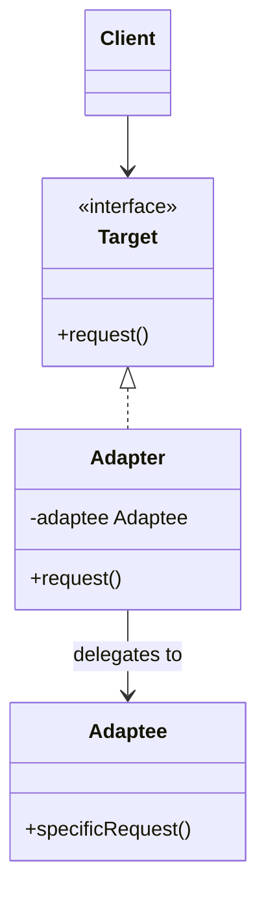
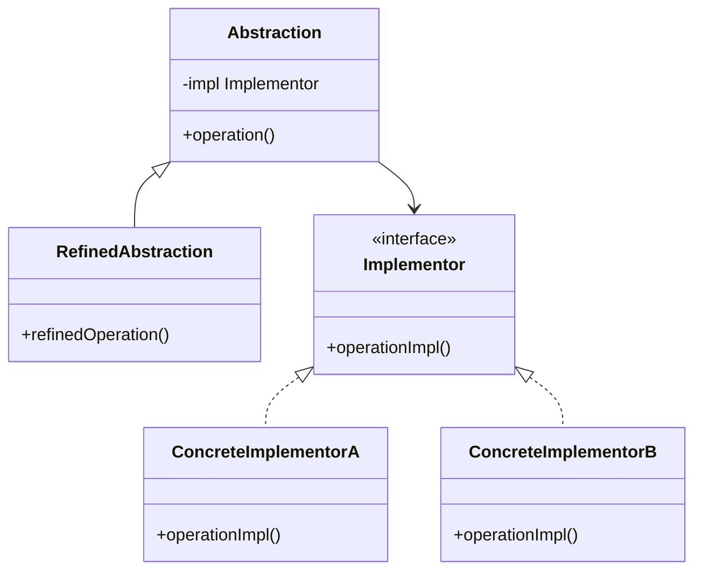
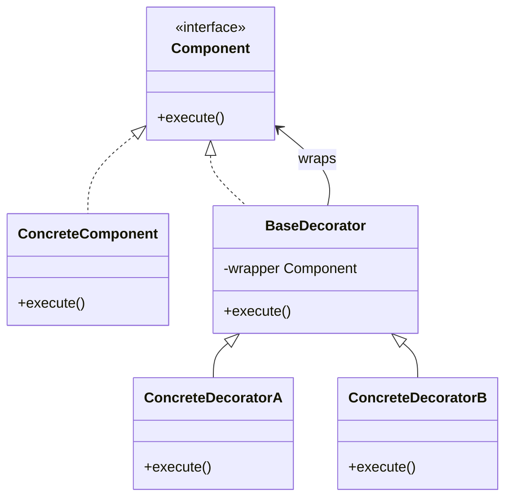
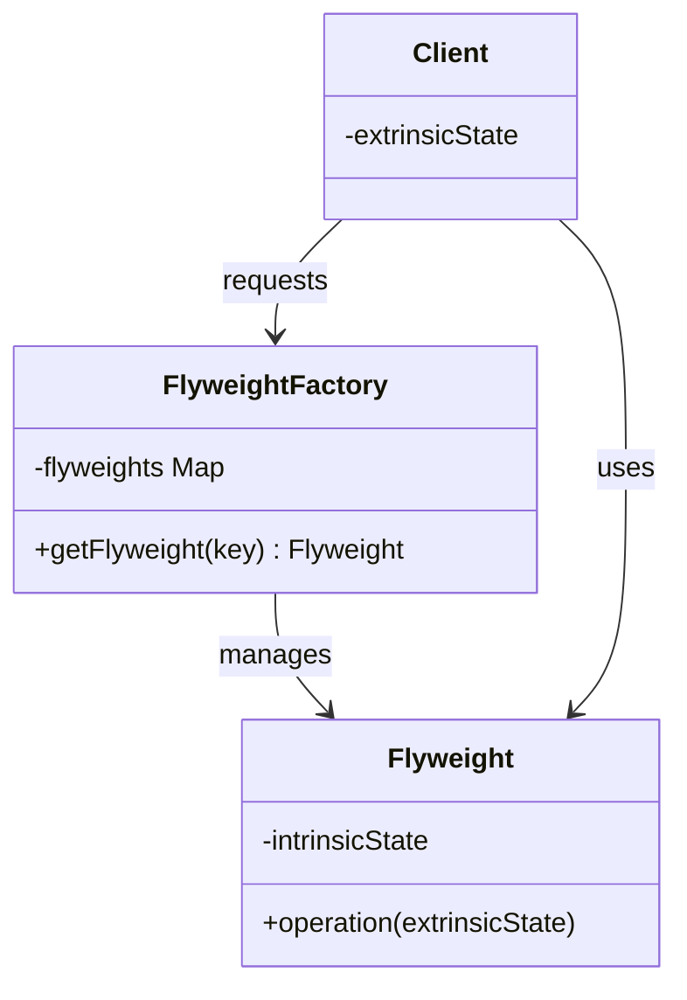

# Structural Patterns

> Structural patterns describe how classes and objects are composed to form larger structures. They use inheritance to compose interfaces or implementations, and define ways to compose objects to realize new functionality.

---

## 1. Adapter

👉 **[Detailed Guide & Interview Questions](../../design-patterns/adapter.md)**

### Intent
Convert the interface of a class into another interface that clients expect. Adapter lets classes work together that couldn't otherwise because of incompatible interfaces.

### How it Works
The Object Adapter uses composition. It implements the interface that the client expects and wraps the class with the incompatible interface (the Adaptee). When the client calls a method on the Adapter, the Adapter translates that request and forwards it to the Adaptee.



### Pros and Cons
:::info[Trade-offs]
* **Pros:**
  * **Single Responsibility Principle:** Separates the interface conversion/data translation code from the core business logic.
  * **Open/Closed Principle:** New adapters can be introduced without breaking existing client code.
* **Cons:**
  * **Increased Code Complexity:** Requires writing additional wrapper classes and interfaces, which can overcomplicate simple integrations.
:::

### When and Why to Use
* **When:**
  * You want to use an existing class, but its interface does not match the interface required by your application.
  * You are integrating third-party libraries, legacy APIs, or external services that have their own custom data contracts.
* **Why:**
  * It avoids expensive rewrites of external code or legacy systems, enabling quick integration while keeping your application's domain interfaces clean.

### Specific Use Case
* **Java Standard Library:** `java.io.InputStreamReader` adapts an `InputStream` (byte stream) to a `Reader` (character stream).
* **Payment Integration:** Adapting various third-party gateways (Stripe, PayPal, Adyen) to conform to a unified internal `PaymentProcessor` interface.

### Code Implementation

```java
// Target interface expected by client
public interface PaymentProcessor {
    PaymentResponse processPayment(PaymentRequest request);
}

public record PaymentRequest(String accountId, double amount, String currency) {}
public record PaymentResponse(String transactionId, boolean isSuccessful) {}

// Adaptee: Third-party library with an incompatible interface
public final class StripePaymentGateway {
    public StripeCharge chargeCard(String token, long amountInCents, String currencyCode) {
        // Stripe API calls
        System.out.println("Processing payment via Stripe...");
        return new StripeCharge("ch_abc123", "succeeded");
    }
}

public record StripeCharge(String chargeId, String status) {}

// Adapter class implementing the Target interface
public class StripeAdapter implements PaymentProcessor {
    private final StripePaymentGateway stripeGateway;

    public StripeAdapter(StripePaymentGateway stripeGateway) {
        this.stripeGateway = stripeGateway;
    }

    @Override
    public PaymentResponse processPayment(PaymentRequest request) {
        // Adapt request parameters
        String token = request.accountId(); // Mock mapping account to Stripe token
        long amountInCents = Math.round(request.amount() * 100);
        String currencyCode = request.currency();

        // Call incompatible adaptee method
        StripeCharge charge = stripeGateway.chargeCard(token, amountInCents, currencyCode);

        // Adapt response types
        boolean success = "succeeded".equalsIgnoreCase(charge.status());
        return new PaymentResponse(charge.chargeId(), success);
    }
}
```

---

## 2. Bridge

👉 **[Detailed Guide & Interview Questions](../../design-patterns/bridge.md)**

### Intent
Decouple an abstraction from its implementation so that the two can vary independently.

### How it Works
Instead of using inheritance to extend a class in multiple orthogonal directions, the Bridge pattern extracts one of the dimensions into a separate class hierarchy. The Abstraction class maintains a reference to an Implementation interface and delegates execution details to it.



### Pros and Cons
:::info[Trade-offs]
* **Pros:**
  * **Platform Independence:** Client code only interacts with the high-level abstraction and remains completely unaware of implementation specifics.
  * **Open/Closed Principle:** New refined abstractions and concrete implementations can be developed completely independently.
  * **Avoids Combinatorial Explosion:** Solves class hierarchy bloat that occurs when combining two independent dimensions (e.g. shapes and rendering engines).
* **Cons:**
  * **Complex Architecture:** Splitting classes into abstract and implementation lines makes the codebase harder to trace for new developers.
:::

### When and Why to Use
* **When:**
  * You want to avoid compile-time binding between an abstraction and its implementation.
  * Both the abstractions and their implementations should be extensible by subclassing.
  * Changes in the implementation of an abstraction should have no impact on clients.
* **Why:**
  * Without Bridge, subclass combinations multiply exponentially. For example, if you have `Window` types (`IconWindow`, `DialogWindow`) and `OS` types (`Windows`, `macOS`), standard inheritance would require `WindowsIconWindow`, `MacIconWindow`, `WindowsDialogWindow`, `MacDialogWindow` (4 classes). Decoupling via Bridge needs only 2 window classes and 2 OS classes (4 classes total, but scales linearly rather than exponentially).

### Specific Use Case
* **JDBC Drivers:** The JDBC driver manager provides the abstraction (`java.sql.Connection`), while databases provide vendor-specific driver implementations. Applications write SQL against the abstraction, and JDBC bridges it to the PostgreSQL, Oracle, or MySQL driver at runtime.

### Code Implementation

```java
// Implementation Hierarchy
public interface Device {
    boolean isEnabled();
    void enable();
    void disable();
    int getVolume();
    void setVolume(int percent);
}

// Concrete Implementor A
public class Television implements Device {
    private boolean on = false;
    private int volume = 30;

    @Override public boolean isEnabled() { return on; }
    @Override public void enable() { on = true; }
    @Override public void disable() { on = false; }
    @Override public int getVolume() { return volume; }
    @Override public void setVolume(int percent) { this.volume = Math.min(100, Math.max(0, percent)); }
}

// Concrete Implementor B
public class Radio implements Device {
    private boolean on = false;
    private int volume = 15;

    @Override public boolean isEnabled() { return on; }
    @Override public void enable() { on = true; }
    @Override public void disable() { on = false; }
    @Override public int getVolume() { return volume; }
    @Override public void setVolume(int percent) { this.volume = percent; }
}

// Abstraction Hierarchy
public class RemoteControl {
    protected final Device device; // The Bridge link

    public RemoteControl(Device device) {
        this.device = device;
    }

    public void togglePower() {
        if (device.isEnabled()) {
            device.disable();
        } else {
            device.enable();
        }
    }

    public void volumeDown() {
        device.setVolume(device.getVolume() - 10);
    }

    public void volumeUp() {
        device.setVolume(device.getVolume() + 10);
    }
}

// Refined Abstraction
public class AdvancedRemoteControl extends RemoteControl {
    public AdvancedRemoteControl(Device device) {
        super(device);
    }

    public void mute() {
        device.setVolume(0);
    }
}
```

---

## 3. Composite

👉 **[Detailed Guide & Interview Questions](../../design-patterns/composite.md)**

### Intent
Compose objects into tree structures to represent part-whole hierarchies. Composite lets clients treat individual objects and compositions of objects uniformly.

### How it Works
The Composite pattern declares a common Component interface containing operations applicable to both leaf elements and composites (containers). Composite classes maintain a list of child Components, delegating standard method calls to their children recursively.

### Pros and Cons
:::info[Trade-offs]
* **Pros:**
  * **Uniformity:** Clients can interact with single instances or massive branch trees using the same interface without writing type-checking conditions.
  * **Open/Closed Principle:** New component types (leaves or containers) can be added easily without altering existing client code.
* **Cons:**
  * **Difficult Type Enforcement:** It is difficult to restrict a container's children using compiler type-safety checks (e.g. preventing a folder from accepting certain file types). You must check types dynamically at runtime.
:::

### When and Why to Use
* **When:**
  * You need to build and represent part-whole hierarchies of objects (e.g., file directories, organizational structures, UI layouts).
  * You want client code to ignore the difference between compositions and individual objects.
* **Why:**
  * It eliminates repetitive, nested conditional checks (e.g., `if (node instanceof Leaf) ... else if (node instanceof Composite) ...`) across your codebase.

### Specific Use Case
* **GUI Frameworks:** Android's layout framework uses Composite. A `View` represents a leaf, and `ViewGroup` (which extends `View`) represents a composite container that holds other `View` instances.
* **HTML DOM:** The Document Object Model treats individual elements (like tags) and their container elements (like `div`) as DOM nodes.

### Code Implementation

```java
// Component Interface
public interface FileSystemEntry {
    String getName();
    long getSize();
    void print(String indentation);
}

// Leaf Node
public class File implements FileSystemEntry {
    private final String name;
    private final long size;

    public File(String name, long size) {
        this.name = name;
        this.size = size;
    }

    @Override public String getName() { return name; }
    @Override public long getSize() { return size; }

    @Override
    public void print(String indentation) {
        System.out.println(indentation + "📄 File: " + name + " (" + size + " bytes)");
    }
}

// Composite Container
public class Directory implements FileSystemEntry {
    private final String name;
    private final List<FileSystemEntry> children = new ArrayList<>();

    public Directory(String name) {
        this.name = name;
    }

    public void addEntry(FileSystemEntry entry) {
        children.add(entry);
    }

    public void removeEntry(FileSystemEntry entry) {
        children.remove(entry);
    }

    @Override public String getName() { return name; }

    @Override
    public long getSize() {
        // Recursive evaluation of children
        return children.stream().mapToLong(FileSystemEntry::getSize).sum();
    }

    @Override
    public void print(String indentation) {
        System.out.println(indentation + "📁 Directory: " + name + "/");
        for (FileSystemEntry child : children) {
            child.print(indentation + "  ");
        }
    }
}
```

---

## 4. Decorator

👉 **[Detailed Guide & Interview Questions](../../design-patterns/decorator.md)**

### Intent
Attach additional responsibilities to an object dynamically. Decorators provide a flexible alternative to subclassing for extending functionality.

### How it Works
A Decorator implements the same interface as the component it wraps. It maintains a reference to the wrapped object. When executing operations, the Decorator intercepts calls, performs custom preprocessing or postprocessing logic, and forwards execution to the underlying component.



### Pros and Cons
:::info[Trade-offs]
* **Pros:**
  * **Runtime Flexibility:** Behaviors can be dynamically wrapped, combined, and stripped at runtime.
  * **Solves Subclass Bloat:** Prevents writing dozens of static classes to handle all permutations of features.
  * **SRP-Compliant:** Breaks a bloated monolithic class down into small, highly specialized wrapper classes.
* **Cons:**
  * **Constructor Wrap Noise:** Client instantiation code becomes highly verbose due to deeply nested wrapping structures (e.g. `new A(new B(new C(object)))`).
  * **Debugging Disconnect:** It is difficult to trace issues through multiple layers of decorator delegations, and the intermediate wrapped objects lose their concrete identity.
:::

### When and Why to Use
* **When:**
  * You need to add responsibilities to individual objects dynamically and transparently, without affecting other objects.
  * Subclassing is impractical due to class explosion or because the base class is locked (`final`).
* **Why:**
  * It supports dynamic compositions of cross-cutting concerns (e.g., buffering, compression, logging, authorization, caching) on top of raw classes.

### Specific Use Case
* **Java I/O Classes:** Classes like `java.io.BufferedReader` and `java.io.BufferedInputStream` act as decorators. You construct them by passing an underlying input stream, adding caching/reading optimization dynamically.

### Code Implementation

```java
// Component Interface
public interface MessageService {
    void send(String body);
}

// Concrete Component
public class BaseMessageService implements MessageService {
    @Override
    public void send(String body) {
        System.out.println("Sending message: " + body);
    }
}

// Base Decorator
public abstract class MessageDecorator implements MessageService {
    protected final MessageService wrapped;

    protected MessageDecorator(MessageService messageService) {
        this.wrapped = messageService;
    }

    @Override
    public void send(String body) {
        wrapped.send(body);
    }
}

// Concrete Decorator A - Encryption
public class EncryptingMessageDecorator extends MessageDecorator {
    public EncryptingMessageDecorator(MessageService messageService) {
        super(messageService);
    }

    @Override
    public void send(String body) {
        String encrypted = Base64.getEncoder().encodeToString(body.getBytes());
        System.out.println("[Encryption Layer Activated]");
        super.send(encrypted);
    }
}

// Concrete Decorator B - Compression
public class CompressingMessageDecorator extends MessageDecorator {
    public CompressingMessageDecorator(MessageService messageService) {
        super(messageService);
    }

    @Override
    public void send(String body) {
        String compressed = body.substring(0, Math.min(body.length(), 5)) + "...[compressed]";
        System.out.println("[Compression Layer Activated]");
        super.send(compressed);
    }
}

// --- Usage ---
// Message -> Compress -> Encrypt -> Send
MessageService service = new EncryptingMessageDecorator(
    new CompressingMessageDecorator(
        new BaseMessageService()
    )
);
```

---

## 5. Facade

👉 **[Detailed Guide & Interview Questions](../../design-patterns/facade.md)**

### Intent
Provide a simplified interface to a complex subsystem of classes.

### How it Works
Subsystems contain many interconnected classes executing low-level tasks. A Facade wraps these complex components and exposes high-level, simplified methods (e.g. `startSystem()`). The client calls only the Facade, which coordinates and invokes the underlying classes.

### Pros and Cons
:::info[Trade-offs]
* **Pros:**
  * **Simplifies API:** Insulates client code from the inner complexities and APIs of a subsystem.
  * **Decoupling:** Decreases dependencies between client applications and complex subsystems, adhering to the Law of Demeter.
* **Cons:**
  * **Risk of God Object:** If not managed properly, a Facade can grow to couple with nearly every component in the system, violating SRP.
:::

### When and Why to Use
* **When:**
  * You need to provide a simple, default interface to a complex subsystem.
  * Subsystems undergo internal structure changes frequently, and you want to prevent these changes from breaking client code.
  * You want to layer your subsystems (creating facades for communications between layers).
* **Why:**
  * It shields consumers from dealing with raw initialization steps, sequence requirements, and complex dependency configurations.

### Specific Use Case
* **Spring JDBC Template:** Spring provides `JdbcTemplate` as a facade over raw JDBC logic. Instead of writing connection pooling, resource cleanups, try-catch statements, and mapping logic manually, clients simply execute `jdbcTemplate.queryForObject(...)`.

### Code Implementation

```java
// Complex Subsystem Component A
public class VideoConverter {
    public void convert(String file, String format) {
        System.out.println("Converting video " + file + " to " + format);
    }
}

// Complex Subsystem Component B
public class AudioExtractor {
    public void extractAudio(String file) {
        System.out.println("Extracting audio tracks from " + file);
    }
}

// Complex Subsystem Component C
public class BitrateCompressor {
    public void compress(String file, int targetBitrate) {
        System.out.println("Compressing " + file + " down to " + targetBitrate + "kbps");
    }
}

// Facade
public class MediaProcessingFacade {
    private final VideoConverter converter = new VideoConverter();
    private final AudioExtractor extractor = new AudioExtractor();
    private final BitrateCompressor compressor = new BitrateCompressor();

    public void processMediaForMobile(String filePath) {
        System.out.println("Initiating optimized mobile transcoding pipeline...");
        extractor.extractAudio(filePath);
        converter.convert(filePath, "mp4");
        compressor.compress(filePath, 128);
        System.out.println("Pipeline completed successfully.");
    }
}
```

---

## 6. Flyweight

👉 **[Detailed Guide & Interview Questions](../../design-patterns/flyweight.md)**

### Intent
Use sharing to support large numbers of fine-grained objects efficiently.

### How it Works
The Flyweight pattern splits object properties into two forms:
1. **Intrinsic State:** Constant properties shared by all objects of the same type. These are stored inside the Flyweight instances.
2. **Extrinsic State:** Unique properties that change per instance (such as coordinates). Clients store these externally and pass them to the Flyweight methods as parameters at runtime.

A Flyweight Factory maintains a cache pool of Flyweights, ensuring clients reuse existing instances instead of creating duplicates.



### Pros and Cons
:::info[Trade-offs]
* **Pros:**
  * **Drastic Memory Savings:** Saves megabytes of RAM when rendering or tracking millions of active objects (like particles, trees, or characters in simulations).
  * **Fewer Garbage Collections:** Lowers allocation rate, reducing runtime pauses caused by GC.
* **Cons:**
  * **CPU vs Memory Trade-off:** Looking up flyweights in a factory or calculating/passing extrinsic state incurs a minor CPU cost.
  * **Convoluted Architecture:** Makes codebase more complex by splitting logical properties across different locations.
:::

### When and Why to Use
* **When:**
  * An application uses an extremely large number of objects.
  * Storage costs are high because of the quantity.
  * Most of an object's state can be made extrinsic.
  * The application does not require unique identity for every object (since instances are shared).
* **Why:**
  * Without Flyweight, programs allocating millions of structures (e.g., game entities) will run out of memory or degrade CPU performance due to heap exhaustion.

### Specific Use Case
* **Java Constant Caches:** `Integer.valueOf(int)` caches and shares instances of `Integer` between `-128` and `127`.
* **String Interning:** The JVM uses a String Pool (`String#intern()`) to ensure identical string literals share the same reference.

### Code Implementation

```java
// Flyweight Class containing Intrinsic State
public final class ParticleType {
    private final String name;
    private final String color;
    private final String texture;

    public ParticleType(String name, String color, String texture) {
        this.name = name;
        this.color = color;
        this.texture = texture;
    }

    // Extrinsic state (x, y coordinates, speed) is passed as arguments
    public void draw(int x, int y, double speed) {
        System.out.printf("Drawing %s (Color: %s) at (%d, %d) traveling at %.1f m/s%n",
            name, color, x, y, speed);
    }
}

// Flyweight Factory
public class ParticleFactory {
    private static final Map<String, ParticleType> cache = new HashMap<>();

    public static ParticleType getParticleType(String name, String color, String texture) {
        String key = name + "_" + color + "_" + texture;
        return cache.computeIfAbsent(key, k -> {
            System.out.println("Allocating new ParticleType in memory: " + name);
            return new ParticleType(name, color, texture);
        });
    }
}

// Client Class containing Extrinsic State and Flyweight reference
public class Particle {
    private final int x;
    private final int y;
    private final double speed;
    private final ParticleType type; // Shared reference

    public Particle(int x, int y, double speed, ParticleType type) {
        this.x = x;
        this.y = y;
        this.speed = speed;
        this.type = type;
    }

    public void display() {
        type.draw(x, y, speed);
    }
}
```

---

## 7. Proxy

👉 **[Detailed Guide & Interview Questions](../../design-patterns/proxy.md)**

### Intent
Provide a surrogate or placeholder for another object to control access to it.

### How it Works
A Proxy acts as an intermediary. It implements the exact same interface as the Real Subject, maintaining a private reference to it. When clients call the Proxy, it executes custom logic (such as caching, checking permissions, logging, or lazy initialization) before or after forwarding the call to the Real Subject.

### Pros and Cons
:::info[Trade-offs]
* **Pros:**
  * **Lifecycle Management:** Controls when a resource is initialized (lazy initialization).
  * **Security and Access Control:** Prevents unauthorized execution without altering the downstream services.
  * **Transparent Integration:** Works seamlessly because the client interacts with the interface, not the concrete proxy.
* **Cons:**
  * **Additional Overhead:** Adds a layer of indirection, which may introduce minor network/CPU latencies.
  * **Complex Construction:** Dynamic code generation (like JDK dynamic proxies) can be difficult to inspect and trace.
:::

### When and Why to Use
* **When:**
  * **Virtual Proxy:** Instantiating the real object is resource-heavy, and you want to delay creation until it's actually used.
  * **Protection Proxy:** You need to enforce execution access controls (e.g. user roles) before invoking methods.
  * **Caching Proxy:** Call results are stable, and you want to intercept calls to return cached data.
* **Why:**
  * It injects cross-cutting concerns (security, transactions, caching) without modifying or bloating core business classes.

### Specific Use Case
* **Spring AOP:** Declarative transaction management (`@Transactional`) wraps beans inside dynamic proxy objects that open transactions before running method calls and commit/rollback afterwards.
* **Hibernate:** Relational entities with lazy loading associations are replaced by runtime Hibernate Proxy classes that fetch details from the database only when getter methods are called.

### Code Implementation

```java
// Subject Interface
public interface VideoService {
    String downloadVideo(String videoId);
}

// Real Subject
public class YouTubeVideoService implements VideoService {
    @Override
    public String downloadVideo(String videoId) {
        System.out.println("Connecting to YouTube APIs for " + videoId + "...");
        // Network/parsing costs
        return "Video-Data-Stream-for-" + videoId;
    }
}

// Caching Proxy
public class CachingVideoProxy implements VideoService {
    private final VideoService youtubeService;
    private final Map<String, String> cache = new ConcurrentHashMap<>();

    public CachingVideoProxy(VideoService youtubeService) {
        this.youtubeService = youtubeService;
    }

    @Override
    public String downloadVideo(String videoId) {
        return cache.computeIfAbsent(videoId, id -> {
            System.out.println("Cache Miss. Requesting download for: " + id);
            return youtubeService.downloadVideo(id);
        });
    }
}
```

---

## Quick Reference

| Pattern | Structural Goal | Key Diagnostic Question |
| :--- | :--- | :--- |
| **Adapter** | Interface translation | "I have class X but the code expects interface Y." |
| **Bridge** | Decoupling API from implementation | "I need abstractions and implementations to scale independently." |
| **Composite** | Uniform tree traversal | "I need to treat folders and files identically." |
| **Decorator** | Runtime feature wrapping | "I want to dynamically combine logging, caching, and encryption." |
| **Facade** | Simplifying complex interfaces | "This subsystem has 15 classes; callers need 1 simple call." |
| **Flyweight** | Sharing immutable state | "My app allocates 10 million nodes and is running out of memory." |
| **Proxy** | Intercepting execution | "I need to transparently add security, lazy-loading, or caching." |

**Next →** [Behavioral Patterns](./behavioral)
