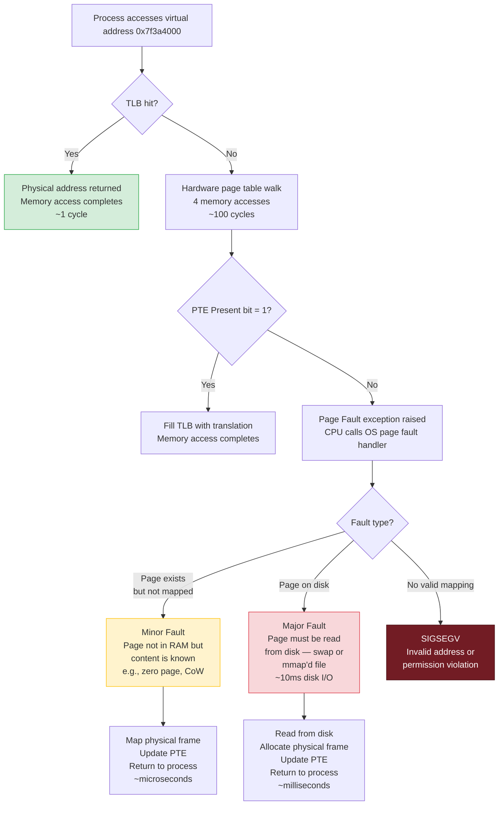
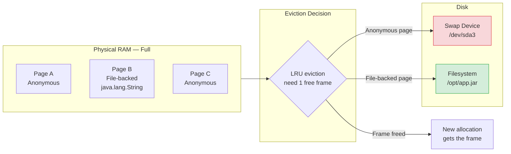
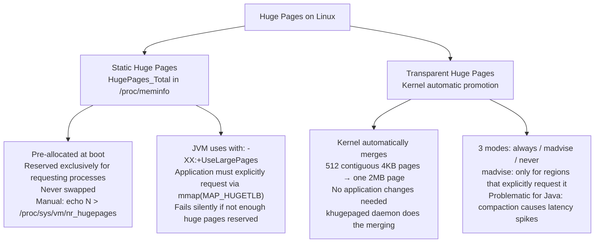

# Virtual Memory — Deep Dive

> **Virtual memory** is the OS abstraction that gives every process the illusion of having exclusive access to a large, flat, contiguous address space — independent of how much physical RAM actually exists or how it is fragmented. The OS, with hardware assistance, translates virtual addresses to physical addresses on every memory access, transparently multiplexing physical RAM among all running processes.

Understanding virtual memory is foundational for diagnosing latency spikes, OOM kills, GC pause anomalies, and performance degradation under memory pressure — all common in production Java services.

:::info[Who this guide is for]
- **New learners** — start at [The Hotel Analogy](#the-hotel-analogy) and [How Paging Works](#how-paging-works-the-core-mechanism).
- **Senior engineers** — jump to [TLB and Huge Pages](#tlb-and-huge-pages), [NUMA Architecture](#numa-non-uniform-memory-access), [OOM Killer Internals](#oom-killer), [JVM Memory Model](#jvm-and-virtual-memory), or [Production Tuning](#production-linux-memory-tuning).
:::

---

## The Hotel Analogy

A hotel has 200 rooms (physical RAM). It accepts reservations for 500 future guests (virtual address space — overcommit). Most guests never show up, or only need the room for short periods.

**Without virtual memory (pre-1960s):** Every program must know and hard-code the exact physical memory addresses it will use. Program A uses addresses 0–4KB. Program B must use addresses 4KB–8KB. If B uses A's address — crash. Only one program can run at a time safely.

**With virtual memory:** The hotel has a **room assignment book** (the page table). Every guest thinks they have Room 1, Room 2, Room 3... The front desk silently translates: "Guest A's Room 1 is actually physical Room 47. Guest B's Room 1 is actually physical Room 103." Guests never know or care. They never interact with each other.

If a guest asks for Room 50 (page fault) and the hotel is full, the manager moves the least-recently-used guest's belongings to storage (swap), frees the room, and puts the new guest there. The evicted guest will eventually be brought back when they next arrive.

The **MMU (Memory Management Unit)** is the front desk — it does the translation on every single memory access, in hardware, with nanosecond speed.

---

## Virtual Address Space Layout (Linux x86-64)

Every process on a 64-bit Linux system sees the same **virtual address space** — a 128TB range for user code and 128TB for the kernel. The actual physical addresses behind these virtual ones change constantly and are invisible to the process.

```
0xFFFFFFFFFFFFFFFF ┌────────────────────────────┐
                   │  Kernel Space (128 TB)      │ ← Inaccessible to user code
                   │  kernel text, data, stacks  │   SIGSEGV on access attempt
0xFFFF800000000000 ├────────────────────────────┤
                   │  Non-canonical hole         │ ← Hardware limitation;
                   │  (unmapped by architecture) │   no valid addresses here
0x00007FFFFFFFFFFF ├────────────────────────────┤
                   │  Stack                      │ ← grows downward ↓
                   │  (per-thread, ASLR-placed)  │   guard page at bottom
                   ├────────────────────────────┤
                   │  ↕ unmapped gap             │
                   ├────────────────────────────┤
                   │  mmap / shared libs region  │ ← .so files, JVM code cache,
                   │  (grows downward ↓)         │   anonymous mmap, JIT code
                   ├────────────────────────────┤
                   │  ↕ unmapped gap             │
                   ├────────────────────────────┤
                   │  Heap                       │ ← malloc/new; grows upward ↑
                   │  (brk() boundary)           │   JVM manages its own heap
                   ├────────────────────────────┤
                   │  BSS segment                │ ← Uninitialized global vars
                   │                             │   zeroed by OS at startup
                   ├────────────────────────────┤
                   │  Data segment               │ ← Initialized global vars
                   │                             │   e.g., static String KEY = "abc"
                   ├────────────────────────────┤
0x0000000000400000 │  Text segment (code)        │ ← Read-only, executable
                   │  + rodata (constants)       │   shared between processes
0x0000000000000000 └────────────────────────────┘
```

**For a Java process, the mapping looks like:**

```
mmap region contains:
    libjvm.so         — JVM native code
    libc.so           — C standard library
    JIT-compiled code — generated at runtime into mmap'd memory
    Code cache        — (-XX:ReservedCodeCacheSize, default 240MB)
    Metaspace         — class metadata (since Java 8)

Heap region:
    JVM requests a large contiguous mmap() for -Xmx
    e.g., java -Xmx4g: reserves 4GB virtual address space
    Physical RAM only allocated as the JVM actually uses pages (lazy)
```

```bash
# Inspect a running Java process's memory map
jps -l                    # Find PID
cat /proc/<PID>/maps      # All virtual memory regions
pmap -x <PID>             # Formatted: address, RSS, PSS, mapping name

# Key columns in pmap output:
# Kbytes: virtual size reserved
# RSS:    Resident Set Size — how much is in physical RAM right now
# PSS:    Proportional Set Size — RSS divided by sharing factor
```

---

## How Paging Works: The Core Mechanism

### The Page Table

The OS maintains a **page table** per process — a data structure that maps virtual page numbers to physical frame numbers. On x86-64, the page table is a 4-level (or 5-level on modern CPUs) radix tree, indexed by parts of the virtual address.

```
Virtual Address (64 bits):
┌─────────────┬────────────┬────────────┬────────────┬────────────┬────────────┐
│ Unused (16b)│ PML4 (9b)  │ PDPT (9b)  │  PD (9b)   │  PT (9b)   │ Offset(12b)│
└─────────────┴────────────┴────────────┴────────────┴────────────┴────────────┘

Translation:
    PML4 index → PML4 table entry → physical addr of PDPT table
    PDPT index → PDPT entry       → physical addr of PD table
    PD index   → PD entry         → physical addr of PT table
    PT index   → PT entry         → physical frame number
    Offset     → byte within 4KB page

4 memory accesses for one address translation (without TLB)
→ This is why the TLB cache is critical for performance
```

### What a Page Table Entry (PTE) Contains

```
64-bit Page Table Entry:
Bit 63:    XD (Execute Disable) — if set, code cannot execute from this page
Bits 62-52: Available for OS use (e.g., accessed time, software dirty bit)
Bits 51-12: Physical frame address (the actual RAM location)
Bit 11-9:  Available for OS use
Bit 8:     Global — don't flush from TLB on context switch
Bit 7:     Page Size — for 2MB/1GB huge pages
Bit 6:     Dirty — page has been written to
Bit 5:     Accessed — page has been read or written recently
Bit 4:     PCD (Page Cache Disable)
Bit 3:     PWT (Page Write Through)
Bit 2:     U/S (User/Supervisor) — 0=kernel only, 1=user accessible
Bit 1:     R/W — 0=read-only, 1=read-write
Bit 0:     Present — if 0, accessing this page triggers a page fault
```

### The Page Fault Lifecycle



**Minor vs. Major page faults in Java:**

```bash
# Watch page faults for a running JVM process in real time
pidstat -r -p <PID> 1

# Output:
# minflt/s  majflt/s   VSZ       RSS       %MEM  Command
# 1523.00     0.00    4194304   2097152    26.3   java    ← Minor faults during heap growth
#    0.00    12.00    4194304   2097152    26.3   java    ← Major faults = disk reads = latency spike!

# Major faults during JVM startup: loading class files from jar
# Major faults during GC: touching cold heap regions swapped to disk
# Goal: major faults = 0 during steady-state operation
```

---

## Address Space Layout Randomization (ASLR)

ASLR randomizes the base addresses of stack, heap, and mmap regions on each process execution, making it computationally infeasible for attackers to predict where to inject code.

```
Without ASLR:                    With ASLR (level 2):
  Stack: always at 0x7fffffffe000   Stack: 0x7ffd3a21e000 (random each run)
  Heap:  always at 0x555555559000   Heap:  0x5629f4c3b000 (random each run)
  libc:  always at 0x7ffff7a00000   libc:  0x7f3e8a100000 (random each run)
```

```bash
# ASLR levels:
cat /proc/sys/kernel/randomize_va_space
# 0 = disabled (rare; debugging only)
# 1 = partial (stack, mmap randomized; heap not randomized)
# 2 = full (stack, heap, mmap all randomized) ← default and recommended

# Disable ASLR for a single process (debugging, reproducible crashes):
setarch $(uname -m) -R java -jar app.jar
# Or:
echo 0 | sudo tee /proc/sys/kernel/randomize_va_space  # Global, dangerous
```

**ASLR and Java:** The JVM respects ASLR. JIT-compiled code, the JVM itself, and native libraries are all loaded at randomized addresses. This makes heap dump analysis harder (addresses differ between runs) but is correct security practice. Use `-XX:+PrintFlagsFinal | grep Address` to see ASLR-affected base addresses in a specific JVM run.

---

## Swap Space

When physical RAM is fully utilized and more memory is needed, the kernel evicts **cold pages** (least recently used) to a **swap space** on disk (or compressed in RAM), freeing physical frames for new allocations.

### What Gets Swapped

```
Two categories of pages, treated differently:

Anonymous pages (heap, stack, malloc'd memory):
    Cannot be re-read from any file — they contain live process data
    Must be written to swap before the frame can be reused
    → Expensive: requires disk write (swap out) AND disk read on next access (swap in)

File-backed pages (code, mmap'd files, loaded JARs):
    Can always be re-read from the original file
    Simply evicted without writing to swap
    On next access: re-read from the file (major page fault)
    → Cheaper: no swap write needed; just re-read from source
```



### Swap Types Compared

| Type | Location | Speed | Use Case |
|---|---|---|---|
| **Swap partition** | Raw disk partition | Disk I/O speed | Traditional; predictable performance |
| **Swap file** | Regular file on filesystem | Similar to partition | More flexible; can resize without repartitioning |
| **zswap** | Compressed in-RAM cache | RAM speed (5–10× faster than disk) | Absorbs swap bursts; falls back to disk |
| **zram** | Compressed RAM block device | RAM speed | Containers, low-memory environments; no disk I/O |

```bash
# Show active swap spaces
swapon --show
# NAME       TYPE      SIZE   USED PRIO
# /dev/sda3  partition  16G   2.1G   -2
# /dev/zram0 partition   8G   512M  100   ← zram (compressed RAM)

# Monitor swap activity in real time
vmstat 1
# si: pages swapped IN  per second (disk → RAM) — high = bad latency
# so: pages swapped OUT per second (RAM → disk) — sustained = memory pressure

# See which processes are using swap
for f in /proc/*/status; do
    awk '/VmSwap|Name/{printf $2 " " $3 "\n"}' $f
done | sort -k2 -rn | head -20
```

### Swappiness Tuning

`vm.swappiness` controls the balance between evicting anonymous pages (swap-out) versus evicting file-backed page cache (drop cached files).

```
swappiness = 0:   Never swap anonymous pages; drop file cache first
swappiness = 60:  Default. Balanced.
swappiness = 100: Swap aggressively; prefer keeping file cache

For Java services:
    vm.swappiness = 1
    Reason: JVM heap pages being swapped to disk cause multi-second GC pauses
            and latency spikes (major page faults on heap access during GC)
            "1" (not 0) allows emergency swapping to prevent OOM
```

```bash
# Temporary (lost on reboot):
sysctl -w vm.swappiness=1

# Permanent:
echo "vm.swappiness=1" >> /etc/sysctl.d/99-java-tuning.conf
sysctl -p /etc/sysctl.d/99-java-tuning.conf

# Verify:
cat /proc/sys/vm/swappiness
```

---

## OOM Killer

When the system has exhausted both RAM and swap — and no more memory can be reclaimed — the kernel's **Out-Of-Memory killer** selects and kills a process to free memory. Understanding how it selects victims is critical for production systems.

### The OOM Score Calculation

```
OOM Score (0–1000) is calculated per-process:

Base score = (process RSS / total RAM) × 1000
             → A process using 10% of RAM starts with score 100

Adjustments:
    + score for:  root processes (slight penalty), processes using lots of swap
    - score for:  processes with oom_score_adj = -1000 (fully protected)

Manual adjustment via /proc/PID/oom_score_adj (-1000 to +1000):
    -1000 = NEVER kill this process (disable OOM killer for it)
     -500 = Significant protection
        0 = No adjustment (default)
     +500 = More likely to be killed
    +1000 = Kill this process first
```

```bash
# View current OOM scores for all processes
ps -eo pid,comm,rss --sort=-rss | head -20 | while read pid comm rss; do
    score=$(cat /proc/$pid/oom_score 2>/dev/null || echo "N/A")
    echo "PID=$pid COMM=$comm RSS=${rss}KB OOM_SCORE=$score"
done

# Protect a critical Java service from OOM kill
echo -500 > /proc/$(pgrep -f "order-service")/oom_score_adj

# Make a less critical process die first (before the important service)
echo 800 > /proc/$(pgrep -f "batch-job")/oom_score_adj

# Set oom_score_adj at JVM startup (persists for the life of the process)
# From systemd service file:
# OOMScoreAdjust=-500
```

### Docker / Kubernetes OOM Behavior

```
In containers, the cgroup memory controller has its own OOM killer:

docker run --memory=512m myapp
    → cgroup memory.limit_in_bytes = 512MB
    → When container uses > 512MB:
      → cgroup OOM killer fires (only affects processes inside the cgroup)
      → Kills the largest process in the container
      → Container exit code: 137 (SIGKILL = 128 + 9)
      → Docker: "Exited (137)"
      → Kubernetes: "OOMKilled" in pod events

NOT the same as system-wide OOM kill — it is contained within the cgroup
```

```yaml
# Kubernetes — set memory limits to enable OOM kill (otherwise pod balloons)
resources:
  requests:
    memory: "512Mi"    # Scheduler uses this for placement
  limits:
    memory: "1Gi"      # cgroup sets memory.limit_in_bytes = 1GB
                       # Container OOM-killed if it exceeds this
```

```bash
# Detect OOM kill events
# System-wide:
dmesg | grep -i "out of memory\|killed process\|oom_kill"
journalctl -k --since "1 hour ago" | grep -i OOM

# Kubernetes pod OOM events:
kubectl describe pod <pod-name> | grep -A5 "OOMKilled"
kubectl get events --field-selector reason=OOMKilling

# Java heap dump before OOM (critical for debugging):
# Add to JVM flags:
# -XX:+HeapDumpOnOutOfMemoryError
# -XX:HeapDumpPath=/dumps/
# -XX:+ExitOnOutOfMemoryError   ← Exit and let k8s restart rather than hang
```

### OOM Killer Selection: Walkthrough

```
Scenario: System has 16GB RAM, all used. Cannot free more. OOM killer fires.

Processes by OOM score:
    PID 100: java order-service    RSS=4GB   oom_score_adj=-500   → score=~140
    PID 200: java payment-service  RSS=2GB   oom_score_adj=-500   → score=~75
    PID 300: bash                  RSS=4MB   oom_score_adj=0      → score=~0
    PID 400: java batch-importer   RSS=8GB   oom_score_adj=+800   → score=~1300 (KILLED)
    PID 500: nginx                 RSS=200MB oom_score_adj=-1000  → score=-1000 (PROTECTED)

Winner: PID 400 (batch-importer) — highest effective score
    → SIGKILL sent to PID 400
    → 8GB freed immediately
    → System can continue
```

---

## TLB and Huge Pages

### The TLB (Translation Lookaside Buffer)

The page table requires 4 memory accesses per translation. Without caching, every memory access would require 5 accesses total (4 for translation + 1 for the actual data) — a 5× slowdown. The **TLB** is a small, extremely fast cache inside the CPU that stores recent virtual → physical translations.

```
TLB sizes (typical modern CPU):
    L1 TLB (data): 64 entries       → covers 64 × 4KB = 256KB at 4KB pages
    L2 TLB:        1024–4096 entries → covers 4MB–16MB at 4KB pages

JVM heap = 4GB
    At 4KB pages:  4GB / 4KB = 1,048,576 pages
    L2 TLB covers: ~16MB
    Result: TLB covers 0.4% of heap → 99.6% of heap accesses are TLB misses
            Each miss = 4 extra memory accesses + ~100 CPU cycles

JVM heap = 4GB
    At 2MB huge pages: 4GB / 2MB = 2,048 pages
    L2 TLB covers: 4096 × 2MB = 8GB → entire heap fits in TLB!
    Result: near-zero TLB misses → significant throughput improvement
```

**Measured impact of huge pages on JVM:**
- Throughput improvement: 5–15% on typical workloads
- GC pause reduction: 10–30% (GC traverses the entire heap — fewer TLB misses = faster traversal)
- Most impactful on heap sizes > 2GB

### Huge Pages Types



### THP Modes and When to Use Each

```bash
cat /sys/kernel/mm/transparent_hugepage/enabled
# [always] madvise never

# For Java / databases — use madvise or never:
echo madvise > /sys/kernel/mm/transparent_hugepage/enabled
# madvise: only promote pages where the app calls madvise(MADV_HUGEPAGE)
# JVM does NOT call madvise by default → effectively disabled for heap

echo never > /sys/kernel/mm/transparent_hugepage/enabled
# Fully disabled — recommended for latency-sensitive Java workloads

# Also disable defrag (prevents background compaction latency):
echo defer+madvise > /sys/kernel/mm/transparent_hugepage/defrag
# or:
echo never > /sys/kernel/mm/transparent_hugepage/defrag
```

**Why THP is problematic for Java:**

```
THP promotion latency:
    khugepaged scans for 512 contiguous 4KB pages to merge
    When found: acquires page lock on all 512 pages, copies to 2MB frame
    During this: any GC thread touching those pages must WAIT
    → Latency spike: 10ms to 100ms, unpredictable, appears as "GC pause"
       but is actually THP compaction

THP demotion latency:
    When a huge page is partially freed (e.g., GC collected some objects)
    Kernel must split 2MB page back into 512 4KB pages
    → More latency: page lock contention

JVM G1GC region sizes (1–32MB) don't align with 2MB THP boundaries
→ Fragmented promotions → worse than no THP at all
```

### Static Huge Pages for Java (Production Setup)

```bash
# Step 1: Calculate how many 2MB huge pages you need
# Formula: ceil(-Xmx / 2MB) + 10% buffer
# For -Xmx 8g: ceil(8192 / 2) + 10% = 4505 huge pages

# Step 2: Reserve huge pages (do before JVM starts — reserved at boot)
# In /etc/sysctl.conf (persistent):
echo "vm.nr_hugepages=4505" >> /etc/sysctl.conf

# Or runtime (may fail if memory is fragmented):
echo 4505 > /proc/sys/vm/nr_hugepages

# Step 3: Verify allocation
grep -i hugepage /proc/meminfo
# HugePages_Total:    4505
# HugePages_Free:     4505   ← All free before JVM starts
# HugePages_Rsvd:        0
# Hugepagesize:       2048 kB (2MB)

# Step 4: Start JVM with huge page flags
java \
    -Xms8g -Xmx8g \
    -XX:+UseLargePages \          # Enable huge pages
    -XX:LargePageSizeInBytes=2m \ # 2MB pages (default on x86)
    -XX:+UseTransparentHugePages \ # Use THP API (alternative approach)
    -jar app.jar

# Verify huge pages are being used by the JVM:
grep -i hugepage /proc/meminfo
# HugePages_Free:      505    ← 4000 pages now in use by JVM
```

```java
// Spring Boot actuator — expose huge page usage as a metric
@Component
public class HugePageMetrics implements MeterBinder {

    @Override
    public void bindTo(MeterRegistry registry) {
        Gauge.builder("jvm.hugepages.total", this, m -> readMemInfo("HugePages_Total"))
                .description("Total reserved huge pages")
                .register(registry);
        Gauge.builder("jvm.hugepages.free", this, m -> readMemInfo("HugePages_Free"))
                .description("Free huge pages")
                .register(registry);
        Gauge.builder("jvm.hugepages.used", this,
                m -> readMemInfo("HugePages_Total") - readMemInfo("HugePages_Free"))
                .description("Huge pages in use by JVM")
                .register(registry);
    }

    private double readMemInfo(String key) {
        try {
            return Files.lines(Path.of("/proc/meminfo"))
                    .filter(l -> l.startsWith(key))
                    .findFirst()
                    .map(l -> Double.parseDouble(l.split("\\s+")[1]))
                    .orElse(0.0);
        } catch (IOException e) {
            return 0.0;
        }
    }
}
```

---

## NUMA: Non-Uniform Memory Access

### The Problem NUMA Solves

Modern servers have multiple CPU sockets. Each socket has its own memory controller and its own bank of RAM. Accessing RAM local to the socket is fast; accessing RAM on another socket requires crossing the **QPI (Intel)** or **Infinity Fabric (AMD)** interconnect — 1.5–2× slower.

```
Dual-socket server:

Socket 0                           Socket 1
┌─────────────────────┐            ┌─────────────────────┐
│  CPUs 0–15          │            │  CPUs 16–31          │
│  (16 cores)         │            │  (16 cores)          │
├─────────────────────┤ ◄──QPI──► ├─────────────────────┤
│  Local RAM: 64GB    │            │  Local RAM: 64GB    │
│  Latency: ~80ns     │            │  Latency: ~80ns     │
│                     │            │                     │
│  Remote RAM access  │            │  Remote RAM access  │
│  (via QPI): ~150ns  │            │  (via QPI): ~150ns  │
└─────────────────────┘            └─────────────────────┘

Total system RAM: 128GB
NUMA nodes: 2
Cross-NUMA latency penalty: ~87% higher than local access
```

```bash
# Inspect NUMA topology
numactl --hardware
# Output:
# available: 2 nodes (0-1)
# node 0 cpus: 0 1 2 3 4 5 6 7 8 9 10 11 12 13 14 15
# node 0 size: 65536 MB
# node 0 free: 32144 MB
# node 1 cpus: 16 17 18 19 20 21 22 23 24 25 26 27 28 29 30 31
# node 1 size: 65536 MB
# node 1 free: 31892 MB
# node distances:
#        node   0   1
#          0:  10  21    ← local = 10, remote = 21 (2.1× slower)
#          1:  21  10

# Monitor NUMA allocation patterns
numastat
# Per-node allocation stats: numa_hit, numa_miss, numa_foreign
# numa_miss: allocations that FAILED to be local (requested node 0, got node 1)
# Goal: numa_miss should be near zero

# Real-time NUMA statistics per process:
numastat -p <PID>
```

### NUMA Allocation Policies

```bash
# Default policy: "local" — allocate on the node where the thread is running
# This is usually what you want

# Run an entire Java service on a specific NUMA node (socket 0 only):
numactl --cpunodebind=0 --membind=0 java -Xmx32g -jar order-service.jar
# Limits: CPUs to socket 0 (CPUs 0–15), Memory to node 0 RAM (64GB)
# Benefit: all memory accesses are local → no cross-QPI traffic
# Trade-off: only 16 CPUs available, only 64GB RAM usable

# For a service that spans both sockets:
numactl --interleave=all java -Xmx64g -jar analytics-service.jar
# Interleave: allocate pages round-robin across all NUMA nodes
# Benefit: no single node becomes a bottleneck under parallel workloads
# Trade-off: 50% of allocations are remote
```

### NUMA-Aware JVM Configuration

```bash
# Enable NUMA-aware Java heap allocation (G1GC, Parallel GC)
java \
    -Xms16g -Xmx16g \
    -XX:+UseNUMA \           # Enable NUMA-aware allocation
    -XX:+UseParallelGC \     # Parallel GC has best NUMA support
    # or with G1GC:
    -XX:+UseG1GC \
    # G1GC NUMA support: allocates Eden regions on the NUMA node
    # where the allocating thread runs — reduces remote access for young gen
    -jar app.jar

# What -XX:+UseNUMA does:
#   Young generation (Eden): allocated on the NUMA node of the mutator thread
#   Old generation: interleaved across all nodes (less locality-sensitive)
#   GC threads: pinned to nodes — GC thread on node 0 only scans node 0 memory
```

```java
// Detect NUMA topology from Java (using JVM flags inspection)
@Service
public class NumaAwarenessService {

    private static final Logger log = LoggerFactory.getLogger(NumaAwarenessService.class);

    @PostConstruct
    public void reportNumaConfig() {
        RuntimeMXBean runtime = ManagementFactory.getRuntimeMXBean();
        boolean numaEnabled = runtime.getInputArguments()
                .contains("-XX:+UseNUMA");

        log.info("NUMA-aware JVM: {}", numaEnabled);
        log.info("Available processors: {}", Runtime.getRuntime().availableProcessors());

        // Check if we're numa-bound via numactl
        try {
            ProcessBuilder pb = new ProcessBuilder("numactl", "--show");
            Process p = pb.start();
            String output = new String(p.getInputStream().readAllBytes());
            log.info("NUMA policy:\n{}", output);
        } catch (IOException e) {
            log.debug("numactl not available");
        }
    }
}
```

---

## Memory Overcommit

Linux allows processes to `malloc()`/`mmap()` more memory than physically available, counting on the fact that most allocated but never touched virtual memory (e.g., a `malloc(100MB)` that only writes 10MB) never needs physical backing.

```
Overcommit modes (vm.overcommit_memory):

Mode 0 — Heuristic (default):
    Allow overcommit, but use heuristics to detect clearly unreasonable requests
    malloc(1TB) on a 16GB machine → ENOMEM (rejected)
    malloc(20GB) on a 16GB machine → permitted (might succeed)
    Heuristic: if request > (available RAM + swap × overcommit_ratio), reject

Mode 1 — Always overcommit:
    Never fail malloc() regardless of system memory state
    Used by: Redis (it forks for RDB snapshots — needs 2× the memory virtually)
    Risk: processes can be killed by OOM killer unexpectedly since malloc never fails

Mode 2 — Never overcommit:
    Fail malloc() if: request > (swap + RAM × overcommit_ratio/100)
    Strict: no overcommit at all
    Use for: high-assurance systems where OOM kill is unacceptable
    Trade-off: some programs that rely on overcommit may fail to start

For Java services:
    Mode 0 (default) is fine
    -Xmx4g reserves 4GB virtual; actual physical grows as heap is used
    Java's conservative memory model doesn't rely on overcommit tricks
```

```bash
cat /proc/sys/vm/overcommit_memory   # Current mode (0, 1, or 2)
cat /proc/sys/vm/overcommit_ratio    # % of RAM for mode 2 (default 50)

# Check how much the system is currently committed
grep -i "commitlimit\|committed_as" /proc/meminfo
# CommitLimit:   33554432 kB   ← Max total commitment allowed (mode 2)
# Committed_AS:  12345678 kB   ← Total committed by all processes (virtual)
```

---

## `/proc/meminfo` — Reading the Memory Map

```bash
cat /proc/meminfo
```

| Field | Meaning | What It Tells You |
|---|---|---|
| `MemTotal` | Total physical RAM | Baseline |
| `MemFree` | Completely unused RAM | Low is normal (Linux uses free RAM as cache) |
| `MemAvailable` | RAM available for new processes | **Use this, not MemFree** — includes reclaimable cache |
| `Buffers` | Kernel I/O buffers | Metadata cache for block devices |
| `Cached` | Page cache (file data) | Recently read files; reclaimable under pressure |
| `SwapCached` | Pages in both swap and RAM | Pages that were swapped out and then back in |
| `Active` | Recently used pages | Less likely to be reclaimed |
| `Inactive` | Not recently used | Reclaim candidates — pages here first |
| `AnonPages` | Anonymous memory (heap, stack) | Process heap + stack RSS |
| `Dirty` | Modified pages not yet written to disk | High = I/O flush risk |
| `Writeback` | Pages currently being written to disk | If high + sustained = I/O bottleneck |
| `Shmem` | Shared memory + tmpfs | Docker overlay filesystems use this heavily |
| `SReclaimable` | Reclaimable kernel slab memory | Dentries, inodes — can be freed under pressure |
| `HugePages_Total` | Pre-allocated huge pages | Should match JVM huge page needs |
| `HugePages_Free` | Unused huge pages | Zero if JVM is using all of them |

```bash
# Watch memory pressure evolution in real time
watch -n1 'grep -E "MemAvailable|AnonPages|Cached|SwapCached|Dirty|HugePages" /proc/meminfo'

# Memory pressure indicator: MemAvailable dropping while AnonPages growing
# → Java heap growing OR another process consuming RAM
# Swap involvement: SwapCached > 0 → some pages have been to swap
```

---

## JVM and Virtual Memory

The JVM has its own memory model layered on top of Linux virtual memory. Understanding the interaction prevents misdiagnosis of memory issues. For a detailed, comprehensive block diagram illustrating the JVM's On-Heap vs. Off-Heap/Native Memory regions, see the [JVM Memory Layout Section](../java/java-jvm.md#2-on-heap-vs-off-heap-memory-layout).

### JVM Memory Regions and OS Mapping

```
JVM process virtual address space:

Region                  JVM Flag              OS Mapping
─────────────────────────────────────────────────────────────────
Java Heap (Young+Old)   -Xmx / -Xms           mmap(MAP_ANONYMOUS)
Metaspace               -XX:MaxMetaspaceSize   mmap(MAP_ANONYMOUS)
Code Cache (JIT)        -XX:ReservedCodeCacheSize mmap(MAP_ANONYMOUS | PROT_EXEC)
Thread Stacks           -Xss (per thread)      mmap(MAP_ANONYMOUS) per thread
Direct Buffers          ByteBuffer.allocateDirect() mmap(MAP_ANONYMOUS)
Off-Heap (Unsafe)       Unsafe.allocateMemory()  malloc() → mmap internally
Native Libraries        JNI .so files          mmap(MAP_SHARED) — shared
JVM itself (libjvm.so)  [always loaded]        mmap(MAP_SHARED) — shared
```

```bash
# Full JVM memory accounting (native memory tracking)
java -XX:+NativeMemoryTracking=summary \
     -XX:NativeMemoryTracking=detail \
     -jar app.jar &

# Query the breakdown (shows all JVM memory regions):
jcmd <PID> VM.native_memory summary
# Output:
# Total: reserved=8192MB, committed=4096MB
#
#        Java Heap (reserved=4096MB, committed=2048MB)
#                    (mmap: reserved=4096MB, committed=2048MB)
#
#           Class (reserved=1024MB, committed=52MB)
#                    (classes #8423)
#                    (malloc=2MB #12456)
#                    (mmap: reserved=1022MB, committed=50MB)
#
#          Thread (reserved=256MB, committed=256MB)
#                    (thread #256)
#                    (stack: reserved=256MB, committed=256MB)
#
#            Code (reserved=240MB, committed=58MB)
#                    (mmap: reserved=240MB, committed=58MB)
#
#            ...
```

### Container Memory Limits and the JVM

The most common production misconfiguration: running the JVM inside a container without telling it about the memory limit.

```
Container memory limit: 2GB
JVM launched without flags: java -jar app.jar

Pre-Java 10 behavior:
    JVM reads /proc/meminfo → sees host machine's 128GB
    Sets default -Xmx = 128GB / 4 = 32GB
    JVM allocates 32GB heap → container OOMKilled at 2GB → exit code 137

Java 10+ with -XX:+UseContainerSupport (default ON):
    JVM reads cgroup memory limits → sees 2GB container limit
    Sets default -Xmx = 2GB / 4 = 512MB (MaxRAMFraction=4)
    OR: -XX:MaxRAMPercentage=75.0 → Xmx = 1.5GB

Recommended Kubernetes Java container flags:
    java \
      -XX:+UseContainerSupport \         # On by default Java 10+
      -XX:MaxRAMPercentage=75.0 \        # Heap = 75% of container limit
      -XX:InitialRAMPercentage=50.0 \    # Start heap at 50% (reduce startup RSS)
      -XX:MinRAMPercentage=25.0 \        # Minimum heap floor
      -XX:+ExitOnOutOfMemoryError \      # Crash fast, let k8s restart
      -XX:+HeapDumpOnOutOfMemoryError \  # Dump before dying
      -XX:HeapDumpPath=/dumps/ \
      -jar app.jar
```

```yaml
# Docker Compose — ensure limits are set
services:
  order-service:
    image: order-service:latest
    mem_limit: 2g
    mem_reservation: 1g
    environment:
      JAVA_OPTS: >
        -XX:+UseContainerSupport
        -XX:MaxRAMPercentage=75.0
        -XX:+ExitOnOutOfMemoryError
        -XX:+HeapDumpOnOutOfMemoryError
        -XX:HeapDumpPath=/dumps/
```

### GC and Virtual Memory Interaction

```
G1GC regions and page faults:

G1GC divides heap into equal-sized regions (1MB–32MB each)
At startup with -Xms < -Xmx:
    JVM reserves virtual address space for -Xmx (e.g., 8GB)
    Physical RAM only committed as G1 assigns regions

First GC cycle touching a previously-uncommitted region:
    → Minor page fault (zero page) — fast, ~1µs
    → Physical frame allocated, zeroed, mapped to virtual page

G1GC uncommit empty regions (Java 12+, -XX:+G1PeriodicGCInvokesConcurrent):
    → JVM returns physical RAM to OS via madvise(MADV_FREE/MADV_DONTNEED)
    → Reduces RSS between load spikes
    → Next allocation on that region: minor page fault again

For containers where RSS limits are strict:
    -Xms == -Xmx    → Pre-commit all heap at start, no page faults during operation
                    → Higher initial RSS but no GC-pause-inducing page faults

For containers where startup RSS matters:
    -Xms < -Xmx    → Lower initial RSS, but page faults as heap grows
                    → Use -XX:+AlwaysPreTouch to pre-touch all pages at startup
```

---

## Memory Reclaim and Kernel Internals

### Page Reclaim: What kswapd Does

```mermaid
graph TD
    WaterMark{Free memory check\n(kswapd wakes up)}

    WaterMark -->|Free > pages_high| Idle[kswapd sleeps]
    WaterMark -->|Free < pages_low| Reclaim[Page reclaim loop]

    Reclaim --> Order1[1. Inactive file-backed pages\nDrop clean pages immediately\nWrite dirty pages → disk]
    Order1 --> Order2[2. Inactive anonymous pages\nWrite to swap → free frame]
    Order2 --> Order3[3. Active pages\nMove to inactive list, try again]
    Order3 --> Order4[4. Slab caches\nFree reclaimable dentries/inodes]
    Order4 --> OOM[5. Still not enough?\nTrigger OOM killer]

    style OOM fill:#f8d7da,stroke:#dc3545
```

```bash
# Monitor page reclaim activity
cat /proc/vmstat | grep -E "pgpgin|pgpgout|pswpin|pswpout|pgfault|pgmajfault"
# pgfault:   total minor faults
# pgmajfault: total major faults (disk reads) — should be near 0 in steady state
# pswpin:    pages swapped in from disk
# pswpout:   pages swapped out to disk

# kswapd CPU usage (should be near 0; high = constant memory pressure)
ps aux | grep kswapd
```

### Dirty Page Writeback

Pages modified by processes (dirty pages) must be written to disk eventually. The kernel batches these writes.

```bash
# Dirty page thresholds:
sysctl vm.dirty_ratio           # 20 (default) — max % of RAM that can be dirty
                                #   At this limit: writes BLOCK until flushed
sysctl vm.dirty_background_ratio # 10 (default) — kswapd starts flushing at this %
                                #   Below this: async background writeback

# For latency-sensitive Java services (reduce dirty page buildup):
sysctl -w vm.dirty_ratio=5
sysctl -w vm.dirty_background_ratio=2
# Result: dirtying starts sooner but in smaller bursts → more consistent I/O latency

# How long a dirty page can exist before being force-flushed:
sysctl vm.dirty_expire_centisecs  # 3000 = 30 seconds (default)
sysctl vm.dirty_writeback_centisecs # 500 = 5 seconds (writeback wakeup interval)
```

---

## Production Linux Memory Tuning

### Complete Java Service Tuning Checklist

```bash
# ── Swap ─────────────────────────────────────────────────────────────────
sysctl -w vm.swappiness=1                    # Minimize swap for Java
sysctl -w vm.vfs_cache_pressure=50           # Default; balance file cache

# ── Dirty pages ──────────────────────────────────────────────────────────
sysctl -w vm.dirty_ratio=10
sysctl -w vm.dirty_background_ratio=5

# ── OOM protection ───────────────────────────────────────────────────────
echo -500 > /proc/$(pgrep -f "order-service")/oom_score_adj

# ── Huge pages ───────────────────────────────────────────────────────────
echo never > /sys/kernel/mm/transparent_hugepage/enabled   # THP off for Java
echo never > /sys/kernel/mm/transparent_hugepage/defrag
echo 4505 > /proc/sys/vm/nr_hugepages                      # Static huge pages

# ── NUMA ────────────────────────────────────────────────────────────────
numactl --cpunodebind=0 --membind=0 java -Xmx32g \
    -XX:+UseNUMA \
    -XX:+UseLargePages \
    -jar service.jar

# ── Persistent tuning (/etc/sysctl.d/99-java.conf) ───────────────────────
cat > /etc/sysctl.d/99-java.conf << 'EOF'
vm.swappiness = 1
vm.dirty_ratio = 10
vm.dirty_background_ratio = 5
vm.nr_hugepages = 4505
vm.min_free_kbytes = 131072
EOF
sysctl -p /etc/sysctl.d/99-java.conf
```

### Memory Diagnostic Commands Reference

```bash
# ── System-level ─────────────────────────────────────────────────────────
free -h                              # Quick: total/used/free/cache/swap
vmstat 1 5                           # si/so = swap activity; bi/bo = block I/O
iostat -x 1 5                        # Disk I/O (swap device saturation)
sar -r 1 5                           # Memory utilization history
cat /proc/meminfo                    # Detailed kernel memory breakdown

# ── Per-process ──────────────────────────────────────────────────────────
pmap -x <PID>                        # Virtual/RSS/PSS per mapping
cat /proc/<PID>/smaps_rollup         # Aggregate RSS, PSS, dirty, swap
pidstat -r -p <PID> 1                # Real-time faults (minor/major per sec)
/usr/bin/time -v java -jar app.jar   # Peak RSS + major fault count

# ── JVM-specific ─────────────────────────────────────────────────────────
jstat -gcutil <PID> 1000             # GC utilization (heap %s, pause times)
jcmd <PID> VM.native_memory summary  # All JVM memory regions
jmap -heap <PID>                     # Heap configuration and usage
jmap -histo <PID> | head -30        # Object histogram (top memory consumers)
jstack <PID>                         # Thread dump (stuck threads)
```

---

## Interview Decision Matrix

| Question | Concise Answer |
|---|---|
| **MemFree vs. MemAvailable** | `MemFree` = truly unused RAM. `MemAvailable` = free + reclaimable cache. On a healthy server, MemFree ≈ 0 is normal — the kernel uses all RAM as cache. Use MemAvailable to assess whether a new process can be started. |
| **Minor vs. major page fault** | Minor: page exists in memory (CoW, zero page, already loaded) — microseconds. Major: page must be read from disk (swap-in, mmap file reload) — milliseconds. Major faults during steady-state operation = memory pressure. |
| **Why disable THP for Java?** | THP compaction (khugepaged merging 4KB → 2MB pages) acquires page locks, causing unpredictable latency spikes that appear as GC pauses. JVM region sizes (G1GC) don't align with 2MB boundaries. Use static huge pages instead for TLB benefit without the compaction noise. |
| **Why swappiness=1 for Java?** | JVM heap pages swapped to disk cause multi-second major page faults during GC traversal. Setting swappiness=1 makes the kernel strongly prefer dropping file cache over touching heap — keeping the JVM in RAM. Not 0 because emergency swapping is still needed to prevent OOM kills. |
| **How does cgroup OOM differ from system OOM?** | cgroup OOM kills only processes within the specific cgroup (container) that exceeded its memory limit. System OOM kills any process system-wide. Docker/Kubernetes use cgroup OOM — container exit code 137, pod status "OOMKilled". |
| **What is NUMA and when does it matter?** | NUMA = multi-socket servers where remote socket memory is 1.5–2× slower. Matters when: a JVM is large enough to span both NUMA nodes, GC threads traverse memory on the remote node. Fix: `numactl --membind=0` to pin to one node, or `-XX:+UseNUMA` for NUMA-aware allocation. |
| **Why does -Xmx=4g not mean 4GB RSS?** | `-Xmx` reserves virtual address space (cheap), not physical RAM. Physical RAM is only committed as the JVM actually writes to heap pages. RSS = physical pages currently in RAM = actual heap in use, not the reserved max. |
| **How does the OOM killer choose its victim?** | By `oom_score`: based on RSS / total RAM (×1000), modified by `oom_score_adj`. Set `oom_score_adj=-1000` to protect critical services, `+500` to make expendable batch jobs die first. |

:::tip[Interview Phrasing — Swap and Java]
*"For latency-sensitive Java services, I always set `vm.swappiness=1` on the host. The reason: when the JVM's heap pages get swapped to disk — even a few hundred MB — the next GC cycle that needs to traverse those pages triggers major page faults, each costing ~10ms of disk I/O. A GC pass that should take 50ms can take 5 seconds if heap is on swap. Setting swappiness to 1 (not 0, to allow emergency swapping) tells the kernel to strongly prefer evicting file-backed page cache over touching anonymous heap pages. Combined with -Xms=-Xmx to pre-commit the heap and AlwaysPreTouch to pre-fault all pages at startup, the heap stays in RAM during operation."*
:::

:::tip[Interview Phrasing — Huge Pages]
*"Huge pages matter for Java heaps larger than 2GB because of TLB pressure. At 4KB page size, a 4GB heap requires over 1 million page table entries — the L2 TLB can only hold ~4096 entries, meaning nearly every heap access is a TLB miss, costing 4 extra memory accesses. At 2MB huge pages, the same 4GB heap needs only 2048 pages — it fits entirely in the TLB. The result: 5–15% throughput improvement and 10–30% reduction in GC pause times. I prefer static huge pages over Transparent Huge Pages for Java, because THP's background compaction (khugepaged) causes unpredictable latency spikes that look like GC pauses but are actually OS page management. Pre-allocate static huge pages at host startup with vm.nr_hugepages and use -XX:+UseLargePages."*
:::

---

## Further Reading

- [Linux Kernel Memory Management Documentation](https://www.kernel.org/doc/html/latest/admin-guide/mm/index.html) — Official kernel docs on virtual memory, swap, huge pages, NUMA, and memory reclaim.
- [Understanding the Linux Kernel — Bovet & Cesati](https://www.oreilly.com/library/view/understanding-the-linux/0596005652/) — Chapter 8 (Memory Management) is the definitive deep dive into page tables, TLB, and page reclaim.
- [Java Performance — Scott Oaks](https://www.oreilly.com/library/view/java-performance-2nd/9781492056560/) — Chapters on GC tuning, memory footprint, and native memory; connects OS memory behavior to JVM internals.
- [JVM Anatomy Quarks — Aleksey Shipilëv](https://shipilev.net/jvm/anatomy-quarks/) — Individual articles on JVM memory: heap layout, GC mechanics, huge pages, and native memory tracking.
- [Brendan Gregg — Linux Performance Analysis](https://brendangregg.com/linuxperf.html) — The definitive reference for Linux performance observability; covers `/proc/meminfo`, vmstat, perf, and flamegraphs for memory analysis.
- [Red Hat — Performance Tuning Guide: Virtual Memory](https://access.redhat.com/documentation/en-us/red_hat_enterprise_linux/8/html/monitoring_and_managing_system_status_and_performance/configuring-an-operating-system-to-optimize-memory-access_monitoring-and-managing-system-status-and-performance) — Enterprise-grade tuning guide with NUMA, huge pages, and swappiness guidance.
- [NUMA Best Practices for Java](https://access.redhat.com/documentation/en-us/red_hat_enterprise_linux/6/html/performance_tuning_guide/s-memory-numa) — Red Hat's NUMA tuning guide specifically for JVM workloads.
- [The -XX:+UseNUMA JEP](https://openjdk.org/jeps/8073208) — OpenJDK JEP tracking NUMA improvements in the JVM; explains what -XX:+UseNUMA actually does internally.