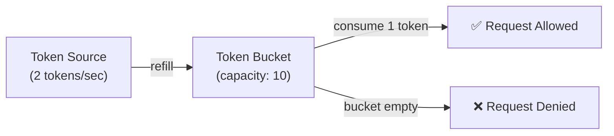
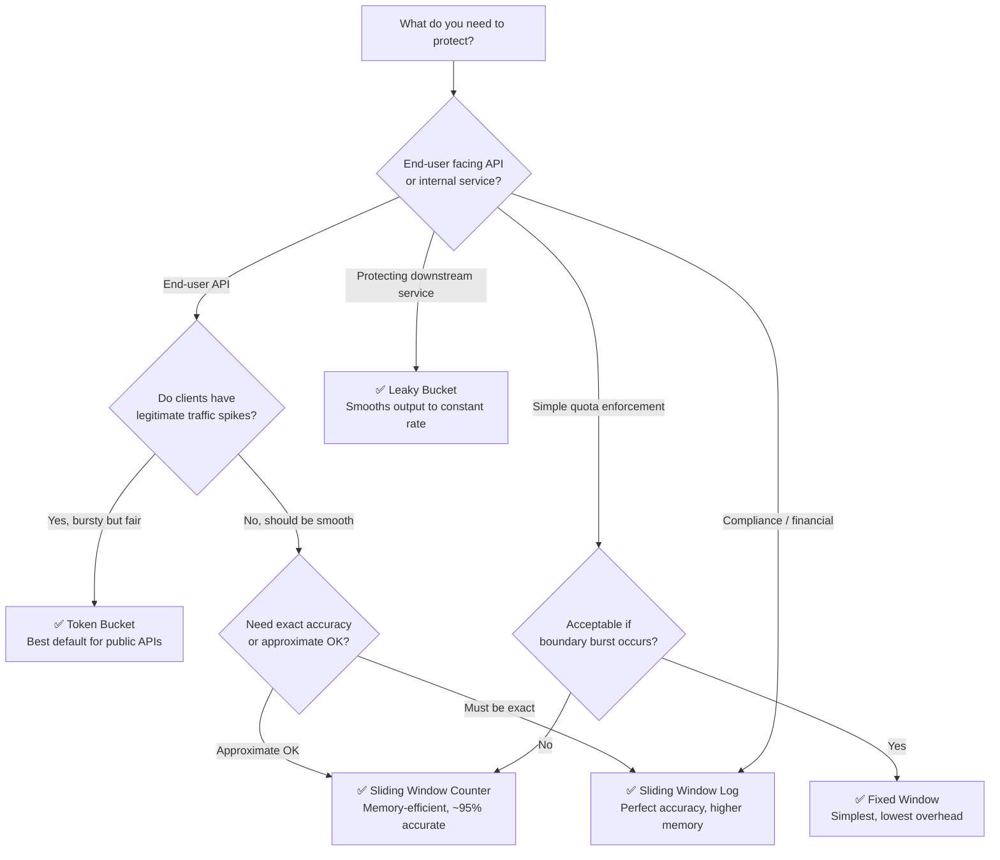

import Tabs from '@theme/Tabs';
import TabItem from '@theme/TabItem';

# Rate Limiting

A complete guide covering rate limiting fundamentals for newcomers, a practical decision framework for choosing the right algorithm, and senior-level deep dives into distributed consistency, failure modes, and production-grade design.

---

## 🗺️ How to Use This Document

| You are...             | Start here                                                                                                                                                                      |
| ---------------------- | ------------------------------------------------------------------------------------------------------------------------------------------------------------------------------- |
| New to rate limiting   | [What Is Rate Limiting?](#what-is-rate-limiting) → [Core Algorithms](#core-algorithms) → [Spring Integration](#spring-boot-integration)                                         |
| Mid-level engineer     | [Decision Framework](#-decision-framework-which-algorithm-to-use) → [Tiered Limits](#tiered-rate-limits) → [Interview Prep](#-interview-questions)                              |
| Senior / system design | [Distributed Challenges](#senior-deep-dive-distributed-rate-limiting) → [Failure Modes](#failure-modes-to-design-for) → [Production Checklist](#production-readiness-checklist) |

---

## What Is Rate Limiting?

:::note[For Newcomers]
Imagine a nightclub bouncer who only lets 100 people in per hour. It doesn't matter if 1,000 people show up — the bouncer enforces a ceiling. Rate limiting is your API's bouncer. It controls how many requests a client can make in a given time window, protecting your service from being overwhelmed.
:::

Rate limiting answers the question: **"Should I allow this request right now?"**

### Why Rate Limit?

| Goal                 | Without Rate Limiting                        | With Rate Limiting                        |
| -------------------- | -------------------------------------------- | ----------------------------------------- |
| **Availability**     | One client can exhaust all DB connections    | Fair resource sharing across clients      |
| **Security**         | Brute-force password attacks unchecked       | 5 failed attempts → locked out            |
| **Cost control**     | One buggy client generates millions of calls | Budget enforced per client                |
| **SLA enforcement**  | Free tier users can overwhelm paid users     | Tier-based limits protect premium service |
| **Abuse prevention** | Scrapers copy your entire catalog            | Throttled to impractical speed            |

### What Gets Rate Limited?

Rate limits can be applied at multiple granularities — often stacked:

```
Incoming request
    ↓
[IP-level limit]          ← 1,000 req/min per IP (DDoS protection)
    ↓
[API Key-level limit]     ← 100 req/min per API key (quota enforcement)
    ↓
[User-level limit]        ← 10 req/min per authenticated user
    ↓
[Endpoint-level limit]    ← /search: 20 req/min (expensive endpoint)
    ↓
[Global service limit]    ← 50,000 req/min total (protect downstream DBs)
    ↓
Handler / business logic
```

---

## Core Algorithms

:::info[Centralized Algorithms Guide]
For a comprehensive architectural guide detailing how each of these rate-limiting algorithms works, their pseudocode implementations, and when to use each of them, see the **[Rate Limiting Algorithms Guide](../system-design/rate-limiting-algorithms.md)**.
:::

Each algorithm is a different strategy for how to *count* requests. They differ in how accurately they track traffic over time, how much memory they use, and how well they handle sudden bursts.


### Algorithm 1: Fixed Window Counter

Divide time into fixed buckets (e.g., each minute). Count requests per bucket. Reset at the start of each new window.

```mermaid
gantt
    title Fixed Window — 5 req/min limit
    dateFormat  s
    axisFormat %S

    section Window 1 (0-60s)
    req 1 :done, 0, 1s
    req 2 :done, 10, 1s
    req 3 :done, 20, 1s
    req 4 :done, 30, 1s
    req 5 :done, 40, 1s

    section Window 2 (60-120s)
    req 6 :active, 60, 1s
    req 7 :active, 61, 1s
    req 8 :active, 62, 1s
    req 9 :active, 63, 1s
    req 10 :active, 64, 1s
```



**The boundary burst problem:**

```
Limit: 100 req/min
Window resets at :00 of every minute

At :59 → 100 requests (hits limit, last 1s of Window 1)
At :00 → counter resets
At :01 → 100 requests (hits limit, first 1s of Window 2)

= 200 requests in 2 seconds ← 2× the intended limit
```

```java
@Component
public class FixedWindowRateLimiter {

    @Autowired
    private RedisTemplate<String, Long> redisTemplate;

    /**
     * Returns true if the request is allowed.
     *
     * Key design: includes the window number so each time bucket is a distinct key.
     * e.g., "rate:fixed:user:42:1714000000" → "rate:fixed:user:42:1714000060"
     */
    public boolean isAllowed(String identifier, int maxRequests, Duration windowSize) {
        long windowId = System.currentTimeMillis() / windowSize.toMillis();
        String key = "rate:fixed:" + identifier + ":" + windowId;

        Long count = redisTemplate.opsForValue().increment(key);

        if (count == 1) {
            // First request in this window — set TTL so the key auto-cleans up
            redisTemplate.expire(key, windowSize.plusSeconds(1)); // +1s buffer
        }

        return count <= maxRequests;
    }
}
```

| Characteristic           | Detail                                        |
| ------------------------ | --------------------------------------------- |
| ✅ Simple to implement    | Single INCR + TTL                             |
| ✅ Low memory             | One key per client per window                 |
| ✅ Predictable reset time | Clients know exactly when they get more quota |
| ❌ Boundary burst         | 2× burst possible at window edges             |
| ❌ Not smooth             | Traffic can be lumpy within window            |

**When to use:** Internal admin APIs, webhook rate limiting, simple quota enforcement where burst at boundary is acceptable.

---

### Algorithm 2: Sliding Window Log

Track the exact **timestamp of every request** in a sorted set. On each request, remove entries older than the window, then count what remains.

```
Limit: 5 req/min (sliding)
Now = t=90s

Sorted set contains: [t=35, t=50, t=70, t=80, t=85]

Step 1: Remove entries < (90 - 60) = t=30 → [t=35, t=50, t=70, t=80, t=85]  (nothing removed)
Step 2: Count = 5 → at limit → DENY

At t=100:
Step 1: Remove entries < t=40 → [t=50, t=70, t=80, t=85]
Step 2: Count = 4 → ALLOW → add t=100 → [t=50, t=70, t=80, t=85, t=100]
```

```java
@Component
public class SlidingWindowLogRateLimiter {

    @Autowired
    private RedisTemplate<String, String> redisTemplate;

    /**
     * Lua script ensures atomicity — all steps run as a single Redis transaction.
     * No race condition between ZREMRANGEBYSCORE, ZCARD, and ZADD.
     */
    private static final String SCRIPT = """
        local key = KEYS[1]
        local now = tonumber(ARGV[1])
        local windowMs = tonumber(ARGV[2])
        local maxRequests = tonumber(ARGV[3])
        local cutoff = now - windowMs

        -- Remove entries outside the sliding window
        redis.call('ZREMRANGEBYSCORE', key, '-inf', cutoff)

        -- Count entries remaining in window
        local count = redis.call('ZCARD', key)

        if count < maxRequests then
            -- Add this request with score = timestamp, member = timestamp + random suffix
            local member = now .. '-' .. redis.call('INCR', key .. ':seq')
            redis.call('ZADD', key, now, member)
            redis.call('PEXPIRE', key, windowMs + 1000)
            return 1  -- allowed
        end

        return 0  -- rejected
        """;

    public boolean isAllowed(String identifier, int maxRequests, Duration window) {
        DefaultRedisScript<Long> script = new DefaultRedisScript<>(SCRIPT, Long.class);

        Long result = redisTemplate.execute(
            script,
            List.of("rate:sliding-log:" + identifier),
            String.valueOf(System.currentTimeMillis()),
            String.valueOf(window.toMillis()),
            String.valueOf(maxRequests)
        );

        return Long.valueOf(1L).equals(result);
    }
}
```

| Characteristic       | Detail                                                       |
| -------------------- | ------------------------------------------------------------ |
| ✅ Perfectly accurate | No boundary burst — true sliding window                      |
| ✅ No approximation   | Every request is individually tracked                        |
| ❌ Memory-intensive   | Stores one entry per request (scales with traffic × clients) |
| ❌ Cleanup required   | Old entries must be pruned (handled by `ZREMRANGEBYSCORE`)   |

**Memory footprint example:**
- 1,000 users × 100 req/min limit × ~50 bytes/entry = **5 MB** — manageable
- 1,000,000 users × 1,000 req/min = **50 GB** — impractical

**When to use:** Low-traffic, high-accuracy scenarios — admin endpoints, payment APIs, compliance-critical rate limiting where you need exact enforcement.

---

### Algorithm 3: Sliding Window Counter (Hybrid)

A memory-efficient approximation of the sliding window. Uses two fixed window counters (current + previous) and weights them based on how far into the current window you are.

```
Limit: 100 req/min
Previous window: 80 requests
Current window: 30 requests (20s into the 60s window)

Estimated requests = prev × (remaining overlap %) + current
                   = 80 × (40/60) + 30
                   = 80 × 0.667 + 30
                   = 53.3 + 30
                   = 83.3 → ALLOW (< 100)
```

```java
@Component
public class SlidingWindowCounterRateLimiter {

    @Autowired
    private RedisTemplate<String, Long> redisTemplate;

    public boolean isAllowed(String identifier, int maxRequests, Duration windowSize) {
        long windowMs = windowSize.toMillis();
        long now = System.currentTimeMillis();
        long currentWindowId = now / windowMs;
        long previousWindowId = currentWindowId - 1;

        String currentKey  = "rate:swc:" + identifier + ":" + currentWindowId;
        String previousKey = "rate:swc:" + identifier + ":" + previousWindowId;

        // Fetch both window counts in a single pipeline (one round-trip)
        List<Object> results = redisTemplate.executePipelined((RedisCallback<?>) conn -> {
            conn.stringCommands().get(currentKey.getBytes());
            conn.stringCommands().get(previousKey.getBytes());
            return null;
        });

        long currentCount  = results.get(0) != null ? Long.parseLong(results.get(0).toString()) : 0;
        long previousCount = results.get(1) != null ? Long.parseLong(results.get(1).toString()) : 0;

        // How far are we into the current window? (0.0 = start, 1.0 = end)
        double positionInWindow = (double)(now % windowMs) / windowMs;

        // Weight previous window by remaining overlap
        double estimatedCount = previousCount * (1.0 - positionInWindow) + currentCount;

        if (estimatedCount < maxRequests) {
            redisTemplate.opsForValue().increment(currentKey);
            redisTemplate.expire(currentKey, windowSize.multipliedBy(2)); // keep 2 windows
            return true;
        }

        return false;
    }
}
```

| Characteristic          | Detail                                             |
| ----------------------- | -------------------------------------------------- |
| ✅ Low memory            | Two integers per client regardless of request rate |
| ✅ Good accuracy         | ~5% approximation error in worst case              |
| ✅ No log cleanup needed | Old keys expire via TTL automatically              |
| ❌ Approximate           | Not perfectly accurate at window boundaries        |

**When to use:** The sweet spot for most APIs. Better accuracy than fixed window, far lower memory than sliding log. Used by Cloudflare, Nginx rate limiting modules.

---

### Algorithm 4: Token Bucket

A bucket holds tokens. Tokens are refilled at a constant rate. Each request consumes tokens. If the bucket is empty, the request is denied. Allows controlled **bursting** up to bucket capacity.

```
Capacity: 10 tokens
Refill: 2 tokens/second
Starts: full (10 tokens)

t=0s:  Burst of 10 requests → consumes all 10 tokens → bucket empty
t=0s:  11th request → DENIED (0 tokens)
t=1s:  2 tokens refilled → 2 requests allowed
t=5s:  10 tokens refilled (capped at capacity) → full burst available again
```



```java
@Component
public class TokenBucketRateLimiter {

    @Autowired
    private RedisTemplate<String, String> redisTemplate;

    /**
     * All logic in a single Lua script for atomicity.
     * Compute tokens lazily on each request — no background refill process needed.
     */
    private static final String SCRIPT = """
        local key         = KEYS[1]
        local capacity    = tonumber(ARGV[1])
        local refillRate  = tonumber(ARGV[2])  -- tokens per second
        local nowMs       = tonumber(ARGV[3])
        local requested   = tonumber(ARGV[4])

        -- Read current bucket state
        local data = redis.call('HMGET', key, 'tokens', 'lastRefillMs')
        local tokens      = tonumber(data[1]) or capacity
        local lastRefill  = tonumber(data[2]) or nowMs

        -- Compute how many tokens have been added since last request
        local elapsedSec = (nowMs - lastRefill) / 1000.0
        local newTokens  = elapsedSec * refillRate
        tokens = math.min(capacity, tokens + newTokens)

        -- Try to consume
        if tokens >= requested then
            tokens = tokens - requested
            redis.call('HMSET', key, 'tokens', tokens, 'lastRefillMs', nowMs)
            redis.call('EXPIRE', key, 86400)  -- cleanup after 24h idle
            return 1  -- allowed
        else
            -- Update lastRefill even on rejection (to track accumulated tokens)
            redis.call('HMSET', key, 'tokens', tokens, 'lastRefillMs', nowMs)
            redis.call('EXPIRE', key, 86400)
            return 0  -- rejected
        end
        """;

    /**
     * @param identifier   client identifier (userId, apiKey, IP)
     * @param capacity     max burst size (bucket capacity)
     * @param refillPerSec tokens added per second
     * @param requested    tokens required for this request (usually 1)
     */
    public boolean consume(String identifier, int capacity,
                           int refillPerSec, int requested) {
        DefaultRedisScript<Long> script = new DefaultRedisScript<>(SCRIPT, Long.class);

        Long result = redisTemplate.execute(
            script,
            List.of("rate:token-bucket:" + identifier),
            String.valueOf(capacity),
            String.valueOf(refillPerSec),
            String.valueOf(System.currentTimeMillis()),
            String.valueOf(requested)
        );

        return Long.valueOf(1L).equals(result);
    }

    // Convenience: consume 1 token
    public boolean isAllowed(String identifier, int capacity, int refillPerSec) {
        return consume(identifier, capacity, refillPerSec, 1);
    }
}
```

**Variable cost requests** — not all requests should cost the same token:

```java
// Charge more tokens for expensive operations
rateLimiter.consume(userId, capacity=100, refillPerSec=10, requested=1);   // GET /products
rateLimiter.consume(userId, capacity=100, refillPerSec=10, requested=10);  // POST /reports/generate
rateLimiter.consume(userId, capacity=100, refillPerSec=10, requested=5);   // POST /bulk-update
```

| Characteristic           | Detail                                                    |
| ------------------------ | --------------------------------------------------------- |
| ✅ Allows bursting        | Clients can burst up to bucket capacity                   |
| ✅ Smooth long-term rate  | Enforces average rate via refill                          |
| ✅ Low memory             | Two values per client (tokens, lastRefill)                |
| ✅ Variable cost          | Different operations can consume different token amounts  |
| ❌ Two parameters to tune | Capacity (burst) and refill rate must be set thoughtfully |

**When to use:** Default choice for most production APIs. Excellent for public APIs, SDKs, and any scenario where legitimate clients may have occasional spiky traffic.

---

### Algorithm 5: Leaky Bucket

Requests enter a queue (the "bucket"). They are processed at a **fixed, constant rate** regardless of how fast they arrive. Excess requests that overflow the bucket are dropped.

```
Bucket size: 10
Outflow: 1 req/sec

t=0:  10 requests arrive → bucket fills to 10
t=0:  11th request → DROPPED (bucket full)
t=1:  1 request processed → bucket = 9 → 1 new request can enter
t=2:  1 request processed → bucket = 8 ...

Traffic is "smoothed" to exactly 1 req/sec regardless of input
```

| Characteristic                | Detail                                                      |
| ----------------------------- | ----------------------------------------------------------- |
| ✅ Perfectly smooth output     | Protects downstream services from any burst                 |
| ✅ Predictable processing rate | Great for rate-limited downstream APIs                      |
| ❌ No burst allowance          | Even legitimate short bursts get queued or dropped          |
| ❌ Added latency               | Requests wait in queue rather than being served immediately |
| ❌ Complex to implement        | Requires a worker/queue to process at fixed rate            |

**When to use:** When you need to **protect a downstream service** that can only handle a strict constant rate (third-party APIs with hard rate limits, payment processors, SMS gateways). Not suitable for end-user-facing APIs.

---

## 🧭 Decision Framework: Which Algorithm to Use?

### Flowchart



### Quick-Reference Decision Matrix

| Scenario                     | Algorithm                  | Reason                             |
| ---------------------------- | -------------------------- | ---------------------------------- |
| Public REST API (general)    | **Token Bucket**           | Handles bursts, simple tuning      |
| Internal microservice quota  | **Fixed Window**           | Simple, reset time predictable     |
| Search / expensive endpoint  | **Sliding Window Counter** | Accurate, no boundary burst        |
| Payment / auth endpoint      | **Sliding Window Log**     | Exact enforcement, no tolerance    |
| SMS / email gateway calls    | **Leaky Bucket**           | Smooth output, protect 3rd party   |
| Free vs Pro tier limits      | **Token Bucket per tier**  | Burst capacity = UX differentiator |
| DDoS / IP blocking           | **Fixed Window**           | Fastest, lowest overhead           |
| Per-user API quota (billing) | **Fixed Window**           | Predictable, easy to explain       |

:::tip[The Senior Rule of Thumb]
**Start with Token Bucket.** It handles bursts gracefully, has low memory overhead, and is easy to explain to clients. Move to Sliding Window Log only when you need exact legal/compliance enforcement. Use Fixed Window only for coarse, high-scale IP-level protection.
:::

---

## Spring Boot Integration

### Filter-Based (Applies to All Requests)

```java
@Component
@Order(Ordered.HIGHEST_PRECEDENCE) // run before other filters
public class RateLimitFilter extends OncePerRequestFilter {

    @Autowired
    private TokenBucketRateLimiter rateLimiter;

    @Autowired
    private RateLimitConfigService configService; // loads per-tier config

    @Override
    protected void doFilterInternal(HttpServletRequest request,
            HttpServletResponse response, FilterChain chain)
            throws ServletException, IOException {

        String identifier = resolveIdentifier(request);
        RateLimitConfig config = configService.getConfig(identifier);

        RateLimitResult result = rateLimiter.consumeWithMetadata(
            identifier, config.capacity(), config.refillPerSec());

        // Always add rate limit headers (even on success)
        addRateLimitHeaders(response, result);

        if (!result.allowed()) {
            response.setStatus(HttpStatus.TOO_MANY_REQUESTS.value());
            response.setContentType(MediaType.APPLICATION_JSON_VALUE);
            response.addHeader("Retry-After", String.valueOf(result.retryAfterSeconds()));
            response.getWriter().write("""
                {
                  "error": "Too Many Requests",
                  "message": "Rate limit exceeded. Try again in %d seconds.",
                  "retryAfter": %d
                }
                """.formatted(result.retryAfterSeconds(), result.retryAfterSeconds()));
            return;
        }

        chain.doFilter(request, response);
    }

    /**
     * Identifier resolution priority:
     * 1. Authenticated user ID (most specific)
     * 2. API Key from header
     * 3. IP address (least specific, fallback)
     */
    private String resolveIdentifier(HttpServletRequest request) {
        // From authenticated principal (set by auth filter earlier in chain)
        String userId = (String) request.getAttribute("authenticatedUserId");
        if (userId != null) return "user:" + userId;

        String apiKey = request.getHeader("X-API-Key");
        if (apiKey != null) return "apikey:" + apiKey;

        // X-Forwarded-For handling for proxies/load balancers
        String xff = request.getHeader("X-Forwarded-For");
        String ip = (xff != null) ? xff.split(",")[0].trim() : request.getRemoteAddr();
        return "ip:" + ip;
    }

    private void addRateLimitHeaders(HttpServletResponse response, RateLimitResult result) {
        response.addHeader("X-RateLimit-Limit",     String.valueOf(result.limit()));
        response.addHeader("X-RateLimit-Remaining", String.valueOf(result.remaining()));
        response.addHeader("X-RateLimit-Reset",     String.valueOf(result.resetEpochSeconds()));
    }
}
```

### Annotation-Based (Per-Endpoint)

For fine-grained control, define limits per endpoint with a custom annotation:

```java
// Define the annotation
@Target(ElementType.METHOD)
@Retention(RetentionPolicy.RUNTIME)
public @interface RateLimit {
    int capacity() default 100;
    int refillPerSecond() default 10;
    String keyPrefix() default "";  // override identifier prefix per endpoint
}

// Use it on controllers
@RestController
@RequestMapping("/api")
public class ProductController {

    @GetMapping("/products")
    @RateLimit(capacity = 1000, refillPerSecond = 100) // generous for reads
    public List<Product> listProducts() { ... }

    @PostMapping("/reports/generate")
    @RateLimit(capacity = 5, refillPerSecond = 1)       // strict for expensive ops
    public Report generateReport() { ... }

    @PostMapping("/auth/login")
    @RateLimit(capacity = 5, refillPerSecond = 0)        // 5 attempts, no refill (brute-force)
    public AuthToken login(@RequestBody LoginRequest req) { ... }
}

// AOP interceptor reads the annotation and applies the limit
@Aspect
@Component
public class RateLimitAspect {

    @Autowired
    private TokenBucketRateLimiter rateLimiter;

    @Around("@annotation(rateLimit)")
    public Object applyRateLimit(ProceedingJoinPoint pjp, RateLimit rateLimit) throws Throwable {
        HttpServletRequest request = ((ServletRequestAttributes)
            RequestContextHolder.getRequestAttributes()).getRequest();

        String identifier = resolveIdentifier(request, rateLimit.keyPrefix());

        if (!rateLimiter.isAllowed(identifier, rateLimit.capacity(), rateLimit.refillPerSecond())) {
            throw new RateLimitExceededException("Rate limit exceeded for " + identifier);
        }

        return pjp.proceed();
    }
}
```

---

## Tiered Rate Limits

Different user plans get different limits. Define tier configs centrally and resolve them based on the authenticated user's plan.

```java
@Service
public class TieredRateLimiter {

    @Autowired
    private TokenBucketRateLimiter rateLimiter;

    // Tier configuration — in production, load from DB or config service
    private static final Map<String, TierConfig> TIERS = Map.of(
        "free",       new TierConfig(60,    10),    // 60/min burst, 1/sec refill
        "pro",        new TierConfig(1_000, 100),   // 1k burst, 100/sec refill
        "enterprise", new TierConfig(10_000, 1_000) // 10k burst, 1000/sec refill
    );

    public RateLimitResult isAllowed(String userId, String tier) {
        TierConfig config = TIERS.getOrDefault(tier, TIERS.get("free"));
        return rateLimiter.consumeWithMetadata(userId, config.capacity(), config.refillPerSec());
    }

    record TierConfig(int capacity, int refillPerSec) {}
}
```

**Dynamic tier configuration** — load from DB/config service without restart:

```java
@Service
@RefreshScope // Spring Cloud Config: refresh on config change without restart
public class RateLimitConfigService {

    @Autowired
    private TierConfigRepository repo;

    @Cacheable(value = "rateLimitConfigs", key = "#userId")
    public TierConfig getConfigForUser(String userId) {
        User user = userRepo.findById(userId).orElseThrow();
        return repo.findByTier(user.getPlan())
                   .orElse(TierConfig.defaultFreeConfig());
    }
}
```

---

## Rate Limit Response Headers

Standard headers inform clients of their current quota. This is critical for good API UX — clients can self-throttle instead of retrying blindly.

```
HTTP/1.1 200 OK
X-RateLimit-Limit: 1000          ← total allowed in window
X-RateLimit-Remaining: 743       ← requests left in current window
X-RateLimit-Reset: 1714003260    ← Unix timestamp when window resets
X-RateLimit-Policy: 1000;w=60   ← IETF draft standard (capacity;window)

HTTP/1.1 429 Too Many Requests
Retry-After: 23                  ← seconds until next allowed request
X-RateLimit-Limit: 1000
X-RateLimit-Remaining: 0
X-RateLimit-Reset: 1714003260
```

```java
// Return metadata from the rate limiter alongside the allow/deny decision
public record RateLimitResult(
    boolean allowed,
    long limit,
    long remaining,
    long resetEpochSeconds,
    long retryAfterSeconds
) {}

// Updated Token Bucket — returns metadata
public RateLimitResult consumeWithMetadata(String id, int capacity, int refillPerSec) {
    // Extended Lua script that returns [allowed, remaining, resetTs] instead of just 0/1
    String SCRIPT_WITH_META = """
        -- ... same logic as before ...
        if tokens >= requested then
            tokens = tokens - requested
            redis.call('HMSET', key, 'tokens', tokens, 'lastRefillMs', nowMs)
            redis.call('EXPIRE', key, 86400)
            local resetMs = nowMs + math.ceil((capacity - tokens) / refillRate * 1000)
            return {1, math.floor(tokens), math.floor(resetMs / 1000)}
        else
            local waitSec = math.ceil((requested - tokens) / refillRate)
            return {0, 0, math.floor(nowMs / 1000) + waitSec}
        end
        """;

    List<Long> result = redisTemplate.execute(...);
    boolean allowed = result.get(0) == 1L;
    long remaining  = result.get(1);
    long resetEpoch = result.get(2);
    long retryAfter = allowed ? 0 : resetEpoch - (System.currentTimeMillis() / 1000);

    return new RateLimitResult(allowed, capacity, remaining, resetEpoch, retryAfter);
}
```

---

## Senior Deep Dive: Distributed Rate Limiting

### The Core Problem

When you have multiple app instances, each instance has no knowledge of the others' counts. Naive in-process counting wildly under-counts:

```
Limit: 100 req/min
Instances: 10 pods

Pod 1: receives 100 requests → counts 100 → BLOCKS
Pod 2: receives 100 requests → counts 100 → BLOCKS (independently)
...
Pod 10: receives 100 requests → counts 100 → BLOCKS

Total allowed: 1,000 requests (10× the limit!)
```

**Redis as the centralized counter** solves this — all pods share the same atomic counter. But this introduces new challenges.

### Challenge 1: Redis Latency Adds to Every Request

Every rate limit check is a network call to Redis (~0.5ms). At 10,000 req/s, that's 10,000 Redis calls/s.

**Mitigation: Local allowance reservation**

Instead of checking Redis on every request, reserve a batch of tokens locally:

```java
@Component
public class LocalReservationRateLimiter {

    private final TokenBucketRateLimiter redisLimiter;
    private final ConcurrentHashMap<String, LocalAllowance> localReservations = new ConcurrentHashMap<>();

    // Reserve 10 tokens locally at a time; only go to Redis when local allowance is exhausted
    private static final int RESERVATION_SIZE = 10;

    public boolean isAllowed(String identifier) {
        LocalAllowance local = localReservations.computeIfAbsent(
            identifier, k -> new LocalAllowance());

        if (local.tryConsume()) {
            return true; // fast path — no Redis call
        }

        // Slow path: reserve more from Redis
        boolean reserved = redisLimiter.consume(identifier, /* ... */, RESERVATION_SIZE);
        if (reserved) {
            local.refill(RESERVATION_SIZE - 1); // -1 for current request
            return true;
        }

        return false;
    }

    static class LocalAllowance {
        private final AtomicInteger tokens = new AtomicInteger(0);

        boolean tryConsume() {
            return tokens.getAndUpdate(t -> t > 0 ? t - 1 : t) > 0;
        }

        void refill(int amount) {
            tokens.addAndGet(amount);
        }
    }
}
```

**Trade-off:** At most `RESERVATION_SIZE × instances - 1` extra requests may be allowed beyond the limit (e.g., 10 pods × 10 reservation size = 100 extra requests). Acceptable for most use cases.

### Challenge 2: Redis Failure — What's Your Policy?

When Redis is unavailable, you have two options with very different risk profiles:

```java
public boolean isAllowed(String identifier, int capacity, int refillPerSec) {
    try {
        return rateLimiter.consume(identifier, capacity, refillPerSec, 1);
    } catch (RedisException e) {
        log.error("Rate limiter Redis unavailable for identifier={}", identifier, e);

        // OPTION A: Fail open — allow requests when rate limiter is down
        // Risk: Abuse during outage; Benefit: Service remains available
        return true;

        // OPTION B: Fail closed — deny all requests when rate limiter is down
        // Risk: Complete service outage; Benefit: No abuse during Redis downtime
        // return false;

        // OPTION C: Fallback to in-process limiting (approximate)
        // Risk: ~10× over-allowing with 10 pods; Benefit: Partial protection
        // return localFallbackLimiter.isAllowed(identifier, capacity / 10, refillPerSec / 10);
    }
}
```

:::tip[Choosing a Failure Policy]
- **Public API / user-facing:** Fail open. Availability > strict limiting during outages.
- **Auth endpoints (login, password reset):** Fail closed or local fallback. Security > availability.
- **Financial / compliance:** Fail closed. Regulatory risk of over-serving outweighs downtime.
:::

### Challenge 3: Multi-Region Rate Limiting

In a multi-region deployment, centralized Redis means cross-region latency for every request.

```
Region: US-EAST        Region: EU-WEST
App Pods               App Pods
    ↓  ↓  ↓                ↓  ↓  ↓
    [Redis US]  ←←←← 80ms ←←←← (EU pods must call US Redis)
```

**Strategies:**

<Tabs>
  <TabItem value="regional" label="Regional Quotas (Simplest)">

Split the global quota across regions. Each region has its own Redis and enforces its share.

```
Global limit: 1,000 req/min
US-EAST: 600 req/min (60% of traffic)
EU-WEST: 400 req/min (40% of traffic)
```

✅ Zero cross-region latency  
❌ A user could hit 600 (US) + 400 (EU) = 1,000 by routing through both regions  
❌ Static split requires rebalancing as traffic shifts  

  </TabItem>
  <TabItem value="async-sync" label="Async Synchronization">

Each region enforces limits locally, but syncs counters to a central store asynchronously (every few seconds).

```java
@Scheduled(fixedRate = 5000) // sync every 5 seconds
public void syncCounters() {
    localCounters.forEach((key, localCount) -> {
        // Atomically add local count to global Redis and get global total
        Long globalCount = globalRedis.opsForValue().increment(key, localCount);
        localCounters.put(key, 0L); // reset local

        if (globalCount > globalLimit) {
            // Signal local limiter to start blocking
            localBlocklist.add(key);
        }
    });
}
```

✅ Low request latency (local check)  
❌ Up to 5s of over-serving per region until sync  
❌ Complex global state management  

  </TabItem>
  <TabItem value="consistent-hash" label="Consistent Hashing">

Route rate limit checks for a given client to a specific region using consistent hashing on the client ID. The client always hits the same region's Redis.

```
hash("user:42")     → US-EAST Redis
hash("user:99")     → EU-WEST Redis
hash("apikey:abc")  → US-EAST Redis
```

✅ Exact global enforcement per client  
✅ Each region is authoritative for its clients  
❌ Cross-region latency if client's region is far from their API entry point  
❌ Rebalancing on region add/remove is complex  

  </TabItem>
</Tabs>

---

### Rate Limit Key Design

Your key structure determines cost, debuggability, and flexibility.

```bash
# Bad: too vague — can't distinguish per-endpoint limits
rate:{userId}

# Better: includes algorithm context and scope
rate:token-bucket:{userId}
rate:sliding-window:{ip}:search

# Best: hierarchical, queryable, includes version for easy reset
rl:v1:{algorithm}:{scope}:{identifier}:{window-id}

# Examples:
rl:v1:tb:global:user:42                    # token bucket, per-user global
rl:v1:tb:endpoint:/api/search:user:42      # per-endpoint limit
rl:v1:fw:ip:192.168.1.1:1714003200         # fixed window, per-IP
rl:v1:sw:apikey:abc123                     # sliding window, per-API key

# Bulk reset by key pattern (e.g., after a plan upgrade)
redis-cli --scan --pattern "rl:v1:*:user:42" | xargs redis-cli del
```

---

## Failure Modes to Design For

| Failure Mode             | Trigger                               | Impact                                         | Mitigation                                                                          |
| ------------------------ | ------------------------------------- | ---------------------------------------------- | ----------------------------------------------------------------------------------- |
| **Redis Latency Spike**  | Redis slow (GC, network)              | Rate check adds >10ms to every request         | Circuit breaker; local fallback limiter                                             |
| **Redis Unavailable**    | Redis crash / network partition       | All checks fail                                | Fail open / closed policy; local approximation                                      |
| **Key Expiry Missing**   | Bug: TTL not set on increment         | Keys accumulate forever → Redis OOM            | Always set TTL; monitor Redis memory                                                |
| **Clock Skew**           | System time drift across pods         | Fixed/sliding window mismatch across instances | Use Redis `TIME` command inside Lua instead of passing `System.currentTimeMillis()` |
| **IP Spoofing**          | Attacker fakes `X-Forwarded-For`      | Bypasses IP-based rate limiting                | Only trust XFF from known proxy IPs; validate header                                |
| **Identifier Collision** | Two users hash to same key            | User A consumes User B's quota                 | Use full user ID, not hash; test key uniqueness                                     |
| **Hot Key**              | One API key with very high rate limit | Saturates one Redis shard                      | Use local reservation; Redis Cluster to distribute                                  |
| **Bypass via 429 Retry** | Client retries immediately on 429     | Hammers service even while limited             | Always set `Retry-After` header; enforce at load balancer                           |

### Clock Skew Fix: Use Redis TIME

```lua
-- Instead of: local now = tonumber(ARGV[1])  (from application)
-- Use Redis server time (consistent across all app instances):
local time = redis.call('TIME')
local now = tonumber(time[1]) * 1000 + math.floor(tonumber(time[2]) / 1000)
```

This ensures all rate limit calculations use the same clock, regardless of which pod initiates the request.

---

## Advanced Patterns

### Adaptive Rate Limiting

Automatically tighten limits when the system is under stress:

```java
@Component
public class AdaptiveRateLimiter {

    @Autowired
    private SystemHealthService health;

    @Autowired
    private TokenBucketRateLimiter base;

    public boolean isAllowed(String identifier, int normalCapacity, int refillPerSec) {
        double healthScore = health.getScore(); // 0.0 (overwhelmed) to 1.0 (healthy)

        // Scale down limits proportionally under load
        int effectiveCapacity = (int)(normalCapacity * healthScore);
        int effectiveRefill   = (int)(refillPerSec * healthScore);

        // Never go below 10% of normal limit (avoid complete lockout of all users)
        effectiveCapacity = Math.max(effectiveCapacity, normalCapacity / 10);
        effectiveRefill   = Math.max(effectiveRefill,   refillPerSec   / 10);

        return base.isAllowed(identifier, effectiveCapacity, effectiveRefill);
    }
}

// System health: based on DB connection pool, CPU, error rate
@Service
public class SystemHealthService {
    public double getScore() {
        double dbPoolScore  = (double) dbPool.getIdleCount() / dbPool.getMaxTotal();
        double errorScore   = 1.0 - circuitBreaker.getFailureRate();
        return Math.min(dbPoolScore, errorScore);
    }
}
```

### Rate Limiting with Priority Queues

Premium users get requests served first; free users are queued:

```java
// Not just block/allow — accept request into priority queue
public CompletableFuture<Response> handle(Request req, String tier) {
    int priority = switch (tier) {
        case "enterprise" -> 0; // highest
        case "pro"        -> 1;
        default           -> 2; // free
    };

    return requestQueue.submit(req, priority); // PriorityBlockingQueue-backed executor
}
```

### Burst Allowance Differentiation by Tier

Token bucket is ideal for expressing tier differences not just in rate, but in *burst behavior*:

```
Free tier:       capacity=60,  refill=1/sec   → max 60 req burst, then 1/sec steady
Pro tier:        capacity=600, refill=10/sec  → max 600 req burst, then 10/sec steady
Enterprise tier: capacity=6000,refill=100/sec → max 6000 req burst, then 100/sec steady

Free user: can download a report (1 req) fine, but can't batch-scrape (60 req/min hard limit)
Pro user:  can run a batch job in a burst, then continue at 10 req/sec
```

---

## Production Readiness Checklist

### Observability
- [ ] 429 rate tracked per endpoint, per tier, per identifier
- [ ] Percentage of requests rate-limited alerted if > threshold (e.g., > 5% of total traffic)
- [ ] Redis memory dashboarded — rate limit keys can grow large
- [ ] Rate limit key TTLs verified (run `redis-cli TTL rate:*` sample in staging)
- [ ] `Retry-After` header correctness tested from client perspective

### Resilience
- [ ] Redis failure handling tested — what happens when Redis is down?
- [ ] Circuit breaker around Redis calls in rate limiter
- [ ] Local fallback behavior documented and tested
- [ ] Rate limit Redis is separate from application data Redis (blast radius isolation)

### Correctness
- [ ] Lua scripts tested for atomicity — no TOCTOU races
- [ ] `X-Forwarded-For` parsing restricted to trusted proxy IPs only
- [ ] Identifier uniqueness verified — no key collisions between users
- [ ] Clock skew addressed (use Redis TIME inside Lua or NTP-sync'd servers)
- [ ] Multi-region behavior tested — user routed to different regions sees consistent limits

### Client Experience
- [ ] All rate limit headers returned on every response (not just 429)
- [ ] 429 response body includes human-readable message + `retryAfter`
- [ ] Documentation published: what are the limits, how to check quota, how to handle 429
- [ ] Exponential backoff recommended/documented for SDK users

---

## 🎯 Interview Questions

### Foundational

**Q: What is rate limiting and why is it needed?**
> Rate limiting controls how many requests a client can make in a given time window. It's needed to protect service availability (prevent one client from exhausting resources), improve fairness (shared resources across users), enforce business quotas (SaaS tiers), and improve security (brute-force prevention on auth endpoints).

**Q: What's the difference between the Fixed Window and Sliding Window algorithms?**
> Fixed Window divides time into discrete buckets and counts requests per bucket. Simple, but allows a 2× burst at window boundaries — 100 requests at the end of window 1 and 100 at the start of window 2 = 200 requests in 2 seconds for a 100 req/min limit. Sliding Window tracks requests relative to a rolling time window ending at "now", so the count always reflects the true last N seconds. More accurate but requires more memory (log variant) or more computation (counter variant).

**Q: Why is Redis used for rate limiting instead of an in-process counter?**
> In-process counters are not shared across application instances. With 10 pods, each pod has its own counter and a user could be allowed 10× the intended limit. Redis provides a shared, atomic counter with `INCR` that all instances use. Redis is also fast (~0.5ms), supports TTL for automatic key expiry, and Lua scripts for multi-step atomic operations.

---

### Intermediate

**Q: Why use Lua scripts for rate limiting in Redis?**
> Rate limiting requires multiple Redis operations that must be atomic: check count, compare to limit, increment, set TTL. Without atomicity, two concurrent requests can both read count=99 (limit=100), both pass the check, and both increment — allowing 101 requests. A Lua script runs as a single atomic unit in Redis — no other command can interleave between its steps. This eliminates the race condition entirely.

**Q: How do you implement Token Bucket without a background refill process?**
> Tokens are computed lazily on each request using the formula: `new_tokens = elapsed_seconds × refill_rate`. Store only `{tokens, lastRefillTimestamp}` in Redis. On each request, compute how many tokens have accumulated since `lastRefillTimestamp`, cap at capacity, then attempt to consume. No background worker needed — the math is done inline in the Lua script when the request arrives.

**Q: A client sends 429 Too Many Requests. What headers should the response include?**
> At minimum: `Retry-After` (seconds until they can retry), `X-RateLimit-Limit` (total limit), `X-RateLimit-Remaining` (always 0 on 429), and `X-RateLimit-Reset` (epoch seconds when the window resets). Including these headers is critical — without them, clients must use random backoff, which creates thundering herd behavior as all rate-limited clients retry at the same time after guessing the wait period.

---

### Senior / System Design

**Q: How would you implement rate limiting in a microservices architecture with 10 regions?**
> This is a distributed systems trade-off question. Options: (1) Regional quotas — split global quota across regions; fast but a user can exceed limits by routing through multiple regions. (2) Global Redis with cross-region calls — exact but adds 80–150ms cross-region latency to every request. (3) Consistent hashing — each user is assigned to one region's Redis; exact per-user, no cross-region calls, but requires client routing awareness. (4) Async sync — local limits with periodic global sync; allows brief over-serving but maintains low latency. In practice, option 3 (consistent hashing) or option 1 with small over-allowance is the right answer for most systems.

**Q: How would you design rate limiting for a free-tier API that you want to monetize?**
> Design decisions: (1) Use Token Bucket per tier — the burst capacity becomes a key differentiator (free: 10 burst, pro: 1000 burst). (2) Apply limits at the user level (not IP) so shared IPs (offices, universities) are treated fairly. (3) Return quota headers on every response so clients can build dashboards and know when to upgrade. (4) Implement a "soft limit" warning at 80% quota used (log a warning but still serve) vs a hard block at 100%. (5) Make the 429 response actionable — include a link to upgrade. Rate limiting UX is part of your monetization funnel.

**Q: How do you prevent rate limit bypass via IP rotation?**
> Pure IP-based limiting is easily bypassed with a botnet or rotating proxy. Defense-in-depth: (1) Require API key authentication — limit by key, not IP. (2) Combine IP + user-agent fingerprint + API key for multi-dimensional limiting. (3) Apply IP limits at the load balancer/CDN level (Cloudflare, AWS WAF) where IP reputation data is available. (4) Use behavioral analysis — rate limit on suspicious patterns (many unique endpoints, sequential IDs, non-human timing) not just raw count. (5) CAPTCHA challenges after repeated 429s on unauthenticated endpoints. No single technique is sufficient; defense in depth is the answer.

**Q: What is the difference between rate limiting and circuit breaking?**
> Rate limiting is **client-side protection** — it limits how much any single client can consume, protecting fairness and preventing abuse. Circuit breaking is **server-side protection** — it detects when a downstream service (DB, external API) is failing and stops sending it requests to let it recover. They are complementary: rate limiting prevents overload from clients; circuit breaking prevents cascading failure to dependencies. In production you need both: rate limit inbound traffic AND circuit-break outbound calls.

---

## See Also

- [Caching Strategies](../system-design/caching-strategies.md) — Redis data structures and patterns used alongside rate limiting
- [API Design](../system-design/api-design.md) — 429 response standards, Retry-After, quota documentation
- [Distributed Systems](../system-design/distributed-systems.md) — Consistency trade-offs in multi-node rate limiting
- [Security Patterns](../system-design/security-patterns.md) — Brute-force protection, auth endpoint hardening
- [Scaling Reads](../system-design/scaling-reads.md) — How rate limiting protects read caches from stampedes and dynamic hotspots
- [Scaling Writes](../system-design/scaling-writes.md) — Implementing write pipelines backpressure and adaptive database rate limits
- [Rate Limiting Algorithms](../system-design/rate-limiting-algorithms.md) — Conceptual mechanics and comparisons of all core algorithms