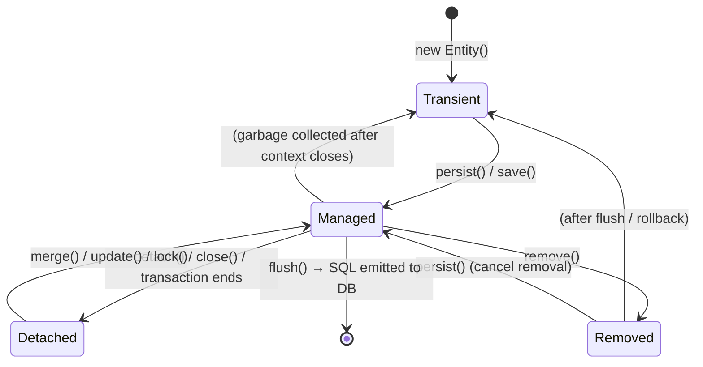

import Tabs from '@theme/Tabs';
import TabItem from '@theme/TabItem';

When working with Spring Boot and Hibernate, understanding the exact nuances between JPA standard methods and Hibernate's proprietary implementations is crucial. Misunderstanding these leads to nasty `LazyInitializationException` bugs, `NonUniqueObjectException` errors, N+1 query problems, or connection pool exhaustion in high-throughput applications.

This guide covers the full entity lifecycle, the mechanical differences between `persist()`, `save()`, `merge()`, and `update()`, how Spring Data JPA abstracts over them, and when to step outside the ORM entirely.

:::info[Who this guide is for]
- **New learners** — start at [The Entity Lifecycle](#1-the-entity-lifecycle) and [Beginner Analogy](#2-beginner-view-the-persistence-context-as-a-workspace) to build the mental model.
- **Senior engineers** — jump to [Primary Key Strategy Deep Dive](#4-primary-key-generation-strategies-and-their-impact), [Connection Pool Implications](#1-connection-pool-exhaustion-hikaricp), [N+1 Problem](#3-the-n1-query-problem), or [When to Skip the ORM](#6-when-to-skip-the-orm-entirely).
:::

---

## 1. The Entity Lifecycle

Before examining any method, you must internalize the four states of a JPA entity. Every persistence operation is simply a transition between these states.



| State | Has a DB Row? | Tracked by EntityManager? | Auto-synced to DB? |
|---|---|---|---|
| **Transient** | ❌ No | ❌ No | ❌ No |
| **Managed** | ✅ Yes (or pending insert) | ✅ Yes | ✅ Yes (on flush) |
| **Detached** | ✅ Yes | ❌ No | ❌ No |
| **Removed** | ✅ Yes (pending delete) | ✅ Yes | ✅ Yes (on flush) |

**The Persistence Context (First-Level Cache)** is the gatekeeper of state. It is scoped to a single `EntityManager` / transaction. Entities in the **Managed** state are tracked here — Hibernate compares their current field values to their snapshot at load time (**dirty checking**) and emits SQL only for changed fields on flush.

---

## 2. Beginner View: The Persistence Context as a Workspace

Imagine the Persistence Context as your **office desk**.

- **Transient** — A document you just drafted on a sticky note. It exists only in your hand. No one else has a copy; the filing room (database) has never seen it.
- **Managed** — The document is on your desk, open and actively being edited. Any change you make is automatically picked up when your assistant (Hibernate) does a filing run (flush). You don't need to say "save this" — the assistant watches the desk.
- **Detached** — The document was filed away (transaction ended), but you kept a photocopy. Your edits to the photocopy do not automatically reach the filing room.
- **Removed** — You put the document in the shredder tray (called `remove()`). It will be shredded (deleted from DB) when the assistant next does a run (flush).

The key insight: **you never directly write SQL in the managed state.** You change Java fields, and Hibernate figures out the SQL.

---

## 3. Transitioning Transient → Managed: `persist()` vs. `save()`

When you have a new object and want it in the database, you have two options depending on whether you are using JPA standard or Hibernate native APIs.

### API Comparison

| Feature | `EntityManager.persist()` | `Session.save()` |
|---|---|---|
| **Standard** | ✅ JPA (javax / jakarta) | ❌ Hibernate proprietary |
| **Return type** | `void` | `Serializable` (the generated PK) |
| **PK assignment timing** | Strategy-dependent (often deferred) | Immediately forces PK generation |
| **Without active TX** | Throws `TransactionRequiredException` | Works (persists on next flush) |
| **Detached entity input** | Throws `EntityExistsException` | Creates a duplicate row — dangerous |

### `persist()` — JPA Standard

`persist()` transitions the entity to Managed state. It does **not** guarantee an immediate `INSERT`. The actual SQL depends on the PK generation strategy (see [Primary Key Strategies](#4-primary-key-generation-strategies-and-their-impact)).

```java
@Transactional
public Author createAuthor(String firstName, String lastName) {
    Author author = new Author();        // Transient
    author.setFirstName(firstName);
    author.setLastName(lastName);

    entityManager.persist(author);       // → Managed (INSERT may be deferred)
    log.info("Author ID: {}", author.getId()); // ID available if SEQUENCE; null if IDENTITY + deferred

    // INSERT executed here (on commit/flush)
    return author;
}
```

### `save()` — Hibernate Proprietary

`save()` always guarantees the PK is assigned and returned **immediately** — it forces PK generation synchronously, even before the transaction commits.

```java
@Transactional
public Serializable createAuthorLegacy(Author author) {
    // Using Hibernate Session directly (avoid in modern Spring apps)
    Session session = entityManager.unwrap(Session.class);
    Serializable generatedId = session.save(author); // PK forced immediately
    log.info("Generated ID: {}", generatedId);
    return generatedId;
}
```

:::warning[Avoid `Session.save()` in Modern Spring Apps]
`Session.save()` is deprecated in Hibernate 6+. It exists for backward compatibility. In all modern Spring Boot applications, use `entityManager.persist()` or Spring Data's `repository.save()` instead.
:::

**When `save()` was genuinely useful (historical context):**
- Pre-Spring-Data era, when you needed the PK immediately for a subsequent operation (e.g., creating a child entity FK reference) and were using the `IDENTITY` strategy.
- Today, Spring Data's `repository.save()` handles this transparently.

---

## 4. Primary Key Generation Strategies and Their Impact

The PK generation strategy is arguably the most important performance decision in your entity design. It directly controls *when* Hibernate must acquire a database connection and emit SQL.

<Tabs>
<TabItem value="identity" label="IDENTITY" default>

### IDENTITY Strategy

```java
@Entity
public class Order {
    @Id
    @GeneratedValue(strategy = GenerationType.IDENTITY)
    private Long id;
}
```

The database generates the ID at INSERT time (e.g., `AUTO_INCREMENT` in MySQL, `SERIAL` in PostgreSQL).

**Critical consequence:** Hibernate cannot know the ID until the row is inserted. To store the entity in the First-Level Cache (keyed by ID), it **must execute the INSERT immediately** when you call `persist()` or `save()` — completely **disabling write-behind buffering**.

```
persist(order) called
    → INSERT INTO orders (...) executed immediately
    → DB returns generated ID
    → Entity stored in First-Level Cache with that ID
    → No further INSERT on commit
```

**Performance implications:**
- Every `persist()` requires a round-trip to the DB immediately.
- JDBC batch inserts (`hibernate.jdbc.batch_size`) are **impossible** with IDENTITY — Hibernate cannot batch statements when each one requires a synchronous ID return.
- The JDBC connection is held from the moment of `persist()` to transaction end, not just during flush.

</TabItem>
<TabItem value="sequence" label="SEQUENCE">

### SEQUENCE Strategy

```java
@Entity
public class Order {
    @Id
    @GeneratedValue(strategy = GenerationType.SEQUENCE, generator = "order_seq")
    @SequenceGenerator(name = "order_seq", sequenceName = "order_id_seq",
                       allocationSize = 50) // fetch 50 IDs at once
    private Long id;
}
```

Hibernate fetches the next ID from a database sequence — a separate, fast operation that does **not** require a full INSERT round-trip.

```
persist(order) called
    → SELECT nextval('order_id_seq') — fast, lightweight
    → ID assigned to entity immediately
    → Entity stored in First-Level Cache
    → Actual INSERT deferred until flush/commit

commit() called
    → INSERT INTO orders (...) executed (all buffered inserts in one batch)
```

**Performance advantages:**
- Write-behind buffering is preserved — multiple `persist()` calls accumulate INSERTs until flush.
- **JDBC batching works** — Hibernate can batch all deferred INSERTs into a single round-trip.
- JDBC connection is acquired only at flush time, not at `persist()` time.

**`allocationSize` — the most impactful tuning parameter:**

Without `allocationSize`, every `persist()` fires a `SELECT nextval(...)`. With `allocationSize = 50`, Hibernate fetches 50 IDs in one query and allocates them in memory — one DB round-trip per 50 inserts.

```java
// allocationSize = 50 means:
// persist(order1) → SELECT nextval() returns 1; cache IDs 1-50 in memory
// persist(order2) → uses cached ID 2, no DB call
// persist(order3) → uses cached ID 3, no DB call
// ...
// persist(order51) → SELECT nextval() again, cache 51-100
```

:::warning[Sequence Gap Warning]
If the application crashes with unused IDs in the local cache, those IDs are lost (gaps in the sequence). This is expected behavior and is **not** a problem for most systems — sequential IDs are not a business requirement, and gaps are normal. Do not use sequences if your business logic requires gapless ID sequences (financial invoice numbers, for example, need a dedicated gapless generator).
:::

</TabItem>
<TabItem value="table" label="TABLE">

### TABLE Strategy

```java
@Entity
public class Order {
    @Id
    @GeneratedValue(strategy = GenerationType.TABLE)
    private Long id;
}
```

Hibernate uses a dedicated database table to simulate a sequence. Universally regarded as the **worst strategy** for performance.

**Why it is so slow:**
1. Acquiring an ID requires a `SELECT` + `UPDATE` on the generator table.
2. To prevent concurrent transactions from generating the same ID, Hibernate must use a **pessimistic lock** (`SELECT ... FOR UPDATE`) on the generator row.
3. Under any concurrent load, this generator table becomes a **global serialization point** — all threads queue to acquire the same lock.

**Never use this in production.** It exists only for database portability (databases that support neither `AUTO_INCREMENT` nor sequences). Even then, use UUID instead.

</TabItem>
<TabItem value="uuid" label="UUID">

### UUID Strategy

```java
@Entity
public class Order {
    @Id
    @GeneratedValue(strategy = GenerationType.UUID)
    @UuidGenerator
    private UUID id;
}
```

The ID is generated entirely in the application layer (JVM) — no database round-trip required at any point.

**Strengths:**
- Zero database calls for ID generation.
- Write-behind buffering fully preserved.
- JDBC batching works.
- IDs can be assigned before the entity ever touches the database — useful for distributed systems, event sourcing, and idempotent operations.

**Weaknesses:**
- UUIDs are 16 bytes vs. 8 bytes for `Long` — larger indexes, more storage.
- Random UUIDs (v4) cause **index fragmentation** in B-tree indexes (MySQL InnoDB in particular) because inserts are scattered randomly across the index, causing frequent page splits.
- **Fix:** Use UUID v7 (time-ordered) or `@UuidGenerator(style = UuidGenerator.Style.TIME)` in Hibernate 6+ to generate time-sorted UUIDs that insert sequentially into the index.

```java
// Hibernate 6.2+ — time-based UUID (ordered, index-friendly)
@Id
@GeneratedValue
@UuidGenerator(style = UuidGenerator.Style.TIME)
private UUID id;
```

</TabItem>
</Tabs>

### Strategy Selection Guide

| Strategy | DB Support | Batching | Index-Friendly | Recommended? |
|---|---|---|---|---|
| `IDENTITY` | MySQL, PostgreSQL, SQL Server | ❌ No | ✅ Yes | ⚠️ Only if no alternative |
| `SEQUENCE` | PostgreSQL, Oracle, H2 | ✅ Yes | ✅ Yes | ✅ Strongly preferred |
| `TABLE` | All | ❌ No | ✅ Yes | ❌ Never in production |
| `UUID` (random v4) | All | ✅ Yes | ❌ Fragmentation | ⚠️ Only with ordered variant |
| `UUID` (time-ordered v7) | All | ✅ Yes | ✅ Yes | ✅ Good for distributed systems |

---

## 5. Reattaching Detached Entities: `merge()` vs. `update()`

When an entity arrives in a service method as a detached object (e.g., deserialized from a REST request body, or retrieved in a previous transaction), you need to reattach it to apply changes.

### `EntityManager.merge()` — JPA Standard

`merge()` does **not** reattach the passed object. It copies the state from the detached object onto a **new or existing managed instance** and returns that managed instance.

```
merge(detachedOrder) called
    → SELECT * FROM orders WHERE id = ? (load managed copy from DB or L1 cache)
    → Copy all fields from detachedOrder onto the managed copy
    → Return the managed copy
    → On flush: UPDATE only if dirty checking detects actual changes
```

```java
@Transactional
public Order updateOrder(Order detachedOrder) {
    // detachedOrder is STILL detached after this call
    Order managedOrder = entityManager.merge(detachedOrder); // ← the managed copy

    // ❌ Wrong — modifying the detached object does nothing
    detachedOrder.setStatus(OrderStatus.CONFIRMED);

    // ✅ Correct — modifying the managed copy triggers dirty checking
    managedOrder.setStatus(OrderStatus.CONFIRMED);

    return managedOrder; // return the managed copy, not the input
}
```

**Key properties of `merge()`:**
- **SELECT first** — always loads the current DB state, preventing blind overwrites of fields you didn't intend to change.
- **Dirty checking on flush** — UPDATE is emitted only if merged values actually differ from the loaded state.
- **Cascades** — traverses associations marked with `CascadeType.MERGE`.
- **Safe for concurrent environments** — cannot throw `NonUniqueObjectException`.

### `Session.update()` — Hibernate Proprietary

`update()` blindly transitions the **exact passed object** into the Managed state. No SELECT. No copy.

```
update(detachedOrder) called
    → No SELECT
    → detachedOrder itself becomes Managed
    → Schedules an unconditional UPDATE for next flush
```

```java
@Transactional
public void reattachOrder(Order detachedOrder) {
    Session session = entityManager.unwrap(Session.class);
    session.update(detachedOrder); // detachedOrder is now Managed
    // UPDATE will fire on flush — unconditionally, even if nothing changed
}
```

**Dangers of `update()`:**

**Danger 1 — `NonUniqueObjectException`:** If the Persistence Context already contains a managed entity with the same ID (e.g., loaded earlier in the same transaction), `update()` throws immediately.

```java
Order existing = entityManager.find(Order.class, 1L); // loads into L1 cache
session.update(anotherOrderWithId1); // ❌ NonUniqueObjectException!
```

**Danger 2 — Unconditional UPDATE:** `update()` always emits an UPDATE on flush, even when no field changed. This is expensive and can trigger database `ON UPDATE` triggers unnecessarily.

**Danger 3 — Stale overwrites:** Without the SELECT of `merge()`, if another transaction updated the row after you loaded your detached copy, `update()` silently overwrites those changes.

### `merge()` vs. `update()` Decision Table

| Criterion | `merge()` | `update()` |
|---|---|---|
| **DB SELECT on reattach** | ✅ Always (protective) | ❌ Never |
| **Unconditional UPDATE** | ❌ Only if dirty | ✅ Always |
| **`NonUniqueObjectException` risk** | ❌ None | ✅ If ID already in L1 cache |
| **Object identity preserved** | ❌ Returns new managed copy | ✅ Same object reference becomes managed |
| **Safe with concurrent writes** | ✅ Yes | ❌ Risk of stale overwrite |
| **Deprecated in Hibernate 6+** | ❌ Not deprecated | ✅ Deprecated |

**Always prefer `merge()` over `update()`** in modern applications. If you need to avoid the SELECT overhead of `merge()` and are certain no concurrent writer exists, use `@SelectBeforeUpdate(false)` on the entity as an explicit opt-out — this is safer than `update()` because it at least performs dirty checking.

---

## 6. Spring Data JPA: How `repository.save()` Works

Most Spring Boot applications never call `persist()` or `merge()` directly. They use `JpaRepository.save()`. Understanding what it does internally prevents subtle bugs.

```java
// SimpleJpaRepository.java (Spring Data source)
@Transactional
public <S extends T> S save(S entity) {
    Assert.notNull(entity, "Entity must not be null");

    if (entityInformation.isNew(entity)) {
        entityManager.persist(entity);
        return entity;
    } else {
        return entityManager.merge(entity);
    }
}
```

`isNew()` uses the following logic in order:
1. If the entity implements `Persistable<ID>`, call `entity.isNew()` — you control the logic.
2. If the ID field is a primitive type (e.g., `long`), check if it is `0`.
3. If the ID field is an object type (e.g., `Long`, `UUID`), check if it is `null`.

### The `isNew()` Detection Trap

```java
// ❌ TRAP: manually assigning a UUID before saving
@Entity
public class Order {
    @Id
    private UUID id = UUID.randomUUID(); // ID is never null!
    // ...
}

orderRepository.save(new Order()); // isNew() = FALSE because id != null
                                   // → merge() is called → SELECT + UPDATE
                                   // → No row exists → Hibernate inserts anyway
                                   // → Works, but causes a wasted SELECT
```

**Fix — implement `Persistable<UUID>`:**

```java
@Entity
public class Order implements Persistable<UUID> {

    @Id
    private UUID id = UUID.randomUUID();

    @Transient // Not persisted — only used for isNew() detection
    private boolean isNew = true;

    @PostPersist
    @PostLoad
    void markNotNew() {
        this.isNew = false;
    }

    @Override
    public UUID getId() { return id; }

    @Override
    public boolean isNew() { return isNew; }
}
```

### The "Full Payload Overwrite" Trap with `merge()`

Because `repository.save()` calls `merge()` for existing entities, it copies **all fields** from the passed object onto the managed entity. If you pass a partially populated DTO mapped to an entity, fields you did not set will overwrite the DB values with `null`.

```java
// ❌ Dangerous: only status is set, all other fields become null after merge
@Transactional
public Order updateStatus(UUID id, OrderStatus newStatus) {
    Order partial = new Order();
    partial.setId(id);
    partial.setStatus(newStatus);
    return orderRepository.save(partial); // merges null into all other fields!
}

// ✅ Correct: load → modify → dirty checking handles the UPDATE
@Transactional
public Order updateStatus(UUID id, OrderStatus newStatus) {
    Order order = orderRepository.findById(id)
            .orElseThrow(() -> new OrderNotFoundException(id));
    order.setStatus(newStatus); // dirty checking will emit UPDATE for only this field
    return order; // no explicit save() needed — managed entity auto-flushes
}
```

---

## 7. ⚖️ Alternatives: When to Step Outside the ORM

JPA/Hibernate is not always the right tool. Senior engineers know when the abstraction costs more than it saves.

### Comparison Matrix

| Approach | Productivity | Performance | Control | Complexity |
|---|---|---|---|---|
| **Spring Data JPA** | ✅ Very high | ⚠️ Medium | ⚠️ Limited | Low |
| **JPA + EntityManager (manual)** | ✅ High | ⚠️ Medium-high | ✅ High | Medium |
| **Spring Data JDBC** | ✅ High | ✅ High | ✅ High | Low-Medium |
| **jOOQ** | ⚠️ Medium | ✅ Very high | ✅ Very high | Medium |
| **JDBC Template** | ⚠️ Low-Medium | ✅ Very high | ✅ Full | High |
| **Native SQL via `@Query`** | ✅ High | ✅ High | ✅ High | Low |

---

### 1. Spring Data JPA (Default for Most Services)

Best for: domain-rich services with complex object graphs, aggregates, lifecycle callbacks, and audit requirements.

Avoid when: you need fine-grained SQL control, bulk operations, or complex aggregation queries.

---

### 2. Spring Data JDBC (Lightweight Alternative to JPA)

Spring Data JDBC is a deliberate simplification of JPA. It has **no Persistence Context, no lazy loading, no dirty checking, no proxy magic**. Every repository call results in explicit SQL. Aggregates are loaded and saved as a complete unit.

```java
// No @Entity, no @GeneratedValue complexity
// Spring Data JDBC uses @Table and @Id from spring.data.relational
@Table("orders")
public class Order {
    @Id
    private Long id;
    private String status;
    private List<OrderLine> lines; // embedded, not lazy-loaded
}

public interface OrderRepository extends CrudRepository<Order, Long> {
    // All queries are explicit — no magic behind the scenes
    @Query("SELECT * FROM orders WHERE status = :status")
    List<Order> findByStatus(String status);
}
```

**Why choose Spring Data JDBC over JPA:**
- Simpler mental model — no entity states, no proxy pitfalls, no `LazyInitializationException`.
- Predictable SQL — you always know exactly what queries run.
- Better for microservices with bounded aggregates that load as complete units.
- Faster startup (no Hibernate schema validation, no proxy generation).

**Why you might still choose JPA:**
- You need lazy loading on large object graphs.
- You need dirty checking (avoid explicit save calls).
- You need database-independent schema generation (`hbm2ddl`).
- Your domain has complex inheritance hierarchies.

---

### 3. jOOQ (Type-Safe SQL)

jOOQ generates Java classes from your database schema, giving you fully type-safe, compile-time-checked SQL.

```java
// jOOQ — SQL as first-class Java
List<OrderRecord> orders = dslContext
        .selectFrom(ORDERS)
        .where(ORDERS.STATUS.eq("PENDING")
                .and(ORDERS.CREATED_AT.gt(LocalDateTime.now().minusDays(7))))
        .orderBy(ORDERS.CREATED_AT.desc())
        .limit(100)
        .fetchInto(OrderRecord.class);

// Complex join — impossible to express cleanly with Spring Data JPA
Result<Record3<String, String, BigDecimal>> report = dslContext
        .select(CUSTOMERS.NAME, ORDERS.STATUS, sum(ORDER_LINES.TOTAL_PRICE))
        .from(ORDERS)
        .join(CUSTOMERS).on(ORDERS.CUSTOMER_ID.eq(CUSTOMERS.ID))
        .join(ORDER_LINES).on(ORDER_LINES.ORDER_ID.eq(ORDERS.ID))
        .groupBy(CUSTOMERS.NAME, ORDERS.STATUS)
        .fetch();
```

**Choose jOOQ when:** queries are complex (multi-table joins, window functions, CTEs), SQL correctness at compile time matters, or you want to own the SQL and treat the ORM as a liability.

---

### 4. `@Query` with Native SQL (Pragmatic Escape Hatch)

For specific heavy queries that JPA generates poorly, use `@Query(nativeQuery = true)` to drop to raw SQL while keeping the rest of the service on Spring Data JPA.

```java
public interface OrderRepository extends JpaRepository<Order, UUID> {

    // JPQL — HQL-like, database-independent
    @Query("SELECT o FROM Order o WHERE o.status = :status AND o.customer.id = :customerId")
    List<Order> findByStatusAndCustomer(
            @Param("status") OrderStatus status,
            @Param("customerId") UUID customerId);

    // Native SQL — full database power (window functions, CTEs, JSONB operators, etc.)
    @Query(value = """
            SELECT o.id, o.status, SUM(ol.price) as total,
                   ROW_NUMBER() OVER (PARTITION BY o.customer_id ORDER BY o.created_at) as order_rank
            FROM orders o
            JOIN order_lines ol ON ol.order_id = o.id
            WHERE o.created_at > :since
            GROUP BY o.id, o.status, o.customer_id, o.created_at
            """, nativeQuery = true)
    List<OrderSummaryProjection> findOrderSummariesSince(@Param("since") Instant since);
}

// Projection interface — maps native query columns to Java without entity overhead
public interface OrderSummaryProjection {
    UUID getId();
    String getStatus();
    BigDecimal getTotal();
    int getOrderRank();
}
```

---

## 🧠 Senior Deep Dive

### 1. Connection Pool Exhaustion (HikariCP)

The timing of SQL execution directly controls when Hibernate acquires and releases a JDBC connection from HikariCP.

```
IDENTITY strategy timeline:
    [Transaction begins]
        persist(order) called → INSERT executed → Connection acquired NOW
        performExpensiveApiCall() → 800ms external call → Connection held idle
        anotherPersist() → INSERT executed → Same connection, still held
    [Transaction commits] → Connection released

SEQUENCE strategy timeline:
    [Transaction begins]
        persist(order) → SELECT nextval() (fast, no connection held) → ID assigned
        performExpensiveApiCall() → 800ms → No connection held
        persist(anotherOrder) → Uses cached sequence ID → Still no connection held
    [Flush before commit] → Connection acquired → All INSERTs batched → Connection released immediately
```

With `IDENTITY`, if you do an external API call between `persist()` and commit, the HikariCP connection sits idle but locked for the duration of that call. At high concurrency, this exhausts the pool — other threads wait for a connection that is being held idle.

**Configuration for optimal HikariCP behavior with SEQUENCE:**

For a comprehensive guide on pool sizing formulas and parameter details, see **[Database Connection Pooling](../system-design/connection-pooling.md)**.

```yaml
# application.yml
spring:
  datasource:
    hikari:
      maximum-pool-size: 20
      minimum-idle: 5
      connection-timeout: 30000

  jpa:
    properties:
      hibernate:
        jdbc.batch_size: 50           # Batch 50 INSERTs at once
        order_inserts: true           # Group INSERT statements for batching
        order_updates: true           # Group UPDATE statements for batching
        generate_statistics: false    # Disable in production (use Micrometer instead)
```

```java
// Hibernate statistics via Micrometer (production-safe)
@Bean
public HibernateStatisticsMetrics hibernateMetrics(EntityManagerFactory emf, MeterRegistry registry) {
    return new HibernateStatisticsMetrics(emf, "hibernate", Tags.empty());
}
// Exposes: hibernate.sessions.open, hibernate.query.executions, hibernate.second.level.cache.hits, etc.
```

---

### 2. Dirty Checking: How Hibernate Detects Changes

Dirty checking is Hibernate's mechanism for detecting which Managed entities have changed since they were loaded. Understanding it prevents both missed updates and unnecessary updates.

**How it works:**

1. When an entity becomes Managed (via `find()`, JPQL query, or `merge()`), Hibernate stores a deep copy of its state as a **snapshot** in the Persistence Context.
2. At flush time, Hibernate compares the current field values against the snapshot.
3. For each entity with at least one changed field, Hibernate emits an UPDATE statement.

```java
@Transactional
public void demonstrateDirtyChecking(UUID orderId) {
    // 1. Load → snapshot created
    Order order = orderRepository.findById(orderId).orElseThrow();
    // Snapshot: { status: "PENDING", totalAmount: 100.0 }

    // 2. Modify in Java
    order.setStatus(OrderStatus.CONFIRMED);
    // Current: { status: "CONFIRMED", totalAmount: 100.0 }

    // 3. No explicit save() needed!
    // On flush (commit): Hibernate detects status changed
    // → UPDATE orders SET status = 'CONFIRMED' WHERE id = ?
    // totalAmount is NOT in the UPDATE — Hibernate only updates changed fields... usually
}
```

**Warning — `@DynamicUpdate` for partial UPDATE statements:**

By default, Hibernate includes **all columns** in the UPDATE statement even if only one changed, because it pre-compiles SQL for performance (one prepared statement per entity type). For wide tables (many columns), this wastes bandwidth and can invalidate database query caches.

```java
@Entity
@DynamicUpdate // Hibernate generates UPDATE with ONLY the changed columns
public class Order {
    // With @DynamicUpdate and only status changed:
    // UPDATE orders SET status = ? WHERE id = ?
    // Without @DynamicUpdate:
    // UPDATE orders SET status = ?, total_amount = ?, customer_id = ?, created_at = ?, ... WHERE id = ?
}
```

**Trade-off:** `@DynamicUpdate` disables prepared statement caching for UPDATE, because each update generates a different SQL string. On tables with few columns or rare updates, it is rarely worth it.

---

### 3. The N+1 Query Problem

The N+1 problem is the most common performance bug in JPA applications. It occurs when loading a collection of entities causes Hibernate to issue one SELECT per related entity rather than one JOIN.

```java
@Entity
public class Author {
    @Id private Long id;
    private String name;

    @OneToMany(mappedBy = "author", fetch = FetchType.LAZY)
    private List<Book> books; // lazy — not loaded by default
}

// ❌ The N+1 problem
@Transactional(readOnly = true)
public List<AuthorDTO> getAllAuthorsWithBooks() {
    List<Author> authors = authorRepository.findAll(); // SELECT * FROM authors → 1 query
    return authors.stream()
            .map(author -> {
                List<Book> books = author.getBooks(); // SELECT * FROM books WHERE author_id = ? → N queries
                return new AuthorDTO(author.getName(), books.size());
            })
            .toList();
    // Total queries: 1 + N (one per author)
}
```

**Solutions:**

**Option A — JPQL JOIN FETCH (simplest):**
```java
@Query("SELECT a FROM Author a LEFT JOIN FETCH a.books")
List<Author> findAllWithBooks();
// → Single SELECT with JOIN: SELECT a.*, b.* FROM authors a LEFT JOIN books b ON b.author_id = a.id
```

**Option B — `@EntityGraph` (declarative, no JPQL):**
```java
@EntityGraph(attributePaths = {"books"})
List<Author> findAll(); // Spring Data generates the JOIN FETCH automatically
```

**Option C — Separate query + in-memory join (for large datasets where JOIN causes Cartesian product issues):**
```java
@Transactional(readOnly = true)
public List<AuthorDTO> getAllAuthorsWithBooks() {
    List<Author> authors = authorRepository.findAll();
    List<Long> authorIds = authors.stream().map(Author::getId).toList();

    // Load all books for those authors in ONE query
    List<Book> books = bookRepository.findAllByAuthorIdIn(authorIds);
    Map<Long, List<Book>> booksByAuthor = books.stream()
            .collect(groupingBy(b -> b.getAuthor().getId()));

    return authors.stream()
            .map(a -> new AuthorDTO(a.getName(), booksByAuthor.getOrDefault(a.getId(), List.of())))
            .toList();
    // Total queries: 2 (not N+1)
}
```

**Option D — `@BatchSize` (Hibernate-specific, transparent):**
```java
@Entity
public class Author {
    @OneToMany(mappedBy = "author", fetch = FetchType.LAZY)
    @BatchSize(size = 50) // When books are accessed, load 50 authors' books at once
    private List<Book> books;
}
// Still lazy, but Hibernate batches: SELECT * FROM books WHERE author_id IN (?, ?, ..., ?)
```

**Detecting N+1 in development:**

```yaml
# application-dev.yml — log all SQL with bind parameters
spring:
  jpa:
    show-sql: true
    properties:
      hibernate:
        format_sql: true

logging:
  level:
    org.hibernate.type.descriptor.sql: TRACE  # Logs bind parameters

# Or use datasource-proxy for more structured output
```

---

### 4. Second-Level Cache (L2 Cache)

The Persistence Context (L1 cache) is scoped to a single transaction. The **Second-Level Cache (L2)** is a shared, cross-transaction cache that sits between Hibernate and the database.

```
Request 1: find(Order, 1L)
    → L1 miss → L2 miss → DB query → populate L1 + L2

Request 2 (new transaction): find(Order, 1L)
    → L1 miss (new transaction = new L1) → L2 HIT → no DB query
```

```java
@Entity
@Cache(usage = CacheConcurrencyStrategy.READ_WRITE) // Enable L2 cache for this entity
public class ProductCatalog {
    @Id private Long id;
    private String name;
    private BigDecimal price;
}
```

```yaml
spring:
  jpa:
    properties:
      hibernate:
        cache:
          use_second_level_cache: true
          use_query_cache: true
          region.factory_class: org.hibernate.cache.jcache.JCacheRegionFactory
        javax.cache.provider: org.ehcache.jsr107.EhcacheCachingProvider
```

**Cache concurrency strategies:**

| Strategy | Use when |
|---|---|
| `READ_ONLY` | Entities never change after creation (reference data, config) |
| `READ_WRITE` | Entities change, and you need strong consistency (soft lock during update) |
| `NONSTRICT_READ_WRITE` | Entities change rarely; brief stale reads acceptable |
| `TRANSACTIONAL` | JTA environments only; full transactional cache semantics |

**When NOT to use L2 cache:**
- Entities that change frequently — stale reads plus invalidation overhead is worse than just querying.
- Entities with `@OneToMany` collections — collection cache invalidation is complex and error-prone.
- Entities with sensitive data — cached data lives in-process memory, shared across all requests.

---

### 5. Bulk Operations: Bypassing the Persistence Context

For bulk updates or deletes (e.g., "archive all orders older than 1 year"), loading entities into the Persistence Context and modifying them one-by-one is catastrophically slow. Use bulk JPQL or native SQL.

```java
// ❌ Terrible: loads 100,000 entities into memory
@Transactional
public void archiveOldOrders(LocalDate cutoff) {
    List<Order> old = orderRepository.findByCreatedAtBefore(cutoff); // 100k entities in RAM
    old.forEach(o -> o.setStatus(OrderStatus.ARCHIVED));
    orderRepository.saveAll(old); // 100k dirty checks + 100k UPDATEs
}

// ✅ Correct: single UPDATE statement, zero entity loading
@Transactional
public int archiveOldOrders(LocalDate cutoff) {
    return entityManager.createQuery("""
            UPDATE Order o SET o.status = :archived
            WHERE o.createdAt < :cutoff AND o.status != :archived
            """)
            .setParameter("archived", OrderStatus.ARCHIVED)
            .setParameter("cutoff", cutoff)
            .executeUpdate();
    // One UPDATE ... WHERE statement. Done.
}

// ✅ Also correct via Spring Data JPA modifying query
@Modifying(clearAutomatically = true, flushAutomatically = true)
@Transactional
@Query("UPDATE Order o SET o.status = 'ARCHIVED' WHERE o.createdAt < :cutoff")
int archiveOrdersBefore(@Param("cutoff") LocalDate cutoff);
```

:::warning[`@Modifying` and `clearAutomatically`]
After a bulk UPDATE/DELETE via `@Modifying`, the Persistence Context may have stale entity snapshots from before the update. Set `clearAutomatically = true` to evict all entities from L1 cache — subsequent `find()` calls will re-query the DB and see fresh data. Without this, Hibernate may return cached (stale) entities.
:::

---

### 6. When to Skip the ORM Entirely

JPA adds the most value for transactional writes on complex domain objects. It adds the least value — and the most friction — for:

**Read-heavy reporting queries:**
```java
// Use native SQL + projections — zero ORM overhead
@Query(value = "SELECT date_trunc('month', created_at) as month, COUNT(*) as count, SUM(total) as revenue " +
               "FROM orders GROUP BY 1 ORDER BY 1", nativeQuery = true)
List<MonthlySummaryProjection> getMonthlyRevenueSummary();
```

**Bulk imports:**
```java
// Use JDBC batch insert directly — 10-100x faster than JPA for bulk loads
@Service
public class BulkOrderImporter {

    private final JdbcTemplate jdbcTemplate;

    public void importOrders(List<OrderCsvRow> rows) {
        jdbcTemplate.batchUpdate(
                "INSERT INTO orders (id, customer_id, status, total, created_at) VALUES (?, ?, ?, ?, ?)",
                rows,
                1000, // batch size
                (ps, row) -> {
                    ps.setObject(1, UUID.randomUUID());
                    ps.setObject(2, row.getCustomerId());
                    ps.setString(3, "PENDING");
                    ps.setBigDecimal(4, row.getTotal());
                    ps.setTimestamp(5, Timestamp.from(Instant.now()));
                }
        );
    }
}
```

**High-frequency point lookups with a hot cache:**
```java
// Redis cache in front of the repository — JPA for cache misses only
@Cacheable(value = "products", key = "#id")
public Product findProduct(UUID id) {
    return productRepository.findById(id).orElseThrow();
}
```

---

## 🎯 Interview Decision Matrix

| Scenario | Recommended Approach | Why |
|---|---|---|
| New entity, write once | `persist()` with SEQUENCE strategy | Deferred INSERT, JDBC batching, optimal connection pool usage |
| Update detached entity from REST | Load → modify → rely on dirty checking | Safest — prevents null overwrites; SELECT is cheap vs. data corruption risk |
| Reattach with guaranteed no duplicate in L1 cache | `merge()` | Safer than `update()`; SELECT + dirty check prevents blind overwrites |
| Bulk status update on millions of rows | `@Modifying` JPQL or native SQL | Loading entities into memory for a bulk update is never acceptable |
| Complex reporting / aggregation query | Native SQL `@Query` or jOOQ | JPA is not designed for complex SQL; use the right tool |
| Service with simple aggregates, no lazy loading | Spring Data JDBC | Simpler mental model, predictable SQL, no proxy pitfalls |
| Type-safe complex SQL with compile-time checking | jOOQ | Best-in-class for complex queries; treat JPA as a liability here |
| Frequently read, rarely changed reference data | JPA + L2 Cache (`READ_ONLY`) | Near-zero DB reads after warm-up |

:::tip[Interview Phrasing — Persist vs. Save]
*"In modern Spring Boot applications, you should always use JPA's `persist()` or Spring Data's `repository.save()` rather than Hibernate's proprietary `Session.save()`. The key difference is that `save()` is deprecated in Hibernate 6 and forces immediate PK generation. `persist()` defers the INSERT until flush — which is critical when using the SEQUENCE strategy because it preserves write-behind buffering and enables JDBC batch inserts. The IDENTITY strategy breaks this optimization because the database generates the ID only at INSERT time, forcing an immediate round-trip regardless of which method you use."*
:::

:::tip[Interview Phrasing — Merge vs. Update]
*"I always prefer `merge()` over `update()` for reattaching detached entities. `merge()` does a SELECT first, copies the detached state onto the managed copy, and only emits an UPDATE if dirty checking detects an actual change — this is both safe and efficient. `update()` blindly promotes the object to Managed state without a SELECT, fires an unconditional UPDATE on flush, and throws `NonUniqueObjectException` if the Persistence Context already contains a managed entity with the same ID. Hibernate 6 deprecated `update()` for exactly these reasons."*
:::

:::tip[Interview Phrasing — N+1 Problem]
*"The N+1 problem is the most common JPA performance bug. It happens when you load a list of N entities with a lazy collection, then access that collection in a loop — Hibernate fires one SELECT per entity. The fix depends on context: for simple cases, a JPQL `JOIN FETCH` or `@EntityGraph` collapses it to a single query. For very large datasets where a JOIN would produce a Cartesian product, I'd load the parent and child collections in two separate queries and join them in memory using a Map. For frequent occurrences across many entities, `@BatchSize` on the association is a pragmatic middle ground."*
:::

---

## 📚 Further Reading

- [Hibernate ORM Documentation](https://docs.jboss.org/hibernate/orm/6.4/introduction/html_single/Hibernate_Introduction.html) — The canonical Hibernate reference; covers entity states, caching, and performance tuning exhaustively.
- [Spring Data JPA Reference](https://docs.spring.io/spring-data/jpa/reference/) — Official Spring Data JPA docs; covers `SimpleJpaRepository`, derived queries, and projections.
- [High-Performance Java Persistence — Vlad Mihalcea](https://vladmihalcea.com/books/high-performance-java-persistence/) — The definitive book on JPA/Hibernate performance; covers every nuance of the topics in this guide in production depth.
- [Vlad Mihalcea's Blog](https://vladmihalcea.com/) — The best online resource for Hibernate internals; covers dirty checking, N+1, caching, and connection pool interactions with reproducible examples.
- [jOOQ Documentation](https://www.jooq.org/doc/latest/manual/) — Official jOOQ reference; the best starting point for type-safe SQL in Java.
- [Spring Data JDBC Reference](https://docs.spring.io/spring-data/relational/reference/) — Official docs for Spring Data JDBC; understand the philosophical differences from JPA before choosing.
- [HikariCP Documentation](https://github.com/brettwooldridge/HikariCP#configuration-knobs-baby) — Configuration reference for the default Spring Boot connection pool; the "About Pool Sizing" wiki page is essential reading.
- [Database Connection Pooling](../system-design/connection-pooling.md) — Centralized guide for pool sizing, configuration knobs, and troubleshooting.