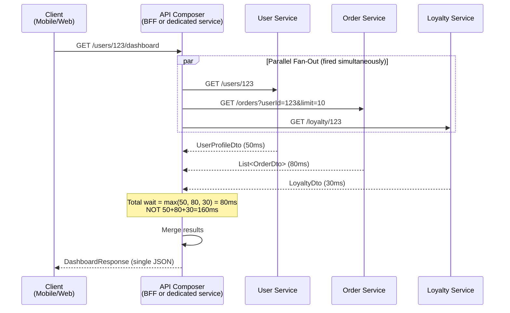

# API Composition

**API Composition** is a pattern where a composing service fulfills a query by calling multiple microservice APIs in parallel, waiting for their responses, and merging the results into a single response — replacing the SQL `JOIN` operations that are impossible when each service owns its own database.

> **It is the simplest solution to cross-service data retrieval.** Before reaching for CQRS or event-sourced read models, try API Composition. Most queries involving 2–5 services can be satisfied efficiently with well-implemented parallel fan-out.

---

## 👶 Beginner: The "Missing JOIN" Problem

In a monolith with a shared database:
```sql
-- A single query assembles a complete user dashboard
SELECT u.name, u.email, o.id, o.total, o.status, p.points, p.tier
FROM users u
JOIN orders o ON u.id = o.user_id
JOIN loyalty_points p ON u.id = p.user_id
WHERE u.id = 123
ORDER BY o.created_at DESC
LIMIT 10;
```

In microservices, this is impossible. Each service is behind a network boundary:

```text
User Service    →  owns users table         → db.users.internal:5432
Order Service   →  owns orders table        → db.orders.internal:5432
Loyalty Service →  owns loyalty_points table → db.loyalty.internal:5432
```

API Composition replaces the SQL JOIN with programmatic stitching.

---

## 🏗️ Architecture



---

## ⚙️ Implementation: Java with CompletableFuture + Virtual Threads

### Basic Implementation

```java
@Service
@RequiredArgsConstructor
@Slf4j
public class UserDashboardComposer {

    private final UserServiceClient userClient;
    private final OrderServiceClient orderClient;
    private final LoyaltyServiceClient loyaltyClient;

    // Virtual threads (Java 21+) — much lighter than platform threads
    // A single JVM can handle millions of virtual threads concurrently
    private final Executor executor = Executors.newVirtualThreadPerTaskExecutor();

    public DashboardResponse getDashboard(String userId) {
        long start = System.currentTimeMillis();

        // Step 1: Fire all calls simultaneously
        CompletableFuture<UserProfileDto> userFuture =
            CompletableFuture.supplyAsync(() -> userClient.getUser(userId), executor);

        CompletableFuture<List<OrderDto>> ordersFuture =
            CompletableFuture.supplyAsync(() -> orderClient.getOrders(userId, 10), executor);

        CompletableFuture<LoyaltyDto> loyaltyFuture =
            CompletableFuture.supplyAsync(() -> loyaltyClient.getPoints(userId), executor);

        // Step 2: Wait for all with a hard global timeout (SLA = 3 seconds)
        try {
            CompletableFuture.allOf(userFuture, ordersFuture, loyaltyFuture)
                .get(3, TimeUnit.SECONDS);
        } catch (TimeoutException e) {
            log.warn("Dashboard composition timeout after {}ms for userId={}",
                System.currentTimeMillis() - start, userId);
            // Don't fail — collect whatever completed within the timeout
        } catch (Exception e) {
            throw new CompositionException("Dashboard composition failed", e);
        }

        // Step 3: Assemble — getNow(default) returns result if done, default if not
        return DashboardResponse.builder()
            .user(userFuture.getNow(null))
            .orders(ordersFuture.getNow(List.of()))
            .loyalty(loyaltyFuture.getNow(LoyaltyDto.empty()))
            .compositionTimeMs(System.currentTimeMillis() - start)
            .build();
    }
}
```

### Production-Grade: With Per-Service Timeouts and Circuit Breakers

```java
@Service
@RequiredArgsConstructor
@Slf4j
public class ResilientDashboardComposer {

    private final UserServiceClient userClient;
    private final OrderServiceClient orderClient;
    private final LoyaltyServiceClient loyaltyClient;
    private final CircuitBreakerRegistry circuitBreakerRegistry;
    private final Executor executor = Executors.newVirtualThreadPerTaskExecutor();

    public DashboardResponse getDashboard(String userId) {
        // Each future has its own resilience: timeout + circuit breaker + fallback
        CompletableFuture<UserProfileDto> userFuture = callWithResilience(
            "user-service",
            () -> userClient.getUser(userId),
            this::userFallback,
            1500   // User data critical: 1.5s timeout
        );

        CompletableFuture<List<OrderDto>> ordersFuture = callWithResilience(
            "order-service",
            () -> orderClient.getOrders(userId, 10),
            () -> List.of(),   // Orders: return empty list on failure
            2000
        );

        CompletableFuture<LoyaltyDto> loyaltyFuture = callWithResilience(
            "loyalty-service",
            () -> loyaltyClient.getPoints(userId),
            LoyaltyDto::empty, // Loyalty optional: never block dashboard
            500
        );

        // Global timeout acts as safety net if per-service timeouts don't fire
        try {
            CompletableFuture.allOf(userFuture, ordersFuture, loyaltyFuture)
                .get(3, TimeUnit.SECONDS);
        } catch (TimeoutException ignored) { /* individual fallbacks already applied */ }
        catch (Exception e) { throw new CompositionException(e); }

        return DashboardResponse.builder()
            .user(userFuture.getNow(null))
            .orders(ordersFuture.getNow(List.of()))
            .loyalty(loyaltyFuture.getNow(LoyaltyDto.empty()))
            .build();
    }

    private <T> CompletableFuture<T> callWithResilience(
            String serviceName,
            Supplier<T> serviceCall,
            Supplier<T> fallback,
            long timeoutMs) {

        CircuitBreaker cb = circuitBreakerRegistry.circuitBreaker(serviceName);

        return CompletableFuture
            .supplyAsync(() -> cb.executeSupplier(serviceCall), executor)
            .orTimeout(timeoutMs, TimeUnit.MILLISECONDS)
            .exceptionally(ex -> {
                if (ex instanceof CallNotPermittedException) {
                    log.warn("{} circuit breaker OPEN — using fallback", serviceName);
                } else if (ex instanceof TimeoutException) {
                    log.warn("{} timed out after {}ms — using fallback", serviceName, timeoutMs);
                } else {
                    log.error("{} failed — using fallback: {}", serviceName, ex.getMessage());
                }
                return fallback.get();
            });
    }

    private UserProfileDto userFallback() {
        // Return a minimal degraded response instead of null
        return UserProfileDto.degraded(); // { id: null, name: "Unknown", ... }
    }
}
```

---

## 🛑 The N+1 Composition Problem

The most dangerous anti-pattern in API Composition:

### ❌ The Problem: 100 orders × 1 user call each = 100 network round trips

```java
// This looks innocent but is catastrophically slow
public List<EnrichedOrderDto> getEnrichedOrders(String userId) {
    List<OrderDto> orders = orderClient.getOrders(userId);  // Returns 100 orders

    // ❌ ANTI-PATTERN: N+1 — one HTTP call per order!
    return orders.stream()
        .map(order -> {
            UserDto seller = userClient.getUser(order.getSellerId()); // 100 HTTP calls!
            return new EnrichedOrderDto(order, seller);
        })
        .toList();
}
// Total: 1 + 100 HTTP calls. At 50ms each: 100 × 50ms = 5 SECONDS
```

### ✅ Fix 1: Batch API

```java
// The correct pattern: one batch call instead of N individual calls
public List<EnrichedOrderDto> getEnrichedOrders(String userId) {
    List<OrderDto> orders = orderClient.getOrders(userId);  // 100 orders

    // Extract all unique seller IDs
    Set<String> sellerIds = orders.stream()
        .map(OrderDto::getSellerId)
        .collect(Collectors.toSet());

    // ONE batch call for all sellers
    Map<String, UserDto> sellerMap = userClient.getUsersBatch(sellerIds)
        .stream()
        .collect(Collectors.toMap(UserDto::getId, u -> u));
    // GET /users?ids=seller1,seller2,seller3,...

    // Merge in memory — no more network calls
    return orders.stream()
        .map(order -> new EnrichedOrderDto(order, sellerMap.get(order.getSellerId())))
        .toList();
}
// Total: 2 HTTP calls. At 50ms + 80ms = 130ms (vs 5 seconds)
```

### ✅ Fix 2: Parallel Calls with Fan-Out for Known IDs

```java
// When you have a fixed set of known IDs at composition time
public List<EnrichedOrderDto> getOrdersWithSellers(List<String> orderIds) {
    // Fan out all order fetches in parallel
    List<CompletableFuture<EnrichedOrderDto>> futures = orderIds.stream()
        .map(orderId -> CompletableFuture.supplyAsync(() -> {
            OrderDto order = orderClient.getOrder(orderId);
            UserDto seller = userClient.getUser(order.getSellerId()); // Only 1 user per order
            return new EnrichedOrderDto(order, seller);
        }, executor))
        .toList();

    // Wait for all
    return futures.stream()
        .map(CompletableFuture::join)
        .toList();
}
```

---

## 🔀 API Composition vs. CQRS: Choosing the Right Tool

| Scenario | Use API Composition | Use CQRS Read Model |
| :--- | :---: | :---: |
| Query across 2–4 services, straightforward merge | ✅ | |
| All component services have < 200ms latency | ✅ | |
| Data must always be fresh (no staleness acceptable) | ✅ | |
| Query involves aggregations (SUM, AVG, GROUP BY across services) | | ✅ |
| One or more services frequently degrades / times out | | ✅ |
| Complex sorting/filtering across data from different services | | ✅ |
| Query serves a high-traffic read endpoint (>1000 RPS) | | ✅ |
| Data can tolerate seconds of eventual consistency lag | | ✅ |

**Decision rule:** Start with API Composition. If it causes latency issues, availability coupling, or complexity from complex merging logic — graduate to CQRS.

---

## 📊 Partial Response Strategy

A mature composer never fails completely when one downstream service is degraded:

```java
// DashboardResponse with degradation metadata
@Builder
public class DashboardResponse {
    private UserProfileDto user;
    private List<OrderDto> orders;
    private LoyaltyDto loyalty;
    private boolean degraded;
    private List<String> unavailableServices;
    private long compositionTimeMs;
}
```

```json
// Response when Loyalty Service is down — client handles gracefully
{
  "user": { "name": "Alice", "email": "alice@example.com" },
  "orders": [ { "id": "123", "status": "DELIVERED", "total": 49.99 } ],
  "loyalty": null,
  "_meta": {
    "degraded": true,
    "unavailableServices": ["loyalty-service"],
    "compositionTimeMs": 1542
  }
}
```

The client reads `_meta.degraded` and shows a placeholder in the loyalty section instead of failing the entire screen.

---

## 🔍 Caching Composed Responses

Composition results can be cached at the BFF/Composer level to reduce downstream load:

```java
@Cacheable(
    value = "dashboard-cache",
    key = "#userId",
    condition = "!#result.degraded",   // Don't cache degraded responses
    unless = "#result.user == null"    // Don't cache if user data missing
)
public DashboardResponse getDashboard(String userId) {
    return composer.compose(userId);
}

// TTL strategy by data volatility:
// User profile: 5 minutes (rarely changes)
// Recent orders: 30 seconds (changes often)
// Loyalty points: 60 seconds (updates on purchases)
```

---

## ⚠️ Pros vs. Cons

| Pros | Cons |
| :--- | :--- |
| **Simplest implementation** — just HTTP calls in parallel | **Availability coupling** — if User Service has 99.9% availability, composed dashboard = 99.9% × 99.9% × 99.9% = 99.7% |
| **Always fresh data** — no eventual consistency lag | **Latency floor** — total time = slowest service in the parallel set |
| **No event infrastructure needed** — just REST/gRPC | **N+1 risk** — requires disciplined use of batch APIs |
| **Easy to debug** — standard HTTP call chain with trace IDs | **Complex merging** — cross-service pagination and sorting is extremely hard |

---

## ❗ Common Gotchas & Anti-Patterns

1. **Sequential Instead of Parallel:**
   - *Anti-Pattern:* `user = await getUser(); orders = await getOrders();` — calls wait for each other.
   - *Fix:* `[user, orders] = await Promise.all([getUser(), getOrders()])` or `CompletableFuture.allOf(...)`.

2. **No Timeout on Individual Services:**
   - *Anti-Pattern:* Loyalty Service hangs for 30 seconds — all dashboard requests hang for 30 seconds.
   - *Fix:* `.orTimeout(500, MILLISECONDS)` per future + `.exceptionally()` fallback. Always set explicit per-call timeouts.

3. **Blocking the Calling Thread:**
   - *Anti-Pattern:* Using `CompletableFuture.supplyAsync(callable)` with the ForkJoinPool — ties up threads needed for other request handling.
   - *Fix:* Use a dedicated executor (Virtual Thread executor in Java 21, or a dedicated bounded thread pool in older Java).

4. **Not Handling Partial Success:**
   - *Anti-Pattern:* One service returns 404 → entire composition throws an exception → HTTP 500 to the client.
   - *Fix:* Use `.exceptionally(ex -> fallbackValue)` per future. 404 from Loyalty Service means `loyalty = null`, not `HTTP 500`.

5. **Composing Inside Domain Services:**
   - *Anti-Pattern:* Order Service calling User Service to enrich order responses — creates hidden service-to-service dependencies.
   - *Fix:* Composition belongs in the BFF or a dedicated API Composer service. Domain services must stay single-purpose.
